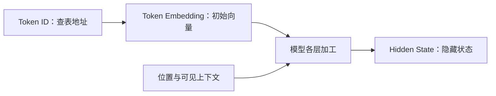

# 表示与计算：从 Token ID 到 Embedding 与 Hidden State

一句话被分成 Token、再变成编号之后，模型怎样继续处理它？

例如，模型接收到三个编号 `[1,4,1]`。我们能看出第一个和第三个编号相同，却还不知道模型会怎样利用它们。编号只是地址；接下来，模型要先按地址取出一组数字，再结合位置与上下文加工这些数字。

这就是第一阶段“文字怎样进入模型”中，**表示与计算**这一小节要讲清楚的过程：



本文对应《AI学习目录》第 02 课“Embedding 是可计算的表示”，学习目标依据《32课学习设计与掌握目标》中该课的要求。读完并独立完成练习后，你应能解释查表过程，分清初始向量、隐藏状态和检索向量，并判断为什么“向量相近”仍需回到原文核对。

你只需要会读数字列表、做简单加乘。正文中的编号、向量和合同例子都是教学材料，不对应真实模型词表、实际检索结果或真实合同。

## 先补一小步：文字、Token 和编号

原始文字经过分词器后，会被切成若干片段。这些片段叫 **Token**，每个片段再对应词表中的一个整数编号，叫 **Token ID**。

例如，课程把“猫吃鱼”假设切成“猫”“吃”“鱼”，再假设编号为 `7、12、25`。这是为了说明流程；实际模型怎样切、采用哪些编号，要看它使用的分词器。

这一节从编号已经确定的地方开始。请先记住：**ID 告诉模型去哪里取数据；编号的大小不能用来判断含义、重要性或语义距离**。[^编号]

## 一、Embedding：按编号取出一组数字

### 一组有顺序的数，就是这里说的向量

先看这个列表：

```text
[1, 0, 2]
```

它有三个按顺序排列的数字，所以叫三维向量。“维度”在这里就是一组数里有多少个坐标：有三个坐标是三维，有四个坐标是四维。

顺序也属于表示的一部分。`[1,0,2]` 和 `[2,0,1]` 虽然用了相同的三个数字，但数字所在的位置不同，是两个不同的向量。

二维向量可以画成平面上的点或箭头，帮助我们观察方向。三维以上仍然能用数字参与运算，理解查表并不要求把所有维度画出来。

这些坐标用于模型计算。**真实模型的某一维没有天然固定的“动物”“情绪”或“事实正确性”标签**。不能看见一个数字较大，就认定模型“更懂这个词”或“更相信这句话”。[^表示]

### Token Embedding 可以看成一张数字表

在本课讨论的普通 Token Embedding 中，模型保存一张表：每个 Token ID 对应一行数字。输入一个 ID，就取出对应的那一行。这个过程叫 **Embedding 查表**。[^表示]

沿用课程的教学表，我们只展示其中三行：

| 教学 Token ID | 取出的初始向量 |
| --- | --- |
| 1 | `[1,0,2]` |
| 4 | `[0,2,1]` |
| 5 | `[1,1,0]` |

表中没有展示其他行，也没有为这些 ID 指定真实文字片段。现在输入：

```text
[1, 4, 1]
```

按输入顺序查三次：

1. 第一个位置是 ID `1`，取出 `[1,0,2]`。
2. 第二个位置是 ID `4`，取出 `[0,2,1]`。
3. 第三个位置又是 ID `1`，再次取出 `[1,0,2]`。

把结果按位置排好：

```text
输入编号：
[1, 4, 1]

查表结果：
[
  [1, 0, 2],   ← 第一个位置
  [0, 2, 1],   ← 第二个位置
  [1, 0, 2]    ← 第三个位置
]
```

这里没有用 ID `1` 乘某个数字，也没有对 ID `4` 求平均。做的事情就是：**用编号找到对应行，再取出该行向量**。

### 地址、位置和坐标，是三个不同问题

这组例子里出现了好几个“1”，含义要分别看：

| 你在问什么 | 本例中的答案 |
| --- | --- |
| 查哪一行？ | Token ID 为 `1` 的那一行 |
| 这个 Token 在输入的哪里？ | 第一个位置，或第三个位置 |
| 这一行里存了什么？ | 三个坐标 `[1,0,2]` |

ID 为 `1` 的 Token 可以出现在多个输入位置。输入位置决定它在序列中的先后；ID 决定查表地址；向量里的三个坐标是后续计算使用的数字。

### 表里的数字从哪里来？

Token Embedding 表属于模型参数的一部分，可以在模型训练中被更新。普通推理时，模型使用已有参数；本轮查表本身不会把用户输入写回参数表。训练如何更新这些数，是后面第 24 课的问题。[^表示]

因此，这里“相同 ID 取出相同向量”的前提是：**使用同一张固定的 Token Embedding 表，并且比较纯查表结果**。换一张表，就要重新核对其中保存的数字。

## 二、相同初始向量，为什么还会有不同隐藏状态？

在 `[1,4,1]` 这个例子里，第一个和第三个位置查出的向量完全一样。这是否意味着它们在模型内部一路都一样 (这两个位置从查表开始，得到相同的一个向量，经过模型内部各层计算，直到最后一层，它们的向量是否始终彼此相同)？

要回答这个问题，需要把**起点**和**加工后的状态**分开。

### 初始向量提供起点，后续计算加入当前信息

刚查表时，两个 ID `1` 都取出 `[1,0,2]`。查表这一步没有根据整句话重新选择一行，也没有为第二次出现的 ID `1` 另造一个初始向量。

进入后续模型计算后，位置和可见上下文会影响每个位置的表示。Attention 可以把可见位置的信息汇入当前状态，其他层内计算继续加工数字。某一层、某一位置得到的状态，称为 **Hidden State，隐藏状态**。[^表示]

可以这样区分：

> Token Embedding 是这个 Token 刚从表里取出的初始表示；Hidden State 是模型加工过程中，这个位置目前得到的表示。

隐藏状态也可以是一组有顺序的数。它和初始向量的区别在于**计算位置与用途**，不能只看数字列表的外观。

### 同一个 Token，所在位置的可见信息可以不同

仍看 `[1,4,1]`。如果放在普通因果生成模型中，第一个位置不能读取后面的 ID `4` 和 ID `1`；第三个位置则可以使用前面已经出现的内容。两者的位置也不同，因此后续状态可以不同。这里仅说明一种可见范围，不把它套到所有模型架构。[^架构]

这并没有改变查表结果：两个位置的初始向量仍是 `[1,0,2]`。改变的是后续计算所使用的信息与计算后的状态。

用自然语言建立直觉也很容易：“合同已生效”和“合同未生效”都谈合同，但周围的“已”和“未”会影响整句话的解释。我们没有指定真实分词结果，也不假设“合同”一定是一个 Token；这个例子只是帮助你理解上下文为什么有用。

### “可以不同”，不等于“一定不同”

这一节需要记准的是：

**在同一固定表中，同一 ID 的初始查表向量相同；位置与可见上下文参与后续计算后，隐藏状态可以不同**。

这句话既不保证后续状态仍然相同，也不保证只要换了位置就必然不同。是否相同，需要看实际模型、具体层、具体位置与计算结果。仅凭“两个 ID 相同”，无法推出最终状态相同。[^表示]

现在你已经知道“表示与计算”中的两步分别做什么：查表提供起点，上下文计算形成当前状态。Attention、MLP 和位置机制的具体公式，留到第 04—06 课再展开。

## 三、检索也叫 Embedding，它在做什么？

学习知识库问答时，你还会遇到“给文章做 Embedding”“用向量查资料”。它们通常指 **检索 Embedding**，用途与刚才逐 Token 查表不同。[^检索]

假设知识库里有很多段文字，用户问：“合同是否已经生效？”一个典型的检索流程会：

1. 使用检索模型，把资料片段编码为检索向量。
2. 使用配套的编码方式，把问题也编码为可比较的向量。
3. 比较问题向量与资料向量，找出较相关的片段。
4. 读取这些片段的原文，核对它们能支持什么回答。

这里输入的是问题或整段文字。编码器会处理文本并聚合信息，通常为每段得到一个检索向量。**不能把整个过程概括成“按一个 Token ID 查一行**”。[^检索]

把四种对象放到一起，就能看清用途：

| 对象 | 从哪里来 | 主要用来做什么 |
| --- | --- | --- |
| Token ID | 分词后的片段映射到词表编号 | 指定 Token Embedding 的查表地址 |
| Token 初始向量 | 从固定 Token Embedding 表取出对应行 | 为生成模型提供每个位置的初始表示 |
| Hidden State | 模型各层对某个位置进行计算后得到 | 承载该位置当前的上下文计算结果，供后续层或输出计算使用 |
| 段落检索向量 | 检索模型编码并聚合一段文字 | 与查询向量比较，用于资料召回 |

前三行帮助你沿着模型输入理解内部计算；第四行帮助应用找到资料。它们的具体维度和生成方法，需要查看所用模型，不能因为都叫“向量”就互换。任意取一层 Hidden State，也不能自动认定它是合格的段落检索表示。[^检索]

## 四、向量相近，为什么仍要核对原文？

检索希望找到“与问题相关的资料”。但相关资料可能讨论同一件事，也可能给出相反结论。

课程用了一个很直接的对照：

> 合同已生效。
>
> 合同未生效。

两句话的话题和大部分文字相同，检索向量可能很接近。可是在“是否生效”这个问题上，它们给出的答案相反。相近的表示没有消除那个“未”字。[^检索]

这里没有实际运行某个检索模型，因此不声称这两句话的真实相似度是多少。例子要说明的是：**相似度是找资料的线索，事实结论仍然要由适用的原文支持**。

当你拿到一段相近资料时，至少核对这些地方：

| 核对项 | 为什么它会改变结论 | 应该怎样检查 |
| --- | --- | --- |
| 否定 | “已生效”和“未生效”含义相反 | 读完整句子，保留“未”“不”等字 |
| 对象 | 关于合同甲的结论，不直接说明合同乙的状态 | 确认资料说的是问题中的同一对象 |
| 时间 | 过去某个时点的状态，不自动说明当前状态 | 对齐问题时间、资料时间与适用版本 |
| 条件 | “满足条件才生效”不等于“已经生效” | 查明必要条件及其是否满足 |
| 原文依据 | 相似度数值本身没有说明结论来自哪句话 | 定位具体句子，检查它支持的范围 |

这张表是把课程的核验要求整理成实际阅读动作。它也解释了为什么知识库助手找到一篇文章之后，仍然需要读原文：检索完成的是“找到相关材料”，接下来还要判断“材料是否支持当前结论”。

## 五、先合上文章，完成四个基础检查

基础达标以这四题为准。建议先在纸上写答案，再读下一节对照。写出概念之间的关系，比重复“Embedding 是向量”更能检验理解。

### 检查 1：按表查出结果

沿用前面的三行教学表，输入改成：

```text
[5, 1, 4, 5]
```

写出完整查表结果，再回答：为什么第一个和第四个位置得到相同初始向量？这些 ID 的大小能说明它们的语义距离吗？

### 检查 2：找出结论里多走的一步

有人说：“第一个和第三个 Token 都是 ID `1`，所以它们在模型最后一层的隐藏状态也一定相同。”

请指出哪个前提只能保证哪一步，并说明后面还会加入什么信息。能否进一步断言它们一定不同？

### 检查 3：给四张卡片写用途

分别为以下卡片写一句用途，再标出它属于哪个过程：分词编号、初始查表、上下文加工，或资料检索。

- Token ID。
- Token 初始向量。
- Hidden State。
- 段落检索向量。

如果只写“第二、三、四张都是向量”，还没有回答用途。

### 检查 4：处理一条相近资料

问题是“合同甲现在是否已生效”，检索返回一段有关“合同未生效”的文字，并显示它与问题很相近。

你能否只凭相似度回答“已生效”？在作出事实结论之前，还需要核对哪些信息？如果材料没有说明合同对象或适用时间，你应该怎样处理？

## 六、对照答案与达标标准

### 检查 1 的答案

```text
[
  [1, 1, 0],
  [1, 0, 2],
  [0, 2, 1],
  [1, 1, 0]
]
```

第一个和第四个位置都用 ID `5` 查同一固定表的同一行，所以初始向量相同。ID 大小是编号关系，没有语义距离的保证。

**过关点**：每个位置都按 ID 取对行，并能分别说明地址、输入位置和向量坐标。

### 检查 2 的答案

同一固定表中的同一 ID，保证纯查表得到的初始向量相同。最终隐藏状态还经过位置机制与可见上下文计算，不能直接从初始向量相同推出最终状态相同。

也不能仅凭位置不同就断言状态一定不同。准确说法是：**后续状态可以不同，具体是否不同要看计算结果**。

**过关点**：既分清初始表示与后续状态，又保留“可以不同”的边界。

### 检查 3 的答案

| 卡片 | 一句合格解释 | 所属过程 |
| --- | --- | --- |
| Token ID | 分词片段对应的整数编号，用来指定查表地址 | 分词编号 |
| Token 初始向量 | 按 ID 从表里取出的数字，作为每个位置的计算起点 | 初始查表 |
| Hidden State | 某层某位置经过模型计算后得到的当前表示 | 上下文加工 |
| 段落检索向量 | 检索模型为一段文字形成的表示，用来比较相关性 | 资料检索 |

**过关点**：四张卡都能说清来源和用途，尤其能把 Token 查表与整段文字检索分开。

### 检查 4 的答案

不能只凭相似度回答“已生效”。相近表示相关性；“未生效”这个否定必须保留。还要核对原文是否针对合同甲、适用哪个时间或版本、是否有附加条件，以及哪一句能支持结论。

若对象或时间缺失，只能说明资料涉及该话题，并指出缺少的信息；需要继续找依据或请用户补充，不能自行补成“合同甲现在已生效”或“现在未生效”。

**过关点**：能区分检索信号与事实证据，核对否定、对象、时间、条件，并在材料不足时明确缺口。

### 怎样判断自己已掌握？

四题都能独立完成，并能换成自己的话解释，就覆盖了本小节的四项基础掌握要求。若某题依赖照抄答案，按下表回读，再换一组输入或问题重做。

| 卡住的位置 | 回读哪里 |
| --- | --- |
| 不知道如何把 ID 变成数字列表 | 第一节的查表例子 |
| 把重复 ID 当成相同最终状态 | 第二节的起点与加工过程 |
| 觉得所有 Embedding 都是同一种对象 | 第三节的四类对象对照 |
| 想用相似度直接判断事实 | 第四节的原文核验表 |

文章与练习提供的是达标路径；是否已经掌握，应由你的独立作答和解释来确认。

## 七、可选进阶：看懂 Shape 与余弦相似度

这一节补充第 02 课的选读目标。暂时不计算，也可以完成前面的基础检查。

### 第一节的查表结果，怎样用 Shape 描述？

回看第一节的输入 `[1,4,1]`。三个位置查出的向量分别是：

| 输入位置 | Token ID | 查出的向量 |
| --- | --- | --- |
| 第 1 个位置 | 1 | `[1,0,2]` |
| 第 2 个位置 | 4 | `[0,2,1]` |
| 第 3 个位置 | 1 | `[1,0,2]` |

第一节把这三个向量按位置排在一起，每个向量占一行。这样得到的数字表有三行，每行三个数，也就是一个 **3 行 × 3 列的 Matrix**（矩阵）。Matrix 在这里就是按行、列排好的数字表。用一组数记录它有几行、几列，就是在描述它的 **Shape**：本例写作 `(3,3)`。[^形状]

- 第一个 `3` 表示三行，对应三个输入位置。
- 第二个 `3` 表示三列，对应每个向量的三个坐标。

第一个和第三个位置虽然都是 ID `1`，查出的向量也相同，但它们各占一行。**重复编号不会合并输入位置**，所以结果仍是三行。

现在也能分清前文的“三维向量”和这里的 Shape：三维向量说的是一行里有三个坐标，`(3,3)` 说的是整张表有三行、三列。Shape 只记录这些数量；表里具体存的是哪些数字，要看向量本身。

### 两条序列一起处理，Shape 怎样读？

基础检查 1 的输入 `[5,1,4,5]` 有四个位置，因此查表结果有四行，每行仍是三个数，Shape 就是 `(4,3)`。

如果一起处理两条这样的四位置序列，就会得到两张四行三列的数字表。把两条序列的结果放在一起，Shape 就写成 `(2,4,3)`：两条序列、每条四个位置、每个位置三个数。

这里的 `2` 就是“批次”大小，也就是一起处理的序列数。这里假定输入已经排成等长的四个位置，不展开补齐规则。[^形状]

| 对象 | 教学 Shape | 怎样读 |
| --- | --- | --- |
| 词表有 7 项，每项向量有 3 个坐标的权重表 | `(7,3)` | 七个可查地址，每行三个数 |
| 两条序列，每条 4 个 ID | `(2,4)` | 两条序列，每条四个位置 |
| 上述输入经过三维 Embedding 查表 | `(2,4,3)` | 两条序列、四个位置、每位置三个坐标 |
| 在本课三维设置下，取一个位置的隐藏状态 | `(3)` | 这个位置的一组三个数 |

特别注意：**整张权重表有多少行**与**本次输入有多少个位置**是两件事。词表有七项，不代表一句话必须有七个 Token；同一个 ID 也可以重复出现在多个位置。

小练习：沿用基础检查 1 的输入 `[5,1,4,5]`，如果只看第一个位置查出的向量 `[1,1,0]`，它的 Shape 是什么？

答案是 `(3)`：只取一个向量，它有三个坐标。把四个位置的向量都排在一起，才得到 Shape 为 `(4,3)` 的数字表。

### 余弦相似度：比较方向的一种方式

课程用三组人工设置的检索向量说明计算：

```text
u = [1,0,1]
v = [2,0,2]
w = [0,1,0]
```

这些向量没有绑定实际文字，坐标也没有预设的概念标签。

先认识两个操作：

1. **点积**：相同坐标位置的数字相乘，再相加。
2. **长度**：把各坐标平方后相加，再开平方。

余弦相似度就是“点积除以两个长度的乘积”。先算 `u` 与 `v`：

```text
点积：1×2 + 0×0 + 1×2 = 4
u 的长度：√(1²+0²+1²) = √2
v 的长度：√(2²+0²+2²) = √8
余弦相似度：4 ÷ (√2×√8) = 1
```

`v` 是 `u` 的两倍，长度不同，方向相同，所以余弦相似度为 `1`。相似度为 `1` 并不说明两个数字列表完全相同。

再算 `u` 与 `w`：

```text
点积：1×0 + 0×1 + 1×0 = 0
w 的长度：1
余弦相似度：0 ÷ (√2×1) = 0
```

这两组数的方向在数学上相互垂直。对于非零向量，余弦相似度的范围是 `−1` 到 `1`；零向量的长度为零，不能直接套这个除法。[^形状]

把数学结论与事实判断分开：上面的 `1` 和 `0` 描述人为向量的方向关系，没有衡量任何合同是否生效。**余弦相似度不是事实正确率，也不是“结论为真的概率**”。具体检索模型怎样编码、怎样比较，仍要读对应实现与文档。[^检索]

## 带着这张图继续下一课

现在，你应该能把本小节的流程讲完整：

> Token ID 指定地址；Token Embedding 查表取出初始向量；模型结合位置与可见上下文加工表示，得到各层各位置的 Hidden State。检索模型则为问题或资料片段形成用于比较的向量，相近结果仍要回到原文检查事实。

接下来的第 03 课会从计算后的状态继续往外走，解释词表分数与下一项选择。第 04—06 课会回到这里，展开数字怎样被加工、不同位置怎样交流。

完整数据流与表示层级的讲解可参阅 [Token 与 Embedding 原讲解](https://www.bilibili.com/video/BV1oNv8BPE2m)及 [Token Space 与 Latent Space 原讲解](https://www.bilibili.com/video/BV1ABRyBqEoR)。

## 依据与回查

本文围绕两份课程文档组织教学，使用已有原始资料核对机制。练习是教学检查，没有开展真实初学者试读，也没有运行真实生成模型或检索服务。

[^编号]: [Token 与 Embedding 原讲解](https://www.bilibili.com/video/BV1oNv8BPE2m)，用于回看 Tokenizer 与 Token ID 的区别。“猫吃鱼”切分与编号来自《AI学习目录》第 01 课，仅为教学约定。
[^表示]: [Token 与 Embedding 原讲解](https://www.bilibili.com/video/BV1oNv8BPE2m)及 [Token Space 与 Latent Space 原讲解](https://www.bilibili.com/video/BV1ABRyBqEoR)，用于回看初始表示与隐藏状态；[PyTorch 官方 Embedding 文档](https://docs.pytorch.org/docs/2.14/generated/torch.nn.Embedding.html)的 Variables、Shape 说明查表权重与输出形状。本文查表数值与固定表边界采用《AI学习目录》第 02 课及其掌握要求中的教学设置。
[^架构]: [Transformer如何成为AI模型的地基](https://www.bilibili.com/video/BV1k6yWBEEmH)，用于回看编码器、解码器与模型分支。这里仅用普通因果生成的可见范围说明上下文差异，课程中的完整比较在第 06 课。
[^检索]: [Token 与 Embedding 原讲解](https://www.bilibili.com/video/BV1oNv8BPE2m)，用于回看生成模型的 Token 表示与 RAG 检索表示。“合同已生效／合同未生效”及核查否定、对象、时间、条件的要求来自《AI学习目录》第 02 课，属于教学对照，没有实际检索相似度测量。
[^形状]: [PyTorch 官方 Embedding 文档](https://docs.pytorch.org/docs/2.14/generated/torch.nn.Embedding.html)的 Variables、Shape 支持权重表与输出维度的说明。本文形状与余弦数值采用《AI学习目录》第 02 课选读中的教学设置；余弦范围与零向量限制由文中公式直接推出，算例不代表真实模型测量。
