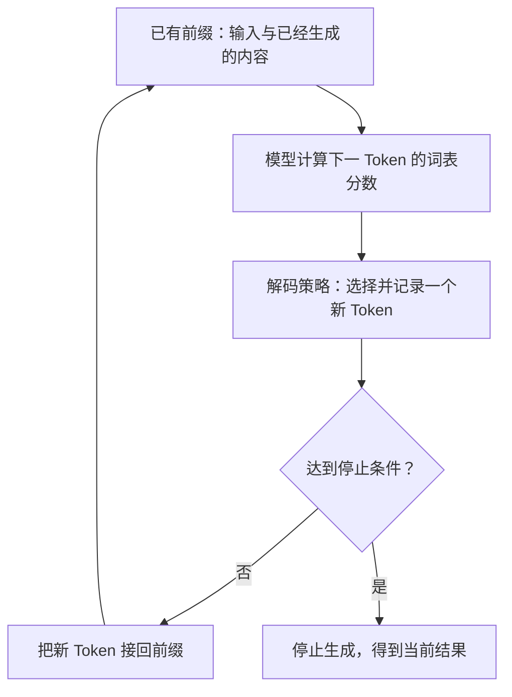

# 输出再输入：模型怎样逐步生成下一个 Token

前两节里，文字已经被转换成 Token ID，再经过查表和上下文计算，形成了 Hidden State。接下来，这些内部状态怎样变成你看见的一句回答？

先看一个很小的场景：已有文字是“猫在”。这一步选出“睡”，已有文字就变成“猫在睡”；下一步再以更新后的内容为条件，计算接下来选什么。

刚生成的内容进入了后续计算。这就是第一阶段第三小节 **输出再输入**要解释的循环。



本文对应《AI学习目录》第 03 课“输出是逐步生成的”，目标依据《32课学习设计与掌握目标》中该课的要求。读完并完成练习后，你应能：

1. 画出“已有前缀→词表分数→选新 Token→接回前缀→再次生成”的循环。
2. 分清 Logits 原始分数与概率，解释负分数为什么不等于负概率。
3. 区分贪心与采样，说明最高概率项为什么不是采样时唯一可能选到的项。
4. 解释更新前缀后为什么不能继续沿用旧概率表，并说明生成怎样停止。
5. 说明温度改变的是分布的分散程度，不会补进缺失事实。

这里讲的是**普通自回归逐 Token 生成**，不把同一流程套到所有模型架构。所有分数、概率、词表项和随机数都来自课程教学设置或明示的练习条件，不是真实模型测量。[^循环]

## 先补一小步：Token、隐藏状态与前缀

**Token** 是分词器处理文字时使用的单元，可以是字、词的一部分或其他片段。**Token ID** 是编号。模型按编号查出初始向量，再结合位置与可见上下文，得到各层各位置的 **Hidden State，隐藏状态**。[^表示]

在本课的生成流程中，相关位置的隐藏状态再经过输出投影，得到词表项的原始分数。输出投影可以先理解为“把当前位置的一组内部数字，转换成对词表各项的评分”；具体矩阵运算留给后续课程。[^表示]

这一步计算要依赖已经提供和已经生成的内容。我们把本次接续生成前已经有的 Token 序列叫**前缀**。

本例用“猫在”表示最初的前缀。选出“睡”后，前缀更新成“猫在睡”；如果选出的是“吃”，前缀就更新成“猫在吃”。

“下一轮”在这里指**一次生成内部的下一步计算**，不是要求用户再发一条消息，也不是每生成一个 Token 就另发一次模型 API 请求。文字只是帮助观察；模型接续使用的是 Token 及相应计算状态。

## 一、一次生成只决定下一项，结果怎样逐步变长？

沿着“猫在”这个例子，一步可以拆成四个动作：

1. 使用已有前缀进行模型计算。
2. 给下一 Token 的词表项计算分数。
3. 按解码策略选出一项，记入本次生成记录。
4. 检查停止条件；若继续，把这项加入后续生成。

这里的**解码策略**是“怎样根据分数或概率选择下一项”。它与第一节中“把 ID 还原成可读文字”的文本解码处在不同位置：一个负责选择，另一个负责显示对应内容。

例如，第一步选择“睡”：

```text
本轮已有前缀：猫在
本轮选出的新 Token：睡
更新后的前缀：猫在睡
下一步据此重新计算
```

更新后的内容会影响下一项选择。所以，这条回复逐步增长，后面的内容依赖前面已经选择的内容。这个过程称为**自回归生成**。[^循环]

### 重新计算下一项，不等于重算全部历史

下面会反复出现“下一步重新计算”。它的意思是：根据更新后的条件，得到下一位置的分数。

实际实现可以用 **KV Cache，历史 Key 与 Value 的缓存**复用已经处理位置的部分计算。新 Token 仍然要参与后续处理，模型仍然要决定下一项；缓存不会让第一步的输出分布自动成为以后每一步的分布。[^表示]

缓存怎样保存和增长留到第 26 课。本节只需分清：**复用历史计算与继续生成下一项，是两件同时可以成立的事**。

## 二、先有 Logits 分数，才有本步的概率

为了看清区别，课程把本轮输出选择简化为四项：“睡”“吃”“跑”和“结束符”。这只是教学输出表，没有为输入文字定义完整词表，也没有提供一个可运行的真实模型。

在前缀为“猫在”时，规定原始分数为：

```text
睡：2
吃：1
跑：0
结束符：−1
```

这些原始分数叫 **Logits**。它们可以为正、为零或为负，也不需要加起来等于 `1`。这里的 `2` 不是 `2%`，`−1` 也不是“负百分比”。[^分数]

在温度为 `1`、没有其他筛选的教学设置下，将分数通过 Softmax 转成概率，得到：

| 教学词表项 | 原始分数 | 本轮概率 | 约为百分之多少 |
| --- | --- | --- | --- |
| 睡 | 2 | 0.643914 | 64.39% |
| 吃 | 1 | 0.236883 | 23.69% |
| 跑 | 0 | 0.087144 | 8.71% |
| 结束符 | −1 | 0.032059 | 3.21% |

**Softmax** 是把一组分数转换成非负且总和为 `1` 的比例的方法。主线阅读先使用上表，选读部分再手算它怎样得到这些比例。

表里的“结束符”就是最直接的检查：原始分数为 `−1`，转换后的概率仍是正数 `0.032059`。**负 Logit 不等于负概率**。

### 这张概率表表示什么？

它描述的是：在本例当前前缀与解码设置下，这一步各项的选择比例。它没有给出“睡”这句话为真的概率，也没有给出后面每一步的概率。

还要分开两个动作：得到一张概率表，和从表中选出一项。模型已经给了几个可能的比例，最终选择要看采用哪种策略。

小数在本文中保留六位，百分数另行四舍五入；涉及累计、归一化的计算以未舍入值为准。

## 三、贪心与采样，怎样从同一张表选出不同结果？

### 贪心：这一步取最高项

上表中，“睡”的概率最高。因此，使用**贪心选择**时，本步选“睡”：

```text
猫在 → 选睡 → 猫在睡
```

在本例里，也可以直接比较原始分数，最高的仍是“睡”。本例没有并列最高项，不讨论并列时的实现处理。

贪心的“最高”指本步的评分。它没有核对现实中的猫正在做什么，也不保证所有后续选择合起来是最好的完整序列。[^选择]

### 采样：按概率分配选择机会

**采样**根据概率随机选择，而不是总取最高项。为了把动作画清楚，可以把 `0` 到 `1` 划成四段：

| 教学随机数所在区间 | 选出的项 |
| --- | --- |
| 大于等于 0，小于 0.643914 | 睡 |
| 大于等于 0.643914，小于 0.880797 | 吃 |
| 大于等于 0.880797，小于 0.967941 | 跑 |
| 大于等于 0.967941，小于 1 | 结束符 |

区间越长，均匀随机数落进去的机会越大。边界由上表概率逐项累加得到；这是教学表达，不要求真实服务按这种画法实现。

课程给出的随机数是 `0.7`。它落在“吃”的区间，因此本步选“吃”：

```text
猫在 → 采样选吃 → 猫在吃
```

“吃”的概率比“睡”低，但仍然可以被采样选到。**最高概率项拥有较大的机会，不能因此说它是唯一可能的结果**。这里讨论尚未额外筛选的分布。[^选择]

### 把两条路线的下一步写清楚

| 路线 | 第一步前缀 | 第一步选择 | 第二步前缀 | 第二步依据 |
| --- | --- | --- | --- | --- |
| 本例贪心 | 猫在 | 睡 | 猫在睡 | 对更新后的前缀计算新分数 |
| 本例随机数为 0.7 的采样 | 猫在 | 吃 | 猫在吃 | 对更新后的前缀计算新分数 |

**第一步的旧概率表不能直接沿用到第二步**。第一步在回答“猫在后面接什么”，第二步已经是在回答“猫在睡后面接什么”或“猫在吃后面接什么”。

这不表示新表的每个数一定与旧表不同，而是说必须按新条件取得分布，不能把旧表当成每一步固定使用的菜单。

本课只给了第一步的具体分数，未给第二步分数。因此，我们能确定第二步应使用哪个前缀，但不能从现有数字确定第二个 Token 是什么，更不能补造“猫在吃”后面真实模型的概率。

## 四、什么时候停止？

循环要有明确的停止规则。常见情形包括：选到被当前系统识别为终止标记的 Token，或达到设定的新 Token 数量上限。具体标记、数量和其他停止条件应读实际实现与配置。[^停止]

### 结束符也是可以被选择的一项

在本例的四项表中，“结束符”有概率，采样时也可能被选到。如果这一步选到本例定义的结束符，就按约定停止。

它在表里是控制生成结束的标记，不是要求把汉字“结束符”拼进用户看到的句子。真实显示与特殊 Token 处理由实际分词器和服务决定。

### 数量上限不等于句子完整

假设某次教学运行明确规定“最多生成两个新 Token”。这表示只数本次新增的项，不把最初的输入 Token 算进这个上限。

若已确认生成了两个新 Token，即使文字看起来还没写完，也会因这个上限停止。反过来，读起来像一句完整话，也不能代替系统规定的终止标记或停止规则。

因此，**停止只说明本次生成按某条规则结束，不证明回答已经完整或正确**。

这里的“两个”只是练习设置，不是任何模型或 API 的默认值。

## 五、温度改变什么，为什么不能用它补事实？

仍用“睡、吃、跑、结束符”四项，原始分数仍是 `2、1、0、−1`。保持分数不变，只改变**温度 Temperature**，可以改变采样分布的集中程度。[^温度]

课程给出的对照如下：

| 温度 | 睡 | 吃 | 跑 | 结束符 |
| --- | --- | --- | --- | --- |
| 0.5 | 0.864955 | 0.117059 | 0.015842 | 0.002144 |
| 1 | 0.643914 | 0.236883 | 0.087144 | 0.032059 |
| 2 | 0.455054 | 0.276004 | 0.167405 | 0.101536 |

先只观察原来最高的“睡”：

- 温度为 `0.5` 时，它约占 `86.50%`，分布更集中。
- 温度为 `1` 时，它约占 `64.39%`。
- 温度为 `2` 时，它约占 `45.51%`，其他项获得更大的比例，分布更分散。

这组变化只使用原来的分数，没有增加任何关于现实世界的材料。温度调低，没有查到新证据；温度调高，也没有给词表项自动增加事实依据。

**温度调整选择分布，不会把缺失的信息变成已经确认的事实**。例如，资料未说明合同甲现在是否生效，调整温度不能补出该合同的对象、时间或条件。仍要提供并核对适用的原文。

### 调了温度，实际选择也要看策略

本节对照的是正温度下、没有额外筛选的概率计算与采样。对于这组分数，改变正温度不会交换各项的高低顺序；如果仍然只做贪心选择，本步取到的仍是“睡”。

Hugging Face 的温度处理文档也区分采样是否启用。具体 API 怎样使用温度、怎样组合其他解码设置，应读取对应版本；本文不把一个数学旋钮当成所有服务都一致的配置。[^温度]

### 通顺与查证分开检查

模型可以沿着前缀生成连贯文字。连贯性说明内容能顺着接下去，事实核验则要求找到支持结论的证据、对象、时间与条件。

本例中，“睡”的概率高，也没有确认一只实际的猫正在睡。对于真实任务，**读起来通顺不能代替来源核验**。概率分布、停止结果和事实证据分别承担不同责任。[^事实]

## 六、合上文章，完成五个基础检查

先独立写答案，再读下一节。五题检查本课的五项基础能力；你不需要先完成后面的数学选读。

### 检查 1：更新前缀，画出两步循环

已知第一步前缀为“猫在”，本步已经选出“跑”，并且未触发停止条件。

请写出更新后的前缀、第二步的输入条件，并画出从打分、选择到下一步打分的流程。第二步能否继续沿用“猫在”那张概率表？只给第一步分数，能否确定第二步选哪个 Token？

### 检查 2：纠正负分数的误解

有人看到“结束符”的 Logit 为 `−1`，就说：“它的概率是负数，所以应该从表里删除。”

请用本课原概率表纠正这句话，并说明 Logits、概率和选出的 Token 分别是什么。

### 检查 3：换一个采样条件

使用温度为 `1`、未额外筛选的原概率表，教学随机数改为 `0.90`。

这一步采样选什么？如果采用贪心又选什么？解释为什么两种策略可以不同，并写出采样路线更新后的前缀。

### 检查 4：按停止规则判断

某次教学运行最多生成两个新 Token，遇到本例结束符则提前停止。分别判断：

1. 第一步已经选到结束符，是否还应生成第二项？
2. 运行记录已经确认先后生成“吃”“跑”两个新 Token，没有结束符，是否仍必须等待第三步？
3. 第一步只生成“睡”，未选到结束符，系统也未满足其他停止条件，能否仅因文字读起来完整就结束？

第二种情形的两项是题目给定的运行记录，不是从第一步概率表推出来的第二步结果。

### 检查 5：区分分布与事实

原始分数固定为本课四项，只把温度从 `1` 改为 `2`。

“睡”的概率怎样变？这是否表明回答更正确，或关于合同甲的新事实进入了模型？如果实际任务缺少合同适用时间，下一步应该做什么？

## 七、参考答案与达标标准

### 检查 1 的答案

```text
第一步：猫在 → 模型打分 → 已选出跑
更新前缀：猫在跑
第二步：以猫在跑为条件 → 重新计算下一项分数 → 再选择
若仍未停止，把新项接回，继续循环
```

旧表的条件是“猫在”，不能直接拿来替代“猫在跑”条件下的分布。现有材料没有第二步分数，所以不能据此确定第二步的 Token。

**过关点**：保留第一步新增项，按新条件取得分数，遇到缺少的具体分布时明确缺口。

### 检查 2 的答案

`−1` 是原始分数。本例转换后，结束符的概率是 `0.032059`，约为 `3.21%`，并非负数。

- Logits 是模型给词表各项的原始评分。
- 概率是转换后用于描述本步选择比例的分布。
- 选出的 Token 是解码策略实际决定接下来使用的那一项。

**过关点**：三种对象分开，能用负分数对应正概率的例子解释区别。

### 检查 3 的答案

`0.90` 落在“跑”的区间，也就是大于等于 `0.880797` 且小于 `0.967941` 的部分，所以采样选“跑”，更新后的前缀为“猫在跑”。

贪心取最高项“睡”。采样按概率分配机会，较低概率但未被排除的项仍可能被选到，因此本步结果可以不同。

**过关点**：能独立定位区间、区分两种选择方式，并正确更新前缀。

### 检查 4 的答案

1. 选到本例结束符，提前停止，不需要继续生成第二项。
2. 已生成两个新 Token，达到题目规定的上限，停止，不必等待第三步或结束符。
3. 不能只凭“读起来完整”停止。依题目条件，尚未满足指定停止规则，应继续。

**过关点**：按已明确的标记与数量判断，分清输入长度和新增项数量，不把流畅性当停止条件。

### 检查 5 的答案

“睡”的概率从 `0.643914` 降为 `0.455054`，分布更分散。这只是对同一组分数调整选择比例，不能推出事实更正确，也没有新增关于合同甲的证据。

实际任务缺少适用时间时，应查找或请用户补充相应信息，并核对原文是否支持当前结论；不能用温度替代材料。

**过关点**：说明概率怎样变，同时把分布变化与事实证据分开。

### 怎样判断已经掌握？

能独立完成五题并解释理由，就覆盖了本节的五项基础要求。若依赖照抄，按下表回读，再换条件重做：

| 卡住的位置 | 回读哪里 |
| --- | --- |
| 第二步仍写原来的输入，或继续用旧表 | 第一节与第三节的两步循环 |
| 把 Logits 直接当百分比 | 第二节的分数与概率对照 |
| 认为采样只能选最高项 | 第三节的区间与策略 |
| 把结束理解为“句子看起来完整” | 第四节的停止规则 |
| 想靠温度补足证据 | 第五节的分布与事实区别 |

文章提供的是学习和验收路径，实际掌握以你的独立作答为准。

## 八、可选进阶：把本课数字亲手算出来

### Softmax 怎样把四个分数变成比例？

回看本课分数 `2、1、0、−1`。先使用温度 `T=1`。

课程的公式是：每项分数先除以正温度 `T`，取指数，再除以所有项指数的总和。取指数写作 `exp`；例如 `exp(0)=1`。[^温度]

为了避免指数过大，可以从每个分数中减去同一个最大值。此时：

```text
原分数：      [2, 1, 0, −1]
减去最大值2：[0, −1, −2, −3]
各自取指数： [1, 0.367879, 0.135335, 0.049787]
指数总和：   约1.553002
```

各项除以总和后，得到正文使用的：

```text
[0.643914, 0.236883, 0.087144, 0.032059]
```

指数为正，除以正的总和后仍为正。因此原始负分数不会在这个公式下得到负概率。

从所有分数减去同一个数，只是让所有指数同时乘上同一比例，归一化时这个比例抵消，所以分布不变。

改变温度时，先对原分数除以 `T`，再做同样的指数与归一化，就能复算正文的三行对照表。公式要求 `T>0`；不能直接把 `T=0` 代进去。某些接口如何约定零温度，要读该接口的实际文档。

### Top-K：先限制保留项的数量

仍用温度为 `1` 的原表。**Top-K** 表示先保留最高的固定数量项，再对保留项重新归一化，供采样选择。[^筛选]

本例设 `K=2`，保留“睡”和“吃”。原来的概率之和约为：

```text
0.643914 + 0.236883 ≈ 0.880797
```

重新分配到总和为 `1`：

```text
睡：约0.731059
吃：约0.268941
```

“吃”仍有机会被采样选中。“跑”和“结束符”则在这次筛选后的分布中被排除。

如果 `K=1`，本步只剩“睡”。保留项只有一个时，不能再说采样还能抽到其他项。这里的筛选结果只针对本轮。

### Top-P：先限制累计概率

**Top-P** 按概率从高到低累加，保留累计达到阈值的最小前部集合，再重新归一化。它控制的是累计概率阈值，保留项数会随分布而变。[^筛选]

本例设 `P=0.8`：

```text
只保留睡：累计约0.643914，还不到0.8
再加上吃：累计约0.880797，已达到0.8
所以保留睡、吃，再重新归一化
```

不能在累计概率还没达到阈值时就停止。此次保留两项，只是这个分布和阈值下的结果。

如果改成 `P=0.95`：

```text
睡：累计约0.643914
睡、吃：累计约0.880797，还不到0.95
睡、吃、跑：累计约0.967941，达到0.95
```

保留前三项后，重新归一化得到约：

```text
睡：0.665241
吃：0.244728
跑：0.090031
```

温度、Top-K 和 Top-P 作用不同。真实实现可能组合使用，组合次序与设置会影响最终分布；上面的数字分别计算，不将它们默认为同时开启。

### 为什么本步最优不保证两步合起来最优？

课程还给了一组独立的两步路径例子。这里的 `A`、`B` 是教学路径名称，与前面的四项表分开：

| 第一步选择 | 第一步概率 | 该路线最佳第二步的条件概率 | 两步路径概率 |
| --- | --- | --- | --- |
| A | 0.6 | 0.5 | `0.6×0.5=0.3` |
| B | 0.4 | 0.99 | `0.4×0.99=0.396` |

只看第一步，贪心会选择 `A`；考虑各自后续的一步，表中 `B` 路线的两步概率更高。

所以贪心只保证当前一步取最高项，不能据此保证完整路径最高。路径概率也不是现实事实正确率；这个小例没有测量答案质量。

## 带着循环进入下一阶段

到这里，第一阶段的三小节已经接起来：

> 文字先变成 Token ID；编号查成初始向量，模型结合上下文形成隐藏状态；相关状态转换为词表分数，解码策略选出下一项。若继续生成，新 Token 就进入后续计算，再决定下一项，直到达到停止条件。

接下来的第 04—06 课会回到循环中的“模型计算”，解释数字怎样被加工、不同位置怎样交流，以及这些零件怎样组装。第 26 课则会在同一循环里说明怎样复用历史计算。

这一节先留下两项判断：**生成要按更新后的条件继续**，而**流畅的结果仍需要事实证据**。

## 依据与回查

本文依据《AI学习目录》第 03 课及《32课学习设计与掌握目标》中该课要求组织教学。四项分数、温度表、随机数 `0.7`、筛选算例和两步路径均来自课程设计；`0.90`、“猫在跑”和两个新 Token 上限是明示条件的迁移检查，不是模型实测或 API 默认值。

本次核对了课程、相关原始资料和以下官方文档，未运行真实生成模型，也未开展真实初学者试读。

[^循环]: [Transformer 架构导论原视频](https://www.bilibili.com/video/BV1k6yWBEEmH)，用于回看编码器、解码器与逐步生成的关系；[Hugging Face《Generation strategies》](https://huggingface.co/docs/transformers/generation_strategies)用于核对生成策略。本节只概括普通自回归逐 Token 生成。
[^表示]: [Token 与 Embedding 原讲解](https://www.bilibili.com/video/BV1oNv8BPE2m)及 [Token Space 与 Latent Space 原讲解](https://www.bilibili.com/video/BV1ABRyBqEoR)，用于回看 Token、隐藏状态、输出分数与历史计算状态的区别。
[^分数]: [Hugging Face《Utilities for generation》v5.19.0](https://huggingface.co/docs/transformers/v5.19.0/en/internal/generation_utils)中的输出说明区分 logits 与处理后的预测分数；本文原始分数和 Softmax 数字为课程教学设置，不代表任何模型输出。
[^选择]: [Hugging Face《Generation strategies》](https://huggingface.co/docs/transformers/generation_strategies)的 Greedy search、Sampling，说明逐步取最高项与按概率采样的区别。区间、随机数和路径概率由课程与本文明示的教学条件确定。
[^停止]: [Hugging Face《Generation》v5.10.0](https://huggingface.co/docs/transformers/v5.10.0/en/main_classes/text_generation)的输出长度设置，以及 [《Utilities for generation》v5.19.0](https://huggingface.co/docs/transformers/v5.19.0/en/internal/generation_utils)的结束标记与 StoppingCriteria 说明。实际服务使用哪些停止条件，应按相应实现核对。
[^温度]: [Hugging Face《Utilities for generation》v5.19.0](https://huggingface.co/docs/transformers/v5.19.0/en/internal/generation_utils)的 TemperatureLogitsWarper，说明正温度的分布调节及采样开关。本文温度表与指数计算由同一组教学分数复算。
[^事实]: [Token Space 与 Latent Space 原讲解](https://www.bilibili.com/video/BV1ABRyBqEoR)提供内部计算与输出解释的线索；课程第 03 课将“生成连贯”与“来源核验”分开。本文合同对照只说明缺证时的核验责任，没有测量温度对真实任务正确率的影响。
[^筛选]: [Hugging Face《Generation》v5.10.0](https://huggingface.co/docs/transformers/v5.10.0/en/main_classes/text_generation)的输出分数处理参数，说明 Top-K 与 Top-P。具体保留项、累计值和重新归一化结果来自本课教学分布。
