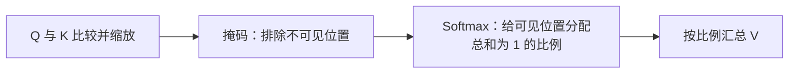

# 注意力：Q、K、V 怎样按当前需要汇总信息

“小明把书给小李，因为他明天要考试。”

这里的“他”指谁？读者要联系前面的文字，也可能发现这句话存在歧义。模型加工当前位置的数字之外，还需要一种从其他位置汇入信息的方式。

上一课的 MLP 逐位置加工向量；本课讨论 **Attention，注意力**，说明一个位置怎样根据当前查询，从可见位置的表示中汇总信息。这个名字描述计算机制，不表示模型像人一样有主观注意力，也不保证它已经正确解决指代。[^原讲解]

本文对应《AI学习目录》第二阶段的第 05 课“注意力：按当前需要汇总信息”，按照《32课学习设计与掌握目标》组织。读完并独立完成检查后，你应能：

1. 按“比较 Q 与 K→分配权重→汇总 V”的顺序说明计算。
2. 分清注意力权重与模型训练参数，不把比例当成词的重要性定论。
3. 说明汇总输出是新的数字表示，不是最终词表概率。
4. 解释遮住一个位置后，为什么剩余比例要重新分配。
5. 说明权重能展示什么计算关系，以及为什么它不能单独证明答案正确或完整的因果解释。

你只需要会读数字列表、做简单加乘和看比例。点积、指数与矩阵放在选读，基础练习不要求先掌握这些公式。本文的句子、向量和权重来自课程教学设计，**不是实际模型的测量结果**。

## 先补必要的概念：按比例汇总是什么？

向量是一组按顺序排列的数，如 `[10,0]`。我们可以按比例混合两组或多组数。

先只看两个数字：`10` 和 `20`。如果规定它们的权重分别是 `0.2` 与 `0.8`，也就是 `20%` 与 `80%`，加权结果为：

```text
0.2×10 + 0.8×20 = 2 + 16 = 18
```

权重是在规定各项占多少比例。这两项加起来是 `1`，即 `100%`，因此这里是加权平均。

结果 `18` 既不是原样拿走 `10`，也不是原样拿走权重更高的 `20`。**按比例汇总与只选最高的一项，是不同操作**。

注意力会计算这样的比例，再用比例汇总多组 Value。接下来就把“比例从哪里来”与“实际汇总什么”分开。

## 一、Q、K、V 各负责哪一步？

模型先把当前表示投影成不同用途的向量。投影使用训练得到的参数，本课直接给出投影后的数字，先观察注意力本身。[^投影]

三个名称分别是：

| 对象 | 中文说明 | 在本课计算中的用途 |
| --- | --- | --- |
| Query，Q | 查询向量 | 当前查询用于与各位置的 K 比较 |
| Key，K | 键向量 | 每个位置提供用于匹配的向量 |
| Value，V | 值向量 | 每个位置提供实际被加权汇总的向量 |

“查询、索引、内容”可以帮助记住分工，但技术对象仍是一组数字。它们不是向量里写着的三个中文标签，也不是先把词语分成人物、动词或物体三类。

**Q 与 K 决定匹配分数，V 提供被汇总的数值**。不要因为 K 和 V 来自同一位置，就把它们当成同一个对象。[^注意力]

这一课只计算一个查询、一个注意力头的加权结果。多头拼接、输出投影和完整层结构留到第 06 课。

## 二、沿同一组教学向量，看比例怎样形成

### 先把输入写全

课程给定当前查询：

```text
q = [1,0]
```

这里的小写 `q` 表示单个查询。三个可供读取的位置，各有一组 K 与 V：

| 位置 | K：用于匹配 | V：用于汇总 |
| --- | --- | --- |
| 1 | `[1,0]` | `[10,0]` |
| 2 | `[0,1]` | `[0,10]` |
| 3 | `[1,1]` | `[5,5]` |

这些坐标没有“人名”“考试”之类的固定语义标签。它们没有与开篇句子里的真实 Token 对齐，仅用来演示数字计算。

先看三个位置全部可见的情况。每个 Q、K 有两个坐标，模型按缩放点积规则得到匹配分数，再转成比例。完整公式稍后选读，首遍先读结果与用途。[^注意力]

### 从匹配分数转成注意力权重

对 `q=[1,0]`，与三组 K 比较后，原始点积分数是 `1、0、1`；按本例二维设置缩放后约为 `0.707107、0、0.707107`。

接下来使用 **Softmax**：把这一行分数转换为总和为 `1` 的比例。这个“把分数变成比例”的过程叫**归一化**。本例得到：

| 位置 | 缩放后的匹配分数 | 注意力权重 | 换成百分比约为 |
| --- | --- | --- | --- |
| 1 | 0.707107 | 0.401112 | 40.11% |
| 2 | 0 | 0.197776 | 19.78% |
| 3 | 0.707107 | 0.401112 | 40.11% |

位置 1 与 3 分数相同，因此分到相同权重；位置 2 分数更低，权重较小，但仍然参与。

**匹配分数不是权重**。原始分数为 `0` 不等于权重为 `0`；后面选读会看到，Softmax 中 `0` 的指数是 `1`。

这张表显示的是本例标准 Softmax 归一化后的权重，不加入随机丢弃等额外操作。至少有一个位置可见；计算使用未舍入数值，正文显示的小数只是便于阅读。[^注意力]

## 三、按权重汇总 V，得到什么？

### 对每个坐标分别做加权和

V 有两个坐标。先汇总第一项，再汇总第二项：

```text
第一项：
0.401112×10 + 0.197776×0 + 0.401112×5
≈ 6.016681

第二项：
0.401112×0 + 0.197776×10 + 0.401112×5
≈ 3.983319

输出 ≈ [6.016681,3.983319]
```

上式的比例展示到六位小数，输出按未舍入权重计算。手工只代入表中舍入值时，末位可以略有差异。

如果仅用 `40%、20%、40%` 作粗略心算，结果是 `[6,4]`；用完整比例计算，结果约为 `[6.02,3.98]`。这两个精度层次不要混在一起。

输出不是三组 V 中任何一组的原样复制，而是把它们逐坐标混合后的新表示。[^注意力]

### 权重与输出分别沿哪个方向数？

| 本例对象 | 有几个数？ | 每个数对应什么？ |
| --- | --- | --- |
| 三个注意力权重 | 3 | 查询对三个位置各分多少比例 |
| 一个汇总输出向量 | 2 | 新表示的两个坐标 |

这两个数量来自不同轴：权重数与可读取位置数有关，输出坐标数与 V 的维度有关。

**这里的三个比例不是三个词的生成概率，两个输出坐标也不是两个词的生成概率**。注意力输出仍会交给后续层加工；自回归文本生成到词表输出环节，才产生用于选择下一个 Token 的分数。[^投影]

所以，即使注意力权重最高，也没有在这一步“直接输出那个词”。

## 四、注意力权重与上一课的 Weight 是一回事吗？

上一课 Linear 里的 Weight 是计算用的参数，普通推理沿用已有参数。这里的“注意力权重”则是本次 Q 与 K 比较、归一化之后算出的比例。

| 对象 | 从哪里来？ | 普通推理中怎样使用？ |
| --- | --- | --- |
| Q、K、V 投影的参数 | 模型训练得到的参数矩阵 | 用已有参数把输入表示投影成 Q、K、V |
| 本次注意力权重 | 当前 Q/K、可见范围与指定计算规则 | 用本轮计算的比例汇总 V |

**比例改变不等于模型参数被更新**。如果只换查询，保持这组 K、V 不变，比较结果就可以改变。[^投影]

沿课程例子，把查询转成：

```text
q = [0,1]
```

相同三组 K 的原始点积变成 `0、1、1`，权重约为：

```text
[0.197776,0.401112,0.401112]
```

之前较低的第二个位置，现在分到较高比例。汇总结果约为 `[3.983319,6.016681]`。

这只说明在当前比较规则下，换查询改变了汇总。不能据此认定某个位置在所有问题中都“更重要”，也不能推断每个注意力头预先有固定的人类语义分工。

二维箭头方向可以帮助看图，但本课采用的点积还受长度影响。例如，保持 `q=[1,0]`，把位置 1 的 K 作为迁移对照改为 `[2,0]`，方向没有变，点积却从 `1` 变成 `2`。**点积匹配不只是看方向**。这个改动仅用来说明算式，不是对真实模型的干预实验。

## 五、遮住第三个位置，为什么要重新分配比例？

### 可见范围先改变，再计算比例

现在回到原来的 `q=[1,0]` 与三组 K、V。假设这个查询位于序列的位置 2，采用因果可见范围，只能读取位置 1 和 2，位置 3 属于未来。

前面的“全部可见”是一个数值基线；在这个因果设置下，不允许沿用把未来也纳入计算的基线结果。模型要先屏蔽位置 3，再在允许读取的位置之间分配比例。这里叫 **Mask，掩码**。[^掩码]



在本例中，位置 3 的权重变成零，另外两项重新分配：

| 位置 | 全部可见的权重 | 屏蔽位置 3 后的权重 |
| --- | --- | --- |
| 1 | 0.401112 | 0.669762 |
| 2 | 0.197776 | 0.330238 |
| 3 | 0.401112 | 0 |
| 总和 | 1 | 1 |

新的输出是：

```text
第一项：0.669762×10 + 0.330238×0 ≈ 6.697615
第二项：0.669762×0 + 0.330238×10 ≈ 3.302385

输出 ≈ [6.697615,3.302385]
```

同样，输出使用未舍入比例复算。

### 为什么只把旧的第三项抹成零不够？

错误操作是：

```text
旧比例：[0.401112,0.197776,0.401112]
抹第三项：[0.401112,0.197776,0]
剩余总和：0.598888
```

它只剩约 `59.89%`，没有完成在两个可见位置之间重新分配 `100%`。用它算出的输出会缩小，不能代表本例屏蔽后的标准注意力结果。

**改变参与归一化的集合，就要重新分配剩余比例**。标准做法是在 Softmax 之前处理掩码，再对可见分数归一化。

可以用旧的未舍入比例作数学核对：把剩余两项各除以它们的总和，得到新的比例。这在本例其他分数不变的条件下，与先屏蔽再计算一致；错的是“只抹掉第三项，却不重新归一化”。

因果掩码限制未来信息，不是断言位置 3 的内容没有价值。换一种查询位置或模型可见范围，允许读取的集合需要按实际设置确认。

## 六、比例告诉你计算关系，不能单独证明理解正确

回到开篇句子：“小明把书给小李，因为他明天要考试。”

“他”可能指小明，也可能指小李。仅凭这句话，不能把一种常见解释当成唯一已经证实的事实；需要更多语境。

假如某次模型计算对某位置分配较高权重，你至多观察到：在指定层、指定头、指定查询下，该位置的 V 获得较大混合系数。你仍不知道后续层怎样使用这些数字，也不能仅凭这个系数宣布模型已经正确解决指代。[^原讲解]

| 观察 | 可以说明什么？ | 还不能单独证明什么？ |
| --- | --- | --- |
| 某位置权重较高 | 当前这一步给它的 V 较大比例 | 它一定是正确的人物解释 |
| 两位置权重相同 | 当前归一化分配相同系数 | 两处语义完全相同或贡献必然相同 |
| 某位置因掩码为零 | 本步不允许读取它 | 它对所有任务都无用 |
| 一次注意力输出已算完 | 得到本步的数字表示 | 最终答案已经正确，或已给出完整因果解释 |

“完整因果解释”需要进一步验证哪些改变造成了怎样的行为变化。单张权重表只记录一个计算环节，还不是整套模型为什么给出该答案的完整证据。

本课不要求你实现可解释性实验；只需要保留边界：**计算比例、语义判断和答案核验，是不同任务**。

## 七、合上文章，完成五个基础检查

题目所需权重已给出。基础达标不要求手算指数或实现注意力程序；先独立作答，再看下一节。

### 检查 1：按顺序说明三个对象的职责

用自己的话说明：谁与谁比较，得到什么，实际被汇总的又是什么？

再算课程的简单例子：V 为 `10、20`，权重为 `0.2、0.8`。结果是多少？为什么不是直接输出权重较高的 `20`？

### 检查 2：换查询后的迁移计算

沿用主例三个 V：`[10,0]、[0,10]、[5,5]`。查询改成 `q=[0,1]`，权重已算为约：

```text
[0.197776,0.401112,0.401112]
```

分别计算输出的两个坐标，保留两位小数即可。这个比例变化是否说明投影参数被更新？是否说明位置 2 对所有问题最重要？

### 检查 3：把权重与词表概率分开

原查询 `q=[1,0]` 的权重有三个数，输出约为 `[6.016681,3.983319]`。

有人认为：“输出的两个数字就是两个词的概率，现在应该选 `6.016681` 对应的词。”这一步哪里出了问题？三个权重和两个输出坐标分别对应什么？

### 检查 4：给屏蔽后的比例重新分配

回到原查询，屏蔽位置 3 后，剩余权重约为 `0.669762、0.330238`。

写出完整三项权重与输出，保留两位小数即可。再指出只把旧第三权重改为零为什么不够，以及标准流程在何时处理掩码。

### 检查 5：判断权重表能支持多大的结论

有人展示一张权重表，声称某人名位置权重最高，所以证明句中的“他”必定指此人，而且整份答案正确。

这张表实际能支持什么？还需要哪些信息或核验？若只有开篇那句话，能否把一种指代解释写成确定事实？

## 八、参考答案与达标标准

### 检查 1 的答案

当前 Q 与可见位置的 K 比较，产生匹配分数；分数经归一化成为注意力权重，再用这些权重对各位置的 V 加权汇总。

```text
0.2×10 + 0.8×20 = 18
```

操作要求两项按比例共同参与，不是取最大权重所在项。因此 `18` 是混合结果，`20` 是其中一个原始 V。

**过关点**：顺序与职责正确，能用算式分开加权汇总和单项选择。

### 检查 2 的答案

```text
第一项：0.197776×10 + 0.401112×0 + 0.401112×5 ≈ 3.98
第二项：0.197776×0 + 0.401112×10 + 0.401112×5 ≈ 6.02

输出 ≈ [3.98,6.02]
```

完整计算结果约为 `[3.983319,6.016681]`。当前查询改变了比较和比例，不是参数更新的证据。位置 2 只是在这一查询下得到较大系数，不说明所有问题中它都最重要。

**过关点**：逐坐标混合正确，分清本次权重变化与训练参数，并限定比例的解释范围。

### 检查 3 的答案

三个权重对应三个位置的混合比例；两个输出数对应 V 汇总后的两个坐标。它们没有在本例中对应两个词。

注意力输出是数字表示。后续模型计算与词表输出环节还没有由这一步替代，所以不能从这两个坐标直接选词。

**过关点**：按位置轴和坐标轴解释数量，知道汇总表示与词表概率的区别。

### 检查 4 的答案

```text
新权重：[0.669762,0.330238,0]
第一项：0.669762×10 + 0.330238×0 ≈ 6.70
第二项：0.669762×0 + 0.330238×10 ≈ 3.30
输出 ≈ [6.70,3.30]
```

只抹掉旧第三项后，剩余总和约 `0.598888`，没有重新分配成 `1`。标准计算在 Softmax 归一化前施加掩码，再给可见位置分配比例。

**过关点**：能解释参与集合变化、旧比例总和不足，以及新权重与新输出的关系。

### 检查 5 的答案

该表只能展示指定查询、指定层与头中的加权关系；最高比例不等于人物解释已被证实，也不保证最终答案正确。

要进一步判断，需要知道权重表对应什么位置和可见范围、模型最终回答什么，并根据更多语境核对解释。若要谈行为的因果关系，还需要相应的干预与验证，不能只凭表中数值补全。

仅有开篇句子时应保留指代歧义，不能把一种解释当作确定事实。

**过关点**：能说清观察范围与证据缺口，把模型计算和语义核验分开。

### 怎样判断掌握？

能独立完成五题并解释理由，就覆盖本节五项基础要求。卡住时回到相应步骤重读：

| 卡点 | 回读位置 |
| --- | --- |
| 把 K 与 V 的职责交换 | 第一节的对象对照 |
| 不会按比例算每个坐标 | 必要先修与第三节的加权和 |
| 把权重变化当成训练 | 第四节的参数与动态比例 |
| 抹掉一项后不重新分配 | 第五节的掩码前后对照 |
| 把权重当成正确解释证明 | 第六节的结论边界 |

看完图表或运行算例，只说明观察过过程；实际掌握还要靠独立解释与迁移作答。

## 九、可选进阶：把比例从头算出来

### 点积与缩放：比较同一组坐标

点积就是对应坐标相乘，再相加。对原查询 `q=[1,0]`：

```text
q·K₁ = 1×1 + 0×0 = 1
q·K₂ = 1×0 + 0×1 = 0
q·K₃ = 1×1 + 0×1 = 1
```

缩放点积注意力把这些数除以 `√dₖ`，其中 `dₖ` 是每个头 Q、K 的坐标数。这里 `dₖ=2`，所以除以 `√2`：

```text
[1,0,1] ÷ √2 ≈ [0.707107,0,0.707107]
```

**除数取自 Q、K 的维度，不是位置数或词表大小**。本例有三个位置，仍然除以 `√2`。[^注意力]

### Softmax：先取指数，再除以总和

用同一行分数演示。为方便稳定计算，先减去最大分数，再取指数；减同一个数不会改变最终比例。

```text
缩放分数：[0.707107,0,0.707107]
减去最大值：[0,−0.707107,0]
取指数：  [1,0.493069,1]
总和：    2.493069
各除总和：[0.401112,0.197776,0.401112]
```

“取指数”这里就是计算 `e` 的相应次幂，`e⁰=1`。负分数的指数仍大于零，因此普通有限分数不会因为小于零而变成负权重。

上面的中间数显示为近似值。使用完整精度计算，再对 V 各坐标加权，就得到主例输出 `[6.016681,3.983319]`。

### 掩码怎样进入计算？

概念上，对位置 3 的分数加上负无穷，记为 `−∞`，得到：

```text
[0.707107,0,−∞]
```

Softmax 中这一项不贡献指数权重。按可见项的最大值平移后：

```text
指数贡献：[1,0.493069,0]
总和：    1.493069
新权重：  [0.669762,0.330238,0]
```

这直接说明了分母为什么变化：位置 3 已经不参与总和。具体掩码表示和实现需读所用接口；这里只按官方等价伪代码说明数学流程。[^掩码]

如果所有位置都被屏蔽，就没有可用项分配比例。本课不把它处理成“正常地输出全零”，最小教学算例对此拒绝计算；实际实现也需要明确处理这个边界。

### 读懂形状：查询数、可读位置数、输出坐标数

把多个向量按行排成表，单查询集合记作 Q，所有 K、V 也按行排好。

| 场景 | Q、K、V 形状 | 匹配分数形状 | 输出形状 |
| --- | --- | --- | --- |
| 本例一行查询，读取三组二维值 | `(1,2)`、`(3,2)`、`(3,2)` | `(1,3)` | `(1,2)` |
| 三位置各自查询，读取三组二维值 | `(3,2)`、`(3,2)`、`(3,2)` | `(3,3)` | `(3,2)` |
| 两行四维查询，读取五组三维值 | `(2,4)`、`(5,4)`、`(5,3)` | `(2,5)` | `(2,3)` |

一行查询得到一行分数，对每个可读位置都有一项。Softmax 针对这一行的可读位置归一化，再用同一组比例汇总 V。

因此 Q 与 K 的坐标数要相配，K 与 V 的位置数要相配；**V 的坐标数可以与 Q、K 不同**。输出坐标数由 V 决定。此表省略批次与多头轴，后续课再接完整形状。[^注意力]

选读检查：只换 `q=[0,1]`，原始点积变成 `[0,1,1]`。你可以按同样步骤核对第四节的查询变化结果；再屏蔽位置 3，权重约为 `[0.330238,0.669762,0]`，输出约为 `[3.302385,6.697615]`。

## 下一步：把一次汇总接成完整的一层

你现在能解释 Q/K 比较、比例分配和 V 汇总，并指出可见范围怎样影响结果。接下来的第 06 课“多头、位置与完整架构”会把多组投影、位置线索、残差归一化与 FFN 连接起来，再比较不同架构谁能看谁。

本课先建立单个查询的汇总过程。它提供的是继续加工的表示，最终生成与事实验收仍有各自的步骤。

## 依据与回查

主例的三组 K/V、两种查询、掩码前后数值和形状表来自《AI学习目录》第 05 课；学习要求来自《32课学习设计与掌握目标》。简单加权与指代句也是课程教学例子。将 K 改为 `[2,0]` 的长度对照，由原课程点积规则推演。

课程没有在本次提供公开发布网址，因此以文字标题说明出处。外部链接支持机制与边界，不是人工教学向量的实验出处。

| 公开来源 | 回查位置与支持范围 |
| --- | --- |
| [Attention Is All You Need，arXiv v7](https://arxiv.org/html/1706.03762v7) | §3.2.1 的缩放点积、Softmax 与 V 汇总；§3.2.2 的学习投影；§3.2.3 的因果可见范围 |
| [PyTorch 2.14：scaled_dot_product_attention](https://docs.pytorch.org/docs/2.14/generated/torch.nn.functional.scaled_dot_product_attention.html) | 等价伪代码与 Shape legend；缩放、归一化前掩码、Softmax、V 汇总及输入维度 |
| [原始讲解：多头注意力 MultiHeadAttention 是什么](https://www.bilibili.com/video/BV1of6cBAEuJ) | 中文讲解线索；库内原始文章区分投影、汇总、头分工与表示，本次未重新核对完整音视频 |

本次读取完整库内原始文章与目标课，核对官方注意力伪代码及论文相关章节，运行已有教学算例并复算迁移数字。只检查本地 Markdown 渲染，未取得发布平台预览，未运行真实模型或开展真实新手试读；是否掌握，以独立作答为准。

[^注意力]: [Attention Is All You Need，arXiv v7](https://arxiv.org/html/1706.03762v7)，§3.2.1；[PyTorch 2.14 缩放点积注意力](https://docs.pytorch.org/docs/2.14/generated/torch.nn.functional.scaled_dot_product_attention.html)的等价伪代码及形状说明。本文只取不含额外随机丢弃的教学计算。
[^投影]: [Attention Is All You Need，arXiv v7](https://arxiv.org/html/1706.03762v7)，§3.2.2 的学习投影、§3.3 的后续前馈加工及 §3.4 的词表输出。这里只解释来源与所在步骤，具体投影矩阵未由课程给定。
[^掩码]: [PyTorch 2.14 缩放点积注意力](https://docs.pytorch.org/docs/2.14/generated/torch.nn.functional.scaled_dot_product_attention.html)的掩码与 Softmax 等价伪代码；[原始 Transformer 论文](https://arxiv.org/html/1706.03762v7) §3.2.3 的未来位置屏蔽。本文仅示范位置 2 读取位置 1、2 的明确设置。
[^原讲解]: [多头注意力原始讲解](https://www.bilibili.com/video/BV1of6cBAEuJ)；库内完整原始文章的“从分数到上下文”“拼接之后还有输出投影”保留数值计算与头分工边界。开篇指代歧义、正确性与因果解释的验收要求来自课程设计，不是本次真实模型实验。
