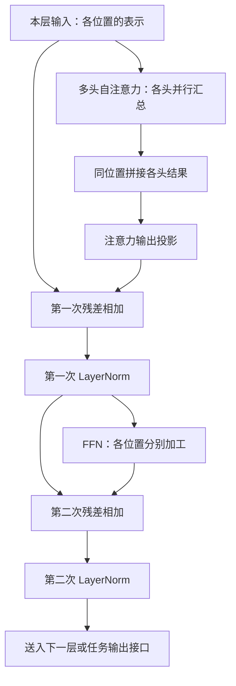

# 多头、位置与完整架构：把 Transformer 的零件接起来

“猫追狗”和“狗追猫”用了相同的字，意思却不同。模型既需要分辨顺序，也需要让不同位置交流信息，再加工每个位置的表示。

前两课分别讲了 MLP（多层感知机）怎样加工一组数、Attention 怎样汇总可见位置的信息。现在把它们接起来，同时回答：多个注意力头的结果怎样合并？一层里为什么还要有残差和归一化？编码器与解码器究竟能看哪里？

本文对应《AI学习目录》第 06 课“多头、位置与完整架构”，按《32课学习设计与掌握目标》组织。读完并独立完成检查后，你应能：

1. 画出原始编码器一层的注意力、结果合并、残差归一化、FFN 与再次残差归一化。
2. 解释多头的不同投影与并行汇总，知道拼接后还有输出投影。
3. 说明顺序为什么需要位置线索，分开“输入加位置向量”和“旋转 Q、K”。
4. 区分三种基础架构的信息来源与可见范围。
5. 用输入与预测目标错开一位的例子，解释因果掩码的对角线为什么可以可见。

你只需要知道向量是一组有顺序的数，会简单加减乘。文章会补必要的模块概念，不要求先读完其他博客。正文中的词语切法、头数、向量和数值都是课程教学设置，**不是实际模型的测量结果**。

这课信息较多，可以分三遍读：先看一层怎样连接，再看三种架构与预测对齐，最后选读数字和维度。五项基础目标都在主正文，选读不作为过关前提。

## 先把上一课的两个零件放回位置

每个 Token 位置都带着一组数字表示。模型的一层接收这些表示，产生更新后的表示，交给下一层。

注意力使用三种向量：**Query**（Q，查询）用于发起比较；**Key**（K，键）提供各位置用于匹配的特征；**Value**（V，值）提供实际被加权汇总的数字。它们由表示投影得到，各自承担不同职责。

| 零件 | 本课需要保留的用途 |
| --- | --- |
| Attention，注意力 | 查询 Q 与各位置的 K 比较，按计算的比例汇总 V，从可见位置读取信息 |
| Feed-Forward Network（FFN），前馈网络 | 对每个位置分别加工，当前这一层各位置使用同一套参数 |
| Linear，线性层 | 按权重组合多个输入坐标，并按结构加入偏置，可改变表示维度 |

同层各位置共用 FFN 参数，**不表示不同层也共用同一套参数**。不同层可以学习不同的计算规则。这里的输出仍是内部表示，不是已经生成的文字。[^原层]

## 一、相同的词，为什么还要提供位置线索？

### 注意力计算的限制，要先写清前提

“猫追狗”和“狗追猫”假设各有三个教学 Token。词语种类相同，谁追谁却取决于先后位置。

先看一个简化条件：没有位置编码，没有因果等位置相关掩码，也不加入随机丢弃操作。固定同一个 Q，把 K 的行和对应 V 一起换序，匹配分数与权重也会一起换序。加权求和时，每份 V 仍配着原来的系数，结果不会因为求和顺序变了就改变。

如果整个输入一起换序，自注意力的输出也会跟着换序。“**输出随输入一起换序**”不等于“**整个输出矩阵永远不变**”。这说明单靠这种计算，没有额外的前后位置线索；不能把它套到保留原因果掩码的任意换序实验上。[^位置]

模型需要让“猫在前面”和“猫在后面”进入数字计算，而不是仅把句子看成同一批单元。

### 原始正弦方案：在输入端加一组位置数字

原始 Transformer 为每个位置计算一组数，叫 **Positional Encoding，位置编码**，记为 PE。它与 Token 表示的坐标数相同，可以逐坐标相加：

```text
进入第一层的表示 = Token 表示 + 对应位置的 PE
```

原始正弦方案用不同频率的正弦和余弦产生这些数。同一个 Token 的初始表示相同，但放在不同位置，会加上不同的位置向量。[^位置]

这里加的是一组可参与运算的数字，不是把“第几个词”写成文字标签。正弦函数怎么代入，后面的选读再算。

### RoPE：在投影后旋转 Q、K

**RoPE，Rotary Position Embedding，旋转位置编码**，采用另一条注入路径：先把当前表示投影成 Q、K，再按各自位置旋转它们，然后参与注意力点积。[^旋转]

| 方案 | 位置在哪一步进入？ | 本课观察的操作 |
| --- | --- | --- |
| 原始正弦位置编码 | 进入编码器／解码器堆叠之前 | 位置向量加到输入表示上 |
| RoPE | Q、K 投影之后、点积比较之前 | 按位置旋转 Q、K 的坐标对 |

可以把二维坐标对想成平面上的箭头。位置决定它转多少角度，不同坐标对可以使用不同转速。这是帮助理解运算的几何图景，不是在给真实坐标命名。

当**同一对投影后的内容向量与旋转频率固定**，把两个位置一起后移、间距保持不变，两根箭头就一起多转相同角度，夹角与点积保持不变。这让旋转后的匹配能够体现相对位置关系。

这个结论不能缩成“所有相同间距的词都得到相同分数”。不同内容可以给出不同 Q、K；改动整段上下文，也可能改变进入旋转前的向量。RoPE 的数学性质不单独保证答案质量或任意长度的效果。

## 二、多头：不同投影下各算一份，再合并

### 一个头就是一条注意力计算分支

上一课只看一个头：一组 Q、K、V 完成比较、归一化和汇总。**Multi-Head Attention，多头注意力**，使用多组训练得到的投影，让多个头并行完成这种计算，再把结果合起来。[^多头]

这不是把三个词分别发给三个头，也不是预先指定“第一个头管语法、第二个头管事实”。每个头在允许的范围内处理位置之间的关系；实际形成什么分工，需要具体证据。

### 拼接是按同一个位置合并坐标

课程设置模型隐藏维度为 `4`，用两个头，每头 Q、K、V 各有两个坐标。

对某个位置，假定两个头的汇总结果分别为：

```text
头 1：[1,2]
头 2：[3,4]
```

把同一位置的两个头结果沿坐标方向接起来，叫**拼接**：

```text
[1,2] 与 [3,4] → [1,2,3,4]
```

这里仍是一个位置，变成四个坐标；不是生成了四个 Token，也没有把不同位置混成一条长向量。

### 拼接后还有输出投影

多头结果会再经过一次学习到的线性映射，叫**输出投影**。本课用明确的教学规则说明它能怎样混合：

```text
(a,b,c,d) → (a+c, b+d, a−c, b−d)
```

代入拼接结果：

```text
[1,2,3,4]
→ [1+3, 2+4, 1−3, 2−4]
→ [4,6,−2,−2]
```

**多头结果合并包含拼接与输出投影两步**。最终四维结果已经混合两个头的数字，不是停在 `[1,2,3,4]`。

论文通常把这层投影矩阵记为 `W^O`。这里的输出投影属于注意力模块，映射回供后续层使用的隐藏表示；它与最终面向词表的输出投影，处在不同计算位置，不能因为名称相似就混用。[^多头]

## 三、残差与 LayerNorm：相加和归一化各做什么？

### 残差给输入多留一条相加的通道

一个子层处理输入，得到新结果。**Residual Connection，残差连接**，把该子层的输入与处理结果逐坐标相加。[^原层]

课程的局部教学例是：

```text
子层输入：[1,3]
子层输出：[2,4]
残差相加：[1+2, 3+4] = [3,7]
```

这个二维例子单独说明相加，不承接前面四维多头的数值；两组数据的维度不同，不把它们当同一次前向计算。

相加要求两边形状相配。这条通道让原输入参与后续结果，但不是把整份输入无损保存成备份，也不等于让子层跳过计算。

### LayerNorm 对当前向量的坐标作数值调整

**LayerNorm，层归一化**，在指定坐标维度上计算均值、方差，用它们调整数值，再应用自己的缩放和偏移参数。Transformer 的常见设置是对每个位置的隐藏坐标分别计算。[^归一化]

对 `[3,7]`，两个坐标平均是 `5`。减均值后是 `[−2,2]`，再按标准差调整，本课参数下约得到 `[−1,1]`。准确结果与小量 ε 的计算在选读展开。

这里没有把“猫”“追”“狗”三个位置合并算一个平均，也不是用 LayerNorm 把数字变成词表概率。**残差负责相加，LayerNorm 负责按指定轴归一化**，二者不能被一句“保留信息”代替。

## 四、把这些步骤接成原始编码器的一层

第一层入口前，原始正弦方案先把 Token 表示与位置编码相加。进入后续层时，接收的是前一层已经更新的表示，并不需要在每层入口重做同一份输入位置相加。

接下来只画**原始 Transformer 编码器的 Post-LN 布局**，即子层计算、残差相加之后才做 LayerNorm。为看清主线，省略 Dropout，也就是训练中随机丢弃部分数值的操作。[^原层]



沿图看一次：

1. 各位置从可见输入中汇总信息，多个头分别计算。
2. 同一位置的各头结果拼接，再经输出投影。
3. 注意力模块的结果与本层输入相加，再做第一次 LayerNorm。
4. FFN 接收归一化后的表示，逐位置使用同一套参数加工。
5. FFN 结果与它自己的输入相加，再做第二次 LayerNorm。

**第二次残差使用 FFN 的输入，不是重新拿最早的本层输入相加**。两次残差分别围绕各自子层。

原始编码器的自注意力可以读取整段有效输入；FFN 这一步分别加工，但它收到的向量已经可能包含其他位置的信息。多层继续堆叠这些计算，任务接口再决定输出分类、抽取结果，或把编码结果送给解码器。

这张图用于认清原始顺序，不是所有模型的固定布局。后面选读会比较 LayerNorm 放在子层前面的 Pre-LN，不能把两种顺序混画。

## 五、三种架构：先确认信息从哪里来

### 编码器与解码器，是两种不同责任

**Encoder，编码器**，把给定输入加工成表示；**Decoder，解码器**，在本课的因果生成设置中，依据已有目标前缀继续预测。

下面比较标准的三条基础路线。有效输入不包括被填充等掩码排除的部分；具体产品的实际结构仍需读取对应模型资料。[^架构]

| 架构 | 自注意力看哪些位置？ | 是否读取独立编码器信息？ | 教学用途 |
| --- | --- | --- | --- |
| Encoder-only，仅编码器 | 给定序列的全部有效输入，能利用两侧上下文 | 没有独立解码器 | 全句分类、实体抽取 |
| 因果 Decoder-only，仅解码器 | 当前输入位置及此前位置 | 本课标准路线没有独立编码器交叉注意力 | 根据前缀续写 |
| Encoder—Decoder，编码器—解码器 | Encoder 看源序列；Decoder 自注意力看目标前缀 | Decoder 另有交叉注意力读取 Encoder 输出 | 翻译、摘要等序列转换 |

这些用途帮助记忆，不表示某类架构只能做表中的任务；也不能把所有 Transformer 都叫作编码器—解码器。

### 自注意力与交叉注意力，Q、K、V 来源不同

**Self-Attention，自注意力**，Q、K、V 都由同一侧当前子层的输入表示投影得到。**Cross-Attention，交叉注意力**，则让一侧发出查询，读取另一侧提供的信息。[^架构]

| 所在步骤 | Q 从哪里投影得到？ | K、V 从哪里投影得到？ |
| --- | --- | --- |
| Encoder 自注意力 | 当前编码侧表示 | 同一编码侧表示 |
| Decoder 因果自注意力 | 当前目标侧表示 | 同一目标侧表示，受因果范围限制 |
| Encoder—Decoder 交叉注意力 | 解码侧当前表示 | 编码器的输出表示 |

所以原始 Decoder 每层除了因果自注意力和 FFN，还多一个读取 Encoder 输出的交叉注意力子层；原始布局也在各子层后使用残差与 LayerNorm。

一个简化的翻译流程是：

```text
完整源文 → Encoder → 源文表示
已有目标前缀 → Decoder 因果自注意力
解码侧查询 + 源文表示 → 交叉注意力
继续加工 → 词表分数 → 下一目标 Token
```

### 源文位置靠后，不等于未来目标

课程给一个例子：源文有 `5` 个有效位置，已知目标前缀有 `3` 个位置。

Decoder 的目标自注意力不能偷看尚未提供的目标答案；但交叉注意力可以读取已完整提供的五个源文位置，包括第 `4、5` 项。

**源序列和目标序列是两条不同的轴**。不能因为源文第 5 项的编号大于目标前缀长度，就把它当成“还没发生的目标”屏蔽。正常交叉注意力读取全部有效源文，填充等其他掩码另按实际输入处理。[^架构]

## 六、为什么因果掩码可以看见对角线？

### 先把输入与目标摆在不同两行

课程使用一段教学目标序列：

```text
要预测的目标：[我, 睡, 结束]
送入的输入：  [开始, 我, 睡]
```

`开始` 和 `结束` 是教学标记，没有指定真实模型的特殊 Token 字面值。输入相比目标向右错开一位：第一个槽位用开始标记预测“我”，第二个用“我”预测“睡”，第三个用“睡”预测结束。[^右移]

| 输入槽位 | 当前输入 | 此槽位要预测 | 允许读取的输入 |
| --- | --- | --- | --- |
| 1 | 开始 | 我 | 开始 |
| 2 | 我 | 睡 | 开始、我 |
| 3 | 睡 | 结束 | 开始、我、睡 |

注意第二行：模型看见的是已有的“我”，这行的待预测答案是“睡”。两者不是同一项。

### 对角线对应当前已知输入，不是当前答案

因果可见矩阵以行为查询槽位、列为输入的 K 槽位：

| 查询槽位 \ K 槽位 | 1：开始 | 2：我 | 3：睡 |
| --- | --- | --- | --- |
| 1：预测我 | 可见 | 禁止 | 禁止 |
| 2：预测睡 | 可见 | 可见 | 禁止 |
| 3：预测结束 | 可见 | 可见 | 可见 |

对角线可见。第 2 槽位读第 2 槽位，也就是输入“我”；如果它读第 3 槽位，才直接读到了自己的目标“睡”。

**判断是否泄漏答案，要同时检查目标对齐与可见范围**。只看到掩码的对角线为可见，不能认定发生泄漏；反过来，如果输入不右移，却用当前正确标签预测它自己，单有这种下三角掩码也不能解决目标错配。

### 训练能并行摆出目标，不等于推理能提前看答案

训练时已有正确文本，可以一次把右移输入排出来，并对各槽位计算预测误差。因果约束保证每个槽位只能利用它应有的前缀。

推理时没有已知的未来答案，要先生成下一项，再把新项用于之后的预测。训练中的并行计算与推理中的逐步生成，在同一条件边界下工作，不能互相混淆。[^右移]

## 七、合上文章，完成五个基础检查

先画图、标来源、解释条件，再看下一节答案。基础检查不要求计算正弦或实现 Transformer。

### 检查 1：画出原始编码器的一层

以本层输入表示开始，按原始 Post-LN、忽略 Dropout 的约定画出完整顺序。必须出现多头结果合并、输出投影、两次残差、两次 LayerNorm 和 FFN。

给每次残差标明哪两组数相加。再计算局部教学例 `[1,3]+[2,4]`，说明随后 LayerNorm 通常对哪个轴统计。

### 检查 2：交换头结果，重新算输出投影

沿用教学映射 `(a,b,c,d)→(a+c,b+d,a−c,b−d)`。

这次指定头 1 输出 `[3,4]`，头 2 输出 `[1,2]`，拼接顺序仍是头 1 在前。拼接结果与投影结果分别是什么？

为什么不能把“拼接”当作多头计算的终点？头编号是否已经规定了“语法头”和“事实头”？

### 检查 3：区分两种位置机制与不变条件

一套方案先计算位置向量，加到 Token 表示上；另一套先投影 Q、K，再按位置旋转它们。分别对应本课哪种方案？

对 RoPE，固定同一对内容向量和旋转频率，两个位置一起后移、间距不变，旋转点积怎样变化？如果换了一对内容向量，仅凭间距相同能否宣布点积也相同？

再解释，为什么不能把“没有位置机制时，输出随输入换序”说成“整个输出永远完全相同”。

### 检查 4：在翻译中标出谁能看谁

源文五个有效位置已经全部提供，目标侧三个已知位置正在处理。

说明：Encoder 自注意力能看什么？Decoder 自注意力受什么约束？交叉注意力 Q 与 K/V 来自哪里？源文第 4、5 项是否应因为超过目标前缀长度而被屏蔽？

最后写出 Encoder-only 和因果 Decoder-only 的主要可见范围。

### 检查 5：找到真正泄漏的那条连接

输入 `[开始,我,睡]`，预测目标 `[我,睡,结束]`。

对第二个槽位：当前输入是什么、预测目标是什么、可以看哪些输入？它读取对角线会不会直接见到答案？若允许它读取第三个输入槽位，会发生什么？

解释训练时可以把这三项输入一起摆出，为什么推理时仍要逐步生成。

## 八、参考答案与达标标准

### 检查 1 的答案

```text
输入
→ 各头自注意力汇总
→ 同位置拼接
→ 注意力输出投影
→ 与本层输入残差相加
→ LayerNorm
→ 逐位置 FFN
→ 与 FFN 输入残差相加
→ LayerNorm
→ 下一层
```

第一次残差使用注意力子层的输入与其输出；第二次使用 FFN 的输入与其输出。第二次不是回头拿最初的本层输入。

局部相加结果是 `[3,7]`；本课常见的 LayerNorm 设置对每个位置的隐藏坐标统计，不跨整句 Token 求一个均值。

**过关点**：模块和两条相加通道齐全，顺序准确，并明确它是原始 Post-LN 的图。

### 检查 2 的答案

```text
拼接：[3,4,1,2]
投影：[3+1,4+2,3−1,4−2] = [4,6,2,2]
```

拼接之后还有输出投影，学习到的映射能继续混合各头坐标。编号只标分支，没有预先给分支指定人类功能。

**过关点**：按指定拼接顺序与映射算对，不把多头解释成固定职业或不同词的分工。

### 检查 3 的答案

第一套是本课的原始正弦位置编码路径；第二套是 RoPE 的投影后旋转路径。

固定内容向量与频率、共同平移而间距不变，旋转点积保持不变。换了内容向量之后，点积还取决于新的内容，不能只凭间距得出相同数值。

整个输入换序后，输出位置也跟着换序，所以不是矩阵原样不动；这个结论还要求没有位置编码和位置相关掩码等前提。

**过关点**：说清位置进入哪一步，并保留不变性与换序判断的必要条件。

### 检查 4 的答案

Encoder 可以读取全部五个有效源位置。Decoder 的目标自注意力只能使用当前输入位置及此前目标侧位置；交叉注意力的 Q 来自解码侧表示，K/V 来自 Encoder 输出。

源文第 4、5 项已经提供，正常交叉注意力可以读取，不能当成未来目标屏蔽。其他掩码需按真实输入另外判断。

Encoder-only 使用给定序列的全部有效输入；因果 Decoder-only 使用当前及此前输入，本课标准路线没有独立 Encoder 信息通道。

**过关点**：来源和范围分别标清，区分源文轴、目标轴与不同掩码。

### 检查 5 的答案

第二个槽位当前输入“我”，预测“睡”，可看“开始、我”。对角线是已有输入“我”，没有直接包含这行答案。

第三个输入槽位是“睡”。允许第二槽位读它，就会提前读到自己的正确目标，破坏按已有前缀预测的约束。

训练文本已知，可以在右移与因果约束下同时计算多项预测；推理的未来 Token 未知，必须把刚生成的结果接入下一步。

**过关点**：分别标出输入和目标，用具体连接说明泄漏，而不是只凭“看见自己”判断。

### 达标与回读

能独立完成这五题，并解释理由，就覆盖本课五项基础目标。错题不必从头重读，按下面定位：

| 卡点 | 回读位置 |
| --- | --- |
| 层图缺输出投影、残差输入画错 | 第二、四节 |
| 把多头当成固定职业 | 第二节的并行投影与合并 |
| 把 RoPE 写成输入加位置号 | 第一节的两种注入路径 |
| 分不清源文与目标的可见范围 | 第五节的信息来源表 |
| 不知道对角线为什么不泄漏 | 第六节的输入目标对照 |

文章和图表提供学习路径；阅读结束或程序通过，不能自动当作读者已掌握。

## 九、可选进阶：沿课程数字核对维度与变换

### 两头合并，位置数怎样保留？

沿用前面隐藏四维、两头各二维的设置，假设有三个位置，省略批次轴：

| 步骤 | 形状 | 含义 |
| --- | --- | --- |
| 输入表示 | `(3,4)` | 三个位置，每位置四个坐标 |
| 每头投影后的 Q、K、V | 各为 `(3,2)` | 每头仍处理三个位置 |
| 每头的汇总输出 | `(3,2)` | 每位置得到两个坐标 |
| 同位置拼接两头 | `(3,4)` | 拼的是坐标，不是位置 |
| 输出投影后 | `(3,4)` | 回到本例模型维度 |

主例的 `[1,2]` 和 `[3,4]` 只是其中一个位置的两个头结果，不是整个三位置矩阵。这里采用标准等分头的教学设置，不推断所有注意力变体都共享同一组形状。[^多头]

### 四维正弦位置向量怎样得到？

课程把原始正弦规则取成四维：

```text
PE(p) = [sin(p), cos(p), sin(p/100), cos(p/100)]
```

`p` 是从零开始的位置，三角函数的角度单位为弧度；四个数的顺序已经写定。

```text
p=0：PE(0) = [0,1,0,1]
p=1：PE(1) ≈ [0.841471,0.540302,0.010000,0.999950]
```

第一组变化较快，第二组变化较慢。把整组数与同维输入相加，使位置进入计算；不同频率的机制来自原论文，四维和数值来自本课程设置。[^位置]

### RoPE 的九十度手算例

为便于手算，课程选读规定每增加一个位置，旋转 `π/2` 弧度，也就是 `90°`。这不是实际模型的默认频率；真实 RoPE 使用多组频率。本例只跟踪二维向量 `[1,0]` 的逆时针旋转。

| 位置 | 旋转后 |
| --- | --- |
| 0 | `[1,0]` |
| 1 | `[0,1]` |
| 2 | `[−1,0]` |
| 3 | `[0,−1]` |

固定旋转前的 Q 与 K 都为 `[1,0]`：

```text
Q在位置1，K在位置2：
[0,1]·[−1,0] = 0

共同后移一格，Q在位置2，K在位置3：
[−1,0]·[0,−1] = 0
```

共同旋转保留了间距和夹角，点积仍为零。这只核对固定内容向量与固定频率的几何关系；上下文改变后是否还得到同一组内容向量，需要另外检查。[^旋转]

### 残差后的 LayerNorm 完整算式

回到 `[1,3]+[2,4]=[3,7]`。规定每位置的两个坐标作统计，缩放参数为 `1`，偏移参数为 `0`，小量 `ε=0.00001`。

```text
均值：(3+7)/2 = 5
与均值之差：[−2,2]
总体方差：((−2)²+2²)/2 = 4
分母：√(4+0.00001)

输出：[(3−5)/√4.00001, (7−5)/√4.00001]
≈ [−0.999999,0.999999]
```

除的是坐标数 `2`，不是样本方差的 `2−1`。ε 让方差为零时也有明确分母。实际 LayerNorm 的缩放、偏移与统计维度需要按配置检查，不保证任何参数下输出都恰好均值零、方差一。[^归一化]

### Post-LN 与 Pre-LN 不要混写

以 `F` 代表某个子层计算，`LN` 代表 LayerNorm：

```text
原始 Post-LN：LN(x + F(x))
Pre-LN：      x + F(LN(x))
```

前者先处理、相加，再归一化；后者先归一化送给子层，残差通道仍使用 `x`。这两种式子通常不同，不能只因为都有 F、加号和 LN 就换顺序。PyTorch 的 `norm_first` 参数明确区分归一化放在子层之前还是之后。[^布局]

### 交叉注意力的形状，要分源与目标

沿用源文五位置、目标三个已知位置，单头 Q/K 二维、V 四维：

| 对象 | 形状 | 轴怎样数？ |
| --- | --- | --- |
| Q | `(3,2)` | 三个目标侧查询，各两坐标 |
| K | `(5,2)` | 五个源侧键，各两坐标 |
| V | `(5,4)` | 五个源侧值，各四坐标 |
| 匹配分数 | `(3,5)` | 每个目标查询分别比较五个源位置 |
| 单头输出 | `(3,4)` | 每个目标查询汇总得到四坐标 |

这个例子只看单头交叉汇总，尚未画多头拼接、输出投影和残差。目标查询数与源位置数不同并不矛盾，Q/K 的坐标数相配、K/V 的源位置数相配才是这里的约束。[^架构]

## 下一步：从模型过程转向任务表达

现在可以把前六课接成一条解释链：文字切分与编号，查出初始向量，利用位置与可见上下文逐层计算，再经任务输出接口产生结果。架构与掩码决定哪些信息可以参与，生成场景还需要按已有前缀逐步推进。

接下来进入第三阶段，第 07 课“清楚表达，比堆技巧先行”，会把关注点转到怎样说明任务、输入、输出与验收。你不必先背完全部矩阵推导，才开始学习如何提出可检查的请求。

## 依据与回查

本文教学顺序、猫追狗对照、四维两头映射、位置数值、残差归一化、目标右移和交叉形状，来自《AI学习目录》第 06 课；目标来自《32课学习设计与掌握目标》。交换两个头结果的检查题，是在已定义映射下改变输入的迁移练习。

这两份课程材料没有在本次提供公开发布网址，因此只列文字出处。外部来源支持技术机制，不是教学数字的实验出处。

| 公开来源 | 回查位置与支持范围 |
| --- | --- |
| [Attention Is All You Need，arXiv v7](https://arxiv.org/html/1706.03762v7) | §3.1 原始层顺序与右移；§3.2.2 多头输出合并；§3.2.3 注意力来源；§3.3 逐位置 FFN；§3.5 正弦位置编码 |
| [RoFormer，arXiv v5](https://arxiv.org/html/2104.09864v5) | §3.2.1—3.2.2 的二维旋转与多维推广；Q/K 旋转及相对位置形式 |
| [PyTorch 2.14：MultiheadAttention](https://docs.pytorch.org/docs/2.14/generated/torch.nn.MultiheadAttention.html) | 不同投影、拼接、输出投影及头维度 |
| [PyTorch 2.14：LayerNorm](https://docs.pytorch.org/docs/2.14/generated/torch.nn.LayerNorm.html) | 指定末维统计、总体方差、ε 与逐元素缩放偏移 |
| [PyTorch 2.14：TransformerEncoderLayer](https://docs.pytorch.org/docs/2.14/generated/torch.nn.TransformerEncoderLayer.html) | 编码器层结构与 `norm_first` 的布局区别 |
| [Hugging Face：Transformer Architectures](https://huggingface.co/docs/course/main/en/chapter1/6) | Encoder models、Decoder models、Sequence-to-sequence models 三种基础路线；精确可见范围以原论文为准 |

中文讲解线索分别来自[Transformer 架构导论原视频](https://www.bilibili.com/video/BV1k6yWBEEmH)、[位置编码原视频](https://www.bilibili.com/video/BV1DLbj6ME1e)、[RoPE 原视频](https://www.bilibili.com/video/BV1kqYe6DEvF)。本次读取其库内完整原始文章，未重新逐段核对音视频。

本次核对了官方定义与论文相关章节，复算教学数字，并检查本地 Markdown 渲染。未取得发布平台预览，未运行真实模型、未开展新手试读；实际掌握以独立作答为准。

[^原层]: [原始 Transformer 论文 v7](https://arxiv.org/html/1706.03762v7)，§3.1 的残差与归一化顺序、§3.3 的逐位置前馈与不同层参数；正文图省略 Dropout，不作为所有模型的通用布局。
[^位置]: [原始 Transformer 论文 v7](https://arxiv.org/html/1706.03762v7)，§3.5 的位置注入与正弦公式；[位置编码原始讲解](https://www.bilibili.com/video/BV1DLbj6ME1e)提供顺序缺口的说明线索。换序结论限定本课写出的无位置编码、无位置相关掩码等条件。
[^旋转]: [RoFormer 论文 v5](https://arxiv.org/html/2104.09864v5)，§3.2.1—3.2.2；[RoPE 原始讲解](https://www.bilibili.com/video/BV1kqYe6DEvF)。本文采用课程已有的二维手算，不推断跨模型性能。
[^多头]: [原始 Transformer 论文 v7](https://arxiv.org/html/1706.03762v7)，§3.2.2；[PyTorch 2.14 MultiheadAttention](https://docs.pytorch.org/docs/2.14/generated/torch.nn.MultiheadAttention.html)的多头公式与头维度说明。具体四维映射为课程人工设置。
[^归一化]: [PyTorch 2.14 LayerNorm](https://docs.pytorch.org/docs/2.14/generated/torch.nn.LayerNorm.html)，定义、归一化轴、总体方差估计及缩放偏移；本文只用指定二维输入与参数核算。
[^架构]: [原始 Transformer 论文 v7](https://arxiv.org/html/1706.03762v7)，§3.1、§3.2.3；[Hugging Face 架构课程](https://huggingface.co/docs/course/main/en/chapter1/6)的三种模型入口。这里比较基础结构，不据商业产品名称推定未公开的实现。
[^右移]: [原始 Transformer 论文 v7](https://arxiv.org/html/1706.03762v7)，§3.1 的错位输入与未来屏蔽；[架构原始讲解](https://www.bilibili.com/video/BV1k6yWBEEmH)对应库内“训练不等于逐次运行完整生成”。中文序列与特殊标记名称为课程教学约定。
[^布局]: [PyTorch 2.14 TransformerEncoderLayer](https://docs.pytorch.org/docs/2.14/generated/torch.nn.TransformerEncoderLayer.html)，`norm_first`；本文用两个明确算式区分子层前后归一化。
