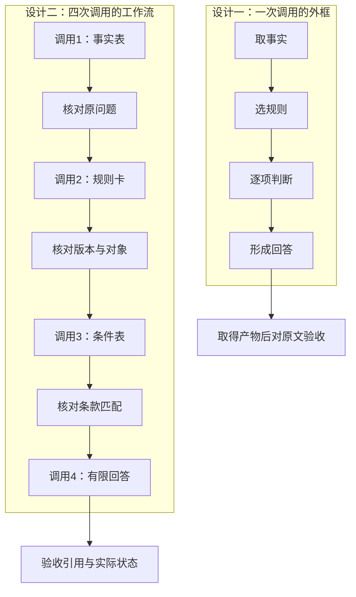

# 推理、拆分与外部核验：把多步任务变成可检查的流程

一份回答把规则选择、条件判断和结论都写得很整齐，却把问题中的“聊天截图”抄成了“含订单号的电子凭证”。后面的判断还能可信地继续吗？

这正是多步任务常见的错误传播：后一步依赖前一步的结果，最早的事实偏差会一路传下去。多写解释、拆成更多调用，或让几次回答投票，都不能自动修复这个偏差。

本文对应《AI学习目录》第 09 课“推理、拆分与外部核验”，按照《32课学习设计与掌握目标》组织。读完并独立完成练习后，你应能：

1. 区分 CoT、链式提示与自我一致性的主要职责。
2. 为子步骤写清输入、输出、检查依据和停止条件。
3. 从轨迹中定位最早出错的事实或中间结果。
4. 说明多次一致为什么不是独立证据，以及怎样用可检查产物验收，不要求披露隐藏推理。

你只需要会读材料、核对条件、观察前后依赖，不需要会编程或先掌握概率公式。本文的设备条款、日期、调用框和票数都是教学设计，**不是真实制度或模型实测成绩**。

## 先补必要概念：调用、步骤和检查依据

**一次模型调用**，在本课指向模型提供一份输入并取得一份输出的处理请求。输出可以很短，也可以包含多项结果；写了四个编号，不等于发生四次调用。

**子步骤**是任务中的一个局部工作，例如提取事实、选择适用材料。上一步的产物可能成为下一步的输入。

**检查依据**是判断产物是否合格的参照，例如原问题、条款、可复算公式或实际状态。它不能仅仅是“模型又说了一遍”。

一个可检查的中间结果可以很小：五行事实表、一条版本说明、三项条件判断。关键是别人能据原材料核对，错误时能说明停在哪里。

## 一、三种方法分别解决什么问题？

### CoT：组织一次解题中的中间步骤

**CoT，Chain of Thought，思维链**。经典 CoT 提示在示例里同时展示问题、中间解题步骤和答案，帮助模型组织多步求解。它通过提示提供演示，不是一次参数训练。[^思维链]

原始讲解给了一个可以直接核算的题：`15、30、27、2、14、11` 中，奇数之和是偶数吗？

```text
选出的奇数：15、27、11
计算：15+27+11 = 53
检查：53 是奇数
答案：否
```

这里检查的是选数、求和和最终判断。写出这些外显结果有助于核对，却不能证明它们完整记录了模型内部怎样计算。

在本课的比较中，CoT 讨论一次调用内的解题步骤；有内部推理能力的模型也可能不把所有内部过程写出来。**看到分步文字，不能据此还原完整的内部计算**。[^核验]

### 链式提示：把任务拆成前后衔接的调用

**Prompt Chaining，链式提示**，把任务分成多次调用。应用或人工流程取得第一步的输出、检查它，再把通过检查的结果交给下一步。[^链式]

例如第一调用只提取事实，第二调用选规则，第三调用判断条件，第四调用形成回答。拆开的价值在于有明确的交接与检查位置，而不是给模型更多机会重复同一事实。

如果仅在一次提示里写“第一步、第二步、第三步”，却没有实际的调用交接，它仍然是一次调用中的分步要求。

### 自我一致性：对同一题多次采样，再汇总答案

**Self-Consistency，自我一致性**，对同一问题采样多份解答，再根据最终答案的一致性汇总选答。原论文用多条采样路径与答案聚合改善所测试任务的选答表现；它不保证每道题都正确，也不靠投票更新模型参数。[^自洽]

它与串行链的方向不同：链式提示把一个任务分成前后依赖的子任务，自我一致性则让多份输出回答同一个问题。

| 方法 | 主要组织对象 | 本课的检查重点 |
| --- | --- | --- |
| CoT | 一次解题中的步骤 | 算式、依据与答案是否正确且一致 |
| 链式提示 | 多次调用之间的传递 | 每步输入输出、来源和通过条件 |
| 自我一致性 | 同题多份采样答案 | 答案能否正确归并，选出后是否有证据支持 |

三者可以组合，但要分别说清用了什么。例如链中的某一步可以再采样多份输出；这不意味着每一步都应该增加采样。

## 二、先把任务与全部教学材料摆出来

### 主问题只做资格判断

沿课程主问题：

```text
2025-06-12提出申请，购买设备签收第10天，未拆封，
有含订单号的电子凭证，能申请退货吗？
```

任务边界是根据展示材料回答申请条件，没有授权实际办理申请或退款。签收当天计第 `0` 天，按**提出申请的日期**选择规则。

### 甲、乙、丙不是三个可以投票的意见

| 教学材料与适用时间 | 条款 | 内容 |
| --- | --- | --- |
| 甲：2025-01-01—2025-05-31 生效 | 甲1 | 购买设备签收后第 0—7 天、未拆封，可以申请退货。 |
| 同上 | 甲2 | 需要纸质发票；电子订单截图不能代替纸质发票。 |
| 乙：2025-06-01 起生效，明确替代甲的购买规则 | 乙1 | 购买设备签收后第 0—14 天、未拆封，可以申请退货。 |
| 同上 | 乙2 | 凭证可以是纸质发票，或含订单号的电子凭证；聊天截图不属于上述凭证。 |
| 同上 | 乙3 | 已拆封设备不能按乙1申请退货，只能转维修核验；转维修不代表已经批准退款。 |
| 丙：2025-06-10 起生效 | 丙1 | 租用设备应在签收后第 0—30 天归还。 |
| 同上 | 丙2 | 不适用于购买设备退货，也不修改乙的购买规则。 |

主问题的申请日期使甲不再适用，购买对象使丙的租用规则不适用，所以选乙。

**版本与对象决定适用范围，不由出现次数或多数意见决定**。不能把甲的七天、乙的十四天、丙的三十天看成三个答案来投票。

## 三、同样四步，怎样设计可检查的交接？

### 四张卡写清输入、输出、检查和停止

课程的任务流程是：取事实→选规则→逐项判断→形成回答。把每一步写成一张检查卡：

| 步骤 | 输入 | 必须交出的产物 | 检查依据 | 不通过时怎样处理？ |
| --- | --- | --- | --- | --- |
| 1：取事实 | 原问题 | 日期、对象、天数、拆封、凭证事实表，保留原文定位 | 每项都能回到问题中的对应文字，未知不能补写 | 缺项标缺失并询问；抄错退回纠正，不把错误事实送下游 |
| 2：选规则 | 已检查的日期和对象、甲乙丙材料 | 选乙，写出排除甲、丙的依据 | 日期范围、乙替代甲、丙2不适用于购买 | 版本或对象无法确认时停止资格判定，补充适用依据 |
| 3：逐项判断 | 已检查的事实、乙条款 | 期限、拆封、凭证分别通过／不通过／未知，注明条款 | 对每个条件逐项匹配，不引入未提供制度 | 已知失败不能输出合格；未知标缺项，不升级为符合条件 |
| 4：形成回答 | 条件表与已知动作状态 | 有限结论、引用和未完成事项 | 结论不超出材料；没有执行就不声称已批准或退款 | 引用错误或状态夸大则返修，不交付不实断言 |

“停止”是停止继续作出无依据的肯定或执行断言。已知不满足时仍可以交付“不满足当前条件”的有限回答；缺信息时可以交付缺项说明，不必把所有情况都变成程序报错。

### 主问题的一套合格产物

第一张事实表应保留这些对应关系：

| 事实项 | 提取值 | 原问题中的位置 |
| --- | --- | --- |
| 申请日期 | 2025-06-12 | “2025-06-12提出申请” |
| 对象 | 购买设备 | “购买设备” |
| 签收天数 | 第 10 天 | “签收第10天” |
| 拆封 | 未拆封 | “未拆封” |
| 凭证 | 含订单号的电子凭证 | “有含订单号的电子凭证” |

第二张规则卡选乙：申请时甲已失效，乙明确替代甲；丙针对租用且不修改乙。

第三张条件表：

```text
期限：第10天在第0—14天内，通过，依据乙1。
拆封：未拆封，通过，依据乙1。
凭证：含订单号电子凭证，通过，依据乙2。
```

第四张有限回答：

```text
按乙1、乙2，满足展示的购买退货申请条件，可以申请。
本次仅做材料判断，没有执行申请、批准或退款。
```

这些表和句子是交付的外显工作产物。它们可以人工核对，也可以在已有系统中由程序检查；格式能解析，只证明格式满足相应要求，**不等于事实和条款已经核对正确**。

### 一个调用框，还是四个调用框？



第一种由一次调用交出多项结果，外部取得结果后验收；图中步骤只是工作分解，不承诺忠实复现内部推理。

第二种在调用之间设置检查，不通过就不把那份产物继续当作已验证输入。**让检查者再读原问题或原材料很关键**；如果它只读错误摘要，也可能把相同错误再次认可。

四次调用不是所有任务的固定最优拆法。简单任务可能只需一次回答加外部复核；拆分应解决具体的中间结果难以检查的问题。[^链式]

## 四、错误先出现在哪里，应该回到哪一步？

### 第一步抄错，会污染后面的合规判断

现在只改变主问题的凭证：原问题明确写“仅有聊天截图”，其他日期、对象、天数和拆封条件保持不变。

假设出现以下**教学错误轨迹**：

| 步骤 | 交出的结果 | 对原材料检查 |
| --- | --- | --- |
| 1：取事实 | 凭证写为“含订单号的电子凭证” | 已经与原问题“仅有聊天截图”不符 |
| 2：选规则 | 选择乙 | 日期与购买对象的规则选择可以正确 |
| 3：逐项判断 | 将凭证判通过乙2 | 对错误事实表可能算得通，对真实输入不成立 |
| 4：形成回答 | 可以申请 | 延续了第一步的事实错误 |

**最早偏差在事实提取，不在最后一句的措辞**。这也解释了为什么“后面三步看着逻辑完整”不能使整条答案成立。

检查流程应在第一张卡发现差异时退回：

```text
原问题：“仅有聊天截图”
修复事实表：凭证 = 仅有聊天截图
重新核对规则：仍选乙
重新核对乙2：聊天截图被排除，凭证不通过
有限结论：不满足展示的申请条件；没有执行退款
```

修复后要重新检查受影响的下游判断，不能只改第一张表，却保留旧的“全部通过”结果。规则选择没受凭证变动影响，也应确认它确实仍适用，而不是无条件照抄旧结果。

### 前面都对，最后仍可能越过动作边界

回到原主问题，事实、规则和条件三步都正确。若第四步写“退款已完成”，第一处偏差就在形成回答时：材料只支持申请资格，没有任何退款执行证据。

这时应修复第四步的结论强度，保留真实状态。增加规则选择投票不针对这个错误；三个模型一致选乙，也不能替系统完成一次退款。

**找首错，是为了决定修哪里，不是永远把错误归因于第一步**。实际首错可能是提取、版本选择、条件判断，也可能是最终状态声明。

## 五、为什么五张一致的票仍然可能全错？

### 同一个过期规则，可以被重复使用五次

课程设置五份回答都引用甲：“第 10 天超过七天，因此不能退。”它们彼此一致，但主问题是在 `2025-06-12` 申请，应选已经生效并替代甲的乙。

五份输出共享同一个过期规则错误。换成更多采样，仍可能沿用同一错误来源。**多次一致说明答案重复出现，不说明得到多份独立事实证据**。[^自洽]

应回到申请日期、乙的生效及替代关系检查，而不是继续用票数决定乙是否存在。

### 投票需要选答规则，选出的答案还要验证

原始讲解用年龄题说明区别：“我六岁时，妹妹是我年龄的一半；我七十岁时，妹妹几岁？”

```text
当年妹妹：6÷2 = 3岁
年龄差：6−3 = 3岁
现在妹妹：70−3 = 67岁
```

如果教学输出分别是 `67、67、35`，按多数选择会得到 `67`。但 `67` 的正确性来自固定年龄差的算术；不是因为它获得两票才变正确。

如果三份输出都把比例当成永久规则，回答 `35、35、35`，投票也会稳定地选错。这个例子没有实际调用模型，只说明采样错误可能有共同来源。

自我一致性要检查采样是否有有效多样性、如何提取最终答案、平票或无效输出怎样处理。对于有资料的事实题，选答之后仍回查原件；对于计算题，独立复算。[^自洽]

## 六、验收需要产物，不需要索取隐藏推理

### 让输出够检查，而不是越长越好

可以要求模型交出：

- 事实表及对应原句。
- 适用规则与条款号。
- 每项条件的通过、失败或未知状态。
- 简短计算式。
- 有限结论、缺项与已知动作状态。

这些都是公开、可核查的工作结果。**验收不以披露模型完整隐藏推理为前提**。

OpenAI 针对其推理模型的官方提示实践建议使用清楚直接的任务说明，不必强制它们输出完整思维链。具体提示策略要结合所用模型与任务；本课不会把一句“逐步思考”当成通用正确性保证。[^模型提示]

例如可以用下面的教学要求指定产物，而不索取内部心理记录：

```text
只依据已提供的原问题与教学条款作判断，不执行外部动作。
交付事实表、适用规则、逐项条件表和有限结论。
每项事实保留对应原句，每项判断注明条款。
未知信息标缺失；材料不支持时不补写。
不得把可申请写成已批准或已退款。
只提供完成检查所需的简短依据，不要求公开完整内部推理。
```

这段是输出要求，使用时仍要提供原问题与条款。如果它用于多次调用，还需要流程确实在交接处执行检查；把“请核对”写进提示，不等于已经得到独立核验。

### 外部核验也要有具体对象

“外部”在这里是相对于模型这次生成而言。它可以由人对照原文，也可以用确定的计算复算或查看权威系统状态，不必一开始就接入复杂工具框架。

| 要确认什么？ | 查看什么？ |
| --- | --- |
| 凭证是否抄对 | 原问题中凭证的实际描述 |
| 乙是否适用 | 申请日期、乙生效与替代关系、购买对象 |
| 条件结论是否成立 | 乙1、乙2、乙3及已核事实 |
| 年龄结果是否正确 | 年龄差和可复算算式 |
| 是否真的完成退款 | 实际执行与业务状态证据；本课没有这些，不能宣称完成 |

可见解释与答案可能不一致，受控研究也观察到训练分布变化下的思维链泛化问题。它们提醒我们分别检查步骤和结果，不能据此断言所有模型、所有任务都只是在机械背答案。[^核验]

## 七、合上文章，完成四个基础检查

先独立画框、写卡、标首错，再看下一节。练习沿本文已经给出的人工规则，不接真实服务。

### 检查 1：给流程画正确的外框

有三种设计：

- 设计甲：一次请求中交出事实表、规则说明、条件判断和回答。
- 设计乙：先取得事实表并检查，再调用规则选择、条件判断、最终回答；各次之间检查。
- 设计丙：同一完整问题采样五份输出，按最终答案汇总，再回原件核对。

分别指出它们在本课比较中对应哪种主要组织方式。甲和乙各有多少调用框？为什么不能从甲的四段文字认定发生四次调用？为什么也不能仅凭外显步骤确认完整内部推理？

### 检查 2：为变化后的问题填写四张检查卡

把主问题改为：

```text
2025-06-12申请，购买设备签收第14天，未拆封，
仅描述为“电子凭证”，没有说明是否含订单号。
```

分别写四张卡的输入、应交产物、检查依据和停止条件。在哪项判断上需要停住？补充什么才能继续确认资格？可以先交付怎样的有限回答？

### 检查 3：从错误轨迹找首个偏差

原问题是 `2025-06-12`、购买、第 `10` 天、未拆封、仅有聊天截图。

轨迹为：第一步抄成含订单号电子凭证；第二步选乙；第三步全通过；第四步可申请。

指出最早错误和应拦截位置，写出修复后的条件与结论。再判断另一种轨迹：前三步对原主问题均正确，第四步却写“已退款”，首错在哪里？

### 检查 4：判断一致答案有没有新增证据

五次回答都选甲，说第 `10` 天超过七天。另有三次回答正确选乙，却都写“已退款”。

两组分别应该查什么，而不是简单继续投票？不要求它们公开隐藏推理，仍可索取哪些结果来验收？年龄题若三次都输出 `35`，应怎样核对？

## 八、参考答案与达标标准

### 检查 1 的答案

甲是一次调用内组织步骤与外显产物的设计，本课用它与 CoT 的步骤组织视角对照；乙是四次串行调用的链式工作流；丙是同题多次采样后的自我一致性选答。

甲一个调用框，乙四个调用框。调用次数来自真实请求与交接，而不是段落数；一次调用可以输出四张表。

这些表只显示交付内容，不能证明内部推理完全照表执行，也不能自动把外显步骤当成某个内部机制的完整记录。

**过关点**：组织对象与调用框正确，知道外显产物和内部计算的区别。

### 检查 2 的参考答案

| 卡片 | 输入与应交产物 | 检查依据 | 停止或继续条件 |
| --- | --- | --- | --- |
| 1：事实卡 | 从原问题提取日期2025-06-12、购买、第14天、未拆封、电子凭证；另标订单号情况未知 | 原问题每个对应表述 | 不把电子凭证补成含订单号；缺项交付为未知 |
| 2：规则卡 | 用日期对象和材料选择乙，说明甲失效、丙只管租用 | 乙替代甲与丙2 | 这些范围已明确，可继续条件核对 |
| 3：条件卡 | 期限通过、未拆封通过；凭证是否满足乙2未知 | 乙1、乙2及已核事实 | 停止确认凭证合格，询问电子凭证是否含订单号 |
| 4：回答卡 | 资料不足，注明乙2缺订单号情况；本次没有执行申请或退款 | 条件卡与实际任务边界 | 不写可以申请或已退款；补事实后再重新核对 |

第 `14` 天仍在乙1范围内，真正缺的是电子凭证的限定信息。若确认含订单号，且其他条件不变，才可确认展示的申请条件；若明确不含且无其他合格凭证，应判凭证不满足。

可以先交付：“期限与未拆封条件满足，但电子凭证是否含订单号尚未说明，无法确认符合乙2；请补充该信息。本次未执行业务操作。”

**过关点**：四卡都有输入产物、原文依据与停止边界，精确识别缺项而不补事实。

### 检查 3 的答案

最早错误在第一步，凭证提取与原问题不符，应该在事实卡交给规则判断之前发现并退回纠正。

修复后：选择乙仍正确；第 `10` 天与未拆封通过乙1，但聊天截图被乙2排除。因此是不满足展示的条件，不能继续沿用“全部通过”的旧结果。

另一条轨迹前三步正确、第四步写“已退款”，首错在最终回答的动作状态声明。应改为申请资格的有限结论，并保留未执行状态。

**过关点**：按具体轨迹找首个偏差，修复受影响产物，不把所有错误都推给最后措辞或第一步。

### 检查 4 的答案

第一组共享过期规则错误，应查申请日期、乙的生效及替代关系和购买对象，修复规则选择。五票没有改变甲的适用日期。

第二组规则选择正确，错误在把申请资格升成退款完成。应查最终断言是否有实际执行和状态证据；本题没有，先纠正回答，增加规则投票无对应理由。

可要求交付事实表及原句、适用规则及条款、条件表、有限结论、已知动作状态；这些足以对原件检查，不需要完整隐藏推理。

年龄题应复算 `6÷2=3`、年龄差 `3`、`70−3=67`。三次都答 `35` 可能都沿用了错误比例，共同重复不代替算术核验。

**过关点**：两种共享错误分别定位，区分票数与证据，并提出可执行的核验对象。

### 达标与回读

能独立完成四题并说明理由，就覆盖本课四项基础要求。卡住时按下表回读：

| 卡点 | 回读位置 |
| --- | --- |
| 把一次多段输出当成多次调用 | 第一、三节的方法与外框 |
| 卡片只写步骤名，没有验收对象 | 第三节的检查卡与主例产物 |
| 后面逻辑整齐就认可整条答案 | 第四节的首错与下游重核 |
| 用票数或长解释替代证据 | 第五、六节 |

文章、图表与模型输出都不能代替读者的独立定位、条件判断和证据核对。

## 九、可选进阶：投票前还要明确什么？

### 归并答案，要保留结论强度

投票前通常先提取最终答案，统一明确等价的写法。年龄题中“67”和“67岁”可以按事先规定的格式归为同一答案。[^自洽]

设备题不能只按“退货”这个关键词归类：

| 输出 | 能怎样处理？ |
| --- | --- |
| “可申请退货”“满足展示的申请条件” | 在本任务的明确约定下，可归为相同资格结论 |
| “已退款” | 是不同动作状态，不能并进可申请标签 |
| “资料不足” | 缺信息，不是已经确定不满足 |
| “不能退”但没说明对象或范围 | 先补核它指哪条路径，不强行当作完整合格答案 |

不要为了得到漂亮的一致率，把不同含义压成同一个词。本文没有为未定义的输出自动设计猜测匹配规则；实际字段与归并约定需要在任务中明确。

### 平票、无效与缺证，各有检查出口

当需要投票时，应事先规定何种答案可纳入、怎样处理平票和格式无效，以及材料不足时是否进入复核。没有明确规则，就先核对，不临时随意选择。

采样多样性与错误是否独立也是两件事：输出文字不同，仍可能使用同一错误前提。不同调用也可能共用同一个不完整上下文，不能把调用隔开就认定证据独立。

### 比较方法时，把代价与质量一起记录

链式提示增加调用交接和中间状态；自我一致性增加采样输出与选答工作。总 Token、费用和延迟需按实际任务计算，不能只看最终回答的长度。

多份调用串行会累积等待；并行的实际耗时还受排队、并发限制和最慢调用影响，不必然是单次耗时乘票数。具体配置以实际系统为准，本课没有给出通用温度、调用数或价格。

可以固定原问题、材料和验收标准，对比一次输出加复核、分步调用、关键步骤多次采样。分别记录事实提取、规则选择、条件判断、状态声明是否正确，再记录总投入；本次没有运行这些模型对比。

## 下一步：检查每次调用真正看见了什么

本课把任务拆成可交付的中间结果，并把调用组织、采样选答和事实验收分开。下一课“上下文不是用户问题的同义词”会继续追问：每个步骤实际收到哪些规则、历史与资料，必要证据有没有进入模型的本次输入？

只有材料真正可见，步骤才能据它计算；材料可见之后，仍要核对是否提取、选择和使用正确。

## 依据与回查

四步任务、单调用与四调用外框、聊天截图误抄、五份过期甲答案和“已退款”变体来自《AI学习目录》第 09 课；甲乙丙条款来自该目录统一教学材料，掌握目标来自《32课学习设计与掌握目标》。第 `14` 天电子凭证缺订单号的检查题按这些已给条件构造。

奇数求和与年龄题沿用库内完整原始讲解。以上均为可复算教学例，没有实际调用模型取得这些输出。课程没有在本次提供公开发布网址，因此这里只写教学出处。

| 公开来源 | 回查位置与支持范围 |
| --- | --- |
| [Chain-of-Thought Prompting，arXiv v6](https://arxiv.org/html/2201.11903v6) | 第2节的解题步骤演示；提示方法与实验条件，不保证所有模型和任务都提升 |
| [Self-Consistency，arXiv v4](https://arxiv.org/html/2203.11171v4) | 第2节及图1，多路径采样和最终答案聚合；第3节的实验范围 |
| [OpenAI：Reasoning best practices](https://developers.openai.com/api/docs/guides/reasoning-best-practices) | How to prompt reasoning models effectively；清楚的任务与输出要求，不必强制索取完整思维链 |
| [Is Chain-of-Thought Reasoning of LLMs a Mirage?](https://arxiv.org/abs/2508.01191) | 摘要的数据分布视角与DataAlchemy范围；本篇未复现实验，也不从可见轨迹推定所有内部计算 |
| [第三期：让 AI 先想再说原始讲解](https://www.bilibili.com/video/BV1hoTq65EFG) | 思维链提示、简短可核查步骤及奇数算例的教学主线 |
| [第四期：多步编排原始讲解](https://www.bilibili.com/video/BV1xaTE6UEw3) | 链式交接、自我一致性、年龄算例及错误传播边界 |
| [思维链泛化原始解读](https://www.bilibili.com/video/BV1ThJyzzEPZ) | 可见步骤、答案与分布外泛化的限制；本次未重新核对完整音视频 |

本次读取完整库内原始资料与目标课，核对CoT、自我一致性论文相关章节、泛化论文摘要及官方提示实践，复算教学算术和规则，检查本地 Markdown 渲染。未调用模型或真实业务服务，未取得发布平台预览，也未进行新手试读；掌握以独立作答为准。

[^思维链]: [CoT 原论文 v6](https://arxiv.org/html/2201.11903v6)，第2节；[第三期原始讲解](https://www.bilibili.com/video/BV1hoTq65EFG)对应库内“思维链提示：示例中加入可核查步骤”。算式用于验收，不披露或推定私有内部推理。
[^链式]: [第四期原始讲解](https://www.bilibili.com/video/BV1xaTE6UEw3)，对应库内“链式提示：拆分、传递与检查”“错误传播与可观察性”。四张卡与调用外框为课程工程设计，不是某模型已经通过的测试。
[^自洽]: [Self-Consistency 原论文 v4](https://arxiv.org/html/2203.11171v4)，第2节、第3节；[第四期原始讲解](https://www.bilibili.com/video/BV1xaTE6UEw3)的答案归并、外部检查及年龄算例。投票收益取决于任务与采样条件，不把数学假设或票数写成实测保证。
[^核验]: [思维链泛化论文](https://arxiv.org/abs/2508.01191)的摘要与受控任务范围，以及[对应原始解读](https://www.bilibili.com/video/BV1ThJyzzEPZ)；本文只据此保留验证边界，不作模型意识或内部机制的普遍断言。
[^模型提示]: [OpenAI 推理提示实践](https://developers.openai.com/api/docs/guides/reasoning-best-practices)，How to prompt reasoning models effectively；这里只引用清楚直接的要求与不强制索取思维链建议，不选择具体产品或配置。
