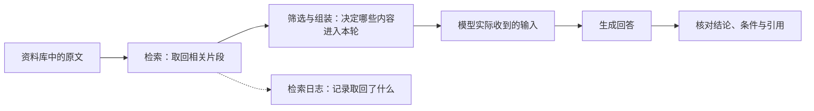

# 上下文不是用户问题的同义词：看清模型本轮真正收到什么

你给模型发了一句很短的问题：“这台设备能申请退货吗？”检索工具也显示找到了相关规定。可是，模型最后的回答仍然漏掉了凭证条件。

这时，不能只看问题有多少字，也不能只看检索日志里有没有那条规定。需要继续确认：本次调用到底包含了哪些信息，相关条款有没有进入实际输入，模型的答案有没有正确使用它。

第 07—09 课把任务、示例和步骤说清楚。第 10 课把观察范围扩大到**整份调用的信息组成**：规则、历史、工具说明、问题和证据都可能参与输入，输出还需要留出相应空间。

本文对应《AI学习目录》第 10 课“上下文不是用户问题的同义词”。读完并完成练习后，你应能：

1. 列出规则、工具说明、历史、问题、证据与输出等不同开销。
2. 区分“在检索日志里找到”与“真正进入模型输入”。
3. 优先保留任务相关信息，剔除无关历史，保住必要条件。
4. 分清标称容量、装得下和有效使用，不把大窗口当成必须填满的容器。

你只需要能够阅读材料和做简单加减。本文的 8,000 Token 账本及各项数值都是课程教学设置，不是某个产品的窗口规格、默认分配或计费结果。设备规则与日期同样属于教学场景，不是现实制度。

## 一、上下文要看整份输入，不能只看最后一句话

**上下文 Context**在这里指本次生成可使用的信息。我们先从最容易核对的一端开始：应用实际提供给模型的输入，由哪些部分组成？

最后一条用户问题只是其中一部分。一次调用还可能包含任务规则、之前的消息、工具定义、示例、检索原文与工具返回内容。有哪些部分、怎样排列，要查看实际请求，不能从聊天界面的最后一句话推断。[^组成]

| 信息类型 | 它在本次任务里做什么 | 需要分清的地方 |
| --- | --- | --- |
| 稳定任务规则 | 规定任务范围、输出要求和需要保留的条件 | 规则表达要求，不自动证明答案已符合要求 |
| 当前用户问题 | 指定本轮要回答什么、提供本次事实 | 问题短，不代表整个输入短 |
| 相关历史 | 保留仍影响本轮判断的约束、事实和中间结果 | 历史是否进入本轮，要看应用实际保留了什么 |
| 工具说明 | 介绍可用工具、用途和参数要求 | 定义工具能力，不等于工具已经返回了证据 |
| 检索资料与工具结果 | 为当前判断提供材料或观测 | 在外部日志中存在，不等于原文已经送入模型 |
| 示例 | 展示希望得到的格式或判断方式 | 示例也是输入；不能用示例标签替代当前事实 |

这些类型不要求每次都齐全。同一段文字也可能同时承担几种用途，分类是为了说明加入理由，而不是规定所有系统都使用六个固定字段。

### 本轮输出还需要预留空间

**上下文窗口**是模型处理序列时的容量约束，通常以 Token 表示。**Token 预算**则是我们为本次任务安排输入与输出所用空间的计划。

本课采用一个明确的教学约定：输入和新增输出共同放在 8,000 Token 的账本中。因此，除了已准备的输入，还要给接下来生成的回答预留空间。[^窗口]

**输出预留是计划，不是已经发送的输入内容**。例如，留出 `1,000` 并不表示这次调用开头已经有一段 `1,000` Token 的回答，也不表示模型最后一定生成这么多。

实际模型与接口怎样限制总长度、输入长度和输出长度，需要读对应版本的文档。本文只对已经写明的教学账本做计算，不将其变成所有服务的通用配置。

## 二、检索到了资料，还要让相关原文进入本轮

为把信息组成落到具体任务上，沿用课程的设备问答：

> 2025-06-12 提出申请，购买设备签收第 10 天，未拆封，有含订单号的电子凭证，能申请退货吗？

课程用提出申请的日期选规则，签收当天计第 `0` 天。乙从 2025-06-01 起生效，替代甲的购买退货规则；丙规定租用归还，不适用于这次购买退货。

这个问题需要用到的关键原文包括：

| 条款 | 本课教学原文 |
| --- | --- |
| 乙1 | 购买设备在签收后第 0—14 天、未拆封，可以申请退货。 |
| 乙2 | 凭证可以是纸质发票，或含订单号的电子凭证；聊天截图不属于上述凭证。 |

用户事实与条款结合，才支持“满足本教学材料中的申请条件，可以申请”这一有限结论。它仍不表示已经批准或退款。[^课程]

如果只把“第 10 天”放进输入，模型缺少拆封与凭证事实；如果只送入乙1，模型没有乙2中规定的凭证范围。两者都不能用“我已经检索过了”补上。

### 资料在哪里，是一个需要逐步核对的问题



从资料库到实际输入，中间还有筛选与组装。资料在库里、检索取回了片段、应用把片段送入模型，是三个不同状态。[^组成]

例如，教学排查记录可以明确给出：

```text
检索返回：乙1完整原文、乙2完整原文
最终组装的输入：当前用户事实、乙1完整原文
乙2：未进入本次输入
```

依这份记录，乙2已经被检索到，却没有被组装进最终输入。应先排查筛选与组装环节，不能据此说“模型看到了乙2，却忽略了它”。

如果只有一条写着“命中乙2”的日志，却没有最终输入记录，则还不能确认原文究竟在哪一步缺失。应继续查看实际返回内容和组装结果，而不是凭最终答案猜原因。

### 原文进入了，也还要检查是否用对

另一种情形是乙1、乙2都已完整进入输入，但回答把“含订单号的电子凭证”写成了“所有截图都可以”。

这时，输入存在性已经确认，回答却没有忠实保留条件。下一步应核对生成结果怎样使用条款，不能仅凭“引用了乙2”就通过验收，也不能只靠再检索一次证明问题解决。

**找到、送入和用对，是三项分别需要证据的检查**。这一课先让你看清信息链路，后续检索与评估课程再展开各阶段的方法。

## 三、8,000 的教学预算，怎样一步步剩到 4,200？

现在把空间限制加入刚才的流程。想象一张大小有限的工作台，用户问题只占一张小纸条，规则、工具说明、历史和证据也要放上去；回答还要留出位置。

这个类比只帮助理解分配。实际计数以 Token 为单位，不能用纸张数、中文字符数或单词数直接替代。

课程给出的账本是：

| 项目 | 教学预算或占用 |
| --- | --- |
| 总预算 | 8,000 |
| 稳定任务规则 | 600 |
| 工具说明 | 900 |
| 当前问题 | 100 |
| 相关历史 | 1,200 |
| 输出预留 | 1,000 |
| 剩余证据预算 | 4,200 |

把减法展开：

```text
8,000 − 600 − 900 − 100 − 1,200 = 5,200
再为输出预留1,000：
5,200 − 1,000 = 4,200
```

所以用户问题虽然只占 `100`，本次可放证据的空间并不是 `7,900`。其他输入与输出预留也要算进去。

`4,200` 是证据可以使用的剩余预算，不表示已经发送了恰好这么多证据。实际选入的片段还需要计数，并保留来源与完整条件。

### 无关历史怎样挤占必要证据？

如果把昨天的食谱闲聊也放进来，教学占用为 `3,500`，则：

```text
4,200 − 3,500 = 700
```

证据只剩 `700`。在本次设备规则问答里，食谱没有帮助，却挤占了本可用于乙1、乙2及必要事实说明的空间。

这不能直接证明某条规定一定放不下，因为还没给出条款的实际 Token 数；它证明的是，本账本能分配给证据的空间已经显著缩小。

**只计算用户问题，会漏掉整份请求里的其他开销**。同样，预算只是计划，实际输入与输出计量、缓存计量和费用仍要按具体请求记录与服务规则分别核对。[^窗口]

## 四、选择信息，先保住决定答案的条件

预算紧张时，目标不是把每段文字都平均削短，而是确认哪些信息决定本轮结论。

回看设备问答，可以这样区分：

| 信息 | 本轮是否需要 | 加入或保留的理由 |
| --- | --- | --- |
| 当前申请日期、购买对象 | 需要 | 决定适用哪份规则 |
| 签收第 10 天 | 需要 | 与乙1的天数范围比较 |
| 未拆封 | 需要 | 是乙1的必要条件 |
| 含订单号的电子凭证 | 需要 | 是当前事实，与乙2的凭证规定对应 |
| 乙的生效与适用范围、乙1和乙2原文 | 需要 | 提供条款依据，保留条件与排除情形 |
| 昨天的食谱闲聊 | 本例不需要 | 与当前设备判断无关 |
| 工具结果中的重复内容 | 需要检查后去重 | 去重时仍保留可定位的原文和来源 |

删除食谱属于选择相关信息。删掉“未拆封”，却会使申请条件缺一项；把“含订单号”删掉，只剩“电子凭证”，也改变了用户事实所能支持的范围。

乙2中的“聊天截图不属于上述凭证”同样要保留。它是明确排除情形，不能为了更短，将完整规则改成“电子凭证或截图均可”。

**减少无关内容与删除必要条件，产生的是不同结果**。判断该删什么，要看它是否仍影响本轮目标、事实核对和来源检查，而不是只看它来自哪一天或有多长。

### 历史的年龄，不直接决定相关性

如果此前用户提供的设备状态仍影响这次判断，它即使在旧消息里，也需要确认并保留。反过来，一段刚刚返回的长日志，如果大部分与任务无关，也不应仅因“最新”就全部进入输入。

本课先完成“为何加入”这一判断。旧历史怎样摘要、哪些信息需要原样保存，会在第 11 课继续讨论；这里不把简单删除当成所有场景的压缩方案。

### 工具说明与工具结果，要分别看

工具说明告诉模型怎样使用一项能力；工具返回提供调用之后实际得到的内容。前者可能占用输入空间，但并没有替模型读到乙2。

返回结果也要看内容有没有进入后续生成请求。仅保存到外部文件、数据库或日志里，只是外部状态；若本轮要依赖其中事实，就需要把必要内容取回并纳入实际输入，或通过已明确的读取步骤获得它。[^组成]

## 五、标称容量、装得下与用得好，分别检查什么？

模型支持的窗口越大，能够安排的输入空间可能越多。但“支持这个长度”与“能稳定使用这个任务中的全部关键信息”，仍然是两个问题。

| 判断 | 能说明什么 | 还不能说明什么 |
| --- | --- | --- |
| 标称容量 | 相应模型或接口声明的长度约束 | 本任务在接近该长度时仍可靠 |
| 这次装得下 | 实际输入及所需输出符合相应限制；在本例中满足教学账本 | 必要事实、乙1和乙2真的都进入了输入 |
| 信息被有效使用 | 对指定任务核验了证据覆盖、条件保留和回答支持 | 所有其他任务或更长输入也会同样可靠 |

因此，大窗口提供容量条件，不是填满窗口的目标。保持空余本身也不能证明答案更好，关键仍是保住当前任务需要的信息，并检查结果。[^位置]

### 为什么还需要看证据在输入里的位置？

《Lost in the Middle》v3 在多文档问答和键值检索任务中研究了相关信息位置的影响。其受测模型在一些设置下，相关信息位于长输入中部时表现更差，说明能够接收长输入，不等于稳健使用其中的信息。[^位置]

这不是所有后续模型都会按同一规律或同一幅度退化的定律，也不能只凭一次错误答案，就断言发生了“中间遗忘”。

对本次任务，可以先核对乙2是否完整存在，再在固定材料与问题的条件下调整其位置，记录凭证判断与引用是否变化。位置是需要验证的条件，不能直接被当成已经确定的失败原因。

### 缓存命中，不会把内容从容量账本中移走

**缓存**可以复用已经处理的部分计算，或在服务支持时改变相应计量与计费。它不等于从当前上下文中删除文本。[^缓存]

如果教学账本中那 `3,500` Token 的食谱仍被纳入当前输入，即使相应历史计算命中缓存，它仍是本轮的无关内容，证据预算仍按这个账本只剩 `700`。

**计算复用与上下文容量，要分别核对**。缓存不自动选择正确证据，也不证明新增内容和回答已经合格；具体缓存机制留到第 26 课。

## 六、合上文章，完成四个基础检查

先独立作答，再读下一节。这四题检查请求组成、实际输入、相关性选择和容量边界。

### 检查 1：画出这次调用包含什么

本次设备问答有稳定规则、工具说明、当前问题、相关历史、乙1和乙2检索原文，并计划最多使用 `1,000` Token 写回答。

把这些内容按作用分类，说明输出预留是否已经属于发送给模型的输入。只知道当前问题为 `100` Token，能否算出整份请求的占用或实际费用？

### 检查 2：已经命中，为什么还不能说模型看到了？

已确认检索返回包含乙2完整原文，但最终组装的请求只有用户事实和乙1，没有乙2。

当前应先排查哪个环节？能否据此说模型忽略了已经可见的乙2？如果没有拿到最终输入记录，你还缺哪种核对信息？

### 检查 3：保留什么，删除什么？

沿用本课预算，昨日食谱占 `3,500` Token。有人建议保留全部食谱，把用户事实里的“未拆封”“含订单号”以及乙2里的“聊天截图不算凭证”删掉。

这种选择有什么问题？怎样调整更符合当前任务？删除本例食谱后，证据预算恢复到多少？如果食谱命中缓存，是否可以把它当成不占窗口？

### 检查 4：历史增长后，分别验收容量与结果

总预算仍是 `8,000`，相关历史从 `1,200` 增到 `2,600`，其他预算项目不变，也不加入食谱。

剩余证据预算是多少？如果已经证明没有超出账本，还需要检查哪些条件，才能确认本次设备问答合格？

## 七、参考答案与过关点

### 检查 1 的答案

- 稳定规则说明任务边界与输出要求。
- 工具说明描述工具能力和参数，不是退货证据。
- 当前问题提供目标和本次事实。
- 相关历史保留仍影响判断的约束或中间结果。
- 乙1、乙2原文提供事实依据，必须确认实际进入输入。
- 输出 `1,000` 是生成空间的计划，不是已经存在的回答文本。

只知道问题占 `100`，不能算整份请求的占用，也不能确定实际费用。还缺其余输入的真实计数、实际输出及相应服务计量规则。

**过关点**：各部分用途分开，知道输出预留与已发送输入不同，整体占用不能由最后一句问题代替。

### 检查 2 的答案

在给定记录中，检索已返回乙2，最终输入却缺失，应先排查筛选与组装环节。不能说模型忽略了已经可见的乙2，因为它并未进入本次输入。

没有最终输入记录时，尚需核对实际组装并交给模型的内容，确认相关片段及其条件是否完整。检索命中记录本身不能完成这一步。

**过关点**：按已确认的输入定位流程，不从日志或最终答案补造“模型看到了”的判断。

### 检查 3 的答案

保留食谱却删除必要条件，会损害设备问答。“未拆封”是乙1条件，“含订单号”关系到当前凭证是否符合乙2，聊天截图的排除情形也影响规则解释。

本例应移除与任务无关的食谱，保留用户必要事实、适用规则与条款来源。证据预算从 `700` 恢复为 `4,200`。

如果食谱仍在当前输入里，缓存命中不让它成为免费容量；仍要按本教学账本计入。

**过关点**：按任务相关性取舍，保住否定与限定条件，分清省计算和释放输入空间。

### 检查 4 的答案

```text
8,000 − 600 − 900 − 100 − 2,600 − 1,000 = 2,800
```

证据预算剩 `2,800`。预算通过只说明在本账本里分配合规，仍需检查：

1. 当前申请事实和适用范围是否完整。
2. 乙1、乙2是否真正进入实际输入，关键条件是否保留。
3. 答案是否正确使用这些条款并有对应引用。
4. 结论是否停在“可以申请”，没有扩大为“已经批准”或“退款完成”。

如果进一步讨论证据位置和长输入效果，需要针对本任务验证，不能仅凭标称长度作保证。

**过关点**：算对剩余预算，同时区分容量、证据进入与答案支持这几层验收。

### 怎样确认已经掌握？

能独立完成四题，换一组历史长度或信息条件也能重新检查，就覆盖本课的四项基础要求。若卡住，可以按下表回读：

| 卡点 | 回读位置 |
| --- | --- |
| 把上下文等同于最后一条消息 | 第一节的输入组成与输出预留 |
| 认为检索命中就等于已送入模型 | 第二节的信息链路 |
| 按字数删掉关键条件，却保留无关历史 | 第四节的加入理由与必要信息 |
| 认为预算通过或窗口大就证明正确 | 第三节账本与第五节的不同判断 |

文章与算例提供达标路径，实际掌握仍以独立作答为准。

## 八、可选进阶：用固定条件检查信息怎样被使用

继续使用本课问题和乙1、乙2，可以做两组分开的对照：

- 第一组保持材料与问题内容不变，只调整乙2的位置，分别放在开头、中间、末尾。
- 第二组固定原位置，加入等长的无关材料，观察凭证判断和引用是否变化。

两组分开，才有机会区分位置变化与无关内容引入的影响。比较时保留模型版本、任务要求、生成设置和输入记录；仅有一句“变长之后错了”不足以归因。[^位置]

每次至少记录乙2是否完整进入、输出是否保留订单号和聊天截图排除条件、引用是否支持结论。若只是找到更多相关文档，却没有核对它们最终怎样进入输入，对照仍然不完整。

### 预算、实际计量与费用，各自留记录

预算是准备调用时的计划，实际输入与输出计量是调用记录，费用还取决于模型、服务、缓存计量及其他适用规则。

本课的 `8,000` 只是账本上限，不是账单。不能将输出预留 `1,000` 直接当成实际生成量，也不能用一次缓存命中推断所有后续调用的费用。

如果当前工具无法展示完整请求或真实统计，应说明能核对哪些部分、还缺什么，不能从可见用户消息补算隐藏内容。这一节不提供任何产品的具体计费配置。

## 带着实际输入进入下一课

第 07 课先问“任务有没有表达清楚”，第 10 课继续问“模型本轮真正得到的材料是否足够、相关且完整”。任务说得清楚，也仍需要检查信息有没有实际送到。

第 11 课将处理历史太长时怎样压缩而仍能正确接续，第 12 课继续分清材料身份与可信边界。第 13 课再展开检索链路，第 26 课回到缓存复用。

这一课先留下一个可执行的习惯：**核对整份实际输入，保留必要证据，再分别验收容量与答案**。不是把能找到的材料都塞进去，也不是只盯着用户问题有多短。

## 依据与回查

本文依据《AI学习目录》第 10 课及《32课学习设计与掌握目标》中该课要求组织教学。预算数字、设备事实、乙条款和删除条件的例子为课程教学设置；示范排查记录是为了说明检索与组装的区别，不代表已经完成真实请求抓包或模型效果测试。

[^组成]: [晴天AI实战《第一期：从 Prompt 到 Context》](https://www.bilibili.com/video/BV1pmMb6GEAM)用于回看上下文信息组成；[《AI 提示词工程 上下文工程 15分钟弄懂！》](https://www.bilibili.com/video/BV1iweMzXEm2)用于回看输入组织与历史管理。本文只按主要用途分类，不规定所有接口都使用相同字段。
[^窗口]: [晴天AI实战《第二期：窗口与token》](https://www.bilibili.com/video/BV1r5MH6QEgD)用于回看窗口、Token 与预算；[OpenAI《Prompt engineering》](https://developers.openai.com/api/docs/guides/prompt-engineering)的 Planning for the context window 说明容量需按模型文档核对。本课共同计入输入输出的 8,000 账本是教学约定，不是产品规格。
[^课程]: 《AI学习目录》第 07、10 课及掌握目标提供设备规则、申请事实、条款编号与预算算例。课程尚无用户提供的公开发布网址，因此保留文字出处。乙1、乙2与设备场景都是人工教学材料，不作为现实退货制度。
[^位置]: [Liu 等《Lost in the Middle: How Language Models Use Long Contexts》v3](https://arxiv.org/abs/2307.03172v3)研究其受测模型在多文档问答与键值检索中的相关信息位置影响；结论限定于相应任务和模型，不自动推广到所有后续版本。本文只提出可核对的对照方式，没有报告新的实测结果。
[^缓存]: [《AI 提示词工程 上下文工程 15分钟弄懂！》](https://www.bilibili.com/video/BV1iweMzXEm2)与 [《第二期：窗口与token》](https://www.bilibili.com/video/BV1r5MH6QEgD)提供上下文和计算状态的说明；[OpenAI 提示工程指南](https://developers.openai.com/api/docs/guides/prompt-engineering)的提示缓存说明涉及成本和延迟复用。具体缓存行为应按所用实现核对，不能据命中把当前输入排除在容量核算之外。
