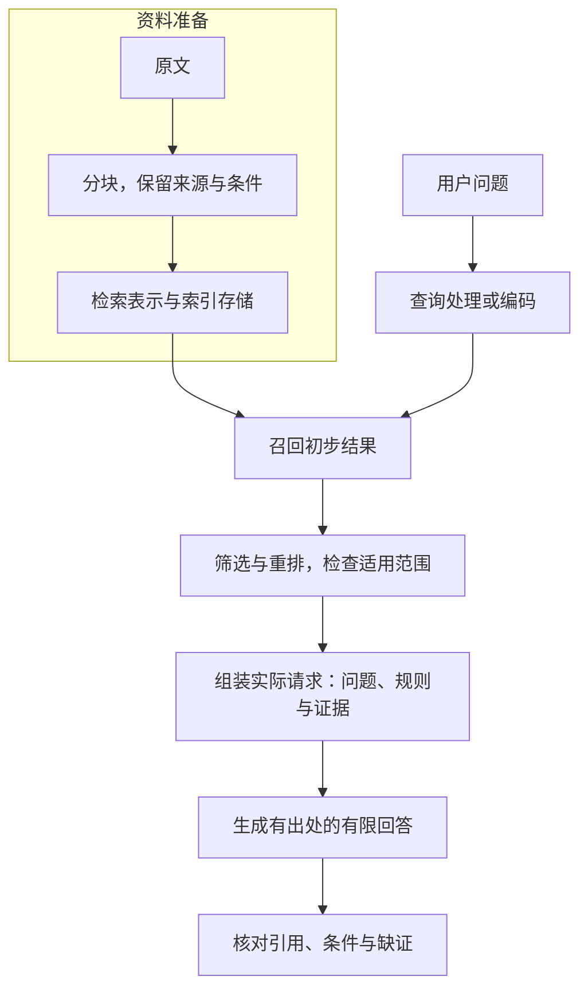

# RAG：先找依据，再生成有出处的回答

资料库里明明有正确条款，模型却仍然答错。它是没有找到条款，还是找到了却没放进请求，又或者条款已经在眼前但没有用对？

**RAG，Retrieval-Augmented Generation，检索增强生成**，在生成前从外部资料取得相关内容，再把证据与问题交给模型回答。要理解它，必须沿资料到回答的过程检查每一步，而不只是“接上向量库”。[^流程]

本文对应《AI学习目录》第 13 课“RAG：先找依据，再生成”，按《32课学习设计与掌握目标》组织。读完并独立完成练习后，你应能：

1. 解释分块、召回、筛选或重排、组装与生成各自做什么。
2. 保留条款的对象、日期、完整条件和原文位置。
3. 分开检索排名与适用性，不把相似当成证据充分。
4. 根据分层记录，定位必要片段未找到、被筛掉、未入窗口或未被用对。
5. 说明重排为什么不能补回未召回内容，并在缺依据时停止相应断言。

你只需要会读材料、核对条件。正文可以手工完成，RRF 的名次计算和检索模型细节放选读；不需要安装向量数据库。本文的规则、排名与日志均为教学设计，**不是实际退货制度或检索模型实测结果**。

## 先补必要概念：资料库、片段、向量和证据

**资料库**保存可查询的文档；**片段**是从文档中整理出的检索单元。检索返回的内容，只有在来源、适用范围和原文都支持当前结论时，才可以作为该结论的证据。

检索 **Embedding，向量表示**，把问题或文本片段编码成便于比较的一组数。它不同于生成模型输入端按单个 Token ID 查出的初始向量；本课只用它理解语义检索，不计算具体坐标。[^检索]

**相似是查找信号，原文才承担事实依据**。两段材料都谈退货，也可能适用于不同日期、对象或凭证条件。

## 一、先分清准备资料和回答问题两条流程

### 准备阶段：让资料能被找到、能被回查

在本课的基础向量检索设置中，先把原文分块，用检索模型编码，保存向量、原文和来源信息。把这些内容组织成可查询的集合，叫建立**索引**。[^流程]

这通常是资料进入或更新时的工作，不要求每次提问都重新切分全部文档。更新后的内容是否已进入索引，也需要检查。

### 问答阶段：把找到的材料真正交给模型

用户提出问题后，系统按相应方式检索，得到初步结果，再筛选、排序、组装实际输入，最后生成回答。



向量检索示例要求问题与片段用相配的编码方式。本课沿原始资料采用同一检索 Embedding 模型；不能拿两个不相配的模型向量，未经核对就直接比较。

如果采用关键词检索，查询处理可以不经过向量编码。**RAG 不要求一定使用向量库，也不要求一定双路检索**；关键是取得支持问题的资料，并正确交给生成环节。

### 五个阶段，各有自己的产物

| 阶段 | 做什么？ | 可以检查什么？ |
| --- | --- | --- |
| 分块 | 确定每份可检索内容，保住必要上下文 | 块原文、来源、位置和条件是否完整 |
| 召回 | 按问题找出初步结果 | 必要片段是否进入本次返回集合 |
| 筛选／重排 | 在已取得的结果中筛掉不合适内容，或进一步排次序 | 哪些被保留、哪些被丢弃及其理由 |
| 组装 | 把问题、证据和回答约束放入真实请求 | 模型本次实际看到了哪些完整内容 |
| 生成 | 依据实际输入形成答案 | 每项断言是否被给定片段支持 |

资料存在、检索返回和模型实际看见，是三个不同状态。**某条证据出现在检索日志里，不等于已进入实际请求**。

## 二、分块要保住一个判断，不是只切出一句允许

### 教学问题与三个材料范围

继续课程主问题：

```text
2025-06-12提出申请，购买设备签收第10天，未拆封，
有含订单号的电子凭证，能申请退货吗？
```

用提出申请的日期选择规则，签收当天计第 `0` 天。三份材料的身份如下：

| 材料 | 发布日期 | 生效范围 | 适用对象与关系 |
| --- | --- | --- | --- |
| 甲 | 2024-12-20 | 2025-01-01—2025-05-31 | 旧购买退货规则 |
| 乙 | 2025-05-20 | 2025-06-01 起 | 购买退货，明确替代甲 |
| 丙 | 2025-06-10 | 2025-06-10 起 | 租用归还，不适用于购买退货，也不修改乙 |

发布日说明材料何时发布，生效范围说明何时适用，不能把两者合成一个含混的“日期”。

### 乙1、乙2是两份不同责任的证据

| 条款 | 本课需要完整保留的教学原文 |
| --- | --- |
| 乙1 | 购买设备在签收后第 0—14 天、未拆封，可以申请退货。 |
| 乙2 | 凭证可以是纸质发票，或含订单号的电子凭证；聊天截图不属于上述凭证。 |

乙1支持期限和未拆封条件，乙2支持凭证条件。主问题的完整资格结论需要它们共同支持。

本课把它们各自作为一块，并规定两块都保留下面的**元数据**，也就是随片段携带的材料描述信息：

```text
材料：乙。
发布日期：2025-05-20。
生效范围：2025-06-01起，替代甲的购买规则。
对象：购买设备。
原条款号：乙1或乙2，按该块实际内容填写。
原文位置：教学材料乙中对应条款全文。
原文：保留该条的完整条件与否定句。
```

这些是教程定义的记录要求，不是某个数据库的字段结构。真实工作中的文档名、版本、页码或段落标识，应从实际文件取得，不能凭空补造。

### 两种切坏的块

第一种只留下“可以申请退货”，把“购买、第 0—14 天、未拆封”切到另一个没有返回的块。读者看到的是扩大后的允许句，缺少条件。

第二种把乙2拆成两块，一块只有“电子凭证可以”，另一块才有“含订单号”和聊天截图排除。如果只召回第一块，同样会损坏凭证判断。

**结论、限定与必要否定要能一起取得**。块不必固定等于一个条款，但必须让当前问题所需的上下文可回查、可完整组装。[^分块]

相邻块保留一些重叠内容可以缓解边界损伤，却增加重复。没有对所有文档都最好的固定块长度；应由具体问题及失败案例检查分块是否合适。

## 三、从找到材料，到形成有依据的回答

### 召回：先取得初步结果

**Retrieval，检索**，按查询找到相关内容；**召回**在本课强调把需要的片段找进初步结果集合。

课程为说明两种信号，人为规定文档级排名：

```text
关键词结果：甲、乙、丙
向量结果：  乙、丙、甲
```

这些不是运行 BM25 或 Embedding 得到的实测。关键词信号与语义信号可以帮助找到不同材料，但原始分数的尺度未必相同，不能未经定义就直接相加。

本例按名次融合，得到 `乙>甲>丙`。计算放在选读，首遍只看它说明的是**文档先后次序**。[^融合]

**乙排第一，不证明乙1、乙2都已经被召回**。文档级排名与条款级证据是两个粒度；仍要检查返回了乙的哪些片段、内容是否完整。

### 筛选与重排：相关性与适用性分别看

**Reranking，重排**，对已经取得的结果进一步评分和排序。常见重排器会同时读取问题与片段，判断它们的相关性；本课不运行真实重排模型。[^检索]

筛选还可以检查明确条件：申请日期、对象、版本关系是否符合。

| 检索到的材料 | 与退货问题是否有话题联系？ | 对当前主问题是否适用？ |
| --- | --- | --- |
| 甲 | 有 | 申请日为2025-06-12，已超出甲生效范围 |
| 乙 | 有 | 当前购买规则适用，需要进一步取得乙1、乙2 |
| 丙 | 有设备归还相关内容 | 针对租用；丙2排除购买退货，不修改乙 |

甲可以排得很高，仍然失效；丙可以语义接近，仍然对象不符。**排名不能替代版本和对象核对**。

表中的条件核对是人工教学筛选，不是重排模型已经判断正确的报告。高相关分数也不单独保证条件适用。

### 组装：把两条证据放进实际输入

筛选后，围绕当前问题保留乙1、乙2，并把它们与来源、问题和回答约束交给模型。

一份教学组装记录可以是：

```text
实际输入中的问题：2025-06-12，购买，第10天，未拆封，含订单号电子凭证。
规则身份：乙，2025-06-01起适用，明确替代甲。
实际证据：乙1完整条款；乙2完整条款，含订单号限定与聊天截图否定句。
来源位置：教学材料乙，分别定位乙1、乙2全文。
输出要求：仅按给定证据作结论；注明条款；缺依据说明缺口；不宣称已退款。
动作边界：本次仅判断，没有执行申请、批准或退款。
```

组装时不只是保留“乙2”这个名称，还要确认完整条款内容在本次输入里。只有块编号却没有原文，或原文被截掉限定句，都不能算证据完整。

### 生成：逐项判断，再给有限结论

模型应依据实际片段判断：

| 条件 | 主问题事实 | 依据与判断 |
| --- | --- | --- |
| 日期与对象 | 2025-06-12，购买设备 | 使用乙，而不是甲或丙 |
| 期限 | 签收第 10 天 | 乙1允许第 0—14 天，通过 |
| 拆封 | 未拆封 | 满足乙1相关条件 |
| 凭证 | 含订单号电子凭证 | 满足乙2相关条件 |

合格回答可以写：

```text
按教学材料乙的乙1、乙2，满足展示的购买退货申请条件，可以申请。
乙1支持期限与未拆封，乙2支持凭证。
本次没有执行申请、批准或退款。
```

**引用要支持它旁边的那项结论**。只给一个看起来相关的来源名，不能掩盖凭证依据缺失，也不能把“可申请”升级为“已完成”。

## 四、答案错了，沿哪些记录定位原因？

### 保存每一层交出的真实结果

下面是本课的分层记录，不是特定 API 的日志字段：

| 要留的记录 | 用来回答什么问题？ |
| --- | --- |
| 问题及查找条件 | 本次到底在找什么，对象与日期有没有改变？ |
| 分块与索引内容 | 必要原文是否已成为可找到且完整的片段？ |
| 召回结果及片段原文 | 乙2是否被找到，而不是只在资料库里存在？ |
| 筛选／重排后的结果 | 乙2是否在这个阶段被丢弃？ |
| 组装后的实际请求 | 模型有没有收到乙2的完整内容？ |
| 最终回答及引用 | 模型是否正确使用乙2，没有补写事实？ |

**先看记录，再判断错误在哪一层**。只看到“答案不对”，无法直接认定是向量模型不好。

### 四种“乙2丢了”，原因并不相同

| 教学轨迹 | 乙2在召回结果中 | 乙2在筛选后保留 | 乙2完整内容在实际输入中 | 先定位哪里？ |
| --- | --- | --- | --- | --- |
| 1 | 否 | 否 | 否 | 先核分块与索引，再查召回 |
| 2 | 是 | 否 | 否 | 筛选／重排为什么丢弃 |
| 3 | 是 | 是 | 否 | 组装为什么漏放或截掉 |
| 4 | 是 | 是 | 是，但回答把聊天截图说成合格 | 生成对已提供证据的误用 |

第四行以**乙2完整条件已经进入实际请求**为前提。若只有片段名，或否定句已经被截掉，就要继续查内容与组装，不能草率跳到生成层。

如果乙2从来没有进召回集合，需要进一步检查：原文有没有导入、块有没有切坏、索引是否更新、查询是否覆盖凭证问题、检索返回范围是否漏掉它。仅凭“未找到”仍不能直接锁定某个组件。

### 重排为什么不能补回未召回的块？

在标准两阶段流程里，重排接收已召回集合，再给这些内容排序。乙2根本不在输入集合中，换次序不能把它凭空加进来。[^检索]

需要重新查找、补读材料，或修复分块与召回。这会新增一次取得资料的工作，不是“原集合内重排”完成的。

**只换更大的生成模型，也不等于给它补齐缺失证据**。生成模型仍需看到适用且完整的依据。

## 五、缺了一条依据，应该停下什么断言？

### 只有乙1和丙1，却说“电子凭证合格”

沿课程练习，最终窗口只有：

```text
乙1：第0—14天、未拆封的购买申请条件。
丙1：租用设备第0—30天归还。
```

问题仍是购买设备、含订单号电子凭证。乙1没有说明凭证类型，丙1针对租用，二者都不支持“电子凭证符合购买规则”。

即使资料库其他位置存在乙2，这次实际输入没有它，**本轮不能凭记忆补出缺失条款，并把结论写成已有证据支持**。

可以交付有限说明：“给定乙1支持期限与未拆封条件，但当前缺少凭证条款，尚不能确认凭证资格；需要取得适用的乙2。丙1不适用于购买退货。”

停止的是凭证合格与完整资格的无据断言，仍可以说明已经得到什么和缺什么。

### 修复后，重新检查受影响结论

修复流程应查乙2在哪一层丢失，取得并核对其完整原文，再确认它真正进入实际请求，最后重新判断凭证与结论。

取得乙2后，对原主问题可以据乙1、乙2说“可申请，尚未执行”。若新题改成第 `14` 天、未拆封、仅有聊天截图，则期限和拆封满足乙1，凭证被乙2排除，应说不满足展示的条件。

**取得一条新证据后，仍要按当前输入判断**，不能自动复用旧的允许结论。

同样，若问题是“谁负责放行工具调用”，只检索到“模型提出请求”，没有权限与执行侧资料，就不能推出“模型自己批准执行”。话题相关片段不一定覆盖问题要求的全部依据。

## 六、先用手工练出完整证据流程

对于本课三份短材料，不必先搭系统。可以在已经提供的材料中完成：

1. 明确问题的日期、对象、必要条件。
2. 找出乙1、乙2两段完整原文，记录来源与位置。
3. 核对甲失效、丙对象不符，保留乙适用依据。
4. 把问题、两条证据和输出约束组成一份可见材料包。
5. 写出逐项依据与有限结论，再检查有无遗漏或夸大。

这练习了“找到材料后，怎样让它支持回答”。**手工证据包不是已经实现完整自动检索系统**，也不证明生产召回率或运行延迟。

片段来自真实问题的适用来源、条件完整、位置可回查，是先要建立的能力；模型、索引和算法之后再按需求选择。

## 七、合上文章，完成五个基础检查

练习沿本篇已给的教学规则，不使用真实服务。先独立作答，再看下一节。

### 检查 1：把五个阶段与产物分开

分别说明分块、召回、筛选或重排、组装、生成做什么，每阶段给一个可检查产物。

乙2在资料库里、在召回日志里、在实际请求里，这三种状态是否等价？如果采用关键词检索，是否一定还要向量编码？

### 检查 2：修复一个不完整的条款块

一个块只保存“凭证可以是电子凭证”，没有材料名、日期、对象、订单号限定或聊天截图排除。

按本课乙2重写这份教学块：给出完整原文和必要元数据，注明原文位置。为什么只扩大块长度却不核对内容，也不能直接认定分块已经合格？

### 检查 3：判断排名能支持什么

关键词把甲排第一，向量把乙排第一，融合后是乙、甲、丙。申请仍是 `2025-06-12`、购买设备、第 `10` 天、未拆封、含订单号电子凭证。

说明甲、丙为什么不适用。乙排第一是否证明乙1、乙2都已取得？拿到完整乙1、乙2后，能说已退款吗？

### 检查 4：从轨迹判断先查哪层

给定一条记录：乙2已被召回，筛选后仍保留，但实际请求只有乙1。另一条记录则确认乙2全文已进请求，回答仍说“聊天截图合格”。

分别先查哪层？为定位问题，应取得哪些内容而不只是片段名称？为什么不能把两条记录都直接归因于Embedding？

### 检查 5：重排与补证据分开

本次召回只有乙1、丙1，没有乙2；模型回答“电子凭证合格”。

仅把现有两个块重新排序，能补回乙2吗？当前应停止哪项断言，先怎样排查？若重新取得完整乙2并进入请求，而新题是第 `14` 天、未拆封、仅有聊天截图，最终应怎样回答？

## 八、参考答案与达标标准

### 检查 1 的答案

| 阶段 | 用途 | 一份可检查产物 |
| --- | --- | --- |
| 分块 | 把资料整理成保留上下文的检索单元 | 原文块与来源元数据 |
| 召回 | 按问题取得初步内容 | 返回片段及其完整文本 |
| 筛选／重排 | 在已取得结果中筛选或调整先后 | 保留结果与丢弃记录 |
| 组装 | 构成本次模型实际输入 | 包含问题、证据与约束的真实请求 |
| 生成 | 用给定内容回答 | 各断言与出处对应的有限答案 |

三种乙2状态不等价。资料存在不代表召回，召回不代表输入，进入输入也仍需正确使用。关键词路线不必进行向量编码，RAG也不要求两路检索。

**过关点**：阶段职责与产物正确，分清准备、检索和真实可见性。

### 检查 2 的参考答案

```text
材料：乙。
发布：2025-05-20。
生效：2025-06-01起，替代甲的购买规则。
对象：购买设备。
原条款号：乙2。
原文位置：教学材料乙，乙2全文。
原文：凭证可以是纸质发票，或含订单号的电子凭证；聊天截图不属于上述凭证。
```

原错误块扩大了允许范围且失去追溯信息。变长仍可能加进无关句或继续遗漏否定，必须检查它是否完整保留了当前判断所需条件，而不是只看长度。

**过关点**：对象、发布日期、生效范围、条款位置、允许项与否定都可核对，不编造实际数据库字段。

### 检查 3 的答案

甲在申请日已超出生效范围，乙明确替代甲；丙是租用归还，丙2说明不适用于购买也不修改乙。

乙排第一只说明本例文档排序，不能证明其所需条款都已作为完整片段取得。还需检查乙1、乙2原文和实际输入。

两条完整证据支持原主问题“可申请，尚未执行”，不证明实际批准或退款。

**过关点**：把名次、条款覆盖与适用性分开，结论强度不越过材料或动作状态。

### 检查 4 的答案

第一条先查组装：乙2已通过召回和保留，但实际请求漏掉它。应读取召回原文、筛选后记录及实际输入，对比是否漏放或截断。

第二条以乙2完整原文已进入请求为前提，应查生成是否错误使用否定条件，逐句对照回答和引用；若实际文本并不完整，则这个前提不成立，还要回查前面的内容处理。

不能只读块名称。Embedding负责的查找与后续组装、生成是不同环节，当前两条记录已经提供不同层的证据。

**过关点**：按具体轨迹定位，不凭同一种错误表象猜根因。

### 检查 5 的答案

重排只处理已输入的乙1、丙1，不能凭换顺序生成缺失的乙2。先确认乙2原文是否导入、分块和索引是否完整，再查本次查询与召回结果；必要时重新检索或补读。

当前停止“电子凭证合格”和完整申请资格的无依据断言。可以说明乙1已支持的条件，并指出凭证依据缺失、丙1不适用于购买。

重新取得完整乙2并核对它进入输入之后，新题第 `14` 天、未拆封满足乙1，但仅有聊天截图被乙2排除，因此不满足展示的申请条件；没有执行退款。

**过关点**：分清重排序和新取得资料，能有限回答缺证问题，并按变化后的输入重核结论。

### 达标与回读

能独立完成五题并解释理由，就覆盖本课五项基础目标。卡住时按具体环节回读：

| 卡点 | 回读位置 |
| --- | --- |
| 只知道向量库，不知道流程产物 | 第一节 |
| 分块只摘允许句，丢条件与来源 | 第二节 |
| 相似或排第一就当成适用且齐全 | 第三节 |
| 答错就直接换Embedding或模型 | 第四节的分层记录 |
| 重排缺失集合，却继续凭证断言 | 第五节 |

一次演示跑通不能证明所有问题可靠；独立定位、来源核对和变式判断才是本节的验收。

## 九、可选进阶：混合检索与RRF怎样算？

### 关键词与语义信号可以互补

词法检索利用文字匹配信号，对专名、编号和明确术语有用；语义检索比较问题与片段的表示，帮助查找不同措辞的相关内容。

**Hybrid Retrieval，混合检索**，把多路结果结合起来。它是本课展示的一种选择，不是RAG必需组件。实际效果需要任务评估，不能由“有两路”就认定不再漏检。[^流程]

### RRF用名次，避免直接混加不相配的原分数

**RRF，Reciprocal Rank Fusion，倒数排名融合**，按文档在各路结果中的名次计算融合值。本例各路等权，平滑常数固定为课程的 `60`，名次从 `1` 开始：

```text
每一路贡献 = 1 ÷ (60 + 该路名次)
该材料融合值 = 两路贡献相加
```

把课程文档级排名代入：

| 材料 | 关键词名次 | 向量名次 | 融合计算与结果 |
| --- | --- | --- | --- |
| 甲 | 1 | 3 | `1/61 + 1/63 ≈ 0.03226646` |
| 乙 | 2 | 1 | `1/62 + 1/61 ≈ 0.03252247` |
| 丙 | 3 | 2 | `1/63 + 1/62 ≈ 0.03200205` |

结果为乙、甲、丙。RRF公式支持多路名次合并；这里的三份材料、名次和常数都是教学设置，`60`不是所有任务的最佳值。[^融合]

这些数不是“答案为真的概率”，也不是条款适用程度。排序之后，仍要核对甲的失效日期、丙的租用对象，并取得乙1、乙2原文。

### 检索模型与重排模型的分工

Sentence Transformers文档展示两阶段路线：先用词法或双编码器取得初步结果，再用 **Cross-Encoder，交叉编码器**，把查询和片段一起送入模型评分。它能利用更细的关联，却只对提供给它的内容工作。[^检索]

这里是在说明角色，不要求安装该库，也不固定返回条数。配置、模型和实际输入字段要按所用系统确认。

查询增强可以扩展用词或拆出子问题；它改变的是查找方式，不为答案创造新的事实。为检索生成的假设材料，也不能未经原件支持就作为结论证据。

本课不展开检索系统项目、训练框架或全文全局分析。局部片段检索与概括整份文档结构的任务不同，下一课将按问题需求比较更多知识组织入口。

## 下一步：先看问题，再选择知识组织方式

你现在能够从条款块出发，跟踪召回、筛选、组装与生成，保住来源和条件，并在缺证时停住相应断言。

第 14 课“GraphRAG 与 LLM Wiki 各解决什么”会继续区分局部事实、关系与全局主题、长期综合等查询需求。不同入口仍然要能回到原件，不能以结构复杂或检索更快替代证据支持。

## 依据与回查

甲乙丙范围、乙1和乙2分块、两路人工排名、RRF常数与数值、缺乙2的故障案例来自《AI学习目录》第 13 课及其统一教学材料；目标来自《32课学习设计与掌握目标》。四类日志轨迹与第 `14` 天聊天截图题按已有流程和条款构造。

课程没有在本次提供公开网址，因此只写文字出处。公开资料支持检索机制与分工，不是本篇人工文档排名的实验报告。

| 公开来源 | 回查位置与支持范围 |
| --- | --- |
| [Anthropic：Introducing Contextual Retrieval](https://www.anthropic.com/engineering/contextual-retrieval) | RAG准备与检索流程、片段丢上下文的问题、词法／语义组合及重排；具体实验收益不作本任务保证 |
| [Elastic：Reciprocal rank fusion](https://www.elastic.co/docs/reference/elasticsearch/rest-apis/reciprocal-rank-fusion) | RRF定义和从1开始的名次公式；不据此推断所有系统的API字段或配置 |
| [Sentence Transformers：Retrieve & Re-Rank](https://www.sbert.net/examples/sentence_transformer/applications/retrieve_rerank/README.html) | Retrieve & Re-Rank Pipeline、Retrieval: Bi-Encoder、Re-Ranker: Cross-Encoder；初步检索与精排分工 |
| [这就是RAG：个人知识库架构原始讲解](https://www.bilibili.com/video/BV19RJhzyEWN) | 基础链路、检索表示、分块与局部检索限制 |
| [第四期：RAG检索增强生成原始讲解](https://www.bilibili.com/video/BV17eNu6zEbx) | 混合检索、RRF、分层评估与查询增强的教学线索 |

本次读取完整库内原始资料与目标课，核对公开文档对应内容，运行既有RRF教学算例并复算数值，检查条款、题目答案及本地Markdown渲染。未重新核对完整音视频，未搭建检索服务或调用真实模型，未取得发布平台预览，也未做新手试读；掌握以独立作答为准。

[^流程]: [Anthropic Contextual Retrieval](https://www.anthropic.com/engineering/contextual-retrieval)的RAG基础流程与词法／语义组合；[个人知识库原始讲解](https://www.bilibili.com/video/BV19RJhzyEWN)。本文的五阶段记录是教学整理，不是某框架的固定接口。
[^检索]: [Sentence Transformers Retrieve & Re-Rank](https://www.sbert.net/examples/sentence_transformer/applications/retrieve_rerank/README.html)的两阶段检索、相配编码与Cross-Encoder评分。相似与适用性、证据充分性仍需按当前任务核对。
[^分块]: [Anthropic Contextual Retrieval](https://www.anthropic.com/engineering/contextual-retrieval)的上下文缺失与块边界讨论；乙条款、日期及完整否定要求来自课程人工材料，不宣称按本例分块即可复现官方实验收益。
[^融合]: [Elastic RRF公式](https://www.elastic.co/docs/reference/elasticsearch/rest-apis/reciprocal-rank-fusion)，各路按倒数名次累加；[RAG检索原始讲解](https://www.bilibili.com/video/BV17eNu6zEbx)的混合检索框架。本例排序与条款证据分别核对，不把融合值当事实概率。
