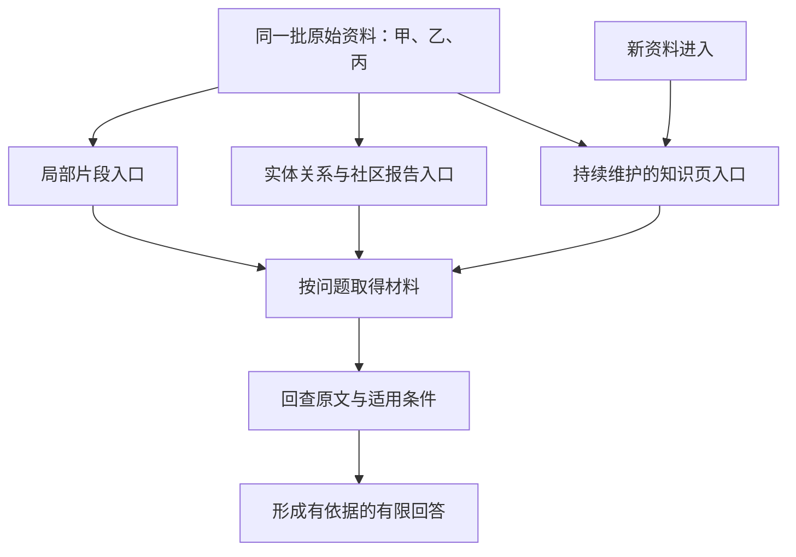

# GraphRAG 与 LLM Wiki：按问题选择知识入口

假设你已经保存了三份设备规则。今天有人问：“电子凭证能不能用于退货？”明天又问：“新旧规则改了什么？”过了一段时间，你还想维护一份“购买退货与租用归还”的长期说明。

它们使用同一批资料，却需要不同的知识入口。第一个问题需要准确找到条款，第二个需要联结对象与版本，第三个需要把跨资料结论保存下来，并在新资料进入时继续维护。

这是《AI学习目录》第五阶段的第 14 课，承接第 13 课的片段检索，学习 **GraphRAG 与 LLM Wiki 各解决什么**。本文比较普通片段 RAG、GraphRAG 和 LLM Wiki 的职责。GraphRAG 也是检索增强方法；LLM Wiki 则侧重长期知识组织，三者可以配合。

读完后，你应能独立完成四件事：

1. 为局部事实、关系或全局主题、长期综合三类问题选择入口，并说明理由与代价。
2. 解释图谱中的实体、关系和社区报告分别提供什么。
3. 说明 LLM Wiki 如何在资料进入时维护知识页，以及新资料到来后要更新哪些关联与冲突。
4. 从图边或综合结论回查原始资料，识别多个派生页面重复使用同一依据的情况。

最低前置知识是：知道回答需要依据，知道“已经找到了资料”和“资料足以支持结论”是两回事。不需要先安装图数据库、向量库或笔记软件；下面会补齐本课需要的概念。

甲、乙、丙的日期、规则和问题均来自课程的人工教学设置，**不是实际退换制度或真实模型测量**。手画图和主题报告用于理解职责，不代表运行了 GraphRAG。

## 一、先分清原文、入口与回答

先看三个对象：

| 对象 | 本课中的例子 | 它负责什么 |
| --- | --- | --- |
| 原始资料 | 甲、乙、丙的完整条款 | 提供可以核对的原始依据 |
| 知识入口 | 检索到的片段、图关系、主题报告、综合页 | 帮助定位、组织或复用资料 |
| 当前回答 | 对“电子凭证是否合格”的判断 | 根据当前问题和适用依据形成结论 |

如果综合页写“电子凭证可以使用”，你还需要知道：哪种电子凭证、用于什么对象、哪个版本的规则，以及这句话来自哪条原文。

**入口方便找到知识，原文负责核对事实**。当入口省略了条件，就要继续向下回查。

三个常用名称可以先这样理解：

- **RAG**：Retrieval-Augmented Generation，检索增强生成。回答前取得相关材料，再据此生成；本课先用普通片段检索作对照。
- **GraphRAG**：在检索中利用图结构组织的实体、关系及社区报告等材料，帮助寻找关联信息或整批资料的主题。
- **LLM Wiki**：用大语言模型整理并持续维护知识页，使跨资料结论能够长期复用。本文按课程与资料中的维护口径讨论，不把它当作所有实现统一遵守的产品标准。[^知识维护]

“溯源”就是从回答或派生内容，沿记录回到原始资料的具体位置。不能只找到另一个说法相同的页面就停下来。



图中的三条分支表示不同入口。它们可以交叉使用：从综合页发现乙2，再检索乙2的完整原文，就是一种组合。

## 二、准备同一批材料，让问题决定路线

全文用下面三份教学材料。按 **提出申请的日期** 选择规则，签收当天计第 0 天；只有这里展示的条款，没有隐藏制度。

### 甲：旧版购买退货规则

2024-12-20 发布；2025-01-01—2025-05-31 生效。

| 编号 | 教学原文 |
| --- | --- |
| 甲1 | 购买设备在签收后第 0—7 天、未拆封，可以申请退货。 |
| 甲2 | 需要纸质发票；电子订单截图不能代替纸质发票。 |

### 乙：新版购买退货规则

2025-05-20 发布；2025-06-01 起生效；明确替代甲的购买规则。

| 编号 | 教学原文 |
| --- | --- |
| 乙1 | 购买设备在签收后第 0—14 天、未拆封，可以申请退货。 |
| 乙2 | 凭证可以是纸质发票，或含订单号的电子凭证；聊天截图不属于上述凭证。 |
| 乙3 | 已拆封设备不能按乙1申请退货，只能转维修核验；转维修不代表已经批准退款。 |

### 丙：租用归还规则

2025-06-10 发布并生效。

| 编号 | 教学原文 |
| --- | --- |
| 丙1 | 租用设备应在签收后第 0—30 天归还。 |
| 丙2 | 本规则不适用于购买设备退货，也不修改乙的购买规则。 |

现在提出三个问题：

| 问题 | 需要取得什么 | 优先入口 |
| --- | --- | --- |
| 2025-06-12，购买退货可以使用哪种电子凭证？ | 适用版本与乙2完整条件 | 普通片段检索 |
| 甲、乙、丙怎样关联，整批材料体现哪些主题？ | 替代关系、对象范围及跨资料主题 | 图关系与社区报告 |
| 怎样长期维护规则变化说明，供以后反复使用？ | 可更新、有关联且有来源的综合知识页 | LLM Wiki |

这张表提供选择起点，不意味着只有对应方案能回答。三份短材料完全可以手工通读比较；普通 RAG 也能配合更多资料组织步骤。**先看查询需要，再看是否值得构图或维护知识页**，不要只按文档数量选择方案。

## 三、局部事实：先找到能回答问题的片段

先回答第一个问题：“2025-06-12，购买退货可以使用哪种电子凭证？”

可以按下面四步完成：

1. 确认对象是购买退货，申请日在 2025-06-01 之后，适用乙。
2. 用“购买退货、电子凭证”等信息寻找乙的相关片段。
3. 取得乙2完整原文，检查“含订单号”与“聊天截图不属于”的条件。
4. 回答：“按乙2，可以使用含订单号的电子凭证；聊天截图不属于合格凭证。”

如果片段只剩“凭证可以是电子凭证”，就丢失了决定性条件。检索结果看起来相关，仍然需要检查原文是否完整。

这个问题只问凭证类别，乙2可以支持对应判断。如果问题变成“这台设备能否申请退货”，还要取得乙1并核对天数、拆封状态，不能仅凭乙2下结论。

普通片段入口的主要成本是准备片段和索引、查询时召回材料并核对。它可能在分块、召回、组装或证据使用时出错。第 13 课的分层检查仍然适用。

## 四、关系与全局主题：图和报告提供不同帮助

### 1. 节点表示对象，边表示对象之间的关系

假设你要回答：“乙替代了什么，丙是否又修改了乙？”仅看到零散数字，不容易看清材料之间的关系。

可以先把甲、乙、丙以及购买退货、租用归还等对象画成节点，再用边连接它们。这里的节点是教学图中的对象；真正实现如何划分实体类型，需要根据资料和抽取规则确定。

一条最简单的边写作：

```text
乙 — 替代 — 甲
```

但这还不完整。它必须补上“2025-06-01 起”“仅购买规则”以及原文依据，否则读者可能理解成所有规则、所有时间都被替代。

用同一批资料手画最小关系表：

| 起点—关系—终点 | 必须保留的条件 | 回查位置 |
| --- | --- | --- |
| 乙—替代—甲 | 2025-06-01 起；购买规则 | 乙的生效与替代说明，甲的生效范围 |
| 购买退货—需要—未拆封 | 乙适用；签收第 0—14 天 | 乙1 |
| 购买退货—接受—含订单号电子凭证 | 纸质发票也可；聊天截图被排除 | 乙2 |
| 已拆封设备—转入—维修核验 | 不能按乙1申请退货；转维修不等于已批准退款 | 乙3 |
| 丙—管理—租用归还 | 第 0—30 天；不适用购买退货、不修改乙 | 丙1、丙2 |

边提供的是可追踪的关系路径。问题涉及“谁替代谁”“哪个对象受哪份规则约束”时，这种组织能帮助你找到关联资料。图谱仍由抽取、合并等处理产生，关系可能被抽错，必须保留原文映射。[^图谱]

### 2. 社区报告帮助汇总一组相互关联的内容

图中有些节点与关系连接较密集，可以被组织成“社区”。这里的社区是图中的一组关联对象，不是论坛或用户群。

**社区报告** 是对这一组实体与关系的概括，帮助查询理解较大范围的主题。它同样是派生内容，可能漏掉限定条件，也可能出现原文没有的推断。

为了练习报告的用途，我们手工分成两组。下面是人工教学归纳，**不是真实社区检测输出**。

```text
报告一：购买规则变化
甲在旧适用期要求第0—7天、未拆封、纸质发票。
乙从2025-06-01起替代甲的购买规则：
期限变为第0—14天，保留未拆封条件，
凭证增加含订单号的电子凭证，排除聊天截图。
已拆封转维修核验，不等于批准退款。
回查：甲的日期、甲1、甲2；乙的替代说明、乙1、乙2、乙3。

报告二：租用规则独立
丙规定租用设备第0—30天归还。
它不适用于购买退货，也不修改乙。
回查：丙的日期、丙1、丙2。
```

问“整批资料围绕哪些主题展开”，可以由两张报告归纳出期限、凭证、对象范围和动作状态四个主题。例如，“动作状态”提醒我们把可申请、维修核验与已经批准退款区分开。

问“第 14 天的聊天截图是否合格”，则必须回到乙2。报告可以带路，精确判断还需要对应原文。

### 3. Local Search 与 Global Search 的基本分工

微软 GraphRAG 的 **Local Search** 从与问题相关的实体出发，扩展关联原文、邻接关系和社区报告等材料，再筛选、组装上下文。它适合围绕具体实体理解关联信息，过程不止寻找一个节点。[^局部检索]

其 **Global Search** 使用指定社区层级的报告，分批生成中间要点，再筛选、综合回答，适合整批资料的主题问题。这个基础流程不表示自动逐层下钻所有原文。[^全局检索]

本课用这两个官方流程说明分工，不概括所有图检索变体。实体、关系和报告都能帮助组织资料，但不能保证答案正确。

### 4. 一条错边会怎样传播

假设抽取结果写成：

```text
设备退货 — 期限 — 30天
```

沿着这条边查“购买设备第 20 天是否可以退货”，就可能得到错误的“30 天内可以”。问题发生在构图时：抽取把丙1的“租用归还”换成了“设备退货”，还丢掉丙2的排除条件。

修复时要打开丙1、丙2，恢复完整关系：

```text
租用设备 — 应归还于 — 签收第0—30天
适用范围：租用；不适用于购买退货；不修改乙。
来源：丙1、丙2。
```

然后检查引用错边的报告与页面，修正受影响的“购买退货 30 天”断言。只改图中的显示文字，旧报告可能继续传播错误。

**图结构不会自动纠正抽取错误**。它可能使正确关系更容易检索，也可能让错误关系被反复复用。

## 五、长期综合：LLM Wiki 把维护放在资料进入时

现在考虑第三个需求：“以后还会收到新规则，希望长期保留一份可信的规则说明。”

普通片段问答关注本轮找到哪些材料；LLM Wiki 还要关注哪些结论已经沉淀、哪些页面受新资料影响、旧结论还能在什么条件下使用。

**摄取**，也叫 Ingest，指把新资料纳入知识维护流程。资料中的“摄取时编译”是一个工作流比喻：把原始材料整理成有结构、有来源、相互关联的知识页，不是把文章编译成模型参数。[^知识维护]

### 1. 先分清三层职责

| 层 | 保存什么 | 本例中的职责 |
| --- | --- | --- |
| 原始资料层 | 甲、乙、丙的原文 | 保留最初材料，供核对与审计 |
| 知识页层 | 来源摘要、概念页、对比页、综合页等 | 整理结论、连接资料、标记适用范围与冲突 |
| 维护规则层 | 命名、引用、更新、审核等约定 | 规定什么时候更新、怎样保留来源和处理争议 |

本文采用的维护规则是原始资料只读、派生知识可更新。具体页面类型与名称可以依实现不同，但事实结论必须能回到来源。

### 2. 沿着三次资料进入，做一次完整维护

先只有甲时，可以建立“甲的来源摘要”和“购买退货规则说明”。说明页写清：甲只在 2025-01-01—2025-05-31 生效，购买设备第 0—7 天、未拆封，且需要纸质发票。

乙进入后，不能只新增“乙的来源摘要”，让旧说明继续被当作当前规则。维护应完成以下动作：

1. 记录乙的原文位置、发布日期、生效日与替代范围。
2. 更新购买退货说明，区分甲的历史适用期与乙的生效期。
3. 建立或更新新旧购买规则对比，分别引用甲1、甲2、乙1、乙2，保存期限与凭证的变化。
4. 把乙的来源页、购买退货说明、对比页和综合页关联起来，便于查询与影响检查。
5. 检查旧页是否还把“7 天、只接受纸质发票”写成无日期限制的当前结论，修正这些派生表述并记录变更。

乙在 2025-05-20 发布，却从 2025-06-01 起生效。摄取时就可以记录未来生效安排，但查询 2025-05-25 的申请仍按甲判断，不能把收录时间或发布日期当成生效日。

丙进入后，再更新“租用归还说明”和相关综合页，补上第 0—30 天及丙2的对象限制。丙日期更晚，但它不修改购买规则，所以不能把购买退货说明的 14 天换成 30 天。

对于查询基准日 2025-06-12，一份可复用的综合页可以这样写：

```text
主题：购买退货与租用归还
查询基准日：2025-06-12

购买退货：
乙从2025-06-01起替代甲的购买规则。
第0—14天、未拆封可以申请退货；还须满足凭证要求。
凭证可为纸质发票或含订单号的电子凭证，聊天截图不合格。
已拆封转维修核验，不等于已批准退款。
依据：乙的日期与替代说明、乙1、乙2、乙3。

租用归还：
丙要求第0—30天归还，不适用购买退货，不修改乙。
依据：丙的日期、丙1、丙2。

历史比较：
甲旧适用期为2025-01-01—2025-05-31。
购买期限从第0—7天变为第0—14天；新版增加含订单号电子凭证。
依据：甲的日期、甲1、甲2；乙的日期、乙1、乙2。

关联：甲乙规则对比、购买退货说明、租用归还说明、三份来源摘要。
```

这里的“关联”列出的是教学页面名称，没有实际创建这些 Wiki 页面。“查询基准日”说明这份示例回答哪个时间的问题，不能冒充实际核验或更新时间。

这就是一次正常的长期维护：新资料进入，相关知识页一起更新，旧来源和历史条件保留，查询可以复用维护过的结论。

### 3. 更新时也要寻找冲突与知识缺口

如果某页写“购买退货 30 天”，要回查来源。依据只有丙时，这不是两项同范围制度相互冲突，而是派生页误用了租用规则。

如果真的遇到同一时间、同一对象下互相矛盾的来源，则保存各自原文、时间、适用条件和待核验状态，不靠多生成一篇总结消除矛盾。第 15 课会展开这部分。

维护后还要检查链接是否有效、其他关联页是否仍保留旧的无条件结论、关键段落是否有来源。这类检查常称 **Lint**。它需要与内容审核配合；页面整齐、链接正常，不能证明事实正确。[^知识维护]

LLM Wiki 的主要代价是持续更新、检查和审核。它适合结论需要反复复用的主题；一次简单问答可以直接读条款，不必先建立一整套知识页。

## 六、多个派生页面，怎样回到同一份证据

假设你找到两页：

- “购买退货说明”：期限是第 0—14 天，来源乙1。
- “甲乙规则对比”：新版期限是第 0—14 天，来源乙1。

图中还有“购买退货—期限—第 0—14 天”这条边，也来自乙1。

它们给出三个入口，却共享同一条底层依据：

```text
购买退货说明 ─┐
甲乙规则对比 ─┼→ 乙1 → 乙的原文
图中的期限边 ─┘
```

不能把它们说成“三份独立证据都确认了 14 天”。这是同一依据经过三次派生展示。即使两个页面互相引用，也不会因此增加来源独立性。

**多个条款可以共同支持判断，多个派生页面不自动成为独立来源**。例如乙1提供期限与拆封条件，乙2提供凭证条件；两条都需要，但仍属于同一份乙材料。

核验一个派生断言时，按下面顺序检查：

1. 把断言说清楚：在什么日期、针对什么对象、声称什么条件或状态？
2. 找到引用的图边、报告或知识页。
3. 沿来源记录回到原始材料的条款。
4. 检查原文是否完整支持断言，包括否定、日期、例外和动作状态。
5. 如果多个入口最终指向同一原文，把它们识别为同一依据的复用；缺少原文时标记待核验。

“新版购买退货期限是 14 天”可回查乙1。“新旧期限从 7 天变为 14 天”还需要甲1及双方日期。“新版增加电子凭证”必须保留“含订单号”，并回查甲2、乙2。

对课程主问题——2025-06-12 申请、购买设备、签收第 10 天、未拆封、有含订单号电子凭证——可以依据乙1、乙2回答满足申请条件。无论从哪条路线取得材料，都不能把这个结论写成“已批准退款”或“退款已完成”。

## 七、动手走完三条路线

拿一张纸，使用第二节的完整材料，依次记录：

| 路线 | 要留下的产物 | 完成后怎样核对 |
| --- | --- | --- |
| 片段检索 | 适用版本、乙2原文、凭证结论 | 是否保留订单号要求和聊天截图排除 |
| 图与主题 | 带条件的关系表、两张主题报告 | 每条关系与每个主题能否回到具体条款 |
| 长期知识页 | 三次摄取的更新记录、最终综合页 | 是否更新关联页，保留历史、来源与对象范围 |

最后故意写入“购买退货 30 天”，再检查你能否从错误位置追到丙1、丙2，并找到应修正的关系、报告与综合段落。

这一步练习的是材料组织与核验。没有真实调用模型，也就不能把结果当成三种系统的性能测试。

## 八、合上正文，独立完成四道检查

做题时可以保留第二节的原始材料表，但先不要看下一节答案。

### 第 1 题：按需求选择入口

分别处理以下需求，为每项写出：优先入口、必要依据、维护成本、可能出错的环节。

1. 问 2025-06-12 购买退货能否使用聊天截图。
2. 问甲、乙、丙之间有哪些替代与范围关系，以及整批资料有哪些主题。
3. 希望今后新规则进入时，持续维护一份规则变化说明。

再说明：为什么不能只根据“有三份还是三千份文档”决定方案？

### 第 2 题：检查图关系与社区报告

抽取器生成一条边：“设备退货—期限—30 天”。

指出错误来自哪两条原文，写出修正后的带条件关系。再分别解释节点、关系边、社区报告的用途，以及社区报告为什么不能自动证明这条边正确。

### 第 3 题：新资料进入后怎样维护

目前知识库只整理了甲，其中“购买退货说明”写着“第 0—7 天、需要纸质发票”，没有日期范围。

乙进入后，系统仅新增一篇乙的摘要，没有修改任何关联页。随后丙也进入。

请列出需要补做的维护动作，并说明：

1. 2025-05-25 的申请该看甲还是乙？
2. 丙的 30 天是否应替换购买退货说明中的期限？
3. 原始甲是否应该被改写成乙的内容？

### 第 4 题：迁移到新的条件

新问题是：“2025-06-12，购买设备签收第 14 天，未拆封，只有聊天截图，能申请退货吗？”

两个知识页和一条图边都写“新版购买退货期限是第 0—14 天”，它们的底层来源全部是乙1。回答者据此说：“三份独立证据都确认了，可以申请，退款已经获批。”

逐项纠正：这里有几份独立原始材料支持期限？还需要核对哪条依据？最终应怎样回答？

## 九、参考答案与过关点

### 第 1 题答案：入口由产物需要决定

| 需求 | 优先入口与必要依据 | 成本与出错位置 |
| --- | --- | --- |
| 聊天截图是否合格 | 片段检索；乙的适用日期与乙2，回答截图不属于合格凭证 | 准备与检索片段；可能漏召回乙2、切掉否定条件或生成时误用 |
| 替代、范围与整批主题 | 图关系组织对象关联，社区报告帮助主题归纳；回查甲乙日期、乙1—乙3、丙1丙2等对应原文 | 构图、合并、生成并维护报告；可能抽错对象、漏日期或在报告中加入无依据推断 |
| 持续维护规则变化 | LLM Wiki；保留甲乙丙原文，更新来源页、说明、对比与综合页的关联和状态 | 每次摄取后的更新、检查与审核；可能只加孤立摘要、漏更新旧结论或丢来源 |

资料多可能增加检索需求，但查询是否只需一个条款、需要联结关系，还是要长期复用结论，才决定主要入口。三份短资料可以手工完成以上步骤，也可在同一系统中组合路线。

**过关点**：每种选择都能解释要取得什么，写出依据、成本和失败位置，不把三者排成固定升级顺序。答错回读第二至第五节。

### 第 2 题答案：30 天属于租用归还

丙1说租用设备第 0—30 天归还；丙2排除购买退货并明确不修改乙。错误边换了对象和动作，也丢失范围限制。

修正为：

```text
租用设备 — 应归还于 — 签收第0—30天
条件：丙适用；租用，不是购买退货；不修改乙。
依据：丙的生效说明、丙1、丙2。
```

节点表示图中对象；关系边连接对象并保存关系及条件；社区报告概括一组关联内容，帮助寻找主题。报告仍是派生结果，如果生成时沿用了错边，会继续重复错误。

除修正边外，还要检查使用它的报告和知识页。不能用这些派生结果相互证明“购买退货 30 天”。

**过关点**：指出丙1的对象与动作、丙2的排除条件，写出来源完整的关系，并区分图和报告的用途。答错回读第四节。

### 第 3 题答案：新增摘要只是维护的一部分

需要补做以下动作：

1. 保留甲原文，把旧说明补上历史生效范围。
2. 保存乙原文的来源与日期，在购买退货说明中区分甲、乙适用期。
3. 更新对比页：期限由第 0—7 天变为第 0—14 天，凭证新增含订单号的电子凭证；保留未拆封与否定条件。
4. 把来源页、说明页、对比页、综合页关联起来，检查其他页是否仍将甲写成无条件的当前规则。
5. 丙进入后更新租用归还说明及综合页，记录第 0—30 天与丙2的限制，不改写购买期限。
6. 记录更新与待核验内容，检查无来源、失效链接和冲突；发现真正的同范围来源冲突时保留各方依据与条件。

2025-05-25 仍处于甲的适用期。乙虽已发布，尚未生效。丙的 30 天不能替换乙的购买退货期限；甲原文也不能改写成乙。应更新派生页，保留原件和历史适用性。

**过关点**：说明摄取会影响已有知识页、关联和结论状态，区分发布与生效日期，并保留历史来源。答错回读第五节。

### 第 4 题答案：期限满足仍然不能跳过凭证

两个知识页和一条图边均来自乙1，所以期限断言只有一份独立原始材料乙作为依据，具体位置是乙1。三次展示不等于三份独立证据。

第 14 天、未拆封满足乙1的相应条件，但还需核对乙2。乙2明确排除聊天截图，所以新输入不满足凭证要求。

合格回答可以写：

> 按乙1，第 14 天、未拆封符合相应条件；但只有聊天截图不符合乙2的凭证要求，因此目前不满足材料中的退货申请条件。材料也没有退款获批的依据。

这里能判断凭证不满足，不是笼统的“资料不足”。即使所有申请条件都满足，也只能说可申请，不能推成已批准或已退款。

**过关点**：识别重复派生的来源，补查乙2，保留否定和状态边界。答错回读第三、第六节。

能独立完成这四题并解释理由，才说明你能选择入口、解释图与报告、维护知识页并追溯依据。阅读完毕或流程跑通本身不能证明已经掌握。

## 十、可选进阶：进一步检查检索与治理

### 1. 把 Local 与 Global 的中间产物分开

Local Search 可以按“问题 → 相关实体 → 关联原文和图材料 → 筛选组装 → 回答”理解。检查时问：需要的原文是否真的进入了上下文？[^局部检索]

Global Search 的基础流程使用指定层级的社区报告作 Map-Reduce：Map 分批产生带重要性评分的要点，Reduce 筛选要点后综合。报告层级会影响细节、时间与模型资源需求；重要性评分不等于事实正确率。[^全局检索]

使用更多报告也不自动补回报告已经丢失的原文条件。若要验证一个精确断言，还应取得支持它的条款。

### 2. 只取得乙的报告，能否完整比较新旧规则？

不能仅凭“乙期限 14 天、接受电子凭证”就声称变化是“7→14 天、纸质发票→增加电子凭证”。变化判断包含旧版和新版两端。

需要回查甲1、甲2、乙1、乙2及双方日期，确认旧期限、新期限和凭证差异，并保留“含订单号”限定。报告如果包含这些完整信息且能回查，可以作为比较入口；缺甲时就应说明旧版比较依据不全。

丙的 30 天属于租用归还，不是购买规则的新期限。

### 3. 怎样观察 Wiki 是否保持可维护

资料提出了以下治理观察项。这里用它们发现问题，不设未经测量的合格阈值。[^知识维护]

| 观察项 | 应追问什么 |
| --- | --- |
| 来源覆盖，Source Coverage | 已纳入的来源是否进入了需要维护的知识页？ |
| 索引新鲜度，Index Freshness | 新资料与更新页面是否能被导航找到？ |
| 引用覆盖，Citation Coverage | 关键事实段落是否能回到具体原文？ |
| 待审积压，Review Backlog | 冲突与高风险推断是否长期没有处理？ |
| 查询保存率，Query Save Rate | 有长期价值的查询结论是否按规则保存并维护？ |

指标良好也不保证事实无误。如果三页共享同一错边，就需要检查底层来源，而不是继续增加页面数量。

## 十一、下一课：来源冲突与知识缺口

片段、图关系、社区报告和综合页，都可以帮助我们取得和组织材料。取得材料之后，还需要判断它支持什么范围，以及其他来源是否与它矛盾。

第 15 课“来源冲突与知识缺口怎么回答”会继续处理时间、对象、条件与证据不足。本课先建立一个习惯：每个入口都能回查原文，每项结论都保留成立条件。

## 十二、依据与回查

课程定位、四项掌握目标、甲乙丙条款、手画关系表和练习设计来自《AI学习目录》及《32课学习设计与掌握目标》。课程尚无公开网址，因此只列文字标题。

| 公开资料 | 支持范围 |
| --- | --- |
| [AI知识图谱 GraphRAG 是怎么回事？](https://www.bilibili.com/video/BV1zoKuzoENM) | 图谱抽取、关系、社区与报告的整理依据，以及抽取和摘要风险 |
| [微软 GraphRAG：Local Search](https://microsoft.github.io/graphrag/query/local_search/) | 从相关实体扩展关联原文与图材料，再筛选组装上下文 |
| [微软 GraphRAG：Global Search](https://microsoft.github.io/graphrag/query/global_search/) | 指定社区层级报告的 Map-Reduce 流程，以及层级对资源与细节的影响 |
| [RAG vs GraphRAG vs LLM Wiki 一次讲透](https://www.bilibili.com/video/BV1NG9xBUEju) | 摄取时维护知识页、来源与派生知识分层、关联更新、冲突和治理观察项的专题整理依据 |

微软页面用于核对本课明确描述的 Local／Global 流程。LLM Wiki 的维护流程按课程及专题资料的口径解释，不作为所有实现的统一接口或强制文件结构。

本次写作核对了课程、掌握目标、两份完整整理资料及微软公开页面的相关内容，检查条款、日期、来源对应和练习答案。未重新核对完整原视频、运行真实构图或社区检测、调用模型、测试检索性能，也未进行真实新手试读。只核验本地 Markdown 渲染，未验证实际发布平台；教学走查不能替代这些实测。

[^图谱]: [AI知识图谱 GraphRAG 是怎么回事？](https://www.bilibili.com/video/BV1zoKuzoENM)。图谱构建、查询与派生错误风险的原始讲解来源；本文手画关系使用课程教学条款。
[^局部检索]: [微软 GraphRAG：Local Search](https://microsoft.github.io/graphrag/query/local_search/)，Entity-based Reasoning 与 Methodology 部分。本文仅采用实体入口、关联材料与筛选组装的流程说明。
[^全局检索]: [微软 GraphRAG：Global Search](https://microsoft.github.io/graphrag/query/global_search/)，Whole Dataset Reasoning 与 Methodology 部分。本文的两张主题报告为人工教学归纳。
[^知识维护]: [RAG vs GraphRAG vs LLM Wiki 一次讲透：Karpathy引爆的LLM Wiki，是知识工程的下一次革命，还是又一个被高估的"自我进化"](https://www.bilibili.com/video/BV1NG9xBUEju)。本文采用其知识分层、摄取、关联更新及治理说明，没有采用其中具体项目接口、固定调用次数或规模数字。
