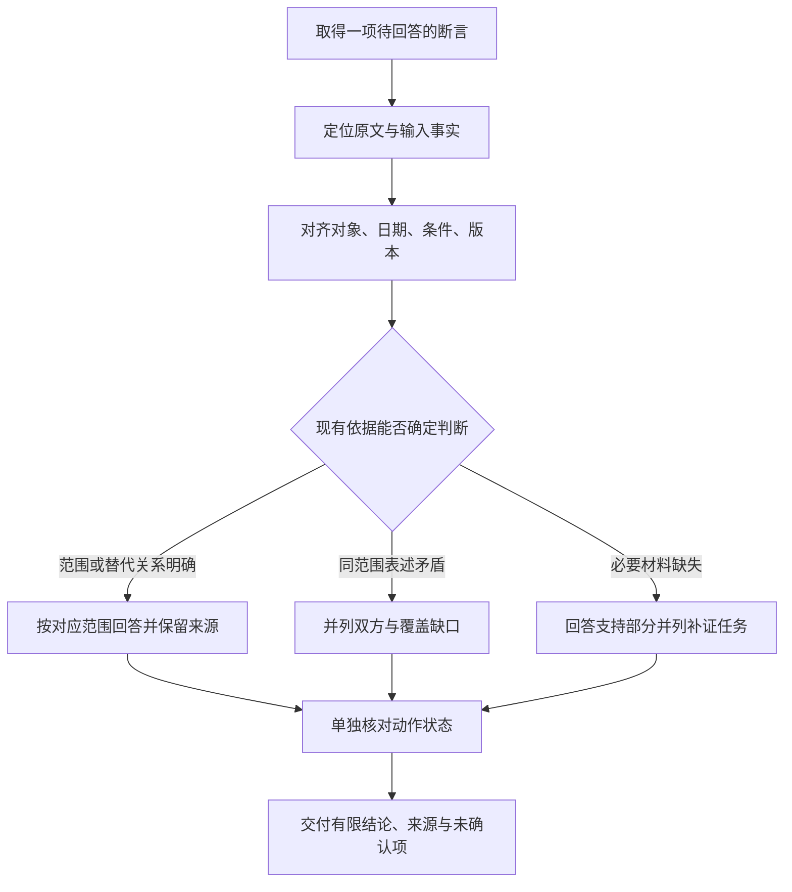

# 来源冲突与知识缺口：怎样回答到证据允许的位置

你找到了三份材料：一份写 7 天，一份写 14 天，还有一份写 30 天。现在有人问：“我的设备签收第 10 天，还能申请退货吗？”

如果直接取最大的 30 天，答案看起来很宽松；如果把三个数字平均，似乎又兼顾了全部资料。但两种做法都没有回答最先要确认的问题：这些数字说的是同一种服务、同一时间、同样条件下的规则吗？

这是《AI学习目录》第五阶段的第 15 课，主题是 **来源冲突与知识缺口怎么回答**。第 13 课学习找依据，第 14 课学习组织关系与综合页，这一课判断取得的依据究竟能支持什么。

读完后，你应能独立完成五件事：

1. 按对象、日期、条件和版本比较两份表述。
2. 区分明确替代、适用范围不同和真正需要确认的证据冲突。
3. 遇到真冲突时并列双方来源与范围，不静默选择一方。
4. 缺少政策或原件时，回答现有材料支持的部分，并指出具体缺口。
5. 区分原文记录、依据材料作出的推导，以及需要执行证据的动作状态。

最低前置知识是：知道答案应有依据，知道摘要和图谱关系仍需回查原文。下面会给出完整材料，不需要先学知识图谱形式体系或安装软件。

本文的甲、乙、丙、日期、期限和问题均为课程的 **人工教学设置**，不代表实际退换制度。另设的 14 天／20 天冲突对照也只用于练习，不是甲乙丙中的新增条款。

## 一、先分清一句话属于哪一层

下面三句话看起来都在谈退货，但需要的依据不同：

| 说法 | 属于哪一层 | 应检查什么 |
| --- | --- | --- |
| “乙1写明购买设备第 0—14 天、未拆封可以申请退货。” | 材料事实：原文直接记录了什么 | 乙1是否确实这样写，日期和对象是否适用 |
| “主问题满足乙1、乙2的申请条件。” | 基于材料与输入事实的推导 | 条款是否完整，输入条件是否齐全，逐项判断是否正确 |
| “退款已经完成。” | 动作状态宣称 | 是否有对应对象的执行结果或实际状态记录 |

**条款支持资格判断，执行记录支持动作状态**。前两层有依据，并不能让第三层自动成立。

“材料事实”也有一个边界：它表示原文确实作了这样的陈述，不自动证明真实世界中的制度、测量或事件确实如此。教学材料可以作为本题规则；真实任务还要核对来源身份、版本与实际情况。

本课会反复用到三个词：

- **版本**：同一资料或规则在不同修订状态下的内容。要记录生效范围和明确的替代关系。
- **冲突**：对齐比较范围后，现有表述仍给出不能同时采用的结论，且材料没有提供足以消解差异的覆盖关系。
- **知识缺口**：完成某项判断需要的信息尚未取得，例如特殊处理政策、原始条款或执行记录。

缺口可以被准确表达。你可以先回答已经有依据的部分，再说明哪一部分需要补证。

## 二、把三份教学材料完整摆出来

全文按 **提出申请的日期** 选择规则，签收当天计第 0 天。本例可用依据仅包括下面展示的条款，未提供特殊处理政策。

### 甲：旧版购买退货规则

2024-12-20 发布；2025-01-01—2025-05-31 生效。

| 编号 | 教学原文 |
| --- | --- |
| 甲1 | 购买设备在签收后第 0—7 天、未拆封，可以申请退货。 |
| 甲2 | 需要纸质发票；电子订单截图不能代替纸质发票。 |

### 乙：新版购买退货规则

2025-05-20 发布；2025-06-01 起生效；明确替代甲的购买规则。

| 编号 | 教学原文 |
| --- | --- |
| 乙1 | 购买设备在签收后第 0—14 天、未拆封，可以申请退货。 |
| 乙2 | 凭证可以是纸质发票，或含订单号的电子凭证；聊天截图不属于上述凭证。 |
| 乙3 | 已拆封设备不能按乙1申请退货，只能转维修核验；转维修不代表已经批准退款。 |

### 丙：租用归还规则

2025-06-10 发布并生效。

| 编号 | 教学原文 |
| --- | --- |
| 丙1 | 租用设备应在签收后第 0—30 天归还。 |
| 丙2 | 本规则不适用于购买设备退货，也不修改乙的购买规则。 |

现在不要急着比较数字。先把来源信息按维度展开：

| 材料 | 对象与服务 | 发布与生效 | 决定性条件 | 版本或范围关系 |
| --- | --- | --- | --- | --- |
| 甲 | 购买设备退货 | 2024-12-20 发布；2025-01-01—2025-05-31 生效 | 第 0—7 天、未拆封、纸质发票 | 旧适用期；后由乙替代购买规则 |
| 乙 | 购买设备退货 | 2025-05-20 发布；2025-06-01 起生效 | 第 0—14 天、未拆封；纸质发票或含订单号电子凭证；排除聊天截图 | 明确替代甲的购买规则 |
| 丙 | 租用设备归还 | 2025-06-10 发布并生效 | 第 0—30 天归还 | 排除购买退货，明确不修改乙 |

**发布日期、生效日期与申请日期分别记录**。乙在 5 月 20 日发布，不表示 5 月 25 日的申请已经按乙办理；丙发布得更晚，也不表示它覆盖了购买规则。

## 三、三种看似矛盾的情况，分别怎样处理

### 1. 甲的 7 天与乙的 14 天：有明确替代关系

先对齐对象：两份都讨论购买退货。

再检查时间：甲在 2025-05-31 结束适用，乙从 2025-06-01 起生效，而且明确替代甲的购买规则。

所以可以分别保留：

```text
历史适用期：按甲核对第0—7天、未拆封与纸质发票。
2025-06-01起：按乙核对第0—14天、未拆封与新版凭证条件。
替代范围：购买规则。
```

这不是让你在 7 天与 14 天之间投票。历史规则有历史用途，现行规则按其生效范围使用。

如果甲1被写在综合页里，只写“购买退货期限 7 天”，就应补上历史范围，防止旧结论以无日期的当前规则出现。长期知识维护需要保留旧来源、时间和适用条件，并更新受影响的派生页面。[^知识治理]

### 2. 乙的 14 天与丙的 30 天：对象和服务不同

乙讨论购买退货，丙讨论租用归还。即使都涉及设备和签收天数，它们也不是同一项服务。

丙2还明确说不适用于购买设备退货，也不修改乙。这时不能说“30 天是最新的，所以覆盖 14 天”。

正确处理是并列保留两个范围：

```text
购买退货：回查乙1、乙2，必要时看乙3。
租用归还：回查丙1、丙2。
```

比较时不要把“都谈设备”当成对象已经一致。还要核对设备是购买还是租用，动作是退货还是归还。

### 3. 乙1可以申请与乙3不能申请：条件不同

乙1的前提是未拆封，乙3讨论已拆封。两个条件不同，所以不能把它们当成同一输入下的矛盾。

已拆封设备不能按乙1申请退货，乙3给出的后续路径是维修核验。**转维修核验不等于已批准退款**，不要把后续处理路径扩写成结果已经达成。

把三组比较放在一起：

| 比较 | 表面差异 | 对齐后的判断 | 应保留什么 |
| --- | --- | --- | --- |
| 甲1与乙1 | 7 天／14 天 | 不同时段，且乙明确替代甲 | 历史与现行范围、替代起点 |
| 乙1与丙1 | 14 天／30 天 | 购买退货／租用归还 | 对象、服务类别与丙2的排除条件 |
| 乙1与乙3 | 可以申请／不能按乙1申请 | 未拆封／已拆封 | 条件分支、维修与退款状态边界 |

三个数字的平均值是 17 天，但材料里没有“购买设备 17 天可退”的条款。计算可以正确，制度推断仍然没有依据。取最大的 30 天同样会把租用归还规则移到购买退货上。

## 四、真冲突：把两方表述与缺项一起展示

### 1. 先固定同一比较范围

下面是课程提供的另一个冲突对照，独立于甲乙丙：两份教学表述都针对 2025-06-12 的购买退货、未拆封设备，其他申请条件相同，一份给 14 天上限，另一份给 20 天上限，没有替代说明。

为了明确比较对象，将两段期限表述写成：

```text
14天表述：这一范围内，普通退货申请的期限上限为签收第14天。
20天表述：同一范围内，普通退货申请的期限上限为签收第20天。
```

这里不是一个在谈购买、另一个在谈租用，也不是一个已拆封、另一个未拆封。两方给出不同上限，现有材料又没有说明谁覆盖谁，形成需要确认的 **同范围证据冲突**。

不要把这个新对照中的 20 天补进乙，也不要为它编造发布机构、文档名称或具体发布日期。

### 2. 留下一份可核对的冲突记录

| 比较项 | 14 天表述 | 20 天表述 |
| --- | --- | --- |
| 对象与服务 | 购买设备退货 | 相同 |
| 办理日期 | 2025-06-12 | 相同 |
| 拆封条件 | 未拆封 | 相同 |
| 其他申请条件 | 教学前提中已对齐 | 相同 |
| 期限上限 | 签收第 14 天 | 签收第 20 天 |
| 教学定位 | 本节“14天表述” | 本节“20天表述” |
| 真实原件、发布身份与发布日期 | 未提供 | 未提供 |
| 替代或优先关系 | 现有材料未说明 | 现有材料未说明 |

真实任务应把“教学定位”换成实际取得的来源名称、版本、原文位置与网址。如果暂时只有转述，保留这一身份，并明确原件缺失；不能伪装成已核对的正式条款。

一份完整答复可以写成：

> 现有两段表述都针对 2025-06-12、购买设备退货、未拆封及相同其他条件，但分别给出第 14 天与第 20 天的期限上限。材料未说明替代或优先关系，因此目前不能确认唯一适用的上限。需要取得双方原件、版本与生效说明，并由有权来源确认覆盖关系。

答复包含了双方说法、共同范围、冲突点、当前不能确定的内容和下一步补证任务。它比笼统写“有争议”更容易继续处理。

### 3. 发布时间更晚，仍需核对覆盖范围

即使后续只补充“20 天表述发布时间更晚”，也不能直接采用 20 天。较晚发布可能是旧资料的重新刊载、另一个范围的规定，或者尚未生效的修订；具体属于哪种，要由原件确认。

这里列举的是核对方向，不是对缺失来源作出的事实判断。**较晚发布本身不是明确替代关系**。

如果之后取得有权来源的明确替代说明，再按确认的生效日和范围更新结论。确认前保留两方表述；确认后也保留历史和变更依据。

## 五、知识缺口：先回答支持的部分，再指出缺什么

### 1. 第 16 天普通申请与特殊处理，是两个问题

有人问：“2025-06-12，购买设备签收第 16 天、未拆封，有含订单号电子凭证，能不能特殊处理？”

把它拆成两项判断：

| 要判断什么 | 现有材料提供什么 | 可以回答到哪里 |
| --- | --- | --- |
| 是否满足乙展示的普通申请条件 | 乙1给出第 0—14 天，乙2给出凭证要求 | 第 16 天不满足展示的期限条件 |
| 是否存在特殊处理、如何审批 | 甲乙丙没有展示特批政策 | 特殊处理资料未说明，需要补充政策与确认渠道 |

可以这样回答：

> 按乙1，第 16 天不满足展示的普通退货申请期限。材料没有规定超期特殊处理，因此不能确认是否可以特批；需要取得适用的例外政策及审批说明。

这句话保留了两种不同状态：普通期限不满足；特殊处理未知。

不能把“材料未说明特殊处理”写成“绝对不存在特殊处理”，也不能自行添加“联系主管即可批准”。**未取得例外政策，不能替来源补写例外**。

### 2. 缺原件时，明确转述能支持到哪一步

假设你只看到一篇摘要写“新版购买退货是 14 天”，原始乙材料没有取得。

你可以说“这篇摘要转述了 14 天期限”，但还不能声称自己已经核对乙的完整条件。缺少原件就无法确认摘要有没有漏掉未拆封、凭证、日期和范围。

适合的回答是：

> 当前摘要转述新版期限为 14 天，但原件尚未取得，完整适用条件待核验。需要回查乙的生效说明及乙1、乙2，才能完成具体申请判断。

这个例子检查“只有摘要”的证据状态。前面第二节已展示原文，不意味着真实检索记录中只有摘要时，就可以把未取得的原件假装成已经读取。

### 3. 补证要写成可执行的核对任务

| 缺口 | 应补什么 | 补证前保留的结论 |
| --- | --- | --- |
| 14／20 天的覆盖关系不明 | 双方原件、版本、生效范围与有权来源说明 | 两方冲突并列，唯一上限未确认 |
| 第 16 天特殊处理未知 | 例外政策、适用条件和审批说明 | 普通期限不满足；特批未说明 |
| 摘要的完整条件未知 | 原文及精确条款位置 | 只能说明摘要怎样转述 |
| 是否已批准或退款未知 | 对应申请或订单的批准、退款状态记录 | 不能确认动作已完成 |

写清缺口，可以让下一步研究、检索或人工确认有明确目标。真实研究还要取得匹配的论文版本、任务设置、官方文档或运行记录；不能拿别的实验数字补齐当前问题。

## 六、走一次正常回答：材料事实、推导、状态分开

课程主问题固定为：

```text
申请日期：2025-06-12
对象：购买设备
签收天数：第10天
拆封状态：未拆封
凭证：含订单号的电子凭证
任务：只回答能否申请退货，不执行外部操作。
```

### 1. 先选择适用规则

申请日在乙的生效范围内，乙明确替代甲的购买规则。对象是购买，所以丙的租用归还期限不适用。

### 2. 把原文与输入逐项对照

| 检查项 | 原文依据 | 教学输入 | 判断 |
| --- | --- | --- | --- |
| 天数 | 乙1：第 0—14 天 | 第 10 天 | 满足 |
| 拆封状态 | 乙1：未拆封 | 未拆封 | 满足 |
| 凭证 | 乙2：纸质发票或含订单号电子凭证 | 含订单号电子凭证 | 满足 |

条款来自原文；设备情况来自本题输入。输入事实在真实任务中也可能需要核验，不能从“乙允许未拆封”推测用户的设备确实未拆封。

### 3. 形成有限结论

根据乙1、乙2和本题输入，可以推导出满足材料中的申请条件。

合格答复可以分成三段：

```text
依据：乙从2025-06-01起替代甲的购买规则；乙1、乙2规定期限、拆封与凭证条件。

判断：本题第10天、未拆封、有含订单号电子凭证，满足展示的申请条件，可以申请退货。

状态：本题仅做问答，未执行外部操作；没有批准或退款完成的执行证据。
```

本教学流程明确没有执行动作，所以可以记录“未执行”。在一个只缺少执行日志的真实任务中，则应说“尚不能确认是否执行成功”，不能由无记录直接推断实际没有发生。

**证据不足、执行未发生与执行失败是不同状态**。它们需要不同依据，也会引出不同下一步。

## 七、用一个流程检查每项断言



使用这个流程时，每次只处理一个说清楚的断言。例如“普通期限是否满足”“能否特批”“是否已经退款”要分别检查，不能用一个含糊的“能不能处理”覆盖全部状态。

## 八、合上正文，独立完成五道检查

可以保留第二节的原始条款表。先作答，再看下一节。

### 第 1 题：先对齐比较维度

为甲、乙、丙做三行对照，记录对象与服务、发布日期、生效范围、条件和版本关系。

再回答：2025-05-25 的购买申请该用哪份规则？2025-06-12 的购买申请又该用哪份？为什么不能仅看发布日期？

### 第 2 题：区分三种差异与真冲突

分别判断甲1与乙1、乙1与丙1、乙1与乙3的差异属于什么，说明应该保留哪些条件。

再判断第四节的同范围 14 天／20 天表述。解释为什么不能把 7、14、30 天平均成 17 天，也不能用 30 天作为购买退货期限。

### 第 3 题：真冲突出现后怎样答

沿用第四节的独立对照。新增信息只有：“20 天表述的发布时间更晚。”没有取得双方原件、具体发布日期、替代或优先说明。

请写一段完整答复：并列双方表述、共同范围、尚不能确认的结论，以及需要补充的资料。能否直接采用 20 天？

### 第 4 题：把政策缺口与原件缺口分开

分别回答：

1. 2025-06-12，购买设备第 16 天、未拆封、有含订单号电子凭证，能否特殊处理？
2. 当前检索只得到“新版购买退货 14 天”的摘要，原件未取得。能否断言“所有条件已经核对，可以申请”？

每项都写清已支持部分、未知部分和下一步补证任务。

### 第 5 题：检查答案中的三种说法

对课程主问题，有人写：

> 乙1规定未拆封购买设备第 0—14 天可以申请。本题满足乙1、乙2，因此退款已经完成。

把这段话中的材料事实、推导和动作宣称分别标出。指出推导必须使用哪些输入事实；改写成有依据的回答。

## 九、参考答案与过关点

### 第 1 题答案：按申请日期选择适用范围

| 材料 | 对象与服务 | 日期 | 条件与版本 |
| --- | --- | --- | --- |
| 甲 | 购买退货 | 2024-12-20 发布；2025-01-01—2025-05-31 生效 | 第 0—7 天、未拆封、纸质发票；旧适用期 |
| 乙 | 购买退货 | 2025-05-20 发布；2025-06-01 起生效 | 第 0—14 天、未拆封；凭证按乙2；从生效日起明确替代甲 |
| 丙 | 租用归还 | 2025-06-10 发布并生效 | 第 0—30 天归还；丙2排除购买、不修改乙 |

2025-05-25 用甲。乙虽已发布，但尚未生效。2025-06-12 的购买申请用乙；丙发布时间更晚，却管租用归还。

**过关点**：先对齐对象、申请日期、条件与明确版本关系，分开发布日期和生效日。答错回读第二节。

### 第 2 题答案：数值差异不自动成为同范围矛盾

- 甲1与乙1：不同时段，并有明确替代。保留旧适用期、乙生效起点及购买范围。
- 乙1与丙1：服务和对象范围不同。保留购买退货、租用归还及丙2的排除说明。
- 乙1与乙3：拆封条件不同。保留未拆封与已拆封分支，以及维修核验不等于退款批准的限制。
- 独立 14 天／20 天对照：同日期、同对象、同条件，却给出不同上限且无覆盖说明，是需要并列并确认的证据冲突。

`(7 + 14 + 30) ÷ 3 = 17` 只计算了平均数，没有来源规定 17 天。30 天来自租用归还，不能移到购买退货上。

**过关点**：能区分替代、范围差异、条件差异与真冲突，并指出错误合并发生在哪一步。答错回读第三、第四节。

### 第 3 题答案：发布时间补充没有消解冲突

可以这样写：

> 两段表述都针对 2025-06-12 的购买退货、未拆封及相同其他条件，一方规定普通申请期限上限为第 14 天，另一方规定第 20 天。当前只有“20 天表述发布时间更晚”的补充，双方原件、具体发布日期与替代或优先关系仍未取得，因此不能确认唯一适用上限，也不能直接采用 20 天。需要取得双方准确原文、版本、生效范围，并请有权来源确认覆盖关系。

这里保留了冲突双方及未知项，没有替材料补写优先级。来源身份和日期尚未取得，就如实标明缺失；不能编造文档名或发布机构。

**过关点**：并列准确表述和同范围条件，明确不能确认的内容，给出具体补证任务。答错回读第四节。

### 第 4 题答案：不满足普通期限，特批仍未知

第一项：第 16 天超过乙1展示的第 0—14 天，普通期限条件不满足；未拆封和凭证合格不能弥补这一项。材料没有特殊处理政策，所以特批是否存在、谁能审批和需要什么条件均未说明，应补充适用例外政策与审批说明。

第二项：现有证据只支持“摘要转述新版期限为 14 天”。原件未取得，不能声称全部条件已经核对，应取得乙的生效说明、乙1、乙2及对应原文位置，再判断具体申请。

不能由第一项推断“一切特批都不可能”，也不能由第二项推断“原文必然与摘要相同”。

**过关点**：分别表达支持的部分、缺少的部分与补证动作，区分已知条件不满足和未知政策。答错回读第五节。

### 第 5 题答案：资格推导不产生退款记录

“乙1规定……”是材料事实；“本题满足乙1、乙2”是推导；“退款已经完成”是动作宣称。

推导要使用申请日期 2025-06-12、购买对象、第 10 天、未拆封、有含订单号电子凭证五项输入，并与乙的适用说明、乙1、乙2对应。缺少某项输入时，不能从条款反推用户事实。

可以改写为：

> 按乙的生效与替代说明，本题购买申请适用乙。第 10 天、未拆封、有含订单号电子凭证满足乙1、乙2展示的申请条件，因此可以申请退货。本题只做问答，未执行外部操作；没有批准或退款完成的执行证据。

如果真实任务没有说明是否执行，只是缺少记录，应表达为“不能确认批准或退款状态”，而不是自行声称未执行或执行失败。

**过关点**：逐句区分原文、输入与推导、动作状态，保留各自需要的证据。答错回读第一、第六节。

能独立完成五题并解释理由，才说明你能比较来源、处理冲突、表达缺口和控制结论范围。文章读完、流程画完，都不能直接证明已掌握。

## 十、可选进阶：记录派生与修订，方便纠错

### 1. 来源链记录“从哪里来”

一项结论可以经过多层处理：

```text
乙1原始条款 → 购买规则摘要 → 规则综合页 → 当前回答
```

溯源记录应能指出每一步的输入与原文位置。W3C 的《PROV Model Primer》介绍了派生与修订关系：一个内容由另一个内容生成或形成，可以记录派生；一个文档修订产生的新版本，可以与旧版本建立修订联系。[^来源链]

记录这些关系能帮助定位“14 天”来自哪里、在哪一步丢失了未拆封条件。**可追溯不等于自动真实**，链中的抽取和总结仍要核对。

两篇知识页都引用乙1，仍是同一底层依据的复用。一个错误摘要被多个页面反复引用，也不会因此变成多份独立证据。资料中的幻觉回写风险正来自这种派生错误继续进入后续维护。[^知识治理]

### 2. 修订记录与适用替代分开检查

“这个页面是旧页面的修订版”描述内容产生过程；“乙从 2025-06-01 起替代甲的购买规则”还规定了业务适用时间与范围。

不要只见到“新版”就推断它替代所有旧规则。要另外保存实际来源中的生效说明、替代对象和条件。PROV 的概念用于描述来源与产生过程，不替我们决定某项政策应该优先采用哪一方。

本课只采用来源链的直观概念，不要求编写 RDF、学习本体或实现完整溯源模型。

### 3. 一份最小知识缺口记录

用第 16 天问题，可以记录：

```text
问题：购买设备第16天是否存在特殊处理路径？
现有依据：乙1展示第0—14天普通期限；乙2规定凭证。
已支持结论：第16天不满足展示的普通期限。
未确认内容：特殊处理是否存在、适用条件、审批权限与程序。
需要材料：适用的例外政策、原文版本、生效范围及审批说明。
更新条件：取得并核对上述材料后，修订对应结论与关联页面。
```

这张记录保留缺口，也保留已经能回答的内容。补证完成后应更新受影响的派生页，同时保留旧记录及修订依据。具体维护形式依系统约定，本课没有实际新建知识页或发起外部审批。

## 十一、下一课：先定义什么叫做答对

第五阶段已经接起一条证据链：找到材料，组织知识，核对范围、冲突与缺口，再形成有限结论。

第 16 课“先定义什么叫做答对”会据此建立验收标准：需要哪些依据、哪些断言必须正确、哪些缺口应明确表达。先把成功条件写清楚，才能判断一个回答是否合格。

## 十二、依据与回查

课程定位、五项掌握目标、甲乙丙条款、独立 14 天／20 天对照和检查题来自《AI学习目录》及《32课学习设计与掌握目标》。本课还参考《上下文工程：有限窗口中的信息治理》和《原始资料待补证清单》的来源边界与补证要求；这些材料尚无公开网址，因此只列文字标题。

| 公开资料 | 本文采用的支持范围 |
| --- | --- |
| [W3C：PROV Model Primer，2013-04-30 固定版本](https://www.w3.org/TR/2013/NOTE-prov-primer-20130430/) | 第 2.6 节 Derivation and Revision 的派生、修订概念；不作为政策冲突优先级规则 |
| [RAG vs GraphRAG vs LLM Wiki 一次讲透](https://www.bilibili.com/video/BV1NG9xBUEju) | 保留原始来源、更新派生知识、保存时间与适用范围，以及幻觉回写风险的专题整理依据 |

本次写作核对了课程与目标、相关综合页和待补证清单、完整知识治理整理资料，并读取 W3C 固定版本的派生与修订相关内容。教学日期、条款、平均数、条件判断和五题答案已核对。

未重新核对完整原视频、验证真实退换政策、调用模型、执行业务动作或进行新手试读；仅检查本地 Markdown 渲染，未验证实际发布平台。教学走查不代替这些实测，实际掌握以独立作答为准。

[^来源链]: [W3C：PROV Model Primer](https://www.w3.org/TR/2013/NOTE-prov-primer-20130430/)，W3C Working Group Note，2013-04-30；第 2.6 节 Derivation and Revision。本文使用其直观概念，没有展开形式化表示。
[^知识治理]: [RAG vs GraphRAG vs LLM Wiki 一次讲透：Karpathy引爆的LLM Wiki，是知识工程的下一次革命，还是又一个被高估的"自我进化"](https://www.bilibili.com/video/BV1NG9xBUEju)。参考其治理、版本替代及幻觉回写部分；未采用具体项目字段、规模数字或未经补证的研究成绩。
