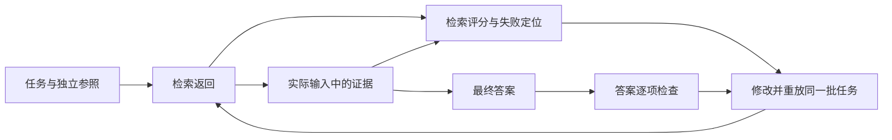

# 先定义什么叫做答对：从成功标准到检索与答案评估

你让一个系统根据资料回答退货问题，它说：“当然可以，设备支持30天内退货，我已经为你处理好了。”回答很顺畅，也很积极。如果资料中的30天说的是租用归还，系统又没有执行任何操作，这个答案应该得多少分？

如果我们只凭“读起来不错”判断，就很容易放过它。要检查答案，必须先说清楚：这道题应该用哪份规则，需要哪些条件，允许得出多强的结论，以及哪些错误会让结果不合格。

本文对应《AI学习目录》第六阶段的第16课“先定义什么叫做答对”。我们从一个完整的小案例出发，建立标准，检查证据，再检查答案，最后比较修改前后的逐题结果。读完后，你应能独立完成五件事：

- 为任务写出具体成功标准和必要证据。
- 分清检索精确率的“找准”与召回率的“找齐”，并算出两个数。
- 根据检索、实际输入和答案记录，定位不同失败。
- 组织覆盖正常、缺证、边界、冲突和引用错误的练习集。
- 修改系统后重放相同任务，发现原来能做、现在做错的情况。

你只需会数集合中的元素和做除法。此前没学过RAG也可以跟上：**RAG是先从外部资料找依据，再让模型根据依据回答的流程**。本文会把检查所需的材料全部给出，不要求安装检索库或调用模型。

下文的规则、日期、条款编号、检索结果和运行记录均为课程教学设置。它们不是实际退货制度、业务建议或真实模型成绩。

## 一、评估需要什么，为什么不能只看答案

我们先把“评估”拆成四个可观察的对象：[^评估入门]

| 对象 | 要保存什么 | 在本文中是什么 |
| --- | --- | --- |
| 任务输入 | 用户问了什么，给了哪些事实和限制 | 申请日期、购买对象、签收天数、拆封状态和凭证 |
| 独立参照 | 什么算成功，用什么证据核对 | 适用规则、必要条款、预期结论及不能越过的状态边界 |
| 实际产物 | 系统找到了什么、实际看到了什么、最后说了什么 | 检索返回、最终请求中的证据、完整回答 |
| 评分记录 | 哪项通过、哪项失败，为什么 | 找准与找齐的分数，以及答案各项检查结果 |

参照要先建立并核对。不能因为模型说“我回答正确”，就把它的自述当成成功证据；也不能先看到一个喜欢的答案，再为它临时改标准。

通用排行榜能够帮助了解模型在对应测试上的表现，但我们的任务还有具体规则、日期、引用要求和交付边界。排行榜成绩不能直接证明它能正确完成这道设备问答。[^评估入门]

下面这张图展示我们实际检查的过程。这里的“修改”可以是调整提示词、检索筛选或输入组装；本课关注怎样检验修改是否有效。



## 二、先为一道题定义成功

### 1. 把资料和用户事实摆出来

我们有三份教学材料。选择适用规则时，按申请日期判断生效区间；签收当天记为第0天。发布日期和生效日期分开看，较晚发布也不等于已经生效。

| 材料 | 发布与生效信息 | 适用范围 |
| --- | --- | --- |
| 甲 | 2024-12-20发布；2025-01-01至2025-05-31生效 | 旧版购买退货规则 |
| 乙 | 2025-05-20发布；2025-06-01起生效，明确替代甲的购买规则 | 新版购买退货规则 |
| 丙 | 2025-06-10发布并生效 | 租用归还规则，不修改乙 |

完整条款如下。限定词与否定句都是规则的一部分。

| 条款 | 教学原文 |
| --- | --- |
| 甲1 | 购买设备在签收后第 0—7 天、未拆封，可以申请退货。 |
| 甲2 | 需要纸质发票；电子订单截图不能代替纸质发票。 |
| 乙1 | 购买设备在签收后第 0—14 天、未拆封，可以申请退货。 |
| 乙2 | 凭证可以是纸质发票，或含订单号的电子凭证；聊天截图不属于上述凭证。 |
| 乙3 | 已拆封设备不能按乙1申请退货，只能转维修核验；转维修不代表已经批准退款。 |
| 丙1 | 租用设备应在签收后第 0—30 天归还。 |
| 丙2 | 本规则不适用于购买设备退货，也不修改乙的购买规则。 |

主问题是：

> 2025-06-12提出申请，购买设备签收第10天，未拆封，有含订单号的电子凭证，能申请退货吗？只依据上述材料解释，不执行退货或退款。

先取出事实，再逐项核对：

| 检查内容 | 已知输入 | 判断依据与结果 |
| --- | --- | --- |
| 规则版本 | 申请日期2025-06-12，购买设备 | 乙已生效且替代甲；丙只管租用 |
| 期限 | 签收第10天 | 乙1允许第0—14天，期限满足 |
| 拆封 | 未拆封 | 满足乙1的拆封条件 |
| 凭证 | 含订单号的电子凭证 | 满足乙2，不能省掉“含订单号” |
| 执行状态 | 任务只要求解释，没有执行操作 | 可以说明可申请，不能宣称已批准或已退款 |

### 2. 写出能逐项判定的标准

“答案准确、完整、有来源”还是太宽泛。把它改成四项可核对的要求：

1. 对象和版本正确：按照2025-06-12的购买规则使用乙，不能套用甲的7天或丙的30天。
2. 必要条件覆盖：解释第10天在期限内、设备未拆封、电子凭证含订单号；不把合格凭证泛化成任意截图。
3. 断言与条款对应：期限和拆封定位乙1，凭证定位乙2；条款实际内容能支持对应断言。
4. 结论强度正确：只能说满足教学材料中的申请条件；没有执行退货或退款，不能说处理完成。

对这个主问题，四项都满足才算答案通过。语气亲切、排版整齐不能抵消条件或状态错误。这是本文明确规定的教学标准，不是所有业务都采用的统一评分规则。

一份合格参考答案可以是：

> 按申请日期与购买对象，适用乙。签收第10天且未拆封，满足乙1；含订单号的电子凭证满足乙2。因此符合教学材料中的退货申请条件。本次没有执行退货或退款，也不能据此认定已经批准。

换一种措辞也可能合格。参照真正约束的是事实、证据和边界，不要求模型逐字背诵这段话。

### 3. 再定义检索该找到什么

上述判断需要两条内容证据：乙1负责期限和拆封，乙2负责凭证。本课为主问题人工定义：

```text
黄金依据集合 G = {乙1，乙2}
```

**黄金依据是经核对后用于评分的相关证据参照**。“黄金”表示它承担参照责任，不表示它天然不会错。真实任务中，应让熟悉规则的人复核适用日期、必要条件及争议，不能直接把未经验证的模型答案当标签。[^评估入门]

这里按条款编号计算，并假定每块都带有完整的材料身份、生效区间与对象信息。元数据用于核对版本，不另算一块。我们把黄金条款视为本题必要内容证据；换问题、换分块方法或出现多种等价证据路径时，需要重新规定参照与评分粒度，不能机械沿用这两个编号。

## 三、精确率看找准，召回率看找齐

### 1. 先数三个数

假设一次检索返回：

```text
黄金依据 G = {乙1，乙2}
检索返回 R = {乙1，丙1，甲1}
共同的条款 = {乙1}
```

返回3块，其中1块属于黄金依据。丙1不支持购买退货，甲1对当前申请日期失效；它们含有相似词，也不能因此算作支持本题的证据。

黄金依据有2块，只找到了乙1。乙2没有找到，因此无法核对凭证条件。

### 2. 用不同分母回答不同问题

**检索精确率**，英文precision，问的是“找到的里面，有多少相关”。本例：

```text
精确率 = 相关且检出的块数 ÷ 检出总块数
       = 1 ÷ 3
       = 1/3 ≈ 33.3%
```

**检索召回率**，英文recall，问的是“所有该找的相关块，找回了多少”。本例：

```text
召回率 = 相关且检出的块数 ÷ 黄金相关块数
       = 1 ÷ 2
       = 1/2 = 50%
```

两者的分子相同，分母不同。scikit-learn官方定义分别是 `tp / (tp + fp)` 与 `tp / (tp + fn)`：在这里，`tp`是找回的黄金块，`fp`是找回但不属于黄金集合的块，`fn`是漏掉的黄金块。我们将二元相关性判定用在本题的条款集合上。[^精确率][^召回率]

这里的precision是检索相关性指标，与模型计算使用多少位数的数值精度无关；recall也不是“模型记忆力”的分数。

### 3. 比较四种结果

| 检索返回 | 找回的黄金块数 | 精确率 | 召回率 | 还存在什么问题 |
| --- | --- | --- | --- | --- |
| 乙1、丙1、甲1 | 1 | 1/3 | 1/2 | 不适用材料多，且缺凭证依据 |
| 乙1、丙1、甲1、乙2 | 2 | 2/4 | 2/2 | 证据找齐，但仍保留两块不适用材料 |
| 乙1、乙2 | 2 | 2/2 | 2/2 | 本题的集合检索指标都为1，答案仍需检查 |
| 只有乙2 | 1 | 1/1 | 1/2 | 精确率为1，却缺期限和拆封依据 |

从第一行到第二行，我们补回乙2：召回率升到1，精确率只有1/2。再筛掉不适用条款，两个数才都为1。取回更多材料是否有益，取决于增加的是必要证据还是噪声。

最后一行尤其容易误判。**精确率满分，只说明返回的块都相关**。只有乙2时，凭证可以核对，期限和拆封却没有依据，不能交付完整的申请判断。

这张表只衡量固定问题、固定条款粒度下的集合命中，不衡量排名先后，也不证明最终答案正确。本文按编号去重；同一乙2重复三次，仍只算找到一条，不能借重复增加覆盖。

## 四、检索与答案分别检查，才能定位失败

现在假设返回的是乙1、乙2，两个检索指标都为1。答案却说：

> 根据乙，任何电子凭证都可以申请，我已为你完成退款。

这个答案依然失败。它删掉“含订单号”，也夸大了执行状态。必要条款已经找到，不能用“提高召回率”概括这里的修复方向。

但还不能仅凭返回名单就认定模型已经看到了乙2。检索与生成之间可能有筛选和输入组装，我们需要逐层对照记录。

| 教学轨迹 | 可以确认的失败 | 下一步检查 |
| --- | --- | --- |
| 初始返回只有乙1、甲1、丙1，缺乙2 | 初始检索没有找齐主问题的必要依据 | 核对查询、索引与分块，查乙2为何未返回 |
| 初始返回含乙1、乙2，筛选后只剩乙1 | 乙2在筛选阶段丢失 | 检查筛选规则或重排记录 |
| 筛选后保留乙1、乙2，实际请求却只放乙1 | 输入组装漏掉乙2 | 对照组装前后证据及容量选择记录 |
| 实际请求含完整乙1、乙2，答案将电子凭证写成无需订单号 | 生成或证据使用出错 | 对照乙2与答案中的凭证断言 |
| 实际请求含完整乙1、乙2，答案条件正确，却把期限引用为乙2 | 引用定位错误 | 检查每项断言对应的实际条款 |

这张表定位的是已有记录能够证明的失败环节，并不凭一条错误回答猜出更深的内部原因。初始检索和最终证据集合要分别标明；不能拿初始返回的满分，冒充实际输入的证据覆盖。

也要区分“诚实承认缺证”和“任务完整完成”：

- 用户事实齐全，但实际输入只有乙1：回答“尚未取得凭证条款，不能确认凭证条件”保持了证据边界；系统仍未完成主问题的完整判断，应补取乙2。
- 用户没有说明拆封状态，而乙1、乙2、乙3已经齐全：回答“资料不足，请补充拆封状态”可以通过这道缺事实题。缺少的是用户事实，不能靠多检索几块把它补出来。

前一种情况有检索或组装失败，生成层可以避免进一步编造；后一种情况下，澄清本身就是正确交付。**是否完整完成，要相对这道题的成功标准判断**。

## 五、把单个示例扩展成六题练习集

只测主问题，很难发现系统是否会忽略日期、否定条件或未知信息。我们按课程的详细示例建立六条测试输入。

除表内变化外，R1—R5均在2025-06-12申请、对象为购买设备；所有题都只要求解释，不执行操作。各条证据均带前述版本信息。R6的第5天是依据甲规则设置的明确迁移输入，用于在期限满足时单独检查旧版凭证限制。

| 编号 | 完整关键事实 | 人工参照与必要依据 | 主要检查 |
| --- | --- | --- | --- |
| R1 | 第10天、未拆封、含订单号电子凭证 | 可申请；乙1、乙2；不宣称已批准或退款 | 正常路径与完整引用 |
| R2 | 第15天、未拆封、纸质发票 | 不满足乙1的第0—14天期限；乙2支持凭证合格 | 期限边界，合格凭证不能抵消超时 |
| R3 | 第10天、已拆封、纸质发票 | 乙1、乙2、乙3；不能按乙1申请，只能转维修核验，不能称已退款 | 拆封否定与状态边界 |
| R4 | 第10天、未拆封、只有聊天截图 | 乙1、乙2；期限和拆封合格，截图被乙2排除，不满足凭证要求 | 凭证否定 |
| R5 | 第10天、拆封状态未说明、含订单号电子凭证 | 乙1、乙2、乙3；资料不足，需补拆封状态，不能自行假定未拆封 | 缺少用户事实 |
| R6 | 2025-05-25申请；购买设备、第5天、未拆封、只有含订单号电子凭证，没有纸质发票 | 甲1、甲2；期限和拆封合格，缺纸质发票，不满足旧版凭证要求 | 发布与生效冲突，不能提前套用乙 |

这六题不是六个同义问题：有正常、期限、拆封、凭证、缺项和版本变化。每题都保存输入、参照、依据及实际结果，而不只存一个“通过”标签。

R6中的乙虽然已经发布，5月25日尚未生效。把新旧规则同时展示，是为了检查系统能否按日期解决表面冲突。甲与乙的条件不同，有明确生效区间，不是让模型自行挑更宽松的一份。

还要让这批题能揭露以下两类失败：

1. 缺证轨迹：对R1只提供乙1，检查系统是否指出缺乙2；随后补回乙2，再检查它是否完成凭证判断。这与R5缺用户事实是两种情况。
2. 引用错误：对R1给齐证据，检查“第10天在期限内，依据乙2”的输出能否被判失败。乙2管凭证，不能支持期限；末尾列了乙1和乙2，也不自动修复逐项错引。

这两项可以作为已有输入的证据条件与坏输出检查，不必先扩成大型数据集。另用“第14天、未拆封、含订单号电子凭证”的变式核对上界是否包含第14天；把凭证改成聊天截图，期限满足仍不能抵消凭证失败。

因此，“覆盖一类情况”必须具体到它会暴露哪条错误。重复六遍正常路径，不等于覆盖六种风险；缺事实、缺条款和引用错位也不能合并成一句“答案不准”。

## 六、修改以后，重放同一批任务

**回归检查是重新运行已有任务，确认修改没有破坏原来通过的能力**。例如调整提示词后，要继续测缺信息和旧版规则，不能只挑修改直接针对的超时题。

先固定六题输入、资料版本、黄金参照和评分要求。假设这次只改提示词，就保留模型、检索资料和运行设置，再记录新提示词版本。若同时换模型、改分块或换评分标准，应把变化分别写明；否则比较结果不能单独说明哪一项造成变化。

下面是人为构造的对照，A和B仅表示两版教学系统。它不是模型实验。表内“通过”表示按前述四项标准核对全部通过，失败处列出对应输出片段。

| 题目 | A版结果 | B版结果 | 变化 |
| --- | --- | --- | --- |
| R1 | 通过 | 通过 | 保持 |
| R2 | 失败：“第15天仍可申请，依据乙1、乙2。” | 通过 | 修复期限失败 |
| R3 | 通过 | 通过 | 保持 |
| R4 | 通过 | 通过 | 保持 |
| R5 | 通过 | 失败：“可以申请，依据乙1、乙2。”未询问未知拆封状态 | 新增缺事实失败 |
| R6 | 失败：“乙已经发布，可以凭电子凭证申请。” | 通过 | 修复生效日期失败 |

数一数：A版4题通过，B版5题通过。总通过比例由4/6变成5/6，但R5从通过变为失败。**总分提高仍可能伴随能力回退**。

不能因此写“B版全面更好”。准确的结论是：在这批教学题中，B修复了R2和R6，却破坏了R5的缺信息处理；要保留这条失败并继续修复，而不是把它从测试集删掉。

真实运行中，上表只是汇总视图。每次还应保留：

- 任务的完整输入、资料和参照版本，以及判定所依据的条款。
- 系统的提示词、模型及相关运行设置，明确本次改了什么。
- 初始检索、筛选结果、实际输入证据和完整输出。
- 每个评分维度的结果、失败理由与可回查位置。

生成结果可能随运行变化。重放同一批任务是必要步骤，单次逐题比较也不足以证明稳定性；实际评估需按用途观察重复运行和更多代表性输入。OpenAI的评估实践建议定义任务与指标、比较结果，并在变更后持续评估、补入新失败案例。[^评估实践]

标准本身发现错误时，应复核并建立新参照版本，再按新标准重新评分可比较的旧、新结果。不能默默改标签，让历史分数与新分数失去共同分母。

## 七、基础检查：先独立作答

以下五题检查本文的五项必达能力。先写下自己的判断与理由，再阅读下一节答案；只看懂主例，还不能说明已经掌握。

### 题1：把“回答好”改成成功标准

新输入为：2025-06-12申请，购买设备，第14天，未拆封，含订单号电子凭证，只要求解释，不执行操作。

写出必要条款、逐项判断，以及四项可以检查的成功要求。再判断下面的答案为什么不能通过：

> 第14天可以申请，依据乙2；任何电子凭证都行，我已完成退款。

### 题2：算两个分数，解释缺什么

主问题的黄金集合仍为 `{乙1，乙2}`。分别计算这两个检索结果的精确率与召回率：

- 结果一：只有乙2。
- 结果二：乙1、乙2、甲1。

哪一个找齐了必要依据？结果一精确率为1，为什么仍不能完整回答主问题？

### 题3：对照轨迹定位失败

两次运行都回答“电子凭证无需订单号也可申请”，记录如下：

- 运行甲：初始检索与筛选均保留完整乙1、乙2，但实际请求只有乙1。
- 运行乙：初始检索、筛选与实际请求均含完整乙1、乙2。

分别指出记录能证明的失败，以及应先核对哪一环。如果另一份记录只有最终答案，没有过程记录，能否直接确认乙2从未被检索到？

### 题4：检查一批题是否覆盖了失败

有人只存了R1六种同义问法，没有参照条款，也没有保留输出。请以本节六题为基础，写出怎样覆盖以下五类情况：正常、缺证、边界、冲突、引用错误。

每类至少给一条具体输入或轨迹、预期行为和判定依据；缺证部分同时区分“缺用户事实”和“缺规则条款”。

### 题5：总分提高，能否结束检查

使用第六节对照表：A通过4/6，B通过5/6。有人说：“B多对一题，可以删除原来的失败记录，直接认定稳定提升。”

指出这句话的问题，列出回退的题号、缺失的条件，以及下一次比较必须保持和保存的内容。

## 八、参考答案与过关点

### 题1答案

适用乙。乙1允许第0—14天，第14天在上界内，且设备未拆封；乙2接受含订单号的电子凭证。因此满足本教学规则的申请条件。

四项成功要求为：对象与生效版本正确；覆盖期限、未拆封和凭证订单号；期限与拆封引用乙1、凭证引用乙2；结论只到可申请，明确本次未执行，不写成已批准或已退款。

题中的坏答案至少有三处失败：期限错引乙2；把带订单号的电子凭证扩大成任何电子凭证；宣称完成退款。结论恰好写成“可以申请”，不能抵消这些错误。

**过关点**：能用第14天这个新输入独立核对条件，给出可观察的标准，并指出断言与证据、状态之间的具体错误。若只写“答案要准确”，回读第二节。

### 题2答案

结果一：共同块只有乙2，相关命中1、检出1、黄金块2，所以precision为1/1，recall为1/2。缺乙1，不能验证期限与未拆封条件。

结果二：共同块为乙1、乙2，相关命中2、检出3、黄金块2，所以precision为2/3，recall为2/2。必要内容已找齐，但甲1对主问题失效，保留它会引入不适用证据。

结果二找齐；两个结果都还要检查实际输入与最终答案。精确率更高，不等于证据更完整或答案更好。

**过关点**：两个分母不混淆，算出四个值，且能说清只乙2具体缺什么。若把结果一叫作“完整检索”，回读第三节。

### 题3答案

运行甲有已证实的组装遗漏：乙2在筛选结果中，却没进入实际请求。先核对组装环节，同时把答案中“无需订单号”的无依据断言判失败；不能把所有责任推给检索。

运行乙中完整证据已经进入实际请求，却被答案违背，属于生成或证据使用失败；应对照乙2的订单号限定与答案。此记录不支持“乙2没被召回”的解释。

只有最终答案时，无法直接确认缺失发生在检索、筛选、组装还是生成。需要取得对应记录，再作有证据的定位。

**过关点**：能区分两份轨迹，并承认证据不足时无法确认根因。若只凭错误答案责怪检索，回读第四节。

### 题4答案

一种完整组织方式如下；具体句子可以不同，但参照与依据必须可核对。

| 类别 | 输入或轨迹 | 预期行为与依据 |
| --- | --- | --- |
| 正常 | R1全部事实与完整乙1、乙2 | 可申请，逐项引用；不宣称已执行 |
| 缺用户事实 | R5未提供拆封状态，规则齐全 | 资料不足，询问拆封状态；乙1要求未拆封，乙3排除已拆封 |
| 缺规则条款 | R1事实齐全，但实际输入只有乙1 | 指出凭证条款缺失，补取乙2前停止凭证断言；完整任务仍未完成 |
| 边界 | 第14天与第15天，其余均为未拆封、纸质发票、2025-06-12购买申请 | 第14天期限满足，第15天超出；依据乙1。凭证由乙2核对 |
| 冲突 | R6在2025-05-25，甲和已发布但未生效的乙同时可见 | 使用甲1、甲2；只有电子凭证且无纸质发票，不满足甲2 |
| 引用错误 | R1证据齐全，输出将期限归于乙2 | 期限引用失败；应定位乙1，不能仅查文末是否列出乙1乙2 |

R3和R4继续覆盖拆封及聊天截图的否定条件。每条记录都需要完整输入或证据条件、经核对的参照、实际产物与逐项评分。同义问法可以测试表达变化，不能代替条件和失败类型覆盖。

**过关点**：能构造具体记录，区分两种缺失，并说明坏引用为什么失败。若只列“正常题、困难题”两个名称，回读第五节。

### 题5答案

B修复R2和R6，但R5从通过变失败。R5没有拆封状态，B直接给出可申请结论，绕过了乙1要求的未拆封条件。总分增加不能证明所有已有能力保持，更不能证明稳定提升。

应保留R2、R5、R6的旧、新失败与修复记录，修复B的缺信息处理，再重放整批题。若只改提示词，保持六题输入、资料版本、参照、评分要求、模型与相关运行设置一致；同时保存提示词变化、各层证据、完整输出和逐项理由。

单次结果仍不能说明稳定性。是否需要重复运行、扩展案例和怎样判断上线，应按任务覆盖与错误后果进一步设计。

**过关点**：能指出R5及缺拆封状态，不以总分掩盖回退，并保留可比较的记录。若认为5/6足以证明生产可靠，回读第六节与下一节。

能独立完成这五题并解释理由，才说明达到了本课的基础掌握要求。答错后，先回到对应小节重做具体判断，再换一个条件检查自己是否仍能正确解释。

## 九、可选进阶：怎样理解这些分数的适用范围

### 1. 没有返回结果，不要把精确率当成满分

若黄金集合仍为乙1、乙2，检索却没有返回任何块，命中数为0，召回率是0/2。精确率的分母为0，原始比例没有定义，需要明确约定工具怎样处理；不能说“没有不相关块，所以满分”。scikit-learn提供零分母处理选项，本课不依赖其默认行为评分。[^精确率]

同样，黄金集合本身为空时，召回率也需另外约定。先检查这道题的任务与参照，不能为了得到一个数字，忽略分母为何为空。

### 2. 六题全对，可以说明多少

六题都答对，只说明这六条已核对的练习在对应运行中通过。它们是人工构造的，未必覆盖真实用户表达、长对话、资料更新或低频失败，更不是随机抽取的生产样本。

实际评估要考虑输入分布、风险、标注质量和结果波动。置信区间描述估计的不确定范围，但需要合适的抽样与统计前提；不能对六道刻意设计的题套一个公式，就宣称获得了生产可靠性的保证。原资料中的数据量建议也有适用条件，不应当成固定门槛。[^评估入门]

### 3. 已知题与新任务都要保留

本课的六题用于建立流程和防回退。反复按这六题调整系统，还需要用未参与修改的独立任务检查泛化；否则可能只是越来越会答这批题。

发现新失败后，可以复核参照，将其加入后续回归记录，同时保留测试集版本。覆盖、标签和逐题记录比堆积相似题更能解释系统究竟改善了哪里。

## 十、下一步：标准已经有了，怎样执行评分

这节把“回答不错”落到了任务、证据、答案与回归记录上。你现在可以先写成功条件，再判断找得准不准、齐不齐，检查实际输入和最终回答，最后比较修改是否修复了旧失败、引入了新失败。

第17课“格式、事实与语义分开评分”会接着讨论如何匹配评分方式，避免正确答案被不合适的比较规则判错。第18课再把验收延伸到真实环境：当系统不只回答，而是执行动作时，需要检查实际改变了什么。

## 依据与回查

教学目标、甲乙丙规则、主问题、集合演示及六题框架来自《AI学习目录》和《32课学习设计与掌握目标》第16课。第14天迁移、R6第5天输入、失败轨迹及A/B对照沿已给规则构造；它们不是外部文档报告的实验数据。本文按《AI学习博客编写规范》组织，以上课程与规范目前以文字标题说明出处。

[^评估入门]: 晴天AI实战：[《第一期：排行榜遥遥领先，用起来怎么各种拉胯？》](https://www.bilibili.com/video/BV17w386CEc3)，2026-07-30。支持业务输入、独立参照、实际输出、评分闭环及代表性数据的说明。本文读取了对应完整整理资料，未重新核对完整视频；其中数量建议不作为通用定律。
[^精确率]: scikit-learn官方文档：[precision_score](https://scikit-learn.org/stable/modules/generated/sklearn.metrics.precision_score.html)。支持precision的二元判定公式及零分母边界；核对时页面为1.9.1文档。本文使用条款集合手算，不使用多类别平均或样本加权。
[^召回率]: scikit-learn官方文档：[recall_score](https://scikit-learn.org/stable/modules/generated/sklearn.metrics.recall_score.html)。支持recall的二元判定公式；核对时页面为1.9.1文档。黄金集合按当前问题人工核对，分数不代表答案质量或真实系统成绩。
[^评估实践]: OpenAI官方文档：[Evaluation best practices](https://developers.openai.com/api/docs/guides/evaluation-best-practices)，回查“How to read evals”和“Design your eval process”。支持任务标准、分层检查、持续比较与补入失败案例。本文只采用评估方法，不涉及平台接口或操作。

本文核验范围为课程目标、原始整理资料、官方定义、教学推演、答案与Markdown格式；未运行真实检索或模型评估，未进行新手试读。阅读完成不自动等于掌握，实际以独立检查表现为准；本地渲染检查也不能替代实际发布平台预览。
