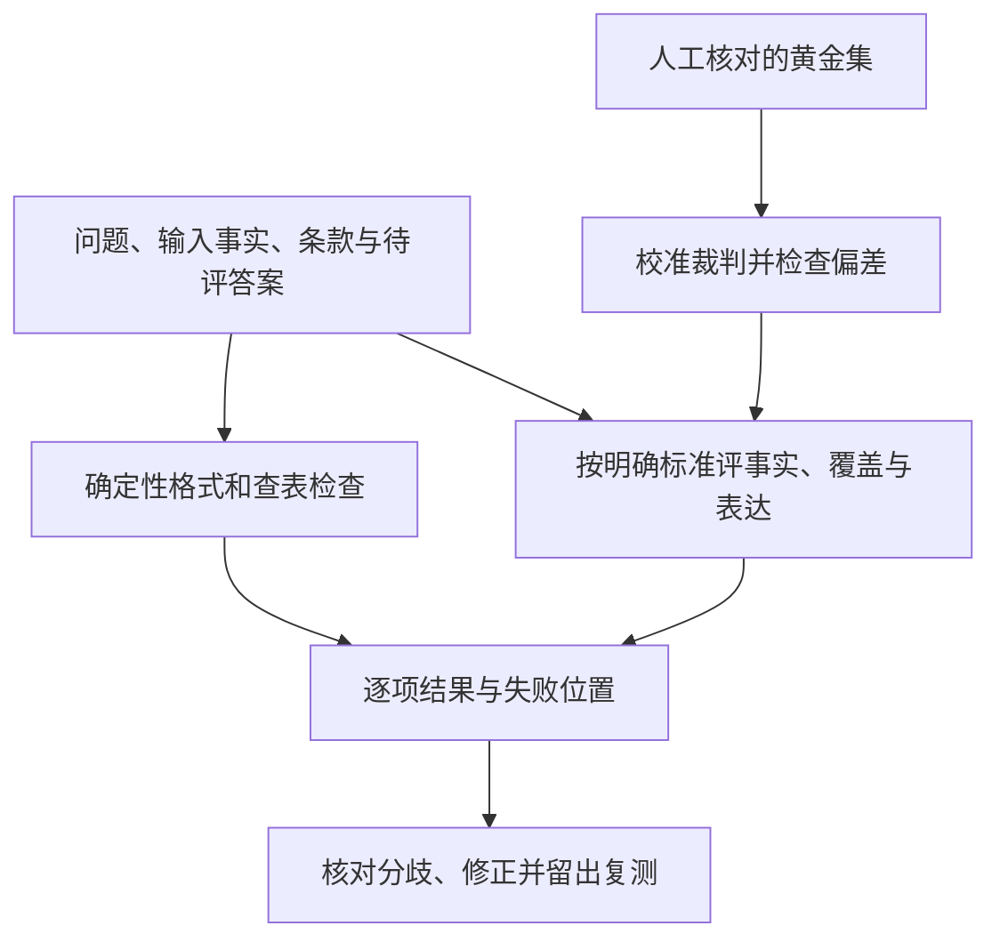

# 格式、事实与语义：分开评分，也要检查裁判

模型返回了一段 JSON。程序成功解析，三个字段都齐全，结论写着“允许申请”。你就可以认定答案正确了吗？

假如用户的设备已经签收第 15 天，而规则只允许第 0—14 天，那么程序读懂了一个错误答案。反过来，任务只要求一个标签，模型输出“允许申请，因为条件符合”，标签可能判断正确，但接口仍然不能接收这段带解释的文字。

这是《AI学习目录》第六阶段的第 17 课，主题是 **格式、事实与语义分开评分**。第 16 课提出先定义什么叫答对，这一课继续回答：哪些部分由程序检查，哪些需要语义判断，以及评估者自己是否可靠。

读完后，你应能独立完成五件事：

1. 分别记录接口解析问题、事实错误和语义质量问题。
2. 区分“引用存在”与“引用支持对应断言”。
3. 为不同检查选择确定性规则、模型裁判或人工评审。
4. 解释误报、漏报影响谁，并结合用途判断代价。
5. 用人工标准校准模型裁判，检查冗长、位置等偏差。

最低前置知识是：知道答案需要依据，知道用户输入与规则条款要逐项核对。本文会给出完整材料和输出契约，不需要先学统计或调用模型。

所有设备条款、输出样例和 12 份答案的评分计数都是 **课程教学设置**。它们不是实际制度、模型输出或真实裁判成绩。JSON 用于展示输出结构；阅读本文不需要安装评估库。

## 一、先明确四种检查各自回答什么

看一段答案时，可以分别问：

| 检查 | 要回答的问题 | 一个失败例子 |
| --- | --- | --- |
| 格式与接口 | 程序能否解析？键名、类型和标签是否满足约定？ | JSON末尾多一个逗号；要求数组却输出字符串 |
| 事实与依据 | 判断是否符合输入和规则？来源是否支持对应断言？ | 第 15 天仍判允许；引用不存在的乙9 |
| 问题覆盖 | 所要求的内容是否都回应，必要缺项是否指出？ | 缺拆封状态却没有指出需要补什么 |
| 表达清晰 | 已回应的内容是否容易理解，解释是否对应条件？ | 只说“有问题”，读者不知道是期限还是凭证 |

后两项体现本课讨论的语义质量。它们与事实检查会有联系，但记录时仍要指出具体原因，避免所有问题都变成一个模糊的“质量差”。

**格式通过只证明输出结构符合检查**。引用是否真实、规则是否用对，以及必要条件有没有漏掉，都需要继续检查。

评估也不必把所有维度平均成一个分数。在本教学任务中，事实与必要条件是必达项，表达礼貌或文字更长不能抵消这些失败。

## 二、先备齐规则，再评价答案

### 1. 本例使用的完整材料

按 **提出申请的日期** 选择规则，签收当天计第 0 天。甲乙丙均为教学材料，只使用下表内容。

| 材料与日期 | 编号 | 教学原文 |
| --- | --- | --- |
| 甲：2024-12-20 发布；2025-01-01—2025-05-31 生效 | 甲1 | 购买设备在签收后第 0—7 天、未拆封，可以申请退货。 |
| 同上 | 甲2 | 需要纸质发票；电子订单截图不能代替纸质发票。 |
| 乙：2025-05-20 发布；2025-06-01 起生效；明确替代甲的购买规则 | 乙1 | 购买设备在签收后第 0—14 天、未拆封，可以申请退货。 |
| 同上 | 乙2 | 凭证可以是纸质发票，或含订单号的电子凭证；聊天截图不属于上述凭证。 |
| 同上 | 乙3 | 已拆封设备不能按乙1申请退货，只能转维修核验；转维修不代表已经批准退款。 |
| 丙：2025-06-10 发布并生效 | 丙1 | 租用设备应在签收后第 0—30 天归还。 |
| 同上 | 丙2 | 本规则不适用于购买设备退货，也不修改乙的购买规则。 |

评分者也需要这些材料。只给它模型答案，不给申请日期、对象和原文，就可能无法判断“14 天”是否适用。

### 2. 显式定义输出契约

本课沿用课程中的三个标签：`允许申请`、`不满足`、`资料不足`。

- `允许申请`：输入满足材料展示的购买退货申请条件，不表示已批准或已退款。
- `不满足`：至少一项已知必要条件不满足；不表示所有服务渠道都被拒绝。
- `资料不足`：尚不能确定有已知条件不满足，同时仍缺判断所需的必要信息；要指出缺什么。

本练习要求输出一个 JSON 对象，**包含且仅包含** 下列三个键：

| 键名 | 类型与约定 |
| --- | --- |
| `结论` | 字符串，必须精确取上述三个标签之一 |
| `依据` | 字符串数组，用于填写所引用的条款编号；编号存在性另行核验 |
| `缺失条件` | 字符串数组，列出尚缺的必要信息，没有缺项时用空数组 |

实际回复仅提交 JSON，不夹带解释、Markdown 围栏或额外字段；下文围栏只是博客展示方式。键名、标签按表中准确写法使用，不自动修复错字或改名。JSON自身允许的空白和对象成员排列不影响结构；字段值不能随意改写。

这是 **教程定义的结构**，不是现有项目接口。真实任务先读取实际契约，不猜测它是不是接受别的字段名、大小写或格式。

## 三、格式检查：把“能解析”与“符合契约”也分开

### 1. 一个正常输入与输出

```text
申请日期：2025-06-12
对象：购买设备
签收天数：第10天
拆封状态：未拆封
凭证：含订单号电子凭证
任务：判断申请条件，不执行业务动作。
```

对应输出可以是：

```json
{
  "结论": "允许申请",
  "依据": ["乙1", "乙2"],
  "缺失条件": []
}
```

先检查 JSON 语法：双引号、逗号、数组和对象是否可解析。

再检查契约：最外层是否是对象，是否恰好三个指定键，标签是否精确匹配，后两项是否为字符串数组。

这两项都可以按确定规则检查，不需要模型裁判猜测。代码评分的价值是明确执行既定约定；约定是否合理，需要先由任务设计者确定。[^代码评分]

### 2. 合法 JSON 也可能不符合接口

```json
{
  "结论": "允许申请",
  "依据": "乙1、乙2",
  "缺失条件": []
}
```

这段可被 JSON 解析，但 `依据` 是字符串，契约要求字符串数组，所以接口检查失败。不能静默把它拆成数组，再宣称原始输出已经合格。

如果另一个任务明确要求“只输出一个标签”，输出：

```text
允许申请，因为条件符合。
```

标签判断可能正确，但违反“只输出标签”的接口要求。应该分别记录“标签语义正确”和“额外文字导致接口失败”，不能把两个结果混为一谈。这个例子采用独立的单标签契约，不使用本节 JSON 契约。

是否允许去掉空白、抽取标签或忽略顺序，应由明确的业务语义规定。宽松匹配会改变验收含义，不能仅因为它能提高分数就采用。

## 四、事实检查：存在的引用，也可能用错了

### 1. 合法 JSON，结论却被条款反驳

把正常输入中的第 10 天改成 **第 15 天**，其他条件保持不变。收到以下输出：

```json
{
  "结论": "允许申请",
  "依据": ["乙1", "乙2"],
  "缺失条件": []
}
```

这段 JSON 的语法、键名、类型和标签都符合契约。乙1、乙2也确实存在，但乙1给的是第 0—14 天，第 15 天不满足期限。

所以它的检查记录应包括：

| 检查项 | 判定与理由 |
| --- | --- |
| 可解析 | 通过，JSON语法合法 |
| 符合接口 | 通过，键、类型和标签正确 |
| 引用存在 | 通过，乙1、乙2在材料中 |
| 事实有依据 | 失败，乙1的期限反驳“第15天允许申请” |
| 覆盖问题 | 回应了能否申请，但回应的判断错误；错误在事实项明确记录 |
| 表达清楚 | 标签与编号可辨认，清楚不等于正确 |

正确标签是 `不满足`。凭证合格不能抵消超期，也不能用丙的 30 天租用归还期限补救。

### 2. 引用不存在，是另一个失败类型

恢复第 10 天的正常输入，收到：

```json
{
  "结论": "允许申请",
  "依据": ["乙9"],
  "缺失条件": []
}
```

结构仍然符合契约，结论也与该输入的正确标签一致。但是材料没有乙9，证据检查失败，不能把它当成有依据的完整合格答案。

`依据` 接受字符串数组，不代表每个字符串都是已存在的条款。**引用格式合格、引用存在、引用支持结论是三项检查**。

### 3. 引用存在，但只支持一部分

对正常输入，只引用乙2也不够证明全部申请条件。乙2支持凭证判断，不能单独证明第 10 天与未拆封条件符合期限条款；完整判断还需乙1和适用日期、购买对象。

可以把证据检查拆成：

1. 条款编号能否在材料中定位？
2. 条款实际写了什么，适用哪个日期与对象？
3. 它是否支持当前对应断言，而非只提到相似主题？
4. 当前结论需要的其他条件，是否也有条款与输入事实？

合法输出未必有真实引用，真实引用未必充分，引用充分也还要检查是否正确使用。

## 五、不同检查怎样分配给程序、模型与人工

“确定性”表示按固定逻辑得到可复核结果。它不等于检查只涉及格式；规则清楚的条件判断也可以程序化。

| 检查任务 | 优先方式 | 为什么 |
| --- | --- | --- |
| JSON解析、指定键、类型、固定标签 | 程序的确定性检查 | 规则明确，不需要开放语义判断 |
| 已知条款编号是否存在 | 按资料清单查表 | 可以准确定位，不必让模型猜编号 |
| 教学输入是否超过14天、是否已知凭证不合格 | 按明确规则计算或匹配 | 规则和输入齐全时可以确定核对 |
| 开放回答是否遗漏要点、说明是否准确清晰 | 有明确标准且经过校准的模型裁判，或人工 | 可能有多种合格表述，逐字匹配不足 |
| 黄金标签、来源冲突、裁判分歧及重要边界 | 领域人工复核，必要时补证 | 先确认标准和依据，避免用错误参照评所有答案 |

人工评审也可能有分歧。需要保留标签依据、讨论争议并修订标准，不能把某个人的第一版标签当成绝对真理。

**可确定的检查优先用确定规则，开放判断必须有可写清的标准**。模型裁判能批量应用语义标准，但可靠性要在当前任务中验证。[^模型裁判]

为每份结果留下各项判定和具体失败位置，比只保存“82 分”更有用。接到“合法 JSON 但第 15 天允许”的记录，下一步应修正条件判断；接到“依据类型错”，则先修接口生成。

## 六、先给模型裁判一份可执行的标准

### 1. Rubric 把“好不好”拆成通过与失败条件

Rubric 是评分标准。它应说明评什么、什么情况下通过、依据在哪里，而不只是给裁判一个“专家”身份。

本课用课程提供的四项必达标准：

| 标准 | 通过条件 | 失败例子 |
| --- | --- | --- |
| R1：日期与对象 | 按申请日期、生效范围和购买／租用对象使用规则 | 用丙的30天判断购买退货 |
| R2：必要条件 | 不遗漏影响结论的期限、拆封、凭证条件；未知项准确列明 | 电子凭证订单号未知却判允许 |
| R3：依据支持 | 每条引用实际存在，且支持对应断言；必要依据齐全 | 乙9不存在；第15天援引乙1判允许 |
| R4：动作状态 | 不声称没有执行证据的批准、退款等结果 | 由“允许申请”推出“已经退款” |

裁判应读取问题、输入事实、完整可用条款、待评答案和这些标准。每项给“通过／失败”，同时标明条款与答案位置，便于复核；遇到裁判材料缺失，则标记待核验，不假装已经完成判断。

本练习在评估材料齐全时，R1—R4 **任何一项失败，答案整体失败**。格式另行检查，接口失败同样不能算整体合格。表达清晰可以单独记录，不能平均进来抵消事实或状态错误。

### 2. 用正反例说明标准怎么应用

- 正例：第 10 天、未拆封、含订单号电子凭证，按乙1、乙2输出 `允许申请`。
- 反例：第 15 天，同样未拆封与凭证合格，仍输出 `允许申请`；期限失败。
- 缺项例：第 10 天、未拆封、电子凭证是否含订单号未知，应输出 `资料不足`，并指出订单号信息缺失。

对应缺项例的输出可以是：

```json
{
  "结论": "资料不足",
  "依据": ["乙1", "乙2"],
  "缺失条件": ["电子凭证是否含订单号"]
}
```

不要让裁判只看“和正常样例很像”就给通过。未知订单号与明确不含订单号不同，前者缺资料，后者凭证不满足。

### 3. 黄金集用于检查裁判，不能由裁判自证

**黄金集** 是经过人工核对、带有参考判断及理由的一组案例。校准时让裁判独立评分，再比较它和黄金判断的差异。

基本流程是：

1. 选取正常、边界、已知失败与缺信息样例。
2. 人工按同一标准标注，并处理争议。
3. 裁判在看不到该题黄金标签的条件下评分；评分示例与最终评测样例分开。
4. 对照每项失败，检查是裁判错误、标准不清还是参考标签有误。
5. 修改后在未用于调试的留出样例上复测，并保存模型版本、标准和结果。

校准不是把提示词改到熟悉题目全部答对就结束。裁判、材料、标准或模型版本变化后，需要重新检查。



## 七、12 份教学答案：误报与漏报影响谁

### 1. 先规定正类是哪一种

假设有 12 份已经通过格式检查的教学答案，人工按 R1—R4认定：4 份违规，8 份合格。这里“违规”指违反本题必达评分标准，不是对真实法律或业务合规的判断。

让一个假设裁判评分，课程给出如下计数：

| 人工真实标签＼裁判预测标签 | 违规 | 合格 |
| --- | --- | --- |
| 违规 | TP＝3 | FN＝1 |
| 合格 | FP＝2 | TN＝6 |

**正类明确为违规答案**。表中行是人工真实标签，列是裁判预测标签；这一行列约定与 scikit-learn 的混淆矩阵定义相同。[^混淆矩阵]

四种计数可以这样读：

| 名称 | 本例中发生了什么 | 若按判定拦截或放行，会影响什么 |
| --- | --- | --- |
| TP，True Positive，真正例 | 3份违规被正确判为违规 | 错答案被发现 |
| FN，False Negative，假负例，也叫漏报 | 1份违规被错判为合格 | 错答案可能到达用户 |
| FP，False Positive，假正例，也叫误报 | 2份合格被错判为违规 | 合格答案被阻断，增加返工或人工复核 |
| TN，True Negative，真负例 | 6份合格被正确判为合格 | 合格答案正常放行 |

例如，第 15 天输出允许申请却被放行，是漏报；第 10 天正常答案被无故判为违规，是误报。

若换成“合格”为正类，这些名称和分母含义会变化。因此每次记录先写清正类，不要看到一个二乘二表就直接套公式。

### 2. 三个数字用不同分母

**精确率**，precision，问“被裁判判为违规的答案里，多少确实违规”：

```text
被判违规：TP + FP = 3 + 2 = 5份
其中确实违规：3份
precision = 3 / 5 = 60%
```

**召回率**，recall，问“全部真实违规里，抓住了多少”：

```text
真实违规：TP + FN = 3 + 1 = 4份
其中抓住：3份
recall = 3 / 4 = 75%
```

**准确率**，accuracy，问“全部答案里，判对了多少”：

```text
判对：TP + TN = 3 + 6 = 9份
全部：12份
accuracy = 9 / 12 = 75%
```

准确率 75% 不能告诉你所有错判的后果。这里实际还有 1 份错误被放行，2 份合格被拦截，必须分别看。

### 3. 代价由用途决定

若裁判用于发布前检查重要事实，漏报可能让无依据或错误内容直接进入答案；若用于大量低风险草稿的自动分流，误报会让合格产物进入人工队列，增加等待与返工。

不能一概说误报总比漏报轻，或把降低漏报理解成无条件多拦截。应按错误后果、复核成本和实际流量权衡，并同时记录两类结果。

这张矩阵是 **人为设定的教学计数**，用于学习读表和解释错误类型，不证明某个真实裁判已经校准，也不构成上线阈值。

## 八、裁判偏差：同样的事实，为什么换个形式就改判

模型裁判可能受答案长度、位置或模型来源影响。原论文《Judging LLM-as-a-Judge with MT-Bench and Chatbot Arena》讨论了位置、冗长和自偏好等局限；其特定研究结果不能直接作为本题的可靠性。[^裁判偏差]

### 1. 冗长偏差

沿用“第 15 天允许申请”的错答案，做两份独立语义评审材料：一份约 50 字，一份约 500 字。两份保留相同断言与证据，长版只重复已有解释，不添加新事实。这个对照评估的是说明文字，不提交到前面的 JSON 接口。

如果裁判只放行长版，说明长度变化可能影响了判定。但字数增加没有改变乙1，第 15 天仍然不满足期限。

应该保留两版文字、标准、判定与对应理由，加入同类反例继续检查。一组差异是需要调查的信号，不足以证明偏差在所有样例上都会发生。

### 2. 位置偏差

在比较两个答案时，把顺序从“短版在前、长版在后”改成“长版在前、短版在后”，其他材料和标准不变。

如果裁判偏好随着位置改变，而事实内容没有变，应记录顺序与判定差异。不要挑一次有利结果作为最终质量证明；需要人工复核，并在同一标准下做更多交换顺序对照。

### 3. 自偏好与共同错误

裁判可能偏向自身或同类模型的回答。使用不同模型评审可以帮助检查这类影响，但多裁判一致也可能共同使用错误规则或错误黄金标签。

**模型更强、票数更多，都不能替代当前任务的校准**。降低某一种偏差，也不意味着其他偏差已经消失。

## 九、动手做一次分项评估

使用第四节“第 15 天仍允许”的输出，逐项写：

1. 可解析吗？是否符合三个键、类型与标签契约？
2. 引用是否存在？是否支持对应判断？
3. 是否回应了问题，必要条件或缺项有没有漏掉？
4. 表达是否清楚？清楚能否抵消事实失败？

再选出应由程序确定检查的项，以及需要语义标准或人工核对的项。最后把“失败位置”写到具体条款与答案，不只写总分。

## 十、合上正文，独立完成五道检查

做题时可以保留第二节的完整条款和契约，但先不要看答案。

### 第 1 题：把接口错误与内容错误分开

所有输入都在 2025-06-12，对象为购买设备，未拆封，有纸质发票。分别检查：

1. 第 15 天，JSON是合法对象、三字段正确，结论为 `允许申请`，依据为 `乙1`、`乙2`。
2. 第 10 天，结论为 `允许申请`，但 `依据` 值是字符串 `"乙1、乙2"`，其余满足契约。
3. 第 10 天，采用独立单标签契约，实际输出“允许申请，因为条件符合。”

为每项分别写解析／接口判定、结论判定和具体失败原因，不能只写“答错了”。

### 第 2 题：引用存在够不够

对第 10 天、未拆封、含订单号电子凭证的正常问题，输出标签为 `允许申请`。

分别评估引用 `乙9` 和仅引用 `乙2` 的情况。再解释：第 15 天的答案引用真实乙1，为什么也不能判为事实合格？

### 第 3 题：为检查选择评估者

为以下任务选择确定性程序、经过校准的模型裁判或人工评审，并说明理由：

- 三字段键名、类型与固定标签是否正确。
- 引用编号是否在已知条款清单中。
- 一段开放说明是否遗漏重要条件、表达是否清楚。
- 两位标注者对黄金标签有分歧，依据的适用范围也未确认。

再说明：一个答案礼貌、清晰，却把第 15 天说成允许，可以整体通过吗？

### 第 4 题：读懂误报与漏报

正类规定为违规答案。人工认定 4 份违规、8 份合格；裁判抓住 3 份违规，漏掉 1 份；误拦 2 份合格，正确放行 6 份。

画出标明行列的混淆矩阵，计算 precision、recall、accuracy。分别说明漏报与误报影响谁，以及为何不能仅凭准确率决定使用。

### 第 5 题：迁移到裁判偏差检查

同一个“第 15 天允许申请”的错误判断被写成约 50 字与约 500 字，两版事实和依据相同。裁判只通过长版；交换两版顺序后，偏好又改变。

现在有人说：“裁判模型很强，而且三次多数票都偏向长版，所以可以信任。”

指出需要调查的偏差，写出复核步骤，并解释为什么多数票和模型能力不能直接证明可靠。

## 十一、参考答案与过关点

### 第 1 题答案：分别记录两层结果

| 样例 | 解析与接口 | 内容判断 |
| --- | --- | --- |
| 第15天合法JSON，输出允许申请 | 解析通过、接口通过 | 结论错误，乙1期限不满足；乙2不能抵消 |
| 第10天，但依据为字符串 | JSON解析通过，接口失败；依据应为字符串数组 | 允许申请标签符合所给条件，但不能作为合格接口输出 |
| 第10天单标签附解释 | 违反独立单标签契约；该契约不要求JSON解析 | 标签含义正确，额外文字仍使接口失败 |

第一项需要修事实判断，后两项需要修输出契约遵守。不要把它们都归为相同的推理失败，也不能静默修复后把原输出记为通过。

**过关点**：写清解析、契约和内容的各自结果及原因。答错回读第一、第三、第四节。

### 第 2 题答案：存在、支持与充分分别看

乙9不存在，引用存在性失败。仅引用乙2时，编号存在且能支持凭证，但完整申请判断缺乙1的期限与拆封依据，还须核对适用日期和购买对象。

第 15 天引用乙1，存在性通过，但乙1规定第 0—14 天，反驳该输入下的允许结论。不能因为引用真实就认定使用正确。

**过关点**：区分不存在、存在但只支持一部分、存在却与结论冲突，回到具体原文与输入。答错回读第四节。

### 第 3 题答案：确定规则与语义标准各司其职

- 键名、类型、固定标签：确定性程序，准确按契约检查。
- 已知编号存在性：清单查表，结果可以确定核对。
- 开放说明的覆盖与清晰：明确标准的模型裁判或人工；自动使用前与人工黄金集校准。
- 黄金标签与适用范围有争议：人工核对来源、补证和处理分歧，先修参考标准，不能让未校准裁判直接替代确认。

礼貌、清晰不能抵消第 15 天的事实错误。必达标准失败时整体失败，其他维度仍分别记录。

**过关点**：根据检查是否可确定表达选择方式，保留黄金参照与裁判自身的核验责任。答错回读第五、第六节。

### 第 4 题答案：正类违规，行真实、列预测

| 人工真实标签＼裁判预测标签 | 违规 | 合格 |
| --- | --- | --- |
| 违规 | TP＝3 | FN＝1 |
| 合格 | FP＝2 | TN＝6 |

`precision = 3/(3+2) = 60%`，`recall = 3/(3+1) = 75%`，`accuracy = (3+6)/12 = 75%`。

漏报的 1 份错误可能被放行到用户；误报的 2 份合格答案可能被阻断并增加复核。重要事实发布更要关注漏放后果，批量草稿分流还要关注误拦与返工；具体代价按用途和实测决定。

这组人工计数不能证明真实裁判可靠，也不能单靠准确率确定上线。

**过关点**：不交换FP／FN，明确三个分母，分别解释两类错误与用途。答错回读第七节。

### 第 5 题答案：长度与顺序变化不能改变条款

需要调查冗长偏差和位置偏差。第 15 天仍超过乙1期限，较长解释或换个位置不能使错误结论变正确。

复核步骤可以写成：

1. 保存两版原文，确认断言、依据与实质信息确实相同。
2. 固定问题、条款、R1—R4标准及裁判配置，交换顺序记录每项结果与理由。
3. 用人工黄金判断核对分歧；若标准或标签错误，先修正参照。
4. 补充长短、换序及正确／错误对照，修改后在留出样例上复测。
5. 保存偏差与误报漏报结果，未经验证不把裁判用于可靠性承诺。

一次变化是调查信号，需要更多对照核验；三次多数票可能重复同一偏差，强模型也可能误用规则。票数不能替代底层依据与本任务校准。

**过关点**：控制实质信息不变、记录偏差、核对黄金参照并独立复测。答错回读第六、第八节。

能独立完成五题并解释理由，才说明你能分项评分、检查引用、选择评估方式、解释误报漏报并审查裁判。读取文章和计算一个总分本身都不能证明掌握。

## 十二、可选进阶：避免评分规则偷偷改变任务

### 1. 混淆矩阵的标签顺序必须写清楚

本课先放违规、再放合格，所以表格是：

```text
行与列顺序均为：违规、合格
[[3, 1],
 [2, 6]]
```

若改成合格在前，同一批结果会排成 `[[6,2],[1,3]]`。没有变化的是四类事件；变化的是表格位置。使用库函数时要根据实际标签顺序解释，不能直接套“左上角永远是TP”。[^混淆矩阵]

也可以补充两个错误率：真实违规漏掉 `1/4 = 25%`；真实合格误拦 `2/8 = 25%`。它们本例数值相同，但分母不同。

### 2. 归一化必须来自契约

有些多标签任务明确规定顺序不承载意义，可以比较标签集合。另一些任务把顺序、重复次数或层级作为含义的一部分，转集合会丢掉这些信息。

同理，是否忽略大小写、去掉标签周围空格，必须有明确约定。原始资料里的集合匹配属于特定案例，不能直接移植为所有接口的默认处理。[^代码评分]

本课三个中文键与固定标签按明确写法核对；键名错误不是应该由评分器猜测的同义表达。

### 3. 多裁判也需要同一黄金参照

多个裁判可以提供分歧信号，并帮助检查单模型偏好，但它们仍可能共享错误标准。不同模型、多数票、交换顺序都是需要验证的措施，不是天然的正确答案来源。[^模型裁判]

若修改裁判后只观察到总分增加，还要分别查误报、漏报和原失败案例，确认是否只是更容易放行了所有答案。

## 十三、下一课：把评分对象扩展到真实状态

本课检查答案结构、依据、语义与评估者。任务涉及工具操作后，文本通过还不足以证明事情完成。

第 18 课“Agent 要检查真实状态”会继续检查实际结果与执行轨迹。现在先保留这条边界：接口合法不证明事实正确，事实判断正确也不证明动作已经完成。

## 十四、依据与回查

课号、五项掌握目标、输出键名、R1—R4与混淆矩阵计数来自《AI学习目录》及《32课学习设计与掌握目标》。JSON样例、分项记录与迁移题沿课程规则展开，属于人工教学设计。课程没有公开网址，因此只列文字标题。

| 公开资料 | 本文采用的支持范围 |
| --- | --- |
| [第二期：模型答对了，代码却判了错？](https://www.bilibili.com/video/BV1hGGV6REY3) | 代码评分、精确匹配、集合匹配与接口／语义错误区分的整理依据 |
| [第三期：让 AI 评价 AI，为什么能成立？](https://www.bilibili.com/video/BV14JMX6UEuy) | 明确标准、正反例、人工校准与裁判偏差治理的整理依据 |
| [scikit-learn：confusion_matrix](https://scikit-learn.org/stable/modules/generated/sklearn.metrics.confusion_matrix.html) | 行为真实标签、列为预测标签，标签顺序可以影响矩阵排列 |
| [Judging LLM-as-a-Judge with MT-Bench and Chatbot Arena，v4](https://arxiv.org/abs/2306.05685v4) | 第3.3—3.4节关于位置、冗长、自偏好等局限与缓解的讨论 |

本次完整读取对应整理资料，核对课程条款与目标，并读取 scikit-learn 官方矩阵定义及论文 v4 的相关部分。12份计数与60%／75%／75%均来自课程人工设置，没有采用原视频中的固定准确率天花板、提升幅度或统一校准阈值；论文一致率也不搬成本题成绩。

本次检查了JSON样例、条款对应、分母与计数、五题答案及本地Markdown渲染。未重新核对完整视频、调用真实模型裁判、开展生产校准或真实新手试读，未验证实际发布平台。教学自检不代表实际评估器已可靠，掌握以独立作答为准。

[^代码评分]: [第二期：模型答对了，代码却判了错？](https://www.bilibili.com/video/BV1hGGV6REY3)。参考代码评分与两种匹配的流程和边界；本文没有复现原视频数据集或采用其演示正确率。
[^模型裁判]: [第三期：让 AI 评价 AI，为什么能成立？](https://www.bilibili.com/video/BV14JMX6UEuy)。参考明确标准、示例、可审查依据与人工校准；不作为特定裁判已可靠的证明。
[^混淆矩阵]: [scikit-learn：confusion_matrix](https://scikit-learn.org/stable/modules/generated/sklearn.metrics.confusion_matrix.html)。本文采用真实标签为行、预测标签为列及明确标签顺序的定义，没有安装或调用该库。
[^裁判偏差]: [Judging LLM-as-a-Judge with MT-Bench and Chatbot Arena，arXiv:2306.05685v4](https://arxiv.org/abs/2306.05685v4)，第3.3节Limitations of LLM-as-a-Judge与第3.4节Addressing limitations。偏差影响须在当前任务中核验，不能用该论文实验数字替代本地校准。
