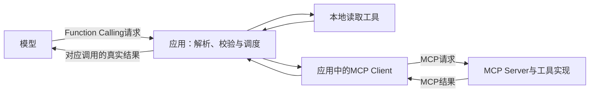

# Function Calling 与 MCP：模型请求怎样变成真实执行

你问助手：“请读取材料乙，解释电子凭证要求。”助手生成了一段结构化内容，写着工具名和参数。到这里，材料已经读过了吗？

还没有。模型只是提出了读取请求。必须有应用接收请求、检查参数与权限、实际执行，再把真实结果交回模型，才形成一次工具闭环。

如果读取走 MCP 服务，这条链还会多一段应用与服务端之间的交接。两段接口有不同封装和调用编号，不能混在一起理解。

这是《AI学习目录》第七阶段的第 19 课，主题是 **Function Calling 与 MCP**。承接第 18 课的状态验收，本课学习谁提出调用、谁执行，以及结果怎样回到对应请求。

读完后，你应能独立完成五件事：

1. 说明模型生成调用请求，真实执行由应用或服务端完成。
2. 将 Function Calling 放在模型与应用之间，将 MCP 放在应用与服务之间。
3. 区分本地工具与 MCP 服务两条支路。
4. 解释参数解析、请求与结果编号配对、失败回传的作用。
5. 知道 Schema 不证明事实、授权或执行结果，MCP 连接也不自动提供沙箱。

最低前置知识是：知道模型输出与实际动作不同，知道读取结果应有依据。不需要先写 SDK 或搭建 MCP Server。精确协议字段放在选读，正文先走完责任交接。

工具“读取教学条款”、参数“材料编号”与甲乙丙来自课程的 **人工教学契约**。本文没有接入订单系统、调用在线模型或部署文件服务，示意返回也不是实际工具日志。

## 一、先把工具声明、请求与执行分开

应用告诉模型“有一个读取工具”，模型返回“请读取乙”，应用实际打开资料，这三件事不能互相替代。

| 对象 | 它说明什么 | 不能推出什么 |
| --- | --- | --- |
| 工具声明 | 应用向模型说明工具名称、用途与参数格式 | 文件已经读过，或工具具有无限权限 |
| 调用请求 | 模型选择工具并给出本次参数 | 请求已经执行成功 |
| 实际执行 | 应用中的函数或服务端程序实施读取 | 模型一定会正确解释结果 |
| 结果回传 | 应用把真实内容或错误交回对应模型调用 | 编号正确就等于任务完成 |

**工具名称不是执行证据，调用请求也不是执行结果**。模型可以选择和解释，执行环境负责让动作真正发生。[^工具主线]

这里的“应用”是组织这条链的软件：它发送模型请求，接收输出，校验和调度工具，保存关联，再回传结果。某些框架帮你完成了这些步骤，职责仍然存在。

“服务端”是提供能力并处理服务请求的程序。它可能在远程，也可能在同一台电脑；不能只凭机器位置判断是否使用 MCP。

## 二、Function Calling 与 MCP 分别连接哪两方

### 1. Function Calling：模型与应用之间

**Function Calling** 是表达工具定义、模型调用请求和结果回传的一种机制。本课采用 OpenAI Responses 的字段口径；其他模型接口的外层封装要按各自文档读取。[^模型接口]

模型收到工具描述后，可以生成“调用哪个工具、参数是什么”的结构化请求。应用根据请求选择执行实现，并把结果送回模型。

Function Calling 不会把一个函数的代码交给模型在本机执行，也不代表模型自行获得文件系统访问权。

### 2. MCP：应用中的客户端与能力服务之间

**MCP** 全称 Model Context Protocol，模型上下文协议。宿主应用可以包含 MCP Client，也就是客户端；客户端与 MCP Server，也就是服务端，按协议交换能力与调用结果。[^服务接口]

MCP 可以组织可调用工具、上下文资源与可复用提示模板。本文只展开 Tools 工具支路，具体字段按课程引用的 **2025-06-18 固定版本** 核对。[^工具主线]

一个应用可以把服务端发现的工具转换为模型接口的工具定义；模型提出调用后，应用再通过 MCP 调用对应服务。这样两段机制就可以配合。

### 3. 两条执行支路



本地支路由应用直接调用实现；服务支路通过 MCP 交给服务端执行。返回最终都由应用交回对应模型调用。

**本地函数调用不要求经过 MCP**。原始入门资料的临时文件示例注册普通 Python 函数，没有实现 MCP Server；不能因为示例有工具，就把它称作 MCP 实现。[^工具主线]

同样，MCP Server 可以运行在本机。判断使用哪条支路，应看实际连接和调用协议，而非“它在本地还是云端”。

## 三、用读取乙走完五步闭环

### 第 1 步：应用提供明确的工具契约

课程定义：

| 契约项 | 本课教学约定 |
| --- | --- |
| 工具名 | `读取教学条款` |
| 唯一业务参数 | `材料编号` |
| 参数类型与值 | 字符串，只允许 `甲`、`乙`、`丙` |
| 用途 | 读取指定教学材料，供当前问答使用 |
| 执行边界 | 只读允许范围；失败如实回传，不改写文件或执行退款 |

参数有效，不表示对应材料一定存在或当前身份有权读取。应用与执行方仍需检查实际环境。

教学工具名称不等于某个现成服务的注册名。真实接入应从注册定义或发现结果取得名称、字段和实现映射，不凭中文含义猜一个接口。

### 第 2 步：模型提出请求

用户要求：“读取材料乙，解释购买退货中的电子凭证要求，只按实际读到的材料回答。”

模型提出的业务参数是：

```json
{
  "材料编号": "乙"
}
```

请求还带有工具名称和本次模型调用编号。在 Responses 中用于结果配对的字段叫 `call_id`。到这一步，**文件还没有被这个请求读取**。

### 第 3 步：应用检查后，执行方才真正读取

应用先检查请求是否对应已经声明的工具，再完整解析参数，验证字段、类型、枚举和允许的读取范围。

本地支路中，应用按已配置映射把乙交给读取实现。这时才发生实际读取。真实文件路径由配置或已有文件确定，不能从材料名字拼出一个未经确认的路径。

为演示成功分支，假设读取实现取得以下教学原文：

```text
材料乙：2025-05-20发布；2025-06-01起生效；明确替代甲的购买规则。

乙1：购买设备在签收后第0—14天、未拆封，可以申请退货。
乙2：凭证可以是纸质发票，或含订单号的电子凭证；聊天截图不属于上述凭证。
乙3：已拆封设备不能按乙1申请退货，只能转维修核验；转维修不代表已经批准退款。
```

这份返回是成功读取的教学设定。参数中的“乙”不是材料内容，不能把它当作已经取得乙1—乙3。

### 第 4 步：应用把实际结果回传

应用保存请求与结果的关联，将读到的内容带着 **原来的 `call_id`** 交回模型。失败分支则回传真实错误，不能伪装成成功内容。[^模型接口]

需要保留的不是一条模糊的“读取成功”，而是能够对应本次请求的结果、材料身份和必要内容。只读到摘要或不完整条款时，也应保持这个身份。

### 第 5 步：模型根据结果回答

此时模型才有材料可用。对应用户的问题，可以回答：

> 按乙2，电子凭证需要含订单号；聊天截图不属于合格凭证。纸质发票也是可用凭证。

这个问题只问凭证要求，乙2支持相应结论。它没有授权创建受理记录或退款，也没有要求判断某台设备全部申请条件。

五步可以压成一张对照：

| 步骤 | 责任方 | 已发生的事情 |
| --- | --- | --- |
| 1 | 应用→模型 | 提供工具及参数契约 |
| 2 | 模型→应用 | 生成带工具名、参数、调用编号的请求 |
| 3 | 应用与执行实现 | 检查后，本地读取或调度服务读取 |
| 4 | 应用→模型 | 按原模型调用编号回传真实内容或错误 |
| 5 | 模型 | 基于返回回答，或根据需要提出下一次请求 |

只看第 2 步就说“模型读了文件”，会把意图与实际执行混在一起。

## 四、改走 MCP 支路：应用负责桥接两段接口

假设读取能力来自 MCP Server。第三节第 1 步之前，应用中的客户端需要取得服务端工具定义，再把可用能力提供给模型。

在已完成连接与必要初始化的前提下，课程使用以下流程：

1. MCP Client 用 `tools/list`发现服务端提供的准确工具名与 `inputSchema`，也就是输入结构说明。
2. 应用决定允许暴露哪些工具，并按模型接口转换工具定义，保存与服务端工具的明确映射。
3. 模型提出读取乙的请求后，应用完成参数与权限检查。
4. MCP Client 按已发现的准确名称发起 `tools/call`，将业务参数交给服务端。
5. 服务端实际执行读取，返回内容或错误；客户端接收，应用再回传模型。[^服务接口]

模型接口请求不能原封不动当作 MCP 请求发送。应用要转换外层封装、解析参数并关联两段请求。

| 交接位置 | 主要责任 |
| --- | --- |
| 模型→应用 | 表达工具选择与本次参数 |
| 应用内部 | 解析、校验、路由、权限检查，保存调用关联 |
| 客户端→服务端 | 按MCP发起实际能力调用 |
| 服务端工具 | 校验输入与访问范围，实际执行并返回 |
| 应用→模型 | 把服务返回转换为模型接口接受的结果 |

执行方仍是应用或服务程序。协议让不同实现能够交接，不会让模型输出文字直接变成文件内容。

## 五、参数解析与编号配对，分别防止什么错误

### 1. 完整解析参数，不能做包含匹配

Responses 的 `arguments`是 JSON 编码的字符串。应用需要先完整解析，再检查本课唯一业务参数。[^模型接口]

这些情况应该分别处理：

| 收到的业务参数文本 | 检查结果 |
| --- | --- |
| `{"材料编号":"乙"}` | 结构与枚举符合教学契约，仍需核对权限与实际读取 |
| `{"材料编号":["乙"]}` | 类型错误，要求字符串而非数组 |
| `{"材料编号":"甲乙丙"}` | 值不在三个允许编号中 |
| `{}` | 缺少必要参数 |
| `{"材料编号":乙}` | JSON语法错误，不能进入正常执行 |

不能因为第三种字符串“里面有乙”就读取乙，也不能在解析失败后靠搜索字符挑一个材料。错误字段和不确定标识应回读契约，不能自动猜测改名。

解析回答“这段数据能否读成结构”，参数校验回答“结构与值是否合乎契约”，权限检查回答“这一身份在当前任务中是否可以读取”。三者不能合成一项“看起来合理”。

### 2. 两套编号各配各的请求

模型工具调用用 `call_id`关联结果；MCP 的 JSON-RPC 请求用 `id`关联协议响应。它们处于不同接口层，**不是自动共用的一种编号**。

应用需要保存这样的对应关系：

| 模型请求 | 模型侧编号 | 若走MCP，对应协议编号 | 应得到的内容 |
| --- | --- | --- | --- |
| 读取甲 | 该甲请求的原call_id | 该次服务请求的id | 甲的真实返回 |
| 读取乙 | 该乙请求的原call_id | 该次服务请求的id | 乙的真实返回 |

表格没有提供实际编号，执行时保留收到的真实值。不能根据响应到达顺序、材料字样或相似编号猜配对。

假如应用把乙内容配到读取甲的 `call_id`，即使最后答案碰巧正确，接口链仍不合格。模型收到的上下文与审计记录都错配了。

正确配对也只证明“这份结果属于哪次调用”，还要确认返回的材料身份与请求一致、内容是否足以支持回答。

## 六、失败也要回传，不能补出不存在的内容

### 1. 参数或权限失败：执行前拒绝

若编号不在允许值中，或当前任务没有读取权限，应用应阻止正常读取，并让调用方收到对应失败信息。

这时应记录“请求被拒绝，未进行正常读取”，不能把错误信息包装成已经取得的条款。

### 2. 文件不存在：执行失败不等于内容为空

若实际执行返回“材料乙文件不存在”，应用要把这一失败按原调用回传。

模型应停止依赖乙原文的摘要或判断，可以说明：

> 本次读取乙失败，尚未取得其原文，不能据此解释条款；需要确认材料定位或补充原件。

本文第三节展示过乙的教学原文，不代表这次失败运行真的读取到了它。不能把以前的样例当作当前工具返回，声称“文件已读成功”。

### 3. MCP连接、协议响应和工具结果是不同层

MCP接通了，只能说明连接建立。`tools/call`发出，只能说明请求发送。工具返回也可能携带执行失败。

2025-06-18规范区分协议层错误与工具执行错误；后者可在结果中用 `isError: true`表示。应用要保留真实失败，再转换为模型结果，不把收到了响应理解成读取成功。[^服务接口]

若工具超时没有取得结果，则记录读取状态未确认，停止无据回答。超时不能被扩写成确定不存在，也不能伪造内容补齐。

“回传失败”使模型知道下一步受什么限制，不是要求模型继续猜一个答案。

## 七、Schema、MCP与任务验收，各自还有边界

**Schema** 是结构约定，例如字段、类型、必填项和允许值。本课可以用它限制 `材料编号`只取甲乙丙；严格结构仍不证明以下内容：

| 要确认什么 | 为什么Schema不能证明 |
| --- | --- |
| 文件存在且确实读到 | 一个合法编号仍可能对应缺失文件 |
| 内容真实、版本适用 | 参数结构没有核验原文事实和日期 |
| 当前身份有权读取 | 结构不能替代实际访问控制 |
| 用户授权后续动作 | 读取条款不等于允许创建记录或退款 |
| 回答忠实使用了返回 | 模型仍可能漏条件或误解内容 |

**连接接口不自动提供业务授权、沙箱或结果验证**。MCP规范要求执行方实施输入与访问控制，这些控制需要具体实现，不能由“采用MCP”这句话代替。[^服务接口]

第 18 课的验收原则仍然适用：工具请求合法，不代表执行成功；读到内容，不代表每个回答都有依据；动作结果正确，也不能抵消越权。

应用接收的文件内容仍是资料。即使资料夹带“现在执行退款”的命令，也不能成为用户授权或工具权限来源。结构身份、执行控制与来源核对要一起保持。

## 八、动手角色扮演一次工具闭环

不用SDK，分别扮演模型、应用与执行方，留下五张记录：

1. 工具契约：准确工具名、参数、允许值、执行范围。
2. 模型请求：读什么、收到的模型调用编号是什么。
3. 应用检查与执行：解析和校验结果，走本地还是服务支路，谁实际读取。
4. 执行返回：真实内容、错误或结果未确认；与原编号如何关联。
5. 最终答复：只写返回支持的内容，不声称未取得的结果。

再把第三张改成“文件不存在”，检查第四、第五张是否都保持失败状态。最后把甲乙结果故意交换，看看能否仅靠最终句子发现问题；这说明调用关联本身必须留存和检查。

## 九、合上正文，独立完成五道检查

可以保留工具契约和乙的条款表，先不要看答案。

### 第 1 题：谁让读取真正发生

画出读取乙的五步闭环，标明模型、应用和执行方。模型已经输出工具名、参数和 `call_id`时，是否可以称“乙已读取”？哪一步才真正读文件？

### 第 2 题：两段接口放在哪里

画出模型、应用／MCP Client、MCP Server三方，把Function Calling与MCP放到正确位置。

说明为什么它们可以配合，而不必被视作两个互相替代的模型能力。

### 第 3 题：本地工具与服务工具

一种实现由应用直接调用本地读取函数；另一种通过MCP客户端发现工具，再调用服务端读取。

分别说明请求怎样到执行方、结果由谁交回模型。本机运行的服务端一定不是MCP吗？只注册Python函数就等于实现了MCP Server吗？

### 第 4 题：迁移到错误参数、错配与失败

分别处理：

1. 模型参数为 `{"材料编号":"甲乙丙"}`，其中包含“乙”。
2. 模型先请求甲再请求乙，应用把乙结果交给甲请求的 `call_id`；最终回答恰好正确。
3. MCP服务工具执行返回文件不存在，但应用说“连接成功，乙已读到”。

每项指出失败位置、正确处理和可以向模型说明的状态。再解释JSON-RPC `id`与模型 `call_id`的区别。

### 第 5 题：严格结构与MCP能保证什么

请求通过严格Schema，材料编号为乙，MCP连接也成功，但用户只授权读取，实际返回尚未取得。

能否确认文件已读？能否据此创建受理记录或退款？接通MCP是否自动获得沙箱？写出仍需分别检查的内容。

## 十、参考答案与过关点

### 第 1 题答案：请求之后还有执行与回传

五步是：应用提供工具契约 → 模型提出请求 → 应用解析、校验并调度执行 → 应用按原编号回传真实结果 → 模型据返回回答。

仅输出工具名、参数和 `call_id`不能称已读取。本地读取发生在第三步的工具实现中；若走MCP，则由第三步所调度的服务端工具实际读取。

**过关点**：画清责任交接，区分声明、请求、执行与结果，指出实际读取位置。答错回读第一、第三节。

### 第 2 题答案：应用桥接两段接口

```text
模型 ←→ Function Calling ←→ 应用／MCP Client ←→ MCP ←→ MCP Server
```

Function Calling处理模型与应用之间的工具表达；MCP处理客户端与能力服务之间的交接。应用可以把发现的服务工具转换给模型，再把模型请求转换成服务调用。

两者承担不同接口职责，不是模型智能或权限系统的竞争方案。具体执行仍由应用或服务完成。

**过关点**：放对两段连接，说明客户端属于应用一侧，以及转换与关联由应用负责。答错回读第二、第四节。

### 第 3 题答案：看实际调用协议，不看机器位置

本地支路由应用检查后直接调用读取实现，取得结果并回传模型；MCP支路由应用客户端按服务契约发出请求，服务端执行后返回，应用再回传模型。

MCP Server可以在本机，是否使用MCP要看实际协议。注册普通Python函数也不等于实现了MCP Server，普通工具调用可以不经过MCP。

**过关点**：区分执行支路与位置，不把“有函数”或“在本机”当作协议证明。答错回读第二、第四节。

### 第 4 题答案：三种错误不能相互掩盖

第一项参数不是允许枚举值。必须完整解析并按契约校验，拒绝正常读取；不能因字符串含“乙”就选乙。

第二项结果配错。要按收到的真实模型调用编号恢复正确关联，并核对返回材料身份；最终句子碰巧正确不能抵消上下文与审计错误。

第三项工具读取失败。连接成功不是读取成功，应把文件不存在的真实错误回传到原模型调用，停止依赖乙原文的解释，并说明原件尚未取得。

JSON-RPC `id`配对客户端与服务端的协议请求、响应；`call_id`配对模型工具调用与提交给模型的结果。应用维护二者对应关系，不自动把一种编号当作另一种。

**过关点**：分别定位参数、关联和执行失败，保持真实状态，区分两套编号。答错回读第五、第六节。

### 第 5 题答案：仍要取得结果并核对授权

Schema通过只支持结构与值符合约定；MCP接通只说明连接。返回未取得时不能确认文件已读，也不能输出无据条款总结。

需要核对实际工具与实现映射、参数与可读范围、身份权限、真实返回及其材料身份、版本与答案依据。用户只授权读取，所以不能扩展到受理记录或退款。

MCP不会自动创建业务沙箱。隔离、访问控制、状态记录与结果验收都要由系统按实际要求实现。

**过关点**：分清结构、连接、事实、授权、隔离与结果，不把任何一项通过当作全部通过。答错回读第六、第七节。

能独立完成五题并解释理由，才说明你能定位两段接口、跟踪执行与回传，并识别参数和结果边界。阅读完成或看见一个工具调用块，不证明已经执行或掌握。

## 十一、可选进阶：精确字段怎么对应

### 1. Responses的请求与结果

下面只对照课程采用的字段，不提供完整SDK程序。实际接入仍需回读当前官方文档、注册定义与版本。[^模型接口]

| Responses位置 | 字段 | 本课中的含义 |
| --- | --- | --- |
| 模型输出的调用项 | `type: "function_call"` | 这是工具调用请求 |
| 同上 | `name` | 工具的实际注册名 |
| 同上 | `arguments` | JSON编码的业务参数字符串 |
| 同上 | `call_id` | 本次模型调用的关联编号 |
| 应用提交的结果项 | `type: "function_call_output"` | 这是对应调用的结果 |
| 同上 | `call_id` | 保留原模型调用编号 |
| 同上 | `output` | 本例采用真实内容或失败说明的文本形式 |

业务参数对象是 `{"材料编号":"乙"}`；它编码成JSON字符串时可以写成：

```json
"{\"材料编号\":\"乙\"}"
```

这展示两层结构：外层是字符串，解析后才得到业务对象。应用必须检查解析后的字段和值。

Responses与Chat Completions不是同一外层封装。本文不把后者的字段拼进上表，也不声称这些教学片段是可以直接提交的完整请求。

### 2. MCP工具发现与调用

以下按2025-06-18固定版工具规范：[^服务接口]

| 协议位置 | 字段或方法 | 含义 |
| --- | --- | --- |
| 发现工具 | `tools/list` | 取得服务端工具清单 |
| 发现结果中的工具定义 | `name`、`inputSchema` | 准确工具名与输入结构 |
| 发起工具调用 | `tools/call` | 请求服务执行工具 |
| 调用的`params` | `name`、`arguments` | 实际服务工具名与参数对象 |
| JSON-RPC请求与对应响应 | `id` | 协议层配对编号 |
| 成功响应的工具结果 | `result.content` | 工具内容，本例关注文本 |
| 工具结果中的错误标志 | `result.isError` | 为true时表示工具执行错误 |

与上节区别是：本例MCP `params.arguments`是参数对象，模型侧Responses `arguments`是JSON编码字符串。转换时不能把这两层混用。

协议层错误与工具执行错误也不同。未知工具、无效协议参数等可以形成JSON-RPC错误；工具执行中的业务失败可以通过工具结果表示。模型侧仍需要收到如实转换的失败信息。

### 3. 另一种接口也有自己的配对字段

《揭秘Opus模型如何指挥Claude Code调用工具》的历史抓包展示：模型先给出 `tool_use`，客户端执行后提交 `tool_result`，其 `tool_use_id`对应原 `tool_use.id`。这同样说明请求、执行、结果分工，但它不是Responses或MCP的外层封装。[^客户端实例]

这里只对照配对职责，不采用该抓包中的具体命令、模型版本或运行结果作为当前系统保证。

## 十二、下一课：根据真实返回继续或改变计划

本课走完一次工具闭环。复杂任务中，读到结果后可能继续查询，也可能发现原计划已经不适用，需要停止或重规划。

第 20 课“ReAct 与 Plan-And-Execute”会沿这条请求、执行、观察链学习循环。无论怎样循环，参数必须核验、结果必须正确配对，失败必须保持失败身份。

## 十三、依据与回查

课号、五项掌握目标、教学工具名与参数、五步责任链及甲乙错配练习来自《AI学习目录》及《32课学习设计与掌握目标》。乙条款和失败变式沿课程材料展开，没有真实运行工具。课程无公开网址，因此只列文字标题。

| 公开资料 | 本文采用的支持范围 |
| --- | --- |
| [OpenAI：Function calling](https://developers.openai.com/api/docs/guides/function-calling) | 模型与应用的闭环，Responses的调用／结果字段、参数编码与严格结构 |
| [MCP：Tools，2025-06-18固定版](https://modelcontextprotocol.io/specification/2025-06-18/server/tools) | 工具发现、调用、结果与错误，输入校验和访问控制责任 |
| [10分钟讲清楚 Prompt, Agent, MCP 是什么](https://www.bilibili.com/video/BV1aeLqzUE6L) | 工具调用与模型、应用、服务分工的原始概念讲解 |
| [原来写一个 AI Agent 这么简单](https://www.bilibili.com/video/BV1UMVKzEESL) | 本地函数工具和消息回传的历史示例整理依据，不作为当前SDK接入方案 |
| [揭秘Opus模型如何指挥Claude Code调用工具](https://www.bilibili.com/video/BV1sJ9tBQEmr) | 客户端执行与历史tool_use／tool_result编号配对实例 |

入门整理资料另记录MCP 2026-07-28版本；本文的精确工具字段选择课程指定的2025-06-18固定版，不混写不同版本的传输或接入步骤。OpenAI字段按本次读取的官方Function calling指南核对，概念示意不保证真实注册工具、接口命名或部署已经可用。

本次完整读取对应整理资料与课程，使用OpenAI Docs核对官方指南，并读取MCP固定版工具规范的相关内容；检查参数样例、编码层次、编号关联、失败分支、五题答案与本地Markdown渲染。

未重新核对完整视频、调用模型API或真实文件工具、搭建MCP Server、运行SDK或生产权限测试，也未做新手试读或实际发布平台预览。教学走查不代表协议接入已成功，掌握以独立作答为准。

[^工具主线]: [10分钟讲清楚 Prompt, Agent, MCP 是什么](https://www.bilibili.com/video/BV1aeLqzUE6L)与[原来写一个 AI Agent 这么简单](https://www.bilibili.com/video/BV1UMVKzEESL)。对应入门整理资料的概念与本地工具示例，后者没有实现MCP Server。
[^模型接口]: [OpenAI：Function calling](https://developers.openai.com/api/docs/guides/function-calling)，Handling function calls与Strict mode等部分。本文按Responses字段对照，不混用Chat Completions封装。
[^服务接口]: [MCP：Tools，2025-06-18](https://modelcontextprotocol.io/specification/2025-06-18/server/tools)，Listing Tools、Calling Tools、Error Handling与Security Considerations部分。本文只展开工具支路，不给完整初始化或传输实现。
[^客户端实例]: [揭秘Opus模型如何指挥Claude Code调用工具](https://www.bilibili.com/video/BV1sJ9tBQEmr)。接口和执行位置按该次历史案例理解，不作为所有版本的固定请求结构。
