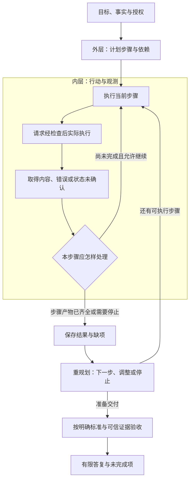

# ReAct 与 Plan-And-Execute：根据观测推进，必要时改计划

你让助手核对退货条件。它先读到旧规则，又尝试读取新规则，工具却超时了。此时应该继续判断、重新读取，还是停下来说明缺什么？

再换一个情况：新规则已经取得，计划中还剩“建立待受理记录”。用户突然更正：“设备其实已经拆封。”助手还能为了完成清单继续创建吗？

这些问题的关键是 **根据真实观测决定下一步**。计划提供方向，工具和用户输入提供新信息，验收说明哪些步骤真正完成。

这是《AI学习目录》第七阶段的第 20 课，主题是 **ReAct 与 Plan-And-Execute**。第 19 课走完一次工具请求、执行与回传，这一课把它放进多步任务，并在需要时改变路线。

读完后，你应能独立完成五件事：

1. 沿“行动→观测→下一步”解释 ReAct，不只认识几个标签。
2. 说明显式计划如何组织步骤与依赖，以及执行器内部怎样使用 ReAct。
3. 遇到真实新事实时重规划或停止，并指出失效的步骤。
4. 区分 Re-Plan 调整计划与 Checker 验收结果的职责。
5. 识别重复叙述进展、却没有新证据的情况。

最低前置知识是：知道模型提出工具请求，应用或服务执行，真实结果再回到模型。本文会给出完整案例，不要求安装 Agent 框架或读取模型完整隐藏推理。

甲乙丙、读取轨迹和受理任务均为 **人工教学设置**。本文没有运行真实读取服务、创建记录、发起维修或退款；主问答与后面的扩展创建任务也会分别说明授权范围。

## 一、先看一次小循环，不急着记标签

假设当前任务需要核对 2025-06-12 的购买退货规则：

```text
行动：读取甲。
观测：实际返回显示，甲只适用到2025-05-31。
下一步：甲不能作为本次申请的现行规则，继续取得替代版本乙。
```

行动发生后，系统得到一项环境信息，再据此决定下一步。这就是本课理解 ReAct 的起点。

**ReAct** 来自 Reasoning and Acting，即推理与行动。原论文让推理与任务动作交错，借助动作取得外部信息，并据返回调整后续行动。[^行动观测]

常见的演示会用以下名称：

| 名称 | 本课怎样理解 | 要注意的边界 |
| --- | --- | --- |
| Thought | 当前行动理由或判断说明 | 文字不能证明动作已经执行 |
| Action | 提出的工具动作 | 应用检查与执行后才发生实际操作 |
| Observation | 工具或环境真实返回 | 可能是内容、错误或结果未确认 |
| Final Answer | 当前任务的答复 | 仍需按依据与成功标准检查 |

本文的“行动理由”是可复核的教学摘要，例如“需要乙的凭证条款”，不声称读取了模型完整隐藏推理。验收需要输入、工具返回、条款与状态证据，而非一段看起来完整的思考文字。

不同实现可以采用不同标签或结构化接口。**是否根据观测推进，比是否输出 Thought 字样更关键**。

## 二、固定材料与任务，避免中途换背景

### 1. 仍使用甲乙丙教学规则

按提出申请的日期选择规则，签收当天计第 0 天。

| 材料与日期 | 编号 | 教学原文 |
| --- | --- | --- |
| 甲：2024-12-20 发布；2025-01-01—2025-05-31 生效 | 甲1 | 购买设备在签收后第 0—7 天、未拆封，可以申请退货。 |
| 同上 | 甲2 | 需要纸质发票；电子订单截图不能代替纸质发票。 |
| 乙：2025-05-20 发布；2025-06-01 起生效；明确替代甲的购买规则 | 乙1 | 购买设备在签收后第 0—14 天、未拆封，可以申请退货。 |
| 同上 | 乙2 | 凭证可以是纸质发票，或含订单号的电子凭证；聊天截图不属于上述凭证。 |
| 同上 | 乙3 | 已拆封设备不能按乙1申请退货，只能转维修核验；转维修不代表已经批准退款。 |
| 丙：2025-06-10 发布并生效 | 丙1 | 租用设备应在签收后第 0—30 天归还。 |
| 同上 | 丙2 | 本规则不适用于购买设备退货，也不修改乙的购买规则。 |

主问答是：2025-06-12 提出申请，购买设备签收第 10 天、未拆封、有含订单号电子凭证，能否申请退货？

此任务 **只做问答，不创建记录或退款**。后面演示外层计划时，才单独增加有条件的创建授权。

### 2. 读者能看见材料，不代表失败运行已经读到

上表是博客中的教学原文。追踪某一次运行时，仍要检查那次调用实际取得了什么。

例如乙读取超时，就不能因为博客已经展示乙2，而声称该次工具读取成功。必须分清学习材料、已有可信输入和当次工具返回的身份。

## 三、ReAct 追踪：每次下一步都有依据

### 1. 从旧规则、超时到取得新规则

下面按课程演示一次轨迹。第三轮属于“前次请求已终止、实际重试规则允许继续读取”的分支，不表示超时后总要自动重发。

| 轮次 | 行动理由 | 动作 | 实际观测 | 下一步 |
| --- | --- | --- | --- | --- |
| 1 | 先确认适用版本 | 读取甲 | 甲有效至2025-05-31 | 本题申请日在06-12，继续取得乙 |
| 2 | 需要乙的完整条件 | 读取乙 | 超时，没有条款内容 | 停止凭证等相关断言，检查请求状态与重试条件 |
| 3 | 按已确认规则重新取得原文 | 读取乙成功 | 乙的日期与替代说明、乙1乙2乙3 | 保留来源位置，逐项核对输入 |
| 4 | 当前输入与必要条款已齐全 | 输出依据与结论 | 答案经事实核对通过 | 问答结束；尚未创建记录 |

第一轮不是直接把 7 天与 14 天平均。它只把旧材料的适用范围与申请日期对齐，再找本题需要的版本。

第二轮取得的观测是“超时、未得到内容”。错误也是观测，但它不提供乙2的凭证规则。

### 2. 缺证据时停止的是哪些判断

此时可以保留已经核对的部分：甲的适用期已结束，不支持本题的现行购买规则判断。

但不能声称“已经读到乙，电子凭证合格”。乙的完整条件尚未取得，应停止依赖该材料的结论，并准确说明缺什么。

可以交付一个阶段性说明：

> 已确认甲不适用于本题日期；读取乙超时，尚未取得当前规则。暂不能完成凭证及申请条件判断，需要核对该请求状态或重新取得乙原文。

**停止无据判断，不等于丢掉所有已核对事实**。它是在证据边界内继续工作。

若请求仍在运行，应观察或等待同一请求，不能把“暂未返回”当成已经失败。若确认已终止，再按既定规则有限重试；达到上限仍无原文，就报告缺证。本文不补造统一重试次数。

### 3. 有真实返回后再核条件

第三轮实际取得乙后，才能核对：

| 检查项 | 已取得的依据 | 输入 | 判断 |
| --- | --- | --- | --- |
| 适用范围 | 乙从2025-06-01起替代甲的购买规则 | 06-12，购买 | 适用乙 |
| 期限 | 乙1第0—14天 | 第10天 | 满足 |
| 拆封 | 乙1要求未拆封 | 未拆封 | 满足 |
| 凭证 | 乙2允许含订单号电子凭证 | 含订单号电子凭证 | 满足 |

主问答可以结束为：“按乙1、乙2，满足展示的申请条件，可以申请退货。”没有创建记录，也没有批准或执行退款。

这条小循环不需要事先知道每次工具结果。它通过当前问题、已取得的信息和停止条件，逐步决定下一步。[^构建模式]

## 四、外层计划：步骤与依赖写清楚，内层仍可循环

### 1. 单独定义扩展任务的授权

现在切换到课程的扩展示例：用户明确授权，在当前申请满足材料条件时，为指定申请和目标订单 **创建一条待受理记录**，然后验收；不授权退款。

本例不提供实际申请编号和订单号，执行时应使用已核对的输入值，不能猜。这个授权属于教学扩展任务，不是从主问答或条款推出来的权限。

外层计划可以写成：

| 步骤 | 要取得的产物 | 前置依赖 |
| --- | --- | --- |
| 取材料 | 适用版本、完整条款与来源位置 | 准确材料定位与读取权限 |
| 核条件 | 申请日期、对象、期限、拆封、凭证的逐项判断 | 当前输入事实与已取得原文 |
| 有条件地建记录 | 当前申请、目标订单的一条待受理记录 | 条件满足、授权仍有效、执行前检查通过 |
| 验收 | 状态、对象、依据、唯一性与有无越权的检查结果 | 实际动作及可信状态证据 |

计划是有依赖的工作安排。前面的产物不成立，后续动作就不能因为“排在清单里”而照常执行。

### 2. Plan-And-Execute 并不要求机械走清单

**Plan-And-Execute** 将规划与执行分开：先生成显式计划，执行器处理当前步骤，再按执行结果重规划或形成答复。执行器内部仍可以使用 ReAct。[^构建模式]

例如，外层正在执行“取材料”，内层就可能经历第三节的“甲不适用→乙超时→核对请求状态→取得乙”过程。外层只在需要的材料确实取得后，才把该步骤标为完成。



图中并列“产物齐全或需要停止”，不表示两种状态都算完成。向外层交接时必须保留实际状态、失败和缺项。

本课按职责区分内层决策与外层计划。ReAct也可以维护行动计划，不是完全没有规划；不同实现的层级与命名不必一致。两种方式可以组合，不是后一种必然替代前一种。[^架构组合]

## 五、新事实到来，撤回哪一步

### 1. 已拆封：创建前撤回申请路径

继续扩展任务，假设乙1—乙3已真实取得，当前仍未创建记录。用户更正：“之前说未拆封不准确，其实已经拆封。”

这是一项明确更正，当前拆封事实应更新为已拆封；旧输入保留在历史中，不能继续作为当前条件使用。

| 原计划或结论 | 新事实影响 | 应怎样调整 |
| --- | --- | --- |
| 取材料 | 原文仍可用 | 保留已取得乙及来源位置 |
| 核条件：未拆封满足 | 前提已失效 | 重核乙1与乙3，撤回原资格判断 |
| 建待受理记录 | 本例的条件不再满足 | 取消尚未执行的创建步骤 |
| 验收创建结果 | 本次不应继续创建 | 改查是否遵守停止，并核对新解释的依据 |

修订后的计划可以是：

```text
1. 保存用户更正，标明当前为已拆封。
2. 对照乙1、乙3重新核对申请路径。
3. 停止尚未执行的待受理创建。
4. 解释乙3的维修核验路径与退款边界，核对答复和动作记录。
```

合格答复可以写：

> 根据你更正的已拆封状态，不能按乙1申请退货，原创建步骤停止。乙3说明只能转维修核验，但这不等于退款已经批准。本次没有创建受理记录，也没有发起维修或退款。

最后一句只能在本教学分支“动作尚未发生、轨迹已确认停止”的条件下成立。真实任务缺日志时应说状态未确认，不能把无记录当作没有发生。

**修改计划不产生新的业务授权**。解释维修路径，不表示已经得到发起维修的许可。取消未执行步骤也不是已经回滚了一条记录。

如果变更是在动作之后发生，应先核对真实状态、影响范围与修正权限；不能靠删掉计划中的一行假装动作没有发生。完整恢复机制留到第 21 课。

### 2. 信息变为未知：先补必要事实

再做一个独立变式：当前为第 10 天、未拆封，但只有“电子凭证”，是否含订单号未知。

乙2要求含订单号，信息未知不能当作满足。外层应把创建步骤置为待满足前置条件，先补充订单号信息，或交付资料不足的有限回答。

若明确改为聊天截图，乙2已经排除这种凭证，应判断不满足，不能继续等一个不存在的“默认合格”解释。

新观测可能来自工具返回，也可能来自用户更正或其他已核对输入。关键是记录它是什么、影响哪项前提，以及为何调整下一步。

## 六、Re-Plan 与 Checker：改变路线与确认结果

### 1. 两种角色回答不同问题

**Re-Plan** 是重规划，依据当前事实和执行记录调整后续安排，也可以判断应停止或形成答复。**Checker** 是检查器，依据明确标准与可信结果证据判断是否通过。

| 角色 | 主要问题 | 本例需要的输入 |
| --- | --- | --- |
| 重规划器 | 接下来做什么？哪些步骤失效或阻塞？ | 原目标、当前事实、计划、实际返回与执行记录 |
| 检查器 | 已交付的结论或动作是否符合标准？ | 原始规则、授权、输入、实际状态、过程约束 |

两种职责可以在同一个程序中分别实现。增加一个“Re-Plan模型”不自动产生独立验收；使用两个模型也可能共同相信同一条错误自述。

独立检查的重点是标准与证据责任：不能只把执行者说“已完成”当成完成依据。

### 2. “计划已完成”而存储为空

假设在正常创建分支中，重规划器看到执行记录写“已创建”，便移除创建步骤并给出最终答复。检查器成功读取当前权威存储，却确认目标申请没有记录。

应判创建目标未完成。需要回查实际调用参数、返回与存储查询，定位失败，不能用计划上的勾号压过状态证据。

对本例创建，检查器仍要核对第 18 课的条件：申请与订单匹配、状态为待受理、依据乙1乙2、关联记录恰好一条，以及无未授权退款。

若只完成问答，Checker核对的是适用日期、对象、完整条件、引用支持和结论强度，不要求出现业务记录。**验收对象由任务决定**，不能给纯问答强加创建要求。

### 3. 进度记录方便接续，实际测试负责验收

Anthropic的长任务Harness文章讨论了进度记录与测试的配合：记录有助于后续工作了解现场，已写下的进展仍需要实际检查。本文只采用这项原则，不把其项目设置当作所有Agent的固定结构。[^进度与验收]

Re-Plan可以利用Checker结果改计划；Checker也可以发现需要回读的证据。两者协作，不代表同一个职责。

## 七、三次“我再找找”，是不是三轮进展

乙读取超时后，助手连续写：

```text
我正在重新定位。
我再找找。
我继续重试。
```

如果没有实际调用、返回、新事实或可核对产物，这只是三次叙述。不能计作三次读取成功，也不能把乙的条款写入已验证清单。

应该检查：

1. 有没有实际请求？准确编号和当前状态是什么？
2. 原请求是否仍在运行？若是，观察或等待同一请求。
3. 若已终止，是否按已确定规则允许重试？目标材料和定位是否准确？
4. 有没有真正新增内容或错误证据？是否到了应停止的条件？

重新定位应读取已有目录、配置或明确记录，找不到再报告定位缺口。禁止凭猜测反复尝试相似路径或名称。

预算、调用上限与人工停止条件也属于循环边界。达到停止条件后，应保存缺项并交付有限结果，不能靠修改叙述继续绕过限制。[^架构组合]

这里并不是说“每次有用工作都要调用新工具”。基于已取得证据修订计划、根据用户更正停止动作，也可以是有依据的进展。问题在于把无新依据的重复宣称写成执行成果。

## 八、动手画内圈与外层清单

拿一张纸，写出扩展任务的“取材料→核条件→有条件创建→验收”，为每步列前置输入和完成产物。

在“取材料”内部画第三节小循环，然后依次代入两个变化：

- 乙没有返回：哪些断言和下游步骤应停止？还需要取得什么？
- 创建前改为已拆封：哪些既有结论要撤回？新答复引用哪里？哪些动作仍未授权？

再给计划添上一个“已创建”的勾号，却把实际存储设为空，检查你能否按结果判未完成。

这些是角色扮演与状态走查，不是真实工具运行。它们检查的是你能否把计划、观测、授权和验收接起来。

## 九、合上正文，独立完成五道检查

可以保留第二节的条款。先作答，再看答案。

### 第 1 题：解释行动与观测

主问答中先读甲，实际返回它有效至2025-05-31；再读乙，调用超时，没有条款内容。

分别写两轮行动、实际观测与下一步。哪些判断还能保留，哪些必须停止？写三段Thought文字能代替这些观测吗？

### 第 2 题：内圈与外层怎样组合

扩展任务只在条件满足时授权创建一条待受理记录，不授权退款。

画出四步外层计划，并为每步列输入依赖与产物；在取材料中加入ReAct小循环。解释显式计划有什么帮助，以及为何不能把后续步骤直接勾为完成。

### 第 3 题：新事实使哪一步失效

乙1—乙3已取得，条件原先满足，尚未创建任何记录。用户明确更正：“已经拆封。”

写修订后的计划与有限答复。需要撤回什么、保留什么、停止什么？能否为完成任务直接创建记录，或自动发起维修和退款？

### 第 4 题：第二个模型是不是独立检查器

执行者说“记录已创建”，Re-Plan模型据此删除创建步骤并答“完成”。权威完整查询成功，显示当前申请没有记录。

谁负责决定下一步，谁负责验收？是否完成？还应检查什么？如果两个角色使用同一个程序，是否必然无法区分职责？

### 第 5 题：重复进展与真实状态

乙超时后连续出现三次“重新定位”，没有新工具返回。分别处理原请求仍在运行、原请求已终止且允许有限重试、已到上限三种情况。

再说明：基于已经取得的原文修订计划但不调用工具，是否也一律算没有进展？

## 十、参考答案与过关点

### 第 1 题答案：超时提供错误信息，不提供条款

第一轮行动读取甲，观测为甲的适用截止日，下一步对齐本题06-12并取得乙。可以保留“甲不能作为本题现行规则”的已核对判断。

第二轮行动读取乙，观测为超时、未得到内容。需要检查请求状态，符合已确定规则时有限重试，或停止报告缺证；停止凭证与整体申请资格等依赖乙的断言。

Thought文字可以解释行动理由，不能代替真实返回，更不能证明已读取成功。

**过关点**：每轮都写出真实观测及其影响，分开已知事实与缺口。答错回读第一、第三节。

### 第 2 题答案：外层管理依赖，内层取得步骤产物

四步是取材料、核条件、有条件地建记录、验收。材料提供原文，核条件依赖原文与当前输入；创建依赖条件满足和有效授权；验收依赖真实动作、状态与过程证据。

执行取材料时，可以先读甲、按返回转乙、处理失败并继续取得证据，使用ReAct。显式计划使步骤和阻塞更清楚，但它不产生原文、记录或权限，不能仅因清单写好了就勾完成。

**过关点**：画出两层职责，说明输入依赖与可核对产物，保持条件分支。答错回读第四节。

### 第 3 题答案：撤回尚未执行的创建路径

保留已取得乙及来源；更新当前事实为已拆封，撤回原先“未拆封满足”的判断。乙1要求未拆封，乙3排除已拆封按乙1申请，因此停止本教学任务中尚未执行的待受理创建。

新计划保存更正、重核乙1乙3、停止创建、解释维修核验并检查答复与动作边界。可答“按更正后的已拆封状态，不能按乙1申请；乙3说明转维修核验不等于已批准退款”。

没有维修或退款授权，不能自动执行。这里没有发生创建，所以是取消未执行步骤，不是回滚；若已经执行，应另查实际状态和修正权限。

**过关点**：指出失效前提与撤回步骤，引用乙3，保留授权和动作状态。答错回读第五节。

### 第 4 题答案：路线决策不能压过真实结果

Re-Plan负责决定接下来做什么、是否调整或停止；Checker依据标准与原文、授权、实际状态判完成。本题权威查询确认无记录，创建目标未完成，不能采信“完成”自述。

应保存并核对创建参数、返回、调用关联、实际存储与副作用，定位失败。恢复或重试还需按已确定规则处理。

角色可以由同一程序分别承担，关键是标准与证据责任明确。多一个模型不自动使自述变成独立验收依据。

**过关点**：分清重规划与验收，实际无记录时判未完成，不靠模型数量定义独立性。答错回读第六节。

### 第 5 题答案：先查请求，再决定继续范围

三次重新定位但无新证据，是重复叙述，不是三次执行成果。

- 请求仍运行：观察或等待同一请求，不重复发起动作。
- 请求已终止且规则允许：按准确材料定位有限重试，保留每次返回与失败，不猜路径。
- 已到上限仍缺乙：停止依赖乙的判断，报告原件缺口与未完成项。

基于可信原文或用户更正修订计划可以有实际价值，不能因没调用新工具就一律否认进展。它仍不是记录创建或读取成功的证据。

**过关点**：以请求状态、真实返回与停止条件决定下一步，区分有依据的规划和空泛宣称。答错回读第三、第七节。

能独立完成五题并解释理由，才说明你能让循环按观测推进、管理步骤依赖、修订计划并验收。重复更多轮或写完一份清单，不能证明系统可靠或已经掌握。

## 十一、可选进阶：框架实现与权限边界

### 1. 固定历史教程只说明那一版流程

相关整理资料给出LangGraph的固定历史Notebook：规划节点生成计划，执行节点处理当前步骤，重规划节点根据历史返回新计划或最终答复。该流程展示内外层组合，不保证当前库版本仍使用相同接口。[^历史实现]

如果继续实现，需要读取该版本代码、状态定义与运行前提。固定Notebook文本不等于固定全部依赖，本文没有安装框架、调用其中模型或搜索服务，也不提供历史模型的当前可用性保证。

### 2. 计划、提示词和目标目录都不是沙箱

“只处理目标目录”写入计划，只是在说明任务范围；工具实际能读写哪里，需要执行实现和权限配置约束。

相关源码整理已经说明，原示例指定项目目录并没有自动完成文件范围校验或命令目录隔离。因此不能把规划清单、工作目录说明或一次人工确认当成完整沙箱。[^构建模式]

本课采用这个边界判断，不复制运行命令或补造路径。第 21 课会安排实际授权、执行、验收和恢复的责任。

### 3. 当前任务内循环不等于长期调度

ReAct和外层重规划处理当前任务怎样继续。若要隔天自动启动，还需要外部触发、持久状态和跨运行恢复等安排，不能仅因存在循环就宣称已经具备长期运行能力。

本课没有建立自动调度或跨天任务。第 23 课会区分“本轮下一步”与“谁来触发下一轮”。

## 十二、下一课：谁让提议变成可信动作

本课把行动、观测、计划调整与验收连起来。但执行还需要检查动作可否做、超时后发生了什么，以及怎样避免重复副作用。

第 21 课“Harness 负责把提议变成可信动作”会继续处理这些责任。先保持一个习惯：每一步知道依据来自哪里、动作是否真实发生、下一步为何可继续。

## 十三、依据与回查

课号、五项目标、甲乙丙、四轮轨迹、已拆封变式与计划／Checker区分来自《AI学习目录》及《32课学习设计与掌握目标》。正常与失败分支沿课程条件展开，均为教学设置。课程没有公开网址，因此只列文字标题。

| 公开资料 | 本文采用的支持范围 |
| --- | --- |
| [ReAct: Synergizing Reasoning and Acting in Language Models，v3](https://arxiv.org/abs/2210.03629v3) | 推理与动作交错、从环境取得信息、据观测调整行动；不采用实验收益作为本题成绩 |
| [Agent 的概念、原理与构建模式](https://www.bilibili.com/video/BV1TSg7zuEqR/) | ReAct循环、显式计划／执行／重规划及两者组合的整理依据 |
| [10 分钟讲透 AI Agent 8 种主流架构](https://www.bilibili.com/video/BV1CrKA6YETu) | 可组合的能力职责、依赖与循环停止边界 |
| [Anthropic：Effective harnesses for long-running agents](https://www.anthropic.com/engineering/effective-harnesses-for-long-running-agents) | 进度记录与实际测试配合，避免仅凭进度宣称完成 |
| [LangGraph固定历史Plan-and-execute Notebook](https://github.com/langchain-ai/langgraph/blob/aa1bbe3d01f98e862b7badee3e4b12881b807f62/docs/docs/tutorials/plan-and-execute/plan-and-execute.ipynb) | 选读所述规划、执行和重规划的历史实现入口，非当前版本安装指南 |

本文以本库的职责口径讲解内层与外层，保留原始资料中不同命名与实现的范围，不当作全行业统一分类。调用、权限和执行边界以实际实现为准。

本次读取课程、目标与两份完整整理资料，核对ReAct v3及Anthropic文章的相关内容和历史教程入口；检查条款、任务授权、状态分支、五题答案与本地Markdown渲染。

未重新核对完整视频、安装Agent框架、运行真实工具或业务动作、复现论文实验、进行新手试读或实际发布平台预览。教学走查不代表部署或恢复机制已验证，掌握以独立作答为准。

[^行动观测]: [ReAct: Synergizing Reasoning and Acting in Language Models，arXiv:2210.03629v3](https://arxiv.org/abs/2210.03629v3)，第1—2节；v3为ICLR 2023定稿版本。本文只采用交错推理与行动的机制说明。
[^构建模式]: [Agent 的概念、原理与构建模式](https://www.bilibili.com/video/BV1TSg7zuEqR/)。依据本库任务路径修订版完整整理；其中源码权限澄清属于已有静态核验，不表示本次执行了越界或游戏测试。
[^架构组合]: [10 分钟讲透 AI Agent 8 种主流架构](https://www.bilibili.com/video/BV1CrKA6YETu)。参考其ReAct、Plan-and-Execute与停止边界；分类用于解释职责，不是统一接口规范。
[^进度与验收]: [Anthropic：Effective harnesses for long-running agents](https://www.anthropic.com/engineering/effective-harnesses-for-long-running-agents)。本文只采用进度记录与实际核验相配合的原则，不扩展为完整生产架构。
[^历史实现]: [LangGraph历史Plan-and-execute Notebook](https://github.com/langchain-ai/langgraph/blob/aa1bbe3d01f98e862b7badee3e4b12881b807f62/docs/docs/tutorials/plan-and-execute/plan-and-execute.ipynb)。固定提交用于回查示例文本，不证明依赖环境或服务已可运行。
