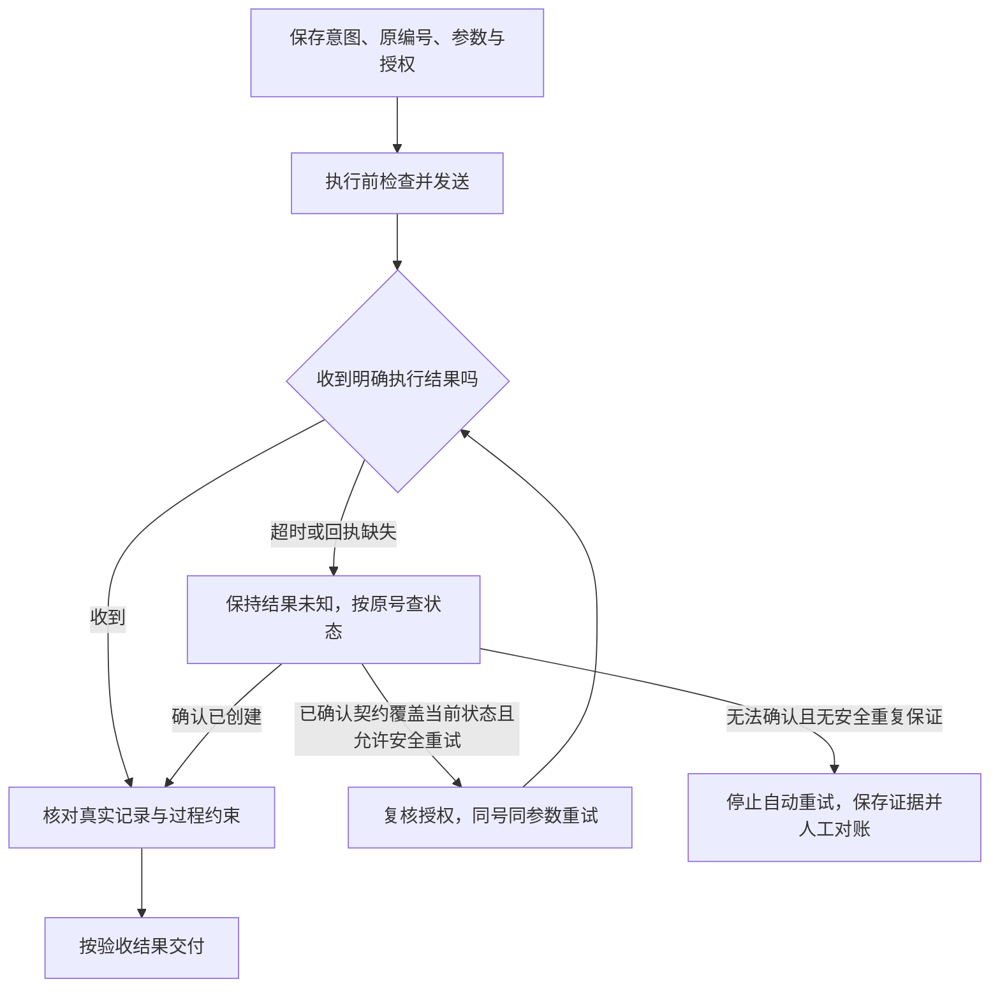

# Harness：把模型提议变成可授权、可验收、可恢复的动作

助手请求创建一条受理记录。服务端已经写入，成功回执却在途中丢失，客户端只看见超时。

如果助手把超时当成“没做成”，换一个编号再创建，就可能留下两条记录。若它恢复了发送前的聊天摘要，远端那一条也不会因此消失。

这种故障需要知道：谁允许动作，谁实施执行，怎样确认结果，以及结果未知时怎样恢复。

这是《AI学习目录》第八阶段的第 21 课，主题是 **Harness 负责把提议变成可信动作**。第 19 课区分请求与执行，第 20 课根据观测调整计划；本课把输入、授权、执行、验收和恢复的责任接起来。

读完后，你应能独立完成五件事：

1. 为输入组装、参数核验、授权、执行、独立验收和恢复安排明确责任。
2. 区分 Prompt 指导、执行权限与环境隔离。
3. 解释响应超时为什么不能证明未执行，并先查询真实状态。
4. 说明同一业务意图保留同一编号，还需要服务端实施去重契约。
5. 在状态不能确认且不能安全重复时，停止自动重试，保留证据并对账。

最低前置知识是：知道模型提出请求，应用或服务执行；知道任务完成要检查实际状态。下面会补齐授权和幂等的概念，不要求先学数据库事务或实现生产服务。

受理记录、`op-1`和故障时间线都是 **课程的人工教学设置**，不是真实订单或运行日志。本文没有创建记录、退款、外发信息或修改权限配置。

## 一、Harness 先看责任，再看组件名字

**Agent Harness** 可以理解为模型与真实执行之间的运行外壳。本文沿本库口径，把输入组织、工具控制、授权、执行、验证、状态与恢复纳入其中；不同资料对范围的划分不完全一致。

模型负责提出动作，Harness 中的应用、执行侧和检查逻辑负责控制与核验。它们可以由一个程序的不同部分承担，也可以分布在客户端与服务端。

| 环节 | 要回答的问题 | 本例中的责任 |
| --- | --- | --- |
| 输入组装 | 当前任务、条款、事实和约束是否进入请求？ | 应用准备目标订单、乙条款、创建范围和禁止事项 |
| 参数核验 | 结构、值与目标对象是否准确？ | 应用与服务执行侧核对申请、订单、状态、依据与操作意图 |
| 授权与权限 | 用户是否授权此动作，执行身份能否操作该资源？ | 执行前的放行逻辑核对当前授权和访问范围 |
| 实际执行 | 哪个程序真正写入？ | 本例服务端创建受理记录并处理去重 |
| 独立验收 | 实际结果是否满足目标且没有越权？ | 检查器读取可信当前状态与过程证据 |
| 恢复与停止 | 结果已知吗，是否可以继续或重试？ | 恢复逻辑对账，保留原意图；不具备安全条件则停止 |

**每项责任都要有实际承担者**。只接上工具、加一个模型或保存聊天历史，不能证明整条链已完成。[^职责边界]

“独立验收”关注标准与证据责任。检查器不能只接受执行者自述；不要求一定由第二个模型承担，也不因多一个模型就自动可信。

## 二、Prompt、执行权限与隔离控制什么

### 1. Prompt 指导模型怎样提议

提示词可以说明：“只读原始资料，不修改；只创建待受理记录，不退款。”这使模型了解任务边界。

但如果执行环境仍接受任意写入或退款请求，提示词没有把这些能力关掉。模型误解或受到资料干扰时，实际请求仍需在执行前检查。

课程的只读助手可以这样分工：模型可能提出读或写，执行侧只开放经授权的读取，并拒绝写入。读到结果之后，还要核对返回是否来自目标材料。

**提示词里的禁止，需要执行侧实施相应约束**，不能仅靠语气更强来形成权限边界。[^权限实例]

### 2. 授权与执行权限分别核对

授权说明用户允许这次做什么；执行权限说明当前身份和环境实际能访问哪些资源、操作哪些能力。

本例即使系统账户技术上能退款，用户也只授权建立待受理记录。反过来，用户表达了创建要求，执行侧仍须核对身份与资源权限。

工具 `description`写“只读”，只是在描述用途；实际实现是否只读、是否限制路径，仍要检查。MCP工具规范要求服务端校验输入并实施访问控制，客户端也需要检查结果。协议的要求不替实现自动生效。[^执行控制]

### 3. 信息隔离与执行环境隔离

| 方式 | 主要控制什么 | 不能单独保证什么 |
| --- | --- | --- |
| 分开子上下文 | 不同任务能看到哪些信息、历史和约束 | 子任务不能访问高权限资源 |
| 权限与资源约束 | 哪个身份可对什么目标做什么动作 | 整个执行环境都已隔离 |
| 沙箱等环境隔离 | 文件、进程、网络等执行能力的边界 | 业务动作已有授权，或结果一定正确 |

这些机制可以协作。指定目录、写一份计划或把任务放入子上下文，都不能自动变成沙箱。

## 三、先完成一次正常的授权与验收

### 1. 固定本次事实与规则

沿用课程主问题：2025-06-12申请，购买设备签收第10天，未拆封，有含订单号的电子凭证。签收当天计第0天。

本次适用乙：2025-05-20发布，2025-06-01起生效，明确替代甲的购买规则。

| 编号 | 教学原文 |
| --- | --- |
| 乙1 | 购买设备在签收后第 0—14 天、未拆封，可以申请退货。 |
| 乙2 | 凭证可以是纸质发票，或含订单号的电子凭证；聊天截图不属于上述凭证。 |
| 乙3 | 已拆封设备不能按乙1申请退货，只能转维修核验；转维修不代表已经批准退款。 |

这些事实与乙1、乙2支持申请条件满足，但 **业务动作的授权另行给定**：

```text
只为当前申请、目标订单创建一条“待受理”记录。
依据为乙1、乙2。
不授权批准退款、执行退款或外发信息。
```

记录沿用课程四字段：`申请编号`、`订单号`、`状态`、`依据条款`。本例没有实际申请和订单编号，执行时要从已核对输入取得准确值，不能补造。

### 2. 发送前保存业务意图与操作编号

课程为这一次受理意图定义业务操作编号 `op-1`。在发送前生成并持久保存它，同时保存目标参数与授权范围。

```text
操作编号：op-1
业务意图：为当前申请、目标订单建立一条待受理记录。
原参数：输入指定的申请编号、订单号；待受理；乙1、乙2。
授权边界：仅此创建；不批准、退款或外发。
发送前状态：准备提交，尚未发送。
```

这是业务操作记录的教学表示，不规定真实API必须使用同名JSON字段。`op-1`也不自动等于模型调用编号或协议请求编号。

编号必须在发送前保存，因为发送之后程序可能中断。若恢复时连原编号和参数都丢了，就难以区分“恢复同一次意图”和“发起另一次创建”。

### 3. 放行、执行，再验收

正常分支依次完成：

1. 应用组装事实、乙条款与任务约束。
2. 执行侧核对身份、目标资源、动作类型、参数及当前授权。
3. 服务端按照本课去重契约处理 `op-1`，创建记录。
4. 回执正常到达，客户端保存实际返回。
5. 检查器读取当前存储，核对一条正确的目标记录及过程约束。

结果检查包括申请编号、订单号匹配，状态为待受理，依据为乙1、乙2，关联记录恰好一条；过程检查包括没有未授权退款或外发。

只有这些证据通过，才可以交付“记录已建立并核验”。合法参数与成功回执都不能代替实际验收。

## 四、回执丢失：客户端不知道，不代表服务端没做

### 1. 把故障按时间展开

| 时点 | 客户端已知什么 | 服务端在本次模拟中实际发生什么 |
| --- | --- | --- |
| 发送前 | 已保存op-1、原参数和授权 | 尚未创建 |
| 请求到达 | 已发送，等待响应 | 接收请求，核对并执行 |
| 写入后 | 还没有收到成功回执 | 目标待受理记录已经创建 |
| 响应途中断开 | 只看到超时 | 创建结果仍在存储中 |

读者能看到完整教学时间线，客户端当时却只知道最后一行的左侧信息。

正确记录是“已发送，执行结果未确认”，而不是“已确认失败”或“已确认未执行”。**超时是通信观测，不是远端没有写入的证明**。

### 2. 先按原操作编号对账

“对账”在本课指把本地记录的意图、参数和发送情况，与远端实际操作结果核对。

客户端应保留 `op-1`，按已确定的查询接口及权限取得其当前状态。若服务端确认已创建，读取同一记录并验收，不再创建一条。

查询要能反映对应操作的真实状态。查询超时、范围不全或暂时没看到记录，不能未经核对就当成可靠的“未创建”。也不能根据编号含义猜一个查询接口。



图中的重试分支还必须遵守实际调用上限、服务契约和授权范围，不是无限循环许可。

## 五、幂等：保留编号，还要有服务端契约

### 1. 幂等关注重复的预期效果

**幂等**，Idempotency，关注多次相同请求的预期服务端效果是否等同一次。RFC 9110第9.2.2节采用这个语义，并说明通信失败后的自动重试需要有相应依据。[^幂等语义]

在本课“创建一条受理记录”的意图里，需要的效果是：同一次意图重复提交，仍对应原来那一条，不因重复而增加记录。

它不意味着服务器完全没有再次处理请求，也不保证每次响应字节相同。日志、响应说明等可以有差别，业务去重目标仍须实现。

### 2. 教学服务端必须实施什么

课程显式规定：

| 收到的操作 | 服务端契约 |
| --- | --- |
| 第一次op-1与原参数 | 执行一次受理创建，记录该操作与结果 |
| 同一个op-1、同一组参数 | 复用原业务结果，不再新增记录 |
| 同一个op-1、不同参数 | 拒绝，不能把另一动作塞进原编号 |

“复用原结果”表示关联同一受理结果，不要求重试响应与第一次完全相同。这里是教程设计的业务契约，不声称任意服务默认具备。

**客户端加一个编号，不等于服务端已经去重**。服务端需要真正识别、保存并执行这项约定，客户端还要知道它适用于当前操作和重试条件。

### 3. 换新编号为什么仍会重复

假设服务端已经按 `op-1`创建，客户端超时后给同一意图换了另一个新编号。

即使服务端保证“每个编号只执行一次”，新编号也会被当成另一项操作，于是同一业务意图可能产生两条记录。

应该跨重试保留同一编号与原参数。若订单、动作或其他业务参数要改变，应先核对原操作真实状态，再按新意图重新检查授权与唯一性；不能简单改参数继续使用旧号。

幂等只处理明确范围内的重复效果。它不证明动作本来合法，也不能抵消错误订单、错误依据或未授权退款。

## 六、五种证据下，下一步分别是什么

| 当前证据 | 下一步 | 仍需满足的条件 |
| --- | --- | --- |
| 明确成功回执 | 核对同一目标记录并验收 | 对象、状态、依据、唯一性与过程约束通过 |
| 已可靠确认未发送 | 在授权仍有效时发起原意图 | 重新核对参数与执行权限，保留原编号 |
| 发送后超时，结果未知 | 按原编号查状态，保存未知状态 | 不把超时或缺日志当成未执行 |
| 服务端确认已创建 | 读取并核验已存在的那一条 | 不再创建；确认它确为目标申请与订单 |
| 确认未创建，且服务契约支持安全重试 | 同编号、同参数重试 | 当前授权有效，处于契约与次数边界内 |

“确认未发送”需要可信的执行侧证据；仅仅没有看到工具日志，不足以证明请求没出发。

表中的“确认未创建且支持安全重试”是一种明确分支。结果未知时，若已核对的服务契约明确允许在这种状态下同号、同参数安全重复，也可以在授权与重试边界内处理；不能仅因编号相同就认定安全。应读实际契约，不把先查询理解成每次都必须查出确定未创建才有幂等意义。

如果服务端或查询结果仍不明确，也没有已确认的安全重复保证，就进入另一种处理：**停止自动重试，保留结果未知并人工对账**。

停止时至少保存：

```text
原业务意图、op-1、原参数。
授权范围与当前是否仍有效。
发送与超时证据、已取得的查询结果或查询失败。
当前未确认项：是否已创建，关联哪条记录，有无重复或其他副作用。
下一步：按实际服务规则由有权限者对账，确认后再决定修正或继续。
```

这不是把问题交给人猜测，而是留下能继续核对的现场。不能在停止时为了交付一句“完成”，把未知状态改成失败或成功。

若授权已变更或撤销，即使服务支持幂等，也不能据旧授权继续写入。查询和修正也应在其各自权限与授权范围内进行。

## 七、本地恢复与远端副作用分别核对

假设客户端恢复到发送前的聊天摘要或本地检查点，摘要写着“尚未创建”。服务端却已经有 `op-1`的记录。

恢复本地状态不会撤销远端写入。继续运行前，要恢复原意图和编号，并与服务端对账，不能重新生成一个编号，把旧动作当成没发生。

| 恢复对象 | 可以帮助恢复什么 | 不能单独证明什么 |
| --- | --- | --- |
| 聊天摘要与进度 | 目标、约束、已知与待办 | 当前服务端是否已经执行 |
| 本地文件或环境检查点 | 本地运行现场 | 远端记录、退款或外发已被撤回 |
| 操作记录与服务端查询 | 同一意图的实际结果与关联 | 所有副作用都已正确修复 |

恢复不是自动回滚。若已经重复创建或出现越权，需要确认真实影响、修正权限和操作结果；不能随意删除记录、退款或宣称“已恢复”。本课只建立对账原则，具体补偿和服务实现放在进一步选读。

## 八、动手填一张责任与恢复卡

沿本课正常任务，分别写：

1. 谁准备事实、乙条款与工具契约？
2. 谁在执行前核对目标、权限与当前授权？
3. 谁保存op-1与原参数，谁在服务端实施去重？
4. 谁读取真实记录，按什么标准验收？
5. 回执丢失后，谁查询、何时可以重试、何时必须停止？

再代入“已存在”“确实未发送”“查询失败且无安全重复保证”三个状态，检查下一步有没有扩大授权或制造重复。

不要为完成这张卡编造服务API名称、请求字段或路径。已有实现怎么查询、去重与验证，应从它的契约和运行资料取得。

## 九、合上正文，独立完成五道检查

可以保留第三节规则与任务约定，先不要看答案。

### 第 1 题：安排运行责任

为目标订单建立一条待受理记录，列出输入组装、参数核验、授权、执行、独立验收和恢复的承担者与产物。

模型给出合法参数，能否直接宣布动作可信？检查器为什么不能只相信执行者的“已完成”？

### 第 2 题：提示与权限各管什么

一个助手的Prompt和工具description都写“只读”，但执行实现仍接受任意写入。有人认为“换成独立子上下文，就已有硬权限和沙箱”。

指出三项混淆，并给出应分别实施的控制。账户技术上能退款，是否表示用户授权了退款？

### 第 3 题：超时后的知识状态

客户端已保存op-1并发送，服务端写入正确记录，回执丢失；客户端只收到超时。

分别写出客户端当时知道什么、服务端实际发生什么，以及客户端应采用的下一步。若查询确认已存在，应再创建吗？若有可靠证据确认请求根本未发送，又应怎样处理？

### 第 4 题：同一意图与编号

服务端规定每个编号最多执行一次。客户端为同一业务意图每次重试都生成新编号。

是否防止重复受理？怎样修正？若沿用op-1，却把订单参数换成另一个订单，应如何处理？同号重试能否只靠客户端添加JSON字段完成？

### 第 5 题：无法确认时怎样恢复

请求已发送但结果未知，查询也失败，服务端没有已确认的安全重复保证。客户端恢复了发送前摘要，准备重新编号再发。

写出正确处理与需要保存的证据。恢复本地摘要是否撤销远端操作？“停止自动重试”是否等于已经确认执行失败？

## 十、参考答案与过关点

### 第 1 题答案：每个环节都有责任与证据

应用组装任务、事实与乙依据；应用和服务执行侧检查参数；放行逻辑核对身份、资源与当前授权；服务端执行并去重；检查器读取状态与动作证据验收；恢复逻辑查询、对账并判断继续或停止。

产物包括完整输入、校验与授权结论、发送前操作记录、实际请求和返回、目标存储与副作用证据、验收结果，以及未确认项和恢复决定。

合法参数只证明符合相应契约。可信动作还须通过授权、真实执行与验收。自述不能代替状态查询，第二个模型也不能凭同一自述自动获得可靠依据。

**过关点**：为六类责任安排承担者与可核对产物，分开提议、放行、执行和验收。答错回读第一、第三节。

### 第 2 题答案：用途说明不实施限制

Prompt指导模型；description描述工具；独立子上下文主要隔离信息。它们不能单独证明写入受阻、访问范围已收紧或环境已沙箱化。

应在执行侧核对动作类型、身份、目标资源与权限，实际限制允许的路径和能力；按需要实施环境隔离，再核对返回与真实结果。具体实现须回读当前系统规则，不能只换提示词。

账户能够退款不代表用户授权退款。本题只允许待受理创建，退款仍越权。

**过关点**：区分指导、描述、授权、执行权限和隔离，不把某一项代替全部。答错回读第二节。

### 第 3 题答案：远端已写入，客户端仍未知

客户端知道op-1已发送且未取得成功响应，不知道是否执行完成；服务端在教学时间线中确实已创建。

客户端应按原号查真实状态，保留结果未知，不能直接当失败重建。查询确认已存在后读取并验收同一记录，不再创建；核对订单、状态、依据、唯一性与有无越权。

若有可靠证据确认未发送，在当前授权仍有效、参数与权限通过时，可发起原意图并保留原编号。缺日志不能冒充这种证据。

**过关点**：区分客户端知识与实际环境，按证据选择下一步。答错回读第四、第六节。

### 第 4 题答案：每个新编号一次，仍可能多次业务效果

不能防止。同一意图每次换号，服务端会当成不同操作，仍可能形成多条记录。

应跨重试保留同一业务操作编号与原参数，并确认服务端真正实施适用的去重契约。op-1改成另一订单参数应被本课契约拒绝；先查原操作状态，再按新意图重新检查授权与目标，不能偷偷替换。

客户端仅添加字段没有去重效果保证。同号也不保证每次响应完全相同；需要保证的是契约范围内的预期业务效果与原结果关联。

**过关点**：把业务意图、参数、编号和服务端实施联系起来，不以JSON形状证明幂等。答错回读第五节。

### 第 5 题答案：停止自动重试，保留未知并对账

不重新编号、不自动再次创建。保存原意图、op-1、原参数、授权、发送与超时、查询失败和未确认项，交由有权限者按实际服务规则对账。

本地摘要恢复不会撤销远端副作用，也不能证明远端未执行。停止只表示当前不能安全自动继续，执行结果仍未知；不能改写成已经失败或已回滚。

后续取得真实状态和安全继续条件后，再按授权决定如何处理，不能先制造另一次写入。

**过关点**：保留未知状态、证据与原意图，分开本地恢复、远端结果和动作授权。答错回读第六、第七节。

能独立完成五题并解释理由，才说明你能安排运行责任、保持执行边界并处理不确定结果。看完文章或一次重试没有重复，不证明系统已经可靠。

## 十一、可选进阶：怎样回查真实实现

### 1. RFC语义与业务去重契约分开

RFC 9110第9.2.2节说明HTTP幂等方法的预期效果，以及非幂等方法的自动重试限制：需要知道请求语义实际可安全重复，或能够确认原请求未被应用。[^幂等语义]

本课的op-1契约是应用层业务设计。不能因某个请求被称为创建、某段JSON有编号，或把HTTP方法改名，就断言实际服务已经幂等。

具体接入应确认：编号的有效范围、参数一致性判断、重复与进行中请求怎么处理、结果怎样查询，以及哪些条件允许重试。本文不补造统一有效时长或接口字段。

### 2. 接口配对编号与业务意图编号

模型调用编号帮助请求与工具结果配对；协议请求编号帮助客户端与服务响应配对；业务操作编号帮助跨通信重试识别同一意图。

这些职责相关，但不是自动同一编号。恢复同一业务操作时，即使外层发生新一轮请求，也要按实际契约保持原意图与参数关联，不能只看到一条新的模型请求就发起新的业务创建。

### 3. 权限示例只支持对应版本的判断

《Claude Code权限系统Permission是如何工作的》提供了模型提出动作、客户端执行前检查的实例；其模式和优先级属于该资料讲解范围，没有完整源码版本证据。[^权限实例]

本文不把其中具体配置、模式切换或匹配规则写成所有版本的通用设置。需要实际配置时，先读取当前系统文档与配置，再验证允许、拒绝、目标资源和失败路径。

## 十二、下一课：哪些状态值得保存，哪些必须重新查询

超时对账已经暴露一个问题：聊天记住“尚未创建”，服务端却可能已经写入。保存一段摘要不足以解释当前真实状态。

第22课“记忆、世界模型与环境状态”会继续拆分消息、经验、判断与环境。先保留本课的恢复习惯：记录意图与证据，真实副作用重新对账，无法安全重复时停止。

## 十三、依据与回查

课号、五项目标、op-1故障、同号同参数复用／同号异参数拒绝的教学契约来自《AI学习目录》与《32课学习设计与掌握目标》。责任口径参考《驾驭工程：模型之外的Agent Harness》；课程与综合页没有公开网址，因此只列文字标题。

| 公开资料 | 本文采用的支持范围 |
| --- | --- |
| [RFC 9110：HTTP Semantics，第9.2.2节](https://www.rfc-editor.org/rfc/rfc9110.html#section-9.2.2) | 幂等关注预期服务端效果；响应可以不同；自动重试须有相应依据 |
| [MCP：Tools，2025-06-18固定版](https://modelcontextprotocol.io/specification/2025-06-18/server/tools) | 执行侧输入校验、访问控制与客户端结果检查责任 |
| [提示词工程 上下文工程 Harness工程 是什么？](https://www.bilibili.com/video/BV1B6DiBbEf8) | Prompt／Context／Harness的职责与工作流、权限、质量检查整理依据 |
| [Claude Code权限系统Permission是如何工作的](https://www.bilibili.com/video/BV19AEq66Epq) | 模型提议与本地执行前检查的历史实例，不作为当前全部版本配置保证 |

本文完整读取相关综合页及职责、权限整理资料，并核对RFC与MCP固定版本的相关部分。乙条款、授权范围、五种证据处理、同号／换号／异参数与恢复分支、五题答案和本地Markdown渲染已检查。

未重新核对完整视频、配置真实权限、连接业务服务、测试服务端去重或恢复、开展新手试读，也未验证实际发布平台。教学自检不代表真实服务已具备安全重试能力，掌握以独立作答为准。

[^职责边界]: [提示词工程 上下文工程 Harness工程 是什么？](https://www.bilibili.com/video/BV1B6DiBbEf8)。本文采用本库运行职责整理，不把它当作统一行业定义。
[^权限实例]: [Claude Code权限系统Permission是如何工作的](https://www.bilibili.com/video/BV19AEq66Epq)。参考模型与客户端职责；没有将历史模式细节作为当前实现断言。
[^执行控制]: [MCP：Tools，2025-06-18](https://modelcontextprotocol.io/specification/2025-06-18/server/tools)，Security Considerations部分。规范要求需由具体系统实施，连接成功不证明已经满足。
[^幂等语义]: [RFC 9110，第9.2.2节Idempotent Methods](https://www.rfc-editor.org/rfc/rfc9110.html#section-9.2.2)。op-1及业务去重条款另由课程显式设计，不是RFC规定的通用API字段。
