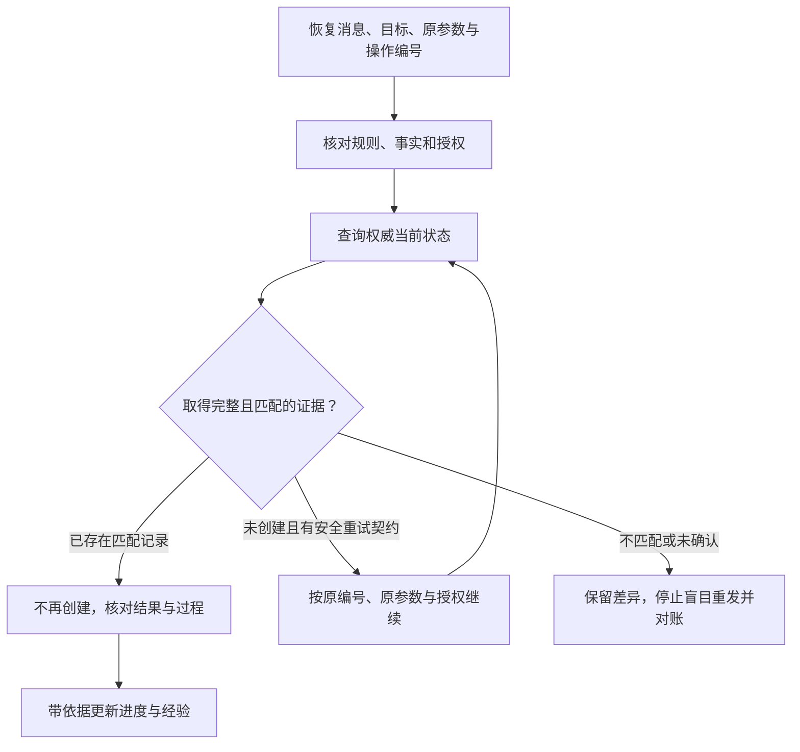

# 记忆、世界模型与环境状态：恢复以后，先核对真实世界

一个Agent中断后恢复了聊天摘要，摘要写着：“受理记录尚未创建，下一步创建。”它准备继续执行，却发现服务端已经有了操作编号op-1对应的记录。

这时该照着摘要再建一次，还是先核对已经存在的那条记录？再换一个问题：记忆里说“上次电子凭证能用”，现在用户给的是聊天截图，这条经验还能直接拿来决定吗？

两个问题都与“记住了”有关，但保存的是不同东西。消息帮助接续任务，经验提示历史上怎样做过，行动模型预测下一步可能发生什么，环境状态说明实际世界已经变成什么样。恢复其中一种，不能代表其余几种都恢复了。

本文对应《AI学习目录》第八阶段第22课“记忆、世界模型与环境状态”。最低前置知识是：知道回答需要依据，知道工具动作可能改变外部存储。本篇会补齐交接、超时与实际状态的概念，不要求安装Agent框架。

读完后，你应能独立完成五件事：

1. 分别举出消息、经验、判断／行动模型和环境状态。
2. 给旧经验注明版本、来源、适用条件及失效检查。
3. 区分预测会发生与实际已经发生。
4. 摘要与权威存储冲突时，核对目标、操作编号与实际状态，再决定下一步。
5. 解释记忆效用更新为什么不自动等于模型参数更新。

甲乙丙规则、申请场景、op-1以及本文状态卡都是教学设置，不是实际制度、订单服务或模型成绩。本文演示核对过程，没有执行创建、退款或真实环境恢复。

## 一、先给这次任务一个完整背景

我们沿用课程的设备申请案例：2025-06-12申请，购买设备签收第10天，未拆封，有含订单号的电子凭证。签收当天计第0天，按申请日期选择规则。

| 材料 | 发布与生效信息 | 范围 |
| --- | --- | --- |
| 甲 | 2024-12-20发布；2025-01-01至2025-05-31生效 | 旧版购买退货 |
| 乙 | 2025-05-20发布；2025-06-01起生效，明确替代甲的购买规则 | 新版购买退货 |
| 丙 | 2025-06-10发布并生效 | 租用归还，不修改乙 |

完整教学条款如下：

| 条款 | 教学原文 |
| --- | --- |
| 甲1 | 购买设备在签收后第 0—7 天、未拆封，可以申请退货。 |
| 甲2 | 需要纸质发票；电子订单截图不能代替纸质发票。 |
| 乙1 | 购买设备在签收后第 0—14 天、未拆封，可以申请退货。 |
| 乙2 | 凭证可以是纸质发票，或含订单号的电子凭证；聊天截图不属于上述凭证。 |
| 乙3 | 已拆封设备不能按乙1申请退货，只能转维修核验；转维修不代表已经批准退款。 |
| 丙1 | 租用设备应在签收后第 0—30 天归还。 |
| 丙2 | 本规则不适用于购买设备退货，也不修改乙的购买规则。 |

主问题适用乙。第10天且未拆封满足乙1，含订单号电子凭证满足乙2，可以判断符合展示的申请条件。这不表示已批准或已退款。

接着加入本课所承接的明确教学授权：为当前申请、目标订单创建一条“待受理”记录，不授权退款或外发。创建授权来自任务要求，不能从“政策允许申请”自动推导出来。

课程没有给出真实申请编号和订单号，因此本文用“当前申请”“目标订单”指代输入指定的值。真实任务必须从输入或已核对记录读取准确值；op-1是课程明确给出的操作编号，不是本篇猜出的接口参数。

至此，我们有了事实、规则、目标和动作边界。看看它们分别会被保存在哪里。

## 二、把四种状态放进四个不同的盒子

“记忆”在日常交流中很宽泛。为了判断保存和恢复的责任，本课将它拆成四类：

| 状态 | 本案例中的内容 | 它帮助回答什么 | 不能单独证明什么 |
| --- | --- | --- | --- |
| 消息状态 | 用户事实、已读乙1乙2、待办与聊天摘要 | 当前任务说过什么，接下来准备核对什么 | 服务端已经执行到哪一步 |
| 经验记忆 | “上次电子凭证申请成功过”及当时轨迹、条件、反馈 | 过去怎样处理，有什么值得参考 | 当前版本也适用，或当前动作已完成 |
| 判断／行动模型 | “创建动作应产生一条待受理记录” | 当前对象有哪些，动作可能改变什么，怎样解释反馈 | 预测已经在环境中发生 |
| 环境状态 | 当前存储、文件、进程、未完成请求与远端记录 | 实际世界现在是什么状态 | 保存一段摘要就能自动恢复或撤销这些状态 |

四个盒子是职责分类，不是规定每个产品必须建四张表。一个文件可能记录多类内容，但每项内容仍应保留身份和证据用途。

### 消息状态：恢复任务信息

摘要可以写成：

```text
目标：当前申请的一条待受理记录，不授权退款或外发。
申请事实：2025-06-12购买申请，第10天，未拆封，电子凭证含订单号。
已读依据：乙1、乙2及生效说明。
本地进度：摘要记为“尚未创建”。
已保存操作编号：op-1。
恢复后待办：先核对op-1的实际执行状态。
```

前几项保住了任务条件与限制，最后两项给后续核对留下入口。“尚未创建”仍只是摘要中保存的本地进度，必须与实际状态对账，不能当成远端未写入的证明。

如果摘要删掉“未拆封”或“含订单号”，就连任务信息也没有保全。短不短是一回事，能否继续正确核对是另一回事。

### 经验记忆：恢复过去的做法与反馈

“上次电子凭证成功过”比当前消息多了一层历史经验。它可能提示我们去查乙2，却没有说明当时日期、对象、凭证内容及“成功”到底指什么。

过去核对通过、过去建了待受理记录、过去批准退款，是不同状态。旧经验若只存“成功”，复用时需要回查历史证据，不能自行把它解释成最强的结果。

### 环境状态：核对现在的世界

存储中的记录、运行进程与已发出的远端请求不会因为聊天摘要变回旧版本，就跟着回到旧状态。上次读取文件成功，而文件现在已迁移，也需要核对当前文件位置和内容，不能照旧经验宣称已读到它。

消息记录可以描述环境观察，环境查询结果也可以写入历史。分类看的是来源与用途：旧消息里的观察有自己的时间点，当前完整查询取得的结果才能支持当前状态判断。

剩下的判断／行动模型，值得单独展开，因为它最容易和实际结果混在一起。

## 三、世界模型表达“怎样变化”，预测仍要接受反馈

本文沿用课程的宽泛工程口径：**世界模型是服务于行动的、选择性的状态与关系表示**。它保留当前关键对象、动作与预期变化，帮助决定下一步；这不是所有研究对World Model的统一定义。[^世界模型]

对本例，不需要完整模拟业务系统，先表达三项关系就很有帮助：

| 当前信息与动作 | 预期关系 | 必须检查的反馈 |
| --- | --- | --- |
| 当前申请无记录，创建参数正确且已获授权 | 创建成功应使目标申请有一条待受理记录 | 实际存储是否出现匹配记录 |
| 请求发送后超时 | 可能未执行，也可能已执行而回执丢失 | 按原操作编号查询当前结果 |
| 摘要恢复为尚未创建 | 本地进度可能落后于远端 | 目标、编号、实际状态是否一致 |

第一行中的“应”表示预期，不能提前写成“已”。第二行保留了两种可能，避免形成“超时必然没写入”的错误关系。

一个错误的行动模型可能是：

```text
请求超时 → 记录不存在 → 再创建即可。
```

它把没有收到回执，当成了没有发生动作。如果服务端已经写入，重发可能制造重复记录。消息里保留了正确规则，也不能保证Agent当前采用的这条关系正确。

更有依据的判断过程是：

```text
请求超时 → 当前执行状态未确认 → 查询原操作 → 依据实际结果决定下一步。
```

这里记录了目标相关的对象、失败后需要恢复的入口，以及可核验的变化。规则明确时，一张这样的关系表或小检查器就能表达部分行动约束，不必为理解本课先训练学习型模拟器。它仍会受规则与环境变化影响，不能当作环境真理。[^世界模型]

**预测、调用回执和实际状态是三种不同证据**。预测说明可能怎样变，回执说明调用方收到什么，当前权威状态说明实际已发生什么。三者对不上时，要调查差异。

## 四、旧经验怎样写，才能看出什么时候不该用

先看一句过度概括的经验：

> 电子凭证能用，下次直接申请。

它至少漏了规则版本、购买对象、订单号、拆封、期限与授权。把它检索出来，并没有补齐当前判断。

旧经验应分别记录规则依据与历史结果证据。当前教材给出了乙条款，却没有提供那次历史任务的真实轨迹与核验时间，因此我们只能先建立一张有边界、仍含待核验项的卡：

| 记录项 | 本例应保留的内容 |
| --- | --- |
| 经验的主题 | 购买申请中的电子凭证核对，不能泛化为任意设备处理 |
| 本次回查的规则版本 | 乙，自2025-06-01起生效，明确替代甲的购买规则；旧任务当时采用的版本待核对 |
| 规则来源与定位 | 当前可回查乙1、乙2及生效说明；旧经验实际来源和历史轨迹位置未提供，待补 |
| 当前可核对的条件 | 乙适用，第0—14天，未拆封；电子凭证必须含订单号 |
| 历史成功证据 | “上次成功”需回查原任务、实际结果及验收记录；本题没有这些原件，不标成已验证 |
| 历史记录时间 | 本题未提供，待补；申请日期不能冒充核验时间 |
| 失效或重新核验条件 | 规则版本、对象、申请日期、拆封、凭证或权限变化；原记录无法核验时停止直接复用 |
| 使用方式 | 提示回查对应条款，与当前事实重新对照；不替代创建授权与状态查询 |

这张卡已经对照了当前规则，却没有证明旧任务当时采用乙，也没有证明过去任务真的成功。真实记录应从原轨迹补齐准确版本、位置、时间和结果；缺项就保留缺项，不能给经验补造一套历史。

继续用三个明确变式检查经验的范围：

1. 申请日期改为2025-05-25，购买设备第5天、未拆封、只有含订单号电子凭证，没有纸质发票。乙尚未生效，按甲1、甲2核对；期限与拆封合格，但凭证要求不满足。
2. 仍在2025-06-12，第10天、未拆封，只提供聊天截图。乙适用，乙2明确排除截图，过去的电子凭证经验不能把它变成合格凭证。
3. 仍在乙适用范围，其他条件满足，只说“有电子凭证”，没有说明订单号。应补核订单号，不能由过去成功推测这次也有。

这三种情况分别暴露版本变化、已知否定条件和未知必要事实。能写出是哪一项阻止复用，比笼统说“经验可能过期”更有用。

原始条款是规则来源，经验卡是派生记录，当前行动判断是结合本次事实的结果。前面讲过的LLM Wiki可以长期维护规则与综合结论，经验记忆则更关注具体任务怎样执行和获得什么反馈；两者可以配合，不能把派生页或过去成功当成额外授权。

## 五、摘要与服务端冲突时，先对账，再继续

### 1. 先看中断可能发生在什么位置

本例沿用第21课的操作编号op-1。课程约定：同一受理意图在发送前保存操作编号和原参数；是否可以安全重复，还取决于服务端是否实现同编号、同参数去重的契约。

下面是明确的教学事件顺序：

1. 客户端持久记录当前目标、原参数和操作编号op-1。
2. 请求发送，服务端创建了一条目标申请的待受理记录。
3. 成功回执在途中丢失，客户端没有确认写入，随后中断。
4. 恢复的旧摘要仍写“尚未创建”。

这是一种可能导致差异的事件顺序。只知道摘要与存储不一致时，不能直接断言现实故障必然按此顺序发生；还要读取实际发送、返回与写入记录。

恢复摘要不会撤销第2步，也不会让远端记录重新变成不存在。即使恢复本地环境快照，远程副作用也需要独立对账，不能假定一并回滚。

### 2. 按目标与原编号取得实际证据

合理的恢复顺序是：

1. 读取已保存的目标、授权、原参数与操作编号op-1，确认不是另一项业务意图。
2. 核对规则版本和当前申请事实，保留未拆封、订单号与禁止退款、外发的边界。
3. 按原操作编号及目标查询权威当前状态，确认查询成功且范围完整。
4. 核对该记录是否属于当前申请和目标订单，状态是否为待受理，依据是否为乙1、乙2，关联数量是否为一。
5. 根据实际证据更新当前进度，转入验收；同时保留原摘要、差异与调查记录。

这里的“以服务端为准”指与本次目标、原编号和参数对应的权威实际结果，不是看见任何一条服务端记录就通过。若查询返回的是另一订单，仍然不能认定本次目标完成。

记录内容通过后，还要核对动作与相关副作用，确认没有越权退款或外发。只有这些必要证据齐全，才可以完成整体验收。

### 3. 把不同查询结果分开处理

| 当前取得的证据 | 应怎样处理 |
| --- | --- |
| op-1对应一条匹配的待受理记录 | 不再创建；核对唯一性、依据与授权，补齐验收并更新进度 |
| 有记录，但目标订单或操作对应关系不匹配 | 保留冲突，继续对账；不能把存在记录当作正确完成 |
| 当前申请出现两条记录 | 唯一性失败，保存重复证据，停止继续创建并按授权处理 |
| 服务端确认未创建，且支持相同编号、相同参数安全重试 | 在授权仍有效时按原契约继续，不能换编号另起一次 |
| 查询失败、结果不完整或操作仍未确认 | 标记待核验；没有安全重复保证时停止自动重发，交由进一步对账 |

同一个字符串op-1只有在服务端真正实施去重契约时，才有对应的安全重复效果。不能仅因为本地保存了编号，就假定重试不会重复。

**确认没有记录与没有取得查询结果不同**。查询失败时，不能把未知状态写成未发生，再让下一轮根据这个“事实”重新创建。

恢复后的当前进度可以改为“已按op-1确认一条目标待受理记录，后续验收项如下”，同时保留旧摘要与更新依据。需要保留的是历史发生过什么，而不是让过期的当前进度继续指导动作。



这张图强调的是恢复责任，不是某个产品的固定接口。恢复不只要能读回文本，还要让后续决定与实际世界重新对齐。

## 六、记忆效用更新，为什么不自动等于参数训练

模型参数是训练所得、参与模型计算的权重。外部记忆则可以是保存于模型之外的经验文本、结果记录及检索评分。改变外部记录，改变的是系统下一次读取什么；这不自动说明模型权重被训练过。

MemRL提供了一个具体研究例子。其v2论文将冻结的语言模型与可更新的情景记忆分开，用任务意图、经验与效用组织记录，通过环境反馈调整记忆选择。论文将这种经验效用称为Q-value，用来估计经验的预期用途，而不是只按文本相似选择。[^记忆学习]

可以顺着数据流理解：

```text
当前任务 → 找相关经验 → 结合已学到的效用选择 → 放入当前输入
         → 冻结的语言模型生成行动 → 环境反馈 → 更新外部经验效用
```

这里的Q-value是某条经验的效用估计。它可以变化，但变化对象是外部记忆的使用信息；MemRL这条路径不通过更新语言模型权重来学习。

因此，同样的模型参数也可能因读到不同经验而产生不同输出。下一次表现变化，不能单凭这一现象推出做了微调；要检查到底更新了外部文本、效用、检索逻辑，还是模型权重。

**高历史效用不是当前事实或执行权限的证明**。某条电子凭证经验过去有用，到了甲适用日期或聊天截图场景仍可能不适用。若环境反馈本身误把“助手说完成”当成成功，还可能强化错误经验，反馈质量需要独立检查。

本课只借MemRL说明这项分工，不把它泛化成所有记忆系统都冻结参数，也不把“有记忆”视为所有学习都已解决。具体系统可以同时采用记忆更新与参数训练，要看实际机制。

保存更多经验也不等于无限上下文。模型本次真正读取的内容仍有限，选择、来源、时效和验证状态需要继续管理。

## 七、基础检查：先独立写出判断

可以保留第一节条款及教学授权，先不要读下一节答案。

### 题1：把四张状态卡分类

判断以下内容主要属于哪一类，并说明它能支持什么、还不能证明什么：

- 卡A：“已读乙1、乙2；下一步查询op-1。”
- 卡B：“上次使用电子凭证成功过，下次可能有参考价值。”
- 卡C：“创建成功应产生一条待受理记录；超时可能是回执丢失。”
- 卡D：“权威当前查询成功，op-1对应目标申请的一条待受理记录。”

如果只有卡A恢复，能否说进程、文件和远端操作都已恢复到同一时点？

### 题2：给旧经验加上来源与失效检查

已有一句经验：“电子凭证能用。”请根据教学材料，写出使用它前需要保存或补核的版本、来源、条件与历史证据。

再分别处理三个变化：2025-05-25第5天、未拆封、无纸质发票而只有含订单号电子凭证；2025-06-12第10天、未拆封、聊天截图；2025-06-12第10天、未拆封、电子凭证订单号未知。

未给出的历史核验时间和轨迹位置，应怎样记录？

### 题3：预测能否代替实际状态

行动模型写着“创建成功应有一条待受理记录”，客户端发送请求后只取得超时，尚未查询服务端。

能否认定已经创建？能否认定没有创建？分别指出预期、收到的反馈与仍缺少的证据，写出合理下一步。

### 题4：摘要与存储不一致时恢复

旧摘要说尚未创建。成功且完整的权威查询显示op-1已有一条记录，属于当前申请与目标订单，状态为待受理，依据为乙1、乙2。

应怎样继续、补查什么、怎样更新进度？若查询返回另一订单，或查询超时未取得结果，分别怎样处理？同编号本身是否足以保证重试安全？

### 题5：更新对象是什么

一个按MemRL思路工作的教学系统冻结语言模型权重。运行之后，环境反馈改变某条经验的Q-value，下一轮因此选择了不同经验放入输入，答案也不同了。

能否说模型参数已经更新？变化发生在哪一层？若高效用经验依赖旧规则，或成功反馈未经实际状态核验，还需要检查什么？

## 八、参考答案与过关点

### 题1答案

卡A主要是消息状态，支持接续待办及已读材料，不证明服务端结果。卡B是经验记忆，需要补核当时条件与成功证据。卡C是判断／行动模型，表达预期与反馈的可能解释，不证明已写入。卡D是环境观察取得的当前状态证据，支持本次目标记录存在；整体验收仍要核对授权与相关副作用。

只恢复卡A不能恢复或撤销其他状态。进程、文件及远端操作分别有自己的保存、恢复与核验责任。

**过关点**：能按职责分类并说出证据范围，不以“都写在文本里”把四类混成同一种记忆。答错回读第二、第三节。

### 题2答案

先记录经验主题和规则版本：若对应乙，乙自2025-06-01起适用于购买退货，来源定位乙1、乙2及生效说明。保留第0—14天、未拆封、电子凭证含订单号和聊天截图被排除等条件。历史上是否真的成功，还需要原任务、实际结果、验收证据及时间，不能用当前条款证明过去动作发生。

失效检查包括规则与日期、对象、期限、拆封、凭证、权限和当前环境变化。经验可以提示回查，不能直接批准或执行。

三个变化分别为：

- 2025-05-25仍适用甲。第5天、未拆封符合甲1，但无纸质发票不符合甲2；乙未生效。
- 聊天截图被乙2明确排除，不能复用为合格电子凭证。
- 订单号未知，尚不能确认电子凭证满足乙2，需补核这项事实。

未给出的时间与轨迹位置写“未提供／待核对”，不补造；申请日期不等于核验时间。

**过关点**：能写出版本、精确来源和会阻止复用的条件，区分已知不满足与信息未知。答错回读第一、第四节。

### 题3答案

不能认定已经创建，也不能认定没有创建。“应有一条”是动作预期，超时是当前收到的反馈，缺的是与目标及原操作编号对应的权威实际状态。

保留原编号与原参数，先查询实际结果；不要换编号盲目重发。如果状态无法确认又没有安全重复契约，停止自动重发并继续对账。

**过关点**：把预测、调用反馈和实际证据分开，不用超时推出未发生。答错回读第三、第五节。

### 题4答案

已确认目标记录存在，不再创建，转入验收。核对目标、原操作编号与原参数对应关系、状态、依据和数量，再补齐动作轨迹与相关副作用检查，确认没有退款或外发等越权。

以查询依据更新当前进度，保留原摘要、差异和检查记录。不能从“记录正确”直接断言所有过程约束均通过。

另一订单的结果不能证明本次任务完成，应保留目标不匹配并继续对账。查询超时表示状态未确认，不能把未知写成无记录。相同编号只有在服务端实施相同编号、相同参数去重契约时才有相应效果；当前授权也必须有效。

**过关点**：先对齐目标与操作，再检查实际状态和授权；区分匹配、冲突及未确认，避免机械照摘要重发。答错回读第五节。

### 题5答案

不能。在给定机制中，语言模型权重冻结，更新的是外部经验效用，进而改变下一轮经验选择与输入。输出不同不构成权重更新的证据。

高效用经验仍需核对版本、来源和当前条件；反馈须由实际结果及验收标准支持。错误奖励可能强化错误经验，旧经验也可能在新规则下失效。

这个结论针对题目明确给定的机制。其他系统可能同时更新外部记忆与参数，仍要分别查看实际更新对象。

**过关点**：能指出学习发生在哪里，并保留反馈与时效限制，不把Q-value变化叫作模型权重变化。答错回读第六节。

能独立完成五题并解释理由，才说明你能把四类状态分开，管理旧经验，并依据真实状态恢复任务。阅读完成或见过一次成功，不自动等于掌握。

## 九、可选进阶：会话检查点与跨会话存储也有不同职责

LangGraph的持久化文档区分两种系统：checkpointer保存一个会话线程的图状态检查点，用于接续与恢复；store保存图状态之外、由应用定义的跨线程数据，用于长期事实、偏好与共享知识。这里的“图状态”是应用执行状态，不等于把所有外部系统都做了快照。[^持久状态]

| 保存机制 | 主要保存什么 | 需要另查什么 |
| --- | --- | --- |
| 会话检查点 | 本会话执行状态及接续信息 | 所用实现是否持久化，能否按原会话恢复 |
| 跨会话存储 | 应用定义的长期数据与知识 | 后端保存介质、来源治理、时效及访问范围 |
| 外部系统自己的状态 | 文件、进程、数据库与远端动作 | 独立恢复能力、当前实际状态及远端副作用 |

会话作用域与保存介质是两条不同维度。名叫“检查点”不代表已经落盘，名叫“长期存储”也不免除对实际实现的检查。

该文档明确说明MemorySaver和InMemorySaver将检查点保存在进程内存，进程重启会丢失。这里能确认的是这些实现的行为，不能概括为所有检查点都会丢失，也不能因为采用了框架就宣称重启恢复已经验证。

这个区别接回op-1：如果原编号只存在已经丢失的进程内状态里，恢复后就不能假装还知道它，或临时生成新编号代表原意图。需要通过已有可信记录和服务端关联信息对账；对不上时保留未知与接管入口。

本课不要求安装LangGraph、选择数据库或实现检查点。先弄清保存对象、作用域和真实恢复边界，才有依据做后续实现选择。

## 十、下一步：让跨轮接续依赖可信状态

这一课把“记住了”拆成了消息、经验、判断与环境：消息保任务，经验保条件与反馈，行动模型保可检验的关系，实际环境则需要独立查询与恢复。它们重新对齐之后，下一步才有可靠起点。

第23课“长期Loop：谁来触发下一轮”会继续讨论在一次执行结束或中断后，系统怎样根据持久状态触发、验收并接续。无论触发方式如何，都要保留本课的原则：先核对真实状态，再决定继续，旧经验与预测不替代实际证据。

## 依据与回查

五项掌握目标、四类状态、甲乙丙、op-1及恢复顺序来自《AI学习目录》与《32课学习设计与掌握目标》第22课；授权、受理记录及去重契约承接第18、21课的教学设置。状态卡、缺项记录与迁移题沿既有规则展开，不是实际运行材料。本文按《AI学习博客编写规范》组织，课程与规范目前以文字标题说明出处。

[^世界模型]: 唐国梁Tommy，[Agent世界模型原始讲解](https://www.bilibili.com/video/BV1AmNH6EENf)，2026-07-10。对应完整整理资料已读取，采用其服务于行动的选择性压缩、环境／判断／知识分工与时效说明；此处是来源的宽泛工程口径，不把文中其他研究或成绩当作已复现事实。
[^记忆学习]: [MemRL: Self-Evolving Agents via Runtime Reinforcement Learning on Episodic Memory，arXiv v2](https://arxiv.org/abs/2601.03192v2)，该版修订于2026-02-12。核对摘要与引言中的冻结模型、意图—经验—效用、两阶段检索及环境反馈更新；另读取[MemRL原始讲解](https://www.bilibili.com/video/BV18twWzuELh)对应完整整理资料。本文只说明更新对象与证据边界，不采用实验提升或成本数字，也未复现论文算法。
[^持久状态]: LangGraph官方[Persistence](https://docs.langchain.com/oss/python/langgraph/persistence)，回查“Checkpointer vs. store”和“MemorySaver does not persist between restarts”。支持会话检查点、跨会话应用数据及进程内实现的恢复边界，不作为具体应用已经持久化或撤销远端动作的证明。

本文核验了课程目标、两份完整原始整理资料、MemRL固定版本及LangGraph文档相关说明、条款与案例判断、五题答案和Markdown格式。未重新核对完整视频、训练或运行MemRL、执行真实Agent恢复与业务对账、进行新手试读，也未验证实际发布平台；教学推演与本地渲染不能替代真实系统及学习效果验证。
