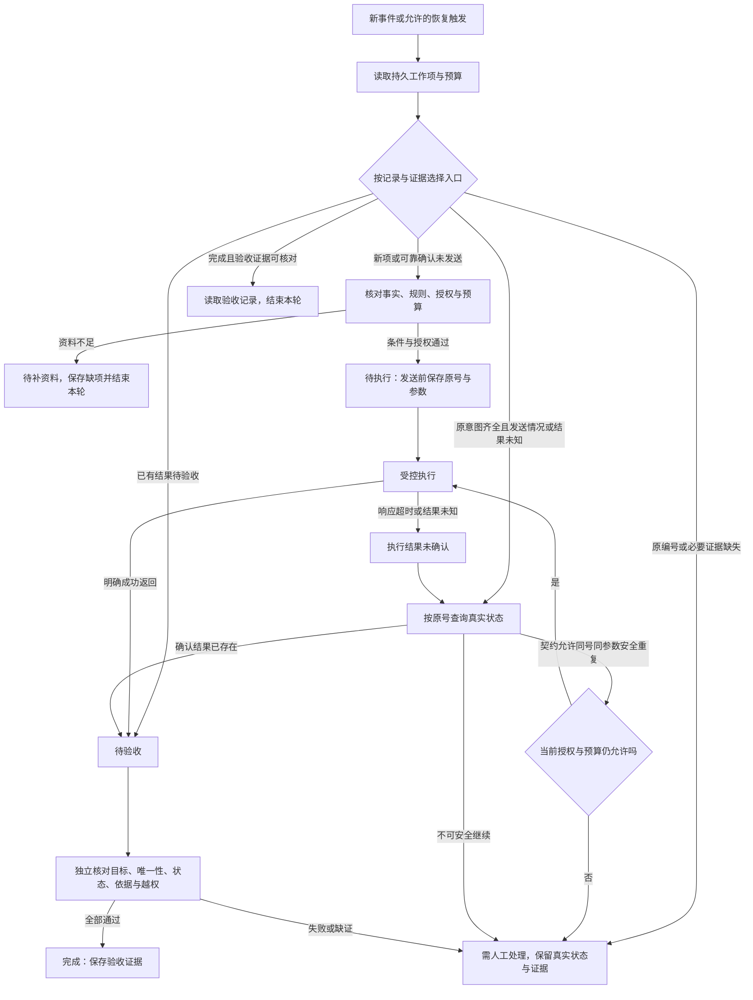

# 长期 Loop：谁触发下一轮，怎样接续与停止

助手完成一次申请核对，然后退出。明天有新申请到达，谁来启动处理？如果程序在创建记录后崩溃，下次怎样知道远端是否已经写入？如果它一直没有取得结果，又由谁叫停？

把同一段程序重复运行，并不能回答这些问题。跨运行工作还需要触发来源、可靠状态、独立验收与停止机制。

这是《AI学习目录》第八阶段的第 23 课，主题是 **长期 Loop：谁来触发下一轮**。第 20 课讲当前任务怎样推进，第 21—22 课讲执行恢复与状态分层；本课把这些责任接成有边界的跨轮流程。

读完后，你应能独立完成五件事：

1. 区分当前任务的内部循环与外部事件启动的下一轮。
2. 列出触发源、持久状态、独立检查、预算、停止与人工接管。
3. 画出正常成功路径与结果未知时的对账分支。
4. 说明重启为何先读已保存的证据与状态，并重新确认远端结果。
5. 判断什么时候根本不需要长期 Loop。

最低前置知识是：知道模型请求与实际执行不同，知道超时不能证明远端未执行。本文会给出必要规则，不要求先学调度平台或数据库。

全文只做 **纸面教学设计**。申请事件、受理记录、操作编号和预算都是课程设置，不是真实流量；本课不创建自动任务、不配置定时器，也不调用业务服务。

## 一、当前任务内继续，与下一轮启动分开看

先看两段过程：

```text
当前任务内部：
读到旧材料 → 转查新材料 → 根据返回核条件 → 回答。

跨运行处理：
本轮结束并保存状态 → 新申请事件到达 → 读取持久状态 → 启动下一轮。
```

第一段根据本轮观测决定下一步，可采用 ReAct 或执行／重规划。第二段还要决定什么时候重新开始、读什么状态、是否仍可继续。

| 比较项 | 当前任务内部循环 | 本课的长期Loop |
| --- | --- | --- |
| 谁推动下一步 | 本轮工具返回、任务事实与执行条件 | 时间、事件或明确状态条件，经调度进入下一轮 |
| 状态怎样接续 | 本轮消息、工作状态与工具证据 | 跨运行保存的工作项、原意图、验收、预算与缺项 |
| 什么时候结束 | 本轮完成、缺证或达到限制 | 单项完成、没有新工作、预算／授权／安全条件不允许继续 |
| 是否需要重新运行 | 一次任务中可继续调用 | 另有启动与恢复责任，不能只等模型自行想起来 |

这是一种职责比较，不把所有 ReAct 实现限定为短任务。已有 Agent 可以承担每轮执行，但内部循环次数多不自动补齐外部触发、持久化或接管。[^循环主线]

**调度器负责启动，检查器负责验收**。定时器到点不说明有新工作，也不说明上一项已经完成，更不会增加业务授权。

## 二、先列出六类责任，再设计长期运行

本课采用“新申请事件到达”作为触发源。它是一种教学事件，不是已经接通的消息队列或接口。

| 责任 | 必须说清什么 | 本例的安排 |
| --- | --- | --- |
| 触发 | 哪种事件开始新工作，哪种条件允许恢复旧工作？ | 新申请启动；补齐材料或完成对账后，经允许的恢复条件继续原工作项 |
| 持久状态 | 退出后还能读到什么，存在哪里？ | 教学上保存在磁盘工作项记录；保留原意图、证据、状态与计数 |
| 独立检查 | 依据什么标准判完成？ | Checker核对条款、授权、实际记录与副作用，不只读自述 |
| 预算 | 尝试、调用和累计运行怎样限制？ | 课程设置3次尝试、单轮10次工具调用、累计5分钟 |
| 停止 | 哪些情况不得自动向下执行？ | 完成、缺资料、授权失效、预算耗尽或无法安全继续 |
| 人工接管 | 谁接手，收到哪些未确认项与证据？ | 交给有权限的处理者，并保留原号、参数、实际返回与待对账状态 |

六类责任不要求六个独立产品。一次顺序处理不必增加多个子 Agent，没有并行修改也不必凑一个 Worktree；真正要明确的是谁处理、谁检查、谁拥有状态与停止权。[^组件与验收]

“持久”表示进程结束后仍能重新读取。只放在函数局部变量或 RAM 中，不能承担本课要求的跨进程恢复。

检查器可以由确定性程序、人工或经过校准的评估逻辑承担。独立性来自职责、标准和可信结果证据，不是模型数量。

## 三、走完一次正常事件处理

### 1. 固定规则、事实与授权

课程新申请的事实是：2025-06-12申请，购买设备签收第10天，未拆封，有含订单号电子凭证。签收当天计第0天。

本题适用乙：2025-05-20发布，2025-06-01起生效，明确替代甲的购买规则。

| 编号 | 教学原文 |
| --- | --- |
| 乙1 | 购买设备在签收后第 0—14 天、未拆封，可以申请退货。 |
| 乙2 | 凭证可以是纸质发票，或含订单号的电子凭证；聊天截图不属于上述凭证。 |
| 乙3 | 已拆封设备不能按乙1申请退货，只能转维修核验；转维修不代表已经批准退款。 |

另有明确教学授权：条件满足时，为当前申请、目标订单创建 **一条待受理记录**，依据为乙1、乙2；不授权批准、退款或外发信息。

事件到达只是发现工作。条款支持申请资格，创建许可来自明确授权，两者不能互相替代。

记录采用课程字段：`申请编号`、`订单号`、`状态`、`依据条款`。实际申请与订单编号必须取自已核对输入；本例不补造真实值。

### 2. 先识别工作项，再核对证据

事件处理方读取已处理状态，确认这是新工作还是已有工作项的再次到达，避免把重复事件当作新的业务意图。

若是新项，保存输入、事件来源和准确工作项关联，再核对乙的适用版本、条款与必要事实。

正常状态可按课程表示为：

```text
待处理 → 证据核对 → 待执行 → 待验收 → 完成
```

每个箭头都需要实际产物。例如“证据核对”通过，必须保存适用规则与条件判断；不是因为写了“正在核对”就能进入下一状态。

### 3. 发送前保存操作意图

条件符合且当前授权有效，才准备创建。沿用课程教学操作编号 `op-1`，在发送前持久保存原号与原参数：

```text
工作对象：当前申请、目标订单。
当前规则：乙及其生效范围；乙1、乙2。
动作：创建一条待受理记录。
操作编号：op-1。
原参数：输入指定的申请编号、订单号；待受理；乙1、乙2。
授权：仅此创建，不批准、退款或外发。
发送证据与预算：按实际发生情况持续记录，不由模型补写。
```

工作项用来组织处理进度，操作编号用来识别一次业务意图。二者不自动相同，也不自动等于事件或模型调用编号；具体关联由实际系统契约决定。

### 4. 成功直接进入验收

执行侧检查后发送创建，成功回执正常到达，工作项进入 **待验收**。正常成功不需要先绕到“执行结果未确认”。

Checker读取可信当前存储，确认：

- 申请编号和订单号匹配本次目标。
- 状态为待受理，依据为乙1、乙2。
- 当前申请关联记录恰好一条。
- 过程与相关状态没有未授权批准、退款或外发。

全部通过才标记“完成”，持久保存实际记录证据和验收结论。回执成功、计划勾完或模型说“完成”都不能单独触发这个标记。

### 5. 保存后结束本轮

保存经验证结果、已处理关联、剩余问题和预算使用情况，再结束本轮。没有新工作就等待触发，不无条件再创建一次。

若完成标记或证据写回失败，持久交接尚未完成；要保存能取得的错误并进入恢复处理，不能用一句“已保存”替代实际写入。

## 四、只有结果未知时，才进入未确认与对账

假设服务端已创建op-1，但响应途中丢失，客户端只收到超时。

这时状态应为 **执行结果未确认**。超时不把“不知道”变成“没执行”，也不意味着已经成功。



图只画本课主要状态分支。恢复入口先按已保存证据分流，“待执行”标签不能代替此前未发送的证明；原编号缺失时也不能猜号查询。每个会新增动作的环节还需检查当前授权与预算；不满足就保存实际状态并停止，不能从图中的回路绕过限制。

### 1. 查询确认已存在

读取原op-1对应结果，转入待验收，不再次创建。随后检查对象、数量、状态、依据与过程约束；存在记录不自动证明合格。

### 2. 可以安全重复

若当前证据与已核对的服务契约支持安全重试，才在授权和预算允许时使用 **同编号、同参数** 继续原意图。

课程里的明确例子是“确认未创建且支持安全重复”。结果仍未知时，若实际契约明确覆盖该状态，也要依契约处理，不能仅凭编号相同就认定安全。

服务端必须真正实施去重；客户端加个字段不构成保证。换新编号可能被视为新操作，重复事件或恢复触发不能成为重复创建的许可。

### 3. 无法确认，也不能安全重复

停止自动重试，保留原号、参数、授权、发送、超时和查询证据，交给有权限者对账。

“需人工处理”是处理路径，“执行结果未确认”是证据状态。两者可以同时记录：交给人，不表示远端已被判失败或撤销。

如果连乙原件或用户必要事实都缺失，则进入待补资料，停止对应判断和下游写入。这是缺证分支，不是创建执行失败。

## 五、进程重启：先读记录，未确认副作用要重新对账

### 1. 磁盘状态也可能落后于远端

课程反例是：创建后进程崩溃，磁盘最后保存的状态还是“待执行”，服务端可能已经创建。

磁盘说明的是最后成功保存的本地记录，不自动证明记录之后没有发生动作。下一轮应恢复原业务意图与op-1，检查发送情况，并按原号对账。

| 重启后取得的证据 | 正确处理 |
| --- | --- |
| 可靠确认此前未发送，授权仍有效 | 复核参数和预算后，按原意图执行 |
| 远端确认op-1已创建 | 读取同一结果，进入待验收 |
| 可靠确认未创建且可安全重复 | 同号同参数有限重试，并记录预算 |
| 执行状态未知且无安全重复保证 | 停止自动写入，人工对账 |
| 原编号或原参数缺失 | 承认发送前保存不足，不猜号、换号盲发 |

**恢复旧摘要不会回滚远端操作**。把聊天重新放入窗口，也不会让工作项计数、文件或服务状态自动恢复。

### 2. 最小持久状态应包括什么

| 内容 | 接续时怎样使用 |
| --- | --- |
| 工作项与事件来源 | 确认处理对象和重复事件，不把旧任务当新意图 |
| 当前事实、材料与规则版本 | 重新核对条件与适用性，保留来源位置 |
| 授权范围 | 判断当前动作是否仍允许，变更后重新核验 |
| 原操作编号与原参数 | 跨超时、中断保留同一业务意图 |
| 实际请求、返回和状态查询 | 区分未发送、已存在、失败与未知 |
| Checker结果与证据 | 从已经验证的产物继续，不只读进度标签 |
| 尝试次数、调用数和累计运行时间 | 恢复后继续预算检查，不因进程重启清零累计计数 |
| 缺项、停止原因与下一步 | 说明为何没完成、何时可恢复、谁需接管 |

只保存一个“待执行”标签，或一段“还在处理”的摘要，不足以安全接续。

LangGraph的Persistence文档说明检查点与存储的职责，并明确内存检查点在进程重启后会丢失。框架提供保存接口，不表示你选用的载体已经满足跨进程要求。[^持久化]

### 3. 有证据的进度与完成标记

“已取回乙原文”可以带来源作为已验证成果保存；“创建已发送但结果未知”必须保留未知；“已验收通过”要附状态与检查证据。

Anthropic的长任务案例通过进度文件接续工作，同时强调实际测试，避免未经验证就标完成。本文采用这项原则，不把其代码项目模板直接套到所有业务。[^进度核验]

## 六、预算与停止：重启不能变成无限额度

### 1. 保留课程预算的不同统计范围

课程显式设置：

| 预算 | 统计范围 | 达到上限的处理 |
| --- | --- | --- |
| 最多3次尝试 | 同一个工作项 | 不再自动启动该项的额外尝试 |
| 最多10次工具调用 | 单轮处理 | 不再发起该轮的额外工具调用 |
| 累计运行最多5分钟 | 跨轮累计运行记录 | 停止自动推进，保存现场和真实状态 |

本文按同一工作项保存跨轮尝试与累计运行使用情况。单轮工具计数在接续同一轮时也应恢复，只有按规则开始真实新一轮才建立该轮计数；不能把每次进程重启当成预算刷新。一次尝试怎样计入、计时怎样覆盖执行与等待，需要真实系统明确定义并实施；这里用已经记账的数值练习，不猜产品默认口径。

**这些数字只用于教学，不是行业默认配置**。它们也不是“每隔5分钟触发一次”：运行预算与触发时间是不同概念。

举三个独立教学情形：

- 工作项已用完3次尝试，重启又收到重复事件：不能把计数改回零，继续第4次自动尝试。
- 本轮已用完10次工具调用，还缺一次状态查询：不能直接发第11次；保存查询缺口和原操作信息。
- 累计已用满5分钟，创建结果仍未知：停止自动推进，保留未知结果，进入接管流程。

预算耗尽不能把未知改成未执行。已经有充分验收证据的成果也不应被丢掉；若还没完成，保留具体状态与停止原因，不用“预算结束”冒充成功。

### 2. 停止与可恢复条件分别写

| 情形 | 本轮怎样停止 | 何时再考虑接续 |
| --- | --- | --- |
| 工作项验收通过 | 保存完成和已处理证据 | 同项重复事件不再创建；新项按新事件处理 |
| 没有新工作 | 结束本轮发现流程 | 后续符合约定的外部触发到达 |
| 资料不足 | 保存待补项，停止相关判断与写入 | 必要资料取得并核对，预算与授权仍允许 |
| 权限或授权失效 | 阻止受保护动作，保存原因 | 有权来源明确恢复相应条件后重新检查 |
| 预算耗尽 | 停止新增自动动作，保存计数 | 按明确管理规则由有权者决定后续，不由模型自行加额度 |
| 结果未知且不可安全继续 | 人工对账，保留原号与参数 | 取得可信状态与安全继续条件后决定 |

“可能恢复”不表示调度器应不断轮询所有阻塞项。触发规则要说明什么新信息或管理决定值得启动，不能把同一缺口反复提交来制造进展。

### 3. 人工接管要能看到现场

交接包应包含目标、原意图、事实与规则、授权、实际动作、未确认结果、预算和下一步核对要求。

如果系统要求通知人，还需记录通知是否成功；不能只写“已交给人工”就假定对方已收到。本课不发送真实通知，也不设真实接管渠道。

## 七、什么时候不需要长期Loop

一次问答资料齐全，按依据答完即可结束。为完成一个有三步依赖的报告，也可以在当前任务里使用工具循环和显式计划，不必增加定时运行。

| 需求 | 是否需要额外长期层 |
| --- | --- |
| 回答这一次的电子凭证问题 | 不需要；核对后答完结束 |
| 本次任务先查来源、比较、检查引用 | 不因步骤多就需要；可用任务内循环 |
| 持续处理以后到达的新申请或新资料 | 可以评估长期层；先定义事件、状态、验收、预算和接管 |
| 只希望助手“不要停，一直产出” | 需求尚不足以定义可靠循环；先明确目标与停止标准 |

**先有跨轮接续需要，再增加长期运行责任**。建设与维护还会消耗时间，自动产出越多，检查能力也要跟上。

循环资料讨论了验证债与Token失控等代价：结果生成快于验收、没有预算的重复尝试，都可能持续累积问题。本文只用这些提醒解释采用条件，不采用个案收益或固定回报率。[^循环代价]

无限`while`或无限重试说明程序能不断运行，不能证明它知道做什么、已经验证什么、什么时候停。

## 八、动手完成一轮与一次崩溃演练

先在纸上写出正常路径：待处理、证据核对、待执行、待验收、完成。每个状态旁边记录转换需要的证据。

再模拟：op-1已经保存，创建发送后崩溃，磁盘仍是待执行。下一轮读取这份记录，分别代入远端已存在、可以安全重试、无法查状态三个结果。

最后设为预算耗尽，检查你能否保存“执行结果未确认”和原参数，而不是偷偷重置计数或重发。

整个练习仅是状态设计，不配置自动任务，不运行真实服务。长期可靠性还需要实际中断、重复事件、存储故障、停止与接管测试。

## 九、合上正文，独立完成五道检查

可以保留第三节条款和任务授权，先作答，再看答案。

### 第1题：内层下一步与下一轮启动

一次申请处理中，读乙失败后核对请求状态，再取得原文，这是哪一层工作？进程结束，第二天新申请到达又启动，是哪一层工作？

分别说明由什么推动，以及定时器是否能替代验收或授权。

### 第2题：列出最小长期运行设计

为新申请事件处理列出触发源、持久状态、独立检查、预算、停止与人工接管。

沿课程3次尝试、单轮10次工具调用、累计5分钟的预算：若已到任一上限且任务仍未完成，怎样保存状态？重启能否把工作项计数清零？

### 第3题：正常与未知状态路径

画出正常创建成功后验收的路径，以及创建响应超时后的路径。分别说明“已存在”“可安全重试”“不可安全继续”的分支。

缺乙原件是否应写成创建失败？一条正确记录未经过程检查，是否就可标完成？

### 第4题：迁移到崩溃恢复

op-1和原参数已持久保存。创建后进程崩溃，磁盘状态仍为待执行。下一轮直接换新编号重发，是否可靠？

写出正确的第一步及各查询结果下的处理。若原号与原参数丢了，应怎样报告？聊天摘要恢复能否撤回远端写入？

### 第5题：选择是否建设长期层

分别判断一次电子凭证问答、当前任务的三步资料比较、持续处理未来新资料三种需求。说明为什么多次工具调用或无限重试不能作为长期可靠性的证明。

## 十、参考答案与过关点

### 第1题答案：观测推动本轮，事件启动跨轮

读乙失败后的请求核对与继续，是当前任务内的执行循环；进程结束后由新申请事件启动，是外部触发与跨轮调度责任。

前者根据当前返回与条件决定下一步，后者还要读取持久状态、识别工作项、检查权限和预算。定时器只负责唤醒，不能替代结果验收，也不能扩大授权。

**过关点**：说清两种启动依据与责任，不按调用次数判断层级。答错回读第一节。

### 第2题答案：状态、证据和计数一起接续

触发源为新申请与明确允许的恢复事件；持久记录保留目标、事实、规则、授权、原操作编号和参数、实际返回、Checker证据、预算与缺项；独立检查核对真实记录、唯一性与过程边界。

停止条件包括完成、缺资料、授权失效、预算耗尽及无法安全继续。接管者需取得可对账证据；通知若是实际步骤，应另核是否成功。

已到上限且未完成时停止新增自动动作，保存真实处理状态和停止原因。单轮调用限额与跨轮累计限额不同；重启不能把同一工作项的尝试和累计运行计数改回零。未知结果仍是未知，不因此变失败或完成。

**过关点**：完整列六类责任，保留计数范围与恢复证据，不仅写一个定时器。答错回读第二、第五、第六节。

### 第3题答案：成功到验收，超时到对账

正常路径：待处理→证据核对→待执行，发送前保存原号与参数→明确成功→待验收→全部检查通过→完成。

超时路径：待执行→执行结果未确认→按原号查询。已存在就进入待验收；实际契约覆盖安全重复且授权、预算允许时，同号同参数有限重试；不可安全继续则保存未知证据、人工对账。

缺乙属于待补资料，不是假定发生过创建失败。正确记录还须核对授权、过程、副作用、目标与唯一性，全部通过才能完成。

**过关点**：保留正常与不确定分支的差别，按证据转换状态。答错回读第三、第四节。

### 第4题答案：先恢复原意图并对账

换新号直接重发不可靠，远端可能已经写入，磁盘待执行只是最后保存的本地标签。

先读取持久的op-1、原参数、授权、发送与预算记录，按原号核对远端真实状态。已创建进入待验收；可靠未发送时复核授权与预算后按原意图发起；符合契约的安全重试保留原号原参数；无法确认且无保证就停止写入，人工对账。

原号或参数丢失说明保存不足，要明确缺口，不能猜号或换号掩盖。恢复聊天或本地检查点不会撤回远端操作。

**过关点**：识别本地与远端状态差异，依证据接续，不把旧标签当未执行证明。答错回读第五节。

### 第5题答案：跨轮需要决定额外责任

一次问答答完结束，不需要长期层；当前三步资料比较可用内部循环与计划，步骤多也不自动要求定时；未来新资料持续到达时，可以评估事件触发与跨轮保存，但仍要具备验收、预算、停止和接管。

调用更多或重试无限只表示运行次数增加，不证明独立检查、真实进展、恢复与停止有效。循环是否值得建设，还应看任务复用和维护成本。

**过关点**：从需求和责任判断采用，而非把长期运行当默认升级。答错回读第七节。

能独立完成五题并解释理由，才说明你能设计跨轮触发、状态接续、验收与停止。一次模拟通过或长时间持续运行，不能证明实际系统可靠。

## 十一、可选进阶：从框架能力回到真实恢复

### 1. 检查点与存储各自保存什么

LangGraph的Persistence文档区分Checkpointers与Stores：前者保存线程内图状态检查点，后者保存图状态之外、可跨线程使用的数据。是否适合进程重启，还要看所选载体与恢复方式。[^持久化]

文档明确`MemorySaver`和`InMemorySaver`把检查点放在RAM，重启会丢失。不要看到“支持检查点”就把内存示例当成生产持久化；本文不提供具体数据库配置或当前SDK调用代码。

持久化也不自动让远端写入与本地状态更新成为一个事务。课程的崩溃反例仍要通过操作记录和真实状态核对。

### 2. 事件重复与动作重复分别处理

发现源可能再次送来同一个工作项。已处理关联帮助识别这是不是旧项；服务端操作去重则帮助同一业务意图跨请求重复时不新增结果。

两种责任不能互相替代。只去重事件不能证明创建服务已幂等；只保证一个操作编号不重复，也不能阻止应用为同一旧工作项不断生成新编号。

具体事件标识、工作项关联和查询接口都应从实际定义读取。本例不构造一套通用JSON键或假定所有消息只到达一次。

### 3. 先验证一次有终点的工作，再扩展触发

相关Loop资料建议先让单次任务有明确产物、检查与失败交接，再增加跨轮状态和发现源。预算与接管要在上线前验证达到条件时确实停止。[^组件与验收]

人工审查能力跟不上自动产出时，验证债会增长；持续更新超出人的理解速度，还会增加维护负担。本文不复制无限Bash循环或固定调度命令，不用个案收入证明收益。[^循环代价]

## 十二、下一课：从运行系统转向参数学习

本阶段已经把工具、计划、授权、状态与长期接续连起来。它们改变的是运行流程和进入模型的信息，不等于模型权重已经学习了新的能力。

第24课“梯度下降与完整训练循环”进入下一阶段，解释参数怎样根据损失更新。先保留这个区别：长期Loop组织工作，训练循环按训练目标更新参数。

## 十三、依据与回查

课号、五项目标、正常／未知状态机、op-1崩溃反例和3次／10次／5分钟教学预算来自《AI学习目录》及《32课学习设计与掌握目标》。本课还参考《循环工程：从逐轮操作到外部调度》的职责整理；这些材料无公开网址，因此只列文字标题。

| 公开资料 | 本文采用的支持范围 |
| --- | --- |
| [LangGraph：Persistence](https://docs.langchain.com/oss/python/langgraph/persistence) | 状态跨运行保存的职责、检查点／存储区别，以及内存载体的重启限制 |
| [Anthropic：Effective harnesses for long-running agents](https://www.anthropic.com/engineering/effective-harnesses-for-long-running-agents) | 进度接续与实际测试配合，不能未经验证标完成 |
| [第一期：什么是Loop Engineering？](https://www.bilibili.com/video/BV1UnKh6QE5D) | 触发、反馈、状态与停止的概念整理来源 |
| [第三期：Loop该怎么搭？](https://www.bilibili.com/video/BV1GB3g67EnG) | 发现、交付、验证、持久化与调度的职责组织 |
| [第四期：搭好Loop≠能上线？](https://www.bilibili.com/video/BV11i3w61EKQ) | 单次有终点任务、跨轮状态、预算与接管的上线检查整理依据 |
| [第二期：三大流派与四笔代价](https://www.bilibili.com/video/BV13Fg46sESt) | 采用与维护代价，未使用其中个案收益或范围争议作为结论 |

本次完整读取对应三份整理资料、综合页、课程与目标，核对LangGraph持久化和Anthropic长任务文章的相关内容。状态名称是本课教学设计，不是框架固定状态枚举；预算也不是实际产品配置。

本次检查了乙条款、正常与未知路径、崩溃恢复、预算范围与停止、五题答案，以及本地Markdown渲染。未创建真实自动任务、部署持久存储、测试调度或业务服务、重新核对完整视频、开展新手试读或实际发布平台预览。纸面走查不证明长期系统已能可靠接续，掌握以独立作答为准。

[^循环主线]: [第一期：什么是Loop Engineering？](https://www.bilibili.com/video/BV1UnKh6QE5D)。本文沿本库职责口径区分任务内与跨轮运行，不将原资料组件表当作所有系统必须安装的产品。
[^组件与验收]: [第三期：Loop该怎么搭？](https://www.bilibili.com/video/BV1GB3g67EnG)与[第四期：搭好Loop≠能上线？](https://www.bilibili.com/video/BV11i3w61EKQ)。依据合并整理资料的职责与上线检查，未采用具体产品命令或生命周期数字。
[^持久化]: [LangGraph：Persistence](https://docs.langchain.com/oss/python/langgraph/persistence)，Checkpointer vs. store与Troubleshooting common issues部分。本文只说明已核对的保存职责与RAM限制，没有运行数据库或SDK。
[^进度核验]: [Anthropic：Effective harnesses for long-running agents](https://www.anthropic.com/engineering/effective-harnesses-for-long-running-agents)，Incremental progress、Testing与Getting up to speed部分。采用进度与实际核验配合原则，不把代码案例作为所有业务的通用模板。
[^循环代价]: [第二期：三大流派与四笔代价](https://www.bilibili.com/video/BV13Fg46sESt)。参考验证债与无预算循环的成本问题，不采用未复现实验或个案收益数字。
