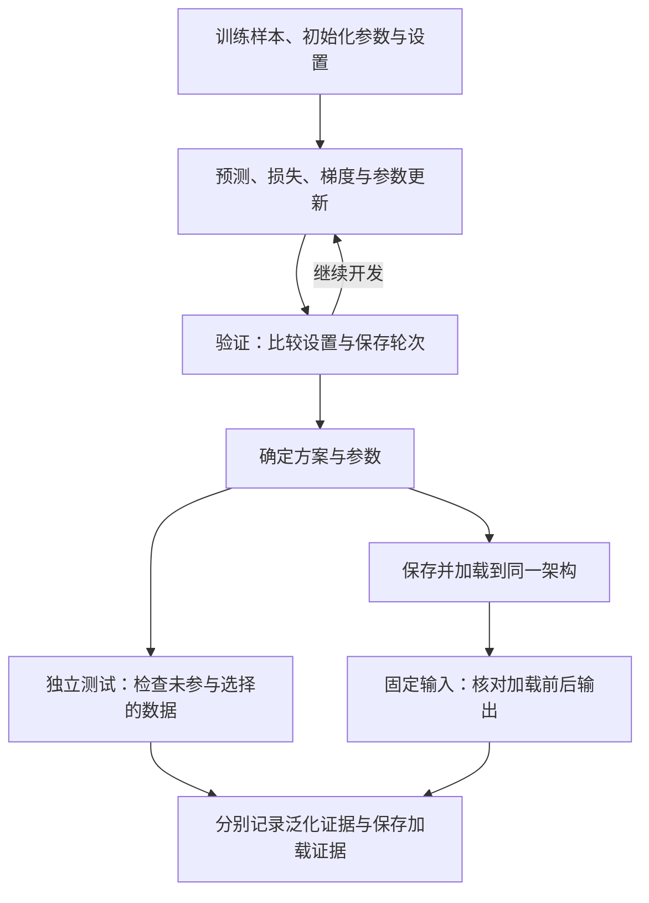

# 梯度下降与完整训练循环：参数怎样改变，学习怎样验证

前面的课程经常谈到模型参数：一张Embedding表、一次Linear映射，背后都有训练所得的数字。使用模型时，我们拿这些数字计算预测；训练时，系统又怎样知道该改哪个数字、往哪里改、改多少？

先看一个小问题：输入2，目标是4，模型却预测2。把参数改大可能让预测靠近目标，但应该改到多少？改一次以后误差小了，是否就能认定模型学会了？

本文对应《AI学习目录》第九阶段第24课“梯度下降与完整训练循环”。我们先用一个参数走完预测、损失、梯度、更新与重新预测，再把这个步骤接到批量训练、验证、独立测试和保存加载检查。

你只需会乘法、平方和比较正负数。主线不要求先学微积分或运行PyTorch；选读再展示自动求梯度的短代码，以及MNIST图像训练中的形状。读完后，你应能独立完成五件事：

1. 按正确顺序解释一次参数更新。
2. 区分损失、梯度和学习率的用途。
3. 说明`backward()`计算梯度，`step()`更新参数。
4. 区分训练、验证与测试，识别用测试结果反复挑方案的泄漏。
5. 解释训练表现好为什么仍需独立测试，以及保存后为什么还要核对加载结果。

本文主例来自课程：输入、目标、初始参数和学习率都是教学设定。推演不代表真实大模型的训练记录，也不推荐将其中学习率直接用于其他模型。课程把训练放在后面讲，是阅读顺序，不表示真实模型先执行Agent任务才开始训练。

## 一、先分清输入、目标和待调整的参数

教学模型只有一个乘法：

```text
预测值 = w × x
```

`x`是样本提供的输入，`w`是模型参数。目标值`y`来自样本，告诉我们希望预测什么。先固定偏置`b=0`，所以本段不更新`b`。

| 对象 | 本例的值 | 本步承担的职责 |
| --- | --- | --- |
| 输入x | 2 | 送进模型，用来计算预测 |
| 目标y | 4 | 与预测比较，定义这条样本的误差 |
| 参数w | 初始为1 | 训练要调整的数字 |
| 学习率η | 0.1 | 控制本次更新步幅的人为设置 |

第一轮预测是 `1 × 2 = 2`，目标却是4。本步要改的是`w`，不是为了让结果好看而改输入或目标。

学习率属于超参数：它是控制训练过程的设置，与通过训练调整的`w`不同。真实模型可以有很多允许训练的参数，优化器负责按所选规则调整它们；这个小模型用来让每一步变化都看得见。[^梯度讲解]

## 二、从预测到更新，把一步完整算出来

### 1. 前向：用当前参数产生预测

把输入交给模型并计算输出，叫前向计算。本例得到：

```text
预测值 = 1 × 2 = 2
```

这里参数仍是1。前向只是产生预测，没有根据这次误差改变参数。

### 2. 损失：把预测与目标的差异变成一个数

先求带符号的误差，再平方：

```text
误差 = 预测值 - 目标值 = 2 - 4 = -2
平方损失L = 误差² = (-2)² = 4
```

**损失函数衡量当前预测与目标的差异**。本例用平方误差，预测偏低2或偏高2，损失都会是4。单看损失4，不能判断参数应该增大还是减小。

损失函数与模型函数不同：模型从输入产生预测，损失函数再从预测与目标产生差异数值。其他任务可以使用其他损失，不是所有训练都计算平方误差。

### 3. 梯度：计算损失对当前参数的局部响应

本例的梯度可以直接按以下公式算，不要求你先独立推导它：

```text
梯度_w = 2 × (w × x - y) × x
       = 2 × (1 × 2 - 4) × 2
       = -8
```

梯度描述当前位置附近，参数小幅变化时损失怎样响应。这里是对`w`的导数；多个参数时，可以分别计算损失对每个参数的响应。

在`w=1`附近，梯度为负，表示小幅增大`w`会降低这个损失。可以用两个邻近参数核对直觉：

| w | 预测值 | 平方损失 |
| --- | --- | --- |
| 0.99 | 1.98 | 4.0804 |
| 1.00 | 2.00 | 4.0000 |
| 1.01 | 2.02 | 3.9204 |

向较大的`w`移动一点，损失降低；向较小的方向移动，损失增大。梯度给的是当前点的局部响应，不是“所有情况下都应该增大参数”。

### 4. 更新：沿梯度反方向走一小步

梯度下降的这一步使用：

```text
w_新 = w_旧 - 学习率 × 梯度_w
     = 1 - 0.1 × (-8)
     = 1.8
```

减去一个负数，使`w`增加0.8。学习率0.1控制沿梯度反方向移动多少；梯度符号与幅度、学习率共同决定更新量。

**计算出梯度与真正替换参数是两步**。只有更新发生以后，模型后续预测才会使用1.8。

### 5. 重新前向：检查新参数在这条样本上的结果

```text
新预测 = 1.8 × 2 = 3.6
新误差 = 3.6 - 4 = -0.4
新损失 = (-0.4)² = 0.16
```

本步将损失从4降到0.16，说明这一步对这条样本有效。重新计算很重要：原来算出的损失4属于旧参数，更新以后不能把那个旧数当作新损失。

把五步连起来：

| 顺序 | 实际得到什么 | 参数是否已经更新 |
| --- | --- | --- |
| 预测 | 2 | 没有，w仍为1 |
| 损失 | 4 | 没有 |
| 梯度 | -8 | 没有 |
| 更新 | w变为1.8 | 是 |
| 重新预测及比较 | 预测3.6，损失0.16 | 使用新参数 |

下一轮在新位置重新算梯度，而不是永远沿用-8。

## 三、损失、梯度和学习率，各自解决不同问题

| 对象 | 回答的问题 | 本例中是什么 | 容易混淆的地方 |
| --- | --- | --- | --- |
| 损失 | 当前预测偏离目标多少 | 平方误差4，更新后0.16 | 损失大小不直接给出参数方向 |
| 梯度 | 当前参数附近，损失对参数怎样响应 | w=1时为-8 | 局部方向不保证大步移动仍下降 |
| 学习率 | 本次沿反方向迈多大一步 | 人为设置0.1 | 大不自动更快，小也不自动更好 |

若把起点换成`w=3`，输入与目标保持2和4，则预测6、误差2、损失仍为4，但梯度变为：

```text
2 × (3 × 2 - 4) × 2 = 8
```

同样的损失4，这次梯度是正数，沿反方向更新会减小`w`。损失与梯度不是同一个数，也不是同一项职责。

普通推理通常在固定参数下做前向预测。训练则额外使用目标与损失计算梯度，再由优化器更新允许训练的参数。给模型一段新提示、检索到一条新经验，与训练参数更新需要分别判断。

## 四、换一个步长，为什么可能越过最低点

仍固定`b=0`，只用输入2、目标4。这个损失可以写成：

```text
L = (2w - 4)² = 4 × (w - 2)²
```

最低点在`w=2`，损失为0。从`w=1`开始，每一步都重新计算当前梯度，比较四个教学学习率：

| 学习率 | 第一步后的w | 第二步后的w | 损失变化 | 在这条曲线上的表现 |
| --- | --- | --- | --- | --- |
| 0.10 | 1.8 | 1.96 | 4 → 0.16 → 0.0064 | 从同一侧靠近最低点 |
| 0.20 | 2.6 | 1.64 | 4 → 1.44 → 0.5184 | 跨过最低点，但距离逐步缩小 |
| 0.25 | 3 | 1 | 4 → 4 → 4 | 两点往返，损失不降 |
| 0.30 | 3.4 | 0.04 | 4 → 7.84 → 15.3664 | 来回越跳越远 |

0.20的第一步越过`w=2`，仍然让损失下降。因此“跨过最低点”和“发散”也不是同一件事。0.25保持相同距离，0.30才在这个起点上持续扩大距离。

这些结果仅针对本例单参数二次曲线与固定步长。不能把0.25当作所有网络的边界，也不能把0.10当作MNIST或大模型的推荐配置。真实训练的曲面、批量、优化器和其他设置都会影响行为。

**一步下降不是收敛证明，更不是泛化证明**。收敛关心训练过程是否接近某个稳定结果；泛化关心未参与训练与选择的数据表现。我们还没检查其他输入。

## 五、完整训练循环里，backward和step分开做什么

训练不只是写一个更新式。用PyTorch表达时，先初始化模型、损失函数与优化器，再反复取训练数据运行本步。一个批量是一次送入模型的一组样本，Batch Size表示组内样本数；一个Epoch表示按训练流程遍历一轮训练集。

本课采用每批独立更新、不跨批累积梯度的方式：

```text
设置训练模式
取一批训练输入与目标
清空旧梯度
前向预测
计算这一批的损失
backward：计算本次损失对参数的梯度
step：优化器根据梯度更新参数
继续下一批，或重新前向检查更新结果
```

对应的三个关键接口是：[^优化流程]

- `optimizer.zero_grad()`：清空旧梯度；默认反向计算会累积梯度，本例每批独立更新，所以先清空。
- `loss.backward()`：根据本次计算关系取得参数梯度。对本例而言，此后w仍为1，梯度为-8。
- `optimizer.step()`：按优化器规则改变参数。用本例的普通SGD及学习率0.1，才得到w为1.8。

有些实现会在上一步更新后清空梯度，而不是放在下一步前向之前；关键是本例下一次反向前没有不该保留的旧梯度。刻意累积多批梯度属于另一种明确训练设计，不能把它与忘记清零混在一起。

`backward()`是反向传播计算梯度的入口，可以理解为沿前向建立的计算关系回传损失响应。它不等于优化器更新。优化器也有不同算法：本文手算使用普通梯度下降，后面的MNIST整理实践使用Adam，不能假定任何优化器都按这一个简式更新。

批量训练还要规定怎样汇总损失。对平方误差，一批N个样本的均方误差MSE是：

```text
先对每个样本算误差及平方
再求平均：MSE = 所有平方误差之和 ÷ N
```

不能先把输入和目标分别平均成一个点，再用这个点代替整批损失。那会丢掉样本之间的关系，选读会给一个直接反例。

每一轮还应保存训练配置、实际平均损失与必要的错误检查。若批次大小不同，汇总平均损失时按批样本数加权，不能让最后一个小批次与大批次得到同样权重。

参数更新循环已经能运行，但只盯训练损失还不足以决定训练什么时候结束、最终能交付什么。

## 六、训练、验证和测试：数据是否影响决策，要看用途

### 1. 训练集用来更新，验证集用来选择

| 数据 | 主要职责 | 是否影响训练决策 |
| --- | --- | --- |
| 训练集 | 计算训练损失、梯度并更新参数 | 是，直接用于参数更新 |
| 验证集 | 比较学习率、模型设置与保存轮次 | 是，帮助选择；评估时不做反向更新 |
| 独立测试集 | 方案确定后检查未参与训练与选择的数据表现 | 不再用它反复挑设置或保存轮次 |

下面是人工构造的观察记录，不是实际训练成绩：

| 轮次 | 训练损失观察 | 验证结果观察 | 选择时怎样解释 |
| --- | --- | --- | --- |
| 第1轮 | 尚有较大误差 | 表现一般 | 当前参照 |
| 第2轮 | 比第1轮低 | 比第1轮好 | 在这些轮次中可作为保存选择 |
| 第3轮 | 比第2轮更低 | 比第2轮差 | 不能仅凭训练更好就选第3轮 |

在事先规定按验证表现选择的教学流程中，会保留第2轮对应的参数，再对确定方案做独立测试。训练更好、验证变差提示需要调查过拟合或其他问题，不能仅凭这个小表证明所有原因。

过拟合指模型对用于学习的数据适配得很好，对未见数据却不能保持效果。即使没出现明显过拟合迹象，也仍要独立评估，不能用训练成绩代替。[^数据划分]

### 2. 没有backward，也可能泄漏测试信息

假设有人每改一次学习率就看测试集，把测试得分最高的一版留下；换网络、换轮数也继续用同一测试集挑选，最后说“测试从未计算梯度，所以完全独立”。

问题在于测试结果已经参与方案选择。信息通过人的决策进入训练流程，即使没运行`backward()`，最终分数也不再是未参与选择的独立检验。scikit-learn的交叉验证说明明确讨论了这类泄漏。[^数据划分]

应将设置与保存轮次的比较放在验证数据或合适的交叉验证流程中，并保留最终独立测试。若测试结果已经指导调参，就应如实说明它参与了开发，不继续把它作为独立报告；需要新的、确实未参与选择的评估依据。

数据划分不是固定百分比的背诵题。样本之间的关联、时间顺序与任务分布都可能影响划分方式，本课先掌握三类数据的职责。

### 3. 单点拟合为什么还不够

回到只有`(x=2，y=4)`的例子。如果解除`b=0`固定约束，用 `预测=w×x+b`，从w=1、b=0出发，同一轮旧误差为-2：

```text
梯度_w = 2 × (-2) × 2 = -8
梯度_b = 2 × (-2) = -4

w_新 = 1 - 0.1 × (-8) = 1.8
b_新 = 0 - 0.1 × (-4) = 0.4
```

重新预测 `1.8 × 2 + 0.4 = 4`，损失变成0。但另一条直线w=2、b=0也经过这个点。输入3时，两者分别给5.8与6，教材没有提供输入3的真实目标，因此无法判断哪条更好，更不能说学会了所有输入。

两项梯度必须在同一组旧参数上算完再更新。先改w，再用新w求“这一轮”的b梯度，会变成另一种操作顺序，不能冒充上面的同轮更新。

## 七、独立测试以后，还要确认保存的模型能正确加载

独立测试回答“确定方案对这批未参与开发的数据表现如何”。保存加载核对回答“保存下来的参数，重新读回后是否仍产生预期计算”。两项证明的对象不同。

只看到权重文件存在，不能确认参数已正确恢复；加载后输出一致，也不能证明模型对未见数据泛化好。可以按以下顺序检查：

1. 保存确定方案的参数，并记录网络结构、预处理、设备、数值精度与相关版本。
2. 新建相同架构的模型，加载对应参数。
3. 给保存前和加载后的模型同一份固定输入，保持同样预处理与评估条件。
4. 比较输出数值；分类任务还可以比较预测类别。允许的数值误差要按当前计算条件明确规定。

PyTorch常用`state_dict`保存模块中的参数及相应注册状态，再用`load_state_dict`加载到匹配架构。只保存这份状态，不等于保存了完整恢复训练所需的优化器、轮次与其他状态；若目标是继续训练，应另按实际需要保存检查点。[^保存核对]

测试与固定输入比较时还要区分两项设置：

- `model.eval()`切换Dropout、BatchNorm等层的行为。它不自动关闭梯度记录。
- `torch.no_grad()`关闭该代码区域的梯度记录。它不自动把模型切到评估模式。

本课的独立评估不做优化器更新，两项职责分别设置。没有Dropout的简单网络也可以保留这些明确边界，不能因为一份示例暂时没用到，就把两者说成相同操作。[^优化流程]



这个过程将训练与验收接起来。指标变好说明什么、还有什么没有验证，都应由实际记录支持。

## 八、基础检查：先自己完成五题

可以保留模型与更新公式，先不看下一节答案。

### 题1：在新参数上再走一步

仍只更新w，固定b=0，输入2、目标4、学习率0.1。上一轮已经得到w=1.8。

写出这一轮的预测、损失、梯度、新w，以及更新后的预测和损失。为什么不能继续使用上一轮的梯度-8？

### 题2：相同损失是否有相同更新方向

输入2、目标4、b固定0。分别比较w=1与w=3时的损失和梯度。

解释损失、梯度、学习率的各自职责。再用学习率0.1从w=3更新一步，并说明这一结果为何不能推出“所有训练都用0.1”。

### 题3：参数是在什么时候变的

本例按普通SGD、学习率0.1运行，起始w=1，旧梯度已经清空。执行前向得到预测2、损失4，然后调用`loss.backward()`，尚未调用`optimizer.step()`。

此刻w与梯度分别是多少？随后调用`step()`会怎样？若下一批也独立更新，为什么应清空不该保留的旧梯度？

### 题4：测试没有反向，是否就独立

开发者每次换学习率和保存轮次，都查看同一“测试集”的得分，并据它选最好的一版；评估过程没有调用`backward()`。

指出哪项职责混淆了，应该怎样安排训练、验证与最终测试。第六节的三轮记录中，若按验证表现选择，应选哪轮？

### 题5：零训练损失与加载一致能证明什么

解除偏置固定后，本样本得到w=1.8、b=0.4，对输入2预测4，损失为0。有人保存并加载这两个参数，对固定输入2再次得到4，便宣布“模型学会了全部输入，保存的模型也完全通过验收”。

指出哪些判断已有支持、哪些没有。输入3时该直线预测多少？教材未给这个输入的目标，接下来还需要什么？写出保存加载检查应固定和比较的内容。

## 九、参考答案与过关点

### 题1答案

从当前w=1.8重新计算：

```text
预测 = 1.8 × 2 = 3.6
误差 = 3.6 - 4 = -0.4
损失 = 0.16
梯度 = 2 × (-0.4) × 2 = -1.6
新w = 1.8 - 0.1 × (-1.6) = 1.96
新预测 = 1.96 × 2 = 3.92
新损失 = (3.92 - 4)² = 0.0064
```

梯度-8属于旧位置w=1，不能继续当作新位置的梯度。更新后需要重新前向并计算本轮响应。

**过关点**：能依次得到预测、损失、当前梯度与更新后结果，并说明旧梯度为何不能复用。答错回读第二节。

### 题2答案

w=1时预测2、损失4、梯度-8；w=3时预测6、损失4、梯度8。相同损失不决定方向，当前梯度才描述参数附近的响应，学习率控制沿反方向移动的量。

从w=3更新：`3 - 0.1 × 8 = 2.2`；新预测4.4，损失0.16。本例只证明这一步在该样本和曲线上有效。学习率改变、损失形状或优化器改变以后，需要重新验证，不能套作通用配置。

**过关点**：用具体正负梯度解释两侧移动方向，保留局部与教学设置边界。答错回读第三、第四节。

### 题3答案

`backward()`之后w仍为1，梯度为-8；随后普通SGD的`step()`按题目设置更新w为1.8。前者计算梯度，后者调整参数。

默认反向计算会累积已有梯度。本题各批独立更新，应在下一次反向前清除不该保留的旧梯度，否则本次更新不再只对应新批次。显式设计的梯度累积则需要另有一致的汇总与更新约定。

**过关点**：指出参数真正变化的时点，理解清零与累积的区别。答错回读第五节。

### 题4答案

这个“测试集”已经参与学习率和保存轮次选择，承担了验证职责。没有反向传播也不能消除测试选择泄漏。

训练数据用于计算梯度与更新；验证数据或合适交叉验证用于开发选择；方案确定后，独立测试数据用于最终检验，不能反复据它挑方案。已参与开发的数据不能继续假装独立，需要新的独立评估依据。

在给定三轮记录且按验证表现选择的条件下，保留第2轮；第3轮训练损失更低，验证却更差。这个选择仍不构成最终测试成绩。

**过关点**：能按数据实际用途判断独立性，而不是只看名称或是否调用backward。答错回读第六节。

### 题5答案

已有支持的是：给定参数在输入2上预测4，这条训练样本的损失为0；加载后对这份固定输入取得同样结果。它不证明所有输入正确，也不证明整个数据分布表现良好。

输入3时预测 `1.8 × 3 + 0.4 = 5.8`。没有该输入的真实目标，就不能计算误差；需要未参与训练与方案选择的带目标样本，按明确指标独立评估。

保存加载比较应固定架构、预处理、输入、设备和数值精度等条件，设为一致的评估模式，比较输出数值及规定容差；分类时再比较类别。多项代表性固定输入比只看一个输出更能检查保存加载路径，但仍与泛化测试承担不同责任。

**过关点**：区分单点拟合、独立泛化与保存加载一致性三种证据，指出未知目标及必要后续检查。答错回读第六、第七节。

能独立完成五题并解释理由，才说明达到了本课基础掌握目标。读懂一遍、训练程序运行完或看到一次损失下降，都不能直接当作已经掌握或模型可靠。

## 十、可选进阶：把主例接到代码、批量与图像训练

### 1. 用PyTorch自动求同一个梯度

以下短代码只演示一个无偏置Linear参数，使用普通SGD和学习率0.1，并在内存缓冲区保存、加载自身参数。没有下载数据或运行MNIST，前面主例的数字保持不变。

```python
import io
import math
import torch

模型 = torch.nn.Linear(1, 1, bias=False, device="cpu", dtype=torch.float64)
with torch.no_grad():
    模型.weight.fill_(1.0)
输入 = torch.tensor([[2.0]], device="cpu", dtype=torch.float64)
目标 = torch.tensor([[4.0]], device="cpu", dtype=torch.float64)
优化器 = torch.optim.SGD(模型.parameters(), lr=0.1)

模型.train()
优化器.zero_grad()
预测 = 模型(输入)
损失 = ((预测 - 目标) ** 2).mean()
损失.backward()
assert math.isclose(模型.weight.item(), 1.0)
assert math.isclose(模型.weight.grad.item(), -8.0)
优化器.step()
assert math.isclose(模型.weight.item(), 1.8)

模型.eval()
with torch.no_grad():
    更新后输出 = 模型(输入)
    更新后损失 = ((更新后输出 - 目标) ** 2).mean().item()
assert math.isclose(更新后损失, 0.16)

缓冲区 = io.BytesIO()
torch.save(模型.state_dict(), 缓冲区)
缓冲区.seek(0)
加载模型 = torch.nn.Linear(1, 1, bias=False, device="cpu", dtype=torch.float64)
加载模型.load_state_dict(torch.load(缓冲区, weights_only=True))
加载模型.eval()
with torch.no_grad():
    加载后输出 = 加载模型(输入)
assert torch.allclose(更新后输出, 加载后输出, rtol=0.0, atol=1e-12)
print("梯度、更新、新损失与保存加载检查通过")
```

本次已在PyTorch 2.14.1、CPU、float64环境执行这段代码，梯度为-8、更新后w为1.8，新损失为0.16，保存加载输出最大绝对误差为0。代码中的严格容差只适用于这段小计算，不是所有设备与网络的统一标准。它验证的是这条路径，不证明其他样本表现。没有PyTorch环境时仍可按正文手算，安装与训练完整网络不属于本课基础达标条件。

### 2. 为什么MSE不能用“平均样本”代替

用原始资料的两个样本 `(-1,-1)`与`(1,1)`，当前w=0、b=0。逐样本预测都为0，误差分别为1和-1：

```text
MSE = (1² + (-1)²) / 2 = 1
梯度_w = 2 × [1 × (-1) + (-1) × 1] / 2 = -2
```

如果先平均输入和目标，就变成`(0,0)`。此时损失为0，w的梯度也为0，丢掉了真实批量中需要调整斜率的信号。先逐样本计算，再平均，才是这里规定的MSE。[^梯度讲解]

对一般批量，误差先用同一组旧参数计算：

```text
误差_i = w × x_i + b - y_i
L = 所有误差_i²之和 / N
梯度_w = 2 × 所有(误差_i × x_i)之和 / N
梯度_b = 2 × 所有误差_i之和 / N
```

对本例仅更新w的曲线，还可直接写出偏离最低点的变化：`新(w-2) = (1-8η) × 旧(w-2)`。第四节的同侧靠近、往返靠近、等幅往返与发散，分别来自这个乘数的符号和绝对值；这一关系不能推广为任意网络的阈值。

### 3. 在MNIST中追踪同一条训练流程

MNIST是手写数字0—9的灰度图数据集，常见图像大小28×28。课程对应的完整整理实践使用全连接网络 `784→256→128→10`，输入先展平为784个像素特征，中间Linear后接ReLU，最后输出10个类别分数。[^手写数字]

用课程明确设置的32张教学批量看形状，它不是原整理实践实际采用的批量50：

| 阶段 | 教学形状 | 怎样理解 |
| --- | --- | --- |
| 图像张量 | `[32, 1, 28, 28]` | 32张图，每张一个灰度通道 |
| 展平 | `[32, 784]` | 每张28×28共有784个输入数 |
| 第一层及ReLU | `[32, 256]` | 每张图的256个中间特征 |
| 第二层及ReLU | `[32, 128]` | 每张图的128个中间特征 |
| 最后一层 | `[32, 10]` | 每张图对应数字0—9的Logits |
| 标签 | `[32]` | 每张图一个整数类别目标 |

Logits是未归一化的类别分数，不是已经校准的正确概率。使用整数类别目标时，`CrossEntropyLoss`直接接收这些Logits，不应先加一次Softmax再交给它；该损失完成相应的归一化与负对数计算。预测类别可以取每行最大分数的位置。[^优化流程]

Dataset提供样本，DataLoader组织批量，前向产生Logits，损失与标签比较，反向取得梯度，优化器更新参数。样本和输出形状变大，正文中的职责没有改变。

三份实践入口必须分开看：

| 资料 | 实现与数据 | 可以用来核对什么 |
| --- | --- | --- |
| 对应原始讲解及本课程的整理实践 | MNIST，全连接784→256→128→10，Logits与CrossEntropyLoss | 图像、标签、损失、训练与保存加载的整条过程 |
| PyTorch优化教程 | FashionMNIST，全连接示例 | 官方前向、反向、更新和模式切换的用法 |
| PyTorch官方MNIST源码 | 卷积网络，`log_softmax`配`nll_loss` | 另一条明确的MNIST实现，不与前两者混作同一模型 |

官方MNIST源码中的`log_softmax`与`nll_loss`是成对使用的方案，不能照搬成“先Softmax再CrossEntropyLoss”。FashionMNIST分类的是服饰，不是手写数字；网络、数据和实验成绩都要分别归属。[^实现边界]

对应整理实践完成了五轮训练、独立测试和固定输入保存加载检查，但没有单独划出验证集。本篇讲三类数据的完整分工，不把该实践冒写成已经做过验证选择；也不把已有CPU训练成绩写成本次实测。需要在其基础上比较设置时，应先设计验证数据，再保留真正独立的最终测试。

## 十一、下一课：训练之外，还要分清改变哪部分

这一课从一个乘法走到完整训练责任：预测、损失、梯度与参数更新是一条循环，验证用于开发选择，独立测试与保存加载分别检查泛化和交付路径。

第25课“LoRA与后训练：改变什么、需要什么”会继续区分训练改哪些参数、优化目标怎样定义、反馈从哪里来。那些名称不同，仍需要本课的更新与独立评估基础，不能只凭训练损失或一次输出判断学会了。

## 依据与回查

五项掌握目标、主例x=2／y=4／w=1／b固定0、学习率0.1、偏置变式与32张MNIST形状来自《AI学习目录》和《32课学习设计与掌握目标》第24课。第二步、其他步长的数值与检查题沿这些规则推演；三轮验证表是人工示意，短代码是主例的教学实现。本文按《AI学习博客编写规范》组织，课程与规范目前以文字标题说明出处。

[^梯度讲解]: 隔壁的程序员老王，[《大模型的训练原理 梯度下降：从一条直线讲起》](https://www.bilibili.com/video/BV1mV2tBgE3G)，2025-12-11。完整整理资料已读取，支持损失、梯度、学习率、同轮旧参数与MSE反例。其原例x=2／y=5.6／w=0.5／b=1与本篇课程主例分别保留，没有混用数字或复现原视频全部训练。
[^优化流程]: PyTorch官方[Optimizing Model Parameters](https://docs.pytorch.org/tutorials/beginner/basics/optimization_tutorial.html)，回查“Loss Function”“Optimizer”与“Full Implementation”。核对时页面为2.14.0教程文档，支持Logits输入、反向与更新、训练与评估模式；该页数据为FashionMNIST，不能证明本篇MNIST结果。
[^数据划分]: scikit-learn官方[Cross-validation: evaluating estimator performance](https://scikit-learn.org/stable/modules/cross_validation.html)，核对时为1.9.1文档。支持在训练之外保留测试、用验证或交叉验证进行选择，以及重复据测试调参的泄漏边界；本文未执行数据划分或交叉验证实验。
[^保存核对]: PyTorch官方[Save and Load the Model](https://docs.pytorch.org/tutorials/beginner/basics/saveloadrun_tutorial.html)，该网址从上述优化教程的实际“Save and Load the Model”链接取得并核对。支持state_dict保存、加载与评估设置；本文另采用对应MNIST完整整理资料中的固定输入比较思路，不把单次一致当泛化证明。
[^手写数字]: 隔壁的程序员老王，[《从零搭建神经网络，识别手写数字》](https://www.bilibili.com/video/BV1ypUkB7Eki)与[《30行代码训练模型 手写数字识别》](https://www.bilibili.com/video/BV1SdBcB7EtG)。对应完整合并整理资料已读取；采用全连接结构、图像展平、Logits、训练与保存加载职责，不在本篇重新报告或复现其完整训练成绩。
[^实现边界]: PyTorch官方[MNIST示例源码](https://github.com/pytorch/examples/blob/main/mnist/main.py)，核对当前main页面中的卷积结构、`log_softmax`与`nll_loss`及训练／测试函数。main会变化，该例不等于本篇全连接网络，也不作为同一实验成绩来源。

本文核验了课程目标、两份完整原始整理资料、上述官方资料、教学算术与检查题。本地渲染不代替实际发布平台预览；本篇没有重新训练完整MNIST网络、训练真实大模型或进行新手试读，已有整理实践的实测不作为本次成绩。基础掌握以能独立完成五题并解释理由为准。
