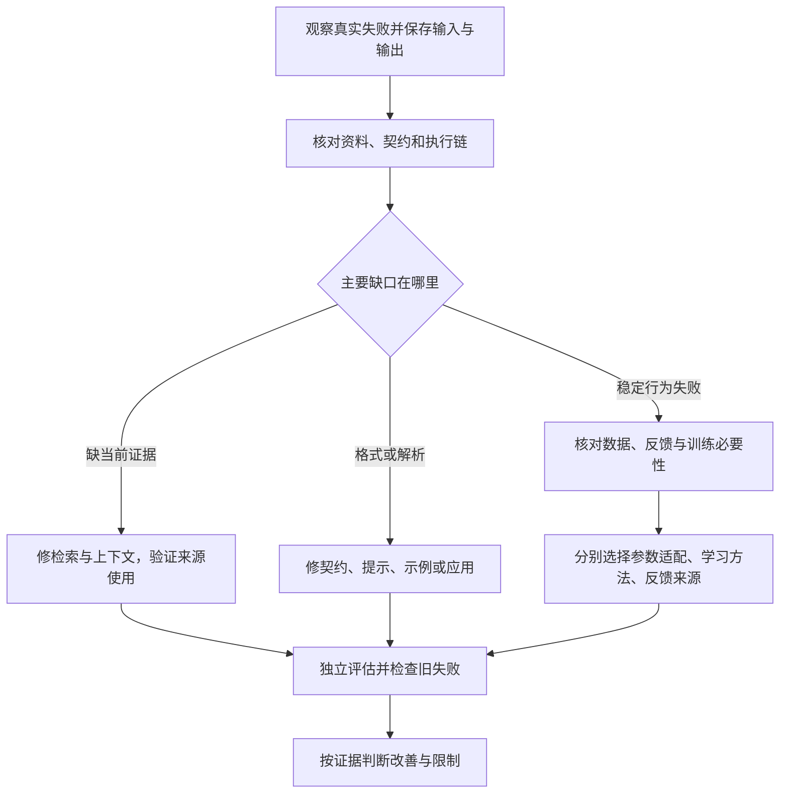

# LoRA 与后训练：改哪些参数、怎样学习、反馈从哪里来

一个问答助手漏掉了刚加入的文章事实。另一个助手知道规则，却经常输出错误格式。还有一个助手在多种任务中反复作出同样的错误判断。

这三种失败都应该立即微调吗？如果有人说“用 LoRA，加上 DPO，再用人工偏好”，这是三种互相竞争的训练方法，还是一套方案中的不同选择？

这就是《AI学习目录》第九阶段第 25 课要解决的问题：**LoRA 与后训练：改变什么、需要什么**。承接第 24 课的参数更新与独立测试，本课先学会诊断和辨别，不要求同时实现全部算法。

读完后，你应能独立完成五件事：

1. 说明 LoRA 冻结底座、训练低秩增量，是参数适配方式。
2. 区分示范回答、偏好对和奖励反馈，不把它们与参数适配混在一起。
3. 说清 DPO、GRPO与人类、AI、程序反馈分别描述什么。
4. 从缺资料、格式失败和稳定行为失败，判断先考虑检索、提示还是训练。
5. 解释奖励分数提高为什么还需要留出评测来验证能力。

最低前置知识是：知道模型参数是可更新的数值，知道训练要有目标和检查。本课会补齐矩阵形状、反馈和评测的必要解释；低秩计算与损失公式放在选读，不影响基础题作答。

矩阵、概率、奖励与“2+2”的例子均为 **课程教学设置**，不是实际模型测量。本文没有进行训练、调用模型或测试显卡资源。

## 一、遇到训练名称，先问三个问题

假设我们已经有一个模型，现在希望改变它的回答行为。至少要分清：

| 问题 | 决定什么 | 本课名称 |
| --- | --- | --- |
| 改哪些参数？ | 哪些数可训练，更新怎样表示 | 全量更新或LoRA等参数适配 |
| 怎样学习？ | 用什么数据组织目标，按什么过程更新 | SFT、DPO、GRPO |
| 反馈从哪里来？ | 谁提供示范、偏好或奖励，依据是什么 | 人类、AI、可验证程序 |

**参数适配、学习方法与反馈来源可以组合**。它们不是同一层里的三选一。

例如“LoRA参数适配＋DPO偏好目标＋人工排序数据”，分别回答了三个问题。换成AI产生偏好对，不会仅因来源变化就把DPO自动变成另一种在线策略算法。

也要分清运行时信息与参数更新：

| 做法 | 实际改变什么 | 能否据此认定权重更新 |
| --- | --- | --- |
| 在当前提示中增加正确样例 | 本次可见输入与任务说明 | 不能 |
| 检索新文章并交给模型 | 本次取得的依据 | 不能 |
| 更新外部经验库，再选择不同经验进入上下文 | 外部记录或经验选择 | 若没有参数更新，就不能 |
| 用训练目标更新LoRA的A、B | 可训练适配参数 | 可以，但底座仍冻结 |

同样，测试时多次采样后挑一个答案，不等于主模型权重已经学会。是否更新参数，要看真实训练过程，不能只看“学习”“反馈”这些名称。[^训练选择]

## 二、LoRA：底座不动，学习一个受限制的增量

### 1. 先认识原权重与新增参数

模型中的一个线性变换可以用矩阵表示：输入是一组数字，权重决定怎样组合这些数字，得到另一组数字。

把已有权重叫 `W₀`。全量更新允许它的数值随训练改变；LoRA则冻结它，在旁边增加可训练的 `A`、`B`。

**冻结是训练时不更新这些权重**，不是把它们从模型中删掉。原来的计算支路仍在工作。

LoRA全称 Low-Rank Adaptation，即低秩适配。两个较小矩阵相乘，形成与原权重同形状的增量。训练改变A、B，让原输出再加上这条增量支路的变化。[^低秩机制]

### 2. 用四个输入、三个输出理解两条支路

课程小例子让原权重把4维输入变成3维输出。

LoRA增量支路选择一个中间维度：

```text
原支路：4个输入数字 → W₀ → 3个输出数字
增量支路：4个输入数字 → A → 1个中间数字 → B → 3个输出变化
最终输出：原支路结果 + 缩放后的增量支路结果
```

这里A先把4个数压到1个中间数，B再把这个中间数变成3个输出变化。因此这些变化受到共同中间表示的限制，不能像任意3×4增量那样自由变化。

这个中间维度由 `r`表示，叫秩参数。它限制增量矩阵最多有多少个独立变化方向；正式形状和手算在选读中展开。

**低秩约束的是增量，不是把W₀降成同样的低秩**。它也不是从W₀中手工挑几个“重要数字”来训练。

### 3. 少训练参数，不等于所有占用按同一比例下降

LoRA可以减少可训练参数，以及这些参数对应的梯度和优化器状态。但底座权重仍需保存，前向计算与反向传播所需激活、临时工作区等也仍存在。

| 对象 | LoRA中的情况 |
| --- | --- |
| 底座权重 | 冻结，仍保存并参与计算 |
| 适配参数A、B | 保存并训练 |
| 参数梯度与优化器状态 | 通常随所选可训练参数减少 |
| 激活与临时工作区 | 仍依赖批量、序列长度、层数和实现 |

因此，课程的“这一矩阵可训练参数为1/64”，不能改写成“整模型显存变成1/64”。整体资源要按实际适配位置、精度、激活与实现测量。[^低秩机制]

LoRA只说明怎样表示参数更新，没有决定用示范、偏好还是奖励训练，也没有保证任意小秩都足够完成任务。

## 三、同一道2+2，三种学习信号

先保持问题不变：“2+2等于多少？”再看训练材料怎样表达期望。

### 1. 示范回答：直接告诉模型该怎样答

```text
问题：2+2等于多少？
示范回答：4。
```

**SFT**，Supervised Fine-Tuning，监督微调，用输入与示范输出学习对应的回答方式。模型通过训练目标提高给定示范回答的条件概率。

示范可以包含格式、解释或操作轨迹，但要准确且与任务一致。错误示范会让模型学错；示范写得漂亮也不证明事实正确。

InstructGPT论文展示了先收集示范做监督微调，再使用偏好反馈的流程。这是一个原始研究实例，不是所有后训练都必须照搬的固定配方。[^示范与人工]

### 2. 偏好对：告诉模型同题哪个更好

```text
问题：2+2等于多少？
优选回答：4。
劣选回答：5。
排序依据：算术正确性。
```

偏好对保存同一输入下两种回答的比较，不等于一个具体训练算法。它可以由人工、AI或其他有依据的判断产生。

**DPO**，Direct Preference Optimization，直接偏好优化，采用这样的离线偏好对，比较当前策略相对参考策略对优选与劣选回答的概率关系，直接优化偏好目标。其核心过程不要求单独训练一个显式奖励模型，也不要求每次优化都在线采样新回答。[^偏好目标]

“当前策略”是正在训练的模型输出分布；“参考策略”提供比较基准。这里只需理解比较职责，损失算式在选读。

### 3. 奖励反馈：给产生的输出一个分数

```text
问题：2+2等于多少？
模型产生的答案：4或5等。
教学检查规则：答案是否等于4。
奖励：按该规则返回分数。
```

奖励提供评价信号，具体学习过程还需确定怎样采样、怎样分配信号、怎样更新参数。单次程序打分本身不是已经完成强化学习。

**GRPO**，Group Relative Policy Optimization，组相对策略优化，从旧策略对同一问题采样一组输出，根据组内相对奖励计算优势，再用于策略更新。它描述优化过程，奖励可以来自不同评分体系，不必一定是算术程序。[^组相对]

“优势”在这里表示相对组内基准的反馈，不是宣布某条回答绝对正确。一个奖励有漏洞的组，即使能排出高低，也可能整体都没有完成真实任务。

### 4. 把数据形态与用途放一起

| 信号 | 最小教学材料 | 提供什么 | 仍不能单独决定什么 |
| --- | --- | --- | --- |
| 示范 | 问题＋目标回答 | 期望输出是什么 | 全量还是LoRA，以及数据是否可靠 |
| 偏好对 | 同题优选／劣选及排序依据 | 两个回答怎样比较 | 是否一定采用DPO、PPO或其他方法 |
| 奖励 | 问题／输出与评分结果 | 当前输出怎样得分 | 分数是否对齐真实能力、用哪种优化器 |

LoRA可以配合不同学习目标；把“LoRA、示范、DPO、人类反馈”直接排成互斥菜单，会混淆这些选择。

## 四、把方案说成三句话

### 1. 500对人工排序，题干明确采用DPO

课程给定：有500对人工排序答案，冻结底座训练低秩矩阵，并采用DPO偏好目标。

可以准确描述为：

```text
改哪些参数：LoRA，冻结底座，只训练选定的低秩适配参数。
怎样学习：DPO，用离线优选／劣选回答直接优化偏好目标。
反馈从哪里来：人工排序数据。
```

不能只因为排序者是人，就断言一定用了在线PPO。题干明确给出DPO，才知道采用的学习方法；只有“500对人工排序”时，算法还没确定。

500只是课程样例数量，不表示已经足够训练、覆盖实际任务或获得某个效果。

### 2. 改用程序奖励与GRPO

如果题干改为：继续使用LoRA，由程序检查算术结果，采用GRPO进行组相对策略更新，则可以组合为：

```text
LoRA参数适配＋GRPO策略优化＋可验证程序奖励。
```

这套描述仍需检查程序评分是否可靠、采样与训练是否正确、留出题表现如何。LoRA没有决定GRPO，程序奖励也没有自动替你选GRPO。

### 3. 人、AI、程序分别提供哪些反馈

| 来源 | 可以提供什么 | 必须核对什么 |
| --- | --- | --- |
| 人类 | 示范、偏好、任务质量判断 | 标注标准、分歧、错误与覆盖 |
| AI | 生成或评价示范、偏好与评分 | 裁判校准、共同盲区与迎合裁判风险 |
| 程序或环境检查 | 算术结果、测试、规则和状态反馈 | 验证器是否检查真实目标，是否可被绕过 |

RLHF、RLAIF、RLVR常分别讨论人类反馈、AI反馈与可验证奖励的训练体系。它们侧重反馈来源和流程，不与LoRA或DPO、GRPO构成同一层四选一。

这些体系可能包含多个阶段。例如Constitutional AI论文明确包含监督学习阶段与AI反馈强化学习阶段；有AI反馈不表示所有步骤都属于强化学习。[^反馈来源]

AI判断的“更好”也不能自动当作事实；程序通过可能只是通过了不完整测试。反馈质量决定训练信号是否值得优化。

## 五、先诊断失败，再决定检索、提示或训练

### 1. 新文章事实不在输入：先补证据链

教学情况：新增文章已有可靠来源，但模型实际收到的请求中没有相关内容，回答因此遗漏事实。

先检查文章是否纳入资料、是否被召回、必要片段是否进入实际输入，以及答案是否忠实使用。此时优先修检索与上下文，比要求模型凭空记住新文章更直接。

这不是说训练永远不能学习事实，而是本例已定位为当前证据缺失。微调也不能代替新事实的来源追溯。

### 2. 已知规则，输出格式不稳：先核对契约与提示

教学情况：结论判断正确，但任务只允许一个固定标签，模型却夹带解释，接口失败。

先确认输出契约、提示与示例一致，再分别检查解析、字段或标签格式、内容判断。不要因标签正确就偷偷放宽接口，也不要把格式失败全部当作知识不足。

如果原始输出已符合契约，而应用解析有问题，应修应用；不能让模型训练补偿一个错误解析器。

### 3. 跨任务稳定行为失败：有数据后再评估训练

教学情况：必要资料、任务说明和执行链已核对，模型仍在多种未见输入中稳定漏掉关键条件；你有可靠示范、偏好或奖励，也有独立评估条件。

这时可以评估参数训练是否值得：先写清要改变的行为、数据来源、学习目标、参数适配与成本，再比较训练前后。

不能仅因一两次答错就决定训练。也不能在没有可靠反馈和评测时，先挑最新算法再找一个分数来优化。[^训练选择]

| 失败类型 | 先做什么 | 怎样判断修正有效 |
| --- | --- | --- |
| 当前请求缺文章依据 | 修资料接入、检索与组装 | 必要原文进入请求，事实与引用正确 |
| 格式／接口失败 | 核契约、提示、示例及解析 | 固定格式通过，同时内容不退步 |
| 在条件齐全时持续行为失败 | 评估可靠数据与参数训练 | 留出任务的目标行为改善，旧能力和边界无重要回退 |



图中的选择以实际失败证据为前提，不是对所有问题的一刀切建议。资料充足仍误用、规则本身冲突、输入事实未知，都需要先定位具体缺口。

## 六、奖励上涨，为什么不能直接说能力变强

### 1. 让评分漏洞变得可见

沿同一道2+2构造一个人工反例：评分只测试这一题，模型无论收到什么算术问题都回答4。

它在这个狭窄检查上可能得分，却在“2+3”上失败。检查奖励与真实任务不一致，分数不能证明一般算术能力。

再比如奖励偏好长篇解释，模型增加重复文字，但事实准确性没有提高。这叫 **Reward Hacking**，奖励黑客：系统利用评分的缺口取得更高分，而非完成设计者想要的目标。[^训练选择]

这些是教学反例，不是实测某个模型已出现这类行为。它们说明要检查分数实际衡量什么。

### 2. 留出评测提供训练外证据

**留出评测** 使用没有参加训练、奖励调试或方案选择的独立样例，按明确标准检查新任务表现。

最小验证流程可以是：

1. 定义目标行为，例如准确核条件、守住格式或完成工具任务。
2. 核对训练数据与评分标准，处理标签分歧和验证器漏洞。
3. 用调试样例开发方案，保留另一组最终评测样例。
4. 固定检索、提示、工具、解码与评估条件，对比训练前后，避免把多项变化混作训练收益。
5. 分别检查事实、格式、边界、未知信息与旧任务回归，保存逐题失败。
6. 对疑似骗分样例做对抗测试与人工抽检；Agent任务同时核对轨迹和真实结果。

反复看最终留出集来调整模型，它就不再承担原来的独立验证角色，需要另有未用于调试的评估。

**训练奖励用于驱动更新，独立评测用于判断是否改善**。两者可以围绕同一业务目标，但不能让同一数据泄漏或同一评分漏洞共同证明成功。

### 3. 高分不能抵消不同维度的失败

格式奖励不能抵消事实错误，人类偏好也不能自动替代事实核验。Agent最后回复正确，不表示中间没有错误订单、重复动作或越权。

训练后应报告具体改善与回退。没有独立结果时，只能说训练指标变化，不能承诺真实能力提高或部署可靠。

## 七、动手写一张训练选择卡

分别选第五节三种失败，写下：

```text
失败证据：实际输入、输出与对应未通过项。
先修哪一层：资料／提示与契约／应用／参数行为。
若考虑训练：可训练参数、目标或方法、反馈来源。
必要数据：示范、偏好对或采样输出与奖励的具体材料。
独立评估：未用于训练调试的样例、标准、旧能力与边界。
未确认项：反馈可靠性、覆盖、成本及实际效果。
```

缺训练条件时，把缺口写清楚，不能用“LoRA便宜”或“奖励上涨”省掉数据和验证责任。

## 八、合上正文，独立完成五道检查

先不看答案。可以保留本文的三维问题表。

### 第1题：LoRA改变什么

W₀已经训练好，使用LoRA加入A、B。训练时哪些参数更新？为什么A、B相乘形成的低秩增量，不表示W₀也变成低秩？

再说明：即使某个矩阵的可训练参数比例是1/64，能否把它作为整模型显存比例？

选做：读过选读后，计算1024×1024、r为8时的适配参数数量。这个计算不作为基础过关要求。

### 第2题：比较三种数据形态

对同一道2+2，分别给出示范回答、偏好对与程序奖励的最小材料，说明它们提供哪种信号。

仅有人工排序数据，能否确认使用DPO或在线PPO？使用LoRA，能否确认进行了强化学习？

### 第3题：迁移到组合方案

方案明确规定：500对人工优选／劣选回答，冻结底座训练低秩矩阵，采用DPO。

分别解释参数适配、学习方法和反馈来源。如果改为程序检查算术输出、使用GRPO，而适配方式仍为LoRA，该怎样描述？GRPO的奖励一定来自程序吗？

### 第4题：先处理哪种失败

分别处理：

1. 新文章原文没有进入模型实际请求。
2. 标签判断正确，但夹带解释导致接口失败。
3. 资料、任务契约与执行链都已核对，模型在多种新输入上稳定漏条件，且已有可靠训练数据。

为每项写先做什么、需要什么证据、怎样评估。仅更新经验库并选择不同上下文，是否意味着模型权重改变？

### 第5题：训练奖励提高，能否交付能力承诺

训练奖励持续提高，模型的回答更长、格式更整齐，但在未见算术题和事实问题上仍然出错。团队准备沿用训练时的唯一评分器宣布“能力显著提高”。

指出证据缺口，设计最小独立评测，并说明反复用最终测试题调参会造成什么问题。

## 九、参考答案与过关点

### 第1题答案：冻结底座，学习增量参数

标准LoRA设置中W₀冻结，所选低秩模块的A、B可训练。增量的秩最多为r；原权重仍然保留，没有被约束成相同秩。

选做计算：全矩阵有`1024×1024 = 1,048,576`个数；A、B共`8×1024 + 1024×8 = 16,384`个可训练数，比例`16,384/1,048,576 = 1/64`。

这是该矩阵的可训练参数比较。底座、激活、工作区及其他适配位置仍存在，不能推出整模型显存下降64倍。

**过关点**：说清冻结与更新对象，区分增量和底座，参数比例不外推资源比例。答错回读第二节，数字见选读。

### 第2题答案：数据与方法分别确认

示范材料是问题＋“4”的目标回答；偏好材料是同题“4”优于“5”及排序依据；程序奖励是对生成输出按是否等于4给分。

人工排序只确定数据形式和来源，没有指定算法；题干不说明时不能断言DPO或在线PPO。LoRA只确定参数适配，不能从中推出强化学习。

**过关点**：区分目标输出、相对比较和分数，不跨层推断。答错回读第一、第三节。

### 第3题答案：三项可以组合

第一种是“LoRA参数适配＋DPO偏好目标＋人工排序数据”。500对是教学数量，不是质量或充分性保证；DPO由题干明确给定，不由人工数据自动推出。

第二种是“LoRA参数适配＋GRPO策略优化＋可验证程序奖励”。GRPO按同题组内相对奖励更新，奖励来源可以不同，不能从GRPO名称认定必然程序验证。

**过关点**：逐项说清改哪里、怎样学、谁提供反馈，并保留数据与效果边界。答错回读第四节。

### 第4题答案：按定位的缺口处理

第一项先补资料检索与组装链，检查必要原文进入实际输入并被正确引用，不让微调代替来源追溯。

第二项先核输出契约、提示和示例，并检查应用解析；分别记录接口与标签语义。修正后既看格式，也看内容是否退步。

第三项可以评估参数训练，先定义目标、可靠数据、方法与适配，再固定条件比较留出行为和旧能力。条件齐全仍须验证训练收益，不能假定训练必然解决。

若只改变经验库或上下文选择，没有实际参数更新，就不能声称权重已经学习。

**过关点**：从失败证据选择首要层级，列出评估方式，保持运行时与参数更新区别。答错回读第五节。

### 第5题答案：独立检查目标，而非继续只看奖励

已有指标最多说明更会取得当前分数。更长和更整齐没有证明新题算对或事实有依据，唯一训练评分器还可能与模型共享漏洞。

应准备未用于训练和调试的算术、事实、边界及旧任务样例，固定输入、提示、工具与评分条件，核对正确答案和来源。分别记录事实、格式、覆盖与失败，加入诱发冗长或一律答4等对抗样例，人工检查疑似骗分结果；Agent任务另查真实轨迹和状态。

若频繁用最终测试题调整方案，它们已参与选择，需要另保留独立样例。没有训练外证据，不能宣布能力提高或给出上线承诺。

**过关点**：区分训练信号与能力证据，设计留出和反例，避免数据泄漏自证。答错回读第六节。

能独立完成五题并解释理由，才说明你能拆分训练选择、定位失败并验证改善。选读算式可复算，不要求先实现全部算法。

## 十、可选进阶：跟着课程数字核对

### 1. 小矩阵、形状与增量

采用列向量约定，原权重`W₀`形状为`d×k`，输入有k个坐标，输出有d个坐标。LoRA令：

```text
A的形状：r×k
B的形状：d×r
BA的形状：d×k
输出 = W₀x + (α/r)BAx
```

矩阵相乘先A后B，中间共享r个坐标。`α`是缩放超参数，`α/r`调节增量作用，不是减少参数数量的系数。[^低秩机制]

课程设`d=3、k=4、r=1、α=1`：

```text
A = [1, 0, -1, 2]
B = [1, 2, -1]ᵀ

BA = [[ 1, 0, -1,  2],
      [ 2, 0, -2,  4],
      [-1, 0,  1, -2]]

x = [1, 2, 3, 4]ᵀ
Ax = 1×1 + 0×2 - 1×3 + 2×4 = 6
BAx = [1×6, 2×6, -1×6]ᵀ = [6, 12, -6]ᵀ
```

`ᵀ`表示转置，这里把数字排成一列。BA的第二行是第一行的2倍，第三行是第一行的−1倍，因此这个非零矩阵只有一个独立变化方向，秩为1。

W₀没有给出具体数字，所以这里只计算增量，不能补造最终`W₀x + BAx`的数值。

### 2. 两个参数量例子

全矩阵数量为`d×k`，A、B数量为`r×k + d×r = r(d+k)`。

| 设置 | 全矩阵训练参数 | LoRA适配参数 | 局部比例 |
| --- | --- | --- | --- |
| d=3、k=4、r=1 | 12 | 4+3=7 | 7/12 |
| d=1024、k=1024、r=8 | 1,048,576 | 8,192+8,192=16,384 | 1/64，即1.5625% |

小例子里减少幅度没有大例子那么高，不能先想一个固定比例再套所有矩阵。整模型应对实际适配矩阵逐一计算。

原论文初始化A为随机高斯、B为零，因而训练开始时增量为零；课程手算A、B是另给的非零教学值，不是初始化实测。不同实现的初始化、缩放或可训练模块要回读代码，不能从本例猜默认配置。[^低秩机制]

### 3. SFT：两Token示范的损失

假设一个教学示范有两个Token，模型在各自可见前缀下给正确Token的概率分别为0.5、0.25。这里Token指输出的小片段，概率为条件概率，不是独立事件假设。

课程使用平均负对数似然：

```text
损失 = -(ln 0.5 + ln 0.25)/2
     ≈ -(-0.6931 - 1.3863)/2
     ≈ 1.0397
```

`ln`是自然对数，底数为e；负对数把正确Token的低概率变成较大损失。平均值让本例按两个Token计算，不代表所有实现都采用相同聚合方式。

优化这一目标会推动示范概率，但示范本身是否正确、是否能迁移，仍要独立评测。

### 4. DPO：一对回答的相对概率

课程设当前策略给完整优选／劣选回答的条件概率为0.4／0.2，参考策略分别为0.25／0.25，并设`β=1`。这是人工概率，不是只给两个Token打分，也不要求这两项就是全部可能回答。

先算相对量：

```text
z = β × [ln(0.4/0.25) - ln(0.2/0.25)]
  = ln 2
```

再用`sigmoid(z)=1/(1+exp(-z))`把它转成0到1之间的数。`exp`表示以e为底的指数函数：

```text
sigmoid(ln 2) = 1/(1+1/2) = 2/3
本对回答的损失 = -ln(2/3) ≈ 0.4055
```

这是DPO论文第4节公式7中单个偏好对的项；实际目标还对数据集聚合。`β`控制相对参考策略的尺度，1是本题设置而非通用默认。完整回答概率通常通过Token条件对数概率累加计算。[^偏好目标]

这项损失表达偏好目标，不证明优选回答真的正确。偏好标签、参考模型和留出任务仍须检查。

### 5. GRPO：组内相对优势与裁剪的一项

课程设同题四个输出奖励为`[0,0,1,1]`。均值是0.5，本教学使用总体标准差：

```text
标准差 = sqrt((0.25+0.25+0.25+0.25)/4) = 0.5
相对优势 = (每项奖励 - 0.5)/0.5
         = [-1,-1,1,1]
```

`sqrt`表示平方根。低于组均值的优势为负，高于组均值的为正。这里没有证明奖励1的输出一定正确；反馈源的错误仍会进入训练。

GRPO完整目标还包含新旧策略概率比、裁剪与参考策略KL约束。KL用于比较策略分布并约束偏离，不能把组内标准化当成整个优化目标。[^组相对]

只看课程的一个Token裁剪项，允许变化幅度`ε=0.2`，概率比表示该Token在当前／旧策略下概率的比值：

```text
优势为1，概率比1.3：
min(1.3×1, 1.2×1) = 1.2

优势为-1，概率比0.7：
min(0.7×(-1), 0.8×(-1)) = min(-0.7,-0.8) = -0.8
```

这两项属于被最大化的替代目标中的局部示意，不含KL惩罚、完整序列与采样聚合，不能用它们替代完整训练程序。

组内奖励全部相同时，标准差为零，不能直接相除。如何过滤、稳定分母或处理该组，要看具体实现；本文不补造框架行为。

## 十一、下一课：训练之外，计算怎样复用

本课分清参数适配、学习方法与反馈，并用独立评估检查行为是否改善。下一阶段将讨论推理的速度、显存与费用。

第26课“KV Cache与Prompt Cache”解释已经计算的结果怎样复用。缓存不等于重新训练，也不会自动核对证据或改进奖励标准。

## 十二、依据与回查

课号、五项掌握目标、2+2对照、500对人工偏好、矩阵和损失数字来自《AI学习目录》与《32课学习设计与掌握目标》。诊断与奖励反例沿课程及资料边界展开，属于教学设计。课程和《大模型后训练：从模仿到行为选择》无公开网址，因此只列文字标题。

| 公开资料 | 本文采用的支持范围 |
| --- | --- |
| [LoRA: Low-Rank Adaptation of Large Language Models，v2](https://arxiv.org/html/2106.09685v2) | 第4.1节的冻结、矩阵形状、初始化与α/r缩放 |
| [Training language models to follow instructions with human feedback，v1](https://arxiv.org/abs/2203.02155v1) | 示范监督微调与人工偏好反馈的原始研究流程 |
| [Direct Preference Optimization，v3](https://arxiv.org/html/2305.18290v3) | 第4节与公式7，偏好对、参考策略及直接优化目标 |
| [DeepSeekMath，v3](https://arxiv.org/html/2402.03300v3) | 第4.1节的GRPO组相对优势、概率比、裁剪与参考约束 |
| [Constitutional AI: Harmlessness from AI Feedback，v1](https://arxiv.org/abs/2212.08073v1) | AI反馈研究包含监督学习与强化学习阶段，不决定参数适配 |
| [什么是LoRA 大模型微调是怎么回事](https://www.bilibili.com/video/BV1PvwYzxE9D) | LoRA原始讲解与资源对象区分的整理依据 |
| [大模型强化学习一次讲透：RLHF、DPO、GRPO、RLVR到底怎么选？](https://www.bilibili.com/video/BV1g2E26AEPD) | 反馈与算法层级、奖励漏洞、Agent轨迹及独立评测的整理依据 |

本次完整读取两份原始整理资料、摘要与综合页，核对LoRA、DPO与DeepSeekMath相关章节，以及InstructGPT、Constitutional AI摘要的支持范围。公开论文证明对应机制，不是本文人工概率或矩阵的实验出处。

本次核对低秩参数、BA与BAx、SFT／DPO损失、组内优势与裁剪算术、五题答案及本地Markdown渲染。未重新核对完整视频、训练或调用真实模型、复现论文实验、测量显存与吞吐、进行新手试读，也未验证实际发布平台。教学计算不代表实际训练收益，掌握以独立作答为准。

[^低秩机制]: [LoRA原论文v2](https://arxiv.org/html/2106.09685v2)，第4.1节；及[LoRA讲解来源](https://www.bilibili.com/video/BV1PvwYzxE9D)。数学设置来自课程，不采用原论文资源收益作为本题保证。
[^示范与人工]: [InstructGPT原论文v1](https://arxiv.org/abs/2203.02155v1)，摘要中的示范、排序与RLHF流程。本文不复制研究成绩或规定所有后训练使用同一流程。
[^偏好目标]: [DPO原论文v3](https://arxiv.org/html/2305.18290v3)，第4节公式7。本文只复算一个教学偏好对，不运行优化或断言泛化效果。
[^组相对]: [DeepSeekMath原论文v3](https://arxiv.org/html/2402.03300v3)，第4.1节。组内标准差采用本课明确的总体标准差，实际实现需核对。
[^反馈来源]: [Constitutional AI原论文v1](https://arxiv.org/abs/2212.08073v1)，摘要的监督与强化学习阶段；及[反馈与算法讲解来源](https://www.bilibili.com/video/BV1g2E26AEPD)。AI反馈仍需按任务校准。
[^训练选择]: [大模型强化学习一次讲透](https://www.bilibili.com/video/BV1g2E26AEPD)。参考反馈选择、奖励黑客与独立评测的整理内容，不采用原视频事故延迟或固定收益数字。
