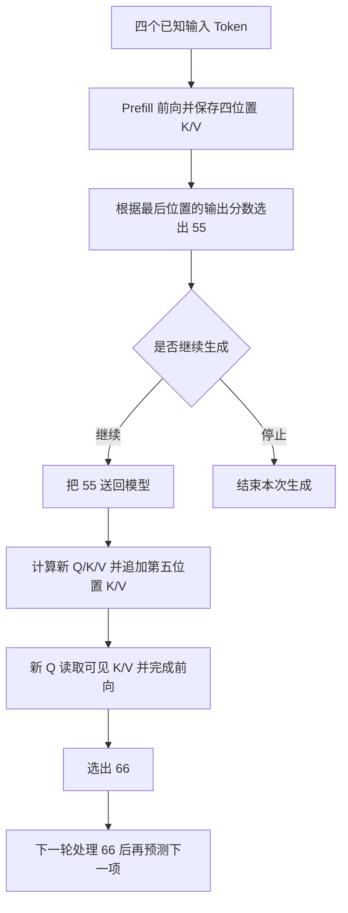

# KV Cache 与 Prompt Cache：保存了什么，何时才能复用

你把同一份长规则交给模型两次，第一次问“适用条件是什么”，第二次问“这个新情况能否申请”。第二次如果命中了缓存，模型是不是直接把第一次的答案交回来？规则已经缓存了，是不是也不再占上下文窗口？

要回答这两个问题，先看另一个更小的细节：模型读完四个 Token，选出了第五个 Token。此刻缓存里到底有四个位置，还是五个位置？

这篇文章对应《AI学习目录》第十阶段“理解速度、显存与费用”的第 26 课《KV Cache 与 Prompt Cache》。我们从四个 Token 的生成过程开始，先看缓存保存什么、何时增长，再把同一条过程延伸到两次请求。

学完后，你应能独立完成五件事：

1. 区分 Prefill 处理已知输入与 Decode 逐步处理新 Token。
2. 说明历史 K/V 为什么可以保存，以及新 Q 为什么仍要读取历史。
3. 区分选出一个新 Token 与再次前向计算后追加它的 K/V。
4. 区分同一次请求内的复用与跨请求的稳定前缀复用。
5. 解释为什么缓存不是旧答案库，也不会释放全部上下文窗口或消除后续计算。

最低先修是第 03 课的逐 Token 生成、第 05 课的 Q/K/V，以及第 06 课的因果可见范围。下面会补齐理解本例必需的概念；第 24—25 课的训练内容不是本课硬先修。

文中的 Token ID、四个位置和显存配置沿用课程教学设置，迁移题也按这些规则构造。它们不是真实模型的分词、输出或显存实测。基础达标以能独立完成文末题目并解释理由为准；显存公式放在可选进阶，首遍可以跳过。

## 一、先分清编号、计算状态与下一项选择

### 1. Token ID 只是编号，还不是 K/V

Token 是模型处理文本的单位，Token ID 是这个单位在词表中的编号。编号先用于查找输入表示，再经过模型计算。下面只使用编号展示顺序，不给它们虚构真实词义：

```text
输入位置：  1   2   3   4
Token ID： 11  22  33  44
```

在注意力层中，每个位置的表示会被投影成三类向量：

| 对象 | 当前步骤的用途 | 后续步骤怎样使用 |
| --- | --- | --- |
| Query，查询向量，简称 Q | 与可见位置的 K 计算匹配分数 | 下一位置会使用自己的新 Q |
| Key，键向量，简称 K | 参与匹配，帮助计算注意力权重 | 后来的 Q 仍可读取它 |
| Value，值向量，简称 V | 按注意力权重参与加权汇总 | 后来的位置仍可汇总它 |

Q、K、V 都是模型算出的数值向量。它们不是用户写在提示词里的三个字段，也不是保存文字的三个文件夹。真实模型有多层注意力，各层分别保存自己的 K/V，不能把一个 Token 理解成全模型只有一对向量。[^缓存说明]

### 2. 前向计算与选出下一项是相邻的两步

一次前向计算，是让已有输入经过模型各层，得到输出分数等结果。这里把针对下一项的词表分数称为 Logits；生成策略根据这些分数选择下一 Token，例如按概率采样，或取分数最高的项。

本例规定，模型处理完四个输入位置后，选择出的下一 Token ID 是 `55`。这个选择是教学给定结果，我们没有提供模型权重和 Logits，因此不尝试推导为什么一定选 `55`。

**选出了编号，不等于已经算出了这个编号所在新位置的 K/V**。`55` 还要作为下一轮输入，连同已有缓存进入模型，才会得到第五位置的计算状态。

## 二、Prefill：先处理四个已知位置

Prefill 通常译为预填充：完整输入已经给定，模型先处理这些已知 Token，为后续生成建立计算状态。没有可用前缀缓存时，本例先处理 `11、22、33、44` 四个位置。[^生成阶段]

这些输入都已知，因此可以在一次前向中批量处理。批量处理不等于取消因果限制。在本例的因果注意力中，当前位置只能看自己和前面的内容：

| 正在处理的位置 | 可见位置 |
| --- | --- |
| 1 | 1 |
| 2 | 1、2 |
| 3 | 1、2、3 |
| 4 | 1、2、3、4 |

未来位置被因果遮罩挡住。第四位置不能借用尚未产生的第五位置来预测第五项。

完成这次前向后，各注意力层已经得到四个位置的 K/V。将它们保存起来，就是后续解码可用的 KV Cache，中文称键值缓存。

```text
Prefill 前向完成后：

当前序列： [11] [22] [33] [44]
已有 K/V： [有] [有] [有] [有]
缓存位置数：4
```

KV Cache 保存的是**已经处理过的位置对应的 K/V 计算状态**。它既包含处理过的输入位置，也可以包含之后处理过的输出位置，不能只说它保存“已经生成的输出”。

接着，我们使用第四位置的输出分数，选出第一项输出 `55`：

```text
选出 55，但尚未把它送回模型：

当前序列： [11] [22] [33] [44] [55]
已有 K/V： [有] [有] [有] [有] [无]
序列位置数：5
缓存位置数：4
```

现在屏幕上可以出现新输出，但第五位置的 K/V 还没算过。对“缓存里有几项”作判断时，必须说明正在观察哪个时刻。

## 三、Decode：送回第五项，计算它自己的状态

Decode 通常译为解码。这里讨论普通的逐 Token 自回归解码：把刚选出的 Token 送回模型，处理这个新位置，再预测下一 Token。第六项要依赖第五项，因此不能预先把所有未知输出当成已知输入一起处理。[^生成阶段]

### 1. 第五位置怎样进入缓存

把 `55` 作为第五位置送入模型后，在每一层注意力中进行以下过程：

1. 根据该层第五位置的输入表示，计算新的 Q、K、V。
2. 将第五位置的新 K/V 与已有四个位置的 K/V 结合。
3. 用第五位置的新 Q 与位置 1—5 的 K 计算注意力分数，再汇总对应的 V。
4. 完成该层后续计算，继续进入其他层；前向结束后得到用于预测第六项的输出分数。

这里第五位置也可以看自己，因此本步使用的 K/V 包括新位置自己的 K/V。不是只与前四项匹配，也不是先跳过注意力、直接将缓存当答案。[^缓存说明]

```text
55 的前向完成，尚未选择第六项：

当前序列： [11] [22] [33] [44] [55]
已有 K/V： [有] [有] [有] [有] [有]
序列位置数：5
缓存位置数：5
```

再规定本步选出的第六项是 `66`。选出后而未再次前向时，序列有六个位置，缓存仍是五个位置：

```text
选出 66，但尚未把它送回模型：

当前序列： [11] [22] [33] [44] [55] [66]
已有 K/V： [有] [有] [有] [有] [有] [无]
序列位置数：6
缓存位置数：5
```

可以把循环画成下面这样：



图中“追加”表达逻辑上多出一个有效位置，不要求服务必须用某一种数组拼接方式实现。静态预分配缓存可以早已留好空间，但留出空间不等于该位置已经写入有效 K/V。

### 2. 为什么最后一个输出可能不在缓存里

如果生成在选出 `66` 后结束，就没有为了预测下一项而处理 `66` 的必要。在这个普通解码示例中，最后一项已输出，但还没有自己的 K/V。

因此，**序列位置数和已缓存位置数可以相差一**。这个结论依赖具体时刻与本例流程：先前所有输入都已处理，每次只选一项，刚选出的最后一项还没再次前向。

不能把它扩写为所有模型、所有推理实现始终相差一。投机解码、不同的缓存更新与停止流程需要分别核对。本课先把普通循环讲清，不要求掌握这些后续机制。

## 四、省掉旧计算，为什么还要读取历史

### 1. 旧 K/V 为什么能保持可用

在本例的因果结构下，第一位置看不到第二位置以后，第四位置看不到第五位置以后。追加第五项不会反过来改变前四个位置原来可见的前文。

当模型权重、已有前缀、位置、遮罩等影响这些状态的条件保持一致时，旧位置的 K/V 可以复用。缓存将已经算好的结果留下来，使后续步骤无需重新处理这些旧位置。[^缓存说明]

但是，这不意味着“同一个 Token ID 永远只有同一份 K/V”。某个编号放在不同位置或不同前文之后，各层的状态可能不同。缓存身份不能只由这个编号决定。[^生成阶段]

### 2. 新 Q 的问题仍要重新问一遍

处理第五位置时，我们要得到第五位置的结果，所以需要第五位置自己的 Q。第四位置的 Q 只帮助计算第四位置的结果，不能代替它。

假设当前缓存保存前四个位置的 K/V，我们处理 `55` 时仍要：

- 计算第五位置的 Q/K/V。
- 让新 Q 与可见 K 匹配，得到本步的注意力权重。
- 读取对应 V 并完成加权汇总。
- 继续执行前馈网络等后续运算，得到下一项分数。

过去使用过的 Q 不是本步需要重新保存、重新计算的历史对象。缓存的重点在于让历史 K/V 供新的查询读取。

| 对本步工作的判断 | 是否正确 | 原因 |
| --- | --- | --- |
| 不必从头重算前四个位置的 K/V | 正确 | 在上述固定条件下，旧状态可以复用 |
| 不必计算第五位置的 Q/K/V | 错误 | 新位置还没有自己的计算状态 |
| 不必读取旧 K/V | 错误 | 新 Q 仍要结合可见历史 |
| 可以跳过模型其余全部运算 | 错误 | 注意力汇总、后续网络和下一项选择仍要进行 |

**KV Cache 省的是历史处理的重复，不是取消当前步骤对历史的使用**。在保存完整历史的普通注意力中，可见历史越长，新 Q 需要处理的 K/V 也越多；缓存本身还会占用存储。

资料中的平方与线性复杂度比较，描述的是相应计算随长度的变化。它不能直接转成“有一万个 Token 就必然快一万倍”，也不能把命中前缀的重复计算省略说成整个请求没有成本。

## 五、Prompt Cache：把稳定开头留给另一条请求

### 1. 请求内复用与跨请求复用

前面的 KV Cache 让同一次请求的后续解码使用已有状态。接下来换一个范围：第二条请求能否复用第一条请求处理过的输入前缀？

Prompt Cache，提示词缓存，在本课所讨论的机制中，是服务将相同前缀的计算状态保留并用于后续请求。它主要省去这个前缀重复进行的 Prefill。[^共享前缀]

| 比较项 | 请求内的 KV Cache 复用 | 跨请求的 Prompt Cache 复用 |
| --- | --- | --- |
| 发生在什么范围 | 一次请求的连续生成过程中 | 不同请求之间 |
| 复用什么 | 已处理位置的 K/V | 已处理且匹配的稳定前缀状态 |
| 怎样继续 | 新位置计算 K/V，当前 Q 读取缓存 | 复用命中前缀，处理本次剩余输入并生成 |
| 还要做什么 | 当前位置和后续位置的计算 | 新后缀、当前查询、输出生成等计算 |
| 保留多久 | 为本次生成保留；之后能否继续保留由服务决定 | 取决于服务的有效期、容量、淘汰与匹配策略 |

这两列是在比较复用范围。跨请求前缀状态与本次请求的 KV 状态可以由同一套服务存储管理承接，并非一定是两块完全无关的缓存。

### 2. 从第一个位置开始逐项比较

下面另起一个跨请求例子。这里两行中的五个编号都是各自请求预先提供的输入，不是上一节的输出时间线：

```text
请求甲输入： [11] [22] [33] [44] [55]
请求乙输入： [11] [22] [33] [66] [77]

相同开头：   11   22   33
开始分歧：                  44 与 66
```

假设请求甲的前五个位置已处理，并且服务保留了可供复用的状态。我们从头比较：第一、第二、第三项相同，第四项不同，所以最长公共前缀有三个位置。

在匹配条件满足、且实现允许复用这段前缀的教学前提下，请求乙可以使用位置 1—3 的状态。它仍需处理自己的第四、第五项 `66、77`。这些新位置的 Q 仍会读取前缀 K/V，然后模型依据乙的完整输入生成输出。

**相同前缀给出了可能复用的范围，还不能单独证明实际命中**。真实服务还需要检查缓存条目是否存在、是否有效、模型与配置是否匹配，以及它自己的匹配粒度或长度条件。服务若按完整块复用，也未必恰好复用三个位置。

因此，这组五项教学序列只能用于理解最长公共前缀；不能据此宣称某个商业平台一定会给这么短的输入提供缓存优惠。

### 3. 相同尾部为什么不能接回旧状态

沿用同一组编号，再构造一个迁移输入：

```text
请求甲输入： [11] [22] [33] [44] [55]
新请求输入： [11] [66] [33] [44] [55]
```

只有第一项是相同开头。第二项已经变了，后面的 `33、44、55` 即使编号相同，也位于不同前文之后，不能仅凭相同编号复用甲的对应旧状态。

前缀复用匹配的是**从开头连续一致的 Token 序列**，不是语义相近、几个相同词，或任意位置出现过的一段文字。

实际请求还可能包含系统规则、消息格式和工具定义等。需要比较模型真正收到的有效前缀，不能只看屏幕上两条用户问题是否一样。固定前缀与本次动态问题可以分开组织，但不能为了提高命中而丢掉必要条件或改变请求含义。

## 六、缓存命中后，哪些事情仍然存在

### 1. 新问题仍然决定新答案

回到开篇的长规则：第一次问适用条件，第二次问一个新情况。即使规则前缀完全相同并已命中，第二个问题仍会参与前向计算；输出还受到完整上下文与生成策略影响。

所以，“缓存命中，第二次答案必然等于第一次”不成立。两个答案可能相同，也可能不同；缓存命中本身没有给出这个保证。

答案缓存则是另一种应用设计，例如用完整请求作为键，查找之前保存的响应。它复用的是已有答案，是否适合当前请求还要检查业务条件。不能把这个机制与计算状态缓存混为一谈。

### 2. 缓存不是知识更新或长期经验

KV 状态让模型在本次计算中继续使用已有上下文，不会因为保存了这些状态就自动更新模型权重，也不等于建立可长期检索的新知识库。

如果规则更新，应用仍需要提供正确版本；不能为了命中旧前缀继续使用失效材料。缓存过期后能否重新使用规则，也取决于应用有没有保留和重新提供它，而非模型已经通过缓存永久学会。

### 3. 节省 Prefill，不等于释放上下文窗口

上下文窗口限制模型这次能处理的上下文范围；缓存负责复用处理结果。这是两个不同问题。

缓存里的前缀虽然无需重复计算，仍然是本次上下文的一部分，新 Q 仍要在允许范围内使用它。把四个位置的 K/V 留下来，并没有让四个位置从序列中消失。

因此，启用缓存不能直接将一个超出窗口的请求变成合法请求。文本压缩、检索选择、滑动窗口等机制需要另外分析，其中有些会改变模型可见内容或使用历史的方式。

### 4. 计算、存储与账单要分别核对

缓存保存的状态占用存储。在保存完整历史的普通结构中，已缓存位置增加，有效 K/V 数据量也增加。某些服务会将状态迁移到其他存储层，或采用压缩、量化、滑窗等策略；不能把一种实现外推到所有服务。

命中前缀可能减少重复输入处理，但仍有缓存读取、新后缀处理、输出生成与服务调度。API 是否按缓存读取单独计费、是否有写入费用、哪些输入符合条件，要查相应平台当时的规则。

**省重复计算，不能直接推出所有 Token 免费或整个任务成本降为零**。本课不提供当前价格、固定有效期或加速比例；这些需要指定平台、版本和真实负载后再核验。

## 七、合上正文，独立检查五件事

以下均按本文的普通因果逐 Token 解码规则作答，不使用投机解码或滑动窗口。先作答，再看下一节。

### 题 1：给四个时刻标明阶段与缓存位置

输入是 `11、22、33、44`。依次观察：

1. 四个输入位置的前向刚结束，尚未选第一项输出。
2. 选出了 `55`，尚未把它送回模型。
3. `55` 的前向刚结束，尚未选第六项。
4. 选出了 `66`，尚未把它送回模型。

分别写出当前序列位置数和有效缓存位置数。哪次前向属于 Prefill？哪次属于 Decode？解释第一次输出为什么能在处理 `55` 之前产生。

### 题 2：纠正“只留旧 Q 就够了”

有人说：“第五位置可以沿用第四位置的 Q。历史 K/V 有缓存，所以第五位置也不用读取它们；只要追加一个编号，就能得到下一项。”

指出三处错误，并按本课顺序说明第五位置真正需要进行的注意力计算。

### 题 3：换输入长度，判断最后一项是否已入缓存

新请求有六个输入 Token，已完成 Prefill。之后连续选出三项输出，每次只选一项；前两项都已送回模型完成前向，第三项刚选出、尚未送回。

此刻序列共有多少个位置？有效 K/V 缓存有多少个位置？如果把第三项送回并完成前向，但暂不选择第四项，两个数各是多少？

### 题 4：相同前缀、相同尾部与实际命中

请求甲的五项输入 `11、22、33、44、55` 已处理。

- 请求乙输入：`11、22、33、66、77`。
- 请求丙输入：`11、66、33、44、55`。

在状态相关条件一致的前提下，分别找出最长公共前缀，以及各自仍需处理的输入后缀。丙的最后三项编号相同，能否直接复用甲的这些位置？

再说明：上述比较是否足以证明某个真实服务已经命中缓存？如果不足，还缺哪些信息？

### 题 5：判断一次“全都省了”的推断

第二条请求命中了同一份长规则前缀，但提出了不同问题。有人据此断言：

1. 服务器一定返回第一条请求的旧答案。
2. 规则不再占上下文窗口，可以不受窗口限制地追加输入。
3. 新问题与输出都不需要计算。
4. 缓存涉及的所有 Token 都不会产生任何费用。

逐项判断，并分别说明正确的边界。还要回答：保存规则的 K/V 是否等于模型通过训练学会了这份规则？

## 八、参考答案与过关点

### 题 1：前向建立状态，选择产生新编号

| 时刻 | 序列位置数 | 有效缓存位置数 | 当时发生的事 |
| --- | --- | --- | --- |
| 四项输入前向结束 | 4 | 4 | Prefill 完成 |
| 选出 55，尚未送回 | 5 | 4 | 选择第一项输出 |
| 55 的前向结束 | 5 | 5 | Decode 处理第五位置 |
| 选出 66，尚未送回 | 6 | 5 | 选择第二项输出 |

Prefill 最后位置的输出分数已经能用于选择第一项输出。`55` 是这次选择的结果，随后才作为新输入参与预测第六项，不需要先计算 `55` 的 K/V 才能选出它。

**过关点**：能按时刻填对两列，并区分前向和选择；不能把“屏幕出现 Token”当成“该位置已经缓存”。答错时回读第二、三节。

### 题 2：当前 Q 读取旧 K/V 与新 K/V

三处错误是：旧 Q 不代表第五位置的查询；旧 K/V 仍需要被当前查询读取；追加编号不能代替向量计算和整个前向过程。

正确顺序是：在各层计算第五位置自己的 Q/K/V，结合前四位置缓存与第五位置新 K/V，用第五位置 Q 对位置 1—5 的 K 计算分数和权重，再汇总 V；继续完成后续网络计算，取得预测下一项的分数。

不必重新计算的是固定条件下前四位置的旧 K/V，而不是新位置的状态，也不是本步的注意力读取。

**过关点**：能说清“省掉什么”和“还要做什么”，并指出本步包含第五位置自身。答错时回读第一、三、四节。

### 题 3：六项输入加三项输出，最后一项尚未处理

序列有 `6+3=9` 个位置。六项输入与前两项输出已经处理，所以有效缓存有 `6+2=8` 个位置。最后选出的第三项还没有自己的 K/V。

把第三项送回并完成前向、暂不选择下一项后，序列仍有 9 个位置，缓存增长到 9 个位置。如果随后再选出第四项而尚未处理，才变成序列 10、缓存 9。

**过关点**：能根据“已选出”和“已处理”的数量分别计数，而非套用四项主例的结果。答错时回读第三节的两行状态。

### 题 4：只能沿相同开头匹配

乙与甲的最长公共前缀是 `11、22、33`，长度为 3；乙仍需处理的后缀是 `66、77`。

丙与甲的最长公共前缀是 `11`，长度为 1；丙仍需处理的后缀是 `66、33、44、55`。丙第二位置变了，后三项位于不同前文之后，不能只凭相同编号接回甲的旧状态。

公共前缀给出的是符合上述计算前提时的匹配范围。实际命中还要检查：服务是否支持相应复用，状态是否曾保存且仍有效，模型与影响状态的配置是否一致，以及服务采用什么长度、块粒度等匹配规则。

这些服务信息没有给出，就不能写成“乙实际命中了三个 Token”。应查看相应服务文档，并检查该次请求实际提供的缓存命中记录或计量结果；若没有记录，就保留无法确认的边界。

**过关点**：能算出 3 与 1，解释为何相同尾部不能直接复用，并分开理论匹配范围与实际命中证据。答错时回读第五节。

### 题 5：四项断言都超出了缓存机制

1. 不保证返回旧答案。复用的是前缀计算状态，新问题和生成策略仍影响回答。
2. 不释放全部窗口。前缀仍属于本次上下文；缓存不会让任意长度的请求自动合法。
3. 不消除后续计算。新后缀要前向，当前 Q 要使用 K/V，输出仍要生成。
4. 不保证免费。是否有缓存读取、写入或其他费用取决于具体平台当时的计费条件；计算省略与商业计价不能直接画等号。

保存 K/V 也不等于训练更新权重。它让已有上下文的计算状态被复用，不代表模型永久学会了这份规则。

**过关点**：能分别解释答案、窗口、计算和账单四个边界，并区分计算状态与训练所得能力。答错时回读第六节。

能独立完成这五题并解释理由，才说明本课的基础目标已得到检查。阅读完成、记住名称或程序运行成功，都不能单独替代这些行为。

## 九、可选进阶：从位置数算到向量形状和字节

这一节不承担基础达标。它继续使用课程配置，让你核对“缓存变长”究竟增加了什么。

### 1. 单头形状：四行变五行，当前查询仍是一行

先只看一层、一个头，每个向量有 8 个数字。一行表示一个位置，`[行数, 每行数字数]` 表示形状。

处理四项输入时：

```text
Q：[4,8]
K：[4,8]
V：[4,8]

Q 与所有 K 的匹配分数形状：[4,4]
因果遮罩让每行只能使用自己及前面的列。
```

这个分数形状用于描述逻辑上的注意力关系，不保证实现必须在显存中完整存一张分数表。

把第五项送回模型时：

```text
第五位置的新 Q：[1,8]
第五位置的新 K：[1,8]
第五位置的新 V：[1,8]

旧 K/V 各有：[4,8]
加入第五位置后，K/V 各有：[5,8]
第五位置与五个可见位置的分数形状：[1,5]
```

因此“只处理新位置”与“仍使用历史”同时成立：新 Q 只有一行，供它读取的 K/V 有五行。完整历史结构下，缓存随已处理位置增长；静态或滑窗缓存的空间与更新方式需另行区分。[^缓存说明]

### 2. 显存公式里的每一项是什么

对各层配置相同、保存完整历史的常规注意力，单请求有效 K/V 数据量可按下式计算：

```text
KV 字节数 = 2 × L × h_kv × d_h × n × s

2：Key 和 Value 两份
L：保存 KV 的注意力层数
h_kv：每层的 KV 头数
d_h：每个头的向量维度
n：已经缓存的有效位置数
s：每个数字所占字节数

KiB = 字节数 / 1,024
MiB = 字节数 / 1,048,576
```

按“每位置每头有多少数字 → 每层有多少头 → 共有多少层和位置 → 每数字多少字节”逐项相乘，就能理解公式。注意其中使用 KV 头数，未必是 Query 头数。[^存储依据]

以下另用课程的显存教学配置，缓存长度是 128，不是前面四项主例：

```text
L=4，Query 头数=8，h_kv=2，d_h=8，n=128，s=2

KV 字节数
= 2×4×2×8×128×2
= 32,768 字节
= 32 KiB
= 0.03125 MiB

每多缓存一个位置：
2×4×2×8×2 = 256 字节
```

这个结果只统计有效 K/V 数值，不包括模型权重、其他激活、元数据、预留空间、分配碎片和算子工作区。它也没有声明这些状态在所有实现里都完全驻留 GPU。

### 3. MHA、GQA、MQA：共享 KV 头的结构对照

注意力头可以理解为并行使用的多组投影与汇总。在这里固定 8 个 Query 头，比较它们分别需要保存多少组 K/V：

- MHA，Multi-Head Attention，多头注意力：各 Query 头对应自己的 KV 头，保存 8 组。
- GQA，Grouped-Query Attention，分组查询注意力：Query 头分组，组内共享 K/V；本例有 2 个 KV 头，每组对应 4 个 Query 头。
- MQA，Multi-Query Attention，多查询注意力：所有 Query 头共享 1 个 KV 头。

GQA 使用介于单个 KV 头与 Query 头数之间的 KV 头数。它是模型的注意力结构，不能理解为任意线上模型都能直接切换的缓存开关。[^分组查询]

保持上节层数、头维度、缓存位置和精度相同，只改变 KV 头数：

| 结构 | Query 头数 | KV 头数 | 单请求有效 KV |
| --- | --- | --- | --- |
| MHA | 8 | 8 | 128 KiB，即 0.125 MiB |
| GQA | 8 | 2 | 32 KiB，即 0.03125 MiB |
| MQA | 8 | 1 | 16 KiB，即 0.015625 MiB |

表格说明存储口径，不据此给三个真实模型的质量、延迟或吞吐排名。三个同长度、互不共享的 GQA 请求，有效 KV 合计为 `3×32=96 KiB`；物理分配若有额外预留，还要另算。

### 4. 进阶迁移练习与推导

先独立计算：`L=8、h_kv=2、d_h=64、n=1024、s=2`，单请求有效 KV 多大？已缓存位置数翻倍时呢？随后三个同长度且互不共享的请求并发，又是多少？

按同一公式：

```text
单请求：
2×8×2×64×1024×2
= 4,194,304 字节
= 4 MiB

缓存位置数翻倍为 2048：
4×2 = 8 MiB

三个互不共享、均缓存 2048 个位置的请求：
8×3 = 24 MiB
```

这里三个请求是在长度翻倍后的配置上合计；若都仍为 1024 个位置，则合计是 `3×4=12 MiB`。

**进阶过关点**：能明确先变长度、再变并发，保留二进制单位与“只算有效 K/V”的限制。不能拿 24 MiB 直接断言某块 GPU 一定容纳得下整个模型服务。

公式也不直接覆盖所有滑动窗口、压缩潜缓存或混合层结构。遇到不同实现，应读取它实际保存哪些状态、各层长度和精度，而不是套用一个统一系数。

## 十、下一课接着问：状态怎样更高效地计算和存放

我们已经沿同一条生成链看清：输入先经过 Prefill，选出的新 Token 再进入 Decode；历史 K/V 被保留，新 Q 仍读取它们。跨请求复用则把相同前缀的已有计算接到新后缀之前，后续生成仍继续。

第 27 课《三种优化，三个改动位置》会分别讨论 FlashAttention、PagedAttention 与 RadixAttention 怎样改变数据搬运、存储分配和公共前缀查找，并与 GQA 的 KV 头共享作对照。先知道各自改动哪里，再讨论实际收益；不能仅凭一个组件名字推断整个任务按同样比例加速。

## 依据与回查

课程定位、五项掌握目标、Token ID 时间线、两条请求序列和显存算例来自《AI学习目录》第 26 课及《32课学习设计与掌握目标》。迁移题按已说明规则构造；这些课程设计没有提供公开发布地址，因此这里只列文字标题。

公开机制依据的核对日期为 2026 年 10 月 10 日。下面分别说明实际读取范围，不把链接打开或论文结果当成本文的模型实验：

[^缓存说明]: Hugging Face 官方 [How caching works](https://huggingface.co/docs/transformers/en/cache_explanation)，本次页面版本选择器显示 v5.19.0。已读取正文中的 Attention matrices、Cache class、Cache storage implementation 与生成循环示例，核对因果状态复用、各层缓存、当前 Q 与历史和当前 K/V、以及先前向再选择下一项的顺序。本文没有运行该页面的模型代码。

[^生成阶段]: [Efficient Memory Management for Large Language Model Serving with PagedAttention](https://arxiv.org/html/2309.06180)，第 2.2 节 LLM Service & Autoregressive Generation。已读取该节，核对已知输入的批量处理、后续输入一项预测下一项，以及状态受已有前文和位置影响。本文未复现论文性能实验。

[^共享前缀]: 同一篇 [PagedAttention 论文](https://arxiv.org/html/2309.06180)，第 4.4 节中的 Shared prefix。已读取对应前缀共享说明；它支持复用前缀后仍需处理任务输入，不证明所有服务都有相同命中条件或计费政策。

[^存储依据]: 同一篇 [PagedAttention 论文](https://arxiv.org/html/2309.06180)，第 3 节 Memory Challenges in LLM Serving。已读取 KV 数据量和存储管理限制；本文的 32 KiB、4 MiB 等数字来自课程教学配置，不是论文模型的测量值。

[^分组查询]: [GQA: Training Generalized Multi-Query Transformer Models from Multi-Head Checkpoints](https://arxiv.org/abs/2305.13245)，本次摘要页显示 v3，最后修订于 2023 年 12 月 23 日。已核对摘要对 MQA 与 GQA 的 KV 头数说明，未复现其训练、质量或速度实验。每组共享的结构说明也与已完整阅读的课程相关原始资料对照。

背景讲解另回查以下原始来源：

- [提示词缓存里到底存了什么？和 KV Cache 有什么区别？](https://www.bilibili.com/video/BV1DsG76AEEc)：请求内与跨请求计算状态复用。本文完整读取的是已归档文字资料，没有重新逐段播放视频。
- [KV Cache 真正在 GPU 上占用多少显存？多头注意力是什么？](https://www.bilibili.com/video/BV1reKb6PEnw)：KV 头、层数、精度与存储公式。本文未采用视频中的真实模型配置估计线上占用。
- [同样 100 万 Token，为什么有的模型贵 30 倍？大模型 API 到底在卖什么？](https://www.bilibili.com/video/BV1e17y6wEy5)：输入、输出、缓存与任务成本的区分。本文未采用归档价格数字，也未查询或比较当前产品报价。

本次核验包括目标覆盖、正文与答案复核、课程算例复算、公开机制依据核对和本地 Markdown 渲染检查。未执行真实模型推理、跨请求命中测试、GPU 显存测量或发布平台预览；教学计算不能证明真实服务的命中率、延迟与费用收益。本文也未经真实新手试读，不承诺只读完就一定掌握。
