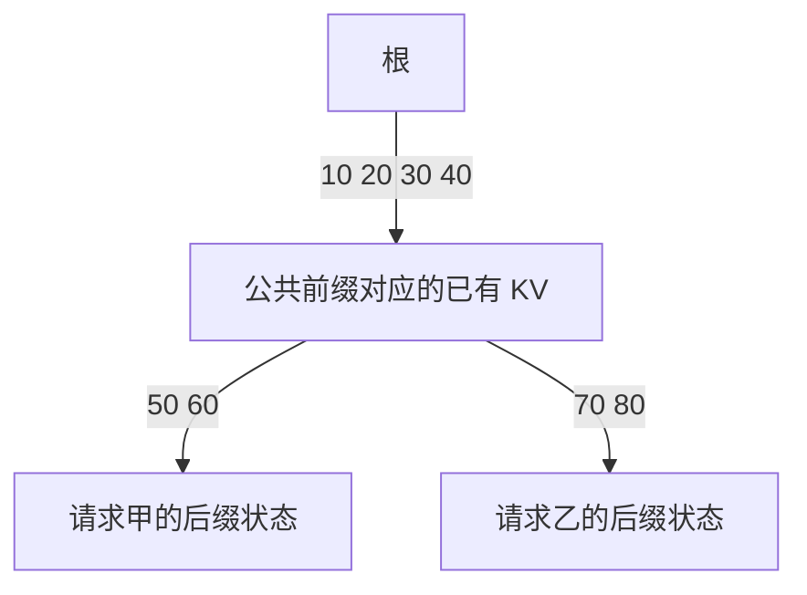

# FlashAttention、PagedAttention 与 RadixAttention：三种优化分别改哪里

模型已经把历史位置的 Key 和 Value 存在 KV Cache 里，为什么推理服务还需要 FlashAttention、PagedAttention 和 RadixAttention？它们是不是都在“压缩缓存”，装上之后就能按相同比例提速？

先看一个具体问题：一条请求已经缓存了 10 个位置。如果每块空间能装 4 个位置，应该分配几块？这些块必须紧挨着吗？另一条请求的开头相同，怎样判断哪些计算和空间可以复用？

回答这些问题，需要把计算过程、存储分配和前缀查找分开。

本文对应《AI学习目录》第十阶段“理解速度、显存与费用”的第 27 课《三种优化，三个改动位置》。标题中的三种指 FlashAttention、PagedAttention 和 RadixAttention；GQA 从第 26 课承接过来，作为注意力结构的对照。因此本文会比较四个名字，但不把它们当成四种相同的缓存开关。

学完后，你应能独立完成五件事：

1. 分清 GQA 的 KV 头共享、FlashAttention 的中间数据搬运、PagedAttention 的存储块管理和 RadixAttention 的公共前缀查找。
2. 解释为什么 FlashAttention 的加速不等于删除大量标准注意力连接。
3. 画出逻辑块到物理块的映射，计算尾块未满时的占用。
4. 区分相同 Token 前缀与语义相近，并说明查找范围和实际复用粒度的关系。
5. 说明怎样在实际硬件、负载、质量和延迟条件下检验收益。

最低先修是第 05—06 课的注意力计算，以及第 26 课的 KV 存储与前缀复用。下面先补齐必要概念；你不用先懂 GPU 内核编程才能跟上主例。

本文的格子、物理块编号、Token ID 和数学数字来自课程教学设置，迁移题按同一规则构造。它们不是真实服务的默认配置、实际分词或性能测量。基础目标以文末独立自测检查；在线 Softmax 的算术与缓存保护放在选读中。

## 一、先认识要优化的三个对象

### 1. 注意力的计算：从匹配到加权汇总

Token 是模型处理文本的单位，Token ID 是词表编号。一个位置的表示经过投影得到 Query、Key、Value，简称 Q、K、V：当前 Q 与可见位置的 K 计算匹配分数，Softmax 将分数归一化为权重，再按权重汇总 V。

Softmax 可以先理解为“将一组分数变成总和为 1 的非负权重”。理解本课主线，不必先推导它的指数公式。

这些向量都是计算状态。KV Cache 保存已经处理过的各位置 K/V；后续位置用自己的新 Q 读取它们。因果注意力仍限制当前位置只能看自己及以前位置。

处理已有完整输入通常称为 Prefill，预填充；之后把刚选出的 Token 送回模型、处理新位置并预测下一项，属于逐 Token Decode，解码。缓存省去旧位置的重复处理，当前计算和历史读取仍然存在。

### 2. 注意力的中间表与历史 KV 不是同一份数据

如果批量处理 1024 个已知位置，每行放一个 Q，和各位置 K 匹配，就能用一张 `1024×1024` 的分数表描述两两关系。另一张同形状表表示归一化后的权重。因果遮罩会使未来位置不可见。

这是注意力计算中的中间结果。历史 KV 则是之后解码继续使用的 K/V 向量。优化中间表的写回，不等于将历史 KV 删除。

下一项问题也不同：即便知道要保存哪些 KV，还要安排它们在物理存储中的位置，并判断新请求是否能用已有前缀。这分别对应分配与查找。

### 3. 一格代表一个位置的 KV，不代表一段文字

后文的格子用于表示可保存一个 Token 位置对应 KV 的容量。真实位置的状态涉及多层和 KV 头，这里把它们缩成一个格子，便于先看分配关系。

格子里写“位置 1”，表示它所对应的 KV，不是把原文第一个字放进显存。块编号也只是地址标签，不能据其大小推断 Token 的先后顺序。

## 二、先给四个名字标出改动位置

| 机制 | 主要处理对象 | 改变哪一步 | 后续仍然需要什么 |
| --- | --- | --- | --- |
| GQA | 注意力中的 Query 头与 KV 头 | 多个 Query 头共享较少的 KV 头 | 新 Q 的计算与对相应 KV 的注意力读取 |
| FlashAttention | 注意力计算的中间结果 | 分块、融合计算，减少完整中间表在显存中的写回和读取 | 原注意力允许连接上的计算与统一归一化 |
| PagedAttention | KV 的物理存储块 | 用块表连接逻辑顺序和分散物理块，按需分配 | 对有效 KV 的正确读取、尾块管理和共享保护 |
| RadixAttention | Token 前缀与已有 KV 的对应关系 | 用前缀树查找、插入和管理可复用状态 | 计算未命中的后缀并继续生成 |

这张表是后面案例的地图。它们可以在支持相应机制的系统中组合，因为解决的问题不同；是否能在某个具体模型和后端上组合，要查它实际支持的配置。

### GQA：减少 KV 头数，不是挑几个历史 Token 丢掉

一个注意力头是一组并行的投影和汇总。沿用上一课的结构对照：共有 8 个 Query 头。

```text
MHA：8 个 Query 头，各自对应 KV 头，共 8 个 KV 头。
GQA：8 个 Query 头分成 2 组，每组 4 个，共享组内的 KV 头。
     因此共 2 个 KV 头。
MQA：8 个 Query 头全部共享 1 个 KV 头。
```

MHA 是 Multi-Head Attention，多头注意力；GQA 是 Grouped-Query Attention，分组查询注意力；MQA 是 Multi-Query Attention，多查询注意力。GQA 的 KV 头数处于单个 KV 头与 Query 头数之间。[^头共享]

本例从 8 个 KV 头变成 2 个，改变的是每个位置保存多少组 K/V，没有因为共享就把 10 个历史位置变成 2 个位置。原来不同 KV 头也不应被想象成必然完全相同的文字副本。

这是模型注意力结构的差异，不是任意已部署模型都能直接打开的无损缓存设置。单看头数，也不能判断两个真实模型谁的质量更高或整个请求快多少。

## 三、FlashAttention：同一份注意力结果，换一种搬运与计算顺序

### 1. 普通分步执行为什么搬来搬去

先看一个将完整中间表写回显存的标准实现：

```text
计算 Q 与 K 的匹配分数
→ 将完整分数表写回显存
→ 读分数表，计算 Softmax
→ 将完整权重表写回显存
→ 读权重表和 V，计算加权输出
```

GPU 的 HBM 是容量较大的高带宽显存，片上 SRAM 是容量较小、可用于计算小块数据的快速存储。计算单元读取和写回数据需要时间，中间表越大，搬运也可能越显著。[^闪存计算]

沿用课程的纯存储算例：`1024×1024`，假定每个数占 2 字节。

```text
一张完整表：1024×1024×2 = 2,097,152 字节 = 2 MiB
分数表和权重表各一张：各 2 MiB
若两张都按上述形式存储，合计 4 MiB
```

这不是一次真实运行的峰值占用。实际精度、缓冲复用和实现会影响分配；还没计入 Q/K/V、输出、其他层与工作区。也不是所有现代注意力实现都要按上面的朴素顺序执行。

### 2. 分小块计算，及时消费中间结果

FlashAttention 将 Q/K/V 分成适合处理的小块，搬入片上存储，计算局部分数后及时用于汇总；通过在线 Softmax 的累计规则，将各块放到统一归一化基准下合并。算子融合让匹配、归一化与加权汇总在同一计算流程中衔接。

关键收益是避免将完整的分数与概率矩阵物化到 HBM，减少相应中间数据的读写。算法依然读取输入、维护累积状态并写回输出，不能说它完全没有显存访问。

“分块”也不意味着各块自己算一个答案，然后随便取平均。所有参与同一行注意力的分数共同决定归一化分母，所以各块的贡献需要按正确比例合并。具体算术放在第九节选读。

### 3. 不存完整分数表，不等于不计算分数

**FlashAttention 的精确算法改变数据流，不以删掉原注意力连接换取加速**。原本允许参与的连接仍按相同注意力定义处理；如果使用因果遮罩，原本不可见的未来位置仍不可见。

因此不能说：“它快，是因为完全不算注意力分数”或“只剩少数 Token 可以看”。稀疏注意力主动改变参与连接的范围，是另一项机制。原论文也讨论了稀疏扩展，不能将扩展与本文的精确算法混成同一个结论。

在精确数学运算下，它计算同一种输出；浮点计算顺序改变可能造成小数值差异，因此也不能承诺两种实现逐位完全一致。它是否让真实任务更快，要结合硬件、长度、精度和实现测量。

## 四、PagedAttention：逻辑连续，物理空间可以分散

### 1. 为什么整段预留容易浪费

请求还没生成完，最终长度往往未知。如果为每个请求先占下一整段最大长度的空间，许多位置可能一直没用上；如果不同大小的连续区域反复分配与释放，又可能出现“空闲总量足够，但没有足够长的单段空闲区域”。

PagedAttention 借用分页思路，将 KV 分成固定容量块，使注意力可以按映射读取不连续的物理块。请求按需取得块，不要求每条请求的整个 KV 区域物理连续。[^分页映射]

这不排斥服务先建立一个整体 KV 存储池。区别是：池中的块可以分配给不同请求，单个请求无需从开始就独占最大长度的一整段。

### 2. 10 个位置，装进三个 4 格块

教学块大小规定为 4 个 Token 位置；这不是所有服务的默认值。将位置 1—10 按逻辑顺序装入：

```text
逻辑块 1： [位置1] [位置2] [位置3] [位置4]
逻辑块 2： [位置5] [位置6] [位置7] [位置8]
逻辑块 3： [位置9] [位置10] [空] [空]
```

两个块只能放 8 个位置，因此需要第三块。结果是：

```text
有效位置：10
所需块数：3
分配容量：3×4 = 12 个位置
尾块未填位置：12−10 = 2
```

**尾块未满，仍然占用一整个已分配块**。分页缩小了浪费范围，不代表所有请求都没有空位。图中的两个空位还没有有效 K/V，不能当作额外 Token 参与注意力；后续增长时可以按实现规则填入。

### 3. 块表恢复顺序，不靠物理编号排序

按课程设置，三个逻辑块分别放进物理块 7、2、9：

| 逻辑块 | 有效位置 | 对应物理块 | 未填位置 |
| --- | --- | --- | --- |
| 1 | 1—4 | 7 | 0 |
| 2 | 5—8 | 2 | 0 |
| 3 | 9—10 | 9 | 2 |

块表按照逻辑顺序记录为：

```text
逻辑块 1 → 物理块 7
逻辑块 2 → 物理块 2
逻辑块 3 → 物理块 9
```

计算时通过这张映射找到每个逻辑位置的 KV。不能将物理编号排序为 `2、7、9` 来改变上下文顺序，也不必先将三块复制成一整段连续区域。

**PagedAttention 改变 KV 的分配与访问方式，不改变这条请求原来的 Token 顺序**。它也没有仅凭分页就减少 KV 头数或删除历史位置。

## 五、相同前缀怎样共享物理空间

### 1. 先给共享定好条件

现在换成两条长度均为 6 的输入，沿用课程编号：

```text
请求甲： [10] [20] [30] [40] [50] [60]
请求乙： [10] [20] [30] [40] [70] [80]
```

从头比较，前四项相同，第五项开始分歧。下面规定：状态相关条件一致，公共前缀已经处理并可用，教学分配规则只共享相同的完整 4 Token 块。

这些条件下，首块 `10、20、30、40` 可以共用，两个后缀则各自占一个块。模型、前文、位置等影响状态的条件不一致时，不能仅凭编号相同就套用这个结果。[^分页共享]

### 2. 两张块表可以指向同一个首块

| 方案 | 甲的块数 | 乙的块数 | 不重复计数后的物理块数 | 物理容量 |
| --- | --- | --- | --- | --- |
| 两条请求完全不共享 | 2 | 2 | 4 | 16 个位置 |
| 共用完整首块 | 2 | 2 | 3 | 12 个位置 |

共享后，甲和乙在逻辑上都需要两个块，但它们的首块指向同一块物理数据；两个不同后缀另用两块。因此物理上合计三个块。

这里说的 12 是分配容量，不是有 12 个不同的 KV 位置：共享首块占 4 个有效位置，甲后缀占 2 个，乙后缀占 2 个，共有 8 个不同的有效位置，两块尾块各空 2 格。

相比不共享，少分配一块，即 4 格容量。新后缀仍要计算，输出仍要生成；少分配一块不能直接推出请求延迟降低 25%。

### 3. 公共前缀只有三项时，先别混合两种口径

改变乙的第四项，形成迁移输入：

```text
请求甲： [10] [20] [30] [40] [50] [60]
请求乙： [10] [20] [30] [70] [80] [90]
```

最长公共前缀是前三项，长度为 3。但是首个 4 格块已经不完全相同。按本节“只共享完整 4 Token 块”的规则，共享块数为 0，两条请求仍各需两个块，合计四块、16 格容量。

这只说明教学共享规则的结果。不能据此宣称所有 PagedAttention 实现都绝不支持更细的复用；具体策略和粒度要核对实现。

下一节的树可以在 Token 层面找到这三个相同位置。**查出了多长的前缀，与物理上能复用多少，是相关但不同的判断**。

## 六、RadixAttention：沿树找到最长相同开头

### 1. 树存的是前缀与状态位置的对应关系

Radix Tree，基数树，是可以在一条边上保存一段连续元素的前缀树。RadixAttention 用它组织 Token 序列与已有 KV 的对应关系，支持前缀查找、插入、分割和淘汰。[^前缀树]

沿用第五节前四项相同的两条请求，可以画成：



路径上的编号从根开始连起来，还原相应 Token 顺序。节点或边上的索引让服务找到 KV 的实际位置；不能把树本身当作另一份自然语言答案库。

新请求到达时，服务从根沿边逐项匹配。已经匹配的前缀可在条件满足时复用，只为未命中的后缀计算状态，然后继续生成。

### 2. 在第三项处分叉，改变的是索引组织

如果树中原有一条边 `10、20、30、40、50、60`，新请求是 `10、20、30、70、80、90`，就可以把原边拆成公共段 `10、20、30` 和旧后缀 `40、50、60`，再接上新后缀 `70、80、90`。

已有 KV 不需要因为边被拆分，就重新生成一遍。改变的是 Token 段及其状态索引的组织方式；新后缀仍需要处理。

树能识别长度为 3 的公共前缀，若后端同时采用上节“完整 4 Token 块才共享”的限制，则这不自动产生一个可共享完整块。原 SGLang 论文描述了单 Token 页等实现安排，不能把那一版本与所有当前后端视为同一契约。

### 3. 意思相近，不是前缀相同

设两份提示词讲的是同一主题，但没有从头连续相同的 Token 序列。语义相近可以是检索的信号，却不足以让服务直接复用旧 KV。

即使同一段尾部编号再次出现，前面的内容已经不同，它也不能单凭尾部相同接回旧状态。各层 KV 会受到前文、位置和模型配置影响。

匹配还应看模型实际收到的输入，包括消息组织与必要的系统内容，而不是只看显示给用户的句子。真实是否命中，还需要缓存有效性和服务记录；一幅教学树不能代替一次实际请求的命中证据。

### 4. 查找与分配各做什么

RadixAttention 帮助回答“哪个公共前缀已有可用状态”；分页管理帮助回答“状态位于哪些物理空间，后缀怎样分配”。原论文明确说明 RadixAttention 可与分页注意力等机制兼容。[^前缀树]

一些 vLLM 前缀缓存实现使用块哈希查找完整前缀；它是与分页结合的查找方案。不能把某份源码的字段、块大小或哈希规则当作 PagedAttention 在所有版本中的唯一定义，也不能由某个 API 的命中计数步长反推出其服务端物理块大小。

比较两种查找方式时，应明确版本、粒度和负载。本课的任务是看清职责，并没有提供它们在同一条件下的速度排名。

## 七、机制解释清楚后，怎样检验真实收益

知道“改了哪里”之后，还需要确认应用实际在等什么。

| 观察到的问题 | 可以进一步核查的机制 | 需要验证的证据 |
| --- | --- | --- |
| 注意力中间数据搬运明显 | FlashAttention | 当前内核是否启用、耗时与存储读写是否改善 |
| 请求的 KV 预留与分配浪费明显 | PagedAttention | 已分配块、有效位置、尾块浪费及实际并发占用 |
| 多条请求有稳定相同前缀，却反复处理 | 前缀缓存与 RadixAttention 等查找方案 | 实际命中范围、缓存冷热、剩余 Prefill 与查找开销 |
| 每个位置保存多组 KV 带来较大占用 | 模型是否采用 GQA 等结构 | 模型配置、KV 头数、质量与整个任务表现 |

这不是仅凭症状就部署方案的指令。先测量实际瓶颈，再选有明确作用位置的对照。

### 1. 固定任务与合格标准

先固定一批输入、任务判定方法和允许的数值误差。例如，在算子对照中固定 Q/K/V、遮罩与精度，在业务对照中固定资料、问题和正确结果的判定条件。

FlashAttention 与普通执行的对照可以尽量保持相同模型。GQA 是结构差异，如果换了检查点，不能把全部收益归因于一个存储选项；需要同时记录模型变化并重新评估质量。

### 2. 固定会影响结果的运行条件

比较时至少记录硬件、软件与内核版本、模型配置、精度、输入和输出长度、并发与请求到达方式，以及缓存的冷启动和已预热状态。

对前缀复用，还要记录公共前缀比例和实际命中结果。若甲方案用已预热缓存，乙方案用首次冷启动，就不能把差异全部解释为算法本身更快。

### 3. 分开组件测量与完整请求测量

内核耗时、有效 KV 字节数、实际已分配空间、首 Token 等待、请求完成延迟和吞吐是不同指标。吞吐表示单位时间处理多少工作，不保证每个用户更早收到完整结果。

至少同时检查结果合格率与完整请求延迟；按目标再检查内存和吞吐。还需观察实际负载中的延迟分布，而非只选一个最短耗时。

**局部少搬数据、少占空间或多命中前缀，都不能直接当作端到端等比例提速**。这些机制可能组合使用，收益也不能随意相乘。排队、后缀计算、输出生成和工具操作仍可能占据时间。

本课没有部署任何服务，因此不会给出某种机制“在你的机器上必然快多少”的结论。第 28 课会进一步把质量、延迟、重试和费用放到完成同一任务的总账中比较。

## 八、独立自测：分别指出改了什么

先合上正文作答。基础题不用推在线 Softmax 公式；题目已给出的块大小与共享条件按教学规则使用。

### 题 1：给四张机制卡找到位置

将下面的行为分别对应到 GQA、FlashAttention、PagedAttention、RadixAttention，并各说明它没有证明什么：

1. 8 个 Query 头分成两组，分别使用两个 KV 头。
2. 将注意力中间结果分块计算并累计，避免完整分数表反复写回显存。
3. 用块表让逻辑连续的历史状态落在分散物理块中。
4. 沿 Token 段构成的树查找最长公共前缀。

这些机制是否都在减少 Token 数？为什么说“可以组合”还需要实际后端条件？

### 题 2：纠正“FlashAttention 不算注意力了”

有人说：“它没存完整分数表，因此肯定没计算分数；每个块各自归一化后平均一下就可以。因果模型用了它，也能看未来了。”

指出三处错误，并说明精确数学结果相同为何不能保证浮点输出逐位一致。

### 题 3：改变长度，画出块表

一条请求已经缓存 13 个有效位置，每块仍为 4 格。教学分配器按逻辑顺序给出物理块 `9、2、7、5`。

画出每个逻辑块装哪些位置，以及它对应的物理块。计算总块数、容量和尾块空位。有人按物理编号排序为 `2、5、7、9` 来读取上下文，这是否正确？尾块空位能否算成已经存在的 Token？

### 题 4：树匹配与完整块共享

甲输入是 `10、20、30、40、50、60`。现在有两条新输入：

- 乙：`10、20、30、40、70、80`。
- 丙：`10、20、30、70、80、90`。

分别写出与甲的最长公共前缀长度。若一次只比较甲与乙、或甲与丙，且按“仅相同完整 4 Token 块可共享”的规则，分别共享几块、合计需要几块物理空间？

树匹配到丙的公共前缀，是否保证所有实际后端都复用三个位置？如果提示词只是语义相近，能否替代这些编号匹配？

### 题 5：把优化口号改成可验证结论

某报告只展示了共享前缀后，教学物理容量从 16 格变成 12 格，然后宣称：“任务快了 25%，质量保持不变，再叠加 FlashAttention 就能得到固定倍数收益。”

哪些结论超出已有证据？请列出比较真实收益所需的固定条件、至少两类测量指标，以及对结果质量的检查方法。还要说明：比较 GQA 时换了整个模型检查点，会带来什么归因限制？

## 参考答案与过关点

### 题 1：头共享、搬运、分配、查找

| 行为 | 对应机制 | 没有证明什么 |
| --- | --- | --- |
| 1 | GQA | 没有证明历史位置减少、所有模型可直接切换，或质量必然更高 |
| 2 | FlashAttention | 没有证明删去标准注意力连接，或整个任务等比例加速 |
| 3 | PagedAttention | 没有证明物理块相邻、没有尾块浪费，或 KV 头数变少 |
| 4 | RadixAttention | 没有证明语义相近可以命中、缓存一定有效，或新后缀不用计算 |

这些行为不要求将输入 Token 数减少。它们可以处理不同层面的工作，但具体后端仍要支持相应模型结构、内核、缓存布局与复用策略；职责不同不是兼容性测试结果。

**过关点**：能将四种行为逐一对应到正确对象，并给出各自的限制。答错时回读第一、二节和对应机制章节。

### 题 2：没有物化整表，仍按原定义计算

第一处错误将“不把完整中间表存下来”等同于“不计算分数”。分数在小块中计算并被消费，原注意力允许的连接仍参与。

第二处错误是随意平均各块。整行 Softmax 共享归一化分母，必须维护正确的累计与重标规则，不能忽略块间分数和权重差异。

第三处错误是认为数据流优化取消遮罩。因果不可见的未来位置仍不可见。

数学上计算同一输出，不代表浮点实现逐位相同。不同计算顺序可能带来舍入差异，应按所用精度和合格标准核验。

**过关点**：能分开计算关系、中间存储、归一化与遮罩，避免将精确算法等同于任意输出保证。答错时回读第三节；合并算术可再看第九节。

### 题 3：逻辑顺序由块表给出

| 逻辑块 | 有效位置 | 物理块 | 空位 |
| --- | --- | --- | --- |
| 1 | 1—4 | 9 | 0 |
| 2 | 5—8 | 2 | 0 |
| 3 | 9—12 | 7 | 0 |
| 4 | 13 | 5 | 3 |

三个块只能放 12 个位置，13 个位置需要四块。容量为 `4×4=16`，空位为 `16−13=3`。

访问关系依次是逻辑块 1→物理块 9、逻辑块 2→物理块 2、逻辑块 3→物理块 7、逻辑块 4→物理块 5。按物理编号排序会打乱逻辑位置关系。这里的箭头是查找映射，不要求内核一定按这个串行顺序执行。

尾块空位只是尚未写入有效状态的分配容量，不能当作实际 Token 使用。

**过关点**：能画对映射、算出四块及三个空位，并分清有效数据、容量和位置顺序。答错时回读第四节。

### 题 4：公共前缀四项与三项，结果不同

乙匹配前四项，公共前缀长度为 4；在给定规则下共享一个完整首块。两条长度 6 的请求各需两块，共享首块后物理上合计三块、12 格容量。

丙只匹配前三项，公共前缀长度为 3；在给定规则下没有相同完整首块，共享零块。两条请求合计四块、16 格容量。

树能识别三个相同开头，但后端的复用粒度、状态有效性与匹配条件仍需核对；没有这些信息，不能断言实际复用了三个位置。语义相近也不能代替从头一致的 Token 序列。

独立后缀还要处理，回答还要生成，不能拿前缀匹配结果直接返回甲的旧答案。

**过关点**：能分别得到长度 4/3、共享块 1/0、物理块 3/4，并区分查找与实际复用。答错时回读第五、六节。

### 题 5：容量差异只证明容量口径

给定教学条件下，物理容量减少 `4/16=25%`。这没有提供任务延迟、输出质量或组合机制的收益测量，因此后三项结论都不能从它直接推出。

比较时固定任务与合格标准，记录模型、硬件、精度、软件版本、输入/输出长度、并发负载及缓存冷热；对前缀方案记录实际命中。

可以分别测量实际 KV 分配空间和请求完成延迟，再按目标补测首 Token 等待、吞吐或内核耗时。用相同判定方法检查输出合格率；算子对照还应检查在允许误差内是否与基准一致。不能只测一个组件而省略完整请求与质量。

如果 GQA 对照更换了整个模型检查点，模型结构与权重等也一起变了，不能把全部质量或速度差异归因于单一缓存因素。需要如实记录这个条件，分别分析模型与运行变化。

**过关点**：能把容量、速度和质量分开，并提出包含固定条件、测量与结果验收的对照。答错时回读第七节。

能独立完成五道题并解释理由，才说明本课基础目标已得到检查。记住四个名字或看完图示，不能单独替代这些行为。

## 九、可选进阶：分块后怎样得到同一个结果

### 1. 一个 Query，三个可见位置

本例只看一行注意力，给定已经完成缩放的分数与对应标量 Value：

```text
分数：[0, ln2, ln4]
Value：[1, 3, 5]
```

`ln` 表示自然对数，因此 `exp(0)=1、exp(ln2)=2、exp(ln4)=4`。`exp` 表示指数函数。Softmax 将指数除以总和，所以直接计算为：

```text
权重：[1/7, 2/7, 4/7]
输出：1×1/7 + 3×2/7 + 5×4/7
    = 27/7
    ≈ 3.8571
```

这三个分数是课程给定值，没有真实 Q/K 参数，不将它们当成真实模型的注意力测量。

### 2. 为每块保留最大值、分母和加权累计量

为了稳定计算，可以减去最大分数后再求指数。分子分母乘上同一缩放因子，最后比例不变。把前三项拆成“前两项”和“最后一项”，分别保存：

```text
m：本块最大分数
ℓ：Σ exp(分数−m)，本块分母
u：Σ exp(分数−m)×Value，尚未归一化的加权和
```

| 块 | m | ℓ | u |
| --- | --- | --- | --- |
| 前两项 `[0,ln2]` | ln2 | 0.5+1=1.5 | 0.5×1+1×3=3.5 |
| 最后一项 `[ln4]` | ln4 | 1 | 1×5=5 |

两个块减去了不同最大值，不能直接相加。先选择统一最大值 `ln4`，第一块要乘：

```text
exp(ln2−ln4) = 1/2
```

然后统一合并：

```text
ℓ = 0.5×1.5 + 1 = 1.75
u = 0.5×3.5 + 5 = 6.75

输出 = u/ℓ = 6.75/1.75 = 27/7
```

保存和修正累计量，就能一块一块更新结果，不需要保存整行的全部概率。真实 Value 为向量时，加权累计量也成为向量；处理多行时，每行各维护相应状态。[^闪存计算]

若先将两块各自归一化，第一块输出为 `3.5/1.5=7/3`，第二块为 `5`；再等权平均得到 `11/3≈3.6667`，与 `27/7` 不同。这就是“各块算完平均一下”失败的具体原因。

**进阶过关点**：能指出统一最大值为何需要重标，并复算 1.75、6.75 和 27/7。这是合并原则的教学缩例，不是完整 GPU 内核实现或反向传播推导。

### 3. 共享状态为什么要保护

两条请求共用一块时，服务需要知道该块仍被谁使用。引用计数可以记录活跃使用者数量，例如两条都在用时为 2，一条结束后降为 1。

此时不能为了其他请求覆盖这块数据。如果多个分支要修改同一共享块，一种保护方式是写时复制：先取得独立空间、保留需要的旧内容，再写自己的变化。原 PagedAttention 论文在并行采样等场景中说明了这种安排。[^分页共享]

计数变为 0 只说明没有活跃请求正在使用，是否继续保留缓存、何时重新分配，要看服务策略；不应统一写成“请求结束即删除全部缓存”。

原 SGLang 论文的 RadixAttention 在空间不足时，优先淘汰未被活跃请求引用、最久未使用的叶子。先删叶子使公共祖先仍能继续被使用；祖先以后若成为可淘汰叶子，也可能继续被删。这个策略描述该论文的实现，不保证所有版本都如此。[^前缀树]

基础阅读只需知道共享不是可以随意覆盖：查找命中、引用保护、分配和淘汰共同决定状态是否仍可安全使用。

## 十、下一课把机制收益放进完成任务的总账

沿着同一个请求，我们已经区分了几种变化：GQA 改每个位置使用的 KV 头数；FlashAttention 改注意力中间数据的计算与搬运；PagedAttention 让逻辑 KV 落在可分散、可共享的物理块；RadixAttention 找到可复用的共同开头。

第 28 课《按完成任务的总成本比较》会把这些局部变化与首 Token 等待、完成延迟、吞吐、调用费用、重试和人工处理放在一起。最终比较的是完成同一合格任务的代价，不能只根据一个组件名字或单次局部节省比例作结论。

## 依据与回查

课程定位、五项掌握目标、10 位置与 4 格块、物理块 7/2/9、两条六项请求，以及在线合并算例来自《AI学习目录》第 27 课与《32课学习设计与掌握目标》。GQA 结构对照承接第 26 课；迁移练习按已给教学规则构造。上述课程没有公开发布地址，因此以文字标题列出。

公开机制依据按实际阅读范围说明如下。以下数字例子由课程设置，不冒充论文实验结果。

[^头共享]: [GQA: Training Generalized Multi-Query Transformer Models from Multi-Head Checkpoints](https://arxiv.org/abs/2305.13245)。已回查本系列第 26 课保存的公开摘要核对记录，页面版本为 v3，修订日期为 2023 年 12 月 23 日；支持 MQA 与 GQA 的 KV 头数区别。本文没有复现该论文的训练与性能实验。

[^闪存计算]: [FlashAttention: Fast and Memory-Efficient Exact Attention with IO-Awareness](https://arxiv.org/html/2205.14135v2)，v2，2022 年 6 月 23 日。2026 年 10 月 10 日已读取第 2.2 节标准注意力执行与第 3.1 节分块算法、重标合并和融合说明，支持精确注意力的数据流优化。本文未复现论文基准，也未将其稀疏扩展作为精确算法的定义。

[^分页映射]: [Efficient Memory Management for Large Language Model Serving with PagedAttention](https://arxiv.org/html/2309.06180)，本次页面标示 v1，2023 年 9 月 12 日。已读取第 4.1—4.2 节，支持逻辑与物理 KV 块分离、块表映射与尾块预留。4 Token 块是本课教学设置。

[^分页共享]: 同一篇 [PagedAttention 论文](https://arxiv.org/html/2309.06180)，已读取第 4.4 节的并行采样、前缀共享与写时复制说明。本文共享计数受已说明的完整块教学规则约束，不将它外推为所有实现的缓存粒度。

[^前缀树]: [SGLang: Efficient Execution of Structured Language Model Programs](https://arxiv.org/html/2312.07104)，本次页面标示 v2，2024 年 6 月 6 日。已读取第 3 节 Efficient KV Cache Reuse with RadixAttention，核对 Token 段树、状态映射、引用保护、叶子淘汰及与分页注意力的兼容说明；未核对所有当前后端源码或部署配置。

背景讲解另对照以下原始来源：

- [FlashAttention 为什么又快又节省 GPU 显存？](https://www.bilibili.com/video/BV1TU8x6hEVb)：融合、在线 Softmax 与分块搬运。
- [PagedAttention 帮 vLLM 把分页机制搬进大模型](https://www.bilibili.com/video/BV1go836fECf)：分页、映射、前缀查找和回收的实例。
- [SGLang 的核心注意力机制 RadixAttention](https://www.bilibili.com/video/BV1e9h969EJk)：树上匹配与节点分割的实例。
- [KV Cache 真正在 GPU 上占用多少显存？多头注意力是什么？](https://www.bilibili.com/video/BV1reKb6PEnw)：KV 头数与存储口径。

本次完整阅读的是四份已归档文字原始资料及其摘要，没有重新逐段播放视频。正文未采用归档中的硬件带宽数字、训练时间或跨实现排名作为普遍保证。

文章已完成目标覆盖与独立内容复核、算例复算、格式检查、保存回读和本地 Markdown 渲染检查。未部署推理服务、运行 GPU 内核或测量真实命中率、显存和端到端性能；未做实际发布平台预览或真实新手试读。教学计算不能证明实际性能收益，也不能保证只读完就已经掌握。
