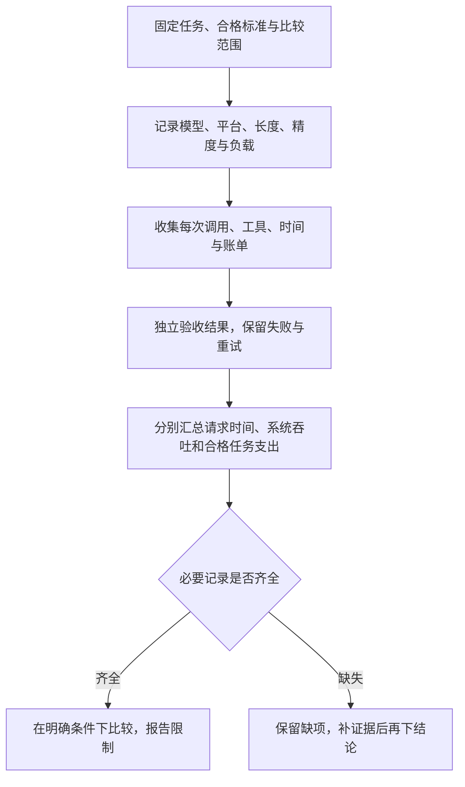

# 按完成任务的总成本比较：把时间、调用与人工放进同一张账

两套方案都要完成同一个合格任务。方案甲调用一次只花1单位，但用了3次尝试，人工核查又花2单位；方案乙每次2单位，一次完成，人工核查1单位。

只看单次费用，甲更便宜。把已经记录的支出加起来，甲是5单位，乙是3单位。比较对象从“一次调用”变成“交付同一个合格结果”，判断就变了。

时间也一样：较早看到第一个Token，不表示最后一个Token更早到达；服务每秒生成更多Token，也不表示每个用户都更快完成任务。

本文对应《AI学习目录》第十阶段第28课“按完成任务的总成本比较”。第26、27课解释计算怎样复用、存储怎样管理，本课把比较拉回完整任务。

读完后，你应能独立完成四件事：

1. 分开首Token等待、逐步生成速度、总吞吐和单请求完成时间。
2. 在相同合格标准下，核算调用、重试、工具、人工和运行成本。
3. 区分MoE总参数与当前Token参与的参数，保留路由和通信开销。
4. 解释一次便宜或较早开始输出，为什么不能直接证明更早、更便宜完成。

最低前置知识是会乘加法、知道结果需要验收。本篇补齐输入处理、逐步生成和专家路由的必要概念，不要求先实现推理服务；路由混合与负载算式放在可选进阶。

甲乙丙费用、时间、专家数量与参数都是 **课程教学设置**，不是任何产品的真实价格或速度排名。费用“单位”只用于统一比较，本次没有调用收费API或测量真实硬件。

## 一、先把“完成”固定下来

比较前先明确：任务输入相同，依据范围相同，验收条件相同。不能一边要求完整引用和事实核查，另一边只要求输出一段看起来顺畅的文字，再把费用相减。

例如，一个有依据的问答任务可以要求：回答对应指定问题，结论受资料支持，必要条件和否定没有丢失，格式符合约定。涉及工具写入时，还要核对真实结果和授权范围；最后一句“已完成”不能代替验收。

这是任务标准的教学说明，不是本课已经测得的成功率。真实比较要保存具体输入、实际输出和通过／失败证据。

同一任务可能有多次调用，也可能等待工具、返修或人工核查。要先区分几个对象：

| 对象 | 在账本中是什么 | 可以回答什么 |
| --- | --- | --- |
| 一次模型调用 | 一份输入和一次输出过程 | 这次用了多少Token、时间和费用 |
| 一次任务处理 | 为一个目标组织调用、工具和检查 | 从开始到结果交付经历了什么 |
| 合格任务 | 满足事先规定的验收条件 | 这些支出是否换来了合格结果 |
| 系统观察窗口 | 同一段时间内的多个请求 | 整个服务处理了多少工作量 |

价格、时间和成功证据都要能关联到这些对象。多个任务的吞吐，不能直接当成其中一个用户的延迟；一次成功调用，也未必完成了整个任务。[^成本]

## 二、沿一次请求，把时间拆开

Token是模型处理与生成的小片段，不一定是一个汉字或一个单词。下面只按课程已给的Token数量计算，不猜具体模型如何分词。

Prefill处理已有输入并建立相应计算状态，Decode继续逐步生成新Token。首个输出还会受排队、输入处理等因素影响；真实测量需明确从客户端还是服务端计时。[^时间机制]

本课的简化时间线从请求开始计时，忽略额外传输等开销：

```text
排队：100毫秒。
开始处理输入到首个输出Token：300毫秒。
总输出：50个Token。
首个以后，每个Token到达间隔：20毫秒。
```

300毫秒是本例“处理输入到首Token”的整体段，不是声称真实首Token等待只包含纯Prefill计算。

### 首个Token什么时候到

把排队与到首Token的处理段相加：

```text
首Token等待 = 100 + 300 = 400毫秒。
```

这常称TTFT，Time to First Token，即从规定起点到首个输出Token的时间。不同测量起点会影响是否计入网络和排队，报告时不能只留一个数字。

### 后续生成怎样量

第1个Token到达以后，第2个在20毫秒后，第3个再过20毫秒。50个Token有49个后续间隔：

```text
第1个：400毫秒。
第2个：420毫秒。
第50个：400 + 49×20 = 1380毫秒。
```

不能把第一个Token等待再算一次，也不能用50个后续间隔。这里最后一个输出到达约为1.38秒，不含其他任务步骤。

若用相邻Token间隔衡量，这段稳定的20毫秒间隔对应约50 Token/秒。这个速率只描述首Token之后的这段生成，不能当作包含400毫秒等待的全程平均速率。

真实响应间隔可能变化，服务返回块也可能包含多个Token；要根据实际记录的测量口径报告，不能假定任意流式响应都恰好每20毫秒一个Token。

### 总吞吐在量谁

吞吐量衡量单位时间内整个服务的处理量。例如在相同观察窗口内，累计输出Token数除以时间，可以得到系统输出吞吐，单位是Token/秒。

它把多个请求的产出合起来。批处理让多个请求共享部分计算和参数搬运，可以提高利用率，但排队与每个请求的完成时间仍需单独记录。[^时间机制]

| 指标 | 观察对象 | 本例怎样读 |
| --- | --- | --- |
| 首Token等待TTFT | 一个请求何时开始有输出 | 400毫秒 |
| 后续Token间隔或生成速率 | 一个请求开始输出后的推进 | 20毫秒／Token，约50 Token/秒 |
| 单请求输出完成时间 | 从规定起点到该请求结束 | 简化例中约1380毫秒到最后Token |
| 系统吞吐 | 多请求在同一观察窗口内的总量 | 本例没有提供系统总量，不能补算 |

如果改成“合格任务/小时”，那是在量任务吞吐；若一条输出还没验收，它不能仅凭生成结束就计为合格任务。报告必须说明分子统计什么。

## 三、较早开始，不一定较早结束

沿课程另一个请求丙：首Token为200毫秒，总输出也为50个，后续间隔30毫秒。

```text
最后Token到达 = 200 + 49×30 = 1670毫秒。
```

丙比前例提前200毫秒开始输出，却比前例晚290毫秒到达最后Token。首Token等待较短，后续生成较慢，两项变化需要同时看。

这里比较的是两条教学请求，不是对真实平台的速度结论。输出长度一旦不同，也不能直接拿这两个总时间比较生成效率。

还要再向外看一层：一次模型输出之后，可能需要查询工具、检查证据、重试或人工核验。**最后Token到达不自动等于任务完成**。

如果丙完成一项任务需4次尝试，完整时间要按真实顺序、并行关系、等待与检查记录计算。不能仅用一次TTFT代表任务耗时，也不能在不知道尝试是否串行时机械乘4。

同样，服务宣称“总吞吐提升”，仅凭这一项不能推出每个用户更早结束。需要在相同负载条件下，继续查看单请求等待、完成时间及质量；批量扩大可能改变这些取舍。

## 四、把费用算到同一合格结果

先沿课程原账本逐项计算。这里的尝试次数包含第一次，不是“3次重试再加第一次”。每次调用费用也已明确给定为固定教学值。

| 项目 | 方案甲 | 方案乙 |
| --- | --- | --- |
| 单次模型调用费 | 1单位 | 2单位 |
| 完成所用总尝试次数 | 3次 | 1次 |
| 模型调用合计 | 1×3=3单位 | 2×1=2单位 |
| 人工核查费 | 2单位 | 1单位 |
| 当前已记录合计 | 5单位 | 3单位 |

在本课明确的同质量教学前提下，甲的单次调用便宜，当前记录的完成支出却更高。不能从这个例子推出便宜模型一定多次失败，或高价模型一定一次成功；次数与质量来自本题条件。

模型费已经包含这些尝试，再另加同一批“重试费”，会重复记账。真实重试通常还可能有不同的输入、输出和工具支出，应逐次读取账单，而不是默认每次都相同。

### 工具和运行成本在哪里

如果真实工作还有工具查询、计算环境或运维支出，前面的5与3只是已知小计。**未记录不等于零**。

为把完整算法演示出来，明确增加一组教学前提：两方案在该任务上的工具费各1单位，另有各1单位的独立运行成本；这两项没有被调用费或人工费包含，其他费用在本组教学范围内不计。

```text
甲：模型3 + 人工2 + 工具1 + 独立运行1 = 7单位。
乙：模型2 + 人工1 + 工具1 + 独立运行1 = 5单位。
```

新增1与1是本文为扩展账本给定的教学输入，不是产品默认费用，也不是此前课程原账本已经测过的支出。

完整比较可以按互不重叠的类别加总：

```text
任务成本 = 所有模型调用实际费用
         + 所有工具实际费用
         + 人工核查与修正费用
         + 尚未包含的运行、存储或运维分摊。
```

真实账本还要说明范围。托管API的服务成本已经体现在供应商收费中，不能又把同一供应商的假定GPU费用加一遍；自部署则需要按自己的账单、统计周期与分摊规则记录。人工时间换算成费用，也要给出一致且有依据的口径。

毫秒不能直接加在费用单位后面。时间与费用先分别记录；若业务确实要把延迟换算成损失，需要另有明确依据，不能临时编一个价格。

## 五、Token账单要区分哪些项目

真实API不一定提供“每次固定收费”。输入、输出、缓存和批处理可能各有计量方式，应读实际平台、模型、日期及调用条件。[^计费分类]

| 项目 | 应读取的记录 | 不能省略的条件 |
| --- | --- | --- |
| 普通输入 | 实际计费输入量与适用单价 | 包含哪些消息、工具说明及新增输入 |
| 输出 | 实际输出计量与单价 | 是否还有单独计量的内容，按实际定义读取 |
| 缓存写入 | 是否建立缓存，实际写入量和费用 | 写入计费、有效范围和有效期 |
| 缓存读取 | 本次实际命中量和读取费用 | 不能由请求相似就假定命中 |
| 批处理 | 本次服务方式与账单 | 是否适用，以及允许的交付等待 |
| 工具及其他服务 | 调用次数与独立费用 | 是否已经包含在其他项目中 |

若普通输入、缓存写入和读取属于不同计费桶，就按实际分桶计数，不能先把所有输入按普通价算完，再对同一批Token重复加缓存费用。不同平台的具体字段和规则要从账单定义读取，本篇不构造一套通用API键名。

缓存命中可以降低重复输入处理与相应费用，但首次写入仍可能产生支出，新增后缀和输出也继续计算。比较时要覆盖建立缓存到后续使用的累计账单，不能只挑一次便宜的命中请求。

允许延后交付的任务，可以核对是否适合批处理；需要实时结果的任务，还要判断等待是否符合标准。没有实际报价和运行记录，本课不能给出产品排名。

### 一张能继续填写的测量卡

做实际比较时，可以保留以下文字结构。没有数据的项写“未测量／未取得”，不要填零：

```text
任务与质量：输入、成功标准、验收记录、最终通过或失败。
比较条件：平台、模型与版本、日期、提示、生成设置、输入输出量。
运行条件：托管或自部署；硬件、精度、软件、并发与请求到达方式。
每次调用：输入／输出／缓存计量、实际费用、成功或重试原因。
时间：排队、首Token、生成间隔、单请求结束、任务验收结束。
额外支出：工具、人工、未包含的运行与运维分摊。
系统量：观察窗口、总产出与统计单位。
限制：缺失费用、缺失时间、失败任务及未确认项。
```

对一组任务，可将观察窗口内全部相关支出除以合格交付数量，描述该窗口的平均合格交付成本；失败任务消耗也留在总支出中。这个口径需要说明任务组合与统计范围，不是单个成功调用的单价。若没有合格交付，也不能用除以零伪造结果。[^成本]

## 六、MoE为什么需要同时看两种参数量

模型总参数常被用于描述规模，但它不能单独告诉我们每个Token实际经过哪些计算。MoE是本课理解这个区别的子线，基础账本并不要求先掌握它的完整实现。

MoE，Mixture of Experts，混合专家，让一个层拥有多套专家网络，由Router，即路由器，为当前Token选择少量路径。这里“专家”是一组可训练网络参数，不是把整篇文章分给几位能直接命名的老师。[^专家路由]

FFN是前馈神经网络：将一组数字经过线性变换和非线性激活，再变成输出。当前Token已经具有上下文表示，各选中专家处理的是这个表示；路由器决定哪些专家参与，再按明确规则组合结果。

课程层设置4个专家，每个Token选2个。每个专家采用 `2→4→2`的两层FFN：2个输入数字先变成4个中间数字，再变回2个输出数字。

在本例每个线性层中，每个输出各有一组覆盖全部输入的权重。因此，输入有m个数、输出有n个数，就有m×n个权重。忽略偏置，第一层数2×4，第二层数4×2：

```text
一个专家：2×4 + 4×2 = 16个权重。
四个专家总计：4×16 = 64个权重。
当前Token选两个：2×16 = 32个参与的专家权重。
```

64表示该层专家部分总量，32表示该Token参与的专家部分。路由器、注意力计算（汇合可见Token的信息）、词元初始向量查表等没有计入；若有共享专家，也需按实际结构另计。

因此，不能把“选2个／共4个”直接乘在任意整模型总参数上，宣称激活参数就是总参数一半。

全部专家需要在整个部署系统中可访问，未被当前Token选中不表示可以从部署中删除。专家可分布于不同设备，路由、分发、合并、数据搬运与负载不均都可能影响实际时间和成本。[^硬件与负载]

**激活参数较少，不直接等于端到端更快或价格更低**。它提供计算路径的信息；还需要相同任务质量、输入输出长度、精度、硬件或平台、并发与实测账单。

内存容量、带宽、卡间互联与软件实现也有不同职责。参数存得下，不证明读得快；峰值算力高，不证明当前负载能充分利用。批量增加可以分摊参数搬运，同时也改变计算与排队条件，仍需回到同一测量口径。[^硬件与负载]

## 七、哪些推断超出了证据

| 已有观察 | 还不能直接得出的结论 | 需要补什么 |
| --- | --- | --- |
| 首Token较早 | 合格任务更早完成 | 后续生成、工具、重试和验收时间 |
| 总输出吞吐更多 | 每个用户等待更短 | 每个请求的等待与完成记录、负载条件 |
| 每百万Token单价较低 | 同一任务总成本较低 | 实际计量、尝试、工具、人工和质量 |
| 当前Token激活参数较少 | 只需存这些参数，整机必然更快 | 总存储、路由通信、实现和实测 |
| 一次请求输出结束 | 任务已通过验收 | 结果与必要过程条件的检查 |

如果两份测量更换了模型、长度、并发和硬件，只能说明两套整体配置在对应条件下的观察，不能把差异全归功于某一个机制。研究中的浮点运算次数（FLOPs）、峰值速度和特定基准提升，也不能拼成真实产品的统一排名。

## 八、动手整理一份有边界的账本

可以用第四节的甲乙例子先练习，不需要真实付费：

1. 写清同一任务的合格要求，并给费用统计范围命名。
2. 将第一次与后续尝试全部列入模型调用，标明人工是否已经包含。
3. 读取或明确给出工具与独立运行项；缺项保留未知。
4. 分别记录一次请求时间、完整任务时间与系统吞吐。
5. 对每个比较结论写出它使用了哪些证据、还缺哪些项。

整理真实记录时不必为了补满表格发起新收费调用。能否比较由当前数据决定，字段齐全与结果合格也需要分别核对。

## 九、先独立完成四道自测

可以保留本课给出的公式与条件，先不要查看下一节答案。

### 第1题：时间的四种口径

一次请求排队100毫秒，随后处理输入到首Token用300毫秒，共输出50Token，首Token后每个间隔20毫秒。

计算首Token等待和最后Token到达时间，说明为什么使用49个间隔。区分后续生成速率与系统吞吐。若服务总吞吐提高，能否直接说这条请求更早结束？还需要什么记录？

### 第2题：恢复完整费用账本

甲每次1单位、共3次尝试、人工2单位；乙每次2单位、共1次尝试、人工1单位。再按第四节新增教学前提，两方案各有工具1单位、独立运行1单位，且各项互不包含。

算出当前完整教学范围内的费用。有人在甲的3次调用之外，又加了2次同样的“重试费”，错在哪里？如果真实运行费没有记录，应当填0吗？若还未证明两方案结果达到同一标准，能否宣布哪一个合格完成更便宜？

### 第3题：总专家与参与专家

课程MoE层有4个专家，每个为2→4→2的两层FFN，不计偏置，每个Token选2个。

分别计算单专家权重、总专家权重和当前Token参与的专家权重。说明为什么不能由此认定整模型激活参数减半、只存两个专家或端到端一定快一倍。还应观察哪些成本？

### 第4题：迁移到便宜、较早开始的方案丙

丙每次0.5单位，完成同一合格任务需4次尝试，人工核查4单位。乙仍为每次2单位、一次完成、人工1单位。本题只比较已明确给出的模型与人工范围，其他费用未知。

为比较单次请求时间，本题明确让乙采用第1题的50Token、400毫秒首Token与20毫秒后续间隔；丙也输出50Token，首Token200毫秒、后续间隔30毫秒。

分别算出丙和乙的已知费用、单次最后Token到达时间。丙是否因为一次更便宜、首Token更早，就更便宜或更早完成？完整任务时间与完整实际费用还有哪些缺口？

## 十、参考答案与过关点

### 第1题答案：首Token、后续推进和总产出分开

首Token等待为 `100+300=400毫秒`。第1个已在400毫秒到达，从第1个到第50个还有49个间隔，因此最后Token约为 `400+49×20=1380毫秒`。

后续20毫秒间隔对应约50Token/秒，描述这条请求开始输出后的稳定段。系统吞吐统计观察窗口内多个请求的总产出；题目没有给这个总量，不能用单请求速率代替。

吞吐提高不能单独证明此请求更早结束。要看同一负载条件下其排队、首Token、后续到达和结束记录。若问题是任务完成，还需工具、重试与验收时间。

**过关点**：算对400与1380，解释49个间隔，说明四种指标的对象，不由总吞吐推出单用户延迟。答错回读第二、第三节。

### 第2题答案：费用互不重叠，质量先确认

甲为 `1×3+2+1+1=7单位`；乙为 `2×1+1+1+1=5单位`。这两个总数仅对应题目明确的完整教学范围。

甲的3次尝试已经包含第一次与两次后续尝试，再把同两次作为重试费加入会重复记账。实际每次价格不同时，应逐次读取费用，仍不能重复统计同一账单。

未取得运行费就保留缺项，不能填0。若质量尚未按同一标准确认，只能比较已记录支出，不能把它宣布为同一合格结果的完成成本排名。

**过关点**：计入调用、重试所占调用、工具、人工与独立运行，识别重复和未知，先检查同一质量标准。答错回读第一、第四、第五节。

### 第3题答案：只算了专家部分

单专家为 `2×4+4×2=16`，四专家总权重64，当前选两个参与的专家权重32。

路由器、注意力计算、初始向量查表及可能的共享专家没有算入，因此不能把专家部分比例套到整模型。所有专家仍需在部署系统中可访问，不能因当前只用两个就删除其他两个。

激活数量不直接给端到端时间。应另看路由、分发、合并、通信、负载均衡，以及模型权重和用于后续生成的历史中间计算缓存占用，再核对硬件、精度、软件和并发下的实际结果。更少计算没有自动给出API价格或质量。

**过关点**：得到16、64、32，明确统计范围，并解释计算、存储、通信与价格的不同责任。答错回读第六、第七节。

### 第4题答案：早开始仍可能晚结束，低单价仍可能高小计

丙的已知模型与人工费为 `0.5×4+4=6单位`，乙为 `2×1+1=3单位`。丙单次调用较便宜，但这份已知完成支出更高。

乙单次最后Token约1380毫秒；丙为 `200+49×30=1670毫秒`。丙早200毫秒开始，晚290毫秒结束这一条输出。

这还没有给出完整任务的耗时：丙4次尝试的实际顺序与并行、工具等待、人工核查和验收时间都要记录。完整实际费用也缺工具与运行等项，不能把已知6与3冒写成全部真实成本。

因此，一次便宜和首Token较早不能直接证明合格任务更早、更便宜完成。题目让质量相同，是比较前提，不是现实模型价格的普遍规律。

**过关点**：在新条件下得到6与3、1670与1380，同时指出任务时间和费用的未确认项。答错回读第三至第五节。

能独立完成四题并解释理由，才说明你能按同一任务与证据口径比较时间、资源和费用。阅读完、算过一次或看到吞吐变大，都不能直接当作已掌握或真实部署已更划算。

## 十一、可选进阶：跟着路由与测量再走一层

### 1. 同一个Token怎样混合两个专家

课程Router给当前Token的四个概率为 `[0.4,0.1,0.3,0.2]`，选中专家1和3。选择最高分的两个专家称为Top-2。本例明确采用“选中后重新归一化”的规则：

```text
选中概率和 = 0.4 + 0.3 = 0.7。
专家1权重 = 0.4/0.7 = 4/7。
专家3权重 = 0.3/0.7 = 3/7。
```

两个专家对同一个Token表示给出的输出分别为 `[2,4]`、`[4,0]`：

```text
输出 = (4/7)×[2,4] + (3/7)×[4,0]
     = [20/7,16/7]
     ≈ [2.8571,2.2857]。
```

每个坐标都分别加权求和，不是把整篇文章切成两段。没选中的专家2和4没有参与这次专家输出。

真实MoE可能使用不同权重、共享专家与容量规则。Top-1表示每个Token只选最高分的一个专家；Switch论文中，它的输出乘原始门控概率，不能把本例重新归一化当成所有MoE约定。[^专家路由]

### 2. 独立的Top-1批量怎样显示拥挤

下面另取4个Token、4个专家的Top-1教学批量，不与上一段Top-2的单Token统计混用。

`f_i`表示实际进入专家i的Token比例，`P_i`表示该专家在整批的平均路由概率。课程采用Switch辅助负载项：`α×E×Σ(f_iP_i)`，E是专家数，α是损失权重。Σ表示把各专家对应乘积加起来。[^负载项]

| 路由情形 | f | P | 暂不乘α的结果 |
| --- | --- | --- | --- |
| 4个Token全进专家1 | `[1,0,0,0]` | `[0.7,0.1,0.1,0.1]` | 4×0.7=2.8 |
| 每专家一个Token | `[0.25,0.25,0.25,0.25]` | `[0.25,0.25,0.25,0.25]` | 4×4×0.25²=1 |

这只展示该辅助项对两组条件的响应。f看实际分配，P看概率平均，不能把两者随意当成同一个量。辅助项还要和主任务损失共同处理，不证明任意任务只需让所有路由最均匀，也不是一次端到端计时实验。

### 3. 从固定条件开始做真实对照

选择比较输入、缓存、批量或模型时，先固定其余能够控制的条件。若比较模型，模型是被改变的项；应记录双方准确版本，并尽量固定任务、质量、输入、生成设置和负载，而不是要求不同模型使用同一个名称。



若只能观察托管API，服务内部硬件、调度和路由通常不是你已知或可控的配置。记录已提供证据，不能从输出快慢倒推出一套精确硬件参数。

## 十二、下一步：把这些口径带进完整任务

本课将一次调用放回完整目标：时间分开量，费用按互不重叠的项目记，质量先验收，MoE的参数、存储与通信再分别看。

下一阶段第29课“ViT看图与扩散画图”将任务从文字扩展到图像。输入形式改变以后，仍要读取实际计量与完整任务记录，不能把文本的每Token单价和时序原样套到所有多模态服务。

## 依据与回查

四项目标、甲乙丙账本、100／300／20毫秒时间线、50Token、4专家选2、2→4→2权重、路由混合与Top-1辅助项，来自《AI学习目录》和《32课学习设计与掌握目标》第28课。工具与独立运行各1单位、测量卡与第4题明确对齐乙时间，是沿课程规则增加的教学前提。

本文完整读取对应成本、两份MoE、硬件原始整理资料及相关摘要和《模型推理：从Token、Latent到多模态交错思维》。课程与综合页没有公开网址，只列文字标题。原始资料中的历史价格、设备规格、模型专家数和实验速度，没有作为本篇当前产品排名或教学数字的出处。

[^成本]: [模型API成本结构原始讲解](https://www.bilibili.com/video/BV1e17y6wEy5)，2026-06-05。采用完整整理原文中的输入输出、缓存、重试、人工与任务总成本视角；本文明确统计范围，没有把原文工程辅助公式当成通用会计公式，也未使用其历史产品单价。
[^时间机制]: [Efficient Memory Management for Large Language Model Serving with PagedAttention](https://arxiv.org/html/2309.06180)，第2.2—2.3节。核对输入处理、逐步生成、批处理与排队机制；本文时间线和吞吐说明是测量口径教学，不采用论文特定加速倍数证明任意请求更快。
[^计费分类]: Anthropic官方[Plans & Pricing的API区](https://claude.com/pricing#api)，2026-10-10核对。该页面示例区分Input、Output、Prompt caching的Read／Write及Batch processing；只采用计费分类，不引用具体模型单价、折扣或对其他平台作统一保证。
[^专家路由]: [Switch Transformers原论文](https://arxiv.org/html/2101.03961)，第2.1节；另完整读取[MoE稀疏专家讲解](https://www.bilibili.com/video/BV1CgZABxEcy)与[MoE路由讲解](https://www.bilibili.com/video/BV1HW4X6QEuh)对应整理原文。采用专家、门控与路径区别；课程Top-2再归一化不冒写成Switch的统一权重规则。
[^硬件与负载]: [计算硬件原始讲解](https://www.bilibili.com/video/BV1MjN16oE84)对应完整整理原文，采用容量、带宽、互联与软件条件的分工；另回查[PagedAttention论文第2.3节](https://arxiv.org/html/2309.06180)的批量与参数搬运讨论。不引用硬件峰值、价格或厂商排名，也未开展硬件测试。
[^负载项]: [Switch Transformers](https://arxiv.org/html/2101.03961)，公式4—6及A Differentiable Load Balancing Loss部分。支持实际分配比例、平均门控概率和辅助项的定义；本例2.8与1为课程明确设置下的计算，不使用其他视频画面数值或外推效果。

本文已复算时间、成本、参数量、混合输出和辅助项，核对四题答案、公开引用、加粗标点、脚注围栏、保存一致性及本地Markdown渲染。

未重新核对完整视频、调用收费服务、测量真实Token账单、缓存命中、硬件速度、吞吐或人工成本，也未开展新手试读或实际发布平台预览。教学算术和本地渲染不证明任意真实方案更快、更便宜，掌握以独立作答并解释理由为准。
