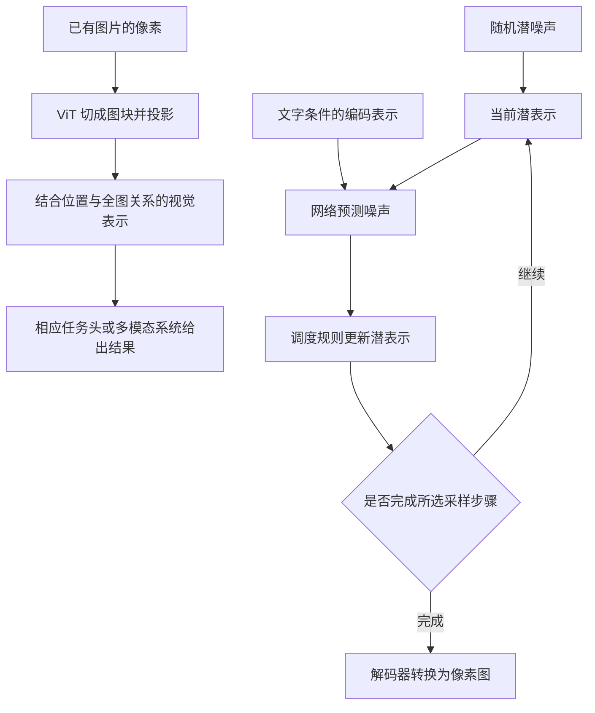

# ViT 看图与扩散画图：从已有像素到表示，从潜噪声到新图

你给模型一张猫的图片，它回答“这是一只猫”。接着，你要求它画“一只猫坐在窗边”。前一次能回答，是否说明后一次也一定能画？

这两次任务的起点不同：第一次已经有一张图，需要把它转换成模型能处理的表示；第二次需要产生新的图像。即使都使用神经网络，也不能把它们当成同一个过程，更不能认为画图就是把看图流程倒放。

本文对应《AI学习目录》第十一阶段“从文字扩展到图像”的第 29 课《ViT 看图与扩散画图》。我们先给已有图片盖上网格，再看生成模型怎样从随机潜噪声逐步得到图片。

学完后，你应能独立完成五件事：

1. 说明 ViT 怎样把已有图片切成 Patch，并投影成数字表示。
2. 解释为什么一个物体可以跨多个块，一个块也可以同时含物体与背景。
3. 区分图像感知编码与潜空间扩散生成的输入和输出。
4. 概括噪声预测、逐步更新和最后解码，避免将生成理解成图库拼贴。
5. 指出已知图片与固定噪声混合的动画为何只是示意，不是真实生成记录。

最低先修是第 02 课的数字表示、第 06 课的 Transformer，以及第 16 课的结果核验。第 24 课的训练知识有助于理解噪声学习，但不是看懂图块主线的门槛。下面会解释必要概念。

文中的图像尺寸、投影维度、潜数与混合画面沿用课程教学设置，迁移练习按这些规则构造。它们不是真实模型推理记录、分词结果或图像质量测量。基础达标以文末独立自测检查；形状、字节和 DDIM 公式留在选读中。

## 一、已有图片首先是一张数字表

### 1. 像素与通道：一个点不只一个数

屏幕上的图片由像素组成。以课程的 `224×224` 彩色图为例，它有 224 行、224 列，共 `224×224=50,176` 个像素。

RGB 表示红、绿、蓝三个颜色通道。按每个像素有三个通道数计算，这张图包含：

```text
224×224×3 = 150,528 个数
```

这说明输入的数据规模，没有规定文件大小。图片文件可能经过压缩，模型输入也可能经过缩放和归一化，不能只凭这个数量推断实际文件或显存字节数。

### 2. Patch 是按空间切出的块

ViT 是 Vision Transformer，视觉 Transformer。它的一条典型输入路径，是将已有图像切成不重叠的 Patch，中文称图块，再把图块转换成向量序列。[^视觉论文]

课程规定每块为 `16×16` 像素。对这张可整除的正方形图：

```text
每行块数：224÷16 = 14
每列块数：224÷16 = 14
总块数：14×14 = 196
```

网格决定哪些像素归入同一块。它不会先问“猫在哪里”，再沿猫的轮廓切块；也不会因为有一只猫，就只切出一个“猫块”。

这里 `224` 与 `16` 是输入处理的尺寸，`196` 是图块数，还没有变成物体数或类别数。若尺寸不能整除，具体裁剪、缩放或填充方式需要看实际模型，本课不补造统一规则。

## 二、一只猫跨多个块，一个块也能含猫与背景

想象课程中的自绘猫头覆盖在 `14×14` 网格之下。网格线穿过猫耳、脸部和边缘，不会自动绕开物体。

以下表格只用自然语言描述局部像素可能包含什么，不是模型输出的标签，也不指定真实检测坐标：

| 网格中的局部类型 | 块内可能有什么 | 能直接推出什么 |
| --- | --- | --- |
| 落在猫头内部的块 | 部分毛发、颜色或眼睛附近像素 | 这是一个局部像素区域，尚不是完整猫的标签 |
| 穿过猫轮廓的块 | 一部分猫与一部分背景 | 一个块可以混合多个区域的信息 |
| 猫头以外的块 | 背景像素 | 切块本身没有把它判定成某个类别 |

同一只猫的不同部分会落入多个图块。反过来，一个边缘图块可能同时包含猫与背景，甚至包含多个对象的一部分。

**图块是输入组织单位，物体是需要结合图像信息判断的对象**。两者没有“一块对应一个物体”的固定关系。

这也不意味着每个物体一定跨块。一个足够小且恰好位于单块内部的对象，可以只占一个块；这个几何事实同样不保证模型已经认对它。关键是不能把网格边界当作物体边界。

## 三、从图块像素走到向量，再结合全图关系

### 1. 展平：把块内数字按约定排成一行

每个 `16×16` RGB 图块有：

```text
16×16×3 = 768 个数
```

展平就是按固定顺序，把块内各像素通道数排成一行。全图共有 196 块，就有 196 行，每行 768 个数。

这一步重新组织数据，没有把 768 个数翻译成“猫耳朵”这样的文字，也没有完成识别。实现中采用什么像素排列约定要保持一致，不应仅凭“展平”补造具体接口。

### 2. 投影：从 768 个输入数得到 64 维表示

沿用课程的教学维度，每块经过可学习的线性投影，从 768 个数转换为 64 个数。线性投影可以先理解为：使用训练得到的参数，对输入数字作组合，输出固定长度的向量。

```text
196 块，每块 768 个数
→ 对每块使用同一投影规则
→ 196 个向量，每个向量 64 个数
```

64 是本文教学设置，不是所有 ViT 的固定维度。因为没有给出具体投影权重，我们能说明转换的结构，不能凭空算出每块的 64 个实际数。

投影输出称为 Patch Embedding，图块嵌入。它是数字表示，不是文本词表编号；把视觉图块称为视觉 Token，也不表示它已经被换成“猫”这个词的 Token ID。

### 3. 加位置信息，让块之间交流

图块表示还要加入位置信息，帮助模型学习各块的空间关系。原始 ViT 的分类路径会在序列前加入一个可学习的 Class Token，分类词元，用其经过编码器后的状态作全图分类表示。它不是从图片中多切出来的一块。[^视觉论文]

图块序列进入 Transformer Encoder，Transformer 编码器。注意力让不同块的表示结合其他块的信息，再经过前馈网络等运算更新。这里处理一张已知图片，可以利用全图可见信息，不是照搬文本逐项生成的因果可见限制。

一个只含眼睛附近局部像素的块，可以借助与其他块的关联形成更有上下文的表示。但“可以关联”不保证任意图片都被正确理解，仍需核对任务输出。

不同视觉模型会使用不同图块策略和输出方式。有的保留分类词元，有的提取图块序列或作汇总；多模态语言模型还需要相应接口来接入视觉表示。本文不把“196 行”或“197 行”写成所有看图模型的固定长度。

即使分类结果是“猫”，也不能直接证明猫的坐标、数量或动作判断正确。类别、定位和语言描述属于需要分别检查的结果。

## 四、画新图的起点：随机潜噪声与生成条件

### 1. 潜表示不是缩小后的 RGB 图片

Latent 是潜表示：模型学习到的一组中间数字，可以保留适合后续处理的图像信息。本文的潜空间扩散在这类表示上工作，再通过解码器转回像素。[^潜空间论文]

潜表示可能仍按空间排列，但其通道不是直接的红、绿、蓝，也不是一张图片缩小后原样保留的像素表。不能把其中某一个数当作“猫”的词表编号，或当作可以独立解释的自然语言标签。

本文所讨论的 Stable Diffusion 架构使用 VAE 的编码器与解码器连接像素和潜表示。编码器把已有图像变成潜表示，解码器把潜表示转换为图像；这一转换有损，不保证还原每个原始像素。

VAE 的图像编码器也不是上文 ViT 分类编码器的反向操作。它们训练的任务、表示和后续用途不同。

### 2. 文字条件影响预测，不是现成成品图

以“画一只猫坐在窗边”为例，文字经过编码，成为生成网络能使用的条件表示。本文所对照的归档 Stable Diffusion 架构用 CLIP 的文字侧提供条件，UNet 在当前噪声状态、噪声等级和文字条件下作预测。

UNet 是这条来源链路中的预测网络。文字条件可以通过交叉注意力等机制影响预测，不能被理解成拿到一份已经保证满足提示词的像素答案。[^潜空间论文]

不同扩散模型和 Stable Diffusion 版本的结构、预测目标、文本编码器与采样器可能不同。这里讲的是选定的噪声预测参数化及潜空间生成流程，不把 UNet、CLIP、VAE 三个名称当作所有版本的统一实现。

### 3. 两条流程的输入输出不同



上半条链处理已有图像，核心输出是供任务使用的视觉表示；下半条链从随机潜噪声开始，目标是生成像素图。这里只画文生图主线，不代表图生图等任务没有其他输入。

**能描述已有图片，不足以证明同一模型必然具备生成新图的能力**。语言回答、视觉理解和图像生成需要对应的组件、训练和接口。要确认能力，必须检查具体系统支持什么，并验收实际结果。

## 五、噪声预测怎样学会，生成时怎样继续

### 1. 训练：已知图像帮助构造学习目标

先区分训练和生成。在本文的噪声预测训练中：

1. 取出训练图片，经图像编码器得到干净潜表示。
2. 采样噪声和噪声等级，按加噪公式构造带噪潜表示。
3. 将带噪潜表示、等级与相应条件交给预测网络。
4. 比较网络预测与本次实际加入的噪声，用训练更新参数。

因此，训练使用了原始图片，也知道本次采样的噪声。说“预测网络没有直接看到干净原图”，只能说明这一步前向的输入安排，不能扩写成训练从来不需要图片。

干净潜表示与真实加入的噪声用于构造样本和训练目标。这里没有要求新手推导完整损失函数，只需要认清数据来自哪里。[^潜空间论文]

### 2. 生成：网络给预测，调度器负责更新

文生图采样时，先按配置得到随机潜噪声，再根据文字条件运行：

```text
当前带噪潜表示 + 噪声等级 + 文字条件
→ 网络给出噪声预测
→ 调度器按相应规则更新潜表示
→ 将新状态交回网络，继续下一步
→ 采样完成后，解码得到像素图
```

调度器或采样器规定步骤、系数与更新关系。网络的一次噪声预测不是最终图片，更新规则也不是一句“把预测噪声直接全部减掉”就能概括。

生成过程中没有一张预先给定、必将得到的最终猫图供网络读取。初始随机噪声也不是把某张真实猫图藏了起来，等待恢复。

这条机制没有把每个 Patch 当成图库里的一块现成图片再拼接。它依靠训练得到的参数与条件，逐步更新连续潜状态。不过，机制解释也不能证明模型绝不复现训练内容；关于具体输出是否重复已有图，需要额外证据。

### 3. 去噪不意味着每一个数都变小

课程用一个潜数说明这个易错点。按照已给加噪设置，干净潜数 `2` 得到带噪值 `2.2`。网络预测噪声后，得到干净潜值的估计 `2.15`；再按明确限定的确定性 DDIM 教学步更新，下一状态约为 `2.2837`。

```text
已知干净潜数：2
训练构造的带噪值：2.2
由预测得到的干净潜值估计：2.15
采样更新的下一状态：约 2.2837
```

这四行不是四张图片，也不是将真实干净值 `2` 直接传给生成步骤。第三行是根据带噪输入与模型预测作出的估计，第四行是下一噪声等级下的状态；各自角色不同。

下一状态比 `2.2` 大，但这不能用来判定“去噪失败”。潜数的绝对大小不是噪声多少或图像质量的通用刻度，去噪应按模型参数化和调度规则理解。完整代入过程在第九节。

**噪声预测、潜状态更新和最终图像质量是不同的判断**。一次估计正确，也不能证明整幅图片的对象、数量和位置全符合提示词。

## 六、为什么“画面变清楚”的滑块只是示意

### 1. 示意程序已经存有最终画面

课程中的“看噪声怎样褪去”演示使用一张预先绘制的 `192×192` 画面和一份固定噪声。拖动滑块，程序改变两者的混合系数并显示结果。

它没有运行一个学习噪声的网络，也没有根据上一轮预测推进潜状态。每次画面都可以重新由“已知干净画面＋固定噪声＋当前系数”计算出来。

| 比较项 | 已知图混合示意 | 本文讨论的潜空间文生图采样 |
| --- | --- | --- |
| 是否预先持有要显示的干净画面 | 是 | 没有预先给定的最终生成图 |
| 当前状态从哪里来 | 按当前系数混合固定两份数据 | 从随机潜噪声开始，经预测和调度更新 |
| 是否需要噪声预测网络 | 不需要 | 本文参数化需要 |
| 最后的清晰画面是什么 | 程序已知画面的重新显示 | 生成潜表示经解码得到的图像 |

因此，示意可以帮助想象“从难辨认到可辨认”，但不能作为模型实际生成、每一步潜状态或输出质量的证据。

### 2. 已知图混合也不能直接当作训练回放

训练加噪同样使用已知数据，所以二者在外观上容易混淆。但这个滑块没有网络预测、训练损失和参数更新，只是视觉演示。

它也不是按真实生成步骤记录的一组中间解码图。“从噪声到清晰”这个外观，不足以证明后台正在执行扩散采样；要核对它实际使用的数据、运算和模型。

**看见动画变清楚，只能证明演示画面改变了，不能证明模型生成成功**。真实生成是否合格，要检查实际输入、运行结果和任务要求；本文没有执行这类模型实验。

## 七、合上正文，独立检查五件事

先作答，再看下一节。基础题要求解释流程与判断边界，不需要完成选读公式。

### 题 1：从已有图片到图块表示

给定 `224×224` RGB 图片，以 `16×16` 不重叠块切分，教学投影维度为 64。

按顺序说明输入像素、切块、展平、投影、位置信息与编码器分别做什么。共有多少块？每块多少个输入数？“196 个图块”是否等于“196 个物体”或“196 个文本词表编号”？

### 题 2：网格穿过同一个对象

一只猫跨过多个网格块，其中某个边缘块同时含猫的轮廓与背景。有人据此说：“每块已经认出了一个物体，猫跨五块就有五只猫。”

指出错误。再考虑一个完整位于单块里的小图标：这是否证明任何物体都只占一块？如果分类头输出“猫”，能否仅凭类别判断猫的坐标已经正确？

### 题 3：给两个任务画出输入输出

任务甲：提供一张已有图片，要求系统描述内容。

任务乙：给出“画一只猫坐在窗边”的文字条件，要求生成新图。

分别画出本文所讲的关键链路。哪些数字是视觉表示，哪些是不断更新的潜状态？甲任务成功，是否证明同一系统支持乙？ViT 编码与潜空间扩散是不是互为逆算法？

### 题 4：分清训练、采样和结果

将以下两组步骤分别整理成合理流程：

- 已有训练图、干净潜表示、带噪潜表示、实际加入的噪声、预测噪声、参数更新。
- 随机潜噪声、文字条件、网络预测、调度更新、下一轮状态、最后解码。

生成时是否需要读取一张已知最终图片？下一潜数从 `2.2` 变成约 `2.2837`，是否足以证明去噪失败？一次噪声预测正确，是否足以证明整幅图都符合提示词？

### 题 5：复核一个“生成演示”

某个滑块程序预先保存一张干净图片和一份固定噪声，滑动时重新混合并显示。它没有调用预测网络。

报告却说：“这个程序已经证明模型从纯噪声画出了目标图，而且这就是它真实的去噪轨迹。”

指出报告缺少的证据，以及演示实际能说明什么。已知图混合为什么也不能直接等同于完整训练过程？

## 八、参考答案与过关点

### 题 1：图块输入与语义判断分开

输入是已有像素通道数。切块按固定空间网格组织像素，展平将每块排成一行；线性投影得到固定长度的数字向量，位置信息帮助保留位置关系，编码器结合跨块信息更新表示。

块数为 `14×14=196`，每块输入数为 `16×16×3=768`。教学投影后每块为 64 维向量。

196 是图块数，不是物体数。图块表示也没有自动变成文本词表编号，更没有因为投影就直接生成“猫”的标签。

**过关点**：能按顺序解释每一步的输入和结果，并分开块数、向量维度与识别对象。答错时回读第一、三节。

### 题 2：切块边界不是对象边界

同一只猫跨多个块，仅说明不同块包含它的不同局部。块内可以同时含猫与背景，切块并没有把这些像素直接识别成一个独立物体。因此五个含猫局部的块不能直接数成五只猫。

小图标完整位于单块是另一个几何情况，不能推出所有物体都只占一块，也不能证明该块已经被正确识别。

类别“猫”只回答了类别问题。正确坐标需要相应定位输出及核验，不能由分类标签代替。

**过关点**：能解释“一物多块”和“一块多区域”，同时保留小对象位于一块的可能；不将类别当作坐标证明。答错时回读第二、三节。

### 题 3：已有图编码与新图生成各有链路

甲可以画为：已有像素→图块→投影与位置表示→视觉编码→相应多模态接口与语言模型描述。本文没有给定真实接口配置，不能据这条概念链补造调用字段。

乙可以画为：随机潜噪声＋编码后的文字条件→预测噪声→调度更新→重复→最后解码为像素图。

甲的视觉表示供感知与后续任务使用；乙的潜状态是生成过程中更新的数据。二者不能只因都叫“表示”就互换。

甲成功不证明同一系统具有乙所需的图像生成组件和能力。ViT 编码与扩散也不是互为逆算法；扩散最终解码器连接的是相应潜空间，不是将 ViT 分类序列简单倒放。

**过关点**：能标清两条链的输入、表示和输出，并解释能力与结构的区别。答错时回读第三、四节。

### 题 4：训练知道加入的噪声，生成依赖预测更新

训练：已有图→编码得干净潜表示→采样噪声与等级→构造带噪潜表示→网络预测→与实际加入的噪声比较→训练更新参数。条件输入按所选训练设置提供。

生成：随机潜噪声与文字条件→在当前等级预测噪声→调度器更新状态→将新状态送入下一轮→按采样配置完成后解码。

生成不会把一张预先已知的最终图直接交给网络恢复。网络的一次预测与调度器的状态更新也不是同一操作。

`2.2→约2.2837` 只说明这个潜数增大，不能凭大小判断去噪失败。一次预测正确也只检查了对应噪声估计，不能代替整幅图的对象、数量、布局和提示符合度验收。

**过关点**：能区分训练材料、预测目标、采样状态与最终结果，不把全部数值递减当作生成规则。答错时回读第五节；公式选读不是基础作答前提。

### 题 5：已知图的重新显示不是生成证据

程序持有干净图片和固定噪声，没有调用预测网络，也没有按模型预测推进潜状态。因此它的清晰终点可以直接来自预存图片，不能证明模型生成了这张图，更不能称为模型的真实采样轨迹。

它能说明混合比例变化带来的视觉外观，帮助建立由乱到清的直觉。

若要声称真实生成，需要核对实际模型输入、预测与采样执行过程、输出来源和任务验收。现有材料没有这些证据，应明确只是示意。

它也不构成完整训练：没有噪声预测网络、预测与真实噪声的比较以及参数更新。已知图参与混合，仅是训练构造材料的部分外观，不能代替训练本身。

**过关点**：能识别预存目标图这个关键差异，并分开视觉示意、训练和生成记录。答错时回读第五、六节。

能独立完成这五题并解释理由，才说明本课的基础目标已得到检查。读完文章或看见动画，都不能直接当作已经掌握。

## 九、可选进阶：形状、字节与一个确定性更新步

### 1. ViT 的数字形状逐步核对

形状表示一张数字表或张量的各维长度。下面用 `[高,宽,通道]` 说明图像，用 `[行数,每行数字数]` 说明图块序列；这里只写单图逻辑形状，省略批次维度和具体库的排列差异。

```text
图像：H=224，W=224，C=3
图块边长：P=16
投影维度：D=64

块数 N = (H/P)×(W/P) = 14×14 = 196
每块展开长度 = P²×C = 16×16×3 = 768
```

| 阶段 | 单图形状 | 含义 |
| --- | --- | --- |
| 原始 RGB 数字图 | `[224,224,3]` | 150,528 个像素通道数 |
| 展平的图块 | `[196,768]` | 每行一个局部图块 |
| 线性投影 | `[196,768]×[768,64]→[196,64]` | 每块变成 64 维表示 |
| 按原论文分类路径添加分类词元 | `[197,64]` | 增加一个可学习位置，并非新图块 |
| 加位置表示并经过编码器 | `[197,64]` | 在此路径中更新表示，序列形状保持 |

矩阵表达用于说明投影维度关系，不提供实际权重。64 为教学维度；197 只属于这里含分类词元的路径，不是所有视觉接口的输出长度。

迁移练习：若图改为 `256×256×3`，仍用 16 像素边长图块和 64 维投影，各形状是什么？

答案：每边 `256÷16=16` 块，总共 `16×16=256` 块；展平为 `[256,768]`，投影为 `[256,64]`，含分类词元时为 `[257,64]`。像素变多，单块展开长度不变，增加的是块数。

### 2. 从已知干净潜数构造训练样本

本课选定噪声预测参数化，记：

```text
z₀：干净潜表示
z_t：时刻 t 的带噪潜表示
ā_t：截至 t 的累计保留系数
ε：采样得到的真实噪声
ε̂：网络预测的噪声

z_t = √ā_t×z₀ + √(1−ā_t)×ε
```

这是固定前向加噪的关系，累计系数不是“每个像素改动百分之几”。为了手算，只取一个潜数：

```text
z₀=2，ā_t=0.64，ε=1

z_t = 0.8×2 + 0.6×1 = 2.2
```

真实图像潜表示有很多数，这里只用一项说明公式，不将它等同于整幅图像。

网络若预测 `ε̂=0.8`，则干净潜数估计为：

```text
干净潜数估计
= (z_t−√(1−ā_t)×ε̂)/√ā_t
= (2.2−0.6×0.8)/0.8
= 2.15
```

它不等于真实干净值 2，因为预测噪声不是本次真实加入的 1。生成时仍使用预测作更新，不直接读取训练示例的真实干净值。

### 3. 确定性 DDIM：下一潜数可以变大

DDIM 是一种扩散采样方法。这里只使用公式 12 中随机项为零的确定性教学更新，不裁剪干净估计，并明确用噪声预测目标。[^确定性采样]

设下一采样时刻的累计保留系数为 `ā_前=0.81`；“前”指反向采样所到的较早噪声时刻，保留系数从 0.64 增为 0.81。

```text
z_前 = √ā_前×干净潜数估计 + √(1−ā_前)×ε̂
     = 0.9×2.15 + √0.19×0.8
     ≈ 2.2837
```

这个值大于上一步的 2.2。更新按相应公式组合估计信号与噪声方向，并不要求每个坐标每次减小。其他调度器、随机项或速度预测等参数化需要各自对应公式，不能直接替换本例。

再做一个迁移检查：若同一带噪输入中 `ε̂=1`，干净潜数估计是多少？

答案：`(2.2−0.6×1)/0.8=2`。这次单项噪声预测恰好正确，所以恢复了本例干净值；它没有证明一整幅生成图全部正确，更没有得到未给出的图像。

**进阶过关点**：能区分真实干净值、带噪值、干净估计和下一状态，复算 2.2、2.15、约 2.2837；保留噪声预测、随机项为零与不裁剪的条件。

### 4. 潜表示数量比与字节比不是一个概念

沿用课程及相关原始资料的另一组尺寸：

```text
像素表示：[1024,1024,3] → 3,145,728 个数
潜表示：  [128,128,4]   →    65,536 个数

标量数量比：3,145,728÷65,536 = 48
```

若两者都以 FP32 存储，每数 4 字节：

| 数据 | 字节数 | 二进制容量 |
| --- | --- | --- |
| 原像素张量 | 12,582,912 | 12 MiB |
| 潜表示张量 | 262,144 | 0.25 MiB，即 256 KiB |

同精度字节比也是 48。若明确改为原像素每数 1 字节、潜表示每数 4 字节，原像素是 3 MiB，潜表示仍是 0.25 MiB，字节比才是 12。

`1 MiB=1,048,576` 字节，`1 KiB=1,024` 字节。这是数值数组的存储比较，不能直接代替 PNG、JPEG 等文件大小；也没有计入模型、工作区和其他状态。

形状压缩有损，数量减少不自动等于所有信息无损保留，更不意味着完整生成过程按同一倍数加速。

### 5. 再回查滑块究竟算了什么

课程滑块对已知画面的通道数作归一化，并使用固定噪声。核心混合关系可以写成：

```text
混合值 = √a×已知画面数值 + √(1−a)×固定噪声
```

滑块改变 `a`。当 `a=0` 时显示噪声混合结果，当 `a=1` 时重新显示已知画面；显示环节还会将值映射、裁剪到像素范围。

它看起来与前向加噪关系相似，但滑动回清晰端只是在重用已知数据，不是由学习到的预测完成反向采样。这个差异是第五项基础目标要你认出的证据边界。

## 十、下一课把“看见”接到“操作与验证”

我们已分别走完两条主线：已有图像切成图块，转为结合全图关系的视觉表示；随机潜噪声在条件下被逐步更新，最后解码为像素图。

第 30 课《看见、指代、操作、验证》会把视觉感知接到实际界面行动：找到稳定对象、核对操作条件、执行动作，再读取真实结果。会描述图片不保证能画图；同样，看见按钮也不保证点准，更不保证目标已经保存。

## 依据与回查

课程定位、五项掌握目标、猫跨网格的教学观察、224 像素与 16 像素图块、64 维投影、潜数和迁移练习来自《AI学习目录》第 29 课及《32课学习设计与掌握目标》。192 像素混合演示还核对了课程中的实际计算代码；这些课程没有公开发布地址，故只列文字标题。

以下公开论文机制章节在 2026 年 10 月 10 日核对，教学数字不冒充其模型实验结果：

[^视觉论文]: [An Image is Worth 16x16 Words: Transformers for Image Recognition at Scale](https://arxiv.org/html/2010.11929)，本次页面标示 v2，2021 年 6 月 3 日。已读取第 3.1 节，核对图块展平、可学习投影、位置表示、分类词元和 Transformer 编码器。本文没有复现分类训练或准确率实验。

[^潜空间论文]: [High-Resolution Image Synthesis with Latent Diffusion Models](https://arxiv.org/html/2112.10752)，本次页面标示 v2，2022 年 4 月 13 日。已读取第 3.1—3.3 节，核对图像编码解码、潜空间噪声预测及条件表示机制。具体 Stable Diffusion 组件同时对照归档文字资料，不将论文的所有结构选择与所有后续版本混为一体。

[^确定性采样]: [Denoising Diffusion Implicit Models](https://arxiv.org/html/2010.02502)，本次页面标示 v4，2022 年 10 月 5 日。已读取第 4.1 节公式 12 及随机项为零的说明。本文将累计保留系数按课程记为 `ā`，用 `z` 表示潜数；公式代入是确定性教学步，不是真实模型采样记录。

原始讲解另回查：

- [大模型如何看懂图片：ViT Vision Transformer](https://www.bilibili.com/video/BV1TFG56XERd)：像素、图块、数字特征和全图关系。
- [Stable Diffusion 是如何画画的](https://www.bilibili.com/video/BV12xeK6EEYb)：本文所选 UNet、文字条件与 VAE 的分工，以及训练和生成区别。

本次完整阅读的是两份已归档文字原始资料及对应摘要，没有重新逐段播放视频或运行其配套工作流。未采用归档中的相似度、重建实验、固定生成步数或否定理解类比，作为所有模型的能力保证。

本文已完成目标覆盖、独立内容复核、算例复算、公开依据核对、格式检查、保存回读和本地 Markdown 渲染检查。未执行真实视觉识别、扩散采样、GPU 测量、发布平台预览或真实新手试读；教学计算与示意不能证明实际识别、生成质量或读者只读完就一定掌握。
