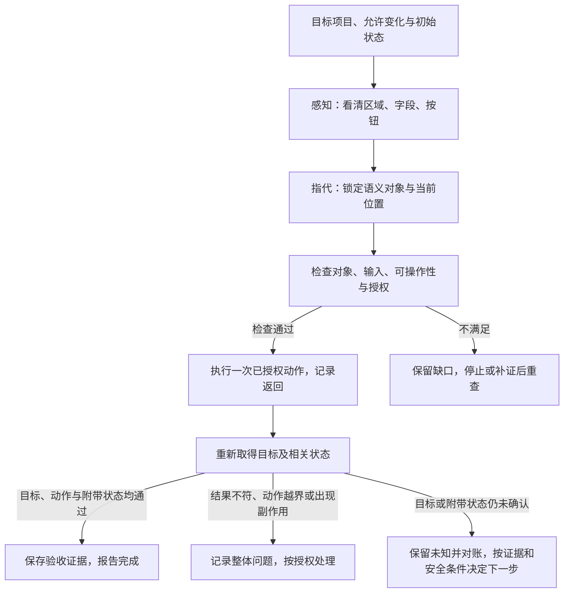

# 看见、指代、操作、验证：把视觉目标连到真实结果

页面上有两个“保存”。助手在输入框中把项目名称改成“项目乙”，点下按钮，看到了“保存成功”的提示。

重新打开目标项目，名称却仍是“项目甲”。另一次操作确实保存了项目名称，但助手误点过个人资料区的按钮，可能还改动了昵称。

这两个过程都提醒我们：看见目标、点到按钮和完成任务，是需要不同证据的步骤。

本文对应《AI学习目录》第十一阶段第30课“看见、指代、操作、验证”。第29课解释图像怎样进入或由模型产生，本课把图像中的对象接到受控操作与真实验收上。

读完后，你应能独立完成五件事：

1. 给目标一个稳定的对象描述，避免只说“下面那个”。
2. 分清截图、显示缩放、浏览器和屏幕坐标的约定。
3. 在动作前核对正确对象、输入值、可操作性与授权。
4. 区分点击回执、界面提示和服务端实际保存。
5. 分别检查目标和附带状态，发现副作用时识别整体问题。

最低前置知识是：知道输入框与按钮可以改变界面，知道操作结果要核验。本篇补齐坐标、前端、后端及授权的必要概念，不要求先训练视觉模型或搭建浏览器自动化项目。

两个区域、名称、昵称、坐标和失败时间线都是 **课程的人工教学设置**，不是实际网站或账户。本篇不点击真实按钮，也不提供真实账户授权。

## 一、先把这次任务和允许的变化说清楚

课程教学页面可以写成：

```text
个人资料区域
  昵称：用户甲
  个人资料保存

项目设置区域
  显示名称：项目甲
  项目设置保存
```

目标是将已确认目标项目的显示名称从“项目甲”改为“项目乙”。本例明确给定教学授权：只修改这个项目的显示名称，不修改个人资料，也不执行其他动作。

这里的“已确认目标项目”是本例前提。真实网站若有多个项目，必须从请求和当前页面取得准确身份，不能凭相似名称猜项目编号。

前端是用户正在看的界面及其本地状态，后端是界面背后处理请求、保存数据的系统。输入框出现“项目乙”，只说明界面值改变，还没有证明后端已保存。

至少要保留三类初始信息：

| 信息 | 本例记录 | 后续怎样使用 |
| --- | --- | --- |
| 目标身份 | 当前已确认的项目、项目设置区域、显示名称字段 | 防止改到个人资料或另一项目 |
| 允许改变 | 项目甲→项目乙 | 动作与结果分别对照 |
| 附带边界 | 个人资料昵称仍为用户甲；不改其他项 | 验收时检查有无越界或副作用 |

任务不是“找到任意一个保存并点下去”。目标对象、字段变化和禁止事项一起构成判断标准。

## 二、看见两个按钮以后，给目标一个稳定名字

感知首先回答页面里有什么：区域标题、字段文字、当前值、按钮及遮挡。模型把图片转成可处理的信息，并不表示每个细节都已识别正确。

如果小字模糊，应重新取得能看清的证据；不能先猜标题，再用精细坐标让这个猜测看起来准确。对已经丢失的视觉细节，输出更多小数位不能补回原信息。[^视觉指代]

指代回答的是“后续步骤一直在说哪个对象”。下面两种描述提供的信息不同：

| 描述 | 后续容易发生什么 | 更稳定的表达 |
| --- | --- | --- |
| 点下面那个保存 | 滚动、弹窗或布局变化后位置漂移 | 当前目标项目的项目设置区域内，对应显示名称字段的保存按钮 |
| 把它改成乙 | 不清楚是昵称还是项目名称 | 将目标项目设置中的显示名称改为项目乙 |
| 点这个坐标 | 坐标与对象关联不明 | 先确认上述区域与按钮，再依据当前画面定位 |

稳定描述把目标身份、区域、字段和按钮职责接起来。它不等于某个坐标永久不变，也不保证只要名称相同就一定是同一对象。

点与边界框可以补充位置。点表示一个位置，边界框用两个角点圈出区域，后续步骤可以继续引用。但框住了个人资料的保存，即使坐标格式合法，也仍然是错目标。[^视觉指代]

界面变化后，要重新核对这个语义对象在哪里，不能照旧截图继续点。有明确元素文字、标签和区域关系时，可以据实际界面语义定位；定位规则常称为选择器，它说明工具怎样找到元素。本篇不补造真实网站的选择器、字段名或接口路径。

多模态推理中的裁剪、局部查看和标注，也可以帮助辨认对象。ThinkMorph研究展示文本与视觉中间步骤交错推进的路径；生成了一张框图或放大图，仍然只是推理证据的一部分，不是图形用户界面（GUI）中的保存已经成功的证明。[^交错推理]

## 三、坐标先说明属于哪张图、哪种单位

同一个对象可能有多组坐标，因为原点、单位与显示方式不同。

| 坐标或表示 | 参考对象与原点 | 需要核对什么 |
| --- | --- | --- |
| 原截图坐标 | 指定图片，左上角为原点 | 图片宽高、是否裁剪、坐标次序 |
| 归一化坐标 | 同一图片中的相对位置 | 横纵分别除什么，输出范围是什么 |
| 截图显示位置 | 图片显示所在的面及其左上角位置 | 显示比例、偏移、单位与原图一致关系 |
| 浏览器CSS坐标 | 浏览器布局中的逻辑单位，需指定视口等参考面 | 工具的原点、滚动和页面布局 |
| 屏幕设备像素坐标 | 屏幕设备像素，需指定屏幕及原点 | 显示缩放、像素密度和窗口位置 |

CSS是浏览器布局使用的样式规则，CSS像素是其中的逻辑长度单位；设备像素是设备上的像素单位。它们的比例会受显示环境影响，不能默认一个CSS像素就是一个设备像素。

“视口”是浏览器当前可见内容区域，不等于整个桌面屏幕。Playwright的鼠标接口明确使用主框架视口左上角为原点的CSS像素；截图接口却可以选择按CSS像素或设备像素输出。即使来自同一浏览器，也要看实际截图设置与动作接口。[^浏览器坐标]

### 沿课程坐标认出不同表示

课程截图宽1000、高800，原点在左上，x向右、y向下。目标框写为 `[700,600,900,680]`，本例顺序明确是“左边x、上边y、右边x、下边y”。

本课采用连续边界坐标，归一化时横坐标除图片宽、纵坐标除图片高，把位置写成相对比例。课程给出的几组结果可以这样读，细算过程放在可选进阶：

| 表示 | 已给结果 | 适用条件 |
| --- | --- | --- |
| 原图中心 | `[800,640]` | 原截图1000×800，原点为图片左上角 |
| 归一化框与中心 | 框`[0.7,0.75,0.9,0.85]`，中心`[0.8,0.8]` | 本课明确的横除宽、纵除高约定 |
| 中心显示位置 | `[500,370]` | 同图整体显示为500×400，左上角偏移`[100,50]`，尺寸与偏移使用同一显示坐标单位 |

这些数描述同一个位置，但表示不同。归一化约定不是所有模型的通用输出格式，也不能未经核对改成另一种像素索引或整数范围。

显示位置换算还要求没有裁剪、滚动或其他几何变化。它说明截图在显示面上的位置，不自动变成某个浏览器鼠标接口需要的CSS坐标。基础目标是认清这些对象与条件，不要求先完成坐标算术。

特别是全页面截图可能包含视口外内容，裁剪图又换了原点。换图、缩放、滚动、移动窗口或调整布局后，要读取当前约定并重新定位。**数字在范围内，不证明对象或点击位置正确**。

## 四、动作前检查四项条件

现在准备将项目名改成“项目乙”。在实际提交之前，分别检查：

| 检查 | 本例应取得的证据 | 不满足时怎样处理 |
| --- | --- | --- |
| 正确对象 | 当前页面确为目标项目，字段和按钮属于项目设置 | 重新识别，不点同名其他区域 |
| 正确输入 | 目标字段实际值为项目乙，没有表单错误 | 核对输入与校验，不从“准备输入”推成“已输入” |
| 可操作性 | 控件可见、处于适当状态、能接收动作 | 等待或处理遮罩、禁用和校验问题，再重新检查 |
| 当前授权 | 此项目此字段的修改在明确授权范围内 | 停止受保护动作，不自行扩大范围 |

如果授权撤销，按钮技术上能点也不能继续。如果按钮属于个人资料，账号具有编辑权限也不表示本任务授权修改昵称。

浏览器工具可以在动作前自动等待。Playwright针对通常的定位点击，会检查定位结果唯一、元素可见、稳定、能够接收点击且已启用；填值等动作有自己的检查项。[^动作检查]

这说明工具在核对某些动作条件，不证明它知道你业务上要改哪个项目，也不证明已经获得当前授权。自动等待通过，不会自动变成完整的四项检查。

例如，一个保存按钮未被遮挡且已启用，但它位于个人资料区，点击仍然是错对象；又如按钮条件都通过，输入框实际仍是“项目甲”，也没有准备好本次目标变化。

检查要针对即将执行时的状态。刚才可操作，弹窗出现后可能被覆盖；刚才看见项目乙，表单重新加载后可能已变回旧值。不能把过去一张截图当作永久许可。

## 五、点击回执、提示和实际保存是三类证据

按本例授权，在正确区域执行一次保存，并保留实际动作与返回。接下来得到的证据可能有不同层次：

| 证据 | 它直接说明什么 | 还不能单独证明什么 |
| --- | --- | --- |
| 点击或工具执行回执 | 工具已完成相应动作调用 | 正确业务请求已保存，目标值已持久化 |
| 界面保存成功提示 | 页面给出了成功提示 | 提示与当前项目、正确请求及最新存储一致 |
| 输入框显示项目乙 | 当前界面呈现新值 | 服务端已经保存该值 |
| 重新取得目标项目的权威当前数据 | 数据源在此次读取时返回什么 | 全部动作合法、所有附带状态都正常 |

“权威当前数据”指能反映目标项目实际存储状态、并与本次目标对应的可信读取结果。真实网站怎样取得，要读现有接口、页面行为和返回，不能根据按钮名字猜API路径。API是程序之间交互的接口，它的准确路径与参数要从实现或文档取得。

课程故障按以下顺序发生：

1. 项目名输入框从项目甲变为项目乙。
2. 助手点击项目设置保存。
3. 页面显示保存成功。
4. 重新读取目标项目，当前实际名称仍是项目甲。

第4步没有达到目标，所以 **结果验收失败**。成功提示不能覆盖这条实际状态证据，更不能写入“任务已完成”。

普通刷新也未必天然排除所有缓存。重载作为验收手段时，要确认重新取得的是正确项目的当前数据，而不是另一条本地显示或旧缓存。若没有这样的证据，就保留“未确认”，不能把未知改成成功。

随后核对提交对象、请求与响应、表单校验、读取对象和数据来源，才能定位最早的偏差。“服务器坏了”或“刚才没点到”都不能仅凭这个现象直接断定。

### 提交结果不明时，先核对状态

如果点击后请求超时，可能没有提交，也可能已提交而回执丢失。页面工具返回超时与远端未保存不是同一事实。

保留原目标、输入、动作、返回与未知项，先按实际机制查询。是否可以重试，要看动作语义、当前授权和避免重复的服务契约；不能给所有GUI保存假定一套通用去重编号。

对创建、扣款或发送类动作，盲目重复尤其可能增加副作用。本课只是说明恢复责任，不实施这些动作；即使只是改名称，也不能从“点保存”三个字推断任意系统都可安全重复。

## 六、目标变成乙以后，还要检查个人资料

把故障换成另一个条件：重读目标项目，名称确实为项目乙，但轨迹中出现误点个人资料保存。

项目结果这一项通过，却不能马上宣布整项任务通过。至少要分开检查：

| 验收维度 | 本例标准 | 问题证据 |
| --- | --- | --- |
| 目标达成 | 正确项目当前名称为项目乙 | 仍为项目甲，或实际读到另一项目 |
| 动作合法 | 动作对象和修改都在授权范围内 | 误点个人资料或其他越界动作 |
| 附带状态 | 个人资料昵称仍为用户甲，其他限定状态未被误改 | 发现昵称或其他受保护状态变化 |
| 证据完整 | 目标和相关副作用都有可核对依据 | 只查项目名，个人资料状态未知 |

若查到昵称已被意外改动，目标虽完成，整体仍有问题。不能用“项目名正确”抵消未经授权的个人资料修改。

如果只知道误点，还没查昵称，不能补写“个人资料肯定被改了”，也不能补写“没有副作用”。错误动作已有证据，实际影响仍需核对；不能把整项标成无问题完成。

保留操作轨迹、原值、当前值、授权与未确认项，按实际权限安排进一步检查。修正也会改变状态，不能随意恢复、删除或再次提交，再宣称已经回滚。

错误已经出现时，应先弄清影响，再按授权处理。发现副作用算整体问题，与当前如何修复，是两个连续但不同的责任。

## 七、把四个环节接成闭环



看清解决对象信息，指代保住引用，执行侧控制动作，验证检查真实结果。增加图像分辨率不能替代后面三项；绘制更漂亮的视觉中间步骤，也不能替代后端和副作用证据。

实际流程会因页面和工具变化而调整，但每个箭头都需要能复查的依据。没有完成条件时，不应仅凭画面与回执把流程向“完成”推进。

## 八、动手写一张视觉行动卡

沿两个保存按钮的教学页面，写出：

```text
目标：哪个项目、哪个区域、哪个字段。
当前状态：项目甲；个人资料昵称用户甲。
允许变化：仅项目显示名称改为项目乙。
指代：目标字段及同一区域保存按钮的身份与依据。
坐标：所用图片、宽高、原点、单位、缩放与偏移；变化后重新核对。
动作前：对象、实际输入、可操作性和当前授权。
执行证据：实际动作、返回、提示与未确认项。
结果证据：目标当前名称，以及个人资料等相关状态。
判定：哪些通过，哪些失败或未知；下一步按什么授权处理。
```

可以在纸上完成，不必为填卡操作真实账户。若只有截图，没有当前服务端或可靠重读证据，卡片就保留这个限制，而不是把截图想象成数据库。

## 九、先独立完成五道自测

可以保留本文的明确教学条件，先不要看下一节答案。

### 第1题：把“下面那个”改成稳定指代

页面有个人资料昵称和项目显示名称，各有保存。目标是将已确认项目的显示名称从项目甲改为项目乙，只授权这一项。

重写“把它改成乙，再点下面那个保存”，分别指出目标字段、按钮和附带边界。页面滚动或区域顺序变化以后，应保留什么、重新核对什么？框住一个保存按钮是否足够？

### 第2题：坐标单位与参考图

截图1000×800，目标框 `[700,600,900,680]`，采用本课连续边界约定。

有人把这张图片中的位置直接传给浏览器鼠标接口，理由是“看的是同一个屏幕”。需要先核对哪些单位、原点与图片条件？说明CSS像素、设备像素与截图位置为什么不能默认相同；如果截图已裁剪或页面滚动，旧换算还能直接用吗？

选做计算，不计入基础过关：写出归一化框、原图中心。再明确将同一截图整体显示为400×320，显示面左上角为 `[20,30]`，尺寸与偏移使用相同单位，未裁剪、未滚动，计算中心显示位置。

### 第3题：可点击，不代表可以执行

浏览器工具确认按钮唯一、可见、稳定、没有遮挡、已启用。当前按钮却属于个人资料区；另一种情形按钮属于项目区，但实际字段仍是项目甲；还有一种情形对象与输入正确，但修改授权已经撤销。

分别指出未通过的动作前检查，说明是否应点击。自动等待检查通过，是否证明业务对象和授权也已经确认？

### 第4题：提示成功，实际旧值

输入框显示项目乙，点击回执正常，页面提示保存成功；可靠重新读取当前目标项目，实际名称仍是项目甲。

区分三种界面或动作证据与真实结果，应怎样判定，接下来核对什么？再换一个独立情形：提交后未取得可靠结果，状态查询本身也超时，应记录失败、成功还是未知？能直接再点保存吗？

### 第5题：目标正确，但个人资料出了问题

可靠重读确认项目名称为项目乙，操作轨迹含误点个人资料保存。第一种情况查到昵称从用户甲变成了另一个值；第二种情况尚未取得昵称当前状态。

分别写出目标达成、动作合法性、附带状态与整体结论。能只凭项目名正确就标完成吗？能自行宣称已经恢复昵称吗？需要保留哪些证据？

## 十、参考答案与过关点

### 第1题答案：身份与当前位置分别维护

可以写“在当前已确认目标项目的项目设置区域，将显示名称字段改为项目乙，使用同一区域对应的保存按钮；不修改个人资料昵称或其他字段”。

滚动或顺序变化后保留目标身份与职责，重新确认当前区域、字段、按钮及位置。不继续使用“下面”或旧截图坐标。只有一个框还不足以证明对象正确，需要它与目标区域和字段关联。

**过关点**：用对象、区域、字段与按钮职责描述任务，分开稳定身份与变化位置，保留附带边界。答错回读第一、第二节。

### 第2题答案：先保留图片与单位前提

基础答案：先核对所用图片、宽高、是否裁剪，坐标的单位和原点，以及显示比例、偏移与当前页面变化。图片位置、CSS像素和设备像素即使关联同一个对象，也不自动使用相同尺度或参考面。

Playwright鼠标用主框架视口CSS坐标，屏幕位置与设备像素不自动符合这项约定。截图裁剪会改变参考图与原点，页面滚动或布局变化会改变当前对象位置，需要取得新依据和映射。

选做答案：归一化框为 `[0.7,0.75,0.9,0.85]`，中心为 `[800,640]`；在题目明确的0.4比例与偏移下，新中心为 `[340,286]`，完整计算见可选进阶。这个显示结果也不能未经映射直接传给任意工具。

**过关点**：能说明单位、原点、同一截图条件及旧坐标失效情况；基础达标不依赖完成选做算术。答错回读第三节。

### 第3题答案：工具动作条件只覆盖其中一部分

第一种对象错误，不点；第二种输入不符合目标，先核对并完成已授权输入，再检查；第三种授权撤销，停止修改，即使控件能点也不能继续。

自动等待只核对该工具定义的可操作性等条件，不能单独确认任务对象、字段目标或当前业务授权。四类检查需要各自依据，不能用一个通过信号代替全部。

**过关点**：分别定位对象、输入和授权失败，理解可操作性与允许操作不同。答错回读第四节。

### 第4题答案：结果失败与结果未知分开

输入框项目乙属于当前界面状态，点击回执属于工具执行信息，保存成功属于页面提示。可靠当前读取仍为项目甲，说明目标未达成，结果验收失败，不能标完成。

接着核对目标身份、提交对象、参数、响应、表单校验与读取数据来源，不先猜某个根因。在题目第二个独立情形中，查询本身超时，没有取得当前实际状态，就记录未知，不能写成已保存或确认未保存。这不撤销第一种情形中已经取得的旧值证据。

不因回执或查询超时直接重复。先按实际机制对账，确认当前授权和安全重复条件；没有保证则停止自动重发并保留证据。

**过关点**：区分动作、提示、界面值和权威结果，按证据判断失败或未知，避免无依据重试。答错回读第五节。

### 第5题答案：局部结果通过不抵消副作用

两种情况下项目名目标这一项通过，但轨迹已有错误对象动作，不能宣布完整过程无问题。

第一种查到昵称被改，附带状态失败，超出本题授权，整体有问题。第二种尚未查到昵称，副作用是否发生仍未知；不能说肯定被改，也不能说没有副作用，整体验收未通过。

保留目标、授权、原始昵称、当前项目结果、错误动作及查询记录，按权限继续对账或处理。未经实际修正与重读，不能声称已恢复；修正本身也需确认允许范围。

**过关点**：分开目标、合法性、附带状态和证据完整性，发现误改判整体问题，未知不补造。答错回读第六、第七节。

能独立完成五题的基础部分并解释理由，才说明你能把视觉对象接到受控动作和验收；坐标选做计算不影响基础达标。看懂截图、工具返回正常或一次保存成功，都不能直接当作可靠行动能力。

## 十一、可选进阶：把坐标与中间图像的边界再展开

### 1. 明确条件下的坐标手算与变化

沿1000×800原图，横坐标除1000、纵坐标除800：

```text
框 = [700/1000,600/800,900/1000,680/800]
   = [0.7,0.75,0.9,0.85]。
中心 = [(700+900)/2,(600+680)/2] = [800,640]。
归一化中心 = [800/1000,640/800] = [0.8,0.8]。
```

同一整图显示为500×400时，两方向比例都是0.5，左上角偏移为 `[100,50]`，尺寸与偏移采用同一单位：

```text
显示中心 = [100+800×0.5,50+640×0.5] = [500,370]。
```

第2题选做改为400×320，比例 `400/1000=320/800=0.4`，偏移 `[20,30]`：

```text
新显示中心 = [20+800×0.4,30+640×0.4] = [340,286]。
```

这些结果只对同一截图、已知比例和偏移、未裁剪且未滚动的教学条件有效。

下面三种情况却不能只套旧比例：

- 裁剪：原图中的点需要先相对裁剪区域重新定位，裁剪范围未给就不能猜偏移。
- 页面滚动或布局变化：旧图上的目标位置可能已不是当前视口位置，应重新读取目标。
- CSS与设备像素比例不明：必须读取所用工具与截图的实际约定，不能猜固定倍数。

坐标归一化只是规定表示尺度，没有确认对象含义。点与框都要保留图片身份、对象描述和映射条件，不能把一个数字数组当作完整行动命令。

### 2. 浏览器接口的差异可以直接回查

Playwright文档说明鼠标接口以主框架视口左上角为原点，使用CSS像素；截图的 `scale`可选择 `"css"`或 `"device"`，分别按CSS像素或设备像素输出。这里只引用该接口明确行为，不假定当前任务使用了这些选项。[^浏览器坐标]

全页面截图相当于取得可滚动页面的完整图像，图中的某一区域未必当前可见。先根据当前界面和工具约定定位，再检查动作可执行性，不能仅在全页面图中算出坐标就直接点击。

动作检查还会因操作不同而不同。Playwright通常的点击检查元素稳定与接收事件，填值要求可编辑；强制动作可跳过部分检查，但跳过并没有解决遮挡、对象或授权问题。[^动作检查]

本课不提供真实页面自动化脚本。实际元素身份、选择器、框架或接口字段，应从当前界面与实现取得；同一个“保存”文字不构成跨网站通用选择器。

### 3. 视觉中间步骤能帮助什么

视觉原语资料关注“看见对象，却在后续语言推理里失去稳定指代”的缺口。框和点把引用绑定到具体区域或路径；这不保证感知正确，更没有替GUI动作提供权限。[^视觉指代]

ThinkMorph原论文展示在统一模型内交替生成文本与图像中间步骤：文本组织推理，视觉中间内容辅助查看、定位和操作图像，再继续判断。这里的图像操作与真实浏览器提交是不同的作用对象，不能把模型生成一张修改后的界面图当成服务器已经改变。[^交错推理]

评估时仍要分别检查对象真实存在、位置与语义一致、操作条件正确，以及当前实际结果。研究中某类任务表现提高，不证明任意网站操作能成功；本篇不采用跨模型性能排名或来源中有争议的基准数字。

## 十二、下一课：把这些检查放进完整交付

本课从两个保存按钮连起感知、指代、动作与验收：先确认身份与当前位置，在授权和可操作条件下执行，再读取目标及附带状态。成功提示和视觉中间步骤都要放回各自证据范围。

第31课“综合练习：做一个可信知识库助手”将前面的资料、调用、状态与验收接成完整任务。视觉页面的失败反例也能迁移：显示改变不等于存储改变，局部目标正确不等于整体过程合格。

## 依据与回查

五项目标、个人资料和项目设置两个区域、项目甲→项目乙、用户甲昵称、坐标与显示条件、提示成功但重读旧值及误点反例，来自《AI学习目录》和《32课学习设计与掌握目标》第30课。本文明确的教学授权与验收卡沿已有边界展开；400×320及偏移 `[20,30]`是改变输入条件的迁移题，不是真实截图测量。

本文完整读取两份原始整理资料、摘要和《多模态推理闭环：感知、指代、操作与验证》。课程与综合页没有公开网址，因此只列文字标题。没有将视觉原语的存档报告当成当前官方产品发布，也没有复现其权重、训练或成绩。

[^视觉指代]: 唐国梁Tommy，[视觉原语上篇](https://www.bilibili.com/video/BV15j5u6WE5C)与[下篇](https://www.bilibili.com/video/BV1YXLp6FE8V)对应完整整理原文。采用感知与稳定指代、点框及细节缺失的分工；其技术报告依据来自第三方存档，本次未重新核对完整存档PDF或当前官方发布渠道。本文0—1连续坐标是课程约定，不是报告格式的通用替代。
[^交错推理]: [ThinkMorph: Emergent Properties in Multimodal Interleaved Chain-of-Thought Reasoning](https://arxiv.org/html/2510.27492)，核对摘要与第2节的图文交错机制；另完整读取[ThinkMorph原始讲解](https://www.bilibili.com/video/BV1SFCqBFEfC)对应整理原文。只采用机制与作用对象的区分，未沿用旧讲解中的成绩、归属冲突或跨模型排名。
[^浏览器坐标]: Playwright官方[Mouse](https://playwright.dev/docs/api/class-mouse)及[Page截图接口](https://playwright.dev/docs/api/class-page#page-screenshot)。前者明确视口CSS坐标；后者说明scale的css／device区别。接口地址从已打开的官方[Screenshots](https://playwright.dev/docs/screenshots)及Page页面实际链接取得，不用于假定真实桌面的缩放或默认点击位置。
[^动作检查]: Playwright官方[Auto-waiting](https://playwright.dev/docs/actionability)，核对locator.click的唯一、可见、稳定、接收事件、启用条件，以及fill、强制操作和断言职责。采用动作前可执行性原则，不把工具返回或等待断言当成当前业务已经保存的证明。

本文已核对目标覆盖、相关完整整理原文、上述论文和浏览器文档的相关内容，复算坐标、迁移题与五题答案，检查公开引用、加粗标点、脚注围栏、保存一致性和本地Markdown渲染。

未重看完整视频、重新核对视觉原语存档全文、训练或运行研究模型、操作真实账户、测试真实GUI提交与恢复，也未开展新手试读或实际发布平台预览。教学推演和本地渲染不能替代真实对象、权限、服务端结果及学习效果验证。
