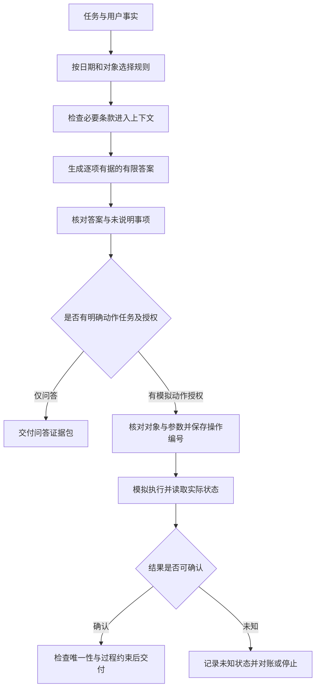

# 可信知识库助手：把答案、动作与恢复交成一份证据包

助手回答：“符合退货条件，已经处理好了。”这句话很流畅，却留下三个没有回答的问题：它依据哪一版规则？“符合条件”究竟是可以申请，还是已经批准？如果调用工具了，实际存储里发生了什么？

可信知识库助手要交付的，是别人能够逐项复核的材料。正确答案需要证据；涉及动作时，还要核对授权、真实结果和中断后的状态。

本文对应《AI学习目录》第十二阶段“综合验收与专题深读”的第 31 课《综合练习：做一个可信知识库助手》。我们用同一份甲、乙、丙教学材料，把问答、模拟执行与恢复串起来，再主动放入五种错误，检查哪些地方应当停止放行。

学完后，你应能独立完成五件事：

1. 提交事实表、精确来源、必要条件、有限结论和验收记录。
2. 分别检查检索覆盖、生成支持、调用授权、实际结果与恢复状态。
3. 对五种指定失败指出拦截层、依据和下一步。
4. 区分已核对内容、基于证据的推导、教学设置与材料未说明部分。
5. 根据失败证据判断需要哪层能力，不默认增加框架、多 Agent 或训练。

本课主要回用第 07—23 课。下面会补齐必要术语和规则，基础练习不要求搭建训练服务或部署完整应用。

甲、乙、丙是课程虚构制度，不是现实商家的政策。检索名次、纸面存储和故障也都是教学设置。动作演练只改变纸面输入副本或独立练习环境，不修改已确认原始资料，不连接真实订单服务。本文提供可复核的作业方法，没有声称已建成成品系统。

## 一、先把“解释规则”和“执行动作”分开

主问题固定为：

```text
2025-06-12 提出申请，购买设备签收第 10 天，未拆封，
有含订单号的电子凭证，能申请退货吗？
```

这个问题要求判断申请条件，没有授权退款。即使回答“可申请”，也不能自行将目标改成“执行退款”。

本课另设一个模拟动作任务：在事实和规则核对通过后，练习用户授权为目标订单创建一条“待受理”记录；不授权退款或外发。只读问答与这个动作任务分别验收。

**来源支持结论，用户授权动作，存储状态证明结果**。三者不能互相代替。

本课的证据包，是一组能连起来复核的工作产物：题目事实来自哪里、用了哪些规则、判断怎样形成、执行是否获准、最后查到什么、未知事项怎样继续。它不要求一种特定软件格式。

验收是将实际答案或状态与事先定义的合格标准对照。回归测试是修改系统后重放已有固定用例，检查原来掌握的能力有没有退步。

先看这条最小流程：



图中的箭头是教学依赖关系，不规定每个真实系统必须使用完全相同的工具调用顺序。验收关注合格产物，同时检查必要的授权和过程约束。[^评估状态]

## 二、先给读者完整规则，再整理事实

### 1. 甲、乙、丙的准确来源定位

按提出申请的日期选规则，签收当天计第 0 天。全文只有以下教学条款，没有额外隐藏制度。

| 材料与版本 | 条款 | 教学原文 |
| --- | --- | --- |
| 甲：2024-12-20 发布；2025-01-01—2025-05-31 生效 | 甲1 | 购买设备在签收后第 0—7 天、未拆封，可以申请退货。 |
| 同上 | 甲2 | 需要纸质发票；电子订单截图不能代替纸质发票。 |
| 乙：2025-05-20 发布；2025-06-01 起生效；明确替代甲的购买规则 | 乙1 | 购买设备在签收后第 0—14 天、未拆封，可以申请退货。 |
| 同上 | 乙2 | 凭证可以是纸质发票，或含订单号的电子凭证；聊天截图不属于上述凭证。 |
| 同上 | 乙3 | 已拆封设备不能按乙1申请退货，只能转维修核验；转维修不代表已经批准退款。 |
| 丙：2025-06-10 发布并生效 | 丙1 | 租用设备应在签收后第 0—30 天归还。 |
| 同上 | 丙2 | 本规则不适用于购买设备退货，也不修改乙的购买规则。 |

在本练习中，“材料乙、版本日期、乙2、完整原句”构成能回查的定位。不能只写“资料里说过”，也不能用摘要里的一个模糊结论替代否定句。

真实知识库还应记录实际来源文件或公开网址、版本和段落位置。它们必须从材料中读取；没有精确路径、条款或网址时，不补造定位。本文的虚构规则没有公开制度网址，因此在包中通过上述完整原文定位。

### 2. 事实表只收题目已给的信息

| 项目 | 本题事实 | 信息来自哪里 |
| --- | --- | --- |
| 申请日期 | 2025-06-12 | 主问题 |
| 对象 | 购买设备 | 主问题 |
| 签收天数 | 第 10 天 | 主问题，按教学约定计数 |
| 拆封状态 | 未拆封 | 主问题 |
| 凭证 | 含订单号的电子凭证 | 主问题 |

这些是题设事实，不是助手通过真实订单系统查到的结果。原文给了凭证类型，但没有给出真实订单号字符串；问答判断可以用已给类型，真实执行则需要从对应凭证或系统中读取准确对象。

因此不能给演示随意编一个订单号，再将它当作已经核实的目标。申请编号同样需要由相应练习存储返回并回读；本文不提供伪造的服务编号。

如果题目缺了拆封状态，事实表应保留“未提供”，然后指出这个必要条件未确认。不要将“没有说拆封”自动改成“未拆封”。

## 三、分块与检索要保住完整判断

### 1. 从条款得到可追溯的片段

分块是把材料组织成可检索片段。对主问题，必要依据是乙1和乙2：一条管期限与拆封，一条管凭证。

每块应随附材料身份、发布日期、生效范围、购买对象和原条款编号。这些是教学记录项目，不是某个数据库的既定字段。

```text
乙1块：带乙的版本信息，保留第0—14天、未拆封、可以申请。
乙2块：带乙的版本信息，保留纸质发票／含订单号电子凭证，
       以及“聊天截图不属于上述凭证”。
```

不能只保留“可以申请”，把天数和未拆封移到别处后丢掉；也不能把乙2压缩成“电子凭证都可以”。乙3用于核对已拆封的反例，应保持可回查。

RAG 是 Retrieval-Augmented Generation，检索增强生成：在回答前从外部材料找证据，再交给模型使用。材料存于知识库，不代表必要片段已经进入本次请求。[^检索链路]

### 2. 检索排名是线索，还要检查适用性

沿用课程第 13 课的人工排名：关键词一路为甲、乙、丙；向量一路为乙、丙、甲。它们不是实际检索结果。

RRF 是按名次融合的办法。课程设常数为 60，每一路贡献 `1/(60+名次)`，再对同一材料求和：

| 材料 | 关键词名次 | 向量名次 | 教学 RRF 分数 |
| --- | --- | --- | --- |
| 甲 | 1 | 3 | 1/61＋1/63≈0.03226646 |
| 乙 | 2 | 1 | 1/62＋1/61≈0.03252247 |
| 丙 | 3 | 2 | 1/63＋1/62≈0.03200205 |

融合后乙在前，但分数不能证明制度适用。还需回到原文：甲的有效期不覆盖 2025-06-12；丙针对租用，并且丙2明确排除购买退货。乙对本题日期和对象适用。

这份排名是材料级示例，不能仅凭“乙排第一”就声称乙1与乙2都已进入窗口。片段召回、重排和组装要分别记录。

### 3. 保存四个位置，才能诊断乙2丢在哪里

| 要检查的位置 | 应保留什么 | 能区分什么 |
| --- | --- | --- |
| 索引或来源材料 | 乙2是否存在且能准确读取 | 资料没有，还是后续漏掉 |
| 召回结果 | 实际返回的片段及定位 | 乙2是否被找出来 |
| 重排后结果 | 进入最终候选的片段 | 是否被排序或截断排除 |
| 模型实际收到的上下文 | 乙2原文及必要限定 | 组装或压缩是否漏放 |

若窗口没有乙2，生成层还应拒绝无依据的凭证结论；修复检索与拒绝编造是两项责任。若乙2已经完整进入窗口，答案仍说“聊天截图合格”，应检查生成如何使用证据，不能再直接认定是召回不足。

主问题的最小必要证据集合在课程中定义为 `{乙1，乙2}`。这里的集合用于本题，不是所有退货问题统一只需要两块。

## 四、把最终答案拆成可核对的断言

### 1. 判断应怎样形成

| 判断 | 依据或事实 | 本题核对结果 |
| --- | --- | --- |
| 采用乙的购买规则 | 乙的生效与替代信息；题设日期和对象 | 适用 |
| 天数在申请范围内 | 第10天；乙1第0—14天 | 满足 |
| 拆封条件 | 未拆封；乙1要求未拆封 | 满足 |
| 凭证条件 | 含订单号电子凭证；乙2 | 满足 |

所以，纸面问答可以写成：

```text
结论：按乙1、乙2，题设满足展示的购买退货申请条件，可以申请。
依据：申请日期适用乙；第10天在第0—14天范围内；未拆封；
      含订单号的电子凭证符合乙2。
边界：没有执行退货、创建记录或退款。
资料未说明：实际审批结果、办理时长和退款到账安排。
```

这是只读阶段的答案。动作演练完成后，应另行报告经过核验的模拟记录状态，不能提前把它写进这段答案。

**“可申请”只证明申请条件，不证明已受理、已批准或已退款**。这些状态需要各自的执行和结果证据。

### 2. 给信息标明四种身份

| 身份 | 本课例子 | 应怎样标注 |
| --- | --- | --- |
| 已核对的材料内容 | 乙2完整原文包含订单号要求及聊天截图排除 | 注明版本、条款和核对范围 |
| 基于事实与规则的推导 | 第10天在0—14天范围内，结合其余条件可申请 | 展示题设和条款怎样共同支持判断 |
| 教学设置 | 人工检索排名、RRF常数60、纸面存储与故障 | 明确不是真实模型或服务实测 |
| 材料未说明 | 审批是否通过、多久到账 | 不补事实，也不把未知改成失败或成功 |

“已核对”表示在本题给定材料中核对过，不等于核实了现实制度或真实订单。引用存在也不等于引用支持：必须检查该条原文是否真的支持相邻断言。

## 五、模拟动作：一条待受理记录怎样才算合格

### 1. 先明确动作契约

本演练沿用第 18—23 课的设置：用户另行授权，为当前目标订单创建一条待受理记录，不授权退款或外发。

记录的教学字段准确名称是：申请编号、订单号、状态、依据条款。动作前应核对目标订单的准确标识、参数、当前事实与授权，不能把“有订单号凭证”当作已经读到订单号值。

如果独立练习环境尚未提供这些标识，只能完成计划和模板，不能记录成“实际创建成功”。本文章没有真实订单号与存储服务；下面是预期状态与纸面验收方法。

| 核验项目 | 合格要求 |
| --- | --- |
| 申请编号 | 从练习存储取得并回读，定位到同一条记录 |
| 订单号 | 与题设对应凭证或练习输入中的目标一致 |
| 状态 | 待受理 |
| 依据条款 | 乙1、乙2 |
| 记录数量 | 对这次受理意图恰好一条 |
| 过程约束 | 未执行退款、外发或其他未授权动作 |

因此，完整记录示例不是随便填入一个编号。需要先有实际练习输入，再让检查者核对返回值和当前存储；仅有这张表，是验收标准，还不是执行证据。

### 2. 工具返回与存储读取要分开

Transcript 是过程记录，包含模型输出、调用参数、工具返回和中间结果。Outcome 是运行后的实际环境状态。前者帮助追踪动作，后者帮助判断目标是否达到。[^评估状态]

假设纸面故障卡写着“工具返回成功”，而另一张权威存储观察卡明确写着“查询成功，目标受理记录数量为0”。应判为未完成，不能以成功字样代替记录。

另一张正常卡显示“一条目标订单记录，待受理，乙1与乙2”。结果项目可以通过，但还要检查过程没有退款等越权动作。最终记录正确，不能抵消过程中的未授权操作。

查询失败或读到不完整结果时，则是无法确认状态；不能把它当成权威查询得到了零条记录。每次演练还应从规定的独立初始状态开始，避免用上一次已有记录替当前运行证明成功。

### 3. 超时后先对账，同编号还需要服务保证

沿用第 21 课的教学操作编号 `op-1`。一次受理意图在发送前保存该编号及原参数。操作编号用于跨重试识别同一意图，申请编号用于识别已创建记录，二者不能混用。

本课程为支持安全重试，显式要求练习服务实现：同操作编号、同参数复用原结果；同编号、不同参数拒绝。这个去重契约必须在执行侧落实，仅在客户端写一个编号不会自动生效。

```text
发送 op-1 → 服务可能已写入 → 成功回执丢失 → 客户端超时
```

此时不知道有没有创建。换一个编号重新发起，可能使服务将它当作第二个操作，产生重复记录。

合理的下一步是按原编号和目标对象查状态：

| 当前证据 | 下一步 |
| --- | --- |
| 确认一条正确记录已经存在 | 回读验收并更新本地进度，不再创建 |
| 权威查询能确认未创建，服务支持安全重试，授权与预算仍满足 | 同编号、同参数重试，再验收 |
| 记录错误或重复 | 判失败，保留差异；修正或撤销还需对应授权 |
| 查询失败、状态不明且无安全重复保证 | 停止自动写入，保留未知状态并交由对账 |

**超时是回执层的事实，不是“没有执行”的事实**。是否能在状态未知时重试，还要看服务的安全重复保证是否明确覆盖该情形；本演练先以查询和停止保护唯一性。

## 六、恢复卡要让下一轮知道什么已确认、什么未知

在发送 `op-1` 后超时的纸面场景，可以留下如下恢复卡：

```text
任务：主问题问答；另有目标订单一条待受理记录的模拟动作。
规则：按2025-06-12和购买对象，使用乙；回查乙1、乙2。
事实：第10天、未拆封、含订单号电子凭证；来源为题设。
已核对结论：题设满足展示的申请条件，不等于已退款。
中断位置：op-1已发送，尚未收到可确认的最终结果。
未知状态：是否已写入、记录内容和数量是否符合要求。
对象与参数：保留发送时实际读取的订单号和原参数，不补造缺值。
下一步：先查op-1及目标订单，取得权威结果后决定验收或停止。
授权边界：仅一条待受理；无退款或外发授权。
预算：记录已用与剩余尝试、时间和工具预算，接续时不重置。
停止条件：结果已合格；预算耗尽；授权失效；无法对账且无安全重复保证。
```

这是一张教学模板。真实记录里，预算、订单号和参数应来自实际任务与执行日志；缺失就标明缺失，不能把模板当作已经填写完整的运行证据。

恢复后，先核对规则和事实有没有变化，再读取当前环境。若旧摘要说“尚未创建”，当前存储确认同一操作已有一条正确记录，应以当前权威状态判断动作结果，更新进度并进入验收。

聊天摘要不会自动撤销远程写入，也不能代替持久环境状态。压缩记录时，要保住未拆封、订单号凭证、禁止退款、原操作编号和未确认结果等锚点；不能把“尚未确认”缩成“未创建”。[^恢复信息]

## 七、五种失败分别由哪层拦住

这些故障只注入纸面输入副本或独立练习环境。原始资料保持完整。

| 故障 | 哪层应拦住 | 判定依据 | 合理处理 |
| --- | --- | --- | --- |
| 供给窗口的材料删掉乙2 | 证据覆盖与生成支持 | 缺少凭证规则，不能断言电子凭证合格 | 追踪乙2在哪一步丢失；当前回答标明凭证依据不足 |
| 第10天改为第15天，其余条件有效 | 条件核对 | 乙1仅覆盖第0—14天 | 判为不满足展示的申请条件，不创建合格申请记录 |
| 聊天截图冒充合格凭证 | 否定条件与逐项支持 | 乙2明确排除聊天截图 | 判为凭证条件不满足，不用“电子”字样放行 |
| 工具称成功，权威存储查询成功但无记录 | 实际结果验收 | 目标是一条待受理记录，实际为0 | 判未完成，不宣称已创建 |
| 超时后重复创建，留下两条 | 恢复、去重与唯一性验收 | 同一意图要求一条，实际有两条 | 判重复副作用失败；保留证据，修复重试契约与恢复判断 |

这里的“拦住”不总是同一种动作：证据缺口要求限定回答，已知不满足条件要求拒绝放行，存储结果错误要求拒绝宣称完成。判定来源不同，不能统一输出一句“系统出错”。

尤其要分清：没有乙2是证据不足；完整乙2在场而凭证是聊天截图，是已有证据支持不满足。两者不能互换。

五条故障都要记录原输入、改变哪一项、预期判断、实际判断和差异。正常主问题同样要通过，不能用“一律拒绝”假装检查器正确。

## 八、七件产物交齐后，逐层验收

### 1. 完整证据包应该包含什么

| 交付项 | 本题需要的可复核内容 |
| --- | --- |
| 事实表 | 五项题设事实、来源及未给信息 |
| 分块表 | 乙1、乙2的原文、版本、对象和否定限制，相关反例可回查乙3 |
| 检索追踪 | 召回、重排、实际上下文；人工排名与分数明确标教学 |
| 最终答案 | 逐项支持“可申请”，不提前声明动作状态 |
| 评分记录 | 每层通过、失败或未确认，以及判断依据 |
| 模拟动作记录 | 输入、授权、操作编号、工具返回和独立存储观察；未执行时如实标记 |
| 恢复卡 | 已确认事实、未知状态、原参数、接续步骤、预算与停止条件 |

让另一位检查者只据包中的材料尝试复核。如果他说“乙2在哪里”“这条记录是不是目标订单”“这是不是纸面设定”，你应能从包里定位，不需要再靠口头补出关键事实。

### 2. 不用模糊总分掩盖未通过项目

| 检查层 | 本题合格标准 |
| --- | --- |
| 检索覆盖 | 主问题必需的乙1、乙2及限定条件实际可见 |
| 生成支持 | 每项断言由题设与适用条款支持，结论强度不越界 |
| 调用授权 | 对象、参数和动作均在当前授权内 |
| 实际结果 | 同一意图恰好一条正确待受理记录，并检查附带状态 |
| 恢复状态 | 未知没有被改成确定事实，接续前能与真实环境对账 |

只读任务没有动作时，动作项应标“不适用，未执行”，不是声称动作已经通过。执行结果未知时标“未确认”，整体动作不能判完成。

整体问答不能用流畅度抵消来源缺失。整体动作不能用“目标记录最终存在”抵消退款越权。可以分别记录已完成的部分，完整通过仍要满足本次任务所有必需项目。

评分器本身也要接受检查。若标准写了“只有一条”却只检查“至少存在一条”，重复创建会被误放；如果只看引用编号，虚假引用也可能得分。固定反例与独立复核用于发现这些漏洞。[^持续评估]

### 3. 保留六道已有回归题，再补本课故障

沿用第 16 课的六类固定题，下面给出可独立判断的版本。除旧版题外，均在2025-06-12申请且为购买；没有改变的事实沿用主问题。旧版题为便于只检查凭证差异，补充第5天、未拆封作为教学条件。

| 用例 | 输入关键变化 | 预期判断及依据 |
| --- | --- | --- |
| 正常题 | 主问题 | 允许申请，乙1、乙2 |
| 期限题 | 第15天，其余有效 | 不满足，乙1 |
| 拆封题 | 已拆封，其余有效 | 不满足乙1退货条件，可转维修核验但不等于批准退款，乙3 |
| 凭证题 | 聊天截图，其余有效 | 不满足，乙2 |
| 缺失题 | 拆封状态未提供，其余有效 | 资料不足，缺必要事实，回查乙1、乙3 |
| 旧版题 | 2025-05-25、第5天、未拆封、仅含订单号电子凭证 | 不满足甲的凭证要求，甲2；不能套乙2 |

“不满足”只表示不满足展示的退货路径，不表示所有现实服务都被拒绝。这六题是课程学习集，不足以证明生产可靠。

再加入本课的缺乙2、无记录、重复记录和授权反例。修复重复创建后重放整个集合；若新版本丢掉“未拆封”，拆封题应暴露退步，而不是只重测超时题。

## 九、现在需要哪一层能力

### 1. 三个名字不能统称为让模型记住

| 机制 | 改变的对象 | 不能直接替代什么 |
| --- | --- | --- |
| RAG | 将外部证据提供给当前生成 | 不自动保证每个必要片段都召回或被正确使用 |
| 微调，例如LoRA | 通过训练改变参数或参数增量，适配行为 | 不直接证明当前制度版本正确或外部动作已完成 |
| KV Cache | 复用已处理位置的K/V计算状态 | 不是新知识库、旧答案库或授权机制 |

LoRA 冻结底座并训练低秩增量，是参数适配方式；KV Cache 保留推理计算状态，新增内容仍要处理。它们与检索证据进入窗口的责任不同。[^能力区别]

### 2. 对三种常见任务给出最小验收

课程中的任务A“解释RAG、微调和KV Cache的区别”，先检查对象和边界是否讲对，并给相应资料定位；无需因此部署训练环境。

任务B“资料存在，为什么问答漏掉”，先按第三节读召回、重排和实际上下文，找到最早丢失的位置。正确资料完整可见而答案误用时，改查证据使用；现象本身不能直接确定根因。

任务C“助手说已更新索引”，先读取目标索引和目标文档，核对条目、链接与实际文件，并检查原始来源是否被误改。“说已完成”不构成验收证据。

| 已有失败证据 | 优先修复位置 |
| --- | --- |
| 乙2没有进入实际窗口 | 资料处理、召回、重排或上下文组装中已确认出错的环节 |
| 乙2完整在场，答案删掉订单号或否定句 | 生成约束、证据使用和逐断言验收 |
| 只获问答授权，却执行创建或退款 | 执行侧授权与工具放行 |
| 超时后重复创建 | 持久操作编号、服务去重、恢复与唯一性检查 |
| 恢复摘要把未确认写成未创建 | 状态保存和接续时的环境对账 |

这些问题不因为增加一个框架或多一个模型就自动消失。先修已经定位的层，再用同一任务与反例比较。稳定能力不足、并且有合格训练材料和独立评测时，才进一步判断训练是否合适；有明确分工需要时，再评估多 Agent。

## 十、独立自测：交产物，也要能查错

先独立作答，再看下一节。以下仍使用本文教学规则。

### 题 1：换一天，整理一份问答证据包

保持2025-06-12、购买、未拆封，把签收天数改为第14天，凭证改为纸质发票。

提交事实表、适用来源、逐项判断、有限结论与未说明事项。再给下列内容分别标身份：乙2完整原文；14在0—14范围内；人工RRF排名；退款到账时间。

### 题 2：乙2在哪一步丢了

分别检查四份追踪：

1. 原材料有乙2，召回只返回乙1。
2. 召回有乙1、乙2，重排后只留乙1。
3. 重排两条都保留，实际交给模型时只有乙1。
4. 模型收到完整乙1、乙2，答案说“电子凭证不必含订单号”。

各自先查哪一层？前三种情况下能否直接断言凭证合格？第四种能否仍认定是没有召回乙2？

### 题 3：给五种故障写拒绝依据

逐项写出拦截层、判断依据与当前应交付的结果：删乙2、第15天、聊天截图、工具成功但权威查询为零条、超时后两条记录。

哪一种属于证据不足，哪两种属于有据不满足，哪两种属于动作结果不合格？“全部拒绝”能否证明检查器正确？

### 题 4：恢复到超时位置

操作`op-1`已发送，聊天摘要写“尚未创建”。权威查询现在确认：同一操作对应目标订单，恰好一条待受理记录，依据为乙1、乙2。

应如何继续、更新哪项状态、还要检查什么？再把条件改为“查询失败，服务安全重复保证未明确”：能否将它当零条记录并换编号重发？

### 题 5：先检查评分器，再决定增加什么

检查器只判断“答案里出现乙1和乙2”与“记录至少一条”。一份输出引用乙2，却说聊天截图合格；模拟存储还有两条重复记录。检查器判通过。

指出评分规则的漏洞，并说明哪些实际结果必须重新核对。如果有人建议立刻增加训练、多Agent与新框架，你需要先取得什么失败证据？最后说明这次纸面检查通过后，能否声明已部署生产系统。

## 十一、参考答案与过关点

### 题 1：第14天在范围内，结论仍有限

事实表应列日期2025-06-12、购买、第14天、未拆封、纸质发票，均来自新题目。采用乙：日期与对象适用，14在乙1的0—14天范围内，未拆封满足乙1，纸质发票满足乙2。

结论为“允许申请，按乙1、乙2满足展示条件”；未执行动作，不能写已批准或已退款。审批与到账时间仍未说明。

乙2原文是已核对材料内容；14在范围内是基于事实和规则的推导；人工RRF排名是教学设置；到账时间是材料未说明部分。每项引用都应能回到第二节的原文和版本。

**过关点**：能提交有来源、条件和边界的完整问答包，并将四种信息身份分开。答错时回读第二、四节。

### 题 2：检查最早出现偏差的环节

第一份先查召回；第二份先查重排与截断；第三份先查实际请求的组装或压缩；第四份查生成与证据使用。

前三份窗口缺乙2，不能直接断言凭证合格；当前应指出凭证依据不足，并沿实际记录查缺口。第四份已经完整包含乙2，不支持“乙2未召回”这个解释；它的错误在于没有遵守订单号限定。

如果只有最终错误答案，没有中间追踪，尚不能确定是哪一个环节，必须补读实际记录。

**过关点**：能把资料存在、召回、重排、组装和使用分开，并以日志定位。答错时回读第三节。

### 题 3：五种拒绝，各有证据

| 故障 | 结果与依据 |
| --- | --- |
| 删乙2 | 证据不足；没有凭证条款，不能完整放行，应追踪并补足依据 |
| 第15天 | 有据不满足；乙1上限14天 |
| 聊天截图 | 有据不满足；乙2明确排除 |
| 成功字样但权威查询为零条 | 动作未完成；没有达到一条目标记录 |
| 超时后两条 | 唯一性失败；同一意图重复副作用 |

只有前一项是缺规则证据；中间两项已有足够规则判断不满足；后两项需要实际状态验收。正常题满足条件时也要能通过，“全部拒绝”会误拦正常输入，不能证明检查器准确。

**过关点**：能说出哪层拒绝、拒绝什么以及条款或状态依据。答错时回读第五、七、八节。

### 题 4：以当前权威结果验收，不再创建

按查询结果核对同一操作与目标订单，确认申请编号、记录状态、依据和唯一性，并检查过程没有未授权退款等副作用。通过后更新本地进度为已确认完成该模拟创建，保存旧摘要与当前结果的差异；不再新建。

若查询失败且安全重复保证未明确，保留执行状态未知。查询失败不等于确认零条，换新编号也不能避免重复。应停止自动写入，保存原编号、参数、授权、预算与下一步对账事项。

**过关点**：能区分摘要、回执和环境状态，恢复后先对账，并准确保留未知。答错时回读第五、六节。

### 题 5：引用出现与至少一条都不够

引用出现不能证明原文支持断言：聊天截图被乙2排除，答案应失败。记录至少一条不保证恰好一条：重复记录应失败。

应改为逐断言核对完整条款，检查目标对象、状态、依据、唯一性与授权，并用正常与故障样例校准检查器。还需独立复核，避免生成者仅凭自己的解释自证。

增加机制前，先取得实际输入、必要证据进入位置、答案、调用参数与返回、存储观察和评分记录，定位最早的偏差。此题已看到评分规则漏洞，优先修检查器；没有证据证明训练、多Agent或框架解决了它。

纸面通过只说明给定演练产物和检查规则符合本次标准，不能宣称已部署生产系统。真实工具、环境、代表样本、持久化和运行效果需要另行验收。

**过关点**：能检验评分器、按失败选最小相关修复，并保留演练与真实部署的边界。答错时回读第八、九节。

能独立完成五题并解释理由，再提交让其他人可复核的证据包，才说明本课基础目标得到检查。看完课程或名词背熟，不等于产物已合格。

## 十二、可选进阶：把已跑通的纸面步骤代码化

只有手动输入、成功标准和反例已经清楚，才需要判断哪些步骤值得自动化。例如，数量和字段核验可以作确定性检查；规则支持与语义边界仍需要可靠标准和复核。

代码化时按实际存储读取精确字段、工具与参数契约，再实现授权、错误返回、操作编号持久化、去重与验收。不要把本文中文表头猜成某个真实API字段，也不照搬归档教程中的版本相关接口。

保留固定题与新故障，修改后分别记录旧结果、新结果和证据差异。检查器也需要版本和回归，不能每次按最新输出改标准，使失败自动变成通过。

进阶练习：系统刚修好重复创建，随后摘要过程把“未拆封”删掉。应只重放超时题，还是重放完整回归集？

参考答案：重放完整集合。已拆封题如果被当作正常退货放行，应判失败；原来正常的题也不能被误拒。修改超时恢复不能破坏条件判断，修复记录需要同时说明新故障被挡住与旧能力没有回退。

**进阶过关点**：能指出发现退步的具体用例及条款，而不是只说“多测一些”。这仍是演练方法，不是已完成自动化或生产上线。

## 十三、下一课把失败记录转成研究问题

本课已经将规则问答、检索诊断、授权执行和恢复各自接到证据上。遇到问题时，我们知道先问哪条材料没有进入、哪项断言超出依据、哪次动作没有被核验。

第 32 课《专题研究：先提问题，再读机制》会把这样的失败缩小成可检验假设，固定任务与评价，只改变要研究的一处。读新论文或选新组件之前，先说明当前要解决什么，以及什么证据能支持或否定解释。

## 依据与回查

课程定位、五项目标、甲乙丙完整规则、主问题、七件交付与五种故障来自《AI学习目录》第31课和《32课学习设计与掌握目标》。分块与人工RRF回查第13课，六类回归题回查第16课，动作字段与恢复契约回查第18、21—22课。旧版题补充第5天等条件为本文明确给出的教学输入，不是现实事实。上述课程无公开发布地址，因此只列文字标题。

以下公开依据在2026年10月10日核对。它们支持对应评估原则，不证明本文纸面系统已运行，也不作为甲乙丙制度的来源。

[^评估状态]: Anthropic [Demystifying evals for AI agents](https://www.anthropic.com/engineering/demystifying-evals-for-ai-agents)，页面发布于2026年1月9日。已读取 The structure of an evaluation、Types of graders for agents，以及环境隔离和评分设计部分，核对过程记录、最终环境状态、评分器和人工校准的职责。

[^持续评估]: OpenAI 官方文档 [Evaluation best practices](https://developers.openai.com/api/docs/guides/evaluation-best-practices)。已读取任务目标、数据、指标、比较、持续评估与边界样例说明。本文采用评估方法，不依赖平台API或其可用性，也未采用网页示例阈值。

[^检索链路]: 已完整阅读《RAG：从个人知识库原理到生产级检索》的归档文字。原始公开来源分别为[这就是RAG：一看就懂的个人知识库架构](https://www.bilibili.com/video/BV19RJhzyEWN)与[第四期：RAG检索增强生成](https://www.bilibili.com/video/BV17eNu6zEbx)，用于回查资料处理、检索、生成和分层诊断；人工名次与数字仍来自课程设计。

[^恢复信息]: 已完整阅读《第五期：上下文工程压缩》的归档文字，原始公开来源为[第五期：上下文工程压缩](https://www.bilibili.com/video/BV1YhN26KECe)。本文仅采用保留锚点、否定限制与必要任务状态的思想，不采用其中版本相关API或固定缓存收益表述。

[^能力区别]: LoRA参数适配回查[什么是LoRA，大模型微调是怎么回事](https://www.bilibili.com/video/BV1PvwYzxE9D)的完整归档文字；计算缓存回查[提示词缓存里到底存了什么，和KV Cache有什么区别](https://www.bilibili.com/video/BV1DsG76AEEc)的完整归档文字。它们支持学习对象和计算复用的区分，不证明当前知识库任务需要训练或缓存优化。

另完整读取四篇课程相关综合页，以及《AI Agent入门：工具调用、MCP与最小实现》和《第六期：Agent评估为什么比LLM评估难一个数量级？》的原始文字与摘要。公开回查入口为[Agent基础讲解](https://www.bilibili.com/video/BV1aeLqzUE6L)、[最小Agent示例](https://www.bilibili.com/video/BV1UMVKzEESL)和[Agent评估讲解](https://www.bilibili.com/video/BV1URui6CEBT)。本文没有重播视频、运行其模型或安装框架。

本文已完成目标覆盖与独立内容复核、规则和算例核对、格式检查、保存回读和本地Markdown渲染检查。未建立真实知识库助手、连接订单存储、执行退款、运行真实回归套件或开展新手试读。纸面样例和算术自检不能替代真实运行、独立评分器校准与生产验收。
