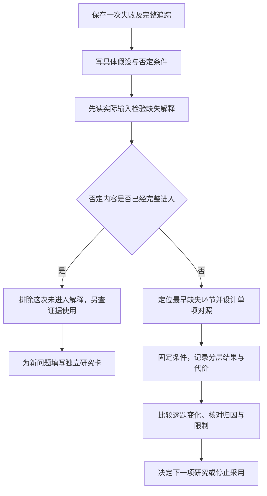

# 专题研究：把一次失败变成可检验的问题

知识库助手把聊天截图当成合格凭证。你准备怎样修：换模型、改分块、扩大窗口，还是加入新框架？

如果先改了很多东西，答案后来正确了，你仍然不知道哪一项有用。更好的起点是保存这次失败，问一个小问题：“乙2中排除聊天截图的句子，是否根本没有进入模型收到的上下文？”

这个问题可以查证，也可以被否定。它会决定下一步值得研究哪个环节，而不是先挑一个新技术名字。

本文对应《AI学习目录》第十二阶段“综合验收与专题深读”的第 32 课《专题研究：先提问题，再读机制》。我们继续使用前课的教学规则，完成一张研究卡，再说明怎样读论文、设计对照和报告结果。

学完后，你应能独立完成五件事：

1. 将“RAG不准”缩成可确认或否定的具体假设。
2. 固定模型、题目、提示与评价，只修改本次要考察的一处。
3. 分层记录证据进入、回答、延迟和资源，不只报告总分。
4. 区分百分点与相对提升，并识别同时改多项时的归因限制。
5. 保留版本、基线、任务和未复现边界，再决定哪些专题值得读。

最低先修是第 13 课的检索诊断、第 15 课的证据边界、第 16—18 课的评估，以及第 31 课的失败记录。下面会补齐必要术语，不要求你同时复现所有模型论文。

本文规则、错误轨迹和六题成绩都是课程教学设置。分块示范只操作材料副本，不修改已确认原始资料。我们没有运行真实检索、模型或性能实验，缺少的版本和测量值会明确标记，不补造。

## 一、先保存失败，再提出解释

### 1. 研究题从一个可观察的错误开始

RAG是Retrieval-Augmented Generation，检索增强生成：先检索外部证据，再让模型依据它回答。它有多个可能出错的环节，不能只看答案错误就确定根因。[^检索链路]

本课的失败问题是：

```text
2025-06-12提出申请，购买设备，第10天，未拆封，
仅提供聊天截图。助手却判断“凭证合格，可以申请”。
```

先把支持判断的教学原文放在这里，避免依赖你记住前课：

| 版本与条款 | 原文及适用信息 |
| --- | --- |
| 乙的版本 | 2025-05-20发布，2025-06-01起生效，明确替代甲的购买规则 |
| 乙1 | 购买设备在签收后第0—14天、未拆封，可以申请退货。 |
| 乙2 | 凭证可以是纸质发票，或含订单号的电子凭证；聊天截图不属于上述凭证。 |
| 乙3 | 已拆封设备不能按乙1申请退货，只能转维修核验；转维修不代表已经批准退款。 |

签收当天计第0天，按提出申请的日期选择规则。上表是虚构制度，不是现实商家政策。

本题天数与拆封符合乙1，但乙2排除聊天截图。正确结论是不满足展示的购买退货申请条件。不能因为它也是一张“电子截图”，就忽略凭证类型的否定限制。

### 2. 失败记录至少要追到实际窗口

为这一次错误保存以下材料：

```text
题目与用户事实
→ 原始规则和版本
→ 切出的片段
→ 检索实际返回的片段
→ 重排后保留的片段
→ 模型实际收到的完整上下文
→ 模型输出
→ 按既定标准检查的结果
```

其中，“材料在知识库里”与“材料进入这次请求”是不同事实。日志应记录实际文本与来源定位，不能只保存“检索成功”或“已读乙2”这样的自述。

若没有这些记录，当前只能说发生了误判，还不能确定是分块、召回、重排、组装或证据使用的问题。先补证据，比直接换模型更有助于诊断。

## 二、假设要写清楚怎样被推翻

### 1. 从宽泛抱怨缩到一条信息路径

假设是对现象的具体解释，应带来可以检查的预期。本文提出：

```text
假设：乙2的接受条件与排除聊天截图的句子被切到不同片段，
      排除句没有进入本次实际窗口，造成凭证判断缺少依据。
```

这比“RAG效果不好”更小：指定了问题、条款、处理环节与缺失内容。

在一个合成失败轨迹中，可以构造如下状态：

| 位置 | 教学观察 |
| --- | --- |
| 原始乙2 | 接受条件与排除句都存在 |
| 原分块 | 接受部分与排除部分分开，各自仍带来源 |
| 召回及后续组装 | 接受部分进入，排除部分没有进入 |
| 实际窗口 | 没有“聊天截图不属于上述凭证” |
| 错误回答 | 把聊天截图判断为合格 |

这张表是课程错误轨迹的纸面演练，不是实际系统日志。它说明假设与哪些观察相容，还没有单独证明分块导致了全部错误。

看到否定内容缺失，也要继续查它最早在哪一步丢失：已经切出却未召回，与召回后被重排排除，不是相同问题。

### 2. 一条反例可以否定这次的特定解释

再换一份观察：本次模型输入完整包含乙2，排除句也原样可见，回答仍然错误。

这就否定了“本次排除句没有进入窗口”这个解释。接下来应检查模型如何使用证据，以及输出怎样被评分。

**完整证据已经在窗口，只排除了这一特定缺失解释**。不能顺势写成“所有分块影响都不存在”或“根因一定是模型太小”。分块还可能改变信息组织、位置与其他上下文，这些是需要另立问题的影响。

### 3. 修改后正确，也不能省略推理链

将两部分放回同一块后，答案正确，与假设相容。但一次正确还可能受到采样波动、上下文其他变化或评分漏洞影响。

需要在固定条件下比较，核对否定句是否确实进入、答案是否按条款改变，并检查正常题和其他边界题有没有退步。研究结论可以逐步变得有依据，不需要一次就宣称找到普遍规律。

## 三、对照实验：固定什么，只改什么

对照是把原方案与一个明确变动后的方案放在相同评价条件下比较。基线就是本次比较所用的原方案，不是某个行业最强产品。

本例只研究一项改动：将乙2接受条件与排除句保留在同一个片段，原文和来源元数据不变。

```text
原分块：接受部分 / 排除部分
新分块：完整乙2在同一块
```

这不是同时加解释文本、改Embedding、换模型和增加图谱。那些变动各有研究问题，暂时不进入本轮。

### 1. 固定条件要具体到可核对

| 固定项目 | 应记录和保持什么 |
| --- | --- |
| 资料 | 同一原文、版本、范围与来源信息 |
| 问题集 | 相同题目、相同用户事实与预期标准 |
| 生成模型 | 实际模型标识、版本或快照、适配器及生成设置 |
| 表示与检索 | 相同Embedding模型、检索方式、返回数量和过滤规则 |
| 重排与组装 | 相同重排设置、上下文预算和组装规则 |
| 提示 | 相同任务要求、提示模板、证据使用和输出规则 |
| 评分 | 相同判据、参考条款、评分器版本及复核方法 |
| 环境 | 软件与代码版本、硬件、并发负载、缓存与初始状态等测量条件 |

Embedding是将文本转换为向量表示的模型。检索返回数量常记作Top-K，即取排名靠前的K项；K的实际值必须从配置读取，不把论文的值当作本题默认值。

如果手头没有模型版本、调用参数或实际提示，就写“未提供”，先取得这些记录。不能用“最新模型”“默认配置”填空后宣称可以复现。

### 2. 锁定提示模板，不是要求证据文本完全不变

新分块可能使实际召回与最终窗口变化。这正是要观察的后果，不能又强制两边窗口内容完全相同，再称它检验了分块效果。

固定的是任务指令、组装规则和预算等条件。片段内容和最终窗口随分块改变，应该保存并分析，而不是偷偷当作另一项主动优化。

新片段通常还需要重新编码、重建相应索引。沿用同一模型与参数、按新分块重新建索引，是使目标改动生效的必要步骤；顺便升级Embedding或调高返回数量，则加入了新变量。

**一次只改一处，指只主动改变要研究的因素；派生变化仍要记录**。不同长度、索引规模和窗口内容都可能成为解释结果的线索。

### 3. 保留正常与反例

本课程回归题覆盖正常、超期、已拆封、聊天截图、缺拆封状态与旧版凭证问题。不要只留那一道刚修好的聊天截图题。

还可以按本课研究目标加入“电子凭证未说明订单号”的迁移输入。它应保留资料不足的边界，不能让新分块把所有电子材料都放行。

若需要旧版用例，须附甲的原文：甲在2025-01-01—2025-05-31生效，甲2要求纸质发票、电子订单截图不能代替；不能只列一个“旧版”标签却不给判断依据。

这些是学习方法用的小型合成题，不是具有生产代表性的评测集。真实采用前还要补充实际任务、更多边界与独立留出题。

## 四、研究记录要沿证据路径分层

### 1. 总分升高之前，先看哪里改变

| 记录层 | 每题需要保存什么 | 不能替代什么 |
| --- | --- | --- |
| 资料处理 | 原文、分块内容、版本和来源定位 | 不等于已召回 |
| 召回 | 乙2接受部分和排除内容是否返回 | 不等于已进入最终窗口 |
| 重排与组装 | 哪些片段最终被保留、有没有截断 | 不等于模型正确使用 |
| 实际模型输入 | 完整输入及必要限定内容 | 不等于答案正确 |
| 回答与评分 | 实际结论、逐项支持、评分理由 | 不等于执行或生产可靠性 |
| 时间与资源 | 按规定口径测得的耗时、Token、索引或存储占用 | 不等于质量收益 |

“乙2命中”这个标记过于粗：若只命中接受部分，排除内容仍缺失，不能算完整凭证证据覆盖。应明确检查的是哪些句子、来源与条件。

研究结论应能连接这条链：改了什么→哪些证据进入发生变化→答案怎样改变→正常与反例如何表现→时间和资源付出了什么。

### 2. 延迟与资源要规定口径

检索耗时、重排耗时、模型生成耗时与完整请求耗时不同。测端到端延迟，要先规定起止点，再在相应条件下记录，不能把较快的一小段冒充整个请求更快。

输入Token应使用该模型对应的实际计数，另记录输出、调用和重试；字符数不等于Token数。索引数量、存储字节和GPU占用也不是一个指标，应按问题选取并说明测量方法。

比较速度时记录缓存冷热、并发与测量环境。某一方案预热、另一方案冷启动，会影响归因；未测量的项目填写“未测”，不能填写0或估造具体毫秒值。

### 3. 逐题旧结果和新结果一起保存

每次运行可以采用以下中文记录项目；它们是方法模板，不是某个评估平台的API字段：

```text
题目及条件：原始输入、参考条款与预期判断
方案与版本：原分块或新分块，以及实际配置定位
证据路径：原片段、召回、重排、实际上下文
回答：实际输出与逐断言依据
评分：通过／失败／无法确认，附具体理由
代价：各阶段耗时、端到端耗时、实际Token与所选资源指标
运行条件：采样设置、重复编号、缓存状态与环境
限制：未记录、未测量、未复现或发生变更的部分
```

只有“4/6”这个总数，不知道哪两题错，也不知道某一题修好后另一题是否退步。本文没有逐题模型输出，不能替课程分数补出一份真实运行明细。

## 五、4/6到6/6：算对数字，也要说对结论

### 1. 百分点衡量两个比例的差

课程给出教学成绩：原来六题答对四题，新方案六题全对。准确率以答对题数除以总题数计算：

```text
原准确率：4/6 ≈ 66.6667%
新准确率：6/6 = 100%
```

百分点表示两个百分比之间相差多少：

```text
100%−66.6667% ≈ 33.3333个百分点
```

所以可以说“增加约33.3个百分点”。不要写“增加33.3%”代替它，这会混淆分母。

### 2. 相对提升以原值为分母

相对提升问“增长量相对于原来有多大”：

```text
(新准确率−原准确率)/原准确率
= (1−4/6)/(4/6)
= 50%
```

这两种说法不矛盾，分别回答不同问题。准确率是从约66.7%到100%，不是变成150%。原值为0时，常规相对提升公式不能直接使用，应报告原值、新值和绝对变化。

### 3. 组合方案变好，不等于分块单独有效

如果同时更换生成模型和分块方式，总分从4/6到6/6，只能描述这组组合方案在给定教学成绩上的差异。没有分开的对照，不能将50%的相对提升全部归给分块。

归因是判断观察到的变化由什么因素造成。一次只改目标因素，是建立可解释对照的基本做法；还要检查条件、重复结果和评分是否可信。

**数字计算正确，不代表归因和适用范围正确**。六道合成题、没有重复运行，不能写成“生产准确率提升50%”；这些数也没有证明长期稳定性或平均请求延迟。

如实的表述可以是：

```text
教学成绩从4/6变为6/6，增加约33.3个百分点，相对增加50%。
如果同时改模型与分块，不能分离两项贡献。
该小型合成例子没有真实运行或重复测量，不能外推生产效果。
```

## 六、研究卡：先把可以重做的条件写齐

| 项目 | 本例方法部分的填法 |
| --- | --- |
| 问题 | 聊天截图被错误当作有效凭证 |
| 假设 | 乙2排除内容被切开且未进入本次窗口，使判断缺依据 |
| 先修与定位 | 能读规则、检索追踪和逐项评分；回看13、15—18、31课 |
| 基线 | 原分块、原生成流程及固定评分标准 |
| 单项改动 | 接受条件与排除内容保持同块，来源元数据不变 |
| 固定条件 | 同一原文、题目、模型及版本、提示模板、检索与重排设置、评价 |
| 分层指标 | 完整乙2证据返回及进入、逐题回答与支持、时间和所选资源 |
| 对照题 | 正常、聊天截图、电子凭证未给订单号、旧版及已有回归题 |
| 否定假设的证据 | 原实际窗口已完整包含乙2，本次错误不能归因于否定内容未进入 |
| 来源 | 已给教学原文；真实运行日志与相应机制原件待补 |
| 限制 | 本文是纸面合成练习，没有实际模型版本、运行输出或代价测量 |

这是一张填好了研究思路的教学卡，还不是可复现实验记录。要运行，需补齐真实配置、问题全文、来源版本、代码或处理规则以及日志；关键项缺失时，复核者应指出不足，不能假装能原样重做。

完成实验后另加“实际改动、结果、逐题差异、证据位置、结论和限制”。没有跑过就写“计划”；不要将预期结果填进实际结果栏目。



## 七、先读实验条件，再决定哪些机制值得深读

### 1. 分清四个证据层次

| 层次 | 实际完成了什么 | 可以怎样表述 |
| --- | --- | --- |
| 来源陈述 | 读到视频、文章或厂商报告的说法 | “该来源报告……”并保留条件 |
| 原件核对 | 对照准确论文版本、表格、代码或官方文档 | “已核对该机制或实验描述” |
| 本地复现 | 按明确协议运行，并取得对应输出与记录 | “在所列环境复现了所列部分” |
| 当前任务验证 | 在自己固定任务与标准下比较 | “对这组条件取得所列结果” |

原件能支持论文自己的实验，不会自动证明你的系统同样有效。复现某个算子，也不能替整条业务链完成验收。

读报告时至少找出：问题、模型与版本、基线、语料与题目、关键配置、评价指标、结果表和未复现限制。缺少某项，就把缺口留在研究卡中。

### 2. 检索失败率下降不是答案准确率同比提升

Anthropic的Contextual Retrieval研究为片段添加文档上下文，并对检索配置作比较。它报告的是相应条件下的检索指标，包括前20片段的检索失败率；还比较了表示模型、词法检索组合与重排。[^上下文检索]

这支持“看清分块上下文和实验条件再测试”的方法，不是给本文六题打分。它的方法也不等同于这里只把乙2两部分放回同一块的改动。

即使某项检索失败率下降，生成仍可能忽略证据、误用条件或被错误评分。不能将检索失败率的相对下降，直接改写成最终答案准确率的相对提升。

### 3. 位置问题另开一轮

如果完整乙2已经进入，而答案仍错，可以另问：“证据处于上下文中间时，是否更容易被忽略？”

Lost in the Middle的固定版本，在相应任务中通过改变相关材料位置考察表现，为位置对照提供方法依据。它的受测模型和任务有明确条件，不能推断你当前模型一定有同样的下降幅度。[^位置实验]

新实验中固定模型、题目、评分、证据内容和材料集合，只改变相关证据的放置位置，并记录实际输入顺序。不要一边把乙2合块，一边把它移到最前，再将变化全部归给分块。

### 4. 专题入口由失败证据决定

| 当前能确认的问题 | 优先回看的范围 | 读机制前仍要补什么 |
| --- | --- | --- |
| 乙2没有进入窗口 | 分块、召回、重排和上下文组装 | 最早丢失位置、原片段与配置 |
| 完整证据在场，随位置或长度变化表现不同 | 证据使用与长上下文评估 | 位置对照、模型版本、窗口和任务记录 |
| 任务质量合格，资源或延迟成为瓶颈 | 缓存、头共享、数据搬运与存储管理 | 有效状态、实际占用、硬件和端到端测量 |
| 实际训练中出现异常更新或失稳 | 深层训练稳定性专题 | 损失、梯度与发生异常的模块记录 |
| 训练奖励上升，独立任务仍未改善 | 后训练、反馈与评估专题 | 奖励定义、训练数据、独立留出与真实行为 |

“长上下文模型架构”“深层模型训练稳定性”“大模型后训练”在课程资料中分别承担这些入口。本文只指导如何提出问题，不在一课中展开或复现所有算法。

奖励与独立评测不同，训练得分上涨不足以证明真实能力提升；没有相应训练数据和可靠反馈，也不应把强化学习当作当前检索缺口的默认补丁。[^专题边界]

待补证清单是缺口入口，不是补齐证明。若一项数字还缺模型版本、原表或完整运行材料，应继续记录缺什么，不能因它进入了摘要就升级为普遍结论。

## 八、独立自测：写得出对照，也认得出不足

先合上正文作答，再看下一节。题中成绩仍为教学给定，不是模型实测。

### 题1：什么证据否定缺失解释

你提出：“聊天截图误判是因为乙2排除句没有进入窗口。”现在实际输入记录显示，乙2完整原文已进入，回答仍说聊天截图合格。

这否定了什么？能否直接证明所有分块都无关，或证明必须换更大模型？写出一个下一步要检查的问题和所需记录。

### 题2：把混在一起的改动拆开

一个方案同时合并乙2、升级Embedding模型、增加检索返回数量、改提示，并把乙2移到上下文开头。

如果你只研究“接受条件与排除句保持同块”，哪些条件必须固定？新片段重新编码和重建索引算不算另一项主动优化？实际窗口必须与原方案完全一样吗？

### 题3：只有总分，还缺哪些记录

报告只写“原方案4/6，新方案6/6，效果更好”，没有逐题输入、窗口、输出、配置、耗时或资源信息。

指出至少四类缺失记录，解释它们怎样帮助定位问题。没有测量延迟时应写0吗？检索完整率提高是否自动等于答案合格率提高？

### 题4：换一组成绩，计算并判断归因

原来六题答对四题，修改后答对五题。计算原准确率、新准确率、百分点变化和相对提升。

若同时换了模型与分块，能否把这次变化全部归给分块？再说明为什么六道合成题的一次成绩不能证明生产长期收益。

### 题5：报告有提升，当前该读什么

某公开报告在其条件下发现检索失败率明显下降。有人因此计划同时给自己的系统加入更多检索机制、换模型并开始训练，宣称最终答案会同比改善。

先列出需要保留或补查的版本、基线、任务、配置、指标与限制。若当前记录显示乙2没进窗口，应优先研究哪一层？若乙2完整在场，且位置变化时结果不同，又该怎样另开研究？

## 九、参考答案与过关点

### 题1：排除特定解释，继续用证据定位

完整乙2已经进入，否定了“本次排除句未进入窗口”的解释。它没有排除分块造成其他信息组织或位置影响，也没有证明根因一定是模型规模。

下一步可以问：“模型是否忽略了已给的否定条款，还是评分器把错误答案当正确？”需要保存实际输入、原输出、逐断言支持与评分规则；若研究位置，再独立设计固定内容的放置位置对照。

**过关点**：能明确否定假设中的哪一项，并避免扩大排除范围或直接补出根因。答错时回读第二节。

### 题2：目标变动与派生结果分开

固定原文和问题集、生成模型及版本、Embedding模型、检索返回数量和规则、重排、提示模板、预算、评分标准及测量环境。不要同时升级表示模型、增加数量、改提示或移动证据位置。

按同一配置重新编码新片段并建索引，是让分块改动生效的必要工作，不是额外选择一个新的研究因素；但要保存片段和索引版本。

实际窗口不必逐字相同，因为分块可能改变召回和进入的证据。相同的是指令模板、组装规则与预算，窗口差异本身就是要记录的结果。

**过关点**：能提出只主动改变分块的对照，同时解释必要重建与实际窗口变化。答错时回读第三节。

### 题3：能看到总分，仍看不到失败路径

至少补齐题目与参考标准、真实模型和配置、分块与召回/重排/最终窗口、逐题输出与评分理由，以及按口径测得的延迟和资源。运行条件、重复次数、缓存状态与未测限制也应保留。

这些记录分别检查是否缺材料、在哪一步缺失、证据在场时是否误用、评分是否公平，以及成本是否变化。没有逐题记录，就不能替报告断言某两题被修好了或没有回退。

未测延迟写“未测”，不是0。必要证据找全只是生成获得依据的前提，答案仍要按规则独立检查。

**过关点**：能从证据进入、生成、评分和代价分别提出记录，不用总分替代分层结论。答错时回读第四节。

### 题4：增加约16.7个百分点，相对增加25%

```text
原准确率：4/6 ≈ 66.6667%
新准确率：5/6 ≈ 83.3333%

百分点变化：(5/6−4/6)×100 ≈ 16.6667个百分点
相对提升：(5/6−4/6)/(4/6) = 25%
```

若模型与分块一起改，无法分离贡献，不能将变化全部归给分块。应该固定模型研究分块，或固定分块研究模型，并记录相应条件。

六道合成题的一次成绩不足以代表真实任务分布；还缺重复运行、逐题变化、独立检验与成本测量。可以描述这组教学成绩，不能扩写成生产长期提升25%。

**过关点**：能算对两个分母，保留共同改动和小样本的限制。答错时回读第五节。

### 题5：先确认失败层，再读对应机制

先读取报告的准确模型版本、比较基线、数据和题目、检索或训练配置、指标定义、结果位置与限制。核对是来源报告、原件核对、本地复现，还是当前任务验证。

检索失败率下降不自动推出最终答案同比改善；报告的配置也不是当前系统默认配置。没有逐项对照，不将多个机制一起加入后单项归功。

乙2没进窗口时，先查分块、召回、重排和组装的实际记录，定位最早缺失环节；不默认开始训练。完整乙2在场而位置变化影响表现时，另开位置对照：固定内容集合、模型、题目和评分，只改变放置位置，并核验实际输入。

真实模型效果仍需实际验证。阅读机制、拿到原件和完成本地实验，是不同进度。

**过关点**：能保存来源条件与未复现边界，按失败选研究入口，不将厂商成绩搬到自己任务上。答错时回读第六、七节。

能独立完成五题并解释理由，再提交一张能让别人重做或指出缺口的研究卡，才说明本课基础目标得到检查。读完论文或记住提升比例，都不能单独当作已经掌握。

## 十、可选进阶：按问题扩展实验

### 1. 已经改了两项，怎样补对照

如果已经同时换模型与分块，可以分别保留四种条件：

| 条件 | 生成模型 | 分块 |
| --- | --- | --- |
| 原基线 | 原模型 | 原分块 |
| 单改分块 | 原模型 | 新分块 |
| 单改模型 | 新模型 | 原分块 |
| 组合 | 新模型 | 新分块 |

其余条件相同，比较每题与相应分层指标，再看分块效应是否随模型改变。这是补充研究安排，四种条件的结果还没有给出，不能凭这张表算各自贡献。

两个变动可能有交互作用，也不能将单项收益随意相加或相乘。更完整的消融实验会逐项去掉组件、检验作用；它仍需要真实运行与适当评价。

### 2. 重复与留出题解决不同问题

重复运行帮助观察同一任务的波动，应记录采样设置、初始环境与顺序。设了固定随机种子，也不保证跨硬件、版本和服务完全一致；持续共享缓存或状态还可能影响比较。

留出题在调参和选择方案时不使用，用于检查已选方案能否处理未参与优化的输入。不断看留出成绩再改方案，会使它逐渐变成调参数据，需要另外保留独立检查。

需要多少样本与重复，应根据任务分布、风险和希望判断的差异决定，不能将本课六题当作统计结论的统一门槛。涉及显著性与置信区间时，再按真实实验协议补相应分析。

### 3. 何时停止采用，而不是继续加组件

如果对照没有显示稳定任务收益、来源关键条件尚缺、或额外成本超过本次目标能接受的范围，应记录结论和缺口，不把“做了研究”当成“必须上线”。

**进阶过关点**：能说清新增对照、重复和留出各回答什么问题，并保留没有运行的部分。实验越复杂，越需要清楚的证据链，而非更长的组件列表。

## 十一、课程结束后，用研究卡决定下一步

这节课结束的是入门课程，不是研究与维护。下一步从一个具体失败或资源瓶颈出发，保存证据、写假设、固定条件，再选择对应资料深读。

可以把新记录接回第31课的证据包，回到薄弱的小节复做；准备保存研究结论时，继续保留精确来源、版本、条件和未完成核验。无需为了继续学而预先复现全部论文或加入全部新机制。

## 依据与回查

课程定位、五项掌握目标、乙2否定内容的研究问题、单项分块改动，以及4/6到6/6成绩来自《AI学习目录》第32课和《32课学习设计与掌握目标》。乙规则回查课程统一教学材料；5/6成绩为本文按同一六题分母构造的算术迁移题，不能作为模型输出。上述课程没有公开发布地址，故只列文字标题。

以下公开机制依据于2026年10月10日核对，来源成绩不作为本系统成绩：

[^上下文检索]: Anthropic [Introducing Contextual Retrieval](https://www.anthropic.com/engineering/contextual-retrieval)，2024年9月19日。已读取方法、实验配置说明、检索指标与重排的代价边界；网页采用包含`1−recall@20`的检索指标，不能据此推出本文答案准确率。本文未运行其流程或复现结果。

[^位置实验]: Liu等，[Lost in the Middle: How Language Models Use Long Contexts，固定v3](https://arxiv.org/abs/2307.03172v3)，2023年11月20日。已核对该版本，并从正文读取第2.1—2.3节的任务、模型、相关文档位置变动与结果边界。本文只采用受控位置实验的思路，没有复现论文模型或推断当前模型表现。

[^检索链路]: 已完整阅读《RAG：从个人知识库原理到生产级检索》与摘要，原始公开回查为[这就是RAG：一看就懂的个人知识库架构](https://www.bilibili.com/video/BV19RJhzyEWN)及[第四期：RAG检索增强生成](https://www.bilibili.com/video/BV17eNu6zEbx)。它们支持保存分块、召回、重排、实际输入与输出来诊断，不能代替本文真实实验。

[^专题边界]: 已完整读取课程列出的长上下文、深层训练稳定性、后训练综合页和《原始资料待补证清单》。还完整阅读《现代模型架构：Transformer还剩的改动》、Attention Residuals及强化学习路线原始文字。原始入口为[架构改动讲解](https://www.bilibili.com/video/BV15z4C6SEHT?p=9)、[注意力残差讲解](https://www.bilibili.com/video/BV1MRX2B2ECg)、[强化学习反馈与算法讲解](https://www.bilibili.com/video/BV1g2E26AEPD)。本文用它们定位专题和限制，没有采用其中架构前景判断或实验数字作为通用保证。

另完整读取《第三期：原则、策略、评估》原始文字及摘要，[公开回查入口](https://www.bilibili.com/video/BV1pyNJ6kEAB)。本文采用检索、生成与端到端分层核验的方法，不采用其未独立补证的阈值、复杂度类比或工具默认配置。

本文已完成目标覆盖与独立内容复核、百分比算例核对、公开依据核对、格式检查、保存回读和本地Markdown渲染检查。未运行真实分块对照、模型评测、位置扰动或性能测量，也未重播视频、做发布平台预览或真实新手试读。教学研究卡与算术正确不能代替真实系统收益证据，也不保证仅阅读就已掌握。
