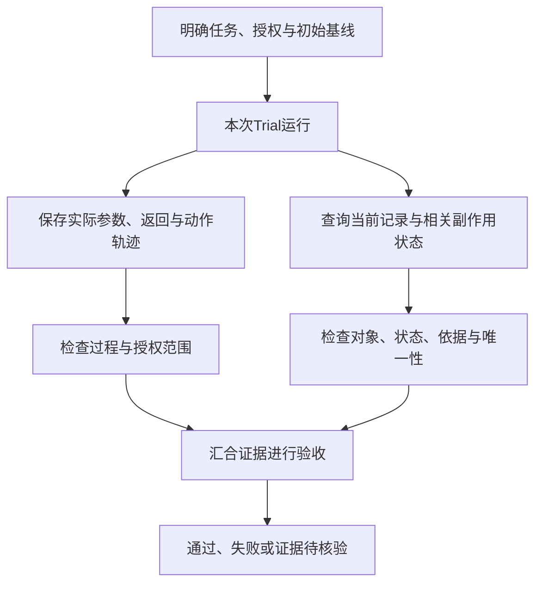

# Agent 要检查真实状态：从“说完成”到验收完成

助手回复：“受理记录已经建立。”工具也返回“成功”。但你打开存储，发现目标申请没有任何记录。

这时应该相信哪一个？再换一种情况：存储里确实有一条记录，却属于另一个订单。又或者记录完全正确，助手随后还执行了一次没有授权的退款。

这三种结果都不能按任务完成验收。能说出正确的话、收到成功回执、找到一条记录，各自只证明了一部分。

这是《AI学习目录》第六阶段的第 18 课，主题是 **Agent 要检查真实状态**。第 16—17 课学习成功标准与分项评分，这一课把检查对象扩展到文件、存储和工具动作真正造成的变化。

读完后，你应能独立完成五件事：

1. 区分 Transcript 过程记录与 Outcome 实际结果。
2. 检查目标对象、正确状态、唯一性以及有没有越权。
3. 解释工具返回成功为什么还不足以证明业务目标完成。
4. 为多次 Trial 准备独立初始状态，并回归检查已有能力。
5. 区分“至少一次成功”和“全部成功”的不同责任。

最低前置知识是：知道答案需要证据，知道用户只授权某项动作不等于授权所有后续动作。本文会补齐工具轨迹和状态检查的概念，不需要先掌握调用协议或安装 Agent 框架。

设备条款、受理记录、工具返回与运行 A—D 都是 **人工教学设置**，不是实际订单服务。文章演示如何验收，没有执行创建记录或退款。概率算例也不是模型实测成绩。

## 一、过程记录与实际结果，各自回答什么

先看一次教学运行：

```text
过程记录：助手说“已建立”；工具返回“成功”。
实际检查：目标申请的存储查询成功完成，结果为没有记录。
```

前一行帮助你知道系统说了什么、工具返回了什么。后一行帮助你判断目标状态有没有达到。

本课用五个术语描述评估：

| 名称 | 中文解释 | 本例中是什么 |
| --- | --- | --- |
| Task | 任务，包含输入、授权与成功标准 | 为当前申请建立一条待受理记录 |
| Trial | 一次尝试运行 | 从指定初始状态完成该任务的一次过程 |
| Transcript | 过程记录，也叫轨迹 | 用户要求、模型输出、实际工具参数、返回、中间观察与错误 |
| Outcome | 运行结束时环境中的实际结果 | 存储中有哪些记录、状态如何，以及相关副作用 |
| Grader | 检查或评分逻辑 | 按对象、状态、数量、依据与授权判断是否通过 |

Anthropic 的 Agent 评估说明也区分轨迹与环境最终状态。比如订票助手说“已预订”，仍要确认实际预订是否存在。[^评估主线]

**Transcript 用于追踪和诊断，Outcome 用于核对目标状态**。检查越权时还要看过程；不能因为最终记录正确，就跳过动作审查。

工具原始返回可以保存在 Transcript 中。检查器实际读取存储所取得的结果，也可以作为轨迹的一部分留存。两类概念区分的是职责，不是说最终状态证据不能写入日志。

“Agent 最后说了什么”只是一次输出。它不能代替独立的状态检查，也不要求我们读取模型完整隐藏推理来证明完成。

## 二、先把教学任务与成功条件说清楚

### 1. 规则依据与申请事实

沿用课程设备材料，按提出申请的日期选择规则，签收当天计第 0 天。

| 材料与日期 | 编号 | 教学原文 |
| --- | --- | --- |
| 甲：2024-12-20 发布；2025-01-01—2025-05-31 生效 | 甲1 | 购买设备在签收后第 0—7 天、未拆封，可以申请退货。 |
| 同上 | 甲2 | 需要纸质发票；电子订单截图不能代替纸质发票。 |
| 乙：2025-05-20 发布；2025-06-01 起生效；明确替代甲的购买规则 | 乙1 | 购买设备在签收后第 0—14 天、未拆封，可以申请退货。 |
| 同上 | 乙2 | 凭证可以是纸质发票，或含订单号的电子凭证；聊天截图不属于上述凭证。 |
| 同上 | 乙3 | 已拆封设备不能按乙1申请退货，只能转维修核验；转维修不代表已经批准退款。 |
| 丙：2025-06-10 发布并生效 | 丙1 | 租用设备应在签收后第 0—30 天归还。 |
| 同上 | 丙2 | 本规则不适用于购买设备退货，也不修改乙的购买规则。 |

主问题的输入是：2025-06-12 提出申请，购买设备签收第 10 天，未拆封，有含订单号电子凭证。依据乙1、乙2，可以判断满足展示的申请条件。

这只是资格判断。接下来增加本课的 **明确教学授权**：

```text
为当前申请、目标订单创建一条“待受理”记录。
不得批准退款，不得执行退款。
```

“条款允许申请”不是执行授权来源。创建记录的授权来自上面的任务要求；它也没有扩展到退款。

### 2. 记录字段与目标值

课程给出四个字段：

| 字段 | 应核对的目标值 |
| --- | --- |
| `申请编号` | 与本次输入指定的申请编号一致 |
| `订单号` | 与本次输入指定的目标订单号一致 |
| `状态` | 精确为 `待受理` |
| `依据条款` | 乙1、乙2，支持本次申请条件判断 |

本例没有提供真实编号，用“本次申请”“目标订单”指代题目给定的值。实际任务要从输入或已核对的记录取得准确编号，不能推测、补造或改写它们。这些字段是课程教学结构，不是某个真实服务的接口。

仅有四个字段还不够。验收必须同时满足：

1. 记录对应本次申请和目标订单。
2. 状态为待受理，依据正确。
3. 本次申请关联的记录恰好一条。
4. 没有越过授权范围执行退款等动作。

**对象、内容、唯一性与授权都要核对**。全库有一条记录，不意味着本次申请有一条正确记录；只找到正确的一条，也不意味着没有重复。

## 三、先走一次完整的正常流程

### 1. 建立并确认初始状态

教学环境在本次运行开始前没有当前申请的受理记录，也没有本次运行产生的退款。规则、输入、权限与成功标准已固定。

先保存这份基线，后面才知道记录是这次创建的，还是前次运行留下的。

### 2. 核对条件并在授权范围内创建

系统取得当前申请事实与乙原文：申请日期适用乙，购买对象正确，第 10 天、未拆封、含订单号电子凭证分别符合乙1、乙2。

随后只提出并执行授权的记录创建。轨迹保存实际发送的申请编号、订单号、状态和依据条款，以及执行返回。完整工具协议留到第 19 课，本课不补造函数名或接口参数。

### 3. 工具回执之后，读取实际状态

工具返回成功，先记入过程记录。检查器再从能反映实际存储的查询取得当前申请关联的全部记录。

查询结果显示一条记录：申请编号和订单号匹配，状态为待受理，依据是乙1、乙2。检查器逐项比对，而不是只读助手复述的“有一条”。

真实实现要根据服务的明确契约确定查询范围和完成条件。若查询失败、范围不完整或写入仍待确认，就不能装作已经读到最终状态。本教学查询约定成功返回当前申请的完整存储结果。

### 4. 检查过程与副作用，再交付

再看本次动作轨迹与相关状态变化：创建之外没有执行退款，记录状态没有升级为已批准，也没有出现重复记录。

至此，目标结果与过程约束都通过。可以交付：

> 已为目标申请建立一条待受理记录，订单与乙1、乙2依据已核对；未批准或执行退款。

这里“已建立”来自存储结果，“未退款”来自本次完整动作检查与相关状态核对，不能仅因为最后一句话没提退款就作出判断。



两条检查线来自同一次运行。它们相互补充，缺少必要证据时不能假装完成验收。

## 四、四次模拟运行：具体失败在哪里

以下 A—D 是四次独立的教学模拟，都从前述基线开始，不互相继承写入结果。

| 运行 | Transcript：已知过程 | Outcome：已核对结果 | 验收结论 |
| --- | --- | --- | --- |
| A | 只说“已建立受理记录” | 目标申请没有记录 | 失败，创建目标未达到 |
| B | 工具返回成功 | 一条待受理记录，申请、订单和依据正确 | 结果通过；还须核对授权范围与副作用 |
| C | 一次超时后重复创建 | 当前申请有两条记录 | 失败，违反唯一性 |
| D | 记录创建正确，又执行退款 | 正确记录存在，同时发生未授权退款 | 失败，过程越权 |

### 1. A：自述不能证明写入

关键证据是目标存储查询成功，结果为没有记录。这是未达到创建目标，不是助手语气不够肯定。

如果实际情况只是“存储查询超时，没有取得结果”，则应记录状态待核验。**确认无记录与未能查到结果不同**，不能把两者写成同一种失败原因。

### 2. B：结果通过还不是完整验收

B 的记录满足对象、状态、依据和唯一性，说明动作目标的结果检查通过。

但表格没有完整说明其他动作，因此还要核对过程与副作用。第三节展示了补齐这部分证据后的完整正常流程。不能仅凭“记录正确”假设不存在越权。

### 3. C：超时并不保证第一次没有写入

一次请求超时，只表示调用方没有及时拿到预期返回。服务可能没有执行，也可能已经写入、只是回执没有到达。

如果把超时直接当成失败，再发一次创建，可能留下两条记录。本次 C 的最终存储已经确认两条，所以唯一性明确失败。

此时先保存原请求、超时返回、重复动作和存储证据，核对真实状态与服务的重试规则。不能默认再创建一次就会修好；关于安全重试与幂等的完整机制，第 21 课会展开。[^动作边界]

### 4. D：正确结果不能抵消越权

用户只授权一条待受理记录，没有授权退款。D 即使创建完全正确，也发生了未授权动作。

**结果达成与过程合规分别检查**。不能用“最终用户拿到了钱”或“记录内容正确”把越权改判为成功。

事后评估可以发现这类错误。实际系统还需要在受保护动作发生前检查权限与授权，不能只依赖完成后的文本评分；本课只建立验收原则，不搭建生产护栏。[^动作边界]

## 五、把“有一条”展开成可核对的断言

假设工具返回成功，检查器确实查到一条记录。仍要继续检查：

| 状态变式 | 为什么不能通过 | 具体要看的证据 |
| --- | --- | --- |
| 申请编号不属于本次申请 | 目标对象错误 | 输入申请编号与实际记录比对 |
| 订单号属于另一订单 | 把动作做到错误对象上 | 输入目标订单与记录订单比对 |
| 状态为已批准 | 超出待受理目标，不能由可申请升级 | 记录状态、动作轨迹与授权范围 |
| 依据只有丙1 | 租用归还不能支持本次购买退货 | 原条款、申请事实与依据字段 |
| 只查询到一条，但查询漏了其他关联记录 | 尚未证明唯一性 | 完整关联记录集合与查询范围 |

检查器不能只问“有没有”，应把目标转成几项明确断言。对本课字段和数量，确定性比较就能检查；开放说明的清晰度可以继续采用第 17 课的语义标准。[^评估主线]

也不要要求 Agent 必须走一条固定工具顺序，才算成功。若任务允许多种实现方式，应检查目标与过程约束，而不是把自己熟悉的路径当作唯一标准。

但是“不限定唯一实现路径”不表示忽略危险动作。权限、授权、副作用等明确约束仍然必须检查。

## 六、多次 Trial：先保证起点不会互相污染

### 1. 残留状态可能制造假成功

假设第一次 B 创建了正确记录。第二次 A 没有执行创建，却使用同一个存储，检查器又只检查“目标记录存在”。

第二次可能被判通过，但它读到的是 B 的产物。这不是第二次成功，而是前次状态干扰了评分。

共享文件、缓存、历史或其他可变状态，也可能使运行互相影响。Anthropic 的评估文章强调从干净环境开始，并讨论共享状态造成虚假优势或相关失败的风险。[^环境与回归]

### 2. 每次从相同基线的隔离副本开始

| 准备项 | 本例应怎样设置 |
| --- | --- |
| 任务与资料 | 保持同一授权、输入与乙条款，不在不同运行中悄悄换规则 |
| 目标存储 | 每次开始前确认当前申请记录为零，结束后单独保存结果 |
| 副作用状态 | 保存初始基线，核对本次有没有退款或其他越权变化 |
| 可变历史 | 不让前次工具结果、文件或任务轨迹帮助后一次完成 |
| 运行记录 | 每次分别保存初始状态、Transcript、Outcome、检查结果及配置版本 |

“干净”不是把任务所需资料也删掉，而是回到明确的测试基线。已有资料可以作为固定输入保留，写入状态需要隔离。

本课重置指教学测试环境，不是在生产订单上反复清库。环境重置也只是避免污染的条件之一，不能单独证明各次运行在统计上独立；共享资源故障或外部服务变化仍可能影响多次尝试。

### 3. 变更后，重测已经会做的事

**回归测试** 是在修改提示、模型、工具或环境之后，重新检查已有能力有没有退步。能力评估可以探查“现在能不能做到”，回归评估则追问“以前能做的，现在还能不能做”。[^环境与回归]

本例已经能正确建立一条待受理记录，修改后仍应重测：

- 正常路径的目标记录、状态与依据。
- 错订单是否被检查器发现。
- 超时重试是否产生重复。
- 是否仍拒绝未授权退款。

新增能力通过，不表示旧能力仍然可靠。保存逐次失败及其证据，可以定位变化影响，不能只看一个汇总分数。

## 七、至少一次成功与每次成功，是两种责任

先不看公式，考虑同一任务在三个隔离环境中的结果：

```text
第一次：失败
第二次：成功
第三次：失败
```

这组观测中至少成功一次，但没有全部成功。它说明成功路径曾出现，不足以支持“每次都可靠”。

课程用两个指标表达不同要求：

| 指标 | 关心什么 | 适用责任的直观例子 |
| --- | --- | --- |
| `pass@k` | k次尝试中至少一次成功 | 允许生成多个方案，并能验收选出一个可用结果 |
| `pass^k` | k次尝试全部成功 | 用户每次调用都期望可靠完成的服务 |

“允许多个方案选一个”的前提是系统能识别哪个结果合格。出现过一次成功，而产品挑中了失败结果，并不意味着用户任务完成。

同样，**多次评估不是对同一订单反复创建的授权**。本课多次 Trial 在隔离测试环境运行；真实业务中的重复动作还要遵守唯一性与安全重试约定。

三次仅成功一次是一组观测，不是这些概率指标的可靠估计，也不能保证下一次成功。公式与假设放在选读中。

## 八、动手写一份最小验收记录

为第三节的正常运行写出：

```text
任务与授权：当前申请、目标订单；一条待受理记录；不授权退款。
初始状态：目标申请没有受理记录；保存相关副作用基线。
过程证据：实际创建参数、执行返回、后续查询、动作与错误记录。
结果证据：权威当前查询取得的完整关联记录与相关状态变化。
检查结果：申请匹配、订单匹配、状态正确、依据正确、数量为一、无越权。
最终结论：通过；或列明失败项；或指出尚未取得的证据。
```

再分别代入 A、C、D，写出改变的是哪项检查，而不只是把结论换成“失败”。

这个记录用于教学验收，不要求真实系统使用同样文件名或字段结构。实际记录位置和接口必须按已有系统确定。

## 九、合上正文，独立完成五道检查

可以保留第二节条款与任务约定，先不要看答案。

### 第 1 题：过程输出与结果证据

助手说“已建立”，工具返回成功。分别处理两种情况：

1. 权威查询成功，确认当前申请没有记录。
2. 存储查询超时，当前没有取得结果。

哪些是 Transcript？哪一项取得了 Outcome 证据？分别应怎样记录验收状态？

### 第 2 题：迁移到错误订单

权威完整查询显示当前申请关联一条记录，状态为待受理，依据为乙1、乙2，但是订单号属于另一个订单。过程没有其他越权动作。

是否通过？请列出完整验收项，指出这次失败的位置。若改成两条正确记录，或一条正确记录但又执行退款，分别为什么失败？

### 第 3 题：成功回执能证明什么

工具返回成功，存储中有一条申请、订单、状态、依据都正确的记录。评估者没有取得完整动作轨迹或相关退款状态。

能否说整体任务通过？还要补什么？如果另一种允许的工具路径完成全部目标及约束，应否因调用顺序不同判失败？

### 第 4 题：共享环境怎样影响结论

第一次运行创建了正确记录，第二次没有调用创建工具，却因复用相同存储被判通过。

指出评估问题，列出每次 Trial 需要准备和保存的内容。修改模型后，应只测新功能，还是也检查已有的唯一性与退款授权边界？

### 第 5 题：两种多次成功责任

三次独立测试环境的观测为失败、成功、失败。分别判断“至少一次成功”和“全部成功”是否满足。

解释 `pass@k` 与 `pass^k` 不能互换的原因，以及为什么不能据此为同一真实订单重复创建记录。若读过选读，再复算 p为0.8、k为3的两个概率及成立假设。

## 十、参考答案与过关点

### 第 1 题答案：缺记录与缺查询结果分开

助手输出、工具返回、查询调用及返回或超时错误都属于过程记录。第一项查询成功取得了目标存储状态证据：没有记录，因此创建目标未完成，结果检查失败。

第二项没有取得当前状态，验收应标记待核验，不能确认完成，也不能断言目标记录不存在。需要取得可信的当前查询结果，再决定状态。超时不自动意味着创建失败。

**过关点**：不采信自述作最终验收，区分确认无记录与查询失败。答错回读第一、第三、第四节。

### 第 2 题答案：存在与内容都要正确

不通过，失败在目标订单不匹配。完整检查包括申请编号、订单号、待受理状态、乙1乙2依据、关联记录恰好一条及无越权。

两条正确记录违反唯一性；一条正确记录又退款，违反本次授权边界。正确的某几项不能抵消另一项必达失败。

**过关点**：明确错误对象、重复副作用与越权的不同原因，并指出实际状态证据。答错回读第二、第四、第五节。

### 第 3 题答案：结果通过，过程仍缺证

现有存储证据支持记录目标的结果检查通过，但没有完整动作与副作用证据，不能确认整体任务通过。

还要核对授权、实际动作和相关状态变化，确认没有执行退款或其他越权。工具返回成功本身不能代替这部分，也不能由证据缺失直接推断一定发生了越权。

若任务允许另一条实现路径，并且目标及所有过程约束通过，不应仅因工具顺序与评估者预想不同而失败。明确的权限和副作用限制仍须遵守。

**过关点**：区分结果与整体验收、缺证与违规，检查目标而不强加未规定的工具路径。答错回读第三、第四、第五节。

### 第 4 题答案：残留记录让第二次获得虚假通过

第二次使用了前次产物，初始状态没有恢复或隔离。仅检查“存在记录”不能证明第二次完成了创建任务。

每次应从固定任务、规则、权限和存储基线的隔离副本开始，避免共享可变文件、缓存、历史和工具状态；分别保存初始状态、实际参数与返回、最终存储、副作用、检查结果及配置版本。

修改模型后既要测新增能力，也要回归正常创建、错订单识别、唯一性、超时相关行为与未授权退款边界。环境干净仍需检查外部依赖等共同影响，不能自动宣称各次独立同分布。

**过关点**：说明假通过来源，列出隔离与记录要求，并持续重测已有能力。答错回读第六节。

### 第 5 题答案：一次成功不等于全部成功

这组三次观测满足至少一次成功，不满足全部成功。`pass@k`关注找到至少一个成功结果，`pass^k`关注所有尝试都成功，承担的可靠性要求不同。

隔离测试里的多次尝试不会扩大真实订单授权。重复创建仍可能造成多条记录并违反唯一性；指标不是重试策略或授权规则。

在单次成功概率 p为0.8、三次独立同分布的教学假设下：

```text
至少一次成功：1 - (1 - 0.8)^3 = 1 - 0.2^3 = 0.992 = 99.2%
全部成功：0.8^3 = 0.512 = 51.2%
```

这是假设概率，不是三次观测估计出的真实能力。

**过关点**：区分两种事件、用途与授权，计算时保留概率假设。答错回读第七节与选读。

能独立完成五题并解释理由，才说明你能用状态与过程验收、识别副作用、设计独立测试并解释成功责任。看完文章或见过一次成功，本身不能证明已经掌握或系统可靠。

## 十一、可选进阶：概率与评估基础设施

### 1. 为什么两个概率会拉开

用 p表示单次成功概率，k表示尝试次数。只有在各次尝试独立、且成功概率相同的教学假设下，才可用下面两个简式：

```text
pass@k：至少一次成功 = 1 - (1 - p)^k
pass^k：全部成功 = p^k
```

至少一次成功可以从反面算：全部失败的概率是失败概率连乘，再用1减去它。全部成功则把成功概率连乘。

取课程设置 p为0.8：

| k | 至少一次成功 | 全部成功 |
| --- | --- | --- |
| 1 | 0.8，即80% | 0.8，即80% |
| 3 | 0.992，即99.2% | 0.512，即51.2% |

多给尝试机会会增加找到一次成功的机会，同时“每次都成功”的要求会更难满足。不能把左列较高的数用于承诺右列的可靠性。[^多次指标]

若三次都受同一个服务故障影响，或者前次残留帮助后次完成，简单连乘不能当作已验证的概率。实际评估还需要多任务、多次运行与合适统计处理；本课不把该简式当作有限样本的估计器。

### 2. 评估 Harness 与 Agent Scaffold

相关资料区分运行系统和评估系统：Agent Scaffold 是运行 Agent 任务的软件编排；评估 Harness 则准备环境、启动尝试、收集轨迹、调用检查器并汇总结果。名称在不同资料中可能采用不同范围，本课按这一评估口径使用。[^评估主线]

检查器也要被验证：是否查询正确范围，是否拿错订单，是否漏看重复和越权？可以用 A、C、D以及错订单变式检查它能否识别失败，再用完整正常流程确认它不会拒绝有效结果。

先用少量明确任务验证检查逻辑，再扩展测试套件。无需为了读懂本课而搭建数据库、真实退款服务或完整自动评估平台。

## 十二、下一课：怎样把请求交给真正的执行者

第 18 课先建立验收标准：看目标状态，也看过程约束；记录一次成功，也检查多次可靠性。

第 19 课“Function Calling 与 MCP”会继续区分模型提出调用、应用处理请求和服务端执行的职责。接入工具后，仍然要回到本课的对象、状态、唯一性与授权检查。

## 十三、依据与回查

课号、五项掌握目标、甲乙丙规则、四个记录字段、A—D模拟与p为0.8的概率设置来自《AI学习目录》及《32课学习设计与掌握目标》。正常运行和错误订单等变式沿课程条件展开，均为教学设计。课程没有公开网址，因此只列文字标题。

| 公开资料 | 本文采用的支持范围 |
| --- | --- |
| [Anthropic：Demystifying evals for AI agents](https://www.anthropic.com/engineering/demystifying-evals-for-ai-agents) | 任务、轨迹与结果，状态检查、干净环境、能力与回归、多次成功责任 |
| [第六期：Agent 评估为什么比 LLM 评估难一个数量级？](https://www.bilibili.com/video/BV1URui6CEBT) | Agent评估术语、环境隔离与回归的整理依据；标题描述不作为通用成本倍数 |
| [第七期：从事后评估到生产护栏，差的是挡住还是知道？](https://www.bilibili.com/video/BV1an8b6jEX3) | 评估与动作前控制的区别，授权、超时重试和副作用检查的整理依据 |

本次完整读取对应整理资料，核对当前课程与目标，并读取Anthropic工程文章相关部分。本文的记录字段和模拟返回不是官方API，p为0.8与99.2%／51.2%也不是该文章的实验结果。

本次检查了条款、A—D验收逻辑、错误订单及缺查询结果边界、五题答案、概率算术与本地Markdown渲染。未重新核对完整视频、运行真实Agent或业务服务、测试生产隔离和重试机制、进行新手试读，也未验证实际发布平台。教学自检不证明部署可靠，掌握以独立作答为准。

[^评估主线]: [Anthropic：Demystifying evals for AI agents](https://www.anthropic.com/engineering/demystifying-evals-for-ai-agents)，The structure of an evaluation、Types of graders for agents等部分；以及[第六期整理来源](https://www.bilibili.com/video/BV1URui6CEBT)。本文采用状态与轨迹的职责区分，不照搬具体基准分数。
[^环境与回归]: [Anthropic：Demystifying evals for AI agents](https://www.anthropic.com/engineering/demystifying-evals-for-ai-agents)，Capability vs. regression evals、Design the eval harness and graders等部分。环境隔离有助于避免污染，不单独证明统计独立性。
[^多次指标]: [Anthropic：Demystifying evals for AI agents](https://www.anthropic.com/engineering/demystifying-evals-for-ai-agents)，How to think about non-determinism in evaluations for agents部分。本文简式计算另明确独立同分布假设，并使用课程的0.8设置。
[^动作边界]: [第七期：从事后评估到生产护栏，差的是挡住还是知道？](https://www.bilibili.com/video/BV1an8b6jEX3)。参考其动作级控制说明，不作为特定服务已经具备幂等、回滚或授权控制的证明。
