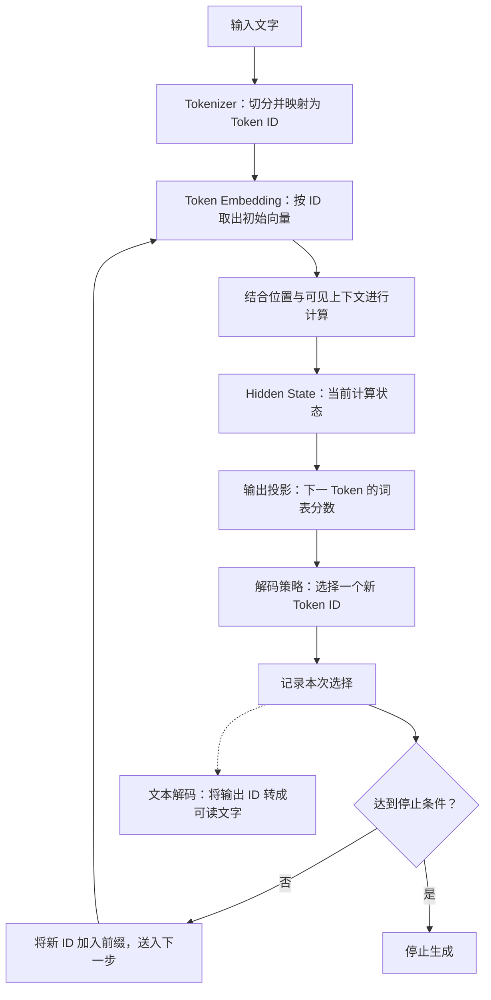

# 第一阶段串讲：文字怎样进入模型并生成回答

你在输入框里写下“猫在”，屏幕随后出现“睡”。你看到的是文字接上了文字，模型内部却经历了几次不同的转换：文字先被表示成编号，编号变成一组组数字，数字经过上下文计算形成状态，状态再转换成对下一项的评分，最后选出一个新的 Token。

这项新输出接下来又进入模型的计算。输入、表示和输出，就这样连成一条持续推进的过程。

第一阶段的“切分与编号”“表示与计算”“输出再输入”，分别讲了这条过程的不同位置。现在沿着它完整走一遍，就能看清：每一步接收的是什么，交给下一步的是什么，以及哪些结论不能只凭一个数字推出。

这篇文章依据《AI学习目录》第 01—03 课及《32课学习设计与掌握目标》中第一阶段的要求，讲述普通自回归文本生成。文中的切法、编号、向量和分数沿用课程的教学设置，不是真实模型运行结果。

## 一、先把三个小节放回同一条过程

生成时，把下一步开始前已经有的 Token 序列称为**前缀**。它包含最初输入，以及本次已经生成并接回的内容；后面的每一步都以这个逐渐更新的前缀为条件。



图里的循环箭头回到“初始向量”，是因为继续生成时，新 Token 也要成为模型的数字输入。前面的历史内容仍然构成上下文，实际实现可以复用部分历史计算；这张图表达依赖关系，不表示每次都重新处理全部历史。[^链路]

三个小节可以用这张表定位：

| 小节 | 起点 | 关键变化 | 交给后续的内容 |
| --- | --- | --- | --- |
| 切分与编号 | 原始文字 | 按规则确定 Token，再映射为 ID | 有顺序的编号序列 |
| 表示与计算 | 编号序列 | 查出初始向量，结合位置与上下文加工 | 各层各位置的隐藏状态 |
| 输出再输入 | 已有前缀下的计算状态 | 给词表项打分，选择新 Token，按条件继续或停止 | 新的输出，以及下一步使用的更新前缀 |

**上一小节的结果，会成为下一小节的输入**。例如，分词器提供的 ID 是查表地址；查表得到的向量是内部计算的起点；计算后的状态是输出评分的依据。三者用途不同，却前后相接。

下面继续以“猫在”接出下一项作为主线。课程没有提供这段文字的具体切分、输入编号、向量表和完整模型参数，因此这些位置只解释转换关系。需要观察数字时，再使用各小节已经定义的局部算例；它们不能拼成一套完整模型。

## 二、文字先变成编号，才能找到计算的起点

刚开始时，“猫在”是人可以阅读的文字。**Tokenizer，分词器**按照已有规则，把文字表示成 Token 序列，再为每项找到词表中的整数编号。

**Token** 是分词器使用的单元，**Token ID** 是这个单元在词表里的编号。输入文字、切出的单元和编号序列，是三个不同的对象。[^分词]

课程用“猫吃鱼”展示过这一步：

```text
原始文字：猫吃鱼
教学切分：［猫］［吃］［鱼］
教学编号：[7, 12, 25]
```

这里明确约定“猫→7、吃→12、鱼→25”。这个例子说明“单元怎样对应编号”，没有规定所有模型的真实切法。也不能把这套编号拿去补写“猫在”中“在”的 ID。

编号序列保留输入的顺序和重复位置。沿用这个中文教学规则，“猫吃鱼猫”得到 `[7,12,25,7]`，有四个 Token 位置。重复的“猫”仍占一个位置；不能只数三种不同单元，就说序列只有三个 Token。

### 字数、词数和 Token 数，分别由什么决定？

我们看文字时习惯数汉字或单词，分词器则使用自己的词表和规则。一个 Token 可以对应一个字符、一个词的一部分或一个完整词；字节级单元还未必能独立显示成完整字符。

原资料中的 `unpredictable` 有 13 个字母。按字符表示时有 13 个单元，而教学子词示例 `un／predict／able` 有三个单元。文字相同，表示粒度不同，数量就不同。

因此，**文字的长度不直接决定实际 Token 数**。要知道某段文字在某个模型中怎样切、编号是什么，应读取它配套分词器的真实编码结果；换一套分词器，边界、编号和数量都需要重新核对。[^分词]

### 切分规则已经存在，运行时应用它们

“切分与编号”还讲了 BPE。它帮助解释规则怎样获得：训练时统计相邻单元，把高频的一对合并，再重新统计，逐步记录规则；使用时按已确定的规则处理新输入。[^合并]

课程的小算例先有两份 `ab` 和一份 `abc`，基础符号预先包含 `a、b、c、d、·`，其中 `·` 是教学词尾标记。第一轮 `(a,b)` 共出现三次，合并为 `ab`；重新统计后，`(ab,·)` 出现两次，再合并为 `ab·`。本例只进行这两轮。

使用时遇到 `abd`：

```text
［a］［b］［d］［·］
→ 应用第一条规则
→ ［ab］［d］［·］
```

第二条规则要求 `ab` 与 `·` 相邻，中间隔着 `d`，所以用不上。分词器也不会为了这个新词，临时增加 `ab+d→abd` 的合并规则。

把这一点放回主线：用户输入新文字时，通常是在使用已固定的分词器。得到编号并不意味着分词器重新训练了一次，更不意味着模型已经核实了文字里的事实。

## 三、编号查成向量，上下文才有可加工的表示

得到 ID 序列之后，模型不能把编号大小直接当作含义。例如中文例子的 `25` 大于 `7`，只说明词表条目不同，不能说明“鱼”比“猫”重要，也没有语义距离的保证。

接下来要做的是 **Token Embedding 查表**：以 ID 为地址，取出对应的一行数字。这个有顺序的数字列表，就是本课所说的**向量**。[^表示]

“表示与计算”使用的是另一张独立教学表：

| Token ID | 取出的初始向量 |
| --- | --- |
| 1 | `[1,0,2]` |
| 4 | `[0,2,1]` |
| 5 | `[1,1,0]` |

于是：

```text
输入：[1, 4, 1]

查表结果：
[
  [1, 0, 2],
  [0, 2, 1],
  [1, 0, 2]
]
```

每个位置对应一个三维向量，排成三行、每行三个数的数字表。这个表的 **Shape，形状**写作 `(3,3)`：第一个 `3` 是位置数，第二个 `3` 是每个向量的坐标数。

这张表只定义 ID `1、4、5` 的数值，没有把它们对应到“猫”“在”或其他文字。前面中文例子的 ID `7、12、25` 也没有在这里给出向量，因此不能将两张教学表直接合在一起推算。

这不影响我们理解前后关系：**分词得到地址，Embedding 按地址提供初始数字**。真实模型中的具体地址和表内容，则要看该模型自己的词表与参数。

### 初始向量相同，后续状态为什么还可以不同？

上面第一个和第三个位置都是 ID `1`。在同一张固定表中，它们的纯查表结果相同，都是 `[1,0,2]`。

但是，查表只提供起点。后续模型还要结合位置与可见上下文加工表示。在普通因果生成模型中，第一个位置不能读取后面的输入，第三个位置却可以使用前面的内容；它们的位置也不同。

某层某位置经过计算得到的表示，叫 **Hidden State，隐藏状态**。因此，两个位置的初始向量相同，并不能保证它们的后续隐藏状态相同；这些状态**可以不同**，具体是否不同要看计算结果。[^表示]

把区别说得更具体：初始向量回答“这个 ID 从表里取到什么”，隐藏状态回答“这个位置经过当前计算后得到了什么”。两者都可以是一组数字，却在不同步骤承担不同责任。

向量的坐标也没有天然固定的“动物”“情绪”或“事实正确性”标签。不能看到某个坐标变大，就补出“模型更确定了”这样的解释。

回到“猫在”这条主线：模型会从它实际的输入编号取出向量，再计算相关状态。这里的工作，正是把第一小节提供的离散地址，接成第三小节能够使用的内部表示。

## 四、隐藏状态转成词表分数，下一项才有选择依据

模型得到相关位置的隐藏状态后，通过**输出投影**把它转换成词表各项的评分。评分称为 **Logits，原始分数**。它们不是 Token ID，也不是向量的坐标编号。[^表示]

对于“猫在”这个前缀，第三小节人为给定四项教学分数。设温度为 `1`，不加入其他筛选，转换为概率后得到：

| 教学输出项 | Logit | 本步概率 |
| --- | --- | --- |
| 睡 | 2 | 0.643914 |
| 吃 | 1 | 0.236883 |
| 跑 | 0 | 0.087144 |
| 结束符 | −1 | 0.032059 |

这组输出分数是课程规定的，没有提供能从上一节向量算出它们的模型参数。它展示的是评分之后怎样选择，不能据此倒推出隐藏状态。

**Softmax** 可以将一组分数变成非负、总和为 `1` 的概率分布。这里结束符的分数是 `−1`，概率却是正数 `0.032059`，说明负 Logit 并不是负概率。[^生成]

现在，流程多了两种不同的对象：原始评分，以及转换后的概率。概率描述本步的选择比例，仍不等于已经选出了哪一项。

### 同一张表，贪心和采样怎样各走一步？

**贪心**在本步取最高项，所以选“睡”。若继续生成，前缀变成“猫在睡”。

**采样**根据概率随机选择。教学表达可以把 `0` 到 `1` 划为连续区间：“睡”占 `[0,0.643914)`，“吃”占 `[0.643914,0.880797)`，其他项接着占据后面的部分。

课程给定随机数 `0.7`，它落在“吃”的区间，因此选“吃”。若继续生成，前缀变成“猫在吃”。“睡”虽然概率最高，未经过额外筛选时，“吃”“跑”和结束符也都有被采样选到的机会。[^生成]

| 采用的方式 | 本步选择 | 未停止时的更新前缀 |
| --- | --- | --- |
| 贪心 | 睡 | 猫在睡 |
| 按原概率表采样，随机数为 0.7 | 吃 | 猫在吃 |

**分数、概率与最终选出的 Token，是三个不同对象**。看到概率表只是知道选择依据，采用什么策略，才决定这次实际走哪一条路线。

## 五、新输出成为下一步输入，三个小节在这里闭合

以选到“吃”的路线继续：

```text
第一步条件：猫在
→ 内部计算并对下一项评分
→ 本次采样选出吃

若未触发停止：
更新前缀为猫在吃
→ 新 Token 进入后续计算
→ 计算第二步分数
→ 再选择下一项
```

这就是“输出再输入”的实际关系。新 Token 已经被选为词表里的一个 ID，继续计算时可以使用这个 ID 取初始向量，不需要先把屏幕上的文字重新猜成编号。

用户看到的可读文字来自输出 ID 的**文本解码**。而刚才的**解码策略**负责根据分数选择下一项。一个解决“怎么显示”，一个解决“怎么选”，不要只因为都出现“解码”就混为同一个步骤。[^分词]

### 第二步需要新的条件，不是重复第一步菜单

第一步是在“猫在”后面接下一项，第二步已经是在“猫在吃”后面接下一项。条件变了，需要使用更新后的前缀取得下一步分布。

这并不保证新表的每个数都不同，而是说**不能直接把旧概率表当作下一步的依据**。课程没有给第二步的分数，所以现有数据只能确定该使用“猫在吃”这个前缀，不能确定它之后生成什么。[^生成]

“下一步”指本次生成内部的计算推进，不是用户再发一条消息，也不是每选出一个 Token 都另开一次 API 请求。

### 历史计算可以复用，新增内容仍然要处理

这个循环也不意味着“猫在”每次都要从零重算。**KV Cache**可以保存已处理位置的部分计算状态，供后续使用。

缓存复用的是历史计算，并不是拿回一张固定答案表。新 Token 仍然需要进入后续计算，下一步的分数仍然以更新后的条件为依据。缓存的具体保存与增长方式留到第 26 课。[^表示]

### 生成在停止条件成立时结束

如果选到本次实现识别的结束标记，或达到规定的新 Token 数量上限，生成就停止。例如“最多生成两个新 Token”只数本次新增项，不把最初输入算进去；这是明示的教学设置，并非真实服务默认值。[^停止]

结束符通常承担控制责任，本文没有规定把汉字“结束符”显示给读者。停止后的文本可能完整，也可能因为长度限制而中断。

因此，**生成结束与任务完成，需要分别判断**。停止条件负责让循环结束，是否完整回答、是否有事实依据，还要另行核验。

## 六、沿着这条过程，把几个容易混淆的地方分开

### 运行一次生成，通常不是重新训练一次

从输入到下一项选择，有数据在变化，但不是每一步都在改模型参数。

| 发生的过程 | 主要改变什么 |
| --- | --- |
| 训练 BPE 分词器 | 学习词表与合并规则 |
| 训练语言模型 | 学习向量和预测所用的参数 |
| 普通推理中的查表与上下文计算 | 使用已有参数，得到本次输入的表示与状态 |
| 生成并接回一个新 Token | 更新当前前缀，推进下一步计算 |

这解释了为什么“新输入被处理了”不等于“新知识写入参数了”。本次隐藏状态发生变化，也不能直接当成参数训练的证据。[^分词][^表示]

### 用于检索的向量，有自己的输入与用途

主线里的 Token Embedding 是按 ID 查出的初始向量，Hidden State 是上下文计算后的状态。知识库检索还会使用另一类表示：检索模型通常将问题或资料片段编码、聚合成用于比较的向量。

它主要帮助找到相关资料，不是从 Token ID 查一行就完成整段检索。任意拿一层 Hidden State，也不能自动视为合格的段落检索向量。[^表示]

| 表示 | 在哪里产生 | 主要用途 |
| --- | --- | --- |
| Token 初始向量 | 输入端按 ID 查表 | 提供逐位置计算的起点 |
| Hidden State | 模型某层某位置的计算 | 承载当前上下文处理结果 |
| 段落检索向量 | 检索模型处理整段文字 | 与查询比较，召回相关材料 |

“合同已生效”和“合同未生效”讨论同一话题，检索表示可能接近，但结论相反。相关性没有消除“未”字，还要读原文核对对象、否定、时间和适用条件。

### 改变选择比例，也不会补进缺失事实

回看“猫在”的四项分数，保持分数固定，只改正温度 **Temperature**，可以让采样分布更集中或更分散。例如“睡”的概率在温度 `0.5` 时约为 `0.864955`，温度 `2` 时约为 `0.455054`。[^温度]

这两个数描述选择比例，没有确认现实中的猫是否在睡。调整温度也不会补入合同的适用时间，或自动核实原文真假。

于是第一阶段两处重要边界连起来了：**向量相近不能代替事实核验，生成概率高也不能代替事实核验**。前者提供检索线索，后者影响生成选择；事实仍需适用的证据支持。

## 七、沿着同一条主线，再走一遍

现在回到最初的“猫在”。这次不把它当作一段突然变长的文字，而是沿着每一步的数据去看：

分词器先按既有规则把输入表示成 Token，并映射为有顺序的 ID。编号让模型找到初始向量，但编号大小没有语义排名。向量随后结合位置与可见上下文形成隐藏状态，因此初始表示与计算后的状态要分开。

相关隐藏状态经过输出投影，形成下一项的 Logits。分数可以转换为概率，贪心或采样再决定本步选择。本例采样选到“吃”，在尚未满足停止条件时，新的 ID 成为后续输入，前缀更新为“猫在吃”。模型以这个条件继续计算下一项，直到规定的停止条件成立。可读文字则由输出 ID 解码而来。

这趟过程把三个小节接成了一个闭环：

> 切分与编号给出地址，表示与计算加工信息，输出选择决定新增内容；新增内容再次成为后续计算的输入。

为了继续阅读，可以保留下面这张对象对照表。它记录的是这些对象怎样相接，不要求死记名称：

| 当前看到的对象 | 应沿哪个方向理解 |
| --- | --- |
| 原始文字 | 分词器要把什么输入表示成单元 |
| Token ID | 去词表与 Embedding 表查哪里 |
| 初始向量 | 模型从什么数字开始计算 |
| Hidden State | 这个位置当前加工到什么状态 |
| Logits | 当前条件下，各下一项得到什么原始分数 |
| 概率 | 当前选择分布怎样分配比例 |
| 选出的新 Token | 这次实际增加什么，继续时怎样更新前缀 |

第一阶段建立的就是这种顺着数据流解释生成的能力。后面学习 Linear、激活、MLP 和注意力时，回到“初始向量怎样形成隐藏状态”这一段，就能知道这些零件是在为哪一步服务；学习缓存时，回到“新 Token 怎样接回下一步”，也能找到复用发生的位置。

## 依据与回查

本篇串联第一阶段三篇博客：《切分与编号：文字怎样变成 Token 与 Token ID》《表示与计算：从 Token ID 到 Embedding 与 Hidden State》《输出再输入：模型怎样逐步生成下一个 Token》。课程和博客尚无已提供的公开发布网址，因此这里只列文字标题；机制来源见以下公开链接。

中文切分例子、英文 BPE 规则、独立向量表和四项输出分布来自课程教学设计。它们分别说明不同步骤，本文没有补造三者之间的模型参数、真实分词结果或第二步概率。

[^链路]: [Token 与 Embedding 原讲解](https://www.bilibili.com/video/BV1oNv8BPE2m)和 [Transformer 架构导论原视频](https://www.bilibili.com/video/BV1k6yWBEEmH)，用于回看文字表示、模型计算与逐步生成。本文概括普通自回归文本生成，不适用于所有 Transformer 输出方式。
[^分词]: [Codex里token是啥？文字是如何变成token的](https://www.bilibili.com/video/BV1LjTX6ZEJV)，用于回看切分、编号、编码与解码、分词器和模型配套，以及训练与使用的区别。本文的中文编号和英文子词均为教学例子。
[^合并]: [Hugging Face 官方 BPE 课程](https://huggingface.co/learn/llm-course/en/chapter6/5)的 Training algorithm、Tokenization algorithm 支持相邻对统计、合并后重算和应用既有规则的机制。两轮词袋、基础符号与词尾标记采用本阶段已定义的教学设置。
[^表示]: [Token 与 Embedding 原讲解](https://www.bilibili.com/video/BV1oNv8BPE2m)及 [Token Space 与 Latent Space 原讲解](https://www.bilibili.com/video/BV1ABRyBqEoR)，用于回看初始向量、上下文状态、输出分数、计算缓存与检索表示的区别；[PyTorch 官方 Embedding 文档](https://docs.pytorch.org/docs/2.14/generated/torch.nn.Embedding.html)的 Variables、Shape 说明查表权重和输出形状。本文固定表数值来自课程。
[^生成]: [Hugging Face《Generation strategies》](https://huggingface.co/docs/transformers/generation_strategies)的 Greedy search、Sampling，支持取最高项与概率采样的区别；原始分数、概率和随机数为课程教学设置，下一步条件必须更新。
[^停止]: [Hugging Face《Generation》v5.10.0](https://huggingface.co/docs/transformers/v5.10.0/en/main_classes/text_generation)的输出长度设置及 [《Utilities for generation》v5.19.0](https://huggingface.co/docs/transformers/v5.19.0/en/internal/generation_utils)的结束标记与 StoppingCriteria 说明。具体服务的停止条件按实际实现核对。
[^温度]: [Hugging Face《Utilities for generation》v5.19.0](https://huggingface.co/docs/transformers/v5.19.0/en/internal/generation_utils)的 TemperatureLogitsWarper 说明正温度的分布调节及采样开关；本文对照的是课程同一组分数，没有额外事实输入或真实任务正确率测量。
