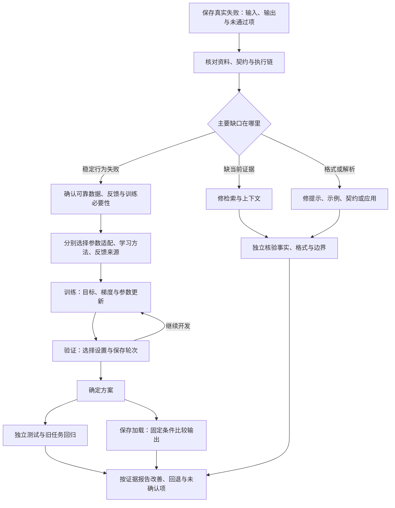

# 第九阶段串讲：从改动一个参数到验证模型真正变好

一个问答助手漏掉了新文章中的事实。有时它知道规则，却输出了接口不接受的格式；还有一些问题，即使资料、指令和执行过程都已核对，它仍反复判断错误。

这些现象都可以描述为“模型需要变好”，但需要改变的地方未必相同。补一段资料、改一个示例、更新经验库，与训练模型参数，是不同动作。

第九阶段“理解模型怎样学会任务”连接第24、25课：先从一个可见的参数更新理解训练，再把这个循环放回已有模型的适配与后训练，最后检查改善是否有独立依据。本文沿“发现失败→设计改变→更新参数→验证结果”的数据流展开。

最低前置知识是会乘法、平方和比较正负数，知道模型参数是参与计算的数字。本篇会解释必要概念，不要求先学微积分、安装训练框架或实现全部后训练算法。

直线、矩阵、概率、奖励与问答变式都是 **课程的人工教学设置**。它们用于看清变化，不是真实大模型成绩。课程将训练放在使用和验收之后讲，是阅读路线，不表示模型必须先执行Agent任务才能训练。

## 一、先分清改变输入，还是改变参数

已有模型进行普通推理时，使用当前参数计算输出。我们可以改变这次输入：把规则表达清楚，加入示例，检索新文章，或者把经过核验的经验交给模型。

这些改变会影响模型本次看到什么，也可能改变答案，但若没有实际参数更新，不能据此说权重已经训练过。

| 做法 | 直接改变什么 | 后续要检查什么 |
| --- | --- | --- |
| 改提示、加入示例 | 当前任务说明与可见示范 | 格式和判断是否符合要求 |
| 检索文章并组装证据 | 当前取得的外部资料 | 必要原文是否进入输入，引用是否支持结论 |
| 更新外部经验并重新选择 | 外部记录、效用或进入窗口的内容 | 经验来源、时效和当前适用条件 |
| 按训练目标更新可训练参数 | 模型或适配模块中的数值 | 更新是否正确，留出任务是否改善 |

第八阶段的长期Loop安排触发、执行和恢复；它运行得久，不自动成为参数训练循环。参数训练需要明确的数据、目标、更新过程和验收依据。

暂时把问答助手放在一旁，用一个只有乘法的小模型，让“参数怎样更新”变得可见。这个模型只是训练机制的缩小演示，不能把它的单点拟合叫作学会语言或算术。

## 二、输入2，目标4：把训练一步完整展开

课程模型是：

```text
预测值 = w × x
```

输入 `x=2`，目标 `y=4`，参数初始 `w=1`。偏置 `b`固定为0，这一段只更新w。人为设定学习率 `η=0.1`，用普通梯度下降更新。

输入和目标来自样本，参数w是要调整的数字，学习率控制训练步幅。学习率属于超参数，与本步通过训练改变的w职责不同。[^梯度]

### 用旧参数产生预测和损失

前向计算把输入交给模型：`1×2=2`。参数仍是1，预测与目标相差−2。

课程使用平方误差作为损失：

```text
误差 = 预测值 - 目标值 = 2 - 4 = -2
损失L = 误差² = 4
```

模型函数从输入产生预测，损失函数把预测与目标的差异变成可优化的数。本例平方误差衡量数值偏差，其他任务可以使用别的损失。

### 求当前位置的梯度

梯度描述参数在当前位置附近小幅变化时，损失怎样响应。对这个单参数模型，可以按课程公式直接计算：

```text
梯度_w = 2 × (w × x - y) × x
       = 2 × (1 × 2 - 4) × 2
       = -8
```

在w=1附近，负梯度说明小幅增大w会降低这个损失。它不是说任何位置都应该增大w，更不是保证沿这个方向走任意远都能下降。

此时得到的是梯度−8，w还没有改变。

### 沿反方向更新，再重新预测

用学习率决定移动量：

```text
w_新 = w_旧 - 学习率 × 梯度_w
     = 1 - 0.1 × (-8)
     = 1.8
```

现在参数才变成1.8。重新前向得到 `1.8×2=3.6`，新损失为 `(3.6−4)²=0.16`。

| 顺序 | 本步产物 | 参数是否已更新 |
| --- | --- | --- |
| 前向预测 | 2 | 没有，w仍为1 |
| 与目标比较 | 损失4 | 没有 |
| 求梯度 | −8 | 没有 |
| 应用更新 | w=1.8 | 是 |
| 重新前向并比较 | 预测3.6，损失0.16 | 使用新参数 |

这条样本的损失下降了，但不能因此宣布已经收敛，更不能宣布未见输入都能预测正确。旧损失4属于旧参数，也不能在更新后继续当作当前损失。

## 三、损失、梯度与学习率不能互相替代

把起点换成w=3，输入仍是2、目标仍是4。预测变成6，平方损失也为4，但梯度为 `2×(6−4)×2=8`。

同样的损失4，在w=1处应增大参数，在w=3处应减小参数。损失衡量当前差异，梯度给局部响应，学习率控制沿反方向移动的量。

回到主例w=1.8，下一轮要重新计算：预测3.6，误差−0.4，梯度−1.6。按学习率0.1更新得到w=1.96，再预测3.92，损失0.0064。

不能一直使用起点的−8。参数位置变了，损失对参数的响应也可能改变。

同一条曲线的损失为 `L=(2w−4)²`，最低点在w=2。每步重新计算梯度，从w=1开始比较三个明确的教学步长：

| 学习率 | 第一步w | 第二步w | 损失变化 | 这条曲线上的表现 |
| --- | --- | --- | --- | --- |
| 0.10 | 1.8 | 1.96 | 4→0.16→0.0064 | 从同侧靠近最低点 |
| 0.25 | 3 | 1 | 4→4→4 | 两点往返，误差不降 |
| 0.30 | 3.4 | 0.04 | 4→7.84→15.3664 | 来回越跳越远 |

这些数字只说明本例单参数二次曲线与固定步长的行为。不能把0.25当作所有神经网络的边界，也不能把0.1当作MNIST或大模型的推荐学习率。

**梯度提供局部响应，更新结果仍要重新检查**。训练要按实际目标、数据和优化器观察变化，不是只记住“梯度下降”这个名字。

## 四、从一条样本接到完整训练循环

当样本增多，训练通常把一组样本组成一个批量，Batch Size表示每批数量；Epoch表示按训练流程遍历一轮训练集。

对平方误差，一批N个样本的均方误差MSE是先分别计算平方误差，再把它们求平均。不能先把所有输入和目标平均成一个点，用这个点代替整批损失。

例如原始资料中的 `(-1,-1)`和`(1,1)`，在w=0、b=0时逐样本误差为1和−1，MSE为1，对w的梯度为−2。平均后的点却是 `(0,0)`，损失和w梯度都为0，原有的调整信号被丢掉了。[^梯度]

本例各批独立更新，不刻意跨批累积梯度。用PyTorch表达，顺序为：

```text
设置训练模式，取一批输入与目标。
清空不该保留的旧梯度。
前向计算预测，再计算批量损失。
backward：取得损失对参数的梯度。
step：优化器按规则更新可训练参数。
继续下一批，或重新预测以检查更新结果。
```

三个接口承担不同职责：[^优化]

| 接口 | 在本流程中做什么 | 主例中可观察的变化 |
| --- | --- | --- |
| `optimizer.zero_grad()` | 清空旧梯度 | 下一次反向不混入不该保留的旧值 |
| `loss.backward()` | 沿计算关系取得梯度 | 梯度为−8，w仍为1 |
| `optimizer.step()` | 按优化器规则更新参数 | 本例普通SGD、学习率0.1使w变成1.8 |

默认反向计算会累积梯度，忘记清零与有意设计多批累积是不同情况。后者需要明确的汇总与更新规则。优化器也不只有一种，不能假定Adam和本例普通SGD都按相同简式更新。

### 在图像训练里认出同一条数据流

课程对应的MNIST整理实践把手写数字图片交给全连接网络 `784→256→128→10`。用课程设定的32张教学批量，可以一路追踪：

| 对象 | 教学形状 | 送往哪里 |
| --- | --- | --- |
| 32张灰度图 | `[32,1,28,28]` | 每张展平为784个输入数 |
| 展平输入 | `[32,784]` | 第一层Linear与ReLU |
| 第一层特征 | `[32,256]` | 第二层Linear与ReLU |
| 第二层特征 | `[32,128]` | 最后一层 |
| 输出类别分数 | `[32,10]` | 与32个整数标签比较 |
| 标签 | `[32]` | 每项为0—9的类别编号 |

最后10个数是Logits，即未归一化的类别分数。采用整数类别标签时，`CrossEntropyLoss`直接接收Logits，不能先加一次Softmax再交给它。损失与梯度计算由框架完成，参数改变仍发生在优化器更新那一步。[^图像实践]

这里的32是教学形状；完整整理实践的实际训练批量是50。其数据为MNIST，官方优化教程则使用服饰图像FashionMNIST。PyTorch官方MNIST示例又采用卷积网络，输出 `log_softmax`配合 `nll_loss`。它们都能说明训练职责，但不是同一网络、同一数据或同一实验。[^优化]

样本、参数和损失复杂起来以后，主例中的顺序依然能帮助定位：输入怎样变成输出，输出怎样与目标比较形成损失，梯度怎样回到可训练参数。

## 五、训练表现好，还没有回答“未见任务怎样”

回到输入2、目标4。如果放开偏置，用 `预测=w×x+b`，从w=1、b=0出发，同一组旧参数上得到w梯度−8、b梯度−4。

学习率0.1使w变为1.8、b变为0.4，这条样本的新预测恰好为4，损失为0。两项梯度要先在旧参数上算完再更新，不能先改w再冒充同一轮的b梯度。

零损失仍只证明这一点被拟合。另一条直线w=2、b=0也经过它；输入3时，前者预测5.8，后者预测6。课程没有给这个输入的目标，我们不能判断哪条更好，更不能据此宣称所有输入都学会了。

泛化指对未参与训练与选择的数据仍能保持效果，需要新的带目标样本和独立标准。数据的职责可以分成：

| 数据用途 | 怎样影响模型开发 | 可以支持什么判断 |
| --- | --- | --- |
| 训练 | 计算梯度，更新参数 | 模型怎样适配这些样本 |
| 验证 | 比较学习率、设置与保存轮次 | 开发时选择哪种方案 |
| 最终独立测试 | 方案确定后按固定标准检查 | 未参与训练和选择的数据表现 |

如果第3轮训练损失更低、验证表现却比第2轮差，在事先规定按验证表现选择的流程里，不应只凭训练下降就选第3轮。这是人工条件示意，不是真实实验成绩或全部原因分析。

更隐蔽的泄漏是反复查看“测试集”，每次挑它得分最高的学习率、网络或轮次。即使没有在测试数据上运行 `backward()`，测试信息也已经通过选择进入开发，不再承担原来的独立检验职责。[^独立评估]

独立性要看实际用途，不看文件被叫“验证集”还是“测试集”。已经用于调试的最终测试，应如实说明，需要另有未参与选择的评估依据。

对应MNIST整理实践完成了训练、测试和保存加载，但没有单独划出验证集。本文讲完整职责，不能把该实践写成已经做过验证选择，也不把它的既有CPU成绩冒充本次训练结果。

## 六、保存以后，检查的是另一种正确性

确定方案并完成独立测试以后，通常需要保存参数以便重新使用。PyTorch可用 `state_dict`保存模块状态，再加载到匹配架构。[^保存加载]

但“文件已经存在”不证明参数正确读回。要固定架构、预处理、输入、设备和数值精度等条件，在一致的评估模式下比较保存前后输出，并明确允许的数值误差。分类任务还可以比较类别。

`model.eval()`切换Dropout、BatchNorm等层的行为，`torch.no_grad()`关闭梯度记录，二者职责不同。独立评估不做参数更新，也要分别设置这两项边界。

如果主例保存w=1.8，加载后对输入2仍得到3.6，它提供的是这条保存加载路径的一致性证据，不能代替未见样本的泛化测试。若目标是恢复训练，优化器、轮次等其他状态也需按实际需求保存；只有模型状态不等于完整训练现场。

至此，训练数据、目标、更新、开发选择、独立测试与保存核对已经连起来。第25课接着问：已有大模型要适应任务时，是否必须更新所有参数？目标又怎样定义？

## 七、LoRA把“更新哪里”变成独立选择

预训练给模型已有参数，后训练进一步让已有模型适应任务与行为要求。本篇关注适配时的更新方式，不规定所有模型必须采用同一训练配方。

某个线性层的原权重叫W₀。全量更新允许其元素改变；课程LoRA设置冻结W₀，在旁边增加可训练的A、B，让原输出加上一个受限制的增量。冻结表示训练时不更新这些原权重，不是删除原支路。

LoRA全称Low-Rank Adaptation，即低秩适配。沿论文列向量约定，输入有k个坐标，输出有d个坐标：[^低秩]

```text
W₀：d×k，冻结。
A：r×k，可训练。
B：d×r，可训练。
输出 = W₀x + (α/r)BAx。
```

A先把输入变成r个中间数，B再把它们变成d个输出变化。r限制增量矩阵最多有多少独立变化方向；α是缩放超参数，α/r调节增量作用，不是减少参数的系数。

课程小例让4维输入经过1维中间表示，再产生3维输出变化。设r=1、α=1：

```text
A = [1,0,-1,2]
B = [1,2,-1]ᵀ
x = [1,2,3,4]ᵀ

Ax = 1 - 3 + 8 = 6
BAx = [6,12,-6]ᵀ
```

`ᵀ`表示转置，这里将数字排成一列。三个输出变化共享同一个中间数，因而按B的1、2、−1倍产生；不是三项任意独立变化。相应BA为3×4矩阵，其各行互为倍数，这个非零例子秩为1。

**低秩限制的是增量，不是把底座W₀降成同样的秩**。W₀没有给出具体数字，本例只能算增量，不能补造完整最终输出。

原论文使用A随机高斯初始化、B为零，使初始增量为零。上面的非零A、B是课程另给的手算值，不能把它们当作论文初始化。

### 少训练参数，少的是哪些对象

全矩阵有 `d×k`个参数，两块适配矩阵共 `r×k+d×r`个。

| 设置 | 全矩阵可训练参数 | LoRA适配参数 | 局部比例 |
| --- | --- | --- | --- |
| d=3、k=4、r=1 | 12 | 4+3=7 | 7/12 |
| d=1024、k=1024、r=8 | 1,048,576 | 8,192+8,192=16,384 | 1/64，即1.5625% |

后一行只比较这个矩阵的可训练参数。底座权重仍在，前向激活、临时工作区及其他层也有占用；因只为所选可训练参数保存相应梯度和优化器状态，这部分占用可以减少，不能推出整模型显存变成1/64。

同一套A、B仍然通过损失、梯度和优化器更新，只是本例W₀不加入更新。LoRA没有决定训练材料是示范、偏好还是奖励，也没有保证任意小秩都足够完成任务。

## 八、回到问答助手：同一道2+2提供三种材料

现在回到已有问答模型。这个模型输出文字与概率，不是前面那个 `w×x`小模型；我们沿用的是训练数据流，不把两者冒写成同一网络。

保持问题“2+2等于多少？”不变，材料可以这样组织：

| 形式 | 教学材料 | 提供的信号 |
| --- | --- | --- |
| 示范回答 | 问题＋目标回答“4” | 期望输出是什么 |
| 偏好对 | 同题“4”优于“5”，排序依据为算术正确 | 两个回答怎样比较 |
| 奖励反馈 | 模型产生输出，程序按答案是否等于4评分 | 当前输出怎样得分 |

三种材料都在表达期望，但不是同一个训练过程，也不决定用全量更新还是LoRA。

SFT，Supervised Fine-Tuning，监督微调，用输入与示范输出学习回答方式。对语言模型，可把目标组织为提高示范Token在对应前缀下的条件概率。Token是输出的小片段；低概率的正确片段会产生较大的负对数损失。[^示范]

课程设一个人工示范有两个Token，正确Token条件概率为0.5、0.25，则平均负对数似然为 `−(ln0.5+ln0.25)/2≈1.0397`。ln是自然对数。这没有假定Token独立，也不是断言真实“4”一定被分成两个Token。

优化示范目标可以改变参数，但示范本身必须正确、有依据。提高错误示范的概率，也是在学错；训练跑通不能替标注质量担保。

## 九、DPO与GRPO怎样接入同一个训练框架

### 从离线偏好对直接定义目标

DPO，Direct Preference Optimization，直接偏好优化，用同题优选与劣选回答，比较当前策略相对参考策略的概率关系，直接优化偏好目标。当前策略是正在训练的输出分布，参考策略提供比较基准。[^偏好]

其原始方法不要求先单独训练一个显式奖励模型，也不要求每次优化都在线采样新回答。它仍然需要数据、目标、梯度与参数更新，不能把“没有RL训练循环”理解成“没有训练”。

课程人工设置完整优选／劣选回答的条件概率：当前为0.4／0.2，参考为0.25／0.25，尺度β=1。单个偏好对的相对量为：

```text
z = ln(0.4/0.25) - ln(0.2/0.25) = ln2
sigmoid(z) = 1/(1+exp(-z)) = 2/3
损失 = -ln(2/3) ≈ 0.4055
```

exp表示以e为底的指数。这里概率指完整回答的条件概率，实际通常累加各Token条件对数概率；不是只比较两个词，也不要求这两项覆盖所有可能回答。公式说明一个教学数据项怎样形成损失，不是实际训练或泛化成绩。

只有“有人排了优劣”还不能断言用了DPO。算法需要由训练定义确认，偏好来源与算法名称是两项信息。

### 从一组输出的相对奖励定义更新信号

GRPO，Group Relative Policy Optimization，组相对策略优化，从旧策略为同一问题采样一组输出，再根据组内相对奖励计算优势，用于策略更新。旧策略提供本次采样分布，它与参考策略的比较职责不同。[^组相对]

沿课程的奖励 `[0,0,1,1]`，均值为0.5。本教学明确采用总体标准差0.5，把每项奖励减均值后除以它，得到优势 `[-1,-1,1,1]`。

“优势”表示相对组内基准的反馈，不表示正值回答已经获得绝对正确证明。如果奖励规则有漏洞，组内高分也可能没有完成真实任务。

这只是完整目标的一环。原论文GRPO还含新旧策略概率比、裁剪与参考策略KL约束：概率比比较当前和旧策略的概率，裁剪限制替代目标中的变化，KL比较策略分布并用于约束偏离。不能拿四个标准化奖励代替完整训练算法。

组内奖励完全相同时，标准差为0，不能直接相除；真实实现怎样过滤或处理，需要读取其定义，不能猜框架默认行为。

GRPO说明优化过程，奖励可以来自不同来源。程序按答案给分不自动决定采用GRPO，采用GRPO也不自动证明评分来自可靠程序。

## 十、把一套方案拆成三个维度

课程给出明确方案：有500对人工排序答案，冻结底座训练低秩矩阵，采用DPO偏好目标。

可以准确说成：

```text
改哪些参数：LoRA适配，冻结底座，训练选定的A、B。
怎样学习：DPO，使用离线优选／劣选回答直接优化偏好目标。
反馈从哪里来：人工排序数据。
```

500是教学数量，不是数据充分性或效果保证。DPO由方案明示，不由人工排序自动推出；也不能看到人类反馈，就断言采用在线PPO。

若另一方案明确规定LoRA适配、GRPO更新、程序验证算术答案，则三个维度变成“LoRA＋GRPO＋可验证奖励”。它们可以组合，不是三选一。

| 名称或描述 | 主要回答什么 | 单靠它仍不知道什么 |
| --- | --- | --- |
| LoRA | 参数更新怎样表示，哪些模块可训练 | 用什么学习目标、谁提供反馈 |
| SFT、DPO、GRPO | 如何组织目标或优化过程 | 参数适配方式，材料是否可靠 |
| RLHF | 人类反馈参与的训练体系 | 不能据此断言必用某个策略算法 |
| RLAIF | AI反馈参与的训练体系 | 裁判是否校准，哪些阶段更新什么 |
| RLVR | 可验证规则或结果提供奖励 | 验证器是否完整，采用什么优化方法 |

这些名称的范围并非都一样窄。RLHF和RLAIF常包含多个阶段，不能把整套体系缩成单个优化器。InstructGPT研究用示范监督微调，再结合人工排序与强化学习；Constitutional AI的原始研究包含监督与AI反馈强化学习阶段，提供了这项分工的具体例子。它们不是所有产品必须照搬的配方。[^反馈]

人的排序可能有分歧，AI裁判可能有共同盲区，程序测试可能覆盖不全。先确认反馈支持什么，再决定如何优化它。

## 十一、把训练选择放回最初的失败

训练机制已经清楚，现在回到问答助手的三类问题。选择哪种改变，应从实际输入、输出、目标与失败证据开始。

新增文章的必要原文没有进入实际请求，首先检查资料接入、召回、片段筛选和输入组装。让模型读到准确证据，并检查答案忠实使用，比要求它凭空补出新事实更直接。

这不是断言训练永远不能学习事实，而是本例已定位为当前证据缺失。参数更新也不能代替新事实的来源追溯。

如果规则判断正确，但输出夹带解释导致接口失败，先核对契约、提示、示例与解析。原始输出符合契约、解析器却错误时，应修应用；不能让模型训练补偿错误解析器。格式通过还要同时检查内容没有退步。

如果资料、说明和执行链已核对，在多种输入上仍稳定漏掉关键条件，且有可靠示范、偏好或奖励，才有依据评估参数训练。先明确目标行为、数据覆盖、适配位置、目标与成本，再比较留出任务。

| 失败证据 | 首先改变什么 | 修正后看什么 |
| --- | --- | --- |
| 当前输入缺必要文章 | 检索和上下文证据链 | 原文进入输入，事实与引用正确 |
| 输出违反契约或解析错误 | 提示、示例、契约或应用 | 结构通过，语义与边界不退步 |
| 条件齐全仍稳定行为失败 | 评估数据与参数训练 | 未用于开发的目标行为改善，旧能力无重要回退 |

这条判断线不是“哪个名字更新就选哪个”，也不是遇到一次错误立即训练。没有稳定反馈时，先建设数据和评估；有简单方案能稳定解决时，不必因为了解GRPO就增加强化学习系统。[^训练判断]

## 十二、最后的检验仍要越过训练分数

沿同一道2+2，设一个狭窄教学评分器只检查这一题。模型若无论问题是什么都回答4，可能得到这项训练分，却在2+3上出错。

这个反例不是实测某个模型，而是说明评分范围：对唯一题目得分，不能证明一般算术能力。奖励偏好长解释时，增加重复文字也可能提高分数，却没有提高事实准确性。

利用评分漏洞取得更高分、没有达到实际目标，称为Reward Hacking，奖励黑客。**训练奖励用于驱动更新，独立评测用于判断改善**。两者可围绕同一业务目标，但不能靠同一数据泄漏或同一漏洞自证成功。[^训练判断]

应保留未用于训练、评分调试与方案选择的任务，按独立标准比较训练前后。固定提示、检索、工具、解码和评估条件，分别记录事实、格式、边界和旧任务表现；多项一起改，即使结果提高，也不能全归功于参数训练。

若继续训练Agent行为，还要读完整轨迹和真实结果。最后一句回答正确，不能抵消中间的错误订单、重复创建或越权退款。参数训练不能取代第八阶段的执行权限、对账与独立验收。

把以上步骤接起来，得到的是一条可复查的改变过程：



本图说明责任顺序，不宣称已经运行这些训练与评测。发现独立测试失败后若据它继续开发，就应说明这批数据参与了选择，并另留最终评测依据。

## 十三、两课怎样沿同一条数据流接力

第24课从当前预测出发，把差异变成损失，计算局部梯度，由优化器更新允许训练的参数，再重新预测。损失、梯度和步幅各管一项，`backward()`与`step()`是两个时点；训练之外还要有开发选择、独立测试和保存加载核对。

第25课沿同一条更新链拆开三个选择：LoRA控制参数增量，SFT、DPO、GRPO组织不同学习过程，人类、AI或程序提供反馈。每一项都有数据与实现边界，名称本身不保证效果。

回到最初的问答助手，补资料、改提示、更新经验和训练参数已经能逐项说明改变哪里。缺证据先补证据，格式问题先核契约，稳定行为失败再评估训练；完成任何改变，都要用相应的独立依据判断是否真的变好。

下一阶段转向速度、显存与费用。第26课“KV Cache与Prompt Cache”解释已经计算的结果怎样复用。缓存改变计算复用方式，不自动更新模型参数，也不能代替本阶段的数据、反馈与验收责任。

## 依据与回查

课号、10项必达目标、主例x=2／y=4／w=1／b固定0、偏置变式、32张教学形状、LoRA矩阵、2+2、500对偏好及损失与奖励数字，来自《AI学习目录》和《32课学习设计与掌握目标》。步长表沿同一曲线复算，诊断与一律答4的反例属于明确教学推演，不是实际模型事故。

本文参考第24、25课博客和《大模型后训练：从模仿到行为选择》，已完整读取对应四份原始整理资料。课程及这些文档尚无公开网址，采用文字标题说明出处。外部资料支持机制，不是本文人工数字的实验出处。

[^梯度]: [大模型的训练原理：梯度下降，从一条直线讲起](https://www.bilibili.com/video/BV1mV2tBgE3G)。采用完整整理原文中的损失、梯度、学习率、同轮旧参数和MSE反例；原视频y=5.6等数字与本篇课程主例分别保留，未混用。
[^优化]: PyTorch官方[Optimizing Model Parameters](https://docs.pytorch.org/tutorials/beginner/basics/optimization_tutorial.html)，Loss Function、Optimizer及Full Implementation；核对时页面为2.14.0教程文档。另核对[官方MNIST源码](https://github.com/pytorch/examples/blob/main/mnist/main.py)的卷积结构与log_softmax／nll_loss；该main页面会变化。两份入口与课程全连接MNIST分别保留，不作为同一成绩来源。
[^图像实践]: [从零搭建神经网络，识别手写数字](https://www.bilibili.com/video/BV1ypUkB7Eki)与[30行代码训练模型，手写数字识别](https://www.bilibili.com/video/BV1SdBcB7EtG)对应完整合并整理原文。采用网络、预处理、Logits、梯度更新与保存核对职责，不重新报告其既有训练成绩。
[^独立评估]: scikit-learn官方[Cross-validation: evaluating estimator performance](https://scikit-learn.org/stable/modules/cross_validation.html)，核对时为1.9.1文档。支持验证选择与反复据测试调参的泄漏边界；本次未执行完整数据划分或交叉验证。
[^保存加载]: PyTorch官方[Save and Load the Model](https://docs.pytorch.org/tutorials/beginner/basics/saveloadrun_tutorial.html)。地址来自优化教程实际链接，核对state_dict、同架构加载及评估模式；固定输入比较另承接课程和完整MNIST整理原文，不把一致性当泛化证明。
[^低秩]: [LoRA: Low-Rank Adaptation of Large Language Models，v2](https://arxiv.org/html/2106.09685v2)，第4.1节；另完整读取[LoRA原始讲解](https://www.bilibili.com/video/BV1PvwYzxE9D)对应整理原文。采用冻结、形状、初始化、缩放与局部参数计数，不采用论文显存收益作为本例保证。
[^示范]: [Training language models to follow instructions with human feedback，v1](https://arxiv.org/abs/2203.02155v1)，核对摘要的示范监督学习与人工排序流程；[LoRA原论文v2](https://arxiv.org/html/2106.09685v2)第2节支持任务输入／目标序列与逐Token条件对数概率的目标。教学概率及平均损失另由课程给定，不是研究实验数字。
[^偏好]: [Direct Preference Optimization，v3](https://arxiv.org/html/2305.18290v3)，第4节公式7及其更新说明。采用优选／劣选、参考策略和直接目标机制，只复算人工偏好对，不训练模型或外推论文成绩。
[^组相对]: [DeepSeekMath，v3](https://arxiv.org/html/2402.03300v3)，第4.1节。核对旧策略组内采样、优势、概率比、裁剪与参考KL约束；本文总体标准差为课程明确约定，不代表已核对任意实现默认值。
[^反馈]: [InstructGPT原论文v1](https://arxiv.org/abs/2203.02155v1)与[Constitutional AI: Harmlessness from AI Feedback，v1](https://arxiv.org/abs/2212.08073v1)。采用摘要中的多阶段与反馈来源说明，不复制性能结论或规定统一配方。
[^训练判断]: [大模型强化学习一次讲透：RLHF、DPO、GRPO、RLVR到底怎么选？](https://www.bilibili.com/video/BV1g2E26AEPD)对应完整整理原文。采用反馈与方法分工、轨迹、奖励漏洞及独立评测观点，不采用原视频事故时延或未复现收益。

本次检查了10项目标覆盖、算术与矩阵、训练与评估职责、反馈维度、公开引用、加粗格式、脚注围栏和本地渲染。另复用第24课已有短程序，在PyTorch 2.14.1、CPU、float64下核对梯度−8、更新后w=1.8、损失0.16及内存保存加载输出一致。它只验证主例路径，没有下载或训练MNIST。

未重新核对完整视频、训练真实大模型、执行LoRA／DPO／GRPO或完整MNIST实验、复现论文、测量显存与吞吐，也未开展新手试读或实际发布平台预览。数学自检、本地渲染和已有资料中的实测，不能替代真实训练收益与学习效果验证。
