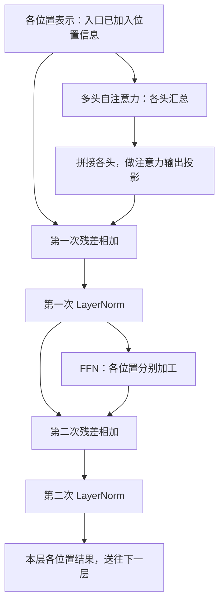

# 第二阶段串讲：Transformer 怎样加工表示、交流信息并保留顺序

第一阶段把一次生成连成了完整过程：文字变成编号，编号查成初始向量，向量经过上下文计算，最后形成词表分数并选择下一个 Token。

其中“经过上下文计算”还是一段概括。第二阶段就把这一段展开，看看一组数字怎样被加工，一个位置怎样取得其他位置的信息，以及这些操作怎样组成 Transformer 的一层。

可以从“猫追狗”开始想象。为说明位置，这里将它画成三个教学单元。每个位置都有一组表示，但光有“猫”“追”“狗”各自的数字，还需要处理两个问题：这些数字怎样变化，谁追谁的关系怎样进入计算。

第 04 课介绍 Linear、激活和 MLP；第 05 课介绍注意力汇总；第 06 课将它们与多头、位置、残差和归一化组装起来。沿着一组表示看它经过这些环节，三个小节就能接成一条连续的过程。

本文依据《AI学习目录》第 04—06 课及《32课学习设计与掌握目标》中第二阶段的要求。词的划分、向量、参数和数值都是教学设置，不是真实模型测量；不同小算例分别解释对应环节，没有给出一套完整模型的全部参数。

## 一、从每个位置的一组数字开始

输入文字经过分词和 Embedding 查表后，每个位置得到一个初始向量。**向量**是一组有顺序的数；把多个位置的向量按行排好，就得到一张数字表。

对于“猫追狗”这个示意，三行分别对应三个位置。我们没有给这三个 Token 指定真实编号或向量，因此只跟踪它们在各环节怎样使用信息，不补写具体坐标。

这一层接收的表示可能来自输入端，也可能来自上一层。经过本层处理，各位置仍会得到一组表示，再交给后续层。

先分清两种操作：

| 操作 | 在做什么 | 信息从哪里来 |
| --- | --- | --- |
| 逐位置加工 | 对一个位置向量里的多个坐标进行变换 | 当前输入到这个位置的表示 |
| 位置间汇总 | 当前位置根据匹配比例，汇入其他可见位置提供的信息 | 本层规定可见的多个位置 |

**FFN 负责逐位置加工，注意力负责位置间汇总**。一个改变各位置内部的数字，一个让表示联系上下文；两种职责随后会在同一层中配合。[^结构]

课程先拆开它们讲解，方便观察。到组装原始编码器一层时，实际顺序是先做注意力，再做 FFN，并在两者周围加入残差与归一化。

## 二、Linear 与激活，把一个位置的数字继续加工

先暂时只看一个位置。课程给了一组二维输入：

```text
[2, −1]
```

**Linear，线性层**使用权重组合输入坐标，再加上偏置。带偏置时，数学上严格称为仿射变换；深度学习中的 Linear 名称通常沿用线性层的叫法。[^加工]

权重和偏置是**参数**，用于规定怎样计算。输入 `[2,−1]` 是本次处理的数据，计算后的数是本次输出。普通推理使用已经得到的参数；训练如何更新参数，是后续训练阶段的问题。

### 每个输出坐标都可以使用多个输入坐标

这个教学 Linear 要把两个输入坐标变成三个输出坐标，规定权重分别为 `[1,1]`、`[−1,1]`、`[2,0]`，偏置为 `[0,1,−1]`：

| 输出项 | 本例计算 | 结果 |
| --- | --- | --- |
| 第 1 项 | `2×1+(−1)×1+0` | 1 |
| 第 2 项 | `2×(−1)+(−1)×1+1` | −2 |
| 第 3 项 | `2×2+(−1)×0−1` | 3 |

于是：

```text
[2, −1] → Linear → [1, −2, 3]
```

这一步说明，Linear 可以让每个输出组合多个输入坐标，也可以改变向量维度。它不只是给原向量每一项分别乘一个数。

### ReLU 在中间引入非线性

接下来用 **ReLU** 作为本例的**激活函数**：负数变成 `0`，其余原样保留。

```text
[1, −2, 3] → ReLU → [1, 0, 3]
```

这里，`−2` 变成 `0` 的那一步，是非线性实际发生的位置。规则在零点两侧不同：负数区域的输出不再随输入下降，正数区域仍跟随输入变化，形成了折点。

如果只把多个带偏置的 Linear 连续相接，它们仍可以合并成一次仿射变换。仅靠增加这样的层数，不能得到这个折点；中间的非线性改变了可表达的关系。[^加工]

### 后续 Linear 仍然可以得到负数

第二个教学 Linear 规定：第一项取 `h₁+2h₂`，第二项取 `h₂−h₃+1`。这里 `h₁、h₂、h₃` 是刚刚得到的三个中间坐标。

代入 `[1,0,3]`：

```text
第一项：1+2×0=1
第二项：0−3+1=−2
最终输出：[1, −2]
```

完整过程是：

```text
[2, −1]
→ Linear：[1, −2, 3]
→ ReLU：  [1, 0, 3]
→ Linear：[1, −2]
```

虽然 ReLU 的直接输出都非负，下一层仍能根据权重和偏置产生负数。如果去掉 ReLU，把 `[1,−2,3]` 直接送进第二层，本例则得到 `[−3,−4]`。改变来自中间操作，不能仅看参数数量解释结果。

Linear 与非线性这样组合，可以形成 **MLP，多层感知机**；在本课的 Transformer 语境里，这类结构构成 **FFN，前馈网络**的逐位置加工模块。

### 把同一套加工放到多个位置

回到“猫追狗”的三行表示。一个 FFN 子层分别加工每行，在不同位置使用同一套参数。它可以混合这一行的坐标，但这一步本身不横向读取其他行。[^结构]

这里“各位置分别加工”也不表示各位置之间永远无关：如果输入 FFN 的向量已经经过注意力，其他位置的信息就可能已经进入了这一行。FFN 加工的是它当前收到的表示。

原始 Transformer 的 FFN 使用两次 Linear，中间为 ReLU；其他模型可能采用不同激活或门控结构。本例只帮助定位非线性与逐位置加工的作用，不将 ReLU 规定为所有模型的统一配置。

## 三、注意力让一个位置汇入可见上下文

一个位置经过了自己的数字变换，仍然需要与其他位置建立联系。比如“猫追狗”，只加工“追”这个位置原有的表示，还需要一种机制把可见的“猫”和“狗”信息汇进来。

**Attention，注意力**承担这类汇总工作。它将当前表示通过学习到的投影转换为不同用途的数字：

- **Query，Q**：当前位置用于查询和比较的表示。
- **Key，K**：各可见位置提供的匹配表示。
- **Value，V**：各位置实际供汇总的内容表示。

Q 与 K 用来确定怎样分配比例，V 是按比例汇总的数。三者是不同计算角色，向量里没有预先存放“提问”“钥匙”“内容”这几个中文标签。[^注意力]

### 从比较到汇总，顺序不能跳过

课程为一个查询直接给出投影后的数值，把注意力局部计算单独展示：

```text
当前查询 Q = [1,0]
```

| 位置 | K | V | Q 与 K 的点积 |
| --- | --- | --- | --- |
| 1 | `[1,0]` | `[10,0]` | 1 |
| 2 | `[0,1]` | `[0,10]` | 0 |
| 3 | `[1,1]` | `[5,5]` | 1 |

**点积**是对应坐标相乘后相加。本例中，Q 与 K 都有两个坐标，点积再除以 `√2` 缩放，得到约 `[0.707107,0,0.707107]`。这里除的是每头 Q、K 维度的平方根，不是位置数或词表大小。

分数经过 Softmax 转为总和为 `1` 的比例，本例约为：

```text
位置1：0.401112
位置2：0.197776
位置3：0.401112
```

然后分别对 V 的每个坐标加权求和：

```text
第1个输出坐标：
0.401112×10 + 0.197776×0 + 0.401112×5
≈ 6.016681

第2个输出坐标：
0.401112×0 + 0.197776×10 + 0.401112×5
≈ 3.983319
```

输出是 `[6.016681,3.983319]`。它是一组汇总后的数字，继续参与后面的表示加工；它没有原封不动复制某一行 V，也不是两个词的输出概率。具体数字使用未舍入值计算，文中展示到六位小数。

这一小段完整地连接了三件事：**比较 Q 与 K，分配比例，再按比例汇总 V**。

### 注意力权重与训练参数，各是哪一种数？

刚才得到的 `0.401112` 等比例，叫注意力权重。它们是这次查询、键和可见范围共同计算出的结果。

前面 Linear 的权重，以及生成 Q、K、V 的投影参数，则属于模型训练得到的参数。两种数都可能叫“权重”，来源与用途却不同：

| 这里说的权重 | 来源 | 怎样使用 |
| --- | --- | --- |
| 模型的变换参数 | 训练得到，普通推理使用已有值 | 决定输入怎样映射成输出或 Q、K、V |
| 本次注意力比例 | 由当前 Q、K 与可见范围计算 | 决定本次怎样混合 V |

沿用相同 K、V，只把 Q 换成 `[0,1]`，点积变成 `[0,1,1]`，比例约为 `[0.197776,0.401112,0.401112]`，汇总变成 `[3.983319,6.016681]`。

同一组材料因查询改变而得到不同混合。这不能解释为某个词永久更重要，更不能只凭最高权重断定答案正确或获得完整的因果解释。注意力比例可以说明这个局部计算怎样汇总，但解释行为还需要相应证据。[^注意力]

### 可见范围也参与比例的计算

现在把原查询 `[1,0]` 放在位置 `2`，并规定只能看当前位置及此前位置。位置 `3` 属于未来，应该被屏蔽。

**Mask，掩码**在 Softmax 归一化之前限制可见项。本例把第三项的匹配分数设为概念上的负无穷，转成比例后就是 `0`，剩余两项重新分配：

```text
新比例：[0.669762, 0.330238, 0]
新汇总：[6.697615, 3.302385]
```

如果先算旧比例，再简单把第三项抹掉，剩下 `0.401112+0.197776≈0.598888`，没有保持本例的总和为 `1`。被遮住的位置不参与归一化，剩余项需要按新的可见集合计算比例。[^注意力]

这样，“加工”与“交流”已经各有了动作。接下来要处理顺序，再将它们接入完整的一层。

## 四、位置进入计算，才能表达前后关系

“猫追狗”和“狗追猫”包含相同的教学单元，含义却不同。每行有内容表示，还需要让计算获得位置线索。

这里先限定一种最朴素的情况：没有位置编码、没有因果等位置相关掩码，忽略 Dropout。固定一个 Q，仅交换 K 的行和它对应的 V，权重也跟着换序，加权求和结果不变。

如果全部输入一起换序，输出各行也会相应换序，不能因此说整张输出表在任何换序下都完全不变。这个性质说明的是：**仅靠这种内容匹配，缺少明确的前后位置线索**。保留因果掩码时，可见范围已经与位置有关，不能直接套用刚才的换序条件。[^位置]

### 正弦位置编码：在输入表示中加位置向量

原始 Transformer 使用一组按位置计算的正弦、余弦数值，与 Token Embedding 相加。这样，相同 Token 的纯查表向量虽相同，进入层计算的表示仍会随所在位置改变。

课程的四维位置编码例子是：

| 位置 | 要加的位置向量 |
| --- | --- |
| 0 | `[0,1,0,1]` |
| 1 | 约 `[0.841471,0.540302,0.010000,0.999950]` |

不必先推导三角函数，也能看出相加的位置不同。位置编码是一组与表示维度匹配的数，不是把整数位置号原样贴进向量。不同维度组使用不同变化频率，共同提供位置线索。[^位置]

### RoPE：在投影之后旋转 Q 与 K

**RoPE，旋转位置编码**采用另一条路径：先得到 Q、K，再按位置旋转它们，让匹配点积带上相对位置信息。它与“输入端加一个位置向量”发生在不同计算位置。[^旋转]

课程的二维手算例固定两支原向量都是 `[1,0]`，教学设置每个位置转 `90°`：

```text
位置1：[0,1]
位置2：[−1,0]
二者点积为0

同时后移一个位置：
位置2：[−1,0]
位置3：[0,−1]
二者点积仍为0
```

内容向量固定，二者间隔保持不变，共同平移后仍保留同样的旋转点积。真实 RoPE 使用多组频率；不能仅凭“位置间隔相同”，就断言任意两组内容的点积都相同。

本阶段把两种机制放在一起，是为了分清它们进入计算的方式，不表示本篇原始编码器示意同时采用了两套位置机制，也不证明某一种在所有任务上效果更好。

## 五、多头、残差与归一化，把结果接成完整的一层

单头注意力已经能完成一次汇总。**多头注意力**则让同一组输入经过多组不同的 Q、K、V 投影，各头并行计算，再合并结果。[^多头]

每个头可以形成不同投影下的汇总，但头的编号没有预先指定“语法头”“事实头”这样的固定职责；实际分工需要观察与验证。

### 多头结果拼接后，还有一次输出投影

课程单独给了一个四维、两头的合并例子。对同一个位置，两头输出分别是 `[1,2]` 和 `[3,4]`：

```text
两头输出：[1,2] 与 [3,4]
拼接结果：[1,2,3,4]
```

然后规定教学输出映射为：

```text
(a,b,c,d) → (a+c,b+d,a−c,b−d)
```

代入后得到 `[4,6,−2,−2]`。它说明各头不只放到一起，后面的输出投影还会混合这些数字。

这次投影合并的是注意力头的结果，映射回模型表示维度；第一阶段末端的词表输出投影，则把最终状态映射为下一 Token 的分数。它们都叫投影，但处在不同位置、服务不同输出。

### 残差连接，把子层输入与结果相加

注意力子层算出结果之后，原始编码器还会进行**残差相加**：把子层结果与进入该子层的表示逐坐标相加。

课程用一组独立数字说明：

```text
子层输入：[1,3]
子层输出：[2,4]
残差相加：[3,7]
```

这条连接为原表示提供一条直接参与后续结果的通路，而不是将子层输出单独作为全部结果。两个向量的维度需要匹配；这也解释了为什么本课 FFN 可以先升维，最终再映射回原表示维度。

相加之后仍会有后续处理。“保留原表示通路”不等于每个原坐标保持数值不变，也不等于跳过子层计算。

### LayerNorm，在这个位置的坐标上归一化

原始布局中，残差相加后再做 **LayerNorm，层归一化**。在本课的设置里，它针对同一个位置向量的坐标计算均值与方差，再进行标准化及缩放、偏移。[^归一化]

继续用刚才 `[3,7]`：均值是 `5`，与均值的差为 `[−2,2]`，两个平方差的平均是 `4`。规定缩放为 `1`、偏移为 `0`，分母中加入 `0.00001`，得到：

```text
[(3−5)/√4.00001, (7−5)/√4.00001]
≈ [−0.999999, 0.999999]
```

这里用的是总体方差，也没有把所有 Token 的坐标放在一起平均。LayerNorm 的统计与尺度处理，和注意力从其他位置汇总信息，是不同的操作。

### 现在把原始编码器一层接起来

下面画的是原始 Transformer 编码器的 **Post-LN** 布局，省略 Dropout。位置编码已在入口加入；图中的各次相加与归一化属于各自的子层位置。



沿着“猫追狗”的表示看：三个位置先各自形成查询，并从可见位置汇入内容。各头结果经过拼接与投影，和注意力输入相加，再归一化。随后，FFN 在各位置使用同一套参数加工，结果又与 FFN 输入相加，再归一化，交给下一层。[^结构]

这里的教学讲解顺序是先拆加工、再拆交流；层里的实际执行顺序则以图为准：**先交流，再对已经交流过的各位置表示分别加工**。

其他模型可以采用 **Pre-LN**，即在子层计算前归一化，再把子层结果加回输入；这与图中“相加后归一化”的 Post-LN 顺序不同。具体层布局要读对应模型资料，不能把原始示意当成所有 Transformer 的固定结构。[^归一化]

多层继续加工这些表示，也不表示不同层共享同一套参数。层输出最后接什么任务接口，还取决于完整架构。

## 六、完整架构的差别，先看谁能读到谁

一层里已经有了交流和加工。把它们放进完整模型，还要确定两个边界：查询与内容从哪里来，以及哪些位置可见。

| 架构 | 自注意力的主要可见范围 | 其他信息来源 | 本课教学用途 |
| --- | --- | --- | --- |
| Encoder-only | 未被填充等掩码排除的整段有效输入 | 没有独立解码器 | 全句分类、抽取等 |
| 因果 Decoder-only | 当前位置及此前有效位置 | 没有独立编码器的交叉注意力通道 | 按已有前缀续写 |
| Encoder—Decoder | Encoder 读取源输入；Decoder 自注意力读取目标前缀 | Decoder 通过交叉注意力读取 Encoder 的源表示 | 将源序列转换为目标序列，如翻译 |

这些用途帮助记忆信息流，不代表每种架构只能做表中任务。第一阶段的逐 Token 输出循环描述自回归生成，也不能直接套到所有编码器任务上。[^架构]

### 因果掩码限制未来，但当前位置可以读自己

如果只有三个输入位置，因果自注意力的可见范围可以写成：

| 查询位置 | 读位置1 | 读位置2 | 读位置3 |
| --- | --- | --- | --- |
| 位置1 | 可见 | 禁止 | 禁止 |
| 位置2 | 可见 | 可见 | 禁止 |
| 位置3 | 可见 | 可见 | 可见 |

这正好解释前面的注意力数字例子：Q 放在位置 `2` 时，位置 `3` 被屏蔽，位置 `1、2` 仍参与重新分配。

对角线可见，也就是输入位置能读取自身，并不等于看到了待预测的答案。训练时，输入与目标错开一位。沿用课程例子：

| 位置 | 送入的目标侧输入 | 这个位置要预测的项 | 允许读取的输入 |
| --- | --- | --- | --- |
| 1 | 开始 | 我 | 开始 |
| 2 | 我 | 睡 | 开始、我 |
| 3 | 睡 | 结束 | 开始、我、睡 |

位置 `2` 读取到的“我”，是已有输入；它正在预测的是“睡”。未来输入中的“睡”不能让位置 `2` 直接读取，否则就泄漏了它要预测的目标。

训练可以提供已经右移的正确序列，并按因果范围计算各位置的预测；推理时则要把刚选出的 Token 加入前缀，才能继续下一步。两种运行条件在第一阶段的生成循环与后续训练课程中会再次连接。[^架构]

### 翻译还需要读取已经给定的源文

Encoder—Decoder 的原始 Decoder 比编码器多一个**交叉注意力**子层。在这里，Q 来自 Decoder 当前表示，K、V 来自 Encoder 输出。

Decoder 的目标自注意力继续遵守因果范围；交叉注意力则正常读取已经提供的全部有效源文。源文后面的一个位置，不是“尚未生成的未来目标”，不能直接把目标侧因果掩码套过去。

这一分工使目标生成既依赖已有目标前缀，也能使用完整的源文信息。区别来自信息来源与可见范围，不是简单地把所有 Transformer 都画成同一个编码器—解码器结构。[^架构]

## 七、回到一组表示，看它怎样在模型里前进

现在再沿着原始编码器示意看“猫追狗”。入口中的各位置表示先带上位置信息。进入注意力后，不同投影形成 Q、K、V，每个查询在规定的可见范围内计算比例，并汇总内容。多个头的汇总合并、投影，接着残差相加和归一化。

此时每个位置已经得到新的上下文表示。FFN 对这些位置分别加工坐标：Linear 混合数字，非线性改变可表达的关系，再映射回需要的维度。第二次残差与归一化完成后，本层结果交给后续层。

同样的基本计算职责，也可以用于其他架构。采用因果生成时，注意力的未来可见范围被限制，最终表示再接词表评分与下一项选择；采用编码器—解码器时，目标端还要通过交叉注意力取得源文信息。精确布局仍以各模型实现为准。

第二阶段因此把第一阶段的一段概括打开了：

> 表示经过逐位置变换与跨位置汇总，位置机制提供顺序线索，多头合并、残差与归一化把这些结果连成一层；完整架构再规定信息从哪里来、哪些位置可见。

可以把各零件保留在这张职责表里，继续往后读时就能找到它们的作用位置：

| 零件 | 本阶段建立的认识 |
| --- | --- |
| Linear | 用已有参数组合输入坐标并映射维度 |
| 激活 | 在数字加工中引入非线性 |
| FFN | 使用同一套参数，在各位置分别加工当前表示 |
| Q、K、V | 分别承担匹配与内容汇总的职责 |
| 注意力权重 | 当前查询和可见集合下的汇总比例 |
| 多头与输出投影 | 并行汇总，再合并不同头的结果 |
| 位置机制 | 把前后或相对位置关系带入计算 |
| 残差与 LayerNorm | 提供输入通路，并在规定位置做数值统计与变换 |
| 架构与掩码 | 确定信息来源和可见范围 |

后续谈任务、证据或工具时，模型仍在这些内部计算的基础上处理输入。清楚这些机制有助于理解模型在做什么，但注意力比例、隐藏坐标或更复杂的结构，都不能直接替代实际任务结果与事实证据的核验。

## 依据与回查

本篇将第二阶段三个小节连成连续讲解：第 04 课“Linear、激活与 MLP”、第 05 课“注意力：按当前需要汇总信息”、第 06 课“多头、位置与完整架构”。课程尚无已提供的公开发布网址，因此这里只列文字出处；机制依据见以下公开资料。

文中的两层 MLP、三位置注意力、多头合并、位置旋转和残差归一化，分别沿用课程已有的独立教学设置。本文没有补造从“猫追狗”的具体输入一路算到最终词表分数所需的完整参数，也没有运行真实模型或开展真实学习效果试验。

[^加工]: [从Linear到MLP原讲解](https://www.bilibili.com/video/BV1i5koBtEUU)，用于回看权重、偏置与非线性；[PyTorch《Linear》](https://docs.pytorch.org/docs/2.14/generated/torch.nn.Linear.html)和 [《ReLU》](https://docs.pytorch.org/docs/2.14/generated/torch.nn.ReLU.html)支持映射与逐项激活定义。全部两层数值来自课程教学设置。
[^结构]: [Vaswani 等《Attention Is All You Need》v7](https://arxiv.org/html/1706.03762v7)的 §3.1、§3.3，支持原始层结构、残差归一化与逐位置 FFN。本文层图省略 Dropout，只画原始 Post-LN，不概括所有变体。
[^注意力]: [多头注意力原讲解](https://www.bilibili.com/video/BV1of6cBAEuJ)及 [PyTorch《scaled_dot_product_attention》](https://docs.pytorch.org/docs/2.14/generated/torch.nn.functional.scaled_dot_product_attention.html)，用于回看缩放、掩码、Softmax 与 V 汇总的计算次序；原论文 §3.2.1 支持缩放点积机制。查询与输出数值由课程定义，不是实际头的语义或因果解释测量。
[^位置]: [Transformer为什么需要位置编码](https://www.bilibili.com/video/BV1DLbj6ME1e)及 [《Attention Is All You Need》v7](https://arxiv.org/html/1706.03762v7)的 §3.5，支持顺序线索与原始正弦位置编码。本篇换序讨论明确限定没有位置编码、没有位置相关掩码且忽略 Dropout。
[^旋转]: [RoPE 原讲解](https://www.bilibili.com/video/BV1kqYe6DEvF)及 [Su 等《RoFormer》v5](https://arxiv.org/html/2104.09864v5)的 §3.2.1—3.2.2，支持投影后旋转 Q、K 及相对位置点积关系。二维旋转采用课程教学角度，固定内容才讨论共同平移。
[^多头]: [PyTorch《MultiheadAttention》](https://docs.pytorch.org/docs/2.14/generated/torch.nn.MultiheadAttention.html)及原论文 §3.2.2，支持各头投影、拼接与输出投影。四维合并映射为课程教学设置，不为头赋予预先固定的人类职责。
[^归一化]: [PyTorch《LayerNorm》](https://docs.pytorch.org/docs/2.14/generated/torch.nn.LayerNorm.html)支持末维统计、总体方差及缩放偏移；[《TransformerEncoderLayer》](https://docs.pytorch.org/docs/2.14/generated/torch.nn.TransformerEncoderLayer.html)的 norm_first 用于核对归一化在子层之前或之后的布局区别。残差与归一化数值为本课教学设置。
[^架构]: [Transformer 架构导论原视频](https://www.bilibili.com/video/BV1k6yWBEEmH)及 [《Attention Is All You Need》v7](https://arxiv.org/html/1706.03762v7)的 §3.1、§3.2.3，支持编码器、因果解码器与交叉注意力的信息来源；输入与目标右移、可见范围表采用课程明示的例子。
