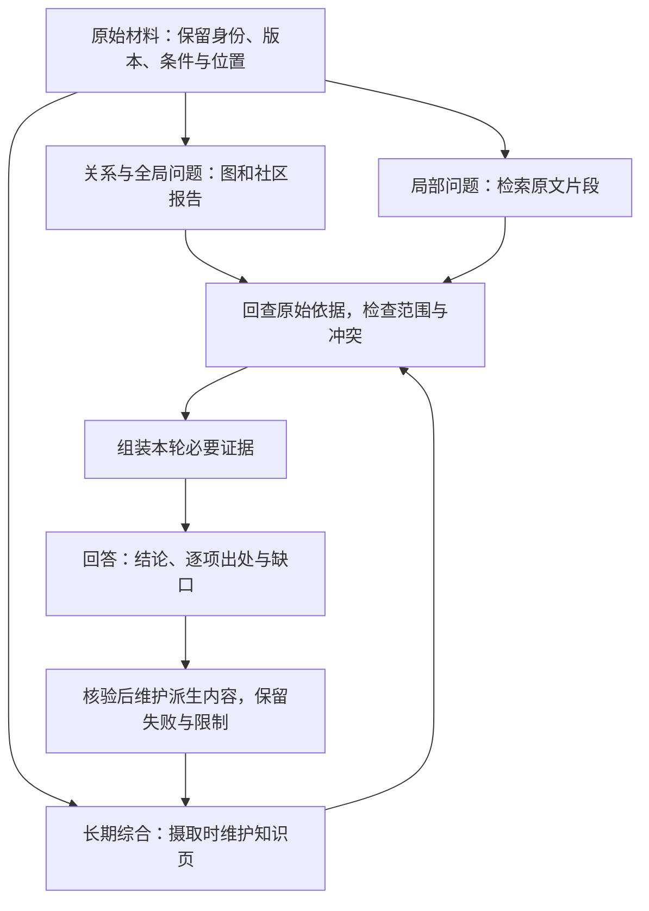

# 第五阶段串讲：从找到资料到给出有依据的回答

一个系统找到了三份设备规则：一份写7天，一份写14天，还有一份写30天。它回答：“综合多份资料，设备可以在30天内退货。”

这个答案引用了资料，数字也确实出现过，却仍可能答错。30天说的是租用归还，用户问的是购买退货；7天与14天又分别属于不同时段。找到相似文字之后，还需要确认它在说谁、适用于什么时候，以及究竟支持哪项判断。

第五阶段“把资料变成可核验的回答”围绕这条过程展开：第13课讲怎样把必要片段找回来，第14课讲怎样按问题选择片段、关系或长期综合入口，第15课讲怎样处理来源差异、真实冲突和知识缺口。

我们跟着同一个问题走一遍：先准备资料，再找依据、形成答案；当用户改问规则变化时，转向关系和综合页；最后遇到冲突与缺口，说明现有资料能支持到哪里。这条主线也会接回前一阶段的“实际输入”和“可信写回”。

本文补齐理解所需的前置概念，不要求安装向量库、搭建知识图谱或运行模型。甲乙丙的规则、日期、检索名次和后面的冲突变式均为课程教学设置，不是实际制度、真实模型成绩或业务建议。图与报告是人工演示，不是系统实测产物。

## 一、先把问题与材料的范围对齐

这次用户的问题是：

> 2025-06-12提出申请，购买设备签收第10天，未拆封，有含订单号的电子凭证，能申请退货吗？只依据给定材料解释，不执行退货或退款。

这里有五项事实：申请日期、购买对象、签收天数、拆封状态和凭证。签收当天记为第0天；本教学规则按申请日期选择生效版本。

资料有三份，日期与范围分别如下：

| 材料 | 发布与生效信息 | 管理的事情 |
| --- | --- | --- |
| 甲 | 2024-12-20发布；2025-01-01至2025-05-31生效 | 旧版购买退货 |
| 乙 | 2025-05-20发布；2025-06-01起生效，明确替代甲的购买规则 | 新版购买退货 |
| 丙 | 2025-06-10发布并生效 | 租用归还，不修改购买规则 |

完整条款是：

| 条款 | 教学原文 |
| --- | --- |
| 甲1 | 购买设备在签收后第 0—7 天、未拆封，可以申请退货。 |
| 甲2 | 需要纸质发票；电子订单截图不能代替纸质发票。 |
| 乙1 | 购买设备在签收后第 0—14 天、未拆封，可以申请退货。 |
| 乙2 | 凭证可以是纸质发票，或含订单号的电子凭证；聊天截图不属于上述凭证。 |
| 乙3 | 已拆封设备不能按乙1申请退货，只能转维修核验；转维修不代表已经批准退款。 |
| 丙1 | 租用设备应在签收后第 0—30 天归还。 |
| 丙2 | 本规则不适用于购买设备退货，也不修改乙的购买规则。 |

现在已经可以人工核对：主问题在乙生效以后，且对象是购买。甲的历史规则需要保留，丙也有自己的用途，但二者都不能直接给这道题提供购买退货资格。

这还只是三份短资料。实际资料很多时，模型通常不会一次读完所有原文，需要有办法从窗口外找到当前必要的内容。第13课的RAG就从这里接上来。

## 二、先让资料成为可以找回、可以核对的证据

**RAG是检索增强生成**，英文Retrieval-Augmented Generation。它在回答前从外部资料检索相关内容，把取得的片段放进模型当前输入，再形成回答。资料更新可以先体现在检索库中，这个过程本身不要求修改生成模型的参数。[^检索]

先看准备资料的工作。我们把乙1和乙2分成两块，分别负责期限与拆封、凭证。这里的“分块”是把原文划成便于检索的单位；块不一定只有一句话，关键是能保住判断所需的上下文。

乙2这一块不能只保存“电子凭证可以”，应保留完整条款及定位：

```text
材料：乙
发布日期：2025-05-20
生效范围：2025-06-01起；替代甲的购买规则
对象：购买设备退货
原文位置：乙2
原文：凭证可以是纸质发票，或含订单号的电子凭证；聊天截图不属于上述凭证。
```

这些项目是教学证据卡的信息约定，不是某个数据库的固定字段。真实资料可以用原文标题、页码、段落或其他已有定位方式；定位必须来自实际文件，不能生成一个看似精确、实际不存在的位置。

同样，乙1必须把“第0—14天”和“未拆封”保留在判断附近。若只切出“可以申请退货”，把条件扔到检索不到的另一块，后续模型得到的证据就已经不完整。适当重叠可以缓解切断问题，也会增加重复内容，不能用一个固定块大小保证所有资料都合适。[^检索]

在常见的向量检索流程中，还会进行两步准备：

1. 用Embedding模型把片段转换成便于相似度比较的数字向量。
2. 把向量、原文及来源位置放进可检索的索引。

Embedding在这里表示文本的检索表示。查询时，问题也用与片段相同的检索模型编码，系统比较这些表示，找出相近片段。这与第一阶段的表示概念相接：向量为计算提供形式，不能因为两段文字在向量空间接近，就认定它们事实一致或适用于同一对象。

索引让我们有地方查找，证据卡让找到的内容有地方回查。两者都准备好以后，才能进入问答。

## 三、把片段找回来，还要让它真正进入答案

### 从问题到有限证据

问答阶段的每一步都有不同产物：

| 步骤 | 做什么 | 本案例中留下什么 |
| --- | --- | --- |
| 召回 | 从索引中找出可能相关的材料或片段 | 初始返回名单及原文 |
| 筛选与重排 | 检查对象、日期和条件，或进一步比较问题与片段的相关程度 | 保留名单、次序及排除理由 |
| 组装 | 把必要证据与问题、回答约束放进实际请求 | 模型本轮真正收到的乙1、乙2及版本信息 |
| 生成 | 根据当前证据形成有边界的回答 | 结论、逐项依据和未说明之处 |

“召回”先争取把必要内容找出来，“重排”再对已经取得的内容重新排序；人工按日期和对象检查适用性，是本例展示的筛选动作。真实重排模型通常联合读取问题和片段进行评分，其分数也不能代替全部规则核对。[^重排]

课程用两份人为排名展示为什么“排在前面”仍不等于“能支持答案”：关键词检索把甲、乙、丙依次排在前面，向量检索的次序则是乙、丙、甲。这些名次不是实际搜索结果。

两路原始分数可能处在不同尺度，不能随意直接相加。课程用RRF，即Reciprocal Rank Fusion，按名次融合：每一路贡献 `1 ÷ (60 + 名次)`，再将贡献相加。60是本次手算设定，不是所有任务的最优值。[^融合]

| 材料 | 关键词名次 | 向量名次 | 教学RRF结果 |
| --- | --- | --- | --- |
| 甲 | 1 | 3 | 1/61 + 1/63 ≈ 0.03226646 |
| 乙 | 2 | 1 | 1/62 + 1/61 ≈ 0.03252247 |
| 丙 | 3 | 2 | 1/63 + 1/62 ≈ 0.03200205 |

融合后乙、甲、丙依次排列，但这只是在合并检索信号。继续对照主问题：甲在申请日失效，丙的对象是租用，保留乙，再取得乙1与乙2。这里的排名按文档计算，判断依据按条款核对，不能把“乙排第一”当成“乙的必要条款已经全部在场”。

RAG也不要求每次都做两路检索或名次融合。三份短材料可以手工找片段；需要怎样的技术组合，取决于问题和已有失败。无论怎样找到，**排名与相似度提供检索线索，适用条款才支持具体判断**。

### 乙2丢在哪里，修复就从哪里开始

现在假设系统最后只收到乙1，却回答“电子凭证合格”。与其马上更换模型，不如沿记录找乙2：

| 已有记录 | 能定位到哪里 | 怎样继续 |
| --- | --- | --- |
| 初始返回没有乙2 | 必要条款未被召回 | 检查分块、查询与索引，重新取得乙2 |
| 初始返回有乙2，筛选后没有 | 筛选或重排丢掉了条款 | 对照排除理由与乙2的实际用途 |
| 筛选后有乙2，实际请求没有 | 组装遗漏 | 对照组装结果，补入必要证据 |
| 实际请求有完整乙2，答案仍说任何截图都行 | 生成或证据使用错误 | 对照原文订单号限定与聊天截图否定 |

四种失败外观相近，需要修的环节却不同。**重排不能补回初始召回中根本没有取得的内容**。只看最终答案，也不能证明是哪一步丢了乙2。

若当前只有乙1，就能核对期限与拆封，但还没有凭证依据。正确推进是说明缺少凭证条款，补证前停止“凭证合格”的断言。检索日志里曾出现乙2，也不证明它已经进入实际输入；这正是第四阶段讲过的窗口边界。

当乙1、乙2及适用信息终于进入实际请求后，我们暂时已经拥有主问题的必要依据。但用户如果改问“新旧规则有什么变化”，只盯乙的局部片段就不够了。第14课接着处理入口的选择。

## 四、问题从局部事实变成关系与全局主题

“含订单号的电子凭证能不能用”，直接回查乙2最清楚。“乙与甲有什么变化、丙是否也改变购买规则”，需要连接几份材料，保留替代、范围和条件关系。

GraphRAG会从资料中组织实体和关系，并生成用于概括关联内容的社区报告。实体可以理解为图中被明确表示的对象，关系是连接对象的有条件说明。它帮助沿关系找资料，也增加抽取与检查的工作。[^图检索]

我们先手画几条关系。下面是教学表示，不是运行构图器得到的结果：

| 关系 | 必须跟着关系保留的条件与依据 |
| --- | --- |
| 乙替代甲 | 2025-06-01起；只针对购买规则，依据乙的生效说明 |
| 购买退货需要未拆封 | 第0—14天；依据乙1 |
| 购买退货接受电子凭证 | 必须含订单号；聊天截图被排除，依据乙2 |
| 已拆封设备转入维修核验 | 不能按乙1申请；不等于批准退款，依据乙3 |
| 丙管理租用归还 | 第0—30天；不适用于购买退货，也不修改乙，依据丙1、丙2 |

关系能让“乙”“甲”“购买退货”“租用归还”连起来，却不能将限定压成一个无条件数字。如果画出“设备退货期限30天”，图已经把丙的规则抽错了。修复时应打开丙1、丙2，把关系限定回租用，再核对使用这条错边的报告与回答；重新生成一篇总结而不改底层关系，错误仍可能继续传播。

微软GraphRAG的Local Search从与问题相关的实体出发，扩展关联实体、关系、社区报告及映射到的原文，再筛选和组装当前上下文。它提供的是有关系的查找路径，仍要核对路径末端的条款。[^图检索]

当问题进一步变成“整批资料围绕哪些主题展开”，就需要更宽的视角。社区报告是对图中一组相关对象及关系的归纳；我们用两张人工报告模拟这个思路：

- “购买规则变化”：甲的7天与纸质发票，转为乙的14天及增加含订单号电子凭证；未拆封限制保留，已拆封转维修核验有明确边界。
- “租用规则独立”：丙规定30天归还，同时明确不修改购买退货规则。

再从两张报告归纳出“期限、凭证、对象范围、动作状态”四个主题。这些是依据给定材料的人工整理，没有进行真实社区检测，也不证明每一种图聚类都会得到这两个社区。

微软文档描述的Global Search对选定社区层级的报告分批处理：先分别形成中间要点，再过滤、综合为最终回答，这称为Map-Reduce。它从报告组织全局主题，不表示会自动逐层下钻全部原始条款。报告层级和内容也会影响结果。[^图检索]

因此，若一张“规则变化”报告只含乙，没有可追溯的甲1、甲2，我们就无法完整证明“7天变14天、纸质发票扩展到电子凭证”。应补取甲方依据，再比较；不能因为报告标题写着“新旧对比”，就认为比较已经完整。

图与报告解决了关联导航的问题。接下来，如果这些比较每天都被问到，就值得把经过核对的结论维护下来，而不是每次重新生成。这就是LLM Wiki接入的位置。

## 五、把已经核对的知识留下，并在新资料进入时维护

本文沿用课程对LLM Wiki的定义：在资料摄取时形成有来源、相互关联的知识页，之后随着新资料持续维护。这里的“摄取”是接收、阅读与整合资料的过程；它把一部分跨资料综合工作前移到提问以前。这个称呼和具体页面体系在不同实现中可以不同。[^知识维护]

先沿甲、乙、丙的进入过程看知识怎样变化。以下页面名称都是教学示意，我们没有实际创建这些知识页。

| 进入的资料 | 需要维护什么 | 必须保留什么 |
| --- | --- | --- |
| 先有甲 | 形成甲的来源摘要，将购买规则及其生效范围写入相关主题页 | 7天、未拆封、纸质发票及甲的生效区间；不扩展到范围之外 |
| 再加入乙 | 新增乙摘要，更新购买主题页与新旧对比，写明替代关系，检查仍把7天写成当前规则的关联页 | 甲的历史事实；乙自2025-06-01起生效；不能仅凭5月20日发布就提前使用 |
| 再加入丙 | 新增租用摘要与相关主题，连接购买与租用的范围对比，检查“设备退货30天”的误写 | 丙1、丙2的租用范围和不修改乙的说明；购买规则仍按乙 |

这不是给三份资料各写一页摘要就结束。长期知识的价值来自维护共同结论、关联、范围与冲突：主题页讲当前与历史，对比页讲变化，来源页保留定位，缺口页记录无法回答的问题。新资料到来后，还要检查受影响的旧表述，避免局部更新正确、其他页面仍重复过期结论。

例如，维护好的“购买退货规则变化”页可以保存：

> 甲在其生效期内要求签收第0—7天、未拆封及纸质发票；乙自2025-06-01起替代甲，将期限扩为第0—14天，并接受纸质发票或含订单号的电子凭证。凭证中的聊天截图仍被排除。上述变化分别回查甲1、甲2、乙1、乙2及生效说明。

这页帮助读者快速理解变化，具体资格判断仍要回查完整条款。对于已拆封的提问，还应取得乙3，不能只用这段对比推断维修或退款状态。

查询中发现一项有长期价值的补充判断，可以在核对来源后写回相关页；发现链接、版本、冲突或限定丢失，则需要检查并修正派生内容；缺少关键原件时，记录缺口并按授权补证。持续写回、检查与审阅，才让已有页面保持可用。把未经验证的回答保存成事实，反而会让下一次检索更快地重复它。[^知识维护]

这时，三种入口的职责已经清楚：

| 用户需要什么 | 可以先走哪个入口 | 新增的维护与检查责任 |
| --- | --- | --- |
| “电子凭证是否合格”这样的局部事实 | 找乙2片段，走RAG证据流程 | 分块条件、召回覆盖、实际输入与逐项引用 |
| “新旧规则如何关联、整批资料有哪些主题” | 关系图或社区报告，再回查原文 | 抽取是否正确、报告是否包含比较双方、构图与报告更新成本 |
| “以后持续跟踪规则及变化” | 维护过的LLM Wiki知识页，再按需查条款 | 版本更新、跨页一致性、冲突、溯源与人工审阅 |

三者可以协作：从知识页理解背景，沿关系找到相关资料，再用原文片段回答当前事实。它们没有取消彼此的责任，也没有一个仅凭资料数量就成立的升级顺序。对于这三份短规则，手工阅读和比较已经足够展示主线；维护层与图层要在实际需求中承担得起相应成本。

## 六、回到原始资料，才能分清差异与冲突

### 7天、14天、30天分别在说什么

沿几个入口走一圈，我们又见到了开头的三个数字。这次它们都有对象、日期、条件和来源，不再是三个孤立答案。

| 比较对象 | 表面不一致 | 对齐后的判断 |
| --- | --- | --- |
| 甲1与乙1 | 7天与14天 | 生效时段不同，乙明确替代甲的购买规则；保留历史与现行两者 |
| 乙1与丙1 | 14天与30天 | 购买退货与租用归还不同；丙2明确不修改乙 |
| 乙1与乙3 | 可以申请与不能按乙1申请 | 未拆封与已拆封不同；条件不同，不能省略拆封状态 |

这里没有理由投票、平均或取最大值。平均会生成材料中不存在的期限，取30天则把租用归还搬到了购买退货上。

发布日期也不能独立决定优先级。例如2025-05-25的购买申请，乙虽然已经发布，尚未生效，仍应按甲的范围核对。历史页里保留甲不代表资料错误，关键是让它以历史身份出现。

### 同范围仍互相矛盾，才需要并列确认

现在进入一个单独的冲突变式。暂时增加另一份人工教学材料：它同样声称适用于2025-06-12的购买设备、未拆封，但写“签收后第0—20天可以申请退货”，没有说明与乙的替代关系。它只用于展示冲突处理，不进入前面主问题的三份既定材料。

这次不能再用“对象不同”或“时段不同”化解：

| 来源 | 同范围内的期限表述 | 现有缺口 |
| --- | --- | --- |
| 乙1 | 第0—14天、未拆封可申请 | 没有与另一份材料的覆盖说明 |
| 另一份教学材料 | 第0—20天、未拆封可申请 | 没有说明取代乙或仅适用于额外范围 |

若申请在第16天，这个分歧就直接影响资格：按乙1超期，按另一份材料则在期限内。合格回答应保留双方原文、来源和相同范围，明确现有材料无法确定哪项有效，并提出需要确认的事项，例如发布主体、效力范围、是否存在正式替代说明。

不能静默挑20天，不能只因为一份发布时间更晚就宣布另一份失效，也不能因为更多派生页引用14天，就投票把20天删掉。必须让真正有依据的覆盖关系或有权确认来解决。

### 两页引用同一条款，仍只有同一份底层依据

假设“购买规则”页和“规则变化”页都写14天，且都来自乙1。它们是两份整理结果，不是两次独立证明。

可以把溯源关系写成：

```text
乙1及生效说明 → 来源摘要 → 购买规则页 → 当前回答
乙1及生效说明 → 来源摘要 → 规则变化页 → 当前回答
```

两条路径末端不同，底层依据相同。图中的一条边、报告中的一句话、知识页中的一段总结，都需要回到这条链上核对。**派生页面数量不增加独立原始证据**。

W3C的PROV入门文档用“派生”和“修订”描述内容之间的来源关系，这能帮助记录结论从哪里来、依据过哪个版本。记录完整链条使核验成为可能，不会自动证明抽取和结论真实。[^溯源]

## 七、最后一句话，也要保留证据支持的范围

回到只有甲乙丙的主问题，已经取得适用的乙1、乙2，我们可以逐项形成答案：

1. 申请日期2025-06-12，购买对象，乙适用。
2. 签收第10天落在第0—14天内，且未拆封，乙1的条件满足。
3. 电子凭证含订单号，满足乙2；“电子凭证”不能被缩成任意截图。
4. 结论为符合教学材料中的退货申请条件；任务只要求解释，没有执行动作。

把这几项连成一段，就是有依据的回答：

> 按申请日期与购买对象，适用乙。签收第10天且未拆封，满足乙1；含订单号的电子凭证满足乙2。因此符合教学材料中的退货申请条件。本次未执行退货或退款，也不能据此认定已经批准。

回答中有三种性质不同的内容：

| 层次 | 示例 | 需要什么支持 |
| --- | --- | --- |
| 材料直接陈述 | 乙1规定第0—14天、未拆封可申请 | 完整乙1及适用信息 |
| 根据材料和输入作出的推导 | 第10天、未拆封、凭证含订单号，符合展示的申请条件 | 用户事实与乙1、乙2逐项对照 |
| 外部动作或状态 | 已提交申请、已批准、已退款 | 相应授权、执行结果及状态核验；本任务没有这些证据 |

有条款不等于执行过操作。图谱把“可申请”连到某个节点，知识页写了“规则允许”，都不能让“已退款”成为事实。

现在把用户输入中的凭证改成聊天截图，其余保持不变。回查乙2后，应说明期限与拆封满足，但截图不属于展示的合格凭证，当前不满足申请凭证要求。换条件以后，旧结论不能直接复用；检索和知识页的价值在于让我们方便重新核对。

若用户没有说明拆封状态，规则再齐全也不能补出这项事实。应指出资料不足，询问拆封状态；乙1要求未拆封，乙3规定已拆封不能走这条申请路径。缺用户事实和缺规则条款是不同缺口，前者需补事实，后者需补证据。

再把问题改成“签收第16天，能不能特批”。只依据甲乙丙，我们能说两件事：第16天不满足乙1展示的普通申请期限；现有材料没有说明特批政策。不能补写“可以特批”，也不能把“材料未说明”扩成“任何情况下都绝对不存在特批”。

同样，如果对比页宣称一份我们尚未取得的原件规定了特批，只能说明该派生页作过这种转述，并指出原件无法核验。它不能直接补成已确认的政策依据；需要取得原件及适用范围，再更新判断。这也适用于技术文章：有整理页或讲解视频，不等于已经拿到对应版本、源码或实验记录，支持范围要按实际材料说明。

这样，回答可以有明确结论，也可以以明确缺口结束。缺口写清是哪项事实、哪条规则或哪份原件缺失，以及怎样继续核对，本身就提供了有用的下一步。

## 八、把三课连成同一个证据过程

再沿主问题走一次，我们先把原文分成保留身份、版本、条件和定位的片段；检索取得可能相关的材料，按问题筛选适用条款；组装实际输入，再逐项形成结论。这是第13课带来的证据流程。

当问题变成规则关系或全局主题，我们可以借助图与社区报告连接资料；当结论需要长期复用，摄取时就维护有来源的知识页，并在新资料进入时更新关联与冲突。这是第14课扩展的知识入口。

无论从哪一个入口进入，最终都要按对象、日期、条件和版本回查原件：明确替代就保留历史和现行，范围不同就分别表达，真实冲突就并列来源，缺资料就停在已有证据支持的部分。这是第15课确定的回答边界。



走完这条过程，应能解释乙2在什么环节丢失，为什么一次名次领先不足以支持答案；也能根据问题选择入口，并把图边或综合结论追溯到原始条款。遇到7、14、30天时，首先寻找对象与时段；遇到同范围14与20天时，保留分歧；遇到第16天特批时，明确现有政策缺口。

这些能力让“带引用的回答”进一步成为“可以对照证据核验的回答”。下一阶段会把这里的责任写成成功标准，分别检查检索与答案，并用修改前后的同一批任务检验是否回退。

## 依据与回查

本文依据《AI学习目录》与《32课学习设计与掌握目标》的第五阶段第13—15课，按《AI学习博客编写规范》与阶段串讲要求组织。甲乙丙条款、主问题和两路排名来自课程；关系表、知识页、人工报告及14/20天冲突变式用于展示给定规则下的过程，不是模型或数据库实测。以上课程与规范目前以文字标题说明出处。

[^检索]: [《这就是RAG 一看就懂的个人知识库架构》](https://www.bilibili.com/video/BV19RJhzyEWN)支持检索表示、分块与基础流程；[《第四期：RAG 检索增强生成》](https://www.bilibili.com/video/BV17eNu6zEbx)支持混合检索与分层检查。对应完整整理资料已读取；另核对Anthropic [Introducing Contextual Retrieval](https://www.anthropic.com/engineering/contextual-retrieval)中的基础RAG流程与片段上下文问题，文章发布于2024-09-19。本文未采用其实验收益、产品规格或固定块大小。
[^融合]: Elastic官方文档：[Reciprocal rank fusion](https://www.elastic.co/docs/reference/elasticsearch/rest-apis/reciprocal-rank-fusion)。支持按名次贡献融合的公式。甲乙丙名次和常数60来自课程教学设定，分数只说明这个设定下的融合次序。
[^重排]: Sentence Transformers官方文档：[Retrieve & Re-Rank](https://www.sbert.net/examples/sentence_transformer/applications/retrieve_rerank/README.html)。支持先检索、再对已取得内容重新评分的两阶段流程；本文的人工适用性检查不是重排模型实测。
[^图检索]: 原始讲解：[《AI知识图谱 GraphRAG 是怎么回事？》](https://www.bilibili.com/video/BV1zoKuzoENM)，对应完整整理资料已读取。查询流程另核对微软GraphRAG官方[Local Search](https://microsoft.github.io/graphrag/query/local_search/)与[Global Search](https://microsoft.github.io/graphrag/query/global_search/)的“Methodology”；相关描述限定于这两份文档，不概括所有图检索实现。教学关系与两张报告由人工归纳，未运行实体抽取、社区检测或模型生成。
[^知识维护]: [《RAG vs GraphRAG vs LLM Wiki 一次讲透：Karpathy引爆的LLM Wiki，是知识工程的下一次革命，还是又一个被高估的“自我进化”》](https://www.bilibili.com/video/BV1NG9xBUEju)，唐国梁Tommy，2026-04-29。本文读取完整整理资料，采用其摄取时维护、关联更新、冲突与溯源责任；不把其中具体实现、页面数量或效果比较作为已复现结论。
[^溯源]: W3C [PROV Model Primer，2013-04-30固定版本](https://www.w3.org/TR/2013/NOTE-prov-primer-20130430/)，回查“2.6 Derivation and Revision”与对应示例。支持派生、修订和来源关系的概念；本文的原始条款到回答链是教学表示，没有实现PROV数据模型。

本文核验了课程目标、相关完整原始整理资料、上述官方流程与教学数值。本地Markdown渲染不替代实际发布平台预览；未重新核对完整视频，未搭建检索或知识图谱系统、调用真实模型或进行新手试读。跟随案例理解过程有助于回顾，实际掌握仍需要读者能在新的问题与材料范围下独立作出有依据的判断。
