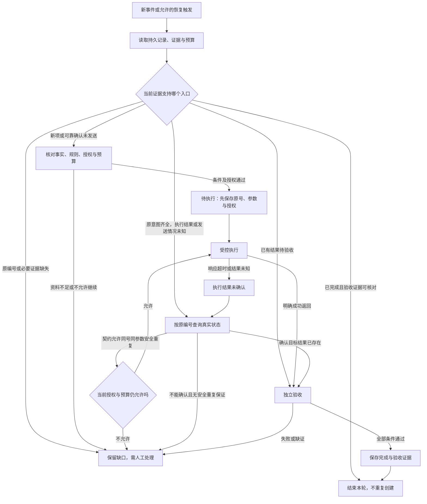

# 第八阶段串讲：让任务在授权内执行，在中断后接续

助手已经会查资料、提出工具请求，也会根据返回调整计划。现在，我们让它为一个订单创建一条待受理记录。

服务端写入成功，回执却在路上丢失。助手只看见超时，随后程序崩溃。重启时，它读回一段摘要：“尚未创建，下一步创建。”

照着摘要继续，看起来是在恢复进度，却可能再建出一条记录。问题不在于它有没有记住任务，而在于它保存了什么、谁允许写入，以及怎样重新确认真实结果。

第八阶段“让 Agent 可控、可接续”把第 21—23 课连在一起：第 21 课安排可信动作的运行责任，第 22 课分开不同状态，第 23 课把一次可靠执行接入跨运行的触发与恢复。本篇沿同一个申请案例展开，让每一步都能接回前一步的证据。

最低前置知识是：模型可以提出工具调用，但实际动作由应用或服务执行；任务是否完成，要看真实结果。本篇会补齐必要的授权、幂等、持久化和调度概念，不要求先安装框架或学习数据库实现。

设备规则、申请事实、操作编号和预算都是 **课程的人工教学设置**，不是真实制度、订单日志或产品默认配置。下面是在纸面上追踪任务，没有创建业务记录或自动任务。

## 一、先从一个只读问题开始

用户最初只问：

> 2025-06-12申请，购买设备签收第10天，未拆封，有含订单号的电子凭证，可以申请退货吗？

课程约定签收当天计第0天，按申请日期判断规则适用范围。乙在2025-05-20发布，2025-06-01起生效，并明确替代甲的购买规则。

| 条款 | 教学原文 |
| --- | --- |
| 乙1 | 购买设备在签收后第 0—14 天、未拆封，可以申请退货。 |
| 乙2 | 凭证可以是纸质发票，或含订单号的电子凭证；聊天截图不属于上述凭证。 |
| 乙3 | 已拆封设备不能按乙1申请退货，只能转维修核验；转维修不代表已经批准退款。 |

第10天、未拆封满足乙1，含订单号的电子凭证满足乙2。依据展示的规则，可以回答“符合申请条件”，同时列出乙1、乙2作为依据。

这里已经完成一个有终点的只读任务。没有必要因为助手会用工具，就替用户创建记录；也没有必要因为查了几次资料，就增加定时运行。

随后，教学任务明确增加一项授权：

```text
条件满足时，只为当前申请、目标订单创建一条“待受理”记录。
依据为乙1、乙2。
不授权批准退款、执行退款或外发信息。
```

从这一步开始，助手才有本例的创建目标。规则说明业务条件，授权说明这次允许的动作；“可以申请”本身不等于用户要求系统代为提交，更不等于已批准或已退款。

本例没有真实申请编号和订单号。执行时必须从已核对输入取得准确值，不能按示例自行填一个编号。

## 二、把“模型建议创建”接到实际运行责任上

模型可以根据输入提出创建请求。但一个请求即使语句合理、参数形状合法，也还需要有人核对授权、真正执行并检查结果。

**Agent Harness** 是模型与真实执行之间的运行外壳。本篇沿本库的职责口径，把输入组织、工具控制、授权、执行、验证、状态与恢复纳入其中。不同来源划分范围的方式不完全一致，下面的表用于安排责任，不是所有产品的固定架构。[^运行职责]

| 环节 | 本例要完成的事 | 实际承担者与产物 |
| --- | --- | --- |
| 输入组装 | 保留申请事实、乙条款和只建待受理记录的限制 | 应用准备本次输入与证据 |
| 参数核验 | 核对申请、订单、待受理状态和依据条款 | 应用与服务执行侧产生校验结果 |
| 授权与权限 | 当前身份能操作目标资源，且本次动作仍在授权范围内 | 执行前放行逻辑决定允许或拒绝 |
| 执行 | 按已核对的参数处理创建 | 服务端产生实际记录与操作结果 |
| 独立验收 | 检查目标结果与过程约束 | 检查器读取可信当前状态及动作证据 |
| 恢复与停止 | 结果未知时对账，判断继续还是接管 | 恢复逻辑保存原意图、缺口和处理决定 |

这些责任可以由同一程序的不同部分承担，也可以分布在客户端与服务端。关键是每一项都有实际实施者和可核对产物，不能全部缩成一句“让模型小心一点”。

提示词，也就是 Prompt，可以告诉模型：“不退款，只创建一条待受理记录。”它在指导模型怎样提出动作。如果执行环境仍接受任意退款请求，提示文字并没有关闭退款能力。

执行侧要根据身份、资源、动作类型、参数和当前授权真正放行或拒绝。即使账户技术上能够退款，本次没有退款授权，也不能执行。工具说明写“只读”，也不能替代对实际实现的检查。MCP固定版工具规范要求服务端验证输入、实施访问控制，客户端检查工具结果；这些要求需要由系统实施。[^执行检查]

隔离又是另一类责任：

| 控制方式 | 主要控制什么 | 本例仍需另查什么 |
| --- | --- | --- |
| 子上下文分开 | 不同任务能看到哪些消息和资料 | 子任务是否仍能调用写入或退款工具 |
| 权限与资源约束 | 哪个身份可以对哪个对象做什么 | 动作是否符合本次业务授权 |
| 沙箱等环境隔离 | 文件、进程、网络等执行范围 | 结果是否正确，外部业务动作是否获授权 |

把任务放到新对话里，不能自动限制它的文件或网络权限；指定一个工作目录，也不能自动形成沙箱。三类控制可以配合，但要分别核对它们实际限制了什么。

## 三、先走完一次没有故障的创建

课程受理记录使用四个字段：`申请编号`、`订单号`、`状态`、`依据条款`。本次希望看到的是：输入指定的申请和订单，状态为待受理，依据为乙1、乙2，关联记录恰好一条。

在发送前，先把这一次业务意图保存下来。课程为它定义操作编号 `op-1`：

```text
业务意图：为当前申请、目标订单建立一条待受理记录。
操作编号：op-1。
原参数：输入指定的申请编号、订单号；待受理；乙1、乙2。
授权范围：仅此创建，不批准、不退款、不外发。
当前证据：已核对事实与规则，准备提交，尚未发送。
```

这是教学操作记录，不规定真实API必须采用同名JSON键。`op-1`识别本例的一次业务意图，也不自动等于模型工具调用编号或协议请求编号。

保存必须发生在发送前。否则一旦发出请求后程序中断，下一次可能不知道之前用了哪个编号、提交了哪些参数，难以接续同一次意图。

现在按正常顺序推进：应用准备输入，执行侧核对参数和授权，服务端处理创建，成功回执到达，客户端保存返回。此时任务进入“待验收”，还不能直接宣布完成。

检查器随后读取可信当前存储，核对申请与订单是否匹配、状态是否为待受理、依据是否为乙1和乙2，以及当前申请关联的记录是否恰好一条。它还要结合动作轨迹和相关状态，确认没有未经授权的批准、退款或外发。

一条正确的记录，不能证明创建过程没有越权；一句“执行成功”，也不能证明写到了正确订单。结果和过程都满足标准，才保存验收证据，标记完成。

这里的“独立检查器”，也常称 Checker，指采用独立的验收责任、标准和可信证据。它可以是确定性程序、人工或经过校准的评估逻辑，不要求一定再加一个模型。另一个模型若只读同一句“我已经做好了”，仍没有获得真实结果证据。

正常路径因此是：

```text
待处理 → 证据核对 → 待执行 → 待验收 → 完成。
```

每个箭头都有条件与产物。成功返回直接进入待验收，无须先绕到“执行结果未确认”。

## 四、成功回执丢失以后，首先改变的是“我们知道什么”

现在让同一次创建遇到故障：服务端按 `op-1`写好了记录，成功回执途中丢失。

| 时点 | 客户端当时知道什么 | 教学时间线中的远端实际状态 |
| --- | --- | --- |
| 发送前 | 已保存原意图、编号、参数与授权 | 尚未创建 |
| 请求到达 | 已发送，正在等待 | 服务端开始处理 |
| 写入成功 | 尚未取得成功回执 | 正确的待受理记录已经存在 |
| 回执丢失 | 只看见响应超时 | 记录仍在服务端存储中 |

读者看见表的两侧，客户端当时只能掌握左侧。对它来说，合适的状态是“执行结果未确认”：既不能宣布成功，也不能宣称没有执行。

**超时是通信观测，不是远端没有写入的证明**。下一步先保留原操作编号和参数，按实际查询契约与权限核对 `op-1`的真实结果。

如果查询确认那条目标记录已经存在，就读取同一结果并转入验收。此时再创建一条，反而破坏了“恰好一条”的目标。

如果查询超时、范围不完整或暂时没有看到结果，仍要保留未知。没有取得查询结果，与可靠确认原操作未创建，是两种证据。

### 同一个编号为什么还不够

幂等，Idempotency，关注多次相同请求的预期服务端效果是否等同一次。RFC 9110采用这一语义，并说明通信失败后的自动重试需要相应依据；它不保证每次响应完全相同。[^幂等]

课程为受理创建另行设计了业务契约：

| 服务端收到什么 | 教学契约要求的处理 |
| --- | --- |
| 首次op-1与原参数 | 执行创建并保存操作与结果关联 |
| 同一个op-1、同一组参数 | 复用原业务结果，不再新增记录 |
| 同一个op-1、不同参数 | 拒绝，不能用旧号承载另一意图 |

这项契约必须由服务端真正实施。客户端在JSON里添一个编号，不能自动让创建变得可安全重复。

如果同一意图每次重试都换新号，即使服务端保证“每个编号只执行一次”，它仍可能把新号视为另一项创建，最终产生两条记录。要接续原意图，应保留原号与原参数，并确认契约适用于当前操作、状态和重试条件。

若订单或动作需要改变，应先对账原操作，再按新的意图核对授权和已有结果。不能一边沿用 `op-1`，一边偷偷替换订单参数。

### 下一步跟着证据走

| 当前证据 | 本例怎样继续 |
| --- | --- |
| 可靠确认此前未发送 | 重新核对当前授权、参数与预算，发起原意图 |
| 发送后超时，尚无可靠结果 | 记录未知，先按原号查询 |
| 确认目标记录已存在 | 不再创建，读取同一结果并验收 |
| 确认未创建，且契约支持安全重试 | 在当前授权与预算内同号、同参数继续 |
| 无法确认，又没有安全重复保证 | 停止自动重试，保留未知与对账证据，转人工处理 |

结果仍未知时，如果已核对的服务契约明确允许这种状态下同号、同参数安全重复，也可以按契约处理。不能把“先查询”误读成幂等必须等到查出未创建才有用；需要判断的是实际契约究竟保证了什么。

幂等解决明确范围内的重复效果，不能使越权动作合法。服务支持去重，也不能据已经撤销的授权继续写入。

## 五、重启后，四种状态需要重新对齐

假设回执丢失后，客户端崩溃了。重启时，磁盘最后保存的进度还是“待执行”，聊天摘要也写着“尚未创建”。

磁盘文件确实保住了本地记录，但它可能落后于远端动作。发送、远端写入与本地确认并不是因为“已经持久化”就自动合成一个事务。

这时，第22课的四类状态就有了具体用途：

| 状态 | 同一任务中的内容 | 恢复时怎样核对 |
| --- | --- | --- |
| 消息状态 | 用户事实、已读乙1乙2、限制与待办摘要 | 有没有漏掉未拆封、含订单号和禁止退款等条件 |
| 经验记忆 | “上次电子凭证申请成功过” | 当时版本、对象、凭证与成功证据是否适用于现在 |
| 判断／行动模型 | “创建成功应产生一条待受理记录” | 把预期与真实查询分开，核对动作关系是否仍成立 |
| 环境状态 | 当前存储、文件、进程、未完成请求与远端记录 | 哪些实际存在，哪些需要恢复，远端动作是否已发生 |

这是保存与核验的职责分类，不要求每个系统都建四张数据库表。多类内容可以写在同一文件里，但来源、时间和用途不能混在一起。

消息帮助理解任务，经验提示过去怎样做，行动模型帮助预测变化。环境状态说明现实中实际存在什么。保存或恢复前面任一项，都不会自动恢复另外几项。

本篇沿用宽泛的工程口径，把世界模型理解为 **服务于行动的、选择性的状态与关系表示**。它不必完整复制外部世界，也不是所有研究对World Model的统一定义。[^世界模型]

对这个任务，先保留几项关系就够理解恢复：正确且获授权的创建成功，应产生一条目标记录；响应超时可能是尚未执行，也可能是回执丢失；本地进度可能落后于服务端。

如果行动模型却写成“超时→没有记录→直接重建”，保存再多正确条款也不能修复这项错误关系。需要用真实反馈检验当前判断，而不是只扩大记忆容量。

**预测、调用回执与实际状态是不同证据**。“应产生一条”是预期，超时是收到的反馈，成功且完整的当前查询才为远端结果提供证据。

### 摘要说没有，服务端却说已有

恢复时先读取目标、原编号、原参数、授权、请求与预算记录。针对可能已发出的操作，按原号与目标对账，不因为进度标签是“待执行”就直接重发。

查询若显示 `op-1`对应当前申请和目标订单的一条待受理记录，且依据为乙1、乙2，就转入验收，同时检查唯一性和过程约束。更新当前进度时保留旧摘要、差异与查询依据。

“以服务端为准”指与本次目标和原操作对应的权威当前结果。返回另一订单的记录，不能证明本项完成；出现两条记录，唯一性检查失败；查询失败，则执行状态仍未确认。

恢复聊天摘要不会撤回远端写入，本地环境快照也不会自动撤销退款或已经发出的消息。远端副作用有自己的事务、去重或补偿责任，具体修正必须根据实际状态和授权安排。

如果原操作编号或参数已经丢失，应明确说明保存不足，通过现存可信记录和服务关联继续对账。不能临时猜号，或换一个新号掩盖这个缺口。

## 六、让旧经验带着条件回来

这次恢复还读到一句经验：“上次电子凭证能用。”它能提醒我们去查凭证规则，却不能直接决定当前申请。

本次乙2允许含订单号的电子凭证，明确排除聊天截图；乙1还要求购买、第0—14天、未拆封。把这些条件删掉，经验就容易被用于不适用的对象。

旧经验至少需要保留以下内容：

| 经验记录 | 本例怎样保留边界 |
| --- | --- |
| 版本与范围 | 当前乙自2025-06-01起适用；过去那次实际使用的版本仍需回查 |
| 来源与定位 | 当前规则可定位乙1、乙2及生效说明；历史经验的原轨迹位置未提供 |
| 适用条件 | 购买、适用日期、第0—14天、未拆封，电子凭证含订单号 |
| 成功证据与时间 | 回查过去结果和验收；本例没有原件及核验时间，保留待核对 |
| 失效条件 | 规则、对象、期限、拆封、凭证、权限或环境变化后重新核验 |

当前规则证明现在有哪些条件，不证明过去那次真的成功，也不证明过去一定采用乙。申请日期也不能冒充历史验收时间。

让同一条凭证经验遇到两个明确变化，就能看见这些信息为什么要保留。

申请日期若改为2025-05-25，乙已经发布却尚未生效。此时适用甲：甲在2024-12-20发布，2025-01-01至2025-05-31生效；甲1要求购买设备签收后第0—7天且未拆封，甲2要求纸质发票，电子订单截图不能代替。即使是第5天、未拆封，有含订单号电子凭证但没有纸质发票，也不能拿乙2放行。

如果仍在本例的2025-06-12，只把凭证改为聊天截图，乙2已经明确排除，不属于“再试一下也许可以”的未知条件。若只说有电子凭证，却没有说明订单号，则缺少必要事实，应补核，不能由过去成功推测这次也有。

因此，版本过期、已知不满足和必要事实未知，需要不同处理。经验给当前核对提供入口，不能替代规则原件、创建授权或真实状态查询。

## 七、经验会变化，不表示模型权重已经更新

假设本次按 `op-1`确认记录存在，完成了整体验收。系统可以把这段处理过程及其反馈保存为经验，让未来类似任务更容易找到有用做法。

这改变了外部记录。下一次模型可能因为读到不同经验而作出不同选择，但单凭输出变化，不能推出模型参数已经训练过。

MemRL的v2论文提供了一个具体机制：冻结语言模型权重，把任务意图、经验和效用组织在外部情景记忆中，采用两阶段检索，通过环境反馈调整经验选择。经验效用称为Q-value，用于估计经验的预期用途。[^经验效用]

可以顺着信息流理解：

```text
当前任务 → 找相关经验 → 结合效用选择 → 加入本次输入
         → 冻结模型生成行动 → 环境反馈 → 更新外部经验效用。
```

这里变化的是记忆效用和未来读取的内容，语言模型权重没有因此更新。本篇用它说明更新对象，不要求把受理系统改成MemRL，也不把所有记忆系统都定义为冻结参数。

还要追问反馈来自哪里。如果“成功”仅来自助手自述，可能把未验收的动作当成好经验；如果响应超时就被记成失败，也可能错误评价实际已成功的处理。当前结果未知时，应先保留未知，不能为了给记忆打分强行补成成功或失败。

历史效用很高，也不保证当前版本适用。前一节的甲有效期、聊天截图和未知订单号，仍需按当前事实核对。可靠的反馈、来源和失效检查，是经验复用的一部分。

## 八、一次任务做完以后，谁启动下一轮

到这里，我们已经能处理当前任务：查乙、核条件、提出动作、受控执行、查询反馈、验收。下一次模型调用可以由本轮观测推动，这属于任务内部的执行循环。

如果这个任务答完或做完就结束，工作已经有终点。步骤多、工具调用多，或需要重新规划，都不自动要求增加长期运行层。

现在把需求明确扩展为：以后有新申请到达，也需要按相同边界处理。程序退出以后，不能指望旧对话自己记起这件事；要有外部事件启动下一轮，并读取持久状态。

本篇所说的长期 Loop，沿用课程的跨运行职责口径。ReAct和Plan-And-Execute可以承担每轮执行，也可以扩展为更长的系统；这里比较的是责任，不按执行时长给所有实现分类。[^长期接续]

| 责任 | 同一申请流程扩展后要说清什么 |
| --- | --- |
| 触发源 | 新申请事件怎样开始新项；哪些补证或对账结果允许恢复旧项 |
| 持久状态 | 退出后还能读到目标、原意图、证据、进度与计数 |
| 独立检查 | 谁读取实际结果，依据哪些条件通过或拒绝 |
| 预算 | 尝试、工具调用和运行时间如何限制 |
| 停止 | 完成、无新工作、缺证、授权失效或不可安全继续时怎样结束 |
| 人工接管 | 哪个有权限者接手，需要哪些未确认项和证据 |

调度器只负责在约定条件下启动，不增加业务授权，也不替代Checker的完成判定。定时器到点，更不说明一定有新工作。

事件处理方还要识别这是不是已有工作项的再次到达。已处理关联帮助阻止把旧事件当成新工作；服务端操作去重帮助同一次意图跨请求重复时不新增记录。两项责任不同：只去重事件不能证明创建服务幂等，只去重一个操作编号也不能阻止应用为同一旧事件反复生成新号。

六类责任不要求六个产品。顺序处理一个工作项，不必增加多个Agent或并行工作区；没有跨系统交付，也不必为了组件表凑一个连接器。先让一次有终点的任务得到可靠验收，再按真实需求扩展触发与接续。

## 九、让正常、超时和重启进入同一条有证据的流程

跨运行要保存的不只是一个“待执行”标签。下面是一份沿案例整理的最小交接内容，表示要保存什么，不是框架固定字段：

```text
工作对象与来源：当前申请、目标订单；对应事件和已处理关联。
事实与依据：申请日期、签收天数、拆封与凭证；乙版本、乙1、乙2。
当前授权：只创建一条待受理；禁止批准、退款、外发。
原业务意图：op-1及原参数，发送前已保存。
实际证据：请求发送、返回、查询、目标记录及过程约束证据。
验收状态：哪些检查通过，哪些未完成；不能只写“已做完”。
预算使用：工作项尝试、单轮工具调用、累计运行时间。
接续入口：缺项、未确认结果、停止原因和允许的下一步。
```

持久状态要在进程退出后仍可读取。LangGraph官方文档区分checkpointer与store：前者保存单个线程的图状态检查点，后者保存应用定义的跨线程数据。这里的图状态是应用执行状态，不是所有远端系统的快照。[^持久状态]

保存作用域与保存介质还要分开看。文档明确，MemorySaver和InMemorySaver把检查点放在RAM，进程重启会丢失。名字里有“检查点”，不能证明已经落盘；采用框架也不能代替实际恢复验证。

有了这些区别，可以把本例的入口和分支接在一张图里：



图中的自动调用都受当前权限、授权和预算限制。某个箭头画得出来，不表示额度用尽后仍可以调用工具。缺资料时保留待补项；结果未知且不能安全继续时保留未知并对账，两者不能都改写成“创建失败”。

正常成功直接到验收，超时才进入未确认。重启进入哪个位置，要看持久证据，而不是机械回到最初步骤。

对本例的崩溃分支，读回 `op-1`和原参数后先对账；远端已有匹配记录，就验收同一条；有可靠依据确认未发送，就复核条件后发起原意图；允许安全重复时按契约有限重试；无编号或无安全继续条件时，保存缺口并接管。

已经验证的进度也要附证据。“已取得乙原文”附来源，“已发送但未确认”保留未知，“验收通过”附结果与检查记录。Anthropic的长任务案例将进度记录与实际测试配合，说明已有成果和完成标记不能代替真实核验；该案例来自代码任务，本篇只采用这项原则。[^长期接续]

完成与证据写回也是实际步骤。若写回失败，就不能宣称持久交接已经完成；要保留错误与可取得的现场，下一次按证据恢复。

## 十、让停止条件和预算一起跨越重启

课程给这个流程设置三项教学预算：

| 预算 | 统计范围 | 达到上限时怎样处理 |
| --- | --- | --- |
| 最多3次尝试 | 同一个工作项 | 不再启动该项的额外自动尝试 |
| 最多10次工具调用 | 单轮处理 | 不再发起本轮的额外工具调用 |
| 累计运行最多5分钟 | 跨轮累计运行记录 | 停止自动推进，保存真实状态与现场 |

这些数字用于显示边界，不是行业默认配置。5分钟是累计运行上限，也不是每隔5分钟触发一次。

本案例按同一工作项保存跨轮尝试和累计运行记录。恢复同一轮时，工具调用计数也要接续；不能把重启当成刷新额度。具体系统怎样定义一次尝试、哪些等待计入运行，需要读其实际规则，本篇不猜产品默认统计方式。

如果原工作项已经用完3次尝试，重复事件到达并不会允许第4次自动尝试；本轮用完10次调用，还有一次查询没完成，也不能自行发出第11次。应保存查询缺口、原号、参数和已取得结果。

累计5分钟用尽时，创建结果若仍未知，就停止自动推进，保留未知。额度耗尽不会证明动作失败，程序停止也不会撤销远端结果。

同样需要停止的还有：必要资料不足、授权撤销、结果无法确认且不能安全重复、验收失败或缺证。工作项完成后结束，没有新工作时等待约定触发，不把“持续运行”理解成持续创建。

恢复需要有新依据：资料补齐、对账结果取得，或者有权者按明确规则恢复授权与预算。调度器不能反复唤醒同一个缺口，让系统靠重试次数制造进展。

交给人工时，保留目标、原意图、规则与事实、授权、发送和查询证据、未确认项、预算及停止原因。“需人工处理”表示处理路径，“执行结果未确认”表示知识状态，两者可以同时存在。

若真实系统把通知接管者设为一个步骤，还要核对通知是否实际送达。本篇没有通知任何人，纸面上的“交给人工”不能冒充已经完成外部交接。

循环资料提醒，自动产出快于验收会积累验证债，变化超出人的理解速度会增加维护负担，缺少预算又会放大Token消耗。它们解释了为什么要给长期运行安排停止权，不能用个案收益代替本任务的采用判断。[^循环代价]

## 十一、沿同一任务回看三课怎样接力

最初的问题只需要读取乙并判断条件，回答完成即可结束。加入明确创建授权以后，任务才进入执行：准备准确输入，保存 `op-1`与原参数，检查权限与授权，执行后根据真实记录验收。

这是第21课的接力：每项运行责任有人承担，提议、放行、执行与验收各有依据。回执丢失时保留未知，先对账；能否安全重试，要看当前授权、预算和服务端契约。

中断后恢复消息，不代表恢复了过去经验、当前判断或远端环境。读回旧进度，再按目标与原编号查询真实结果；经验重新检查版本和失效条件，预测继续接受反馈。

这是第22课的接力：分开消息、经验、判断与环境，让下一步重新建立在实际证据上。外部经验效用可以变化，但不能据此声称模型权重已经更新。

只有当需求扩展为以后还要处理新申请，才接入外部触发。每轮读取持久记录、识别新旧工作项，沿正常或对账分支推进，通过独立检查后保存；不能继续时保留状态、停止并接管。

这是第23课的接力：让每轮知道为什么开始、从哪里接续、凭什么完成、什么时候停止。一次问答和当前多步任务可以有自己的终点，无须默认增加长期Loop。

到这里，读者能够沿输入、授权、动作、证据、恢复和触发描述同一条任务流，阶段中的概念也各自落到了具体位置。运行可靠性仍需要真实系统验证，纸面顺序正确不表示调度、存储或去重实现已经可靠。

第九阶段从运行系统转向参数学习，第24课“梯度下降与完整训练循环”解释模型权重怎样随损失更新。这里先保留两种循环的区别：长期Loop组织任务的触发与接续，训练循环按训练目标更新参数；前者运行得久，不自动产生后者的学习效果。

## 依据与回查

课号、15项必达目标、甲乙规则、主申请、op-1、同号同参数／同号异参数契约、正常与未知状态分支，以及3次尝试、10次调用、5分钟预算，来自《AI学习目录》和《32课学习设计与掌握目标》。本文参考《驾驭工程：模型之外的Agent Harness》《AI Agent：从工具调用到可信行动》《循环工程：从逐轮操作到外部调度》及第21—23课博客的讲解方式。这些文档尚无公开网址，以文字标题说明出处。

本文的串联、责任表和交接记录是沿课程设置展开的教学整理。外部资料支持机制或来源观点，不是上述人工场景、编号和预算的实验出处。

[^运行职责]: [Harness Engineering全拆解原始讲解](https://www.bilibili.com/video/BV1VBX9BrEon)与[Claude Code权限系统Permission是如何工作的](https://www.bilibili.com/video/BV19AEq66Epq)。对应完整整理原文已读取，采用运行责任和提议／执行前检查的分工；不把历史模式、未给源码版本的行为或厂商成绩写成当前所有实现的保证。
[^执行检查]: [MCP：Tools，2025-06-18固定版](https://modelcontextprotocol.io/specification/2025-06-18/server/tools)，Security Considerations。支持服务端输入验证、访问控制与客户端结果检查责任，不证明具体系统已经实施。
[^幂等]: [RFC 9110：HTTP Semantics，第9.2.2节](https://www.rfc-editor.org/rfc/rfc9110.html#section-9.2.2)。支持预期效果、响应可能不同及通信失败后重试的语义边界；op-1业务去重契约由课程另行设计。
[^世界模型]: [Agent世界模型原始讲解](https://www.bilibili.com/video/BV1AmNH6EENf)，2026-07-10。采用选择性压缩、判断与环境分工和记忆时效观点；未采用其中其他研究或比赛成绩。
[^经验效用]: [MemRL: Self-Evolving Agents via Runtime Reinforcement Learning on Episodic Memory，arXiv v2](https://arxiv.org/abs/2601.03192v2)，该版修订于2026-02-12；另读取[MemRL原始讲解](https://www.bilibili.com/video/BV18twWzuELh)对应完整整理原文。核对固定版的冻结权重、两阶段检索和环境反馈机制，不采用性能或成本数字，未复现算法。
[^持久状态]: LangGraph官方[Persistence](https://docs.langchain.com/oss/python/langgraph/persistence)，Checkpointer vs. store及MemorySaver does not persist between restarts。支持保存对象、作用域与RAM实现的重启限制；未运行具体应用的存储或恢复。
[^长期接续]: 循环工程[第一期](https://www.bilibili.com/video/BV1UnKh6QE5D)、[第三期](https://www.bilibili.com/video/BV1GB3g67EnG)及[第四期](https://www.bilibili.com/video/BV11i3w61EKQ)对应完整整理原文，提供跨轮职责、组件与上线条件的来源口径；另核对Anthropic的[Effective harnesses for long-running agents](https://www.anthropic.com/engineering/effective-harnesses-for-long-running-agents)，采用Incremental progress、Testing与Getting up to speed中的进度接续和实际核验原则，不套用其代码项目的全部模板。
[^循环代价]: [第二期：三大流派与四笔代价](https://www.bilibili.com/video/BV13Fg46sESt)。采用验证债、人的理解与预算代价说明；未以个案收入、流派范围争议或无限循环脚本证明本例收益与可靠性。

本篇已核对目标覆盖、完整相关整理原文、上述官方文档与固定论文的相关内容、规则和状态分支、预算范围、公开引用、Markdown格式及本地渲染。没有独立题目或答案章节，回顾随任务过程展开。

未重新核对完整视频、连接业务服务、验证真实授权与服务端去重、部署调度和持久存储、进行中断恢复或接管试验，也未开展新手试读和实际发布平台预览。本地检查与教学推演不能替代真实系统、发布环境或学习效果验证。
