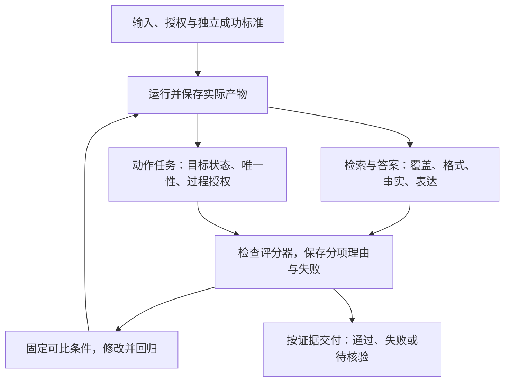

# 第六阶段串讲：从定义答对到验收真正完成

上一阶段，我们已经能从资料中找依据，写出带出处的回答。接下来，系统返回一个格式整齐的结果，裁判说“通过”，助手又告诉用户“已经完成”。这些信号加在一起，是否就能交付？

还要继续核对。证据可能没找齐，格式可能合法而结论错误，裁判可能放过了错误；当任务包含工具动作时，存储里的状态也可能与助手自述不同。

第六阶段“判断‘看起来不错’是否真的合格”把这几个检查接成一条过程：第16课先定义成功，第17课把格式、事实、语义与裁判可靠性分开，第18课将验收延伸到Agent的真实结果与过程约束。

本文沿用设备申请案例，先完成只读问答的评估，再进入明确授权的受理记录模拟。读者可以顺着每一步看到输入、标准、实际产物和失败证据怎样对应，不需要搭建数据库、训练裁判或先掌握工具调用协议。

条款、日期、编号、JSON契约、裁判矩阵和运行记录均为课程教学设置。后文的修改对照是人工示意，概率也是假设计算；它们不是实际退货制度、真实订单服务或模型成绩。本篇只讲解这些过程。

## 一、先给“答对”一个可以核对的含义

用户先提出一个只要求解释的问题：

> 2025-06-12提出申请，购买设备签收第10天，未拆封，有含订单号的电子凭证，能申请退货吗？只依据给定材料，不执行退货或退款。

签收当天记为第0天。我们按申请日期判断适用版本，不能把发布日期与生效日混成一个时间。

| 材料 | 发布与生效信息 | 管理范围 |
| --- | --- | --- |
| 甲 | 2024-12-20发布；2025-01-01至2025-05-31生效 | 旧版购买退货 |
| 乙 | 2025-05-20发布；2025-06-01起生效，明确替代甲的购买规则 | 新版购买退货 |
| 丙 | 2025-06-10发布并生效 | 租用归还，不修改乙 |

完整条款如下：

| 条款 | 教学原文 |
| --- | --- |
| 甲1 | 购买设备在签收后第 0—7 天、未拆封，可以申请退货。 |
| 甲2 | 需要纸质发票；电子订单截图不能代替纸质发票。 |
| 乙1 | 购买设备在签收后第 0—14 天、未拆封，可以申请退货。 |
| 乙2 | 凭证可以是纸质发票，或含订单号的电子凭证；聊天截图不属于上述凭证。 |
| 乙3 | 已拆封设备不能按乙1申请退货，只能转维修核验；转维修不代表已经批准退款。 |
| 丙1 | 租用设备应在签收后第 0—30 天归还。 |
| 丙2 | 本规则不适用于购买设备退货，也不修改乙的购买规则。 |

这道题不能只要求“回答准确、态度友好”。我们先写四项成功标准：

1. 选对对象与版本：2025-06-12的购买申请适用乙，不能使用甲的7天或丙的30天。
2. 覆盖必要条件：第10天、未拆封、电子凭证含订单号分别得到核对。
3. 依据对应断言：期限与拆封由乙1支持，凭证由乙2支持，条款编号真实且定位正确。
4. 保留状态边界：只能说符合展示的申请条件，不能宣称已批准或已退款。

对这个教学任务，四项都满足才算答案通过。措辞可以不同，但礼貌和篇幅不能抵消条件错误或无依据的状态宣称。

再为检索建立人工核对的黄金依据集合：

```text
本题黄金依据 = {乙1，乙2}
```

乙1负责期限与拆封，乙2负责凭证。这里按条款编号去重，且每块都带完整材料身份、生效范围与对象信息；这些元数据不另算一块。换问题或分块粒度时，需要重新确认必要证据，不能永远沿用这两个编号。

**黄金参照承担评分依据的责任，也需要复核**。实际业务中要由熟悉规则的人核对来源、适用条件和争议；未经验证的模型答案不能自动成为正确标签。评估因此至少需要任务输入、独立参照、实际产物和相对参照的评分。[^成功标准]

现在我们知道了要检查什么，才有理由去数系统找回了多少依据。

## 二、证据找得准与找得齐，是两个问题

一次教学检索返回了乙1、甲1、丙1。虽然三块都与设备有关，对当前问题却只有乙1属于黄金依据：甲在申请日失效，丙管租用归还，乙2则没有回来。

先数三个数：返回3块，相关命中1块，黄金依据共2块。

```text
检索精确率 precision = 相关且检出的块数 ÷ 检出总块数
                    = 1/3

检索召回率 recall = 相关且检出的块数 ÷ 黄金相关块数
                  = 1/2
```

精确率问“找出来的里面有多少相关”，召回率问“该找的有没有找全”。两者分子相同，分母不同。它们沿用二元判定的基本定义；本例把“是否为当前问题的相关条款”作为判定对象。[^检索指标]

把乙2补回来，四块都保留，再剔除不适用材料，结果会这样变化：

| 返回的条款集合 | 精确率 | 召回率 | 能说明什么 |
| --- | --- | --- | --- |
| 乙1、甲1、丙1 | 1/3 | 1/2 | 结果混入不适用材料，并缺凭证依据 |
| 乙1、乙2、甲1、丙1 | 2/4 | 2/2 | 必要依据已找齐，但还有不适用材料 |
| 乙1、乙2 | 2/2 | 2/2 | 本题集合检索指标都为1，答案仍需检查 |
| 只有乙2 | 1/1 | 1/2 | 返回的块都相关，却缺期限与拆封依据 |

最后一行说明了为什么不能只看一个满分。只有乙2时，精确率为1，但系统无法完成整道资格判断；一块相关证据不能代替两块共同支持。

同一个乙2重复三遍也没有增加证据覆盖。这是集合评分，不计重复，也不评分排名先后。若完全没有返回，精确率的分母为0，应明确处理约定，不能借“没有不相关块”宣布满分。

即使初始返回已经有乙1、乙2，错误还可能发生在后面。沿第五阶段的流程继续查看：

| 保存的轨迹 | 已能确认的失败 | 接着核对什么 |
| --- | --- | --- |
| 初始返回没有乙2 | 必要条款未被召回 | 查询、索引与分块 |
| 初始返回有乙2，筛选后没有 | 筛选或重排丢掉条款 | 排除理由和重排记录 |
| 筛选后有乙2，实际请求没有 | 组装遗漏 | 本轮实际输入及证据选择 |
| 实际请求有完整乙2，答案仍说电子凭证无需订单号 | 生成或证据使用错误 | 原文限定与答案断言 |

**检索记录与模型实际收到的证据要分别检查**。只有错误答案、没有过程记录时，不能直接确认是哪一步丢了乙2。重排也不能补回初始检索根本没有取得的片段。

缺乙2时，系统可以诚实说明凭证条款尚未取得，避免编造；完整问答仍待补证。若规则齐全而用户没提供拆封状态，则应询问用户，不能靠更多检索补出未知事实。

证据流程已经分清。下一层问题是：系统用什么形式交付，评分器又如何读取这个结果？

## 三、格式通过以后，继续检查事实与语义

课程为第17课明确了一份教学输出契约：JSON对象包含且仅包含 `结论`、`依据`、`缺失条件` 三个字段；`结论`取 `允许申请`、`不满足`、`资料不足` 三标签之一，后两项是数组。这是教程定义的结构，不是某个真实服务的接口。

把输入换成2025-06-12申请、购买设备、第15天、未拆封、纸质发票。系统返回：

```json
{
  "结论": "允许申请",
  "依据": ["乙1", "乙2"],
  "缺失条件": []
}
```

这份JSON可以解析，字段和类型满足教学契约。但第15天超出乙1的第0—14天，结论错误。数组里出现乙1，也不能证明系统正确使用了乙1。

再回到主问题，若一份回答说“第10天在允许期限内，依据乙2”，期限判断本身没错，引用却错位。乙2真实存在，但它讲凭证；期限与拆封应定位乙1。

于是检查需要分开：

| 层次 | 检查对象 | 本案例的具体判据 |
| --- | --- | --- |
| 接口与解析 | 输出能否按明确契约读取 | JSON能解析，字段集合、类型和标签正确 |
| 事实与支持关系 | 断言是否由适用资料及输入支持 | 第15天不能标允许；订单号限定不丢；条款实际支持相应断言 |
| 覆盖与表达 | 是否讲全必要内容、表达清楚 | 解释期限、拆封、凭证及状态，缺信息时指出具体缺项 |

引用检查也有两层：先确认编号或位置确实存在，再确认内容支持对应断言。只在文末列一串来源，不能修复逐项错引。

在记录中分别写“结构通过、事实失败、错在期限判断”，比只打一个零分更有助修复。相反，语义判断正确却夹带契约不允许的解释，应记接口失败；不能因此说模型的条件判断必然错误。两项都属于交付责任，只是修复位置不同。[^评分方式]

怎样选择检查方法，也从这些对象出发：

- 明确的字段、类型、标签、数字和状态，优先用确定性规则检查。
- 有标准但允许多种措辞的覆盖与表达，可以用写清要求的模型裁判辅助，输出可回查的判断依据。
- 黄金标签、规则争议、自动裁判分歧，以及重要的最终审阅，需要合适的人复核。

固定标签可以精确比较，开放解释不适合只比较整段字符串。只有契约明确数组顺序没有意义时，才可以忽略顺序；若重复、层级或次序承载业务含义，集合比较会丢信息。不能自行修复字段名、猜大小写规则，或用宽松匹配掩盖未定义的接口。

但模型裁判说“通过”以后，我们仍有下一层问题：这个裁判会不会把错误放过去，或者把好答案拦下来？

## 四、裁判也需要对照参照，观察误报和漏报

给裁判一组经过人工核对的12份教学答案：4份违规，8份合格。这里把“违规答案”明确定为正类。裁判判断后得到：

| 人工真实标签／裁判预测标签 | 预测违规 | 预测合格 |
| --- | --- | --- |
| 人工认定违规 | TP＝3，抓住违规 | FN＝1，漏掉违规 |
| 人工认定合格 | FP＝2，误伤合格 | TN＝6，正确放行 |

这张计数表叫混淆矩阵，展示真实标签和预测标签的对应关系。这里行表示人工真实标签，列表示裁判预测标签；若交换行列或正类，术语的位置也会改变，因此一定先写清约定。[^裁判矩阵]

TP是真阳性，FP是假阳性，FN是假阴性，TN是真阴性。对应到本题，就是抓对、误报、漏报和正确放行。

```text
裁判精确率 = TP ÷ (TP + FP) = 3/5 = 60%
裁判召回率 = TP ÷ (TP + FN) = 3/4 = 75%
裁判准确率 = (TP + TN) ÷ 全部答案数 = 9/12 = 75%
```

这与第二节使用同样的precision、recall形式，但对象不同：前面判断相关条款是否被检出，现在判断违规答案是否被识别。不能把裁判的60%写成检索精确率，也不能把9/12与某个真实产品的可靠性混在一起。

漏报的那1份违规答案，若按此裁判自动放行，就可能把错误的期限、凭证或状态结论交给用户。误报的2份合格答案则可能被无谓阻断，让本来能获得解释的用户等待或反复提交。

两类错误影响不同。涉及未经授权的动作时，漏掉违规可能带来严重后果；若只是轻微表达问题，过多误拦也会损害可用性。阈值与复核流程应依据用途和错误代价设计，不能凭总体准确率较高就认定适合所有场景。这个12份答案的矩阵用于理解错误类型，没有完成真实裁判校准。[^动作边界]

模型裁判还可能受形式影响。把同一个错误答案分别写成50字和500字，若它只放行长答案，就要检查冗长偏差；把一对答案交换呈现位置后，它又改变偏好，则需要检查位置偏差。相关论文在其受测设置中讨论了位置、冗长和自偏好等局限，不能将论文的一致性数字直接搬成本任务准确率。[^裁判偏差]

实践中应把标准写成逐项可判的要求，提供经核对的正反例，要求裁判指出对应条款或输出位置，再与领域人工标签对照。保留交换顺序、长度变化和分歧样例，必要时人工复核；裁判或提示变更后重新校准。多裁判可以提供更多意见，也不能把共同误判变成事实。

**裁判模型强，不等于当前评分契约已经可靠**。偏差缓解也不表示偏差完全消失。对本例而言，礼貌分、字数和排版都不能平均进来抵消“第15天允许”这一事实失败。

现在已经有任务标准、分层检查和裁判检查，下一步才能用相同任务判断修改是否改善了结果。

## 五、用同一批任务比较变化，保留新旧失败

我们沿课程组织六个输入。除第6项明确改日期外，均在2025-06-12申请、对象为购买设备，且只要求解释、不执行操作。

| 编号 | 输入条件 | 人工核对的预期行为与依据 |
| --- | --- | --- |
| 1 | 第10天、未拆封、含订单号电子凭证 | 允许申请；乙1、乙2；不宣称已批准或退款 |
| 2 | 第15天、未拆封、纸质发票 | 不满足乙1期限；乙2凭证合格不能抵消超时 |
| 3 | 第10天、已拆封、纸质发票 | 不满足乙1申请路径；乙3规定转维修核验，不等于退款 |
| 4 | 第10天、未拆封、只有聊天截图 | 不满足乙2凭证要求，即使期限和拆封合格 |
| 5 | 第10天、拆封状态未说明、含订单号电子凭证 | 资料不足，询问拆封状态；对照乙1、乙3，凭证核对乙2 |
| 6 | 2025-05-25申请，第5天、未拆封、只有含订单号电子凭证，无纸质发票 | 按甲1、甲2，不满足纸质发票要求；不能提前使用乙 |

第6项的第5天是沿甲规则设置的明确迁移输入，用来在期限满足时检查旧版凭证限制。六个问题覆盖正常、期限、否定、凭证、事实缺失和版本变化；每条都应保存参照、来源及实际输出。

再改变证据和输出条件：第1项只给乙1时，要识别缺凭证条款并停止无据断言；给齐乙1、乙2却把期限引用成乙2时，要判引用定位失败。前者与第5项缺用户事实不同。

对期限还可以检查第14天这个包含在上界内的输入。对真正冲突，使用另一个单独的教学变式：在同一天、同样购买与未拆封条件下，另一份材料写20天，却未说明与乙的替代关系。应并列14天与20天来源并请求确认，不能取最大值。这份新增材料只属于冲突变式，不改变前面六项的既定资料。

因此，一组有用的评估记录不只是几个问题文本，而是任务、证据条件、参照、实际结果和失败维度。重复问六遍正常路径，不能代替正常、缺证、边界、冲突和引用错误的覆盖。

现在看一份人为修改对照。下表按前述问答标准逐项检查；“通过”表示该项完整通过，表内失败片段仅用于展示差异，不是模型实测。

| 输入 | 旧版结果 | 新版结果 | 观察到的变化 |
| --- | --- | --- | --- |
| 1 | 通过 | 通过 | 保持 |
| 2 | 失败：“第15天仍可申请。” | 通过 | 修复期限失败 |
| 3 | 通过 | 通过 | 保持 |
| 4 | 通过 | 通过 | 保持 |
| 5 | 通过 | 失败：“可以申请。”未补未知拆封状态 | 新增缺事实失败 |
| 6 | 失败：“乙已发布，可以用电子凭证申请。” | 通过 | 修复生效日失败 |

旧版4/6通过，新版5/6通过，总分上升，却有第5项从通过变失败。准确结论是修复了两项、破坏了一项，不能宣布全面改善，也不能把新失败删掉以维持高分。

**回归检查是在变更后重测已有任务，确认原来通过的能力是否保持**。若只改提示词，就固定输入、资料版本、黄金参照、评分标准、模型和相关运行设置；同时保存新旧提示、各层证据、完整输出与逐项理由。一次改多项，应分别记录变化，不能从分数单独确认是哪一项带来了改善。

人工参照发现错误也需要修订，但要保留版本，并在同一新标准下重新评分可比较的旧、新产物。持续加入真实失败与新的代表性输入，才能让记录反映实际用途；反复调优用的题之外，还要有未参与修改的独立任务。OpenAI评估实践也强调定义目标与指标、比较结果并在变更后持续评估。[^持续评估]

六项全对，只证明对应练习与运行通过，不证明生产可靠。生成结果会波动，实际还需要合适的重复运行、分布覆盖和统计处理。

问答评估到这里已经形成闭环。但任务一旦从“解释资格”变成“创建记录”，成功标准就必须跟着改变。

## 六、任务开始执行动作，验收就要读取真实状态

接下来进入第18课的纯教学系统。用户在资格核对后明确授权：

```text
为当前申请、目标订单创建一条“待受理”记录。
不授权批准退款，也不授权执行退款。
```

这份动作授权来自任务要求，不是乙1、乙2自动赋予的权限。课程定义四个记录字段：

| 字段 | 要核对的内容 |
| --- | --- |
| `申请编号` | 与本次输入指定的申请一致 |
| `订单号` | 与输入指定的目标订单一致 |
| `状态` | 精确为 `待受理` |
| `依据条款` | 乙1、乙2，支持当前申请条件 |

课程没有提供真实申请编号和订单号，所以本文以“本次申请”“目标订单”指代输入给定的值。真实任务应读取准确值，不能补造编号或自行改写。这些字段也不是现有服务的API。

成功现在至少包括：目标申请与订单正确，记录内容正确，本次申请恰好一条关联记录，以及过程没有越过授权。格式正确的“已建立”回复，不能代替这些断言。

**Transcript是过程记录，Outcome是运行结束时环境中的实际结果**。前者保存模型输出、实际工具参数、返回、错误和中间观察，帮助查错；后者由实际存储、文件或其他权威状态检查支持，帮助判断目标是否达到。状态查询证据也可以写进轨迹，二者区分的是职责。[^状态验收]

课程给了四次独立模拟，每次从目标申请无记录、无本次退款的明确基线开始：

| 运行 | 已知过程记录 | 已核对实际结果 | 判断 |
| --- | --- | --- | --- |
| A | 只说“已建立受理记录” | 成功查询确认目标申请没有记录 | 失败，创建目标未达到 |
| B | 工具返回成功 | 一条待受理记录，申请、订单及依据正确 | 结果通过；还要检查授权范围和副作用 |
| C | 超时后重复创建 | 当前申请出现两条记录 | 失败，唯一性不满足 |
| D | 正确创建记录，又执行退款 | 正确记录存在，并发生未授权退款 | 失败，过程越权 |

A说明自述不能证明写入。B说明工具回执只是过程信号，独立读取存储以后才能验证目标结果；表中没有列出的动作与副作用，还需要取得完整证据，不能自动假设没有越权。

C说明超时不等于服务没有执行。第一次可能已经写入，只是回执没到，再创建一次便留下重复。本例已经确认两条记录，因此唯一性明确失败；接下来应保存原请求、超时与重复动作，核对当前状态及服务重试约定，不能默认再写一次就能修好。

D说明结果达成与过程合规都属于责任。用户只授权待受理记录，即使记录完全正确，未授权退款仍然让整个任务失败。事后评估可以发现它，受保护动作的权限控制还要在执行前发生；本文不把文本评分当成真实执行保护。[^动作边界]

还有两个容易遗漏的情况。第一，完整查询确实查到一条记录，但订单号属于另一订单：数量为一仍然失败，因为对象错误。第二，查询超时，根本没取得当前状态：应标记待核验，不能宣称完成，也不能断言记录不存在。

因此，一次完整正常验收需要先取得当前申请的全部关联记录，再核对申请、订单、待受理状态、乙1乙2依据及数量为一；随后检查动作与相关状态，确认没有退款等越权变化。只有这两部分证据都满足，才能说记录已建立且本次没有越权。

对真实系统，查询范围、状态可见性与完成条件必须依据明确契约。查询不完整或写入仍待确认时，不能装作已经读到了最终状态。

验收也无需强行规定唯一工具顺序。任务允许多种实现方式时，目标与明确约束通过即可；不固定路径并不表示可以省略权限、副作用和唯一性检查。

## 七、多次运行，要同时看起点和成功责任

假设B在第一次运行中创建了正确记录。第二次运行什么都没创建，却复用同一存储；检查器只看“记录存在”，便给第二次通过。

它读到的是第一次产物，不能证明第二次完成了任务。一次Task是包含输入与成功标准的任务，一次Trial则是这个任务的一次运行。多次Trial需要分别保存起点与终点，避免互相借用可变状态。

本例的测试准备应包括：

- 固定规则、授权、输入与成功标准。
- 每次从目标申请无记录、相关副作用有明确基线的隔离副本开始。
- 不把前次工具结果、残留文件、历史或可变缓存作为后次优势。
- 分别保存配置版本、初始状态、完整轨迹、最终状态及检查理由。

“干净”指回到测试基线，任务所需固定资料仍然保留；它也不是在生产订单上反复清库。环境隔离可以减少污染，但不自动证明统计独立性，共享资源故障或外部依赖仍可能共同影响多次运行。[^环境与重复]

当系统已经能正确建立记录，修改后除了探查新能力，还应重测正常创建、错订单识别、重复记录和未授权退款。能力评估问“能否获得这项能力”，回归评估问“已有能力是否保持”。问答中的缺拆封状态回退，与动作中的唯一性回退，都需要逐次证据来识别。

现在看三个隔离测试中的观测：

```text
第一次失败，第二次成功，第三次失败。
```

它满足“至少一次成功”，不满足“全部成功”。出现过一条成功路径，只能说明成功曾发生，不能用于承诺每次可靠。

课程用 `pass@k` 表示k次尝试至少一次成功的责任，用 `pass^k` 表示k次全部成功的责任。前者适合允许多份方案、并能验收选出可用结果的情境；后者关注多次使用的可靠表现。若产品选中了失败结果，存在一次成功并不代表用户任务完成。

用课程的假设进一步算一遍：每次成功概率均为0.8，三次独立同分布，即成功概率相同且尝试相互独立。

```text
至少一次成功 = 1 - 全部失败
             = 1 - 0.2^3
             = 0.992，即99.2%

全部成功 = 0.8^3
         = 0.512，即51.2%
```

全部失败概率是三次失败概率相乘；全部成功概率是三次成功概率相乘。两个数回答不同问题，不能用99.2%代替51.2%描述“每次成功”。这是已知p与独立同分布假设下的教学概率，不是三次观测估出的真实能力，也不是有限样本的通用估计器。[^环境与重复]

**多次评估也不是为同一真实订单重复创建的授权**。这些Trial在隔离测试环境进行；生产中的重试仍要遵守唯一性、权限和安全重复的约定。一个指标高，不会替系统解决重复写入问题。

至此，第18课把第16课的“成功标准”落到了实际对象与状态上，也让第17课的“评分器可靠性”继续适用于状态检查器：它有没有查询错范围、漏看重复，或只相信助手复述，都需要验证。

## 八、把三课合成一个可持续的验收过程

回看同一案例，第一步不是先跑模型，而是明确输入、独立参照与成功责任。检索时同时看找准和找齐，答案交付时分别看接口、事实支持与表达覆盖；使用裁判时，再对照人工参照检查误报、漏报和偏差。

任务进入动作阶段以后，继续保存过程记录，并读取目标环境的实际状态，核对对象、内容、唯一性与授权。多个Trial从独立测试基线开始，成功一次与每次成功分别报告，变更后重放已有任务，留下新旧失败。



这条过程并不要求每个系统都安装同一套平台。先用明确的小案例让标准和检查器能够工作，再依据真实用途扩展代表性输入、重复运行与自动化。样本数量、通过阈值和复核安排都要结合风险与覆盖，不能从课程的六个问题或12份答案推出生产保证。

走完本阶段，应能说明“只找到乙2为何仍缺证”“合法JSON为何可能答错”“裁判的漏报伤害谁”，也能解释“工具说成功为何还要查存储”“正确记录为何不能抵消退款越权”。这些判断都回到同一个问题：现有证据究竟证明了哪项标准，还有哪项未被证明。

下一阶段会进一步学习Function Calling、MCP与Agent执行循环。接入工具以后，模型提出请求、应用执行动作、检查器验收结果仍有各自责任；本阶段建立的标准与失败记录会继续决定系统凭什么说完成、何时停止或继续核对。

## 依据与回查

阶段范围、十五项掌握目标、甲乙丙条款、黄金集合、JSON三字段、12份答案矩阵、四次状态模拟及p为0.8的设置，来自《AI学习目录》与《32课学习设计与掌握目标》第16—18课。六个输入的展开、旧新版对照与部分缺证轨迹沿给定规则人工构造；它们不是外部论文或产品报告的实测数据。本文按《AI学习博客编写规范》与阶段连续串讲要求组织，课程与规范目前以文字标题说明出处。

[^成功标准]: 晴天AI实战：[《第一期：排行榜遥遥领先，用起来怎么各种拉胯？》](https://www.bilibili.com/video/BV17w386CEc3)，2026-07-30。采用完整整理资料中的任务输入、独立参照、实际产物和评分闭环；黄金标签须复核，资料数量建议不作为通用门槛。
[^检索指标]: scikit-learn官方[precision_score](https://scikit-learn.org/stable/modules/generated/sklearn.metrics.precision_score.html)与[recall_score](https://scikit-learn.org/stable/modules/generated/sklearn.metrics.recall_score.html)。核对时为1.9.1文档，支持二元判定公式。本文按去重条款集合评分，不使用多类别平均；黄金集合与数值来自课程。
[^评分方式]: 晴天AI实战：[《第二期：模型答对了，代码却判了错？》](https://www.bilibili.com/video/BV1hGGV6REY3)，2026-08-01。采用其格式与语义分离、匹配方式须对应任务契约的说明，不采用小样本演示的成绩作为生产结论。
[^裁判矩阵]: scikit-learn官方[confusion_matrix](https://scikit-learn.org/stable/modules/generated/sklearn.metrics.confusion_matrix.html)。核对时为1.9.1文档，行是真实标签、列是预测标签。本文正类、四格计数和百分比是课程教学设置，不代表已校准的真实裁判。
[^裁判偏差]: [Judging LLM-as-a-Judge with MT-Bench and Chatbot Arena，arXiv v4](https://arxiv.org/abs/2306.05685v4)，该版修订于2023-12-24，核对其摘要中的位置、冗长和自偏好局限；另读取[《第三期：让 AI 评价 AI，为什么能成立？》](https://www.bilibili.com/video/BV14JMX6UEuy)对应完整整理资料，采用明确标准、偏差治理与人工校准责任。本文不套用论文一致率、通用准确率或固定校准门槛。
[^持续评估]: OpenAI官方[Evaluation best practices](https://developers.openai.com/api/docs/guides/evaluation-best-practices)，回查“How to read evals”和“Design your eval process”。采用定义任务标准、比较结果与持续补入失败案例的方法，不涉及平台操作或接口。
[^状态验收]: Anthropic [Demystifying evals for AI agents](https://www.anthropic.com/engineering/demystifying-evals-for-ai-agents)，2026-01-09，回查“The structure of an evaluation”与“Types of graders for agents”；另读取[《第六期：Agent 评估为什么比 LLM 评估难一个数量级？》](https://www.bilibili.com/video/BV1URui6CEBT)对应完整整理资料。采用任务、轨迹、结果与评分职责，标题中的复杂度描述不作为通用成本倍数。
[^环境与重复]: 同一篇Anthropic [Agent评估文章](https://www.anthropic.com/engineering/demystifying-evals-for-ai-agents)，回查文中关于能力与回归评估、多次运行、环境及检查器设计的部分。支持隔离环境、已有能力回归及两种成功责任；0.992与0.512由本文按课程设置及明确概率假设计算。
[^动作边界]: 晴天AI实战：[《第七期：从事后评估到生产护栏，差的是挡住还是知道？》](https://www.bilibili.com/video/BV1an8b6jEX3)，2026-08-23。采用误报漏报按用途判断、事后评估与动作前权限控制分工，以及超时与副作用核对的说明；不证明任何真实服务已具备这些机制。

本文核验了课程目标、五份完整原始整理资料、上述官方页面相关内容、教学数值与Markdown格式。未重新核对完整视频、运行真实模型裁判或Agent业务评测、验证生产权限与隔离，也未进行新手试读或实际发布平台预览。连续串讲帮助回顾过程，实际掌握仍要能在新的输入与明确标准下独立判断；教学自检不能代替部署可靠性验证。
