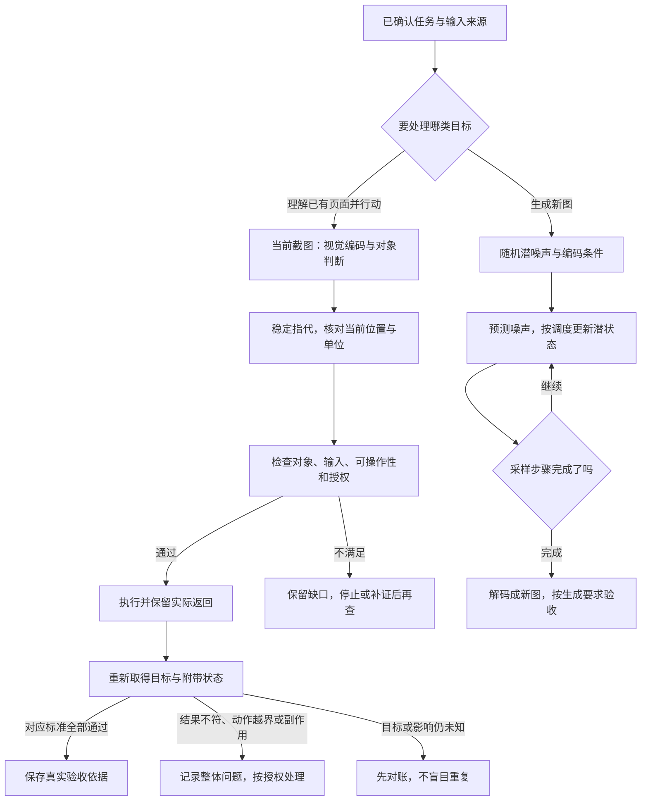

# 第十一阶段串讲：从图像表示到可验证的视觉行动

助手看见一张页面截图：上面是个人资料，下面是项目设置，两处都有“保存”。任务是把目标项目的显示名称从“项目甲”改为“项目乙”。

如果助手能描述这张截图，是否就能准确选择按钮？如果它生成了一张名称已经变成“项目乙”的界面图，是否说明真实项目已保存？如果出现“保存成功”，但重新读取仍是“项目甲”，又应怎样判断？

第十一阶段“从文字扩展到图像”连接第29、30课。第29课先分清已有图片的编码与新图生成，第30课将感知接到稳定指代、受控操作与实际验收。本文沿这张教学页面展开，遇到图像生成时另看它的输入输出，再回到同一任务的真实结果。

最低前置知识是：知道图片可以表示为数字，知道动作与完成需要分别核对。本篇会解释图块、潜表示、坐标和服务端的必要概念，不要求训练视觉模型或搭建浏览器项目。

猫图、页面、名称、昵称、形状、潜数和坐标都是 **课程的人工教学设置**，不是实际账户、模型成绩或运行日志。本篇没有生成真实图片，也没有操作真实网站。

## 一、这张图描述的是哪个对象，任务允许改变什么

课程页面有两组控件：

```text
个人资料区域：昵称为用户甲，对应个人资料保存。
项目设置区域：显示名称为项目甲，对应项目设置保存。
```

本例已经确认目标项目，明确教学授权是：只将该项目的显示名称改为项目乙，不修改个人资料和其他内容。真实场景若有多个项目，应从请求与当前系统取得准确身份，不能凭相似标题猜项目编号。

这项任务首先需要理解已有画面，而不是绘制一张新界面。截图能提供区域、文字与位置的观察；图形用户界面简称GUI，用户在其中输入和点击，但这些动作还要通过实际系统保存。

前端是眼前界面及其本地状态，后端是处理请求与存储数据的系统。输入框变成项目乙，暂时只说明前端变了。

目标、初始值与边界都要保住：正确项目名称应变成乙，个人资料昵称应仍为用户甲。后面每一项视觉或操作证据，都围绕这两个对象核对。

## 二、已有像素怎样成为模型能处理的表示

先暂时离开实际页面尺寸，用课程的224×224彩色猫图看清编码入口。它只说明切块与表示，不能把这些数字当成1000×800页面截图未经处理时的真实模型输入。

RGB表示红、绿、蓝三个颜色通道。一张224×224图有50,176个像素，按每像素三个通道数计，共150,528个数。

ViT，Vision Transformer，视觉Transformer，将已有图片切成Patch，即图块，投影为数字向量序列，再结合全图信息更新表示。[^视觉编码]

课程设置不重叠的16×16块：每边224÷16=14块，总共14×14=196块。一个图块展开为16×16×3=768个数，再经可学习投影变成64个数。

可学习投影用训练所得参数组合输入，得到固定长度的表示。下面用 `[行数,每行数字数]`表示序列形状；64只是教学维度：

| 步骤 | 本例数据 | 发生什么变化 |
| --- | --- | --- |
| 已有图像 | `[224,224,3]` | 像素与颜色通道提供输入 |
| 切块并展平 | `[196,768]` | 每行组织一个局部图块的数字 |
| 投影 | `[196,64]` | 每块得到64维图块表示 |
| 按原ViT分类路径加分类词元 | `[197,64]` | 多一个可学习位置，用于汇总分类信息 |
| 加位置表示、进入编码器 | 本例仍为`[197,64]` | 各块表示结合位置信息和全图关系更新 |

Token是序列中用于模型处理的单元。分类词元Class Token不是从图像多切的一块；图块嵌入也不是“猫”这个词的文本词表编号。具体多模态视觉编码器是否保留分类位置，要看实际结构，不能统一写成197行。

位置表示帮助模型学习图块的空间关系。Transformer编码器通过注意力汇合不同图块的信息，让局部像素获得全图上下文。处理已有图片时可以结合已知全图，不必照搬文本逐项生成的因果限制。

### 网格边界没有先识别出物体

猫耳、脸部与轮廓会被网格穿过，同一只猫的一部分落入多个图块。一个边缘块也可能同时含猫和背景。

因此，含猫的五块不是五只猫，图块行数也不是物体数量。足够小、恰好位于单块内的对象可以只占一块，但这同样不能证明已经识别正确。

回到页面，按钮轮廓和文字也可能跨块，某块同时包含按钮与背景。**图块是输入组织单位，对象身份需要结合图像信息判断**。

视觉编码器输出供后续任务使用，多模态语言系统还要有对应接口把视觉表示接入。本文没有给具体接口配置，不能据这一概念链补造字段或选择器。

输出一句“这是项目设置”，不自动证明目标按钮坐标正确；输出类别“猫”，也不证明猫的数量或位置正确。理解、定位和任务结果需要各自证据。

## 三、生成新图的起点与这张已有截图不同

如果另一个任务要求“画一只猫坐在窗边”，起点是生成条件和随机状态，要得到一张新图。它不是把上一节ViT的图块序列倒放回去，也不是已有图理解能力的必然附带结果。

本课选用潜空间扩散解释生成。Latent是潜表示：模型学习到的中间数字，适合后续图像处理。它可以按空间排列，却不是缩小后原样保留的RGB像素，也不是可以直接读成“猫耳朵”的文字标签。[^潜空间]

来源讨论的Stable Diffusion结构中，VAE，变分自编码器，用编码器将图片转成潜表示，用解码器将潜表示转成像素图。这个转换有损；VAE图像编码器也不是ViT分类编码器的反向操作。

来源用UNet作为噪声预测网络，用CLIP的文字编码侧把提示词变成条件表示。文字条件可通过交叉注意力影响预测，即让生成状态利用条件的信息。这些名称对应所讨论的结构，不是所有Stable Diffusion后续版本或所有生成模型的统一配置。

| 流程 | 起点 | 主要中间对象 | 本阶段要分清的输出 |
| --- | --- | --- | --- |
| ViT编码已有图 | 当前图片像素 | 图块及上下文化视觉表示 | 供理解、分类或其他任务使用的表示 |
| 潜空间文生图 | 随机潜噪声与编码后的文字条件 | 不断更新的潜状态 | 经解码得到的新像素图 |
| 实际页面保存 | 当前目标、输入与授权 | 请求、响应及系统状态 | 正确对象的实际存储变化 |

三条流程可以出现在同一个应用中，但不互相替代。生成一张“项目乙”的示意界面图，改变的是图片内容，没有因此写入真实项目。

## 四、噪声预测、状态更新与显示变清楚各是什么

### 训练利用已有图，采样依赖预测继续

本课采用噪声预测参数化。训练时，已有图片经编码成为干净潜表示，再采样噪声和噪声等级，构造带噪输入。预测网络接收带噪状态、等级与条件，预测本次加入的噪声；训练比较预测与已知噪声，并更新参数。[^潜空间]

说网络这次没有直接收到干净原图，不表示训练从来没有使用图片。原图与采样噪声帮助构造训练材料与目标。

文生图采样时则没有一张预先给定的最终猫图供网络读取：

```text
随机潜噪声与文字条件
→ 当前等级下预测噪声
→ 调度器按规则更新潜状态
→ 新状态继续进入下一轮
→ 完成所选采样步骤后，解码成像素图。
```

调度器规定步骤与系数，并根据相应预测目标推进状态。一次噪声预测不是最终图，也不能用“把预测全部减掉”替代所有采样公式。

这条生成机制不是从图库挑出一块块现成图像拼贴。它利用训练得到的参数与条件更新潜状态；关于某个输出是否复现训练图，仍需额外核对，不能只由机制解释作绝对保证。

### 一个潜数可以在去噪时变大

下面是课程为解释这一点给定的单数示例，不要求首遍推导调度器。累计保留系数为0.64时，信号与噪声系数是0.8、0.6；取干净潜数2，采样噪声1：

```text
带噪潜数 = 0.8×2 + 0.6×1 = 2.2。
```

网络如果预测噪声0.8，干净潜值估计为：

```text
估计 = (2.2−0.6×0.8)/0.8 = 2.15。
```

在明确限定的确定性DDIM采样步中，下一累计保留系数0.81，随机项为零且不裁剪，更新为：

```text
下一潜数 = 0.9×2.15 + √0.19×0.8 ≈ 2.2837。
```

√表示平方根；DDIM是一种扩散采样方法。2是已知教学干净值，2.2是构造输入，2.15是预测得到的估计，2.2837是另一等级下的状态，四项职责不同。[^采样]

下一潜数比2.2大，并不凭此证明去噪失败。**潜数大小不是噪声多少或图像质量的通用刻度**。其他预测目标和调度器需要各自公式，一项预测正确也不能证明整幅图符合对象、数量与布局要求。

### 为什么滑块动画仍然只是示意

课程的192×192演示先画好一张干净画面，再固定一份噪声。滑块改变混合比例，重新显示画面；当前课程代码也能看到这两份预存数据。

它没有根据网络预测推进潜状态，也没有训练参数。清晰终点就是已知画面的重新显示，不能称为模型从随机噪声生成了目标图或真实采样轨迹。

训练加噪也利用已知数据，但完整训练还要有预测、损失比较和更新。只有混合外观，不证明执行了训练；画面逐渐变清楚，也不证明真实生成成功。

这种区分接回开篇的页面任务：屏幕显示了什么、图像如何产生、系统实际改变了什么，都需要保留来源，不能仅因“看起来对”就合并成完成证据。

## 五、从视觉表示回到同一个保存目标

有了页面观察，下一步要稳定引用对象，而不是只说“把它改成乙，再点下面那个”。

可以描述为：

```text
当前已确认目标项目的项目设置区域。
显示名称字段：项目甲→项目乙。
操作对应同一区域的保存按钮。
个人资料昵称用户甲保持不变。
```

这个描述用项目身份、区域、字段和按钮职责锁定目标。页面滚动、弹窗或顺序变化后，身份不应跟着“下面”漂移，当前位置却需要重新核对。

点和边界框可以辅助定位：点给位置，框圈区域。视觉原语资料讨论“看见对象，却在后续语言推理中失去稳定指代”的缺口；它帮助绑定引用，不能替代感知和结果验收。[^稳定指代]

框住个人资料的保存，坐标再准确也仍然是错对象。把一个数组写在合法范围里，也不说明它属于正确项目。

如果小字已经在缩放或编码中丢失，需要取得能支持判断的新证据。不能靠输出更精细的小数，把看不清的区域标题补成事实。

ThinkMorph研究展示文字与视觉中间步骤交错：先组织判断，再生成或操作图像中间内容，继续读取并推理。它提供视觉辅助的机制入口，但生成的裁剪、放大或标注图仍须核对与原观察的关系。[^交错]

图像中间步骤有用，不表示它是实际浏览器状态；让模型画一张成功页面，也不能替代真实提交和查询。

## 六、同一对象的坐标，要说明参考面与单位

目标可能同时有原截图坐标、归一化坐标、缩放后的显示位置、浏览器逻辑坐标和屏幕设备像素坐标。描述同一个对象，不代表这些数值可以互换。

课程另用1000×800教学截图，左上角为原点，横向x向右、纵向y向下。框 `[700,600,900,680]`依次表示左、上、右、下边界。这不是前面224图的ViT切块配置。

按本课连续边界约定，横除宽、纵除高，几组已给结果可这样读：

| 表示 | 结果 | 使用前提 |
| --- | --- | --- |
| 原图中心 | `[800,640]` | 1000×800原截图，图片左上角原点 |
| 归一化框 | `[0.7,0.75,0.9,0.85]` | 横坐标除1000、纵坐标除800 |
| 缩放显示中心 | `[500,370]` | 同图整体显示500×400，偏移`[100,50]`，尺寸与偏移采用同一单位 |

这里归一化是相对比例表示，不是所有模型的通用坐标范围。中心显示位置按 `100+800×0.5`与 `50+640×0.5`计算；理解这组条件即可，坐标手算不是基础掌握的门槛。

CSS像素是浏览器布局的逻辑单位，设备像素是显示设备的像素单位。视口是浏览器当前可见内容区域，不是整个桌面。Playwright鼠标接口使用主框架视口CSS坐标，截图还可以按CSS或设备像素输出。[^坐标]

因此，课程显示中心不自动成为鼠标接口输入。裁剪改变图片参考范围，滚动与布局改变当前位置，显示缩放还影响单位映射。需要读取当前截图与工具约定，不猜一个固定倍数。

有可靠的文字、标签和区域关系时，可据当前界面语义定位。具体定位规则、字段与程序接口仍须从真实实现取得；本篇不构造通用网站选择器。

## 七、执行前让四类检查分别成立

现在按本例教学授权准备保存。需要同时确认：

| 检查 | 本例的证据 | 一个阻止继续的情况 |
| --- | --- | --- |
| 正确对象 | 当前目标项目、项目设置、对应字段与按钮 | 定位到个人资料或另一项目 |
| 正确输入 | 显示名称字段实际已是项目乙 | 值仍为甲或表单未通过校验 |
| 可操作性 | 控件可见、适当稳定、能接收动作且已启用 | 被遮罩覆盖、禁用或状态变化 |
| 当前授权 | 允许此项目此字段的修改 | 授权撤销，或尝试扩大到昵称 |

账号技术上能修改个人资料，不表示本任务允许修改。按钮可以点击，也不能覆盖授权撤销或输入未准备好。

浏览器自动等待会检查部分动作条件。Playwright通常的定位点击检查元素唯一、可见、稳定、能接收事件、已启用，填值等动作又有自己的要求。[^动作]

这些检查没有证明业务对象正确，也没有确认当前授权，更没有提前证明保存成功。强制绕过部分动作检查，同样没有解决对象、遮挡或合法性问题。

动作前的证据还要足够当前。旧截图里的按钮可点，弹窗出现以后可能已被覆盖；过去字段显示乙，重新加载后可能已经变回甲。

## 八、操作返回以后，重新读取实际结果

按正确对象执行一次已授权提交，保留实际动作、返回与界面信息。证据仍要分层：

| 证据 | 直接支持什么 | 单独还不能证明什么 |
| --- | --- | --- |
| 点击或工具回执 | 相应动作调用已经执行或返回 | 正确业务目标已持久保存 |
| 输入框显示项目乙 | 当前界面值为乙 | 服务端已写入 |
| 保存成功提示 | 页面呈现了成功提示 | 它与当前对象及实际存储一致 |
| 正确项目的权威当前读取 | 此次可信数据源返回的实际状态 | 全部动作合法且没有其他影响 |

权威当前读取，需要对应正确项目、反映当前实际存储。实际网站怎样取得，应读现有接口和返回；不能凭按钮文字猜请求路径。普通刷新也未必排除所有缓存，需要确认读取来源。

课程失败时间线是：输入框改成乙，点击项目保存，提示成功，可靠重读却仍是甲。目标没有达成，**结果验收失败**。界面提示不能覆盖实际结果，更不能记录为完成。

接着核对提交对象、参数、校验、响应与读取来源，定位最早偏差；不能立即断言一定是服务端坏了或按钮没点中。

另一个独立情形是提交超时、当前查询也没有结果。这时保存是否发生仍未知，不等于已知没有保存。先保留目标、输入、动作、返回和未知项，按实际机制对账。

重试要看当前授权和安全重复条件。不能为所有GUI保存猜一套幂等规则，或认为恢复旧截图就撤销了已经发生的远端动作。没有可靠继续依据时，停止自动重复并保留现场。

## 九、项目名正确，还要验收个人资料和过程

换一条教学轨迹：权威当前读取显示项目乙，但过程中误点过个人资料保存。目标这一项通过，不说明整项任务通过。

需要分开判定：

| 当前证据 | 目标结果 | 过程与附带状态 | 整体处理 |
| --- | --- | --- | --- |
| 项目仍甲，可信读取已确认 | 不通过 | 继续核对影响 | 记录失败及依据 |
| 项目乙，昵称被意外改动 | 通过 | 越界且副作用已发生 | 记录整体问题，按授权处理 |
| 项目乙，误点已知但昵称未查 | 通过 | 错误动作已知，影响仍未知 | 不能宣称整体无问题，继续对账 |
| 项目乙，错误动作已知但昵称仍用户甲 | 通过 | 未查到该项误改，错误动作仍成立 | 保留过程问题，不能用目标正确抵消 |
| 对象、目标、授权与相关状态均有充分通过证据 | 通过 | 对应标准通过 | 保存验收依据后报告完成 |

未查个人资料时，不能补写肯定误改，也不能补写没有副作用。发现实际误改，整体有问题；修正也会改变状态，需要按真实权限和授权安排，不能随意恢复、删除，再说已经回滚。

这把第29课的图像证据与第30课的系统证据接在了一起。编码和生成的输出可以辅助判断，真正的完成要落到对应对象、动作过程和附带状态上。

## 十、让图片来源与行动证据一起留在记录中

同样是图像，来源不同，能支撑的结论也不同：

| 图像或状态 | 它从哪里来 | 怎样使用 |
| --- | --- | --- |
| 当前页面截图 | 对实际界面的观察 | 辨认当前区域、文字与位置，保留时点 |
| 图块表示 | 已有图像的模型编码 | 供视觉任务与后续判断使用 |
| 框、裁剪或视觉中间图 | 基于观察或模型生成的辅助步骤 | 核对对象与原图关联，避免指代漂移 |
| 扩散生成的新图 | 潜状态预测、更新后解码 | 验收生成要求，不当作真实账户变化 |
| 已知图与噪声混合画面 | 教学程序预存数据的显示 | 建立直觉，不当成模型采样轨迹 |
| 权威当前存储记录 | 正确对象的可信当前读取 | 支持实际保存判定，再补过程与副作用检查 |

“图更清楚”不自动等于“对象指代正确”，“对象框得准确”不自动等于“动作已获授权”，“按钮按下”也不自动等于“后端保存”。每个结论都要接到支持它的证据上。

可以把已有图行动与新图生成放在同一张职责图中：



图是职责整理，不是所有模型或网站的固定实现。新图完成自己的生成验收，也没有因此进入真实项目保存的通过分支。

## 十一、两课怎样沿同一任务接力

第29课从已有像素组织图块与向量，让图像成为模型可处理的表示。块不是对象，分类不是定位；另一路潜空间生成从随机状态出发，通过预测与调度更新再解码，既不是ViT倒放，也不是已知图混合示意。

第30课接着保住当前对象身份和位置，核对动作前条件，执行后重新取得实际结果。点击、提示、界面和当前存储各有证据范围，目标与附带状态都要验收。

回到两处保存按钮，读者已经能解释三个层级：像素如何进入判断，判断如何锁定正确动作，以及动作怎样通过真实状态核验。若只是生成了成功画面、看见了成功提示，闭环还没有因此完成。

下一阶段从第31课“综合练习：做一个可信知识库助手”开始，把资料、回答、调用、授权、恢复和验收交成完整产物。这里的习惯可以直接带过去：记录输入来源，保留条件与未知，分别检查结果和过程，避免用流畅呈现替代真实完成。

## 依据与回查

课号、10项必达目标、猫图与224／16／64设置、分类路径197、192混合示意、潜数与确定性更新、两个保存区域、项目甲乙、用户甲和坐标条件，来自《AI学习目录》及《32课学习设计与掌握目标》。本文串联与授权卡沿这些明确教学边界展开，不是实际网页或模型记录。

已读取两课现稿、ViT与Stable Diffusion完整整理原文、相关摘要与《多模态推理闭环：感知、指代、操作与验证》。前次已完整读取的视觉原语和ThinkMorph原文，本次确认内容未变后沿用读取记录。课程及相关文档无公开网址，以文字标题说明出处。

[^视觉编码]: [An Image is Worth 16x16 Words: Transformers for Image Recognition at Scale](https://arxiv.org/html/2010.11929)，核对第3.1节图块展平、投影、位置与分类词元；另完整读取[ViT原始讲解](https://www.bilibili.com/video/BV1TFG56XERd)。教学维度来自课程，不复现分类成绩，不把原始分类路径当作所有多模态接口。
[^潜空间]: [High-Resolution Image Synthesis with Latent Diffusion Models](https://arxiv.org/html/2112.10752)，核对第3.1—3.3节图像编码解码、噪声预测与条件机制；具体三组件分工另对照[Stable Diffusion原始讲解](https://www.bilibili.com/video/BV12xeK6EEYb)完整原文，不把所有LDM选择与所有后续版本合为一套配置。
[^采样]: [Denoising Diffusion Implicit Models](https://arxiv.org/html/2010.02502)，第4.1节公式12及随机项为零说明。潜数、累计系数和不裁剪条件由课程给定，计算不是实际采样日志，也不证明整图质量。
[^稳定指代]: [视觉原语上篇](https://www.bilibili.com/video/BV15j5u6WE5C)与[下篇](https://www.bilibili.com/video/BV1YXLp6FE8V)对应完整整理原文。采用感知与指代、点框、细节缺失的分工；技术报告依据是第三方存档，本次不重新核对存档全文或当前官方发布，不采用成绩和压缩比作本例保证。
[^交错]: [ThinkMorph: Emergent Properties in Multimodal Interleaved Chain-of-Thought Reasoning](https://arxiv.org/html/2510.27492)，采用本系列第30课已核对的摘要与第2节机制；另读取[ThinkMorph讲解](https://www.bilibili.com/video/BV1SFCqBFEfC)完整原文。图文中间步骤与真实网页动作分开，不采用有归属冲突的指标或跨模型排名。
[^坐标]: Playwright官方[Mouse](https://playwright.dev/docs/api/class-mouse)与[Page截图接口](https://playwright.dev/docs/api/class-page#page-screenshot)，采用本系列第30课已核对的视口CSS原点及截图css／device尺度说明；链接从当时官方页面实际导航取得，不猜真实桌面倍率或页面选择器。
[^动作]: Playwright官方[Auto-waiting](https://playwright.dev/docs/actionability)，本次核对通常定位点击、填值及强制动作的检查职责。动作可执行性不代替业务授权、服务端保存与完整验收。

本次核对10项目标覆盖、图块与潜数算术、课程混合演示实际代码、坐标条件、已知失败／未知／副作用分支、公开引用、加粗标点、脚注围栏、保存一致性及本地Markdown渲染。

未重看完整视频、重新核对视觉原语存档全文、运行真实视觉或扩散模型、操作真实账户、测试实际提交与恢复，也未开展新手试读或实际发布平台预览。教学推演与本地渲染不能替代真实感知、生成、动作结果及学习效果验证。
