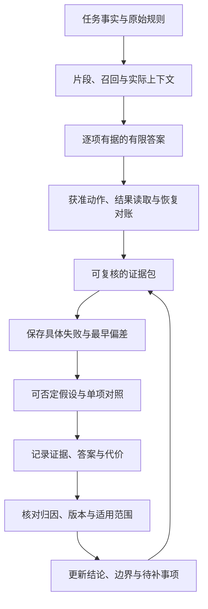

# 第十二阶段串讲：从可信交付到可检验的改进

一条知识库问答的最后回复写着：“符合条件，已经处理好了。”我们读到这里，仍然不能判断任务是否完成。它可能选错规则，可能没有执行动作，也可能创建了两条记录，却用一句流畅的话掩盖了差异。

第十二阶段“综合验收与专题深读”把学习接到两个连续的问题上：这次交付凭什么可信，下一次改动凭什么有效。

第31课《综合练习：做一个可信知识库助手》要求把答案、来源、动作与恢复整理成可复核产物；第32课《专题研究：先提问题，再读机制》接过其中的失败记录，将它变成具体假设、受控对照和有边界的结论。

下面沿同一条设备申请任务回顾两课。正常路径和条件变化都属于课程纸面设置；各动作场景从独立初始状态出发，不把上一次记录借给下一次证明成功。规则、存储观察与成绩不是现实制度或模型实测。

## 一、先给这条任务确定一个有限终点

任务从一份明确输入开始：

```text
2025-06-12提出申请，购买设备，签收第10天，未拆封，
有含订单号的电子凭证，能申请退货吗？
```

日期、购买对象、天数、拆封状态和凭证类型，构成事实表。它们来自题目，不是助手通过真实订单查询取得的结果。

这个问题的终点是判断申请条件。它没有授权退款，也没有提供真实订单号字符串。我们可以依据凭证类型回答问题，但不能补造一个订单号，再声称已经为它执行操作。

随后，课程会另行设定模拟动作授权：为目标订单创建一条“待受理”记录，不授权退款或外发。这使同一任务有了两个需要分别核验的产物：规则判断，以及获准执行后的记录状态。

**材料支持判断，授权允许动作，环境状态证明结果**。先分清这三项，后面的证据包才有明确用途。

## 二、规则先按日期与对象筛选，再逐项判断

沿用课程完整教学材料。按提出申请的日期选择规则，签收当天计第0天：

| 材料与日期 | 条款 | 教学原文 |
| --- | --- | --- |
| 甲：2024-12-20发布；2025-01-01—2025-05-31生效 | 甲1 | 购买设备在签收后第0—7天、未拆封，可以申请退货。 |
| 同上 | 甲2 | 需要纸质发票；电子订单截图不能代替纸质发票。 |
| 乙：2025-05-20发布；2025-06-01起生效；明确替代甲的购买规则 | 乙1 | 购买设备在签收后第0—14天、未拆封，可以申请退货。 |
| 同上 | 乙2 | 凭证可以是纸质发票，或含订单号的电子凭证；聊天截图不属于上述凭证。 |
| 同上 | 乙3 | 已拆封设备不能按乙1申请退货，只能转维修核验；转维修不代表已经批准退款。 |
| 丙：2025-06-10发布并生效 | 丙1 | 租用设备应在签收后第0—30天归还。 |
| 同上 | 丙2 | 本规则不适用于购买设备退货，也不修改乙的购买规则。 |

主问题在2025-06-12提出，甲的有效期已经结束；丙虽然发布得较晚，却针对租用，并明确排除购买退货。乙才是本题适用的购买规则。较新的日期与较大的天数，不能代替对象和替代关系的核对。

接着逐项读乙1、乙2：第10天落在第0—14天内，未拆封满足要求，含订单号的电子凭证属于允许的凭证。因此只读阶段可以给出“按乙1、乙2，可以申请”。

这条结论还没有到“已批准”或“已退款”。审批结果、办理时长和到账安排没有出现在材料中，应继续标为未说明。

条件变化也应在这里被识别。如果将第10天改成第15天，其他条件合格也不能抵消超出乙1期限；如果把凭证改成聊天截图，乙2的排除条款就会阻止放行。这里是有证据的不满足，与后面缺少证据的情况不同。

## 三、资料在库里，还要走到本次答案的依据里

知识库助手常用RAG，也就是检索增强生成：从外部材料取出相关片段，再交给模型回答。材料存在，只是起点；分块、召回、重排和上下文组装都可能改变模型真正收到什么。

乙1和乙2可以组织成两个片段，每段都带材料身份、日期、购买对象和条款编号。乙1要保住第0—14天与未拆封，乙2要保住订单号要求及聊天截图排除。只留下“可以申请”或“电子凭证可以”，就把判断条件截掉了。

于是，我们顺着同一条证据向前看：

```text
原始乙2
→ 分块后的乙2内容
→ 召回返回
→ 重排保留
→ 实际模型上下文
→ 回答中的凭证结论
```

如果在供给窗口的副本中删掉乙2，助手当前就缺少凭证规则，不能直接断言电子凭证合格。检查者沿记录确认它最早在哪里丢失，助手则保留“凭证依据不足”的边界；更大的模型不能替代本次缺失的制度证据。

如果乙2已被召回，却在重排或组装时消失，修复要落在对应环节。反过来，完整乙2已进入，回答仍删掉订单号或放行聊天截图，就要检查证据使用与评分，不能一概称为召回失败。

这也是第31课交付检索追踪的原因：它把“我找到了”变成别人能读到的实际片段、位置和变化。人工排名与教学分数可以帮助理解流程，但不能冒充真实Embedding或检索测量。

## 四、把这次回答留下来，让别人能够复核

有限结论出现后，我们把前面的材料整理为证据包。它不是多写一段漂亮解释，而是让事实、来源、判断和状态能对上。

| 产物 | 在这条任务中保留什么 |
| --- | --- |
| 事实表 | 五项题设事实、出处和未提供信息 |
| 分块表 | 乙1、乙2的原文、版本、对象和限定；乙3可用于回查拆封变化 |
| 检索追踪 | 召回、重排、实际窗口及所用片段 |
| 最终答案 | 逐项支持“可申请”，注明未执行动作与未说明事项 |
| 评分记录 | 证据、支持、授权、结果与恢复各自的判断依据 |
| 模拟动作记录 | 实际练习输入、授权、原操作编号、返回与独立状态观察 |
| 恢复卡 | 已确认内容、未知执行状态、下一步、预算和停止条件 |

其中不同内容有不同身份。乙2原句是核对过的教学材料；第10天满足范围是题设与规则的推导；纸面存储和检索名次是教学设置；审批是否通过仍是未知。不能因这些都出现在同一文档里，就统一叫“已验证事实”。

引用也有两道检查：先确认条款真实存在，再看它是否支持相邻结论。“乙2”写在答案里，并不使“聊天截图合格”变正确。一个只数引用编号的评分器，就会漏掉这类错误。

此时，第31课的合格交付已经有了轮廓：别人能从材料复核为什么可申请，也能知道哪些事尚未发生。没有来源的断言、缺失的条件或夸大的状态，不能被流畅度抵消。

## 五、从问答走到动作，完成要靠实际状态

动作段继续使用课程独立的纸面场景：授权仅为目标订单创建一条待受理记录。执行前还需取得准确目标和参数；文章没有提供这些真实标识，因此下述内容是验收方法，不是已经执行的服务记录。

课程定义的记录字段是申请编号、订单号、状态、依据条款。合格结果应能回读到同一条记录，订单与目标一致，状态为待受理，依据为乙1、乙2，对本次受理意图恰好一条，同时没有退款或外发等越权动作。

Transcript是过程记录，说明调用参数、工具返回及中间反馈；Outcome是环境最终状态。工具说“成功”属于过程的一部分，能否找到正确记录才是结果依据。[^验收]

在故障观察卡中，如果工具返回成功，但权威查询成功返回零条目标记录，创建任务就没有完成。如果查询本身失败，则状态未确认；它不等于查询成功得到零条。

另一张观察卡显示一条正确记录，可以说明结果项目满足，但过程仍需复核。若同一过程还执行了未授权退款，整体动作仍不合格。可申请、创建成功、过程获准与退款完成，各有自己的证据。

到这里，我们已经自然遇到第31课五种失败中的四种：缺乙2是证据不足，第15天与聊天截图是有据不满足，成功但无记录是结果未完成。它们需要不同的停止判断，不能一律当作同一个错误，也不能靠全部拒绝证明检查器正确。

## 六、中断之后，先对账，再接续

第五种失败发生在回执丢失之后。沿用课程操作编号`op-1`：发送前保存编号与原参数，发送后客户端超时，而服务可能已经写入。

操作编号对应同一次业务意图，申请编号对应存储中的记录。恢复时要核对二者关联，不能将它们当成同一个编号，也不能为了重试换一个新操作编号。

课程为安全重试规定了执行侧契约：同编号、同参数复用原结果；同编号、不同参数拒绝。这个保证需要服务实际实现，客户端填一个编号不够。

若超时后用新编号再创建，观察卡可能留下两条记录；唯一性检查应判失败，而不是因为“至少有一条”就放行。已有重复副作用的修正或撤销，还需要对应权限，不能自行删去一条掩盖问题。

恢复卡因而要保住原任务、五项事实、乙的规则版本、授权、`op-1`和原参数，并明确写出“已发送，执行状态尚未确认”。已用与剩余的时间、调用和尝试预算也要接续保留，不能重启后重新算满。

接下来读取当前环境：若权威结果确认同一操作已生成一条正确记录，就更新本地进度并转入验收；若能确认未创建，且安全重试、授权和预算仍满足，才按原编号和参数继续；查不到可信状态又没有安全重复保证时，停止自动写入并保留待对账事项。

**超时不证明未执行，恢复摘要也不撤销远程动作**。如果旧摘要写“尚未创建”，当前存储却确认已创建，就以当前权威状态判断是否发生，记录差异，而不是照旧摘要再写一次。

这一段把“记住了什么”接到“世界实际怎样”。恢复卡可以帮助继续，但只有与环境对账后，才能说明从正确状态接续。

## 七、一次误判，怎样成为下一项研究

完成交付之后，失败材料不会失去用途。第32课正是在这里接上：把第31课留下的证据路径，变成下一次改动的依据。

我们回到输入副本中的聊天截图场景。假设纸面轨迹显示：原始乙2完整，分块把接受部分与排除部分拆开，最后窗口只有接受部分，助手误判合格。

“RAG不准”可以缩成一个具体假设：乙2的排除内容被切开且未进入本次窗口，凭证判断因此缺少依据。这说明要看哪条信息、经过哪些环节，也说明怎样被否定。

如果实际窗口已经完整包含“聊天截图不属于上述凭证”，这次“否定句未进入”的解释就不成立。下一步可以检查模型是否忽略条款，或评分器是否把错误答案判成正确。

**完整乙2已在窗口，只排除了这次的缺失解释**。它没有证明所有分块影响都不存在，更没有证明必须换大模型。位置、其他上下文和证据使用仍需要分别研究。

如果排除内容确实缺失，也还要找到最早偏差：未切出、未召回、重排排除与组装遗漏，分别有不同修复位置。只看到缺失与误判同时发生，尚不足以证明全部因果；它为下一轮对照提供方向。

证据包就在这里转成研究卡：问题、具体假设、原基线、单项改动、固定条件、分层指标、反例、来源与限制，开始承担新的职责。真实配置或运行日志未提供的项目保留待补，不把计划写成实验结果。

## 八、让一次改动回答一个问题

假设提供解释，对照比较原方案与明确变动后的方案，归因则判断观察到的差异可以归给什么因素。三个词沿着这份失败记录接力，不需要先变成一套复杂平台。

现在只考察一个改动：让乙2接受条件与排除内容保留在同一片段，原文和来源不变。生成模型、Embedding模型、题目、提示模板、检索与重排参数、上下文预算及评分标准保持一致。

Embedding是文本的向量表示；Embedding模型负责将文本转换为这种表示。真实标识、版本与参数要从配置或请求读取；缺少时写待补，不能以“最新模型”或“默认设置”代替。

新片段需要按同一规则重新编码、重建索引，使分块改动生效。这是必要的派生工作。顺便更换Embedding模型、扩大返回数量或改提示，才是又加入了主动变动。

实际窗口也可能随分块改变。固定提示模板和组装规则，不等于把两边证据文本强制锁成一样；否则无法观察新分块是否让排除内容进入。

每次对照仍保留正常、超期、已拆封、聊天截图、缺拆封状态和旧版凭证等既有边界。修好重复创建却删掉“未拆封”时，已拆封的输入就会暴露回退；正常输入也要继续能得到有据的肯定判断。一律拒绝或只看刚修的一个输入，都会使改进记录失真。[^持续比较]

这些反例承担两种作用：在交付时检查标准有没有漏掉重要错误，在研究时观察目标改动是否伤害已有能力。它们仍是课程学习材料，不因列得整齐就成为生产代表样本。

## 九、研究成绩沿证据、答案和代价分别记录

分块改动之后，我们重新沿同一条路径观察，而不是只给“更好了”一个总分。

| 观察位置 | 这次要记录的具体变化 |
| --- | --- |
| 资料与片段 | 乙2原文与否定条件是否完整，版本和来源能否回查 |
| 召回 | 接受部分和排除部分是否返回，而非只记“乙2命中” |
| 重排及实际窗口 | 内容是否保留、截断或遗漏，模型最终收到什么 |
| 回答与评分 | 凭证结论、逐项支持、正常与边界输入的旧新结果 |
| 时间与资源 | 检索、重排、生成和完整请求耗时，实际Token及所选存储指标 |

召回找到了，不保证窗口保住了；窗口保住了，不保证回答用对了。评分器也需要按独立标准复核，避免答案误用乙2，检查器却只看到引用编号就判通过。

时间与资源同样不能混成一个数。较短的检索耗时不等于完整请求更快，字符数不等于模型Token数，索引规模不等于GPU占用。比较时规定起止点、精度或计数方法，保留硬件、软件版本、并发与缓存冷热条件。

没有测量就写未测，没有实际逐题输出就不能补造“这两题被修好”。当前纸面记录能说明方法和需要什么证据，不能替真实模型运行填满这些栏目。

这种分层记录让一项改动获得可追踪的解释：排除内容是否进入，答案是否按它改变，其他条件有没有退步，时间与资源是否值得付出。

## 十、把4/6到6/6放回它真正说明的范围

课程用六题成绩示范数字口径：原来答对四题，后来答对六题。它的准确率从`4/6≈66.6667%`变成`6/6=100%`。

两个比例之差，是百分点变化：

```text
(6/6−4/6)×100 ≈ 33.3333个百分点
```

增长量相对于原准确率，是相对提升：

```text
(6/6−4/6)/(4/6) = 50%
```

所以“增加约33.3个百分点”和“相对增加50%”同时正确，回答的是不同问题；准确率没有变成150%。如果基线为0，常规相对提升不能直接相除，应报告原值、新值和绝对变化。

然而，数算对了还没有完成归因。若同时换了模型与分块，这份成绩只能描述组合方案的变化，不能把功劳全部记到分块。需要固定模型比较分块，或固定分块比较模型；已经做出的共同改动，也可以再补相应对照。

**数字、归因和适用范围是三次不同的核对**。六道人造题，没有真实重复运行，不支持“生产准确率提升50%”。它也不能证明更便宜、更快或长期可靠。

修复后的逐题记录还要保留，重复运行用于观察波动，未参与调参的留出输入用于检查迁移。它们解决不同问题，次数与样本规模应按实际任务需要确定，不能从课程的六题推成统一门槛。

## 十一、读机制时，继续保留同一条证据链

假如乙2仍没有进入窗口，研究首先回到资料处理、召回、重排与组装。如果完整证据在场却被忽略，可以另立证据使用或位置问题。某个阶段已经有明确错误，新增框架、多Agent或训练并不会自动修复它。

这时再读论文，问题会更具体。Contextual Retrieval研究为片段补充文档上下文，并比较检索配置；它支持我们关注片段的上下文，但不是本文“把乙2放回同一块”这一改动的实测。其检索失败率下降，也不能直接换成最终答案准确率同比上升。[^检索研究]

Lost in the Middle的固定版本通过改变相关材料位置观察表现，可以帮助设计独立的位置对照。若考察位置，就固定材料内容和其他条件，只改变放置位置；不要同一轮既合块又把乙2移到最前，再声称分块单独有效。论文中的模型和任务条件也不能直接变成当前系统成绩。[^位置]

资源瓶颈明确时，再回看缓存、计算搬运或存储管理；真实训练出现失稳时，再读深层稳定性；训练奖励上涨却独立任务没改善时，再读后训练与反馈评估。研究入口由证据定位，不按新术语出现的顺序决定。

RAG改变进入当前回答的外部证据，微调改变训练所得的参数或增量，KV Cache复用已经处理的计算状态。它们不能统称为“让模型记住”，也不负责证明一条受理记录已经存在。

阅读进度也要保留身份：来源报告了什么，原件核对了什么，本地复现了哪部分，当前任务验证了哪些结果。四者需要区分，不意味着研究自己的任务前必须先复现整篇论文。缺少版本、基线、语料、配置或结果原表时，将缺口留在研究卡中。

待补证清单帮助知道还缺什么，不是已经补齐的证明。不同来源有冲突时，保留各自版本、条件和定位，不把一个看似漂亮的数字选出来覆盖其他证据。

## 十二、两课在同一条任务里形成闭环

回到起点，第31课让这条申请留下事实、来源、有限答案、动作观察与恢复状态；第32课让其中的错误有了具体解释、否定条件、固定对照和有边界的改进记录。

可以把它们的接力画成同一张图：



图中的动作环节只在任务有相应授权时适用；只读问答可以不执行动作，不能把“不适用”写成已经执行通过。整个闭环也允许停止：证据不足、结果未知、授权或预算不满足，就保存状态与缺口；对照尚未显示稳定收益，也不必把新机制投入使用。

课程在这里收束，下一步则从真实问题继续。完成一份纸面证据包，能够帮助看清职责和边界；形成一张研究卡，能够帮助确定下一次要查什么。真实助手的运行、独立评分校准和生产验收，仍需各自取得证据。

## 依据与回查

本文范围是《AI学习目录》第十二阶段“综合验收与专题深读”，对应第31课《综合练习：做一个可信知识库助手》与第32课《专题研究：先提问题，再读机制》。规则、操作编号`op-1`、五种失败与4/6到6/6成绩来自课程教学设计，不是真实制度、订单操作或模型实验。

本次完整回读了两课博客《可信知识库助手：把答案、动作与恢复交成一份证据包》《专题研究：把一次失败变成可检验的问题》，并重新核对课程正文和掌握目标。上述文档尚无公开发布地址，所以这里只列文字标题；阶段回顾按同一任务自然串联，不附单课的题目与答案部分。

公开依据沿用本系列2026年10月10日已经打开并核对的资料，本次回查所列章节记录：

[^验收]: Anthropic [Demystifying evals for AI agents](https://www.anthropic.com/engineering/demystifying-evals-for-ai-agents)，2026年1月9日。回查过程记录、最终环境状态、评分器、独立环境与校准说明。本文没有运行该页面所讨论的评估系统。

[^持续比较]: OpenAI官方文档 [Evaluation best practices](https://developers.openai.com/api/docs/guides/evaluation-best-practices)。回查任务标准、边界样例、记录和持续比较方法；本文不依赖评估平台API，不采用其网页示例阈值。

[^检索研究]: Anthropic [Introducing Contextual Retrieval](https://www.anthropic.com/engineering/contextual-retrieval)，2024年9月19日。回查方法与实验指标，特别是检索失败率的口径；没有将厂商结果当作当前任务准确率。

[^位置]: Liu等，[Lost in the Middle: How Language Models Use Long Contexts，固定v3](https://arxiv.org/abs/2307.03172v3)，2023年11月20日。回查第2.1—2.3节的位置对照方法与模型、任务边界；没有复现论文或预测当前模型下降幅度。

本文已完成两课目标覆盖与独立内容复核、规则和百分比核对、公开引用及格式检查、保存回读和本地Markdown渲染检查。未连接真实订单服务、运行助手、开展模型对照、性能测量或新手试读，也未取得实际发布平台预览。阶段串讲中的教学观察与成绩不能替代真实系统效果证据。
