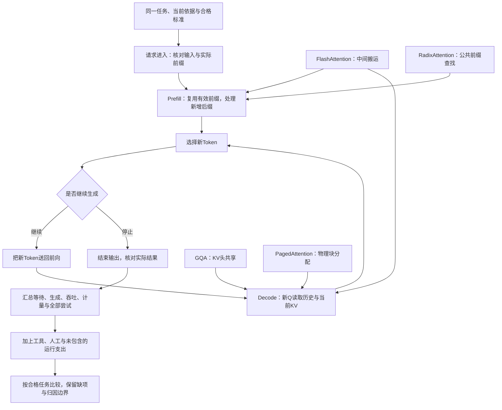

# 第十阶段串讲：从复用计算到算清合格任务的成本

你把同一份长规则交给助手，第一次问适用条件，第二次问一个新情况。第二次命中了缓存，服务少做了一段重复计算。

这是否意味着直接返回第一次的答案？显存是否不再被规则占用？再加上FlashAttention（优化中间数据搬运）、PagedAttention（管理缓存物理块）和RadixAttention（查找公共前缀），整项任务就能按固定倍数变快、变便宜吗？

第十阶段“理解速度、显存与费用”连接第26—28课。第26课说明计算状态怎样复用，第27课区分数据搬运、物理分配和前缀查找，第28课把局部变化放回同一合格任务的总账。本文沿重复规则问答的请求流展开，让每项优化都接到它实际改变的对象上。

最低前置知识是：知道模型逐步生成输出，知道结果要有依据并通过验收。本篇补齐Q/K/V、缓存、存储块和时间指标的必要概念，不要求先训练模型或编写推理服务。

Token编号、向量形状、缓存配置、块号、时间和费用都是 **课程的人工教学设置**，不是真实分词、硬件成绩或产品报价。不同小例子会明确分开，它们共同说明一条服务数据流，不冒充同一次真实运行日志。

## 一、先为这个问答任务保留正确的终点

同一份规则服务于两次不同提问。助手需要依据当前规则回答本次问题，保留必要条件和否定，给出对应依据；只生成一段顺畅文字还不能证明任务合格。

如果规则已经更新，应用应提供适用版本。不能为了提高缓存命中，继续把旧规则放在开头。模型可能更快地产生回答，但回答会失去正确起点。

这个质量要求先固定下来，随后才有意义比较等待、显存和费用。后面的三课都在解释怎样执行与管理计算，没有替我们取消这项验收责任。

先看一条缩小的请求，再回到重复规则与新问题。

## 二、四个输入先算完，选出的第五项再送回

Token是模型处理文本的小片段，Token ID是词表编号。课程只用编号表示顺序，不为它们指定真实词义：

```text
已有输入：11、22、33、44。
```

在注意力层中，一个位置的表示被投影成三类数值向量：Query，查询向量Q；Key，键向量K；Value，值向量V。Q与可见K计算匹配分数，再按归一化权重汇总V。它们是模型算出的状态，不是三个用户输入字段。[^缓存]

### Prefill建立已有输入的状态

Prefill，预填充，处理已经给出的输入。在没有可用前缀缓存的教学起点，四个位置一起经过前向计算，也就是经过模型取得计算结果。

输入已知，可以批量处理，但本例的因果可见范围仍然存在：位置1只看位置1，位置4看位置1—4。它们不能借助尚未生成的未来内容。

前向完成后，各注意力层保存四个位置的K/V，作为KV Cache，键值缓存。根据最后位置的词表输出分数，选择下一项；本例给定选出55，不推测某个真实模型为何一定选它。

| 时刻 | 当前序列位置数 | 有效缓存位置数 | 刚发生什么 |
| --- | --- | --- | --- |
| 四项输入前向结束 | 4 | 4 | Prefill建立输入K/V |
| 选出55，尚未送回 | 5 | 4 | 新编号出现，自己的K/V尚未计算 |
| 55再次前向结束 | 5 | 5 | 新位置已计算并加入缓存 |
| 再选出66，尚未送回 | 6 | 5 | 第六项自己的K/V仍未计算 |

**选出一个Token，与算出它所在位置的K/V，是相邻的两步**。输出刚出现时，缓存里不一定已经有它。

### Decode处理新位置，仍然读取历史

Decode，解码，在这里指普通逐Token自回归过程：把刚选出的55送回模型，处理第五位置，再预测第六项。

在每层，先计算第五位置新的Q/K/V，结合前四位置的缓存，让新Q使用位置1—5的K/V，包括第五位置自身。历史K/V无需从头重算，却仍要被本次注意力读取。[^生成]

只看一层一个头，每个向量有8个数字，`[行数,每行数字数]`表示形状：

```text
四项输入的Q、K、V：各[4,8]。
第五位置的新Q、K、V：各[1,8]。
加入第五位置后，缓存K和V：各[5,8]。
当前一行查询匹配五个位置：分数形状[1,5]。
```

“只处理新位置”和“继续使用历史”同时成立。省掉的是旧位置的重复处理，当前Q、历史读取、后续网络与下一项选择仍在。

如果生成在选出66以后停止，没有再把66送回，就可能留下“序列6、缓存5”。这个差一现象依赖所观察的时刻与本例流程，不是所有实现永远如此。预留了空间也不等于空间里已有有效状态。

## 三、下一条请求复用相同开头，仍要处理新问题

回到重复规则问答。Prompt Cache，提示词缓存，在本篇讨论的机制中，是将已经处理过的稳定前缀状态保留，供其他请求复用。请求内的KV缓存与跨请求前缀缓存，主要区别是复用范围，不要求一定放在两套独立存储中。[^前缀]

另取课程的两条五项输入，以下编号全部是请求预先提供的输入，不是上一节选出的输出时间线：

```text
请求甲输入：[11,22,33,44,55]。
请求乙输入：[11,22,33,66,77]。
```

前三项从开头相同，第四项开始不同。假设甲已处理、缓存仍有效、模型与影响状态的条件一致，且实现允许复用这段前缀，乙可接上前三位置的状态，再处理66、77并继续生成。

同一编号放在不同前文或位置后面，各层状态也可能不同。如果乙改成 `[11,66,33,44,55]`，最长公共前缀只剩第一项；后面相同的33、44、55不能凭编号重新接回甲的旧状态。

匹配对象是从开头连续一致的有效Token序列，不是“词义差不多”。实际请求可能还包含系统规则、消息组织和工具说明，不能只看屏幕上那句用户问题。

即便前缀相同，也还要核对服务是否支持复用、状态是否存在且有效、模型与配置是否匹配，以及长度和粒度要求。公共前缀给出可能范围，不是已经命中的证据。

### 缓存留住了计算，没有替代答案与知识

第一次问适用条件，第二次问新情况，即使规则前缀命中，新问题仍参与计算，输出仍需生成。两个答案可以相同或不同，缓存没有给出“必然返回旧答案”的保证。

答案缓存是应用存储已有回答的另一种设计。计算状态缓存则保存K/V，不能把两者混为一谈。

规则前缀也仍然属于本次上下文，新Q还会使用它。缓存不会把这部分位置从窗口中删除，更不会让超出窗口的请求自动合法。挑选资料或压缩文本是另一类改变，可能影响模型看到的内容。

保存K/V也不是参数训练，不表示模型永久学会规则。前缀命中可能省重复输入计算，但读取状态、新后缀、Decode与服务调度仍有成本，商业计费还要另读实际规则。

## 四、保存这些状态，到底需要多少空间

缓存增长以后，服务要安排它的存储。先数有效K/V，再看物理分配，不把二者合成一个含糊的“显存数字”。

下面另用课程存储配置：4层、8个Query头、2个KV头，每头8个数字，已缓存128个位置，每数2字节。它不是前面四项请求的长度。

注意力头是并行使用的多组投影与汇总。每层、每个KV头、每个位置都有K与V两份，所以：

```text
有效KV字节 = 2×层数×KV头数×每头维度×有效位置数×每数字节数
           = 2×4×2×8×128×2
           = 32,768字节 = 32 KiB。
```

KiB按1024字节换算，MiB按1,048,576字节换算。多缓存一个位置，本配置有效数据增加 `2×4×2×8×2=256字节`。三个同长、互不共享请求合计96KiB。

这只统计有效数值，不包括模型权重、其他激活、块预留、元数据和工作区，也不直接覆盖所有滑窗、压缩缓存或不同层配置。不能拿32KiB判断整个模型服务肯定装得下。[^存储]

### GQA改变每个位置有多少组KV

保持其他教学条件不变，8个Query头可以采用不同结构：

| 结构 | Query与KV的对应关系 | 本例KV头数 | 有效KV |
| --- | --- | --- | --- |
| MHA，Multi-Head Attention，多头注意力 | 各Query头对应独立KV头 | 8 | 128KiB |
| GQA，Grouped-Query Attention，分组查询注意力 | Query分组，组内共享KV；本例两组各4个Query头 | 2 | 32KiB |
| MQA，Multi-Query Attention，多查询注意力 | 所有Query头共享一组KV | 1 | 16KiB |

变少的是每个位置需要的KV组数，不是128个历史位置变成2个，也不是删掉了必要输入。[^头共享]

这是一种模型注意力结构差异，不能当作任意已部署模型可无损切换的缓存开关。三行存储数也不是三个真实模型的质量或速度排名。

有了“保存哪些状态、每位置存多少”的边界，下一步才讨论这些状态怎样计算、搬运、分配和查找。

## 五、FlashAttention让中间结果更及时地被消费

KV是后续会继续使用的历史状态，注意力分数表与概率表则是当前计算的中间结果。它们不是同一份数据。

假设处理1024个已知位置，可以用一张1024×1024表描述两两匹配；再有一张同形状表描述归一化权重。若每数2字节，完整一张表为2MiB。这个数是课程的存储计数，不是一次真实运行的峰值。

一种朴素执行方式是计算分数、把整表写回显存，再读取并归一化，再写回概率表，最后读取概率和V进行加权汇总。

GPU是可用于并行数值运算的图形处理器。HBM是容量较大的高带宽显存，SRAM是容量较小的片上快速存储。数据来回搬运会消耗时间，即使乘法数量没有明显下降，减少中间读写也可能改善执行。

FlashAttention将数据分块，让匹配、归一化与汇总在计算流程中衔接，维护正确的累计状态，避免把完整分数和概率表都物化到HBM。所谓物化，就是把完整中间表实际存下来。[^闪存]

**不存完整分数表，不等于不计算原注意力允许的分数**。本篇讨论的精确算法保留原注意力关系；因果模型不可见的未来位置仍不可见。主动删除连接的稀疏注意力另有定义，不能混成同一机制。

Softmax将分数转成非负且和为1的权重。一行里的全部可见分数共享归一化分母，因此各块不能自己得到结果后随便平均。

课程给出的同一行分数 `[0,ln2,ln4]`对应Value `[1,3,5]`。ln是自然对数，指数后比例为1、2、4，完整输出为：

```text
权重：[1/7,2/7,4/7]。
输出：(1×1 + 2×3 + 4×5)/7 = 27/7 ≈ 3.8571。
```

如果分成前两项与最后一项，各块先减去自己的最大分数，再求指数。exp表示指数函数，`exp(0)=1`：

| 块 | 本块最大分数 | 指数权重之和，也就是分母 | 指数权重与Value的加权和 |
| --- | --- | --- | --- |
| 前两项`[0,ln2]` | ln2 | 0.5+1=1.5 | 0.5×1+1×3=3.5 |
| 最后一项`[ln4]` | ln4 | 1 | 1×5=5 |

两块减去了不同最大值。统一改用ln4时，第一块的分母和加权和都乘 `exp(ln2−ln4)=0.5`，再与第二块合并：

```text
合并分母 = 0.5×1.5+1 = 1.75。
合并加权和 = 0.5×3.5+5 = 6.75。
输出 = 6.75/1.75 = 27/7。
```

这个缩例说明需要正确累计，不要求先掌握GPU内核推导。

精确数学定义相同，也不保证浮点输出逐位一致。计算顺序、精度和实现要按允许误差核验；某个中间表少占2MiB，也不能直接推出任务快了某个百分比。

## 六、PagedAttention安排逻辑顺序与物理空间

生成长度事先未定。如果为每个请求预留整段最大空间，会留下许多空位；反复分配不同大小的连续区域，又可能出现空闲总量足够、却没有足够长的连续空段。

PagedAttention将KV分成固定容量块，通过块表把逻辑顺序映射到物理空间，允许同一请求的物理块不相邻。[^分页]

沿课程，将10个有效缓存位置装进每块4格：

```text
逻辑块1：[1][2][3][4]
逻辑块2：[5][6][7][8]
逻辑块3：[9][10][空][空]
```

两块只够8个位置，因此需要3块，容量12格，最后空2格。每格表示一个位置KV的存储容量，不是一个原文字；空位还没有有效K/V，不能参加注意力。

课程分配的物理块号是7、2、9：

| 逻辑块 | 对应位置 | 物理块 | 空位 |
| --- | --- | --- | --- |
| 1 | 1—4 | 7 | 0 |
| 2 | 5—8 | 2 | 0 |
| 3 | 9—10 | 9 | 2 |

块表保留“第一块去7，第二块去2，第三块去9”的关系，不能把物理号排序后改读成2、7、9。

逻辑顺序保持，物理可以分散；分配按需增长，也不排斥服务预先建立公共存储池。分页缩小浪费，不表示尾块没有空位，更没有仅凭分页减少KV头数或历史位置。

## 七、RadixAttention找到相同开头，再接上不同后缀

现在把“下一条请求能用哪些状态”落实到查找与共享。为展示完整块，另取课程两条六项输入，块大小仍是4：

```text
请求甲：[10,20,30,40,50,60]。
请求乙：[10,20,30,40,70,80]。
```

前四项相同。在模型、位置等状态条件一致、前缀已经处理并可用、且教学规则只共享相同完整块的前提下，两请求可共用首块，不同后缀各占一块。

| 分配 | 不重复计数的物理块 | 容量 | 不同有效KV位置 |
| --- | --- | --- | --- |
| 完全不共享 | 4块 | 16格 | 各自6项，共12份 |
| 共享完整首块 | 3块 | 12格 | 公共4项＋甲后缀2项＋乙后缀2项，共8份 |

共享后两条请求的逻辑长度仍各为6。物理容量少4格，不能改写成输入被删掉4项，也不能推出请求延迟降低25%。后缀还要计算，答案还要生成。

Radix Tree，基数树，是可以在一条边上组织一段连续元素的前缀树。RadixAttention沿这种树保存Token序列与已有KV位置的关联，查找最长公共前缀。[^树查找]

两请求可以被组织成公共边 `[10,20,30,40]`，随后分出 `[50,60]`和`[70,80]`。新请求沿公共边匹配，满足复用条件后继续计算自己的分支；树不是一份旧答案库。

### 找到三项，不等于共享一个四格块

如果乙改为 `[10,20,30,70,80,90]`，最长相同开头只有三项。树可在第三项处分叉，已有KV不需要因索引组织改变就重新搬到一起。

但在本例“相同完整4格块才共享”的分页规则下，没有相同首块，共享块数为0，两条仍合计4块、16格。

**前缀匹配长度与实际存储复用粒度，需要分别核对**。树在Token层识别到三项，不保证所有后端恰好复用三个位置；原SGLang论文的具体存储安排也不是所有当前版本的固定配置。

前缀查找、分页分配和引用保护可以协作。共享块仍被活跃请求使用时，不能让另一请求覆盖；需要写入不同内容时，可按实现采用写时复制等保护。

原SGLang论文在容量不足时，优先淘汰未被活跃请求引用且最久未用的叶子，保留仍有用的公共祖先。这是该论文的策略，不是所有平台统一有效期。请求结束、引用变为零、缓存被覆盖也不能一概视为同一个时点。

## 八、四种改动先定位，再看实际服务

第27课主线的三种，是FlashAttention、PagedAttention、RadixAttention；GQA从第26课承接，作为结构对照。把它们放回已讲过的数据流：

| 机制 | 改动位置 | 没有因此消失的工作 |
| --- | --- | --- |
| GQA | 每个位置的Query与KV头共享关系 | 当前查询、历史位置与模型其余计算 |
| FlashAttention | 注意力中间数据的搬运与计算衔接 | 原注意力定义、归一化和输入输出读写 |
| PagedAttention | KV物理分配及访问映射 | 有效KV、逻辑顺序、尾块空间和共享保护 |
| RadixAttention | 相同Token前缀的查找与状态管理 | 新后缀计算、输出生成、命中条件和容量管理 |

作用不同，可以在支持的系统中组合，但组合收益不能直接把各项宣传倍数相乘。真实可用的模型结构、内核、存储与查找策略，需要读具体实现。

### 模型参数也有总量与当前参与量

服务资源还包括权重计算。MoE，Mixture of Experts，混合专家，让一个层有多套专家网络，由Router，即路由器，为当前Token选择少量路径。专家处理同一个Token的表示，不是给整篇文章分派几位固定职业老师。[^专家]

课程每个专家是 `2→4→2`的两层前馈网络：2个输入数字变成4个中间数，再变成2个输出数。每个输出对每个输入各有一个权重，忽略偏置：

```text
单专家：2×4+4×2 = 16个权重。
四专家总计：64个权重。
当前Token选两个：参与的专家权重32个。
```

这是专家部分，路由器、注意力、初始表示查表和可能的共享专家另计。不能把整模型总参数简单乘以2/4，也不能因当前只选两个就从部署中删掉另外两个。

路由、分发、合并、设备间通信和负载不均仍有代价。MoE选择计算路径，GQA改变KV头共享，两者不是同一个“缓存缩小”设置。

参数存得下、带宽足够、计算单元利用率高，是不同条件。软件实现、精度、并发和硬件互联会影响结果，峰值算力或激活参数数量都不能单独证明端到端速度或价格。[^硬件]

## 九、从首Token到完整输出，时间要按对象量

缓存与优化可能影响请求的一段时间，用户关心的却可能是整个任务。课程给一条简化请求：排队100毫秒，随后处理输入到首Token用300毫秒；输出50Token，首个以后每个间隔20毫秒。

```text
首Token等待 = 100+300 = 400毫秒。
最后Token到达 = 400+49×20 = 1380毫秒。
```

第1项已经在400毫秒到达，从第1项到第50项还有49个间隔。300毫秒是“处理输入到首Token”的整体教学段，不宣称它只含纯Prefill计算；算式也忽略额外传输等开销。

| 指标 | 观察谁 | 本例或边界 |
| --- | --- | --- |
| TTFT，Time to First Token，首Token等待 | 单请求开始到首个输出 | 400毫秒，计时起点须说明 |
| 后续Token间隔或生成速率 | 单请求开始输出后的推进 | 20毫秒间隔，稳定段约50Token/秒 |
| 单请求输出完成时间 | 从规定起点到该输出结束 | 简化例中1380毫秒 |
| 系统吞吐 | 同一窗口内多个请求的总产出 | 本例未给总量，不能补算 |
| 合格任务完成时间 | 从任务开始到全部必要验收完成 | 还需工具、重试与检查记录 |

一秒钟生成更多总Token，不能单独说明每个用户等待更短。多个请求批量处理可分摊参数搬运，却也会改变排队与执行条件，仍需看单请求记录。[^生成]

沿课程另一条请求，首Token200毫秒、50Token、后续间隔30毫秒，最后输出为 `200+49×30=1670毫秒`。它更早开始，却比前例晚290毫秒输出完。

如果完成任务需要多次尝试，还要按实际顺序、并行与工具等待计算。不能拿一次首Token等待代表总时间，也不能不知道调度关系就机械乘尝试次数。

## 十、成本也要算到同一个合格结果

沿课程的同质量教学账本：

| 已记录项目 | 方案甲 | 方案乙 |
| --- | --- | --- |
| 单次调用 | 1单位 | 2单位 |
| 完成所用总尝试 | 3次 | 1次 |
| 调用合计 | 3单位 | 2单位 |
| 人工核查 | 2单位 | 1单位 |
| 已记录完成支出 | 5单位 | 3单位 |

甲一次便宜，已记录支出却高。尝试次数包含第一次，模型费已含这些调用，再另加同一批“重试费”会双计。真实每次输入输出可能不同，应逐次读账单。[^费用]

丙每次0.5单位、需4次尝试、人工4单位，其已记录支出为6单位，也没有因为低单次价格就胜过乙的3。该结果来自课程条件，不表示真实低价模型必然反复失败。

### 缺失项仍要放进账本

工具查询、运行环境、存储与运维若没记录，5与3只是当前范围内的小计。未取得不能填零。

第28课博客另明确给出教学扩展：两方案工具各1单位、独立运行各1单位，且没有包含在调用和人工中，其他费用在本组教学范围内不计。新增两项后的教学范围小计为甲7、乙5；真实存储或运维项若未取得，仍保留未知。新增1单位不是产品默认费用。

```text
任务费用 = 所有模型调用实际费用
         + 工具实际费用
         + 人工核查与修正费用
         + 尚未包含的运行、存储或运维分摊。
```

类别需要互不重叠。托管API，即程序调用供应商服务的接口，其收费中已包含供应商提供服务的成本，不能又凭猜测加同一供应商GPU支出；自部署则按自己的实际账单与分摊规则记。

毫秒也不能直接加到费用单位中。时间与金额分别量；若要把延迟换成业务损失，应另有明确依据。

## 十一、缓存命中记录与Token账单重新接起来

回到开篇的第二次规则问答：前缀命中省了一段重复输入处理，但一次调用还可能有普通输入、输出、缓存写入、缓存读取、工具和不同服务方式的费用。

计算身份与商业计费不是同一件事。各平台的分桶、单价、有效条件要按准确模型、日期与实际账单读取；本篇没有当前产品价格排名。[^费用]

如果同一批输入被归入缓存读取，就不能未经规则核对又全部按普通输入价重复算一遍。首次建立缓存的支出，也不能因为后续读取便宜就省略；累计比较要覆盖建立与使用过程。

缓存冷热、真实命中范围、输入输出长度、重试原因和最终质量一起保存，才知道局部省计算有没有转成任务收益。两次请求看起来相似，并不能补造一个命中记录。

同理，把规则压缩得更短可能改变输入信息；GQA更换模型结构可能改变检查点；FlashAttention更换执行可能有浮点差异。验收应与改动对象相匹配，不能统一写“速度上升，质量自动不变”。

## 十二、沿最早的证据定位，再做固定条件对照

这时，等待、生成、显存和账单四类问题都有了可读的入口：

| 观察 | 先看什么证据 | 依据证据再判断 |
| --- | --- | --- |
| 首Token等待久 | 排队、输入量、输入处理与前缀实际命中 | 是排队还是重复处理，必要信息是否被正确保留 |
| 开始输出后生成慢 | 输出长度、逐步间隔、负载、带宽与实现 | 后续生成占了多少时间，改变预算是否影响质量 |
| 显存紧 | 权重、有效KV、实际分配、尾块与共享 | 浪费或占用具体在哪里，不直接把全部归为缓存 |
| 账单高 | 各次计量、写入读取、重试、工具与人工 | 计算节省是否进入互不重复的完成账本 |

看见症状只给出核查入口，没有直接决定安装哪个组件。托管服务内部的分页和内核是否可控，也要看实际能力，不能仅因知道名称就宣称已启用。

比较一个机制时，固定任务、资料、合格标准和其他可控制条件，记录模型版本、精度、硬件或平台、软件、长度、请求到达方式、并发及缓存冷热。比较模型时，模型本身是改动项，应分别记录双方版本，不能把全部差异归因于单一缓存因素。



图说明职责联系，不是某个后端的固定调用顺序，也没有测试这些组件已在真实服务中组合。局部少搬数据、少占空间、多命中前缀，与整体延迟、吞吐、质量和费用分别需要记录。

## 十三、沿请求回看三课怎样接力

第26课让已有输入先建立K/V，选出的新Token再参与前向。缓存复用历史计算，新Q仍读取历史；跨请求复用从相同开头接上不同后缀，没有删除窗口、返回旧答案或自动更新知识。

第27课接着安排这些计算与状态：FlashAttention减少中间搬运，PagedAttention安排逻辑与物理块，RadixAttention寻找公共前缀；GQA作为头共享结构另行对照。状态、容量、查找和计算关系各有边界，不能都叫压缩。

第28课把这些变化放回用户目标：较早首项、更少激活参数、更便宜一次，都可能被后续生成、排队、重试和人工抵消。先确认同一合格要求，再比较完整记录。

下一阶段第29课“ViT看图与扩散画图”进入图像。输入与计算形式改变以后，依然需要保持本阶段的习惯：指出改动对象，读取实际计量，核对质量和完整任务，而不将文本Token公式原样套到所有多模态服务。

## 依据与回查

阶段、14项必达目标、编号时间线、显存配置、4格块与物理7/2/9、两条六项前缀、分块缩例、MoE16/64/32、时间和甲乙丙账本来自《AI学习目录》及《32课学习设计与掌握目标》。工具与独立运行各1单位的扩展来自第28课博客明确教学前提，不是实际支出。

本文参考第26—28课现稿及《模型推理：从Token、Latent到多模态交错思维》，读取相应摘要与完整原始整理资料。前次已完整读取的成本、MoE与硬件原文，本次确认内容未变后沿用读取记录。课程与这些文档无公开网址，因此只列文字标题。

[^缓存]: Hugging Face官方[How caching works](https://huggingface.co/docs/transformers/en/cache_explanation)，核对Attention matrices、Cache class、生成循环和缓存存储说明；另完整读取[缓存层级讲解](https://www.bilibili.com/video/BV1DsG76AEEc)对应原文。采用当前Q与历史／当前KV、逐层状态、先前向再选择的机制，不运行模型代码。
[^生成]: [Efficient Memory Management for Large Language Model Serving with PagedAttention](https://arxiv.org/html/2309.06180)，第2.2—2.3节的输入处理、生成与批处理，采用本系列已核对内容；不将论文速度当作本文时间成绩。
[^前缀]: 同一篇[PagedAttention论文](https://arxiv.org/html/2309.06180)第4.4节Shared prefix及缓存层级原文。支持前缀状态复用后仍计算任务输入，命中和保留条件另看实际服务，不引入通用有效期或免费保证。
[^存储]: 同一篇[PagedAttention论文](https://arxiv.org/html/2309.06180)第3节，及[KV存储原始讲解](https://www.bilibili.com/video/BV1reKb6PEnw)对应完整原文。采用常规完整历史KV的计数与对象区分，32KiB等由课程给定，不能外推任意缓存结构或整体占用。
[^头共享]: [GQA: Training Generalized Multi-Query Transformer Models from Multi-Head Checkpoints](https://arxiv.org/abs/2305.13245)，核对摘要中的单KV头与中间数量KV头；页面显示v3，修订于2023-12-23。只采用结构分工，不复现其训练或外推质量排名。
[^闪存]: [FlashAttention: Fast and Memory-Efficient Exact Attention with IO-Awareness，v2](https://arxiv.org/html/2205.14135v2)，第2.2及3.1节；另完整读取[FlashAttention原始讲解](https://www.bilibili.com/video/BV1TU8x6hEVb)。采用中间物化、分块、统一归一化和精确数据流，不采用归档硬件规格或未定义显存指标。
[^分页]: [PagedAttention论文](https://arxiv.org/html/2309.06180)，第4.1—4.4节逻辑／物理块、块表、尾块、共享与写时复制，及[分页原始讲解](https://www.bilibili.com/video/BV1go836fECf)对应完整原文。4Token块和7/2/9均为教学，不猜真实平台块大小。
[^树查找]: [SGLang: Efficient Execution of Structured Language Model Programs](https://arxiv.org/html/2312.07104)，第3节，核对Token段树、状态映射、引用保护、叶子淘汰及分页兼容；另完整读取[RadixAttention原始讲解](https://www.bilibili.com/video/BV1e9h969EJk)。论文与视频的具体版本分别保留，不外推当前所有后端布局。
[^专家]: [MoE稀疏专家讲解](https://www.bilibili.com/video/BV1CgZABxEcy)与[路由讲解](https://www.bilibili.com/video/BV1HW4X6QEuh)对应完整原文，并采用本系列已核对的[Switch Transformers第2.1节](https://arxiv.org/html/2101.03961)。只采用路由与参数口径，不引入模型性能或产品价格排名。
[^硬件]: [计算硬件原始讲解](https://www.bilibili.com/video/BV1MjN16oE84)对应完整原文，采用容量、带宽、互联与软件的分工；不采用设备峰值或报价作为当前任务成绩。
[^费用]: [模型API成本结构原始讲解](https://www.bilibili.com/video/BV1e17y6wEy5)对应完整原文，采用输入、输出、缓存、重试和任务成本分类；商业API具体规则应另核对实际账单。本文未采用该原文历史模型单价或工程辅助公式作通用会计保证。

本文已核对14项目标覆盖、机制与证据边界、教学算例、公开引用、加粗标点、脚注围栏、保存一致性和本地Markdown渲染。缓存算例复用既有纯Python自检，其余块容量、分块输出、时间与费用按明确条件复算。

未重新核对完整视频、运行真实模型或GPU内核、部署组合服务、测量真实命中、显存、吞吐与账单，也未开展新手试读或实际发布平台预览。教学推演和本地渲染不证明真实服务已获得相同收益，已有论文成绩也不等于本次实验。
