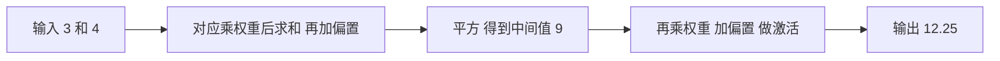
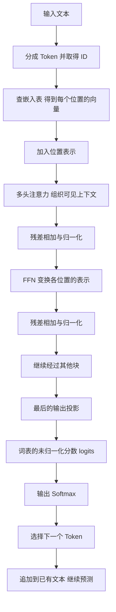

# 基础原理学习文档：从神经网络到大语言模型

这份文档从加减乘除开始，解释一个问题：**模型怎样把输入算成输出，又怎样根据答案调整自己**。先用几个数认识神经网络，再把输入换成文字，最后看语言模型怎样生成下一个 Token。Token 的含义会在进入文字任务时解释。

你不需要先学微积分、矩阵或编程。第 1—12 节是连续学习的主线，每个新运算先用数字算一遍，再给出名称和公式。遇到较长的推导，可以先掌握它在做什么；第 14 章保留完整数学解释，供以后回查。第 13 节是理解主线后的架构地图，里面的缩写不要求第一遍记住。

本文以原有 13 篇资料为主，另用官方文档补充数据划分、常规 Dropout、LayerNorm 的定义与算术示意，以及语言模型损失。所有小网络、向量、权重和练习数字都注明为教学设置，可以手算或用计算器核对，不代表真实模型配置、训练记录或性能。来源中的措辞差异放入折叠注释，原始资料保持原样。

## 开始前：先约定几种写法

字母可以替我们暂时放一个数。例如 $x=3$ 表示“这里的 x 是 3”。当输入换成别的数，只需替换 x，不必重写整句话。相邻字母通常表示相乘：$wx$ 是 $w\times x$。

接下来会用到三种熟悉的计算变化：

| 写法 | 怎样算 | 例子 |
| --- | --- | --- |
| 括号 | 先算括号内，再算外面 | $(2+3)\times4=5\times4=20$ |
| 平方 | 一个数乘自己 | $3^2=3\times3=9$；$(-2)^2=(-2)\times(-2)=4$ |
| 平均 | 全部相加，再除以数量 | 2、4、6 的平均是 $(2+4+6)/3=4$ |

负号表示方向相反，例如“减少 3”记作 -3。减去负数相当于增加：$1-(-2)=1+2=3$。负数乘负数得到正数，所以平方不会得到负结果。

$=$ 表示两边相等，$\approx$ 表示近似。例如 $1/3\approx0.3333$，右边为了显示而省略了后面的小数。后文的计算最好保留计算器内部精度，最后再取小数位。

还会遇到“概率”。在本文里，它是 0 到 1 之间的一个比例：0.25 就是 $25/100$，也就是 25%。对一组完整、互不重复的选择，各项概率相加为 1。模型给出的概率是它的预测分配，不能直接当作答案真实正确率的保证。

正文先用中文解释新符号；如果以后想系统回查，可以读 [[#14.1．先把常见符号读成一句话|第 14.1 节符号表]]。

## 1．神经网络首先是一个可调整的函数

### 从一条会算的规则开始

先做一个**教学设置**：输入是 3，规则是“乘 2，再加 1”。输出就是：

$$
3\times2+1=6+1=7
$$

把输入换成 4，输出就变成 $4\times2+1=9$。这里的 2 和 1 保持不变，变化的是输入。给这条规则取个名字，叫函数；函数就是接收输入、按规则算出结果的过程。

把输入记为 $x$，输出记为 $y$，乘在输入上的数记为 $w$，最后加的数记为 $b$，就把中文规则写成：

$$
y=wx+b
$$

$w$ 叫权重，控制输入的影响；$b$ 叫偏置，让结果整体增加或减少。这两个数就是本例的参数。**固定参数时，给不同输入算输出；训练时，根据数据调整参数**。

现实任务往往没有现成的规则。我们可以先选一种计算结构，再从已有输入和答案中学习合适的参数。例如本节先认识怎样计算，下一节再认识怎样调整。

### 为什么还要加一道“激活”

只做乘法与加法，这条规则的输出变化很规整：输入每增加 1，输出就增加固定的 $w$。把这种形式叫线性层；含偏置时，严格的数学名称是仿射变换。本文沿用神经网络资料中的“线性层”名称。

连续接两层这样的规则，仍能合成一条“乘一个数，再加一个数”的规则。**教学演算**：先乘 2 加 1，再乘 3 加 4，合起来是：

$$
(2x+1)\times3+4=6x+3+4=6x+7
$$

要得到不同的变化方式，可以在乘加之后再做非线性运算。教学里先用平方：括号结果为 2，平方得 4；结果为 3，平方得 9。输入增加同样的量，输出不再增加固定的量。这道运算叫激活函数。

若把激活规则命名为 $g$，写 $g(z)=z^2$，就是“收到 z 后，把它乘自己”。$g(3)=9$。因此 $y=g(wx+b)$ 的顺序是：先算 $wx+b$，再把结果交给 g。平方只用于本文手算，不能据此认定真实语言模型采用平方激活。

### 多个输入和多步计算，怎样连成网络

**教学设置**：两个输入分别是 3、4，权重分别是 2、-1，偏置是 1。先对应相乘、相加：

$$
2\times3+(-1)\times4+1=6-4+1=3
$$

再平方，得到中间值 9。下一步将中间值乘 0.5、减 1，再平方：

$$
(0.5\times9-1)^2=3.5^2=12.25
$$

中间值用来连接前后计算，叫隐藏层的值。将输入、中间值、输出画成节点，将它们之间的计算画成连线，就得到网络图：

从左到右把输出算出来，叫前向传播。结构规定怎样连接，参数是乘加中的可调整数，中间值则随本次输入计算出来。增加层数或每层的计算单元，可以扩大可表达的函数范围，但是否训练成功还要看数据与训练条件。

来源：[[raw/sources/模型原理/基础原理/从函数到神经网络#把嵌套式子画成网络|嵌套函数与前向传播]]。更完整的代数展开见 [[#14.2．线性函数与激活函数：先加权，再做一次变换|第 14.2 节]]。

> [!note]- 来源核对：表达能力的条件
> 原文用“逼近任意连续函数”说明表达能力，未展开定理条件；同一处还存在“线性关系”与后文“非线性函数”的措辞差异。本文依据其乘加与激活公式教学，不把这句话解释为任何结构、参数和训练条件下都能成功。

> [!question] 停一下，自己算
> 规则是“输入乘 3，再减 2”。输入为 4 时，输出是多少？其中哪些数是参数？

> [!answer]- 计算与解释
> $4\times3-2=10$。3 和 -2 是这条规则的参数；4 是本次输入，10 是本次输出。输入或参数改变，都要重新计算输出。

## 2．损失衡量偏差，梯度决定怎样更新参数

### 先量出预测离答案多远

训练数据的一条记录，包含输入和希望得到的答案。模型算出的结果叫预测。用 $y$ 表示答案，用 $\hat y$ 表示预测，帽子只是区分符号。例如 $y=3,\hat y=2$，答案减预测为 $3-2=1$。

怎么把多条记录上的偏差合成一个数？先用平方，避免正负误差相互抵消，再求平均。**教学设置**：两条记录的答案为 3、5，预测为 2、7。

| 记录 | 答案 | 预测 | 答案减预测 | 平方误差 |
| --- | --- | --- | --- | --- |
| 第一条 | 3 | 2 | 1 | $1\times1=1$ |
| 第二条 | 5 | 7 | -2 | $(-2)\times(-2)=4$ |

两个平方误差的平均为 $(1+4)/2=2.5$。这个衡量偏差的数叫损失；本例具体叫均方误差。较大误差会因平方受到更大惩罚。

现在才把操作缩写成公式。$N$ 表示记录数，$i$ 表示第几条，$\sum$ 读作“全部加起来”：

$$
L=\frac{1}{N}\sum_{i=1}^{N}(y_i-\hat y_i)^2
$$

按顺序读：第 i 条答案减预测 → 平方 → 所有记录相加 → 除以 N。$L$ 是损失。这里预测的是数值；语言模型的损失会在第 12 节另行解释。

### 改一个参数，损失会怎样变化

沿用原文四条记录：输入分别为 1、2、3、4，答案也分别为 1、2、3、4。先用预测规则 $\hat y=wx$，不加偏置。**教学演算**比较几种权重：

| 权重 w | 四个预测 | 四个平方误差 | 平均损失 |
| --- | --- | --- | --- |
| 0 | 0、0、0、0 | 1、4、9、16 | $30/4=7.5$ |
| 0.5 | 0.5、1、1.5、2 | 0.25、1、2.25、4 | $7.5/4=1.875$ |
| 1 | 1、2、3、4 | 0、0、0、0 | 0 |
| 1.5 | 1.5、3、4.5、6 | 0.25、1、2.25、4 | 1.875 |

本例中 w 为 1 时最好。真实网络有很多参数，无法逐个枚举所有取值，需要一种指导小步调整的方法。

### 导数：先用除法理解“附近的变化率”

先固定在 $w=0$，损失为 7.5。只将权重稍微增加，再重新算预测和损失。这个变化完全可以用普通除法观察：

| 权重增加量 | 新权重 | 新损失 | 损失变化量 | 损失变化量 ÷ 权重增加量 |
| --- | --- | --- | --- | --- |
| 0.01 | 0.01 | 7.35075 | -0.14925 | -14.925 |
| 0.001 | 0.001 | 7.4850075 | -0.0149925 | -14.9925 |

例如第一行最后一项是 $-0.14925/0.01=-14.925$。负号说明这里增加权重，损失减少；这个比值说明减少的尺度。继续将非零变化取得更小，比值会越来越接近 -15，负侧的小变化也接近同一个数。这个附近的变化率就叫导数。这里是在观察越来越小的变化，没有做“除以零”。

多个参数时，先固定其他参数，只改变其中一个，得到的变化率叫偏导数。把各参数的偏导数放在一起，叫梯度。$\partial L/\partial w$ 表示“损失对 w 的偏导数”，整个写法是一种变化率记号。

用 $L(w)$ 表示权重为 w 时算出的损失。本例四条记录的平均损失可以整理为 $L(w)=7.5(1-w)^2$，附近变化率为 $15w-15$。完整展开在 [[#14.3．均方误差：先比较，再平方，最后平均|第 14.3 节]]与 [[#14.4．导数与偏导数：看一个数稍微变动会怎样|第 14.4 节]]。第一遍先掌握上表的含义，后面就能使用这个变化率。

### 梯度下降：方向与步长分开决定

**教学设置**：从 $w=0$ 开始，当前梯度为 -15。取步长系数 0.1，叫学习率，记为 $\eta$。一次更新规定为“旧参数减去学习率乘梯度”：

$$
w_{\text{新}}=w_{\text{旧}}-\eta\frac{\partial L}{\partial w}
$$

代入普通数字：$0-0.1\times(-15)=1.5$。因为减去负数，这次权重增加了。用新权重重算损失，得到 1.875，比原来 7.5 小。

第二轮必须在新的 1.5 处重新求梯度：$15\times1.5-15=7.5$。再更新得 $1.5-0.1\times7.5=0.75$，损失变成 $7.5\times(1-0.75)^2=0.46875$。这一过程叫梯度下降。

| 所在权重 | 当前损失 | 当前梯度 | 按学习率 0.1 更新到 |
| --- | --- | --- | --- |
| 0 | 7.5 | -15 | 1.5 |
| 1.5 | 1.875 | 7.5 | 0.75 |
| 0.75 | 0.46875 | -3.75 | 1.125 |

可以把损失想成碗形曲线的高度，横向位置是权重。底部在 w 为 1 处：先从左边走到右边，再从右边靠近底部。跨过底部不必然是失败，关键是重新计算并检查损失。

如果步长太大，局部方向也可能带来更差结果。从 0 出发把学习率改成 0.2，就会得到 $w=3$，损失为 30。学习率控制走多远，梯度控制附近该往哪边走。导数为零也不普遍等于最小损失，本例还依靠损失为非负平方，才确认 w 为 1 是最低点。

### 反向传播：把几步计算的影响连起来

参数可能通过中间值才影响损失。先看每一段怎样传递变化，再把影响连接起来。

先用一个纯算术关系理解相乘：如果第一步输入变化 1，结果变化 2；第二步接到变化 2，结果变化 6，那么两段变化率分别是 $2/1=2$、$6/2=3$，总变化率就是 $6/1=6=2\times3$。

当网络里的变化率也随当前位置改变时，需要用前面解释的“非常小变化所接近的比值”，不能把任意大变化的比值当成导数。多段的局部影响相乘，叫链式法则。

沿用第 14.6 节的**教学小网络**：输入为 1，答案为 3；先乘权重 $w_1$ 后平方，得到 a；再将 a 乘 2 后平方，得到预测；最后算平方误差。初始 $w_1=1$，其他参数固定：

$$
a=(w_1\times1)^2=1,\qquad \hat y=(2a)^2=4,\qquad L=(3-4)^2=1
$$

平方规则在数 z 附近的变化率为 $2z$。例如 2 改成 2.01，平方从 4 改成 4.0401，变化率为 $0.0401/0.01=4.01$；变化更小时，比值接近 $2\times2=4$。据此逐段算本例：

| 影响路径 | 当前局部变化率 | 怎样得到 |
| --- | --- | --- |
| $w_1\rightarrow a$ | 2 | 在 $w_1=1$ 处平方，变化率为 $2\times1$ |
| $a\rightarrow\hat y$ | 8 | 先乘 2 的变化率是 2；平方输入当前是 2，平方变化率是 4；连起来为 $2\times4=8$ |
| $\hat y\rightarrow L$ | 2 | 损失也可写 $(\hat y-3)^2$，当前括号值是 1，所以是 $2\times1$ |

总影响为 $2\times8\times2=32$。从损失端往前复用这些影响，先算 $2\times8=16$，再算 $16\times2=32$，就是这个小例子的反向传播。它负责算梯度，参数更新是下一步。

**教学更新**：只调整 $w_1$，学习率取 0.001，其余参数固定。新权重为 $1-0.001\times32=0.968$。再从头前向计算：

$$
a=0.968^2=0.937024,\qquad \hat y=(2\times0.937024)^2\approx3.512056
$$

新损失为 $(3-3.512055906304)^2\approx0.262201$，从原来的 1 降低了。这里先求梯度，再更新，最后重新算损失，不能把旧梯度当作新损失。

一般网络还可能有多条影响路径，每条路径的贡献要相加。此处只展示一条路径。完整的一轮训练可以记成：前向算预测 → 比较答案算损失 → 反向算梯度 → 更新参数 → 下一轮重新计算。

来源：[[raw/sources/模型原理/基础原理/计算神经网络的参数#四个点可以令导数为零|四点损失]]、[[raw/sources/模型原理/基础原理/计算神经网络的参数#层与层之间用链式法则|反向传播]]。上面的初始参数和学习率是教学设置；逐步推导见 [[#14.5．梯度下降：把变化率反过来用|第 14.5 节]]与 [[#14.6．链式法则：中间经过几步，就把几段影响连起来|第 14.6 节]]。

> [!question] 停一下，自己算
> 旧参数是 2，梯度是 -3，学习率是 0.1。新参数是多少？更新以后，能不能继续一直使用旧梯度？

> [!answer]- 计算与解释
> $2-0.1\times(-3)=2.3$。下一轮要用新参数重新计算预测、损失与梯度。这里的负梯度使参数增加，梯度下降并不是让所有参数都变小。

## 3．拟合训练数据，还要考虑泛化

### 会做练过的题，还要检查没练过的题

前一节展示损失下降，但那是在指定训练记录上。复杂模型可能连这些记录中的偶然噪声也记住，遇到新记录表现反而变差，这叫过拟合。泛化能力关注模型对未见数据的表现。

为了有依据地判断，可以让不同数据承担不同任务。下面的数据划分是依据官方资料补充的教学说明：

| 数据部分 | 用来做什么 | 是否用它直接更新参数 |
| --- | --- | --- |
| 训练集 | 计算训练损失，更新参数 | 是 |
| 验证集 | 比较模型或学习率等设置，观察何时停止训练 | 否，但选择会受它的结果影响 |
| 测试集 | 选择完成后，评估对未见数据的表现 | 否，也不应用它反复调设置 |

**教学设置**：两次训练在同一验证集上得到下列结果，损失的定义与比较条件一致：

| 方案 | 训练损失 | 验证损失 |
| --- | --- | --- |
| 甲 | 0.10 | 0.80 |
| 乙 | 0.20 | 0.30 |

甲更贴合训练数据，乙在这次验证上的结果更好。可以据此选择乙，再用预留测试集评估；不能把一次小例子扩大为所有新数据上的效果保证。若反复看测试成绩来调整方案，它就参与了选择，失去了原先独立评估的作用。来源：[scikit-learn 官方交叉验证说明](https://scikit-learn.org/stable/modules/cross_validation.html)。

### 三类办法，先按作用理解

第一类改变数据或模型：增加有用的数据，降低不必要的复杂度，或用保持目标含义的变换增加训练例子。例如图像资料中的旋转、翻转、裁剪等，是否适用要看具体任务，不能把所有图像操作都当成不会改变答案。

第二类改变训练目标：不仅惩罚预测误差，也让过大的权重付出代价。这叫正则化。先用普通数理解。**教学设置**：原损失为 1，两个权重为 2、-1，惩罚系数为 0.1。

| 方式 | 怎样算权重代价 | 加到损失后 |
| --- | --- | --- |
| L1 | 去掉正负号后相加，得到 $2+1=3$ | $1+0.1\times3=1.3$ |
| L2 平方惩罚 | 各自平方再相加，得到 $4+1=5$ | $1+0.1\times5=1.5$ |

“去掉正负号、只看离零多远”叫绝对值，例如 $|-1|=1$。惩罚系数常记为 $\lambda$；它控制权重代价占多大份量。学习率则控制更新步子多大。这些人为设置的量叫超参数，与从数据更新的权重不同。公式及导数留在 [[#14.7．L1、L2 正则化：同时算误差与参数的代价|第 14.7 节]]。

第三类改变训练过程。例如看到验证表现开始变差时提前停止。常规 Dropout 则在训练的前向计算中，随机将输入的一组数中的部分元素置零，通常可以理解为暂时屏蔽部分激活。**它不永久删除权重，也不把模型参数量减少成另一张网络**。

**仅展示屏蔽的教学例子**：中间值是 $(2,5)$，若这次屏蔽第二项，只看屏蔽效果就得到 $(2,0)$。PyTorch 的完整 Dropout 还会按丢弃概率缩放保留元素；评估模式下不再进行这种随机置零。上面只解释屏蔽对象，不冒充完整实现。来源：[PyTorch Dropout 官方定义](https://docs.pytorch.org/docs/stable/generated/torch.nn.Dropout)。

训练还可能出现梯度太小、太大、来回震荡或计算太慢的问题。这些分别关系到影响能否传回、步长与稳定性、计算组织等。先把问题分清，再学对应方法，不必现在背下所有优化器名称。

来源：[[raw/sources/模型原理/基础原理/调教神经网络的方法#损失更小，不一定更能用|过拟合与泛化]]、[[raw/sources/模型原理/基础原理/调教神经网络的方法#训练也可以提前停，或给参数加惩罚|正则化]]；数据划分与 Dropout 的精确定义来自上面的官方补充。

> [!note]- 来源核对：正则化与 Dropout 措辞
> 原文口头说 L2 范数是平方和的平方根，画面的惩罚项却是平方和。本文用画面中的平方惩罚，范数与平方惩罚的区别保留在第 14.7 节。原文将 Dropout 概括为“随机丢掉一部分参数”；这里保留该来源记录，并依据官方定义解释常规 Dropout 的作用对象。原文点名梯度裁剪、初始化与归一化、动量、自适应优化器和 mini-batch，没有给出实施细节。

> [!question] 停一下，自己判断
> 模型甲训练损失更低，模型乙验证损失更低。为什么不能只凭训练损失选甲？如果你每次都用测试集挑学习率，它还承担原来的角色吗？

> [!answer]- 判断依据
> 训练损失只说明对用于更新的数据拟合得怎样，不能独立证明泛化。选择应考虑验证结果与任务要求。反复用测试集挑设置，会让它参与选择，不能再把它当作原先预留的独立评估。

## 4．矩阵组织一层计算，CNN 利用图像局部结构

### 向量是有顺序的一串数，矩阵是数表

前面一个计算单元接收多个输入。如果同时计算多个输出，逐条写规则会很长。我们先认识两种收纳数值的方式。

$(1,2,3)$ 是按顺序排列的一串数，叫向量；每个数叫分量，有三个分量就叫三维。这里的“三维”只数分量，不表示三个词或三层网络。

矩阵是按行、列排好的数表。横着数是行，竖着数是列。“2 行 3 列”简写为 $2\times3$，也叫形状。

**教学设置**：三个输入是 1、2、3，两个输出使用下列权重与偏置：

| 输出 | 第一个输入的权重 | 第二个输入的权重 | 第三个输入的权重 | 偏置 |
| --- | --- | --- | --- | --- |
| 第一个 | 1 | 0 | -1 | 1 |
| 第二个 | 2 | 1 | 0 | -1 |

逐个算：第一个输出为 $1\times1+0\times2+(-1)\times3+1=-1$；第二个输出为 $2\times1+1\times2+0\times3-1=3$。

把输入竖着排，将权重放进数表，就能把同一次计算写成：

$$
X=\begin{bmatrix}1\\2\\3\end{bmatrix},\quad
W=\begin{bmatrix}1&0&-1\\2&1&0\end{bmatrix},\quad
b=\begin{bmatrix}1\\-1\end{bmatrix},\qquad
Y=WX+b=\begin{bmatrix}-1\\3\end{bmatrix}
$$

这个矩阵乘法的规则是：**左边取一行，右边取一列，对应相乘后求和**。同样的配对规则反复用于每个输出。两边参与配对的数必须一样多，所以 $(2\times3)(3\times1)$ 能得到 $2\times1$。中间两个 3 对齐，外侧的 2 和 1 决定结果形状。

前面的加权求和没有改变，只是集中写成 $Y=WX+b$。本节用列向量；第 9—10 节将序列的每个位置放在一行，到时会明确说明怎样改成右乘矩阵。

### 参数数量，按独立的数来数

上述权重表有 $2\times3=6$ 个权重，另有 2 个偏置，总计 8 个参数。重复算新的输入时仍用这些参数，不会每算一次就多出一套参数。

原文的图像例子是 $30\times30$ 个灰度数，拉成一列后有 900 个输入。如果 1000 个输出都连接全部输入，就需要 $900\times1000=900000$ 个权重；每个输出再有一个偏置，则这一层共有 901000 个参数。这只数指定层，不能当作整模型参数量。

### 卷积：让不同局部重复使用同一组参数

图像中可以先处理一小块，再把同一规则挪到相邻位置。这叫卷积式的局部计算；保存那组系数的小数表叫卷积核。

原文给出图像局部块与锐化核：

$$
\begin{bmatrix}46&75&82\\140&162&173\\169&172&178\end{bmatrix},\qquad
\begin{bmatrix}0&-1&0\\-1&5&-1\\0&-1&0\end{bmatrix}
$$

这里做的是同一格相乘，再把九项相加，与上面的“一行对一列”不是同一种计算。非零项是：$-75-140+810-173-172=250$。移到下一块图像，图像值更换，核的九个数保持不变。

如果九个系数可训练，就只有这组九个核参数；处理十个窗口仍共享它们。卷积神经网络，简称 CNN，利用这种局部计算与参数共享处理图像。第一遍理解这一点即可，池化及多通道配置以后再学。

来源：[[raw/sources/模型原理/基础原理/从矩阵到 CNN#全连接层为什么不适合直接吃图片|权重数量]]、[[raw/sources/模型原理/基础原理/从矩阵到 CNN#用同一个小矩阵滑过图像|卷积与数值例子]]。逐项计算见 [[#14.8．矩阵乘法：把许多次加权求和一起写出来|第 14.8 节]]、[[#14.9．卷积：一个局部结果怎样算出来|第 14.9 节]]。

> [!note]- 来源核对：示例范围
> 单核演算没有确定多通道、多个核与其他偏置的配置。原文中的 CPU、GPU 动画耗时不作为硬件实测。

> [!question] 停一下，自己算
> 把本节输入换成 $(2,1,0)$，权重与偏置保持不变，两个输出各是多少？同一个 3×3 核处理十个位置，会变成 90 个独立核参数吗？

> [!answer]- 计算与解释
> 第一项为 $1\times2+0\times1+(-1)\times0+1=3$；第二项为 $2\times2+1\times1+0\times0-1=4$。同一个核重复使用，仍只有九个核系数；计算次数与独立参数数目不同。

## 5．语言模型先定义成预测下一个 Token

现在把输入从数值换成文字。我们先规定任务，再决定计算结构：给模型已有文本，让它为下一个文本片段分配概率。

模型使用的文本片段叫 Token。具体怎样切分由分词器决定，一个 Token 可以是一个词、词的一部分或其他片段，不一定是一个汉字。本文用「今天、天气、真」作为教学切分，接下来希望得到「好」，不声称这是某个实际分词器的输出。

所有可选 Token 排成一份列表，叫词表。**教学设置**：先假设词表只有「求、三连、谢谢、好、帅」五项。模型就需要给这五项各算一个分数：

| 词表位置 | 1 | 2 | 3 | 4 | 5 |
| --- | --- | --- | --- | --- | --- |
| Token | 求 | 三连 | 谢谢 | 好 | 帅 |
| 来源中的演示分数 | 4 | 2 | 1 | 5 | 3 |

分数怎样转成概率，在第 11 节计算。这里先确认“输出的每个位置代表哪个选择”。表中的分数沿用来源的五项展示，五项词表是假设的缩小教学范围，不是实际 GPT-2 词表。

如果词表有 50257 项，就需要 50257 个输出分数。50257 来自资料里的 GPT-2 示例，不是所有模型的默认值。内部向量有多少分量，与词表有多少项是两件事。

这种从有限选项中预测的任务，叫分类。图像场景分类有 100 类、褒贬判断有 2 类，是原文另外两个任务；它们的输出长度按各自选项确定。并非所有任务都因此被证明只能定义成分类。

来源：[[raw/sources/模型原理/基础原理/定义问题：预测下一个词#输出的每个位置对应一个词|词表输出]]、[[raw/sources/模型原理/基础原理/定义问题：预测下一个词#换掉输出定义，任务就变成另一种分类|任务与输出定义]]；五项分数见 [[raw/sources/模型原理/基础原理/Transformer 全流程：位置编码、残差与 Softmax#线性投影出来的是 logits|来源演示]]。

> [!question] 停一下，自己判断
> 教学词表有五项，内部表示每个位置只有两个分量。最终应输出两个分数，还是五个分数？

> [!answer]- 判断依据
> 五个分数，每项对应一个可选 Token。内部表示宽度为 2，并不把词表也变成两项。

## 6．Token ID 用来查表，词嵌入是进入网络的向量

### 从片段到编号，再到一串数

文字不能直接与权重相乘。先给每个 Token 一个编号，叫 Token ID；再根据编号查出一串数，叫词嵌入或嵌入向量。这串数才进入后续网络。

**教学设置**：为前文三个片段另设一个小查表，不对应实际分词器或训练结果：

| Token | ID | 查到的二维向量 |
| --- | --- | --- |
| 今天 | 0 | $(1,0)$ |
| 天气 | 1 | $(0,1)$ |
| 真 | 2 | $(1,1)$ |

读到「天气」，先得到编号 1，再查到 $(0,1)$。编号本身不代表含义距离；1 和 2 的数值接近，不足以证明对应 Token 的含义接近。实际词嵌入的各项数值通过训练调整，也不要求每一维都有一个人能命名的语义属性。

将三个向量按行放在一起：

$$
E=\begin{bmatrix}1&0\\0&1\\1&1\end{bmatrix}
$$

E 有 3 行 2 列：三行对应三个可查的 Token，每行有两个分量。这样的表叫嵌入矩阵。训练时，这张表中的可训练数也可以被更新；对同一个编号查出的初始向量，要与后面结合上下文计算的新表示区分。

### 为什么不只用编号，或者一个亮起的位置

除了直接使用编号，还可以给每个 Token 留一个位置，对应位置写 1，其余位置写 0，叫 one-hot。若三个 Token 的编号为 0、1、2，就分别写成 $(1,0,0)$、$(0,1,0)$、$(0,0,1)$。它清楚标出“是哪一项”，却没有自动提供 Token 之间的语义关系，宽度还随词表增长。

词嵌入则使用一组可学习的数。原文 GPT-2 示例的表有 50257 行、768 列：每个 Token 查到 768 个数。**768 表示向量宽度，50257 表示词表大小**。

之后可以研究这些向量的方向与相似性。第一遍先把“查表得到可训练的数值表示”理解清楚，点积会在第 9 节先用算术介绍；余弦相似度的方向解释与几何证明留在 [[#14.10．点积和余弦相似度：分清数值大小与方向|第 14.10 节]]，不作为继续阅读的前提。

来源：[[raw/sources/模型原理/基础原理/词向量：文字变成数字#嵌入矩阵跟着模型一起变|ID 与嵌入矩阵]]。

> [!note]- 来源核对：行列、静态向量与代码
> 本文查表采用“一个 Token 占一行”。旧系列 RNN 资料将词向量画在列中，这是另一个绘图约定，不能混用同一次乘法。原文还介绍 word2vec 静态词向量，并明确将两个矩阵简化成一个；BERT、GPT 的查表参数随模型训练调整，后续上下文表示则还要经过网络。人工“食物属性”与升维可分例子不证明真实嵌入逐维可解释或任意升维都更容易处理。来源示例写 `import torch.nn` 后调用 `nn.Embedding`，未绑定 `nn`，本文不将其照抄成可执行代码。核对记录见 [[wiki/sources/模型原理：词向量与嵌入矩阵#与其他资料的边界|资料边界]]。

> [!question] 停一下，自己判断
> 同一个「天气」在两句话中查到的初始向量相同，是否意味着它经过后续网络后的上下文表示也一定相同？

> [!answer]- 判断依据
> 不一定。查表按 ID 取得初始向量；后面的网络还会使用位置和可见上下文，新的中间表示可以不同。

## 7．RNN 用隐藏状态传递前文

### 先提出问题：前一个位置的信息怎样传下来

如果「今天」「天气」「真」分别经过互不联系的计算，最后处理「真」时，并没有收到「今天、天气」的信息。需要让不同位置联系起来。

一种历史上重要的办法叫循环神经网络，简称 RNN：每次既接收当前输入，也接收前一步保存的中间结果。这个传下来的结果叫隐藏状态。它是本次序列计算的中间值，不是新增的可训练权重。

沿用第 14.11 节的**教学设置**，先把向量缩成一个数：新状态 = 当前输入 + 0.5×旧状态；当前输出 = 2×新状态。初始状态为 0，两个输入依次为 2、1。

| 时间步 | 当前输入 | 旧状态 | 新状态 | 当前输出 |
| --- | --- | --- | --- | --- |
| 第一 | 2 | 0 | $2+0.5\times0=2$ | $2\times2=4$ |
| 第二 | 1 | 2 | $1+0.5\times2=2$ | $2\times2=4$ |

第二步状态中的 2，包含当前输入贡献的 1 和前状态贡献的 1。如果拿掉旧状态，第二步的状态就只有 1，输出只有 2。数字只是展示前文怎样参与，不能将这些输入当作实际 Token ID。

### 这种联系的代价

第二步依赖第一步状态，时间步要依次推进；较远信息在反复传递中也可能难以保留。后面注意力会换一种联系位置的方式：当前查询直接与可见位置的表示计算关联。

第一遍能解释“每一步比独立处理一个位置多收到了什么”，就可以继续。GRU、LSTM 是原文点名的相关结构，这里不增加它们的门控公式。RNN 的矩阵记号与逐步计算见 [[#14.11．RNN：前一个状态怎样进入当前计算|第 14.11 节]]。

来源：[[raw/sources/模型原理/基础原理/从词嵌入到 RNN#隐藏状态把前一个词带下去|状态与权重]]、[[raw/sources/模型原理/基础原理/从词嵌入到 RNN#按时间步传递，远距离仍然会丢|长期依赖与串行计算]]。

> [!note]- 来源核对：展平与顺序
> 原文用“顺序没了”描述句子展平的局限。本文保留它提出的变长输入与上下文组织问题，不据此推断固定位置拼接完全不含顺序。

## 8．FFN 处理特征，输出投影对齐词表

### 同一个位置里的数，还可以继续变换

第 4 节已经用三个输入计算两个输出。类似地，也可以从两个数算三个数，再从三个数算回两个数，中间加入激活。这种“乘加 → 激活 → 再乘加”的前馈网络，在这里叫 FFN。

“2 → 3 → 2”只是帮助数分量的教学缩小示意，不是一组已指定权重的模型。原文给的是 768 → 3072 → 768：一个位置输入 768 个数，中间算出 3072 个数，再输出 768 个数。每一箭头都表示一次变换，不表示某一个 Token 变成了几千个词。

FFN 对每个位置做特征变换；只让不同位置各自通过 FFN，不会自动把其他位置的信息送进来。位置之间的联系仍需注意力等模块负责。

### 内部宽度与最后的词表分数，各有任务

内部保持固定宽度，是为了继续接到后面的计算块。到最后才用一个线性层把内部表示转换成词表分数，叫输出投影。

| 组件 | 原文示例 | 本节要记住的作用 |
| --- | --- | --- |
| 嵌入查表 | ID → 768 个数 | 把离散 Token 变成数值输入 |
| FFN | 768 → 3072 → 768 | 改变一个位置的内部表示 |
| 输出投影 | 768 → 50257 | 为词表每项算一个分数 |

教学词表若只有五项，最后就需要五个分数。内部分量不是词表项目，不能因为内部有 768 个数，就说只能预测 768 种 Token。

来源：[[raw/sources/模型原理/基础原理/FNN 前馈神经网络与线性投影#前半段和后半段不是同一个名字|FFN 与输出投影]]、[[raw/sources/模型原理/基础原理/Attention 注意力：加权求和与多头|上下文缺口]]。

> [!note]- 来源核对：名称与示例规模
> 原文件标题使用 FNN，正文与结构图使用 FFN；本文组件名使用 FFN，原件不重命名。FC、MLP 等相关名称不作为新手记忆清单。768、3072、50257 都来自该教学结构，不是通用标准；来源没有给层数标准答案或 GELU 公式。

## 9．注意力用当前位置的查询组织上下文

### 先理解加权求和

当前位置要利用前文，可以让不同位置提供的信息按不同比例混合。例如原文教学系数为「今天」0.1、「天气」0.2、「真」0.7。

**另设向量，只为演算**：三个位置的信息分别是 $(1,0)$、$(0,2)$、$(1,1)$。按同一分量计算：

$$
\begin{aligned}
\text{第一个分量}&=0.1\times1+0.2\times0+0.7\times1=0.8\\
\text{第二个分量}&=0.1\times0+0.2\times2+0.7\times1=1.1
\end{aligned}
$$

结果是 $(0.8,1.1)$，叫加权求和。权重相加为 1，但结果的分量不需要相加为 1，因为它们是信息数值，不是词表概率。

真正要学习的问题是：怎样根据当前输入算出这些比例，而不是把 0.1、0.2、0.7 永远写死？

### Q、K、V 是三种中间表示

先把同一输入向量做三次不同的线性变换，得到 Q、K、V：

| 名称 | 中文读法 | 用在什么地方 |
| --- | --- | --- |
| Q，Query | 查询向量 | 当前位置拿它与可见位置进行匹配 |
| K，Key | 键向量 | 各可见位置提供的匹配表示 |
| V，Value | 值向量 | 真正按比例混入结果的信息 |

这些是本次输入算出的中间值。产生它们的权重矩阵才是可训练参数。Q、K、V 的名称说明计算分工，不意味着每个分量都是人能直接阅读的含义。

### 从输入亲手算出 Q、K、V

为接上下一节的原有小例子，**明确另设两个位置的二维输入与三个投影矩阵**。每个位置占一行，输入放左边，权重矩阵放右边：

$$
X=\begin{bmatrix}1&0\\0&1\end{bmatrix},\quad
W^Q=\begin{bmatrix}0&1\\1&0\end{bmatrix},\quad
W^K=\begin{bmatrix}1&0\\0&1\end{bmatrix},\quad
W^V=\begin{bmatrix}2&0\\0&4\end{bmatrix}
$$

右上角 Q、K、V 是用途标记，不是乘方。此例不加偏置；每个投影都是 $2\times2$，所以两个分量经过变换后仍有两个分量。它不对应前文三个 Token 的真实词嵌入，也没有算上完整模型的位置与其他块。

第 4 节是列向量，权重乘在左侧；这里是行向量，权重乘在右侧。配对规则仍然是“左边一行，对右边一列”。以第二位置 $(0,1)$ 为例：

| 得到的向量 | 第一个分量 | 第二个分量 | 结果 |
| --- | --- | --- | --- |
| Q | $0\times0+1\times1=1$ | $0\times1+1\times0=0$ | $(1,0)$ |
| K | $0\times1+1\times0=0$ | $0\times0+1\times1=1$ | $(0,1)$ |
| V | $0\times2+1\times0=0$ | $0\times0+1\times4=4$ | $(0,4)$ |

第一位置按相同步骤得到 Q 为 $(0,1)$、K 为 $(1,0)$、V 为 $(2,0)$。把位置按行排回去：

$$
Q_{\text{全部}}=XW^Q=\begin{bmatrix}0&1\\1&0\end{bmatrix},\quad
K=XW^K=\begin{bmatrix}1&0\\0&1\end{bmatrix},\quad
V=XW^V=\begin{bmatrix}2&0\\0&4\end{bmatrix}
$$

本例 K 恰好等于输入，是因为特意选择了对应的权重，不能推广成 K 总是不变。

### 点积：用一个数表示一次匹配分数

取第二位置的 Q 为 $(1,0)$，让它分别与两个 K 对应相乘再求和：

$$
(1,0)\cdot(1,0)=1\times1+0\times0=1
$$

$$
(1,0)\cdot(0,1)=1\times0+0\times1=0
$$

中间的点号表示点积，结果是一个数。当前查询得到两个匹配分数 $(1,0)$，下一节再把它们变成比例，然后混合 V。点积受向量数值大小影响，不只比较方向，也不能单独证明语义相同。

来源：[[raw/sources/模型原理/基础原理/Attention 注意力：加权求和与多头#权重来自点积，再拆成 Q 和 K|查询与匹配]]、[[raw/sources/模型原理/基础原理/Attention 注意力：加权求和与多头#被加进去的是 V|值与混合]]。矩阵与向量的数值是本文新设教学例子，按来源的线性变换关系计算。

> [!note]- 来源核对：加权求和还不是全部步骤
> 新系列本篇没有展开缩放、掩码与 Softmax。下一节使用旧系列已经明确给出的完整公式补上；不会将两篇重复理解为两次独立生成 Q、K、V。

> [!question] 停一下，自己算
> 输入行是 $(2,3)$，V 投影矩阵仍是 $\begin{bmatrix}2&0\\0&4\end{bmatrix}$。V 是多少？它与投影矩阵，哪一个是本次计算的中间值？

> [!answer]- 计算与解释
> V 为 $(2\times2+3\times0,\ 2\times0+3\times4)=(4,12)$。V 是本次输入产生的中间值；投影矩阵中的可训练数才是参数。

## 10．把注意力放进 Transformer 的完整结构

### 先把分数变成比例：Softmax 的四步计算

刚才的匹配分数不能直接当作混合比例。例如它们可能是负数，或总和不是 1。一个常用办法叫 Softmax：把各分数取指数，再分别除以指数总和。

指数先从整数理解。$e$ 是一个固定数，约等于 2.71828；$e^1=e$，$e^2=e\times e$，$e^0=1$。小数次方不要理解成“乘小数次”，可以使用科学计算器的 $e^x$ 功能取得数值。

先用分数 0、1 做**教学演算**：

1. 取指数：得到 $e^0=1$、$e^1\approx2.718282$。
2. 求总和：$1+2.718282\approx3.718282$。
3. 第一项除以总和：$1/3.718282\approx0.268941$。
4. 第二项除以总和：$2.718282/3.718282\approx0.731059$。

两项约为 26.89% 与 73.11%。它们相加为 1 的原因是，共同分母恰好就是全部分子之和。负分数取指数后也为正，例如 $e^{-1}=1/e\approx0.367879$。

### 把上节的注意力算完

第二位置的两个分数是 1、0。先缩放：将每个分数除以查询和键宽度的平方根。宽度是参与点积的分量数量，本例为 2，记为 $d_k=2$。

平方根是“平方以后得到原数的非负数”，例如 $\sqrt9=3$。用计算器得 $\sqrt2\approx1.414214$。因此分数变为 $(1/\sqrt2,0)\approx(0.707107,0)$。缩放用于调节分数尺度；为何是平方根，统计证明留在第 14.13 节。

再用 Softmax：

| 步骤 | 第一位置 | 第二位置 |
| --- | --- | --- |
| 缩放分数 | 约 0.707107 | 0 |
| 取指数 | 约 2.028115 | 1 |
| 除以共同总和约 3.028115 | 约 0.669762 | 约 0.330238 |

最后用这两个比例混合 V。第一位置 V 为 $(2,0)$，第二位置 V 为 $(0,4)$：

$$
\begin{aligned}
\text{输出第一分量}&=0.669761549\ldots\times2+0.330238451\ldots\times0\approx1.339523\\
\text{输出第二分量}&=0.669761549\ldots\times0+0.330238451\ldots\times4\approx1.320954
\end{aligned}
$$

最终信息向量约为 $(1.339523,1.320954)$，这些分量无需相加为 1。注意力权重才是对可见位置分配的比例。

### 训练时为什么要遮住未来

这里选的是第二位置查询，可以看第一、第二位置。若选第一位置，就不能读第二位置的后文。否则训练时提前看到要预测的答案，生成时却没有这份信息。

这种规定叫因果掩码：“因果”在这里指当前位置只能使用自身和之前的位置，“掩码”负责排除不允许看的位置。

| 查询位置 | 第一位置 | 第二位置 |
| --- | --- | --- |
| 第一位置 | 可看 | 不可看 |
| 第二位置 | 可看 | 可看 |

不可看位置要在 Softmax 分配比例之前排除，得到零权重。只把分数改成 0 不够，因为 $e^0=1$，它仍会占一份比例。例如如果只剩一个可见位置，这一位置就得到权重 1。

### 到这里，再读完整公式

$K^T$ 表示将 K 的行变成列，T 叫转置标记。这样，Q 的一行就能与原来 K 的每一行做点积。前面四步缩写为：

$$
\mathrm{Attention}(Q,K,V)
=\mathrm{softmax}\left(\frac{QK^T}{\sqrt{d_k}}\right)V
$$

读法依次是：所有查询与键算分数 → 缩放 → 对每个查询单独做 Softmax → 按比例混合 V。因果情况下还须先排除未来位置；上面的展示公式没有显式写出掩码项。全部形状与数值展开见 [[#14.13．注意力公式：匹配、缩放、分配权重、混合信息|第 14.13 节]]。

### 多头：多组计算，再拼接和投影

多头注意力让多组投影各自计算匹配和混合，再将结果拼接。**教学例子**：两个头各得到 $(1,2)$、$(3,4)$，拼接后是 $(1,2,3,4)$，不是 $(4,6)$。

还要用输出投影将拼接结果转换成接下来需要的宽度。沿用第 14.14 节的演算矩阵：

$$
\begin{bmatrix}1&2&3&4\end{bmatrix}
\begin{bmatrix}1&0\\0&1\\1&0\\0&1\end{bmatrix}
=\begin{bmatrix}4&6\end{bmatrix}
$$

结果在这个特定矩阵下碰巧等于对应分量相加；换矩阵会有不同结果。不同头不必各自对应一种人能命名的语义。

### 翻译结构与接龙结构，分别看输入来源

原始 Transformer 翻译示例有两部分：编码器处理原句，解码器结合原句表示和已经生成的译文，预测下一个译文 Token。连接两部分的注意力叫交叉注意力，其中解码器提供 Q，编码器提供 K、V。

GPT 式接龙采用仅解码器路线，使用已有 Token 的可见上下文继续生成；不能把它理解为必须另接翻译图中的原句编码器。这里的“编码器、解码器”是网络部分，也不同于把文字转编号、把编号还原文字的处理步骤。

注意力中的位置计算可以组织成矩阵，但新生成 Token 会改变下一步输入，因此不能从“矩阵并行”推出整段输出一次就全部确定。

来源：[[raw/sources/模型原理/基础原理/简单而强大的 Transformer#标准结构里，注意力是主干|注意力与多头公式]]、[[raw/sources/模型原理/基础原理/简单而强大的 Transformer#左边编码，右边解码|翻译结构与掩码]]；架构路线的补充见 [[raw/sources/模型原理/模型架构/Transformer如何成为AI模型的地基#三类Transformer的职责|原始 Transformer 与后续路线]]。

> [!question] 停一下，自己判断
> 将未来位置分数设为 0，能不能使它在 Softmax 后得到零权重？注意力最后得到的两个输出分量，是两个词的概率吗？

> [!answer]- 判断依据
> 不能，因为 $e^0=1$。必须在比例计算前排除未来位置。最后的两个分量是混合后的信息；输出词表概率还需经过后续块和输出投影。

## 11．从输入文字一路追到输出概率

### 先补齐三个连接组件

位置、残差和归一化，会让前面已经学过的模块接得起来。

**位置表示**提供“这是第几个位置”的信息。在来源的教学结构里，给查表向量加上位置向量。**另设二维演算**：初始向量为 $(1,2)$，位置向量为 $(0.1,0.2)$，按对应分量相加得到 $(1.1,2.2)$。真实位置方法有不同形式，这里只示范来源中的相加结构。

**残差连接**将子模块的输入加回输出。**沿用教学设置**：输入 $(1,2)$，子模块结果 $(0.2,-0.5)$，相加得到 $(1.2,1.5)$。两边形状相同，结果仍有两个分量。它增加了一条直接传递信息与变化的路径，不保证梯度永远不会太小或太大。

**归一化**按规则调整内部数值尺度，支持训练稳定。先用平均与尺度理解一种运算：**仅作算术示意**，两个数为 2、4，平均为 3；减平均得到 -1、1；平方偏差的平均为 1，平方根也为 1；再除以这个尺度，仍得 -1、1。实际 LayerNorm 还会加上防止除零等数值问题的小量，通常还有可学习的缩放、平移参数；这一示意不替代完整算法，更不能套到所有归一化方法。补充来源：[PyTorch LayerNorm 官方定义](https://docs.pytorch.org/docs/main/generated/torch.nn.LayerNorm.html)。

上述运算与 Softmax 不同：归一化结果可以为负，也不要求相加为 1。注意力 Softmax 分配位置权重，最后的输出 Softmax 才分配词表概率。

### 把整条计算链连起来

下面沿用原资料的教学结构。一个“块”就是按顺序组合的这几道计算；多个块重复使用类似结构，每个块有各自配置的参数。具体模型的归一化顺序与位置方法可能不同。

本节得到的是完整流程图，前面的二维例子分别解释各组件，不是声称已经用同一组权重模拟完整语言模型。第一遍能说清每一步接收什么、交出什么，就能把图读懂。

### logits 到词表概率，再到下一 Token

输出投影产生的未归一化分数叫 logits。沿用第 5 节的五项教学范围，分数为 4、2、1、5、3，对应「求、三连、谢谢、好、帅」。

为了方便计算，把所有分数都减去最大值 5，得到 -1、-3、-4、0、-2。统一平移不改变 Softmax 比例，因为指数中的共同倍数会在分子、分母中抵消；逐步证明留在 [[#14.12．Softmax：把一组分数变成总和为一的权重|第 14.12 节]]。

用计算器分别取指数，再除以共同总和约 1.571317432：

| Token | 平移后分数 | 指数，约值 | 除以共同总和后的概率，约值 |
| --- | --- | --- | --- |
| 求 | -1 | 0.367879441 | 0.234121657 |
| 三连 | -3 | 0.049787068 | 0.031684921 |
| 谢谢 | -4 | 0.018315639 | 0.011656231 |
| 好 | 0 | 1 | 0.636408647 |
| 帅 | -2 | 0.135335283 | 0.086128544 |

这些概率在未舍入时相加为 1。「好」的预测概率最大，约 63.64%。如果选择最大概率项，就选出「好」；如果采用按概率随机选择等策略，结果不一定相同。模型给「好」较高概率，也不等于已经证明这句续写在任何任务中正确。

选择 Token 后，要追加到已有序列，再预测下一 Token。通常遇到规定的结束标记或达到生成限制等条件才停止，不能只靠一次选出「好」就解释所有长回答。生成逐 Token 的说明见 [[raw/sources/模型原理/模型架构/Transformer如何成为AI模型的地基#解码补充：Temperature、Top-K与Top-P|生成与采样]]。

Softmax 的公式现在可以按已学步骤读：

$$
p_i=\frac{e^{x_i}}{\sum_j e^{x_j}}
$$

这里 $x_i$ 是第 i 个分数，$p_i$ 是对应比例，$j$ 遍历分母中的全部项。注意力使用同一种运算时，分母遍历可见位置；输出层使用时，分母遍历词表项目。

来源：[[raw/sources/模型原理/基础原理/Transformer 全流程：位置编码、残差与 Softmax#线性投影出来的是 logits|logits 与概率]]、[[raw/sources/模型原理/基础原理/Transformer 全流程：位置编码、残差与 Softmax#把整条链路再走一遍|组件链路]]；残差的逐项计算见 [[#14.14．多头、投影和残差：知道是在拼接还是相加|第 14.14 节]]。

> [!note]- 来源核对：位置顺序与概率总和
> 来源结构图把位置向量加在词嵌入后、注意力前，结尾口述另说“先注意力、再增加位置”，本文采用结构图顺序。来源旁白说 Softmax 概率“总和为零”，画面公式与概率加总为 1，本文采用公式结果。五项展示不是实际模型整个词表，也不能独立核验真实模型的生成效果。

> [!question] 停一下，自己算
> 两个 logits 是 0、0。经 Softmax 后各是多少？如果模型选择某项时给了 0.9 的概率，是否已经证明它有 90% 的真实正确率？

> [!answer]- 计算与解释
> 两项指数都是 1，总和为 2，所以各为 $1/2=0.5$。模型预测概率不自动等于经过校准的真实正确率，还需要实际评估。

## 12．预训练、后训练和提示时的变化要分开

### 文本自己可以提供下一 Token 的答案

先把一小段文本按教学方式切为「今天、天气、真、好」。已有前三项时，下一项「好」可以成为训练目标。也可以在多个位置同时准备“看到这些，应预测下一项”的记录：

| 可见输入 | 要预测的下一 Token |
| --- | --- |
| 今天 | 天气 |
| 今天、天气 | 真 |
| 今天、天气、真 | 好 |

这组切分仅用于教学，不是实际分词器的验证结果。文本本身就提供相邻 Token 的关系，这种方式叫自监督。在面向后续任务继续训练之前，先用大规模文本学习下一 Token 预测，这里称为自监督预训练。这里的“自监督”不等于没有目标答案。

训练时可以在一轮计算中利用多个位置的预测，但每个位置仍须遵守因果可见范围。生成时尚不知道下一项，通常依据当前末位置结果逐步选出并追加。训练利用已有完整文本构造目标，不意味着把后文答案直接交给当前查询。

### 概率怎样变成语言模型的损失

第 2 节的均方误差衡量数值预测；这里要衡量的是模型给正确 Token 分配了多少概率。先限定为单个、确定的目标 Token，且不加类别权重、不做将目标分配少量比例给其他项的“标签平滑”等额外处理。此时常用的单项交叉熵损失，就是模型给正确目标概率的负对数。下面只解释这一基础情形。

先用数值建立直觉。**教学设置**：同一个目标 Token，两次预测分别给它 0.1、0.8 的概率。希望 0.8 获得更小损失，0.1 获得更大损失。把这个要求写成 $L=-\ln p$，其中 p 是正确 Token 的预测概率。

这里的自然对数 $\ln$ 是指数的反向问题：$\ln p$ 问的是“e 的几次方等于 p”。第 10 节已介绍 e 和计算器的 $e^x$ 功能。现在可以用科学计算器的 $\ln$ 键取得结果，再改符号：

| 正确 Token 的概率 p | $\ln p$，约值 | 损失 $-\ln p$，约值 |
| --- | --- | --- |
| 0.1 | -2.302585 | 2.302585 |
| 0.5 | -0.693147 | 0.693147 |
| 0.8 | -0.223144 | 0.223144 |
| 1 | 0 | 0 |

例如 $e^{-0.693147\ldots}=0.5$，所以 $\ln0.5=-0.693147\ldots$。概率越接近 1，损失越接近 0；这解释了训练为何鼓励提高正确项概率。公式中的数学概率为正时可以这样计算；实际实现会用稳定算法，不能把显示为零的小数直接拿来求对数。

现在接回第 11 节：**如果教学目标设为「好」**，其预测概率约为 0.636408647，单项损失约为 $-\ln0.636408647\approx0.451914$。若目标改为「谢谢」，即使同样的分数与概率不变，取来计算损失的就是「谢谢」那一项，而非最大概率项。

多位置训练会将规定参与的目标位置损失汇总；平均还是求和、哪些位置计入，应按训练设置确定。随后反向传播经过输出投影、FFN、注意力、嵌入等参与路径求梯度，再由优化步骤更新参数。这样，第 2 节的训练循环与文字任务接起来了。

补充依据：[Hugging Face SFT 官方训练说明](https://huggingface.co/docs/trl/main/sft_trainer)中的 Token 级交叉熵与下一 Token 目标；库内也有 [[raw/sources/模型工程/训练与后训练/用 PyTorch 搭建并训练 MNIST 手写数字识别模型#CrossEntropyLoss、梯度与优化器|分类交叉熵的实践解释]]。这里为数学教学先展示概率形式；[PyTorch 的 `CrossEntropyLoss`](https://docs.pytorch.org/docs/2.14/generated/torch.nn.CrossEntropyLoss.html) 接收 logits，不能将手工 Softmax 的概率再次直接作为其 logits 输入。

### 后训练还在训练，提示示例改变本次输入

预训练之后，可以用更有针对性的数据继续训练。原文用问答数据解释监督微调，简称 SFT，让模型更倾向按问题给出回答。对于这里的自回归 SFT，仍可用下一 Token 目标训练回答序列；“从接龙走向回答”描述行为与数据变化，没有换成一种完全不同的输出计算机制。

后训练也包含资料点名的强化学习路线，不能只把它定义为 SFT。强化学习会依据奖励或反馈继续调整模型；这里先理解它属于参数学习，不展开奖励设计与算法。

| 做法 | 本资料的例子 | 这里是否更新模型参数 |
| --- | --- | --- |
| 自监督预训练 | 根据文本预测下一 Token | 是 |
| SFT 监督微调 | 用准备好的问答继续训练 | 是 |
| 提示中的少样本示例 | 给出苹果 → apple、香蕉 → banana，再问橘子 | 否，改变这次输入 |
| 思维链提示 | 要求先写步骤再回答 | 否，改变输入要求与生成内容 |

“先写步骤再回答”叫思维链提示。写出步骤便于检查，但不能单凭过程更长证明答案可靠。后训练也可以训练相关行为，所以应分清“用提示要求写步骤”和“通过训练学习该行为”。

来源：[[raw/sources/模型原理/基础原理/模型训练：预训练、后训练与思维链#给几个例子，就能换一种任务|上下文示例]]、[[raw/sources/模型原理/基础原理/模型训练：预训练、后训练与思维链#后训练把接龙改成回答|SFT]]、[[raw/sources/模型原理/基础原理/模型训练：预训练、后训练与思维链#把过程说出来，叫做思维链|过程与可靠性]]；Token 级损失说明属于上面注明的补充资料。

> [!note]- 来源核对：苹果题、强化学习与能力概括
> 原文苹果题画面只写到 $23-5=18$、$18+12=30$，没有完成送出 7 个；按题设补算 $30-7=23$ 属于教学演算，不能写成来源已展示模型答对。RLHF、RLVR 在该来源里只有名称，没有训练公式。“万能”与具体商业模型“提升全部来自后训练”的说法不作为已独立核验的能力或产品事实。

> [!question] 停一下，自己判断
> 你在提示中多给两组翻译示例，是否已经更新了模型权重？训练时，目标是「谢谢」，计算损失应使用「好」的最大概率，还是「谢谢」的概率？

> [!answer]- 判断依据
> 本文所述提示示例改变输入，没有执行参数更新。损失要使用指定正确目标「谢谢」的概率；预测最大项与训练目标是两个不同角色。

## 13．用组件地图理解现代架构名称

> [!tip] 理解主线后再读
> 到第 12 节已经能够解释一次语言模型预测与训练。下面先按“改动哪里”阅读，首次学习无需记住全部缩写。详细分类保留为回查资料。

| 已学组件 | 新方法主要追问什么 |
| --- | --- |
| 位置表示 | 怎样表达顺序与更长距离关系？ |
| 归一化 | 调整什么数，放在计算的哪个位置？ |
| 残差连接 | 怎样连接原输入与模块结果？ |
| FFN | 全部参数一起计算，还是路由选择部分专家？ |
| 注意力 | 怎样组织查询、键、值及可见配对，减少哪些工作？ |

把 FFN 拆成多个专家，并由路由选择部分参与，叫混合专家，简称 MoE。资料里的 397B-A17B 用来区分总参数与激活参数。B 是十亿：397B 是 3970 亿，17B 是 170 亿。激活量较小不能直接当作同倍率的真实速度提升。

注意力计算还可以按增长方式比较。n 表示位置数量；若每个查询都与全部键配对，n 个查询各配 n 次，共 $n\times n=n^2$ 项。长度从 10 增到 20，配对数从 100 增到 400。只看这个增长方向，可以用 $O(n^2)$ 表示平方量级；如果每加一个位置只增加固定份工作，就是 $O(n)$ 的线性量级。它们不直接告诉我们耗时多少，也不是整模型所有计算的统一结论。因果掩码下的配对计数与完整比较在 [[#14.15．平方复杂度与线性复杂度：看增长趋势|第 14.15 节]]。

> [!note]- 来源中的架构名称地图
> | 改动位置 | 来源点名的方法 |
> | --- | --- |
> | 位置编码 | 固定正弦余弦、RoPE、YaRN、NoPE |
> | 归一化 | LayerNorm、RMSNorm；Pre-Norm、Post-Norm；QK-Norm 等 |
> | 残差连接 | HC、mHC、Attention Residual |
> | FFN | Dense、MoE、DeepSeekMoE |
> | 注意力 | MQA、GQA、MLA；DSA、SWA、CSA、HCA；KDA 等 |
>
> 这些只是来源归类，不能只凭名称推断配置或性能。MQA、GQA、MLA 不宜只用“向量缩短”完成结构比较。来源将 Mamba 放在线性类型一组，不证明它使用同一套 Q、K、V 注意力。来源用“每个 Token 只路由到一个”简化 MoE，没有给出所有模型的路由配置，不能推广为全部 MoE 的定义。

作者认为仅靠修改 Transformer 架构抬高能力上限，空间已经不大，并借 Scaling Law、Bitter Lesson、莫拉维克悖论展开观点。这是对应来源时间的技术判断，不是这份入门文档已经证实的结论。多模态与世界模型只被点名，这里不增加课程。

来源：[[raw/sources/模型原理/基础原理/现代模型架构：Transformer 还剩的改动#大块的 FFN 被拆成专家|专家与激活参数]]、[[raw/sources/模型原理/基础原理/现代模型架构：Transformer 还剩的改动#注意力卷在三件事上|来源分类]]、[[raw/sources/模型原理/基础原理/现代模型架构：Transformer 还剩的改动#他承认题目夸张，但认为抬高上限的空间不大|作者观点]]。

## 把这些知识连成一次可复述的过程

再回到「今天天气真」接出「好」。先按分词器规则得到 Token 和 ID，查嵌入矩阵得到初始向量；提供位置信息，经过注意力让各位置利用可见上下文，经过 FFN 等块变换内部表示；最后将末位置表示投影为词表 logits，使用 Softmax 得到预测概率，按选择策略取下一 Token 并追加。

如果训练文本给出的目标是「好」，就用它的预测概率计算损失，再反向算梯度、更新参与学习的参数。下一轮用新参数重新计算。训练所得规律能否用于新文本，需要验证与独立测试；仅仅会做训练题或教学手算，不足以证明真实任务能力。

如果只是往提示里增加几个例子，变化的是本次输入；如果是 SFT 或其他训练，变化包含参数更新。用“输入改了、参数改了、还是生成选择改了”这三个问题，就能把很多行为区分开。

> [!question] 用自己的话走一次完整链路
> 不看流程图，解释“查表、上下文、内部变换、词表分数、概率、选择”六步。如果给出训练目标，还需要加上哪几步？

> [!answer]- 回读提示
> 查表由 ID 取得初始向量；注意力组织可见上下文；FFN 等模块继续变换内部表示；输出投影对齐词表；Softmax 得到词表概率；选择策略取下一 Token。训练时再加目标比较与损失、反向求梯度、参数更新。讲不清时回读第 6、8—12 节，不必靠记忆更多架构缩写补空白。

## 学完后的自测与回读位置

先独立回答。下面的参考答案默认折叠，不要求训练真实模型。

1. 反向传播是不是让所有参数变小？回读第 2 节。
2. 为什么不能只选训练损失最低的模型？验证集和测试集各做什么？回读第 3 节。
3. 内部宽度 768、FFN 中间宽度 3072、词表大小 50257，各在数什么？回读第 5、8 节。
4. Token ID、初始词嵌入、RNN 隐藏状态是不是同一种东西？回读第 6、7 节。
5. Q、K、V 和产生它们的投影矩阵，哪些是参数？回读第 9 节。
6. 注意力 Softmax 与输出 Softmax，各自在哪些项目之间分配比例？回读第 10、11 节。
7. 下一 Token 的训练目标已经给定时，损失读取目标项还是最大预测项？回读第 12 节。
8. 一次带多个示例的提示，是否执行了 SFT 参数更新？回读第 12 节。
9. 为什么不能从 A17B 或“线性”两个字直接推断真实运行速度？理解主线后回读第 13 节。

> [!answer]- 自测参考答案
> 1. 反向传播求梯度，更新再按梯度与学习率调整参数，参数可以增加也可以减少。
> 2. 训练表现不能独立证明泛化；验证集参与选择，预留测试集用于选择完成后的评估。
> 3. 分别是内部向量分量数、该 FFN 中间向量分量数、词表输出项数，不是层数或通用常量。
> 4. ID 是索引，词嵌入是查表向量，隐藏状态是结合旧状态计算的中间结果。
> 5. Q、K、V 是中间表示，可训练投影矩阵中的数是参数。
> 6. 注意力在可见位置之间分配权重；输出层在词表 Token 之间分配预测概率。
> 7. 读取给定目标项的概率，不能自动改成模型最喜欢的项。
> 8. 提示示例改变本次输入，没有执行本文所述参数更新。
> 9. 激活量和复杂度方向没有给出具体配置、运行条件与测量，不能独立决定实际速度。

首次学习的检验标准是：能独立完成几道乘加与损失计算，能说明一次参数更新，能复述从文字到下一 Token 的流程。几何证明、统计独立假设和现代架构缩写留作深入回查，不影响完成这条主线。

## 阅读顺序与 13 篇来源

本节用于回到资料，不要求先读完原文才能读正文。原有 13 篇均署名飞天闪客：前一套系列日期为 2025-07-21，后一套为 2026-08-29。架构归类与作者判断按对应时间理解，不代替当前行业配置的独立核验。

| 本文顺序 | 原始文章 | 学习时要回答的问题 |
| --- | --- | --- |
| 1 | [[raw/sources/模型原理/基础原理/从函数到神经网络]] | 网络图怎样对应一个含未知参数的函数？ |
| 2 | [[raw/sources/模型原理/基础原理/计算神经网络的参数]] | 损失、梯度下降和反向传播分别做什么？ |
| 3 | [[raw/sources/模型原理/基础原理/调教神经网络的方法]] | 为什么训练误差更小，不一定对新数据更好？ |
| 4 | [[raw/sources/模型原理/基础原理/从矩阵到 CNN]] | 矩阵如何表示一层计算，卷积为什么共享局部参数？ |
| 5 | [[raw/sources/模型原理/基础原理/定义问题：预测下一个词]] | 为什么预测下一个 Token 可以定义成词表分类？ |
| 6 | [[raw/sources/模型原理/基础原理/词向量：文字变成数字]] | Token、ID、词嵌入有什么区别？ |
| 7 | [[raw/sources/模型原理/基础原理/从词嵌入到 RNN]] | 隐藏状态怎样把前文带到后面的计算？ |
| 8 | [[raw/sources/模型原理/基础原理/FNN 前馈神经网络与线性投影]] | FFN 和输出投影为什么承担不同的任务？ |
| 9 | [[raw/sources/模型原理/基础原理/Attention 注意力：加权求和与多头]] | Q、K、V 怎样让当前位置利用上下文？ |
| 10 | [[raw/sources/模型原理/基础原理/简单而强大的 Transformer]] | 注意力如何放进编码器与解码器结构？ |
| 11 | [[raw/sources/模型原理/基础原理/Transformer 全流程：位置编码、残差与 Softmax]] | 怎样把输入文字一路追踪到下一个 Token 的概率？ |
| 12 | [[raw/sources/模型原理/基础原理/模型训练：预训练、后训练与思维链]] | 预训练、SFT、上下文示例和思维链怎样区分？ |
| 13 | [[raw/sources/模型原理/基础原理/现代模型架构：Transformer 还剩的改动]] | 新架构名称分别改动了哪一个环节？ |

## 两套系列的原始分集链接

库内原件是本文的直接依据；下列链接方便回到原视频，本文没有重新播放或核验视频。

| 系列与分集 | 对应文章 | 外部来源 |
| --- | --- | --- |
| 2025 年系列，第 1 P | 从函数到神经网络 | [原始分集](https://www.bilibili.com/video/BV1NCgVzoEG9?p=1) |
| 2025 年系列，第 2 P | 计算神经网络的参数 | [原始分集](https://www.bilibili.com/video/BV1NCgVzoEG9?p=2) |
| 2025 年系列，第 3 P | 调教神经网络的方法 | [原始分集](https://www.bilibili.com/video/BV1NCgVzoEG9?p=3) |
| 2025 年系列，第 4 P | 从矩阵到 CNN | [原始分集](https://www.bilibili.com/video/BV1NCgVzoEG9?p=4) |
| 2025 年系列，第 5 P | 从词嵌入到 RNN | [原始分集](https://www.bilibili.com/video/BV1NCgVzoEG9?p=5) |
| 2025 年系列，第 6 P | 简单而强大的 Transformer | [原始分集](https://www.bilibili.com/video/BV1NCgVzoEG9?p=6) |
| 2026 年系列，第 2 P | 定义问题：预测下一个词 | [原始分集](https://www.bilibili.com/video/BV15z4C6SEHT?p=2) |
| 2026 年系列，第 3 P | 词向量：文字变成数字 | [原始分集](https://www.bilibili.com/video/BV15z4C6SEHT?p=3) |
| 2026 年系列，第 4 P | FNN 前馈神经网络与线性投影 | [原始分集](https://www.bilibili.com/video/BV15z4C6SEHT?p=4) |
| 2026 年系列，第 5 P | Attention 注意力：加权求和与多头 | [原始分集](https://www.bilibili.com/video/BV15z4C6SEHT?p=5) |
| 2026 年系列，第 6 P | Transformer 全流程：位置编码、残差与 Softmax | [原始分集](https://www.bilibili.com/video/BV15z4C6SEHT?p=6) |
| 2026 年系列，第 7 P | 模型训练：预训练、后训练与思维链 | [原始分集](https://www.bilibili.com/video/BV15z4C6SEHT?p=7) |
| 2026 年系列，第 9 P | 现代模型架构：Transformer 还剩的改动 | [原始分集](https://www.bilibili.com/video/BV15z4C6SEHT?p=9) |

## 14．数学公式从零读：符号、推导与手算

这一章是正文之后的数学回查与选读材料，面向能做加减乘除、但不熟悉代数、微积分和矩阵的读者。首次阅读已经可以在正文中完成关键演算，不必连续读完这里才继续学习。每次推导都按“已知什么 → 代入什么 → 怎样展开 → 为什么可以化简 → 得到什么”来写。等号表示两边严格相等；近似号表示省略了小量或对小数进行了四舍五入，二者分开使用。

正文的原始公式与来源在前面已经列出。本章补充的是数学解释与教学演算。余弦的完整几何证明、平方根缩放的统计证明、复杂度与残差导数属于深入选读；看懂正文的作用与小例子后再回查。凡是为演算另设的参数、向量和输入，都明确说明用途，不把它们写成实际模型配置。可以逐小节阅读，每算完一个例子，再回到对应正文理解它在模型中承担什么任务。

### 14.1．先把常见符号读成一句话

公式把计算步骤写短了。先认识符号，再使用它们。

| 写法 | 含义 | 逐步读法 |
| --- | --- | --- |
| $wx$ | $w$ 乘 $x$，乘号被省略 | 若 $w=2,x=3$，代入得到 $2\times3=6$ |
| $f(x)$ | 将 $x$ 交给规则 $f$ | 若 $f(x)=2x+1$，则 $f(3)=2\times3+1=6+1=7$ |
| $x_i$ | 一组数中的第 $i$ 个 | $x_1=3,x_2=5$ 表示第一个数为 3、第二个为 5 |
| $\hat y$ | 预测值，与答案 $y$ 区分 | 若 $y=3,\hat y=2$，则“答案减预测”为 $3-2=1$ |
| $x^2$ | $x$ 自己乘自己 | $(-3)^2=(-3)\times(-3)=9$ |
| $\sqrt{x}$ | 平方后等于 $x$ 的非负数 | 因为 $3\times3=9$，所以 $\sqrt9=3$ |
| $\sum_{i=1}^{N}u_i$ | 将第 1 项至第 $N$ 项全部相加 | $N=3$ 时展开为 $u_1+u_2+u_3$ |
| $\frac{a}{b}$ | $a$ 除以 $b$ | $6/3=2$；这里要求 $b\ne0$ |
| $\lvert x\rvert$ | 到零的距离，称为绝对值 | $\lvert-3\rvert=3$、$\lvert3\rvert=3$、$\lvert0\rvert=0$ |
| $\approx$ | 近似等于 | $1/3$ 的小数不停延续，保留四位写成 $1/3\approx0.3333$ |
| $\eta$、$\lambda$ | 两个字母，读作 eta、lambda | 本章分别用来表示学习率、正则化系数 |

有些位置的方括号、尖括号和字母上标是标记：$A^{[L]}$ 的 $[L]$ 是层号，$h^{<t>}$ 的 $<t>$ 是时间步，$K^T$ 的 $T$ 是转置，$W^O$ 的 $O$ 是输出投影标记。**不能把所有右上角内容都读成乘方**。损失公式中的 $L$ 是损失值，层号中的 $L$ 是编号；遇到同名字母，要先看当前定义。

本章会反复使用分配律。它的意思是“括号里的每一项都要乘到”：

$$
c(u+v)=cu+cv
$$

例如 $2(3+4)=2\times3+2\times4=6+8=14$，也等于先算括号后得到的 $2\times7=14$。

由分配律可以得到平方展开。不要直接背结果，先把平方写成两份相乘：

$$
\begin{aligned}
(u+v)^2
&=(u+v)(u+v)\\
&=u(u+v)+v(u+v)\\
&=u^2+uv+vu+v^2\\
&=u^2+2uv+v^2
\end{aligned}
$$

最后一步使用普通数的 $uv=vu$，所以两项合成 $2uv$。如果第二个数是 $-v$，就把上式中的 $v$ 换成 $-v$：

$$
\begin{aligned}
(u-v)^2
&=(u+(-v))^2\\
&=u^2+2u(-v)+(-v)^2\\
&=u^2-2uv+v^2
\end{aligned}
$$

还会使用提取公因子：$cu+cv=c(u+v)$，它就是分配律反过来读。分式约去共同因子时，因子必须不为零，例如 $ca/(cb)=a/b$ 要求 $c\ne0$ 且 $b\ne0$。

向量先理解成按顺序排好的一串数，例如 $(1,2,3)$ 有三个分量，叫三维向量；矩阵是有行、有列的数表。这里的“三维”表示三个数，不表示三个词或三层网络。

### 14.2．线性函数与激活函数：先加权，再做一次变换

对应正文第 1 节：

$$
y=wx+b
$$

$x$ 是输入，$w$ 是权重，$b$ 是偏置。**教学设置**为 $x=3,w=2,b=1$，逐步计算：

$$
\begin{aligned}
y&=wx+b\\
&=2\times3+1\qquad\text{代入三个已知数}\\
&=6+1\qquad\text{先做乘法}\\
&=7\qquad\text{再做加法}
\end{aligned}
$$

输入改为 4、权重偏置保持不变，得到 $y=2\times4+1=8+1=9$。输入增加 $4-3=1$，输出增加 $9-7=2$，这个 2 就是权重 $w$。一般情况也可直接算：

$$
\begin{aligned}
y(x+1)-y(x)
&=[w(x+1)+b]-(wx+b)\\
&=wx+w+b-wx-b\\
&=w
\end{aligned}
$$

两个 $wx$、两个 $b$ 分别抵消。偏置会把所有结果同时平移，但不会改变这个固定输入增量带来的输出差。

多个输入时，正文写成：

$$
a=g(w_1x_1+w_2x_2+b)
$$

先不要处理 $g$，把括号中的结果暂时记作 $z$；这里新引入的 $z$ 只是为了分步骤：

$$
z=w_1x_1+w_2x_2+b,\qquad a=g(z)
$$

**教学设置**为 $w_1=2,x_1=3,w_2=-1,x_2=4,b=1$，激活函数取来源举过的平方形式 $g(z)=z^2$。先计算括号：

$$
\begin{aligned}
z&=2\times3+(-1)\times4+1\\
&=6+(-4)+1\\
&=2+1\\
&=3
\end{aligned}
$$

再计算激活：

$$
a=g(z)=g(3)=3^2=3\times3=9
$$

第二步仍用同一个平方规则，取 $w_3=0.5,b_2=-1$：

$$
\begin{aligned}
y&=g(w_3a+b_2)\\
&=g(0.5\times9+(-1))\\
&=g(4.5-1)\\
&=g(3.5)\\
&=3.5^2\\
&=3.5\times3.5\\
&=12.25
\end{aligned}
$$

这就是“先计算中间值，再送往下一步”。这里的平方只帮助看清流程，不代表真实语言模型采用平方激活。

再推导为什么纯线性层叠加仍能合并。取不含激活的两层 $a=w_1x+b_1$、$y=w_2a+b_2$：

$$
\begin{aligned}
y&=w_2a+b_2\\
&=w_2(w_1x+b_1)+b_2\qquad\text{将第一层表达式代入}\\
&=w_2w_1x+w_2b_1+b_2\qquad\text{对括号使用分配律}\\
&=(w_2w_1)x+(w_2b_1+b_2)\qquad\text{把输入项与常数项分组}
\end{aligned}
$$

$w_1,w_2,b_1,b_2$ 固定后，$w_2w_1$ 是一个数，$w_2b_1+b_2$ 也是一个数，所以仍然是“权重乘输入，再加偏置”。

对比一层平方激活 $y=(wx+b)^2$，展开为：

$$
\begin{aligned}
y&=(wx+b)(wx+b)\\
&=wx\cdot wx+wx\cdot b+b\cdot wx+b^2\\
&=w^2x^2+2wbx+b^2
\end{aligned}
$$

当 $w\ne0$ 时，出现了 $x^2$ 项，不能仅通过换一个固定权重和偏置，将它在所有输入上都改成直线形式。这才是这里非线性带来的变化，不是仅仅多写了一层。

### 14.3．均方误差：先比较，再平方，最后平均

对应正文第 2 节：

$$
L=\frac{1}{N}\sum_{i=1}^{N}(y_i-\hat y_i)^2
$$

$N$ 是样本数；$y_i$ 是第 $i$ 个样本的答案，$\hat y_i$ 是预测。先对每个样本做“答案减预测”，将差值平方，再加起来，最后除以样本数。

**教学设置**为两个样本，答案分别是 3、5，预测分别是 2、7，因而 $N=2$。先把求和符号展开：

$$
L=\frac{(y_1-\hat y_1)^2+(y_2-\hat y_2)^2}{2}
$$

然后一步步代入：

$$
\begin{aligned}
L&=\frac{(3-2)^2+(5-7)^2}{2}\\
&=\frac{1^2+(-2)^2}{2}\\
&=\frac{1\times1+(-2)\times(-2)}{2}\\
&=\frac{1+4}{2}\\
&=\frac5{2}\\
&=2.5
\end{aligned}
$$

平方让误差方向不再互相抵消，也放大了较大误差的贡献。“均”指最后的平均，“方”指前面的平方。它是这里回归例子的衡量标准，不是对语言模型损失的统一规定。

再完整推导正文的四点损失。已知样本 $(1,1)$、$(2,2)$、$(3,3)$、$(4,4)$，输入与答案相同，模型为 $\hat y=wx$，不设偏置。

| 样本 | 输入与答案 | 预测 | 答案减预测 | 提取公因子后的误差 |
| --- | --- | --- | --- | --- |
| 1 | $x_1=y_1=1$ | $w\times1=w$ | $1-w$ | $1(1-w)$ |
| 2 | $x_2=y_2=2$ | $w\times2=2w$ | $2-2w$ | $2(1-w)$ |
| 3 | $x_3=y_3=3$ | $w\times3=3w$ | $3-3w$ | $3(1-w)$ |
| 4 | $x_4=y_4=4$ | $w\times4=4w$ | $4-4w$ | $4(1-w)$ |

四个误差分别平方。这里使用 $(cu)^2=(cu)(cu)=c^2u^2$：

$$
\begin{aligned}
[1(1-w)]^2&=1(1-w)^2,\\
[2(1-w)]^2&=4(1-w)^2,\\
[3(1-w)]^2&=9(1-w)^2,\\
[4(1-w)]^2&=16(1-w)^2.
\end{aligned}
$$

再把它们相加、平均：

$$
\begin{aligned}
L(w)
&=\frac{1(1-w)^2+4(1-w)^2+9(1-w)^2+16(1-w)^2}{4}\\
&=\frac{(1+4+9+16)(1-w)^2}{4}\qquad\text{提取共同的平方项}\\
&=\frac{(5+9+16)(1-w)^2}{4}\\
&=\frac{(14+16)(1-w)^2}{4}\\
&=\frac{30(1-w)^2}{4}\\
&=7.5(1-w)^2.
\end{aligned}
$$

最后展开 $(1-w)^2$，不直接省略中间乘法：

$$
\begin{aligned}
(1-w)^2&=(1-w)(1-w)\\
&=1\times1-1\times w-w\times1+w\times w\\
&=1-w-w+w^2\\
&=1-2w+w^2.
\end{aligned}
$$

因此：

$$
\begin{aligned}
L(w)&=7.5(1-2w+w^2)\\
&=7.5\times1-7.5\times2w+7.5w^2\\
&=7.5-15w+7.5w^2.
\end{aligned}
$$

系数 7.5 来自 $30/4$，系数 -15 来自 $-7.5\times2$。保持为 $7.5(1-w)^2$ 时，还能直接判断最低点：平方至少为零，7.5 为正，故损失至少为零；令 $1-w=0$，得到 $w=1$，此时损失恰为零，所以这是本例最低点。

### 14.4．导数与偏导数：看一个数稍微变动会怎样

先区分三个量：变量改变多少，结果改变多少，以及“结果的改变除以变量的改变”。最后这个比值是平均变化率。将变量变化取得越来越小，如果比值趋向一个固定数，这个数就是该处导数。

用 $\Delta w$ 表示 $w$ 的变化量，读作“delta w”。它可以是正数，也可以是负数；进行除法时先要求它不为零。

**第一步：把平方的变化完全展开**。

$$
\begin{aligned}
(w+\Delta w)^2
&=(w+\Delta w)(w+\Delta w)\\
&=w^2+w\Delta w+\Delta w\,w+(\Delta w)^2\\
&=w^2+2w\Delta w+(\Delta w)^2.
\end{aligned}
$$

变化量要用新值减旧值：

$$
\begin{aligned}
(w+\Delta w)^2-w^2
&=w^2+2w\Delta w+(\Delta w)^2-w^2\\
&=2w\Delta w+(\Delta w)^2\\
&=\Delta w(2w+\Delta w).
\end{aligned}
$$

**第二步：除以变量变化量**。

$$
\frac{(w+\Delta w)^2-w^2}{\Delta w}
=\frac{\Delta w(2w+\Delta w)}{\Delta w}
=2w+\Delta w.
$$

因为此时 $\Delta w\ne0$，才可以约去共同因子。

**第三步：让变化量趋近零**。

若 $w=2$，取 $\Delta w=0.1$，比值为 $4+0.1=4.1$；取 0.01，成为 4.01；取 -0.01，成为 3.99。无论从正侧还是负侧，变化量越接近零，比值越接近 4。一般 $w$ 的结果就是 $2w$，所以平方的导数为 $2w$。

“趋近零”表示观察越来越小的非零变化，不是把分母直接设为零。本章用“趋近”表达这个极限过程，不需要先掌握极限的完整理论。

再推导正文 $L(w)=7.5-15w+7.5w^2$ 的导数，而不直接套求导结论。新位置的损失为：

$$
\begin{aligned}
L(w+\Delta w)
&=7.5-15(w+\Delta w)+7.5(w+\Delta w)^2\\
&=7.5-15w-15\Delta w+7.5[w^2+2w\Delta w+(\Delta w)^2]\\
&=7.5-15w-15\Delta w+7.5w^2+15w\Delta w+7.5(\Delta w)^2.
\end{aligned}
$$

减去旧损失，旧式中的三项分别抵消：

$$
\begin{aligned}
L(w+\Delta w)-L(w)
&=-15\Delta w+15w\Delta w+7.5(\Delta w)^2\\
&=\Delta w[-15+15w+7.5\Delta w].
\end{aligned}
$$

除以非零的 $\Delta w$，再让它趋近零：

$$
\frac{L(w+\Delta w)-L(w)}{\Delta w}
=-15+15w+7.5\Delta w
\quad\longrightarrow\quad15w-15.
$$

箭头表示右侧数值趋向的结果。于是 $L'(w)=15w-15$。这里的撇号 $'$ 表示求导，$L'(w)$ 读作“函数 $L$ 对变量 $w$ 的导数”，就是刚才求出的局部变化率。当 $w=0$，代入得 $15\times0-15=-15$；$w=1$ 时为 $15-15=0$；$w=2$ 时为 $30-15=15$。

正导数表示变量稍增时结果在局部倾向增加，负导数表示倾向减少。“导数为零”在复杂函数中不必然代表最低点；本例还使用上一小节的非负平方表达式，才确认 $w=1$ 是最低点。

#### 多个参数时，先只改变一个

偏导数就是固定其他参数，只看一个参数变化产生的局部影响。$\partial L/\partial w$ 读作“损失对 $w$ 的偏导数”；$\partial$ 是记号，不是普通数字。

下面补齐正文线性预测 $\hat y_i=wx_i+b$ 对两个参数的偏导。为减少符号重复，**本次推导定义** $r_i=wx_i+b-y_i$，表示“预测减答案”。均方误差原先写“答案减预测”，两者方向相反，但平方相等：

$$
(y_i-\hat y_i)^2=(-r_i)^2=r_i^2.
$$

因此 $L=(1/N)\sum_{i=1}^N r_i^2$。样本输入 $x_i$、答案 $y_i$、样本数 $N$ 在求导中都保持固定。

**先求权重偏导，固定偏置 $b$**。 把 $w$ 改为 $w+\Delta w$，新残差为：

$$
\begin{aligned}
r_{i,\text{新}}
&=(w+\Delta w)x_i+b-y_i\\
&=wx_i+\Delta w\,x_i+b-y_i\\
&=(wx_i+b-y_i)+x_i\Delta w\\
&=r_i+x_i\Delta w.
\end{aligned}
$$

第 $i$ 个样本的平方误差变化为：

$$
\begin{aligned}
r_{i,\text{新}}^2-r_i^2
&=(r_i+x_i\Delta w)^2-r_i^2\\
&=r_i^2+2r_ix_i\Delta w+x_i^2(\Delta w)^2-r_i^2\\
&=2r_ix_i\Delta w+x_i^2(\Delta w)^2.
\end{aligned}
$$

把每个样本的变化求和、除以 $N$，得到总损失变化；再除以 $\Delta w$：

$$
\begin{aligned}
\frac{\Delta L}{\Delta w}
&=\frac1N\sum_{i=1}^N\frac{2r_ix_i\Delta w+x_i^2(\Delta w)^2}{\Delta w}\\
&=\frac1N\sum_{i=1}^N(2r_ix_i+x_i^2\Delta w)\\
&=\frac2N\sum_{i=1}^N r_ix_i+\frac{\Delta w}{N}\sum_{i=1}^N x_i^2.
\end{aligned}
$$

最后一项包含 $\Delta w$，而其余数固定；当 $\Delta w$ 趋近零，这一项也趋近零。将 $r_i$ 换回定义，得到：

$$
\frac{\partial L}{\partial w}
=\frac2N\sum_{i=1}^N r_ix_i
=\frac2N\sum_{i=1}^N(wx_i+b-y_i)x_i.
$$

这说明额外的 $x_i$ 从哪里来：改变权重时，这个变化要先乘输入，才进入预测误差。

**再求偏置偏导，固定权重 $w$**。 把 $b$ 改为 $b+\Delta b$，新残差为：

$$
r_{i,\text{新}}=wx_i+b+\Delta b-y_i=r_i+\Delta b.
$$

每项误差变化与平均变化依次为：

$$
\begin{aligned}
r_{i,\text{新}}^2-r_i^2
&=(r_i+\Delta b)^2-r_i^2\\
&=2r_i\Delta b+(\Delta b)^2,\\
\frac{\Delta L}{\Delta b}
&=\frac1N\sum_{i=1}^N(2r_i+\Delta b)\\
&=\frac2N\sum_{i=1}^N r_i+\frac{N\Delta b}{N}\\
&=\frac2N\sum_{i=1}^N r_i+\Delta b.
\end{aligned}
$$

这里 $\Delta b$ 在每个样本上都出现一次，共有 $N$ 次，才会得到 $N\Delta b$。让 $\Delta b$ 趋近零并代回 $r_i$：

$$
\frac{\partial L}{\partial b}
=\frac2N\sum_{i=1}^N(wx_i+b-y_i).
$$

没有额外 $x_i$，因为偏置增加多少，预测就直接增加多少。

### 14.5．梯度下降：把变化率反过来用

对应正文第 2 节：

$$
w_{\text{新}}=w_{\text{旧}}-\eta\frac{\partial L}{\partial w}.
$$

先用旧参数计算导数，再乘正学习率 $\eta$，最后从旧值减去它。导数为正时减去正数，参数变小；导数为负时减去负数，参数变大。两者都沿当前位置的局部下降方向。

沿用四点损失和正文教学设置，$w_{\text{旧}}=0,\eta=0.1$。**第一轮先求梯度，再更新，再重新算损失**。

$$
\begin{aligned}
L'(0)&=15\times0-15=0-15=-15,\\
\eta L'(0)&=0.1\times(-15)=-1.5,\\
w_{\text{新}}&=0-(-1.5)=1.5.
\end{aligned}
$$

旧位置损失为 $L(0)=7.5(1-0)^2=7.5\times1=7.5$。新位置损失逐步为：

$$
\begin{aligned}
L(1.5)&=7.5(1-1.5)^2\\
&=7.5(-0.5)^2\\
&=7.5\times0.25\\
&=1.875.
\end{aligned}
$$

**第二轮必须重新求梯度，不能继续使用 -15**。

$$
\begin{aligned}
L'(1.5)&=15\times1.5-15=22.5-15=7.5,\\
w_{\text{下一轮}}&=1.5-0.1\times7.5=1.5-0.75=0.75,\\
L(0.75)&=7.5(1-0.75)^2\\
&=7.5\times0.25^2\\
&=7.5\times0.0625\\
&=0.46875.
\end{aligned}
$$

参数可以跨过最低点，再从另一侧靠近它。**另作教学设置**，若从 0 出发将学习率改为 0.2：

$$
\begin{aligned}
w_{\text{新}}&=0-0.2\times(-15)=0-(-3)=3,\\
L(3)&=7.5(1-3)^2=7.5(-2)^2=7.5\times4=30.
\end{aligned}
$$

损失从 7.5 变为 30。方向适合局部，并不等于任意步长都合适。

#### “小步倾向下降”怎样从式子里看出来

上一小节已经精确得到：

$$
\Delta L=(15w-15)\Delta w+7.5(\Delta w)^2.
$$

第一项包含一次变化量，第二项包含变化量的平方。当 $\Delta w$ 很小时，平方项相对更小；例如 $\Delta w=0.01$，它的平方是 0.0001。忽略平方项得到的是近似，故写：

$$
\Delta L\approx L'(w)\Delta w.
$$

梯度下降的参数变化量不是整个新参数，而是“新值减旧值”：

$$
\begin{aligned}
\Delta w&=w_{\text{新}}-w_{\text{旧}}\\
&=[w_{\text{旧}}-\eta L'(w_{\text{旧}})]-w_{\text{旧}}\\
&=-\eta L'(w_{\text{旧}}).
\end{aligned}
$$

将其代入局部近似，并暂用 $w$ 表示旧位置：

$$
\begin{aligned}
\Delta L
&\approx L'(w)[-\eta L'(w)]\\
&=-\eta L'(w)L'(w)\\
&=-\eta[L'(w)]^2.
\end{aligned}
$$

学习率为正，平方非负，前面的负号使这个近似变化不大于零。但这里确实忽略了平方项，所以不能用于任意大步长。

对本例还能给出不省略平方项的结果。将同一个 $\Delta w$ 代入精确式：

$$
\begin{aligned}
\Delta L
&=L'(w)[-\eta L'(w)]+7.5[-\eta L'(w)]^2\\
&=-\eta[L'(w)]^2+7.5\eta^2[L'(w)]^2\\
&=\eta(7.5\eta-1)[L'(w)]^2.
\end{aligned}
$$

未到最低点时，梯度平方为正；若学习率 $\eta>0$，另一个因子也为正。要让乘积为负，剩下的因子就必须为负。逐步解这个条件：

$$
\begin{aligned}
7.5\eta-1&<0,\\
7.5\eta&<1\qquad\text{两边同时加 1},\\
\eta&<\frac1{7.5}\qquad\text{除以正数 7.5，不改变方向},\\
\frac1{7.5}&=\frac{10}{75}=\frac2{15}.
\end{aligned}
$$

结合学习率为正，得到 $0<\eta<2/15$。这里 $2/15\approx0.133333$，0.1 在范围内，0.2 不在；本例损失相应降低或增大。这一范围是从本例损失推出来的，不是所有网络通用的学习率规定。

多个参数的各自偏导数组成梯度。它们应基于同一轮旧参数计算，再进行这一轮更新；不能在求同一轮其他参数的梯度时，混入刚刚更新的值。

### 14.6．链式法则：中间经过几步，就把几段影响连起来

正文的小网络是 $w_1\rightarrow a\rightarrow\hat y\rightarrow L$。对 $w_1$ 求偏导时，其他权重、偏置和输入保持固定。

先从有限的小变化说明为什么相乘。让 $w_1$ 改变 $\Delta w_1$，依次引起 $\Delta a$、$\Delta\hat y$、$\Delta L$。在这些变化量非零的情形下：

$$
\begin{aligned}
\frac{\Delta L}{\Delta\hat y}
\cdot\frac{\Delta\hat y}{\Delta a}
\cdot\frac{\Delta a}{\Delta w_1}
&=\frac{\Delta L\,\Delta\hat y\,\Delta a}
{\Delta\hat y\,\Delta a\,\Delta w_1}\\
&=\frac{\Delta L}{\Delta w_1}.
\end{aligned}
$$

第二步约去了分子分母共有的变化量。若各段函数在当前点可微，让最开始的变化趋近零，相应中间变化也趋近零，每段比值便趋向该段导数，于是得到：

$$
\frac{\partial L}{\partial w_1}
=\frac{\partial L}{\partial\hat y}
\cdot\frac{\partial\hat y}{\partial a}
\cdot\frac{\partial a}{\partial w_1}.
$$

这是单条计算路径的链式法则。上面的分数消去是解释它的一种方式；正式导数结论不要求各段导数非零，但不能把偏导符号本身当普通数字随意约分。

#### 先把本例前向过程全部算出

**教学设置**沿用前版：$g(z)=z^2$，$x=1,y=3,w_1=1,b_1=0,w_2=2,b_2=0$。先用字母保留网络关系：

$$
a=(w_1x+b_1)^2,\qquad\hat y=(w_2a+b_2)^2,\qquad L=(y-\hat y)^2.
$$

再代入数值，必须按依赖顺序：

$$
\begin{aligned}
a&=(1\times1+0)^2=(1+0)^2=1^2=1,\\
\hat y&=(2\times1+0)^2=(2+0)^2=2^2=4,\\
L&=(3-4)^2=(-1)^2=1.
\end{aligned}
$$

#### 第一段：预测稍变，损失怎样变

固定目标 $y$，定义 $s=\hat y-y$，则 $L=s^2$。预测增加 $\Delta\hat y$ 时，$s$ 也增加同样的量：

$$
\begin{aligned}
\Delta L
&=(s+\Delta\hat y)^2-s^2\\
&=s^2+2s\Delta\hat y+(\Delta\hat y)^2-s^2\\
&=2s\Delta\hat y+(\Delta\hat y)^2,\\
\frac{\Delta L}{\Delta\hat y}
&=2s+\Delta\hat y.
\end{aligned}
$$

让 $\Delta\hat y$ 趋近零，再把 $s$ 换回去：

$$
\frac{\partial L}{\partial\hat y}=2s=2(\hat y-y)=2(4-3)=2\times1=2.
$$

平方中的“答案减预测”改成“预测减答案”不会改变平方，才允许这样写。

#### 第二段：隐藏值稍变，预测怎样变

定义 $z=w_2a+b_2$，所以 $\hat y=z^2$。改变 $a$ 时，$w_2,b_2$ 固定；$a$ 增加 $\Delta a$，则：

$$
z_{\text{新}}=w_2(a+\Delta a)+b_2=z+w_2\Delta a.
$$

于是：

$$
\begin{aligned}
\Delta\hat y
&=(z+w_2\Delta a)^2-z^2\\
&=z^2+2zw_2\Delta a+w_2^2(\Delta a)^2-z^2\\
&=2zw_2\Delta a+w_2^2(\Delta a)^2,\\
\frac{\Delta\hat y}{\Delta a}
&=2zw_2+w_2^2\Delta a.
\end{aligned}
$$

让 $\Delta a$ 趋近零，得到 $2zw_2$；代回 $z$ 并计算：

$$
\begin{aligned}
\frac{\partial\hat y}{\partial a}
&=2(w_2a+b_2)w_2\\
&=2(2\times1+0)\times2\\
&=2\times2\times2\\
&=8.
\end{aligned}
$$

额外的 $w_2$ 来自“$a$ 的变化先乘 $w_2$ 才进入平方内部”，不能漏掉。

#### 第三段：第一个权重稍变，隐藏值怎样变

定义 $u=w_1x+b_1$，所以 $a=u^2$。固定输入 $x$ 和偏置 $b_1$，当 $w_1$ 增加 $\Delta w_1$：

$$
u_{\text{新}}=(w_1+\Delta w_1)x+b_1=u+x\Delta w_1.
$$

因此：

$$
\begin{aligned}
\Delta a
&=(u+x\Delta w_1)^2-u^2\\
&=u^2+2ux\Delta w_1+x^2(\Delta w_1)^2-u^2\\
&=2ux\Delta w_1+x^2(\Delta w_1)^2,\\
\frac{\Delta a}{\Delta w_1}
&=2ux+x^2\Delta w_1.
\end{aligned}
$$

让 $\Delta w_1$ 趋近零，得到 $2ux$，代回并计算：

$$
\begin{aligned}
\frac{\partial a}{\partial w_1}
&=2(w_1x+b_1)x\\
&=2(1\times1+0)\times1\\
&=2\times1\times1\\
&=2.
\end{aligned}
$$

这里额外的 $x$ 来自权重变化进入输入加权的那一步。

#### 最后连起来，而不是重新猜一个梯度

把三段结果分别代入链式法则：

$$
\begin{aligned}
\frac{\partial L}{\partial w_1}
&=\frac{\partial L}{\partial\hat y}
\cdot\frac{\partial\hat y}{\partial a}
\cdot\frac{\partial a}{\partial w_1}\\
&=2\times8\times2\\
&=16\times2\\
&=32.
\end{aligned}
$$

这也展示了反向传播如何逐段推进：先拿到损失对预测的 2；向前一段传得到损失对隐藏值的 $2\times8=16$；再传到权重得到 $16\times2=32$。前向得到的中间值在求这些变化率时仍然需要，因此不会用完就丢掉。

#### 让这个小网络完成一次参数更新

**教学设置**：仅更新 $w_1$，其余输入、权重和偏置固定，学习率另取 $\eta=0.001$。用刚算出的梯度 32 更新：

$$
w_{1,\text{新}}=1-0.001\times32=1-0.032=0.968.
$$

更新后要从头算前向结果，不能把旧梯度直接当成新损失：

$$
\begin{aligned}
a_{\text{新}}&=(0.968\times1+0)^2=0.937024,\\
\hat y_{\text{新}}&=(2\times0.937024+0)^2=3.512055906304,\\
L_{\text{新}}&=(3-3.512055906304)^2\approx0.262201.
\end{aligned}
$$

初始损失为 1，新损失约为 0.262201。这给出“求梯度 → 更新一个参数 → 重算预测与损失”的完整演算，不是实际模型训练记录。它也不证明任意学习率都能降低损失。

这里仅有一条路径。参数通过多条计算路径影响损失时，需要把各路径的贡献相加；本文不把“单条路径相乘”写成“所有网络只需乘三项”。

### 14.7．L1、L2 正则化：同时算误差与参数的代价

对应正文第 3 节：

$$
L_{\text{新}}=L_{\text{原}}+\lambda\sum_i|w_i|,
\qquad
L_{\text{新}}=L_{\text{原}}+\lambda\sum_iw_i^2.
$$

第一项是原本的预测损失，第二项是参数大小带来的惩罚。$\lambda$ 控制惩罚在总目标中的份量，本例取非负值；学习率则控制怎样更新，作用不同。

**教学设置**为 $w_1=2,w_2=-1,L_{\text{原}}=1,\lambda=0.1$。先将 L1 求和展开，再逐项计算：

$$
\begin{aligned}
\sum_{i=1}^2|w_i|
&=|w_1|+|w_2|\\
&=|2|+|-1|\\
&=2+1\\
&=3,\\
\lambda\sum_{i=1}^2|w_i|&=0.1\times3=0.3,\\
L_{\text{新}}&=1+0.3=1.3.
\end{aligned}
$$

L2 的每项换成平方：

$$
\begin{aligned}
\sum_{i=1}^2w_i^2
&=w_1^2+w_2^2\\
&=2^2+(-1)^2\\
&=2\times2+(-1)\times(-1)\\
&=4+1\\
&=5,\\
\lambda\sum_{i=1}^2w_i^2&=0.1\times5=0.5,\\
L_{\text{新}}&=1+0.5=1.5.
\end{aligned}
$$

再比较两组总大小相同的参数，原损失都暂设为 1、系数都为 0.1：

| 参数组 | L1 计算 | L2 平方和计算 | L1 新损失 | L2 新损失 |
| --- | --- | --- | --- | --- |
| $(2,0)$ | $\lvert2\rvert+\lvert0\rvert=2+0=2$ | $2^2+0^2=4+0=4$ | $1+0.1\times2=1.2$ | $1+0.1\times4=1.4$ |
| $(1,1)$ | $\lvert1\rvert+\lvert1\rvert=1+1=2$ | $1^2+1^2=1+1=2$ | $1+0.1\times2=1.2$ | $1+0.1\times2=1.2$ |

因此本例的 L2 平方惩罚对集中在一个较大分量上的情况收取更多代价；它不是对所有任务效果的比较。

#### L2 惩罚的导数怎样进入更新

先只看一个权重，将惩罚记作 $P(w)=\lambda w^2$。$\lambda$ 固定，$w$ 增加 $\Delta w$：

$$
\begin{aligned}
P(w+\Delta w)-P(w)
&=\lambda(w+\Delta w)^2-\lambda w^2\\
&=\lambda[w^2+2w\Delta w+(\Delta w)^2]-\lambda w^2\\
&=2\lambda w\Delta w+\lambda(\Delta w)^2,\\
\frac{\Delta P}{\Delta w}
&=2\lambda w+\lambda\Delta w.
\end{aligned}
$$

当 $\Delta w$ 趋近零，第二项趋近零，所以惩罚导数是 $2\lambda w$。多个权重时，只改变其中一个，其他权重的惩罚不变；同样得到该权重的 $2\lambda w_i$。

总损失是原损失加惩罚，两者的变化量也相加。因此总导数为：

$$
\frac{\partial L_{\text{新}}}{\partial w}
=\frac{\partial L_{\text{原}}}{\partial w}+2\lambda w.
$$

更新式完整展开为：

$$
\begin{aligned}
w_{\text{新}}
&=w-\eta\left(\frac{\partial L_{\text{原}}}{\partial w}+2\lambda w\right)\\
&=w-\eta\frac{\partial L_{\text{原}}}{\partial w}-2\eta\lambda w\\
&=(1-2\eta\lambda)w-\eta\frac{\partial L_{\text{原}}}{\partial w}.
\end{aligned}
$$

取 $\eta=0.1,\lambda=0.1$，惩罚部分的系数为 $1-2\times0.1\times0.1=1-0.02=0.98$。如果暂只看惩罚部分，$w=2$ 变成 $0.98\times2=1.96$，$w=-1$ 变成 $0.98\times(-1)=-0.98$，都更接近零。真实更新仍需加上原损失的梯度，不能把这两个数当成完整训练结果。

这里的“更接近零”使用了本例的较小正步长；任意大的学习率不能保证这个结论。

#### L1 在零点为什么要特别说明

绝对值在正侧满足 $|w|=w$。只要变化前后仍为正，变化率为：

$$
\frac{|w+\Delta w|-|w|}{\Delta w}
=\frac{(w+\Delta w)-w}{\Delta w}=1.
$$

在负侧满足 $|w|=-w$。只要变化前后仍为负：

$$
\frac{|w+\Delta w|-|w|}{\Delta w}
=\frac{-(w+\Delta w)-(-w)}{\Delta w}
=\frac{-\Delta w}{\Delta w}=-1.
$$

恰在 $w=0$ 时，变化率为 $|\Delta w|/\Delta w$：从正方向逼近给出 1，从负方向逼近给出 -1，没有同一个极限，因此普通导数不存在。本章说明这个区别，不引入零点处的优化算法。

L2 范数还有一个开平方：对 $(2,-1)$，先算平方和 $4+1=5$，再开平方，长度是 $\sqrt5$。正文 L2 惩罚使用平方和 5，所以 **惩罚与范数不是同一个数**。

### 14.8．矩阵乘法：把许多次加权求和一起写出来

对应正文第 4 节 $Y=WX+b$，继续采用输入列向量。**教学设置**为：

$$
X=\begin{bmatrix}1\\2\\3\end{bmatrix},\quad
W=\begin{bmatrix}1&0&-1\\2&1&0\end{bmatrix},\quad
b=\begin{bmatrix}1\\-1\end{bmatrix}.
$$

$X$ 有三行一列，表示三个输入；$W$ 有两行三列，每一行负责一个输出。先不加偏置，单独算乘积。

**第一行配输入列**。 将三个位置一一对应：

$$
\begin{aligned}
\text{第一项}&=1\times1=1,\\
\text{第二项}&=0\times2=0,\\
\text{第三项}&=(-1)\times3=-3,\\
\text{第一输出}&=1+0+(-3)=1-3=-2.
\end{aligned}
$$

**第二行仍配同一输入列**。

$$
\begin{aligned}
\text{第一项}&=2\times1=2,\\
\text{第二项}&=1\times2=2,\\
\text{第三项}&=0\times3=0,\\
\text{第二输出}&=2+2+0=4.
\end{aligned}
$$

所以：

$$
WX=\begin{bmatrix}-2\\4\end{bmatrix}.
$$

偏置也按位置相加，不能把两项偏置都加到每个输出上：

$$
\begin{aligned}
Y&=WX+b\\
&=\begin{bmatrix}-2\\4\end{bmatrix}+\begin{bmatrix}1\\-1\end{bmatrix}\\
&=\begin{bmatrix}-2+1\\4+(-1)\end{bmatrix}\\
&=\begin{bmatrix}-1\\3\end{bmatrix}.
\end{aligned}
$$

如果继续使用平方激活，则每个分量各自平方：

$$
g(Y)=\begin{bmatrix}(-1)^2\\3^2\end{bmatrix}
=\begin{bmatrix}(-1)\times(-1)\\3\times3\end{bmatrix}
=\begin{bmatrix}1\\9\end{bmatrix}.
$$

没有先将 -1 与 3 加起来再平方。

#### 为什么形状中间必须相同

假设左矩阵有 $m$ 行 $n$ 列，右矩阵有 $n$ 行 $p$ 列。要算输出第 $i$ 行、第 $j$ 列，就取左边第 $i$ 行的 $n$ 个数，与右边第 $j$ 列的 $n$ 个数配对、相乘、求和。两边配对数相同，计算才有定义。

左边共有 $m$ 行可选，右边共有 $p$ 列可选，因此输出有 $m$ 行 $p$ 列；这就是 $(m\times n)(n\times p)$ 得到 $m\times p$ 的原因。本例是 $(2\times3)(3\times1)$，得到 $2\times1$。

正文层号公式只把这套过程用于多层：

$$
A^{[L]}=g\left(W^{[L]}A^{[L-1]}+b^{[L]}\right).
$$

第 1 层先取 $A^{[0]}$，乘第 1 层权重、加第 1 层偏置、逐分量激活，得到 $A^{[1]}$；第 2 层再用 $A^{[1]}$ 做同样步骤，得到 $A^{[2]}$。$[L]$ 只是编号，不是矩阵乘方。

#### 参数数量也按配对个数计算

三个输入分别连接到第一个输出，需要三个权重；连接到第二个输出，再需要三个独立权重，所以总计 $3+3=3\times2=6$。两个输出各设一个偏置，再加 2 个，总数为 8。

正文灰度图的输入数为 $30\times30=900$。1000 个输出各接收 900 个输入，独立权重总数为：

$$
900\times1000=900000.
$$

每个输出再配一个偏置，需要 1000 个；这一层在这些条件下总数为 $900000+1000=901000$，不是整模型参数数量。

FFN 的两层分别为 768 → 3072、3072 → 768。先计算一段权重，展开较大的乘法以方便核对：

$$
\begin{aligned}
768\times3072
&=768(3000+70+2)\\
&=768\times3000+768\times70+768\times2\\
&=2304000+53760+1536\\
&=2357760+1536\\
&=2359296.
\end{aligned}
$$

第二段的配对数为 $3072\times768=2359296$。因此两段权重合计 $2359296+2359296=4718592$。若各层都设独立偏置，分别有 3072 与 768 个，总计 $3072+768=3840$，这两层总数为 $4718592+3840=4722432$。

最后输出投影的权重数量为：

$$
\begin{aligned}
768\times50257
&=768(50000+200+50+7)\\
&=768\times50000+768\times200+768\times50+768\times7\\
&=38400000+153600+38400+5376\\
&=38553600+38400+5376\\
&=38592000+5376\\
&=38597376.
\end{aligned}
$$

以上计数以独立全连接权重及明确列出的偏置为条件。真实模型是否共享参数、含多少块、还有哪些矩阵，没有在这个计数中确定，不能把几项直接加起来称为整模型参数量。

### 14.9．卷积：一个局部结果怎样算出来

对应正文第 4 节的两个 $3\times3$ 数表。输入局部块和卷积核分别为：

$$
\begin{bmatrix}46&75&82\\140&162&173\\169&172&178\end{bmatrix},\qquad
\begin{bmatrix}0&-1&0\\-1&5&-1\\0&-1&0\end{bmatrix}.
$$

这个例子不是上节标准矩阵乘法，而是同一格相乘，再将九个结果相加。先逐格计算：

| 格子 | 图像值 | 核值 | 相乘结果 |
| --- | --- | --- | --- |
| 第 1 行第 1 列 | 46 | 0 | $46\times0=0$ |
| 第 1 行第 2 列 | 75 | -1 | $75\times(-1)=-75$ |
| 第 1 行第 3 列 | 82 | 0 | $82\times0=0$ |
| 第 2 行第 1 列 | 140 | -1 | $140\times(-1)=-140$ |
| 第 2 行第 2 列 | 162 | 5 | $162\times5=810$ |
| 第 2 行第 3 列 | 173 | -1 | $173\times(-1)=-173$ |
| 第 3 行第 1 列 | 169 | 0 | $169\times0=0$ |
| 第 3 行第 2 列 | 172 | -1 | $172\times(-1)=-172$ |
| 第 3 行第 3 列 | 178 | 0 | $178\times0=0$ |

按顺序加起来，保留每一次累计结果：

$$
\begin{aligned}
&0+(-75)+0+(-140)+810+(-173)+0+(-172)+0\\
&=-75-140+810-173-172\\
&=-215+810-173-172\\
&=595-173-172\\
&=422-172\\
&=250.
\end{aligned}
$$

将窗口移到下一处，换成下一块图像数值，再重复同样的对应乘法与求和，但核的九个数不变。

因此一个核有 $3\times3=9$ 个位置；若这些位置作为独立可训练数，就有 9 个核参数。算十个窗口时，虽然做了十遍乘加，仍重复使用同一组九个数，不是变成 90 个独立核参数。这个例子只计算一个局部单核，不包含通道、多个核或其他偏置配置。

### 14.10．点积和余弦相似度：分清数值大小与方向

对应正文第 6 节：

$$
A\cdot B=\sum_i a_i b_i
$$

$A=(a_1,a_2,\ldots)$、$B=(b_1,b_2,\ldots)$ 是两个向量。$a_i$ 和 $b_i$ 分别是它们第 $i$ 个分量；中间的点号 $\cdot$ 表示点积。$\sum_i$ 表示把所有对应分量的乘积相加。点积的计算结果是**一个数**，不是一串数。

只有两个向量的分量个数相同时，才能逐项配对。例如二维情况把求和展开，就是：

$$
A\cdot B=a_1b_1+a_2b_2
$$

**沿用教学设置**：$A=(1,2),B=(2,4)$。先把两个位置分别对应起来，再算：

$$
\begin{aligned}
a_1b_1&=1\times2=2\\
a_2b_2&=2\times4=8\\
A\cdot B&=a_1b_1+a_2b_2\\
&=2+8\\
&=10
\end{aligned}
$$

若把 $B$ 的每个分量都乘 10，得到 $(20,40)$，则：

$$
\begin{aligned}
A\cdot(20,40)&=1\times20+2\times40\\
&=20+80\\
&=100
\end{aligned}
$$

方向没有改变，点积却从 10 变成 100，所以点积并不只衡量方向，还受到数值大小影响。

#### 先把向量长度算出来

这里的向量可以画成“从起点走向终点的一支箭头”。$A=(1,2)$ 表示横向走 1、纵向走 2。这两段路互相垂直，与起点到终点的直线距离构成直角三角形。勾股定理说，直线距离的平方等于两条直角边长度的平方和，所以：

$$
\|A\|^2=1^2+2^2
$$

双竖线 $\|A\|$ 表示长度，也叫 L2 范数。它不是普通括号，也不表示把分量直接相加。长度必须取非负值，因此平方和算好以后再开平方：

$$
\begin{aligned}
1^2&=1\times1=1\\
2^2&=2\times2=4\\
\|A\|^2&=1+4=5\\
\|A\|&=\sqrt5\approx2.236068
\end{aligned}
$$

$\sqrt5$ 表示“平方等于 5 的非负数”。计算器可先输入 5，再使用平方根键取得近似值。$\sqrt5$ 是精确写法，2.236068 是显示到六位小数的近似写法。

同样，对 $B=(2,4)$：

$$
\begin{aligned}
2^2&=2\times2=4\\
4^2&=4\times4=16\\
\|B\|^2&=4+16=20\\
\|B\|&=\sqrt{20}
\end{aligned}
$$

为什么可以写 $\sqrt{20}=2\sqrt5$？直接检查右边的平方：

$$
\begin{aligned}
(2\sqrt5)^2&=(2\sqrt5)(2\sqrt5)\\
&=(2\times2)(\sqrt5\times\sqrt5)\\
&=4\times5\\
&=20
\end{aligned}
$$

$2\sqrt5$ 为正且平方等于 20，因此它就是 $\sqrt{20}$。这不是四舍五入，而是相等的两种写法。

更多分量时，L2 范数按同一规则定义：

$$
\|A\|=\sqrt{a_1^2+a_2^2+\cdots}
$$

先平方每个分量，再相加，最后开平方；分量即使为负，平方后也不会产生负的长度贡献。

#### 再把点积除以长度

余弦相似度公式为：

$$
\cos(\theta)=\frac{A\cdot B}{\|A\|\|B\|}
$$

$\theta$ 是从同一起点画出两支非零向量箭头时，两个方向之间的夹角；$\cos(\theta)$ 是这个夹角的余弦。这里可以先把右边当作计算方向关系的规则，不必先求角度，也不必先查三角函数表。

这个规则相当于先去掉两个向量的长度，再比较方向。把 $A$ 的各分量都除以 $\|A\|$，把 $B$ 的各分量都除以 $\|B\|$，新向量都只有单位长度。它们的点积为：

$$
\begin{aligned}
&\left(\frac{a_1}{\|A\|},\frac{a_2}{\|A\|}\right)
\cdot
\left(\frac{b_1}{\|B\|},\frac{b_2}{\|B\|}\right)\\
&=\frac{a_1}{\|A\|}\frac{b_1}{\|B\|}
+\frac{a_2}{\|A\|}\frac{b_2}{\|B\|}\\
&=\frac{a_1b_1}{\|A\|\|B\|}
+\frac{a_2b_2}{\|A\|\|B\|}\\
&=\frac{a_1b_1+a_2b_2}{\|A\|\|B\|}\\
&=\frac{A\cdot B}{\|A\|\|B\|}
\end{aligned}
$$

新向量的长度也可以直接核对。以 A 为例，其长度平方为：

$$
\begin{aligned}
\left(\frac{a_1}{\|A\|}\right)^2+\left(\frac{a_2}{\|A\|}\right)^2
&=\frac{a_1^2+a_2^2}{\|A\|^2}\\
&=\frac{\|A\|^2}{\|A\|^2}\\
&=1.
\end{aligned}
$$

因此长度是 $\sqrt1=1$；B 同样处理。两者非零，才能除以各自的长度。

这一步解释了归一化点积为什么需要两个长度相乘，而不是相加。接下来还要说明，它为什么正好等于夹角的余弦。

#### 余弦公式的几何来源：用同一段距离连接两种计算

先只讨论二维的非零向量。把两支箭头从同一个起点画出，保持箭头不动；我们可以更换画图的坐标轴方向，纸上同一段实际距离不会因此改变。这里分别在原来的坐标轴，以及沿 A 方向重新设置的坐标轴中，计算两支箭头端点之间的距离。

为避免把“长度”与“某个分量”混淆，本段另用两个没有下标的小写字母表示长度：

$$
a=\|A\|>0,\qquad b=\|B\|>0
$$

$a_1,a_2$ 仍是 A 原来坐标轴中的两个分量，$b_1,b_2$ 仍是 B 的两个分量；没有下标的 $a,b$ 分别是整支箭头的长度。

**先定义余弦与正弦使用的投影比例**。让新的水平轴沿 A 的方向，A 的端点在水平轴正方向，坐标为 $(a,0)$。选择垂直轴的正方向，使 B 的端点位于水平轴上方或轴上；于是夹角 $\theta$ 介于 $0^\circ$ 与 $180^\circ$ 之间。把 B 的端点沿垂直方向落到水平轴上，得到它的水平投影。

设 B 端点在新坐标系中的水平坐标为 $u$、垂直坐标为 $v$。$u$ 可以为负，表示落在水平轴的反方向；按刚才的垂直轴选择，$v\ge0$。这里的余弦与正弦可以用投影比例读出：

$$
\cos(\theta)=u/b,\qquad \sin(\theta)=v/b
$$

$\sin(\theta)$ 读作“夹角的正弦”，是新出现的符号；它表示垂直投影占箭头长度的比例。$\cos(\theta)$ 表示带正负方向的水平投影占箭头长度的比例。夹角小于 $90^\circ$ 时 $u>0$；等于 $90^\circ$ 时 $u=0$；大于 $90^\circ$ 时 $u<0$。这样的正负约定把直角三角形中的边长比例延伸到钝角，也包括两支箭头同向或反向的情况。

只改变箭头长度、不改变夹角时，水平投影与垂直投影会按同一倍数伸缩，所以这两个比例由夹角决定。两式乘上非零长度 $b$，就得到 B 的新坐标：

$$
u=b\cos(\theta),\qquad v=b\sin(\theta)
$$

B 的箭头、水平投影与垂直投影构成直角三角形；若投影方向为负，直角边的长度是 $|u|$，而 $|u|^2=u^2$。勾股定理因此给出：

$$
u^2+v^2=b^2
$$

将 $u,v$ 换成刚才的表达式，逐步计算：

$$
\begin{aligned}
(b\cos(\theta))^2+(b\sin(\theta))^2&=b^2\\
b^2\cos^2(\theta)+b^2\sin^2(\theta)&=b^2\\
b^2(\cos^2(\theta)+\sin^2(\theta))&=b^2\\
\cos^2(\theta)+\sin^2(\theta)&=1
\end{aligned}
$$

最后一行把两边同时除以 $b^2$，非零长度保证能做这一步。$\cos^2(\theta)$ 表示 $\cos(\theta)$ 自己乘自己，$\sin^2(\theta)$ 同理；不是先把角度平方再取余弦或正弦。对于共线情况，垂直投影为零，上述平方关系仍然成立。

**第一种计算：使用原来坐标轴中的分量**。把 A 与 B 的端点之间的距离记为 $c$。两个端点的水平坐标相差 $a_1-b_1$，垂直坐标相差 $a_2-b_2$，所以它们之间的距离平方为：

$$
c^2=(a_1-b_1)^2+(a_2-b_2)^2
$$

两个平方分别乘开：

$$
\begin{aligned}
(a_1-b_1)^2
&=(a_1-b_1)(a_1-b_1)\\
&=a_1^2-a_1b_1-b_1a_1+b_1^2\\
&=a_1^2-2a_1b_1+b_1^2\\
(a_2-b_2)^2
&=(a_2-b_2)(a_2-b_2)\\
&=a_2^2-a_2b_2-b_2a_2+b_2^2\\
&=a_2^2-2a_2b_2+b_2^2
\end{aligned}
$$

将这两项相加，再把同类项排到一起：

$$
\begin{aligned}
c^2
&=a_1^2-2a_1b_1+b_1^2+a_2^2-2a_2b_2+b_2^2\\
&=(a_1^2+a_2^2)+(b_1^2+b_2^2)-2(a_1b_1+a_2b_2)\\
&=a^2+b^2-2(A\cdot B)
\end{aligned}
$$

最后一行只做了三次替换：$a_1^2+a_2^2=\|A\|^2=a^2$，$b_1^2+b_2^2=\|B\|^2=b^2$，$a_1b_1+a_2b_2=A\cdot B$。

**第二种计算：使用沿 A 方向的新坐标轴**。同样两个端点，现在 A 的坐标为 $(a,0)$，B 的坐标为 $(b\cos(\theta),b\sin(\theta))$。水平坐标相差 $b\cos(\theta)-a$，垂直坐标相差 $b\sin(\theta)-0$，所以同一距离的平方是：

$$
c^2=(b\cos(\theta)-a)^2+(b\sin(\theta)-0)^2
$$

先展开第一项：

$$
\begin{aligned}
(b\cos(\theta)-a)^2
&=(b\cos(\theta)-a)(b\cos(\theta)-a)\\
&=b^2\cos^2(\theta)-ab\cos(\theta)-ab\cos(\theta)+a^2\\
&=b^2\cos^2(\theta)-2ab\cos(\theta)+a^2
\end{aligned}
$$

再展开第二项：

$$
(b\sin(\theta)-0)^2=(b\sin(\theta))^2=b^2\sin^2(\theta)
$$

将两项相加，提出公共的 $b^2$，然后使用前面从勾股定理得到的关系：

$$
\begin{aligned}
c^2
&=b^2\cos^2(\theta)-2ab\cos(\theta)+a^2+b^2\sin^2(\theta)\\
&=a^2+b^2(\cos^2(\theta)+\sin^2(\theta))-2ab\cos(\theta)\\
&=a^2+b^2\times1-2ab\cos(\theta)\\
&=a^2+b^2-2ab\cos(\theta)
\end{aligned}
$$

**最后比较同一段距离的两种结果**。两次都在算实际端点之间的同一个 $c^2$，因此：

$$
a^2+b^2-2(A\cdot B)=a^2+b^2-2ab\cos(\theta)
$$

两边同时减去 $a^2+b^2$：

$$
-2(A\cdot B)=-2ab\cos(\theta)
$$

两边同时除以 -2：

$$
A\cdot B=ab\cos(\theta)
$$

两边再同时除以非零的 $ab$：

$$
\frac{A\cdot B}{ab}=\cos(\theta)
$$

把 $a,b$ 换回向量长度，就得到原来的公式：

$$
\cos(\theta)=\frac{A\cdot B}{\|A\|\|B\|}
$$

所以“去掉长度后的点积”和“夹角的余弦”是同一个数，而不只是人为给同一个量起了两个名字。上面的推导是在二维中逐项展开的；多维中的两个非共线向量也位于它们共同形成的一个平面内，在那个平面中可使用同样的几何关系。共线情况则直接对应同向或反向。

#### 回到原来的例子，计算三个方向基准

对原来的例子，分母逐步计算为：

$$
\begin{aligned}
\|A\|\|B\|&=\sqrt5\times2\sqrt5\\
&=2(\sqrt5\times\sqrt5)\\
&=2\times5\\
&=10
\end{aligned}
$$

因此：

$$
\cos(\theta)=\frac{10}{10}=1
$$

$B=(2,4)=2(1,2)$，也就是每个分量都按同一个正倍数放大，所以两支箭头方向一致，夹角为零。余弦相似度 1 对应这一情况。

前面放大十倍的 $(20,40)$，长度为：

$$
\begin{aligned}
\sqrt{20^2+40^2}&=\sqrt{400+1600}\\
&=\sqrt{2000}\\
&=20\sqrt5
\end{aligned}
$$

最后一行可通过 $(20\sqrt5)^2=400\times5=2000$ 验证。新的分母是 $\sqrt5\times20\sqrt5=20\times5=100$，新的分子也是 100，因此 $100/100=1$。**正向放大同时改变分子和分母，比例保持不变**。

#### 垂直与反方向也逐项计算

保持 $A=(1,2)$，把 $B$ 改成 $(2,-1)$：

$$
\begin{aligned}
A\cdot B&=1\times2+2\times(-1)\\
&=2+(-2)=0\\
\|B\|&=\sqrt{2^2+(-1)^2}\\
&=\sqrt{4+1}=\sqrt5\\
\|A\|\|B\|&=\sqrt5\times\sqrt5=5\\
\cos(\theta)&=0/5=0
\end{aligned}
$$

这两支箭头互相垂直，夹角为 $90^\circ$，也叫正交。

再改为 $B=(-1,-2)$：

$$
\begin{aligned}
A\cdot B&=1\times(-1)+2\times(-2)\\
&=-1+(-4)=-5\\
\|B\|&=\sqrt{(-1)^2+(-2)^2}\\
&=\sqrt{1+4}=\sqrt5\\
\|A\|\|B\|&=\sqrt5\times\sqrt5=5\\
\cos(\theta)&=-5/5=-1
\end{aligned}
$$

$B$ 的每个分量都是 $A$ 对应分量的相反数，箭头方向正好相反，夹角为 $180^\circ$。

如果某个向量全部为零，它的平方和为零、长度也为零，分母就为零；原式不能直接计算，它也没有可比较的箭头方向。这里算出的都是几何关系，向量方向如何对应语言含义仍取决于向量的训练方式，不能据此独立证明两个词含义相同。

### 14.11．RNN：前一个状态怎样进入当前计算

对应正文第 7 节：

$$
h^{<t>}=g_1\left(W_{xh}X^{<t>}+W_{hh}h^{<t-1>}+b_h\right)
$$

$$
y^{<t>}=g_2\left(W_{hy}h^{<t>}+b_y\right)
$$

$t$ 表示时间步编号，$<t>$、$<t-1>$ 不是乘方。$X^{<t>}$ 是当前输入，$h^{<t-1>}$ 是前一步保存的隐藏状态，$h^{<t>}$ 是这一步算出的隐藏状态，$y^{<t>}$ 是当前输出。$W_{xh}$、$W_{hh}$、$W_{hy}$ 是三个权重：依次处理输入到状态、旧状态到新状态、状态到输出。$b_h$、$b_y$ 是偏置，$g_1$、$g_2$ 是最后套用的函数。

每个时间步都要先算状态，再算输出；下一时间步用到的是刚才算好的状态，不能把所有时间步都代入最初那个状态。

**沿用教学设置**：把向量缩成一个数，$g_1$、$g_2$ 都原样返回输入；$W_{xh}=1,W_{hh}=0.5,W_{hy}=2,b_h=0,b_y=0$；初始状态 $h^{<0>}=0$，输入为 $X^{<1>}=2,X^{<2>}=1$。这些数是演算设置，不是实际 Token ID，也不是来源完整 RNN 的配置。

#### 第一个时间步：先分别算两条输入路径

$t=1$ 时，$t-1=0$，所以旧状态是 $h^{<0>}$。把符号逐个替换成数：

$$
\begin{aligned}
W_{xh}X^{<1>}&=1\times2=2\\
W_{hh}h^{<0>}&=0.5\times0=0\\
b_h&=0
\end{aligned}
$$

先相加再套函数：

$$
\begin{aligned}
h^{<1>}&=g_1(2+0+0)\\
&=g_1(2)\\
&=2
\end{aligned}
$$

最后一行来自“$g_1$ 原样返回”的教学设置。当前输出继续使用这个新状态：

$$
\begin{aligned}
W_{hy}h^{<1>}&=2\times2=4\\
W_{hy}h^{<1>}+b_y&=4+0=4\\
y^{<1>}&=g_2(4)=4
\end{aligned}
$$

第一步结束后，需要传到下一步的是 $h^{<1>}=2$。

#### 第二个时间步：替换输入，同时替换旧状态

$t=2$ 时，当前输入换成 $X^{<2>}=1$，旧状态换成 $h^{<1>}=2$。三个贡献分别是：

$$
\begin{aligned}
W_{xh}X^{<2>}&=1\times1=1\\
W_{hh}h^{<1>}&=0.5\times2=1\\
b_h&=0
\end{aligned}
$$

因此：

$$
\begin{aligned}
h^{<2>}&=g_1(1+1+0)\\
&=g_1(2)\\
&=2\\
W_{hy}h^{<2>}&=2\times2=4\\
W_{hy}h^{<2>}+b_y&=4+0=4\\
y^{<2>}&=g_2(4)=4
\end{aligned}
$$

第二个输入为 1，而状态仍为 2，是因为其中有来自当前输入的 1，以及来自前状态的 1。

如果在这个对比中拿掉旧状态的贡献，第二步就变为：

$$
\begin{aligned}
h^{<2>}&=g_1(1\times1+0)\\
&=g_1(1)=1\\
y^{<2>}&=g_2(2\times1+0)\\
&=g_2(2)=2
\end{aligned}
$$

这说明两种计算得到不同结果的原因，是前状态有没有参与当前计算；这里没有同时改变权重或输入。

矩阵版只是把单个数换成多分量向量。若输入有 $r$ 个分量、隐藏状态有 $s$ 个分量、输出有 $u$ 个分量，按列向量约定，形状检查为：

| 运算 | 左边形状 | 右边形状 | 结果形状 |
| --- | --- | --- | --- |
| $W_{xh}X^{<t>}$ | $s\times r$ | $r\times1$ | $s\times1$ |
| $W_{hh}h^{<t-1>}$ | $s\times s$ | $s\times1$ | $s\times1$ |
| $W_{hy}h^{<t>}$ | $u\times s$ | $s\times1$ | $u\times1$ |

两份状态贡献都是 $s\times1$，加上同形状的 $b_h$ 后才能逐分量相加；输出贡献是 $u\times1$，因此 $b_y$ 也必须是 $u\times1$。$r,s,u$ 在这里仅表示分量个数，不是另加的网络配置。

### 14.12．Softmax：把一组分数变成总和为一的权重

对应正文第 11 节：

$$
p_i=\frac{e^{x_i}}{\sum_j e^{x_j}}
$$

此处 $x_i$ 是第 $i$ 个分数，$p_i$ 是它转换得到的比例；$j$ 用来遍历分母中的全部分数。$e$ 是约等于 2.71828 的固定常数，$e^{x_i}$ 表示以 $e$ 为底的指数运算。它不表示 $e$ 乘 $x_i$。

#### 指数值从哪里取得

整数指数可以先按重复相乘理解：

$$
\begin{aligned}
e^0&=1\\
e^1&=e\approx2.718281828\\
e^2&=e\times e\approx7.389056099\\
e^3&=(e\times e)\times e\approx20.085536923\\
e^4&=((e\times e)\times e)\times e\approx54.598150033\\
e^5&=(((e\times e)\times e)\times e)\times e\approx148.413159103
\end{aligned}
$$

$e^0=1$ 是指数运算的零次方规则，负整数指数表示相应正整数指数的倒数：

$$
\begin{aligned}
e^{-1}&=1/e\approx1/2.718281828\approx0.367879441\\
e^{-2}&=1/e^2\approx1/7.389056099\approx0.135335283\\
e^{-3}&=1/e^3\approx1/20.085536923\approx0.049787068\\
e^{-4}&=1/e^4\approx1/54.598150033\approx0.018315639
\end{aligned}
$$

小数指数不能解释成“把 $e$ 相乘小数次”。做本章演算时，可以用科学计算器的 $e^x$ 功能取得数值：输入指数，再执行 $e^x$；若设备使用函数后输入的方式，就先选择 $e^x$ 再输入指数。这里用的是 $e^x$，不是以 10 为底的 $10^x$。后面的注意力例子也沿用这个取得数值的方法。以上小数均为近似显示，计算器内部保留的精度可以更高。

无论分数是正、零还是负，有限实数的指数结果都为正。例如负分数 -1 变成的是约 0.367879，而不是 -2.71828。

#### 两个分数的完整计算

**沿用教学设置**：$x_1=0,x_2=1$。先分别取指数，再求一个共同分母：

$$
\begin{aligned}
e^{x_1}&=e^0=1\\
e^{x_2}&=e^1\approx2.718281828\\
\sum_j e^{x_j}&=e^{x_1}+e^{x_2}\\
&=1+e\\
&\approx1+2.718281828\\
&\approx3.718281828
\end{aligned}
$$

把各自的指数除以这个总数：

$$
\begin{aligned}
p_1&=\frac{1}{1+e}\approx\frac{1}{3.718281828}\approx0.268941421\\
p_2&=\frac{e}{1+e}\approx\frac{2.718281828}{3.718281828}\approx0.731058579
\end{aligned}
$$

这就像把总量 $1+e$ 分为两份，各份除以总量，得到自己占多少。分数 1 比分数 0 大，它的指数也大，所以得到更大的比例。

两项的精确比例相加：

$$
\begin{aligned}
p_1+p_2&=\frac{1}{1+e}+\frac{e}{1+e}\\
&=\frac{1+e}{1+e}\\
&=1
\end{aligned}
$$

这里用到的规则是“分母相同的分数相加，可以把分子相加，分母保持不变”。不是把两个分母也相加。

#### 为什么任意项数的总和都是一

设共有 $m$ 个有限分数，把共同分母记为 $S$：

$$
S=e^{x_1}+e^{x_2}+\cdots+e^{x_m}
$$

每项指数为正，所以 $S>0$，不会出现除以零。逐项展开总和：

$$
\begin{aligned}
p_1+\cdots+p_m
&=\frac{e^{x_1}}{S}+\frac{e^{x_2}}{S}+\cdots+\frac{e^{x_m}}{S}\\
&=\frac{e^{x_1}+e^{x_2}+\cdots+e^{x_m}}{S}\\
&=\frac{S}{S}\\
&=1
\end{aligned}
$$

因此正文来源中“概率总和为零”的口头说法与公式冲突。未被遮蔽的有限分数经此公式处理后，各项为正、总和为 1。屏幕上某项显示 0，可能只是它太小而被显示精度舍去了。

#### 五个 logits：从减去最大值到每项概率

沿用正文的五个分数，顺序为「求、三连、谢谢、好、帅」，分数分别为 $4,2,1,5,3$。先把每项都减去最大值 5：

$$
\begin{aligned}
4-5&=-1\\
2-5&=-3\\
1-5&=-4\\
5-5&=0\\
3-5&=-2
\end{aligned}
$$

为什么同时减去 5 不改变结果？指数规则给出：

$$
e^{x_i-5}=e^{x_i}e^{-5}
$$

$e^{-5}$ 是所有项共有的正数，不是某一项独有的数。将新分母全部展开，再提出这个公共因子：

$$
\begin{aligned}
\sum_j e^{x_j-5}
&=e^{x_1}e^{-5}+e^{x_2}e^{-5}+\cdots+e^{x_m}e^{-5}\\
&=e^{-5}(e^{x_1}+e^{x_2}+\cdots+e^{x_m})\\
&=e^{-5}\sum_j e^{x_j}
\end{aligned}
$$

所以每一项的新比例为：

$$
\begin{aligned}
\frac{e^{x_i-5}}{\sum_j e^{x_j-5}}
&=\frac{e^{-5}e^{x_i}}{e^{-5}\sum_j e^{x_j}}\\
&=\frac{e^{x_i}}{\sum_j e^{x_j}}
\end{aligned}
$$

最后一步是分子、分母同时约去非零的 $e^{-5}$。这是**精确恒等变换**，不是用近似概率替代原概率。

取指数的过程已经由前面的重复相乘、倒数或科学计算器给出。五项指数及相加过程为：

$$
\begin{aligned}
e^{-1}&\approx0.367879441\\
e^{-3}&\approx0.049787068\\
e^{-4}&\approx0.018315639\\
e^0&=1\\
e^{-2}&\approx0.135335283
\end{aligned}
$$

分母按顺序相加，显示到九位小数时为：

$$
\begin{aligned}
0.367879441+0.049787068&=0.417666509\\
0.417666509+0.018315639&=0.435982148\\
0.435982148+1&=1.435982148\\
1.435982148+0.135335283&=1.571317431
\end{aligned}
$$

以上等号连接的是表中已显示的小数；由未四舍五入的指数值计算，真正分母约为 $1.571317432$。二者最后一位的差异来自显示取舍，不是相加规则变化。

每一项都除以同一个分母，不能只把相邻两项加起来作分母：

| 项目 | 分子 | 分子除以共同分母，约值 | 得到的比例，约值 |
| --- | --- | --- | --- |
| 求 | $e^{-1}$ | $0.367879441/1.571317432$ | 0.234121657 |
| 三连 | $e^{-3}$ | $0.049787068/1.571317432$ | 0.031684921 |
| 谢谢 | $e^{-4}$ | $0.018315639/1.571317432$ | 0.011656231 |
| 好 | $e^0$ | $1/1.571317432$ | 0.636408647 |
| 帅 | $e^{-2}$ | $0.135335283/1.571317432$ | 0.086128544 |

比例使用未四舍五入的指数计算，再显示为约值。最大的一项对应「好」。如果只看四位小数，就依次是 $0.2341,0.0317,0.0117,0.6364,0.0861$；各项独立四舍五入之后，相加可能与 1 有很小的差异。

注意力分数与输出层 logits 都可以使用 Softmax，但它们的分母对应不同对象：前者在可见位置之间求比例，后者在词表 Token 之间求比例。计算步骤一致，不代表结果具有相同的任务含义。

### 14.13．注意力公式：匹配、缩放、分配权重、混合信息

对应正文第 10 节：

$$
\mathrm{Attention}(Q,K,V)
=\mathrm{softmax}\left(\frac{QK^{T}}{\sqrt{d_k}}\right)V
$$

这个式子按顺序执行四件事：先算 $QK^T$，再把每个分数除以 $\sqrt{d_k}$，然后逐行使用 Softmax，最后把权重矩阵乘上 V。$d_k$ 是每个查询向量与键向量参与匹配的分量个数；$K^T$ 的 $T$ 表示转置，不表示乘方。

#### 行、列与转置先对齐

这里规定一个位置的向量占一行，与第 14.8 小节使用的列向量约定不同。转置的规则是“原来第几行、第几列的数，放到新矩阵第几列、第几行”。例如：

$$
K=\begin{bmatrix}k_{11}&k_{12}\\k_{21}&k_{22}\end{bmatrix}
\quad\Longrightarrow\quad
K^T=\begin{bmatrix}k_{11}&k_{21}\\k_{12}&k_{22}\end{bmatrix}
$$

$k_{ij}$ 表示 K 的第 $i$ 行、第 $j$ 列。转置后，K 的第一行成了 $K^T$ 的第一列，第二行成了第二列。矩阵乘法要求“一行对一列”，所以 Q 的一行便能与 K 原来的各行逐一做点积。

同一组自注意力若有 $n$ 个位置，值向量宽度为 $d_v$，完整形状为：

| 对象 | 形状 | 含义 |
| --- | --- | --- |
| Q | $n\times d_k$ | $n$ 个查询，每个查询有 $d_k$ 个分量 |
| K | $n\times d_k$ | $n$ 个键，每个键有 $d_k$ 个分量 |
| $K^T$ | $d_k\times n$ | K 的行变成列 |
| $QK^T$ | $n\times n$ | 每个查询与每个键的点积分数 |
| Softmax 后的权重 | $n\times n$ | 每个查询分配给各可见位置的比例 |
| V | $n\times d_v$ | $n$ 份待混合的信息 |
| 最后结果 | $n\times d_v$ | 每个查询得到 $d_v$ 个新分量 |

第一处矩阵乘法是 $(n\times d_k)(d_k\times n)$，中间的 $d_k$ 对齐，保留外侧的 $n\times n$。最后一处是 $(n\times n)(n\times d_v)$，中间的 $n$ 对齐，结果为 $n\times d_v$。

Softmax 对每个查询所在的**一行分别计算**。每行有自己的指数总和，不能把整个矩阵所有项放进同一个分母。

#### 沿用一个查询、两个可见位置的教学例子

$$
Q=\begin{bmatrix}1&0\end{bmatrix},\quad
K=\begin{bmatrix}1&0\\0&1\end{bmatrix},\quad
V=\begin{bmatrix}2&0\\0&4\end{bmatrix}
$$

Q 只有一个查询，形状为 $1\times2$；K、V 都有两个位置，形状为 $2\times2$。此处只取出一个查询演算，其余查询也可按相同步骤计算，所以分数形状是 $1\times2$，并非完整表格中的 $n\times n$。

K 的转置具体为：

$$
K^T=\begin{bmatrix}1&0\\0&1\end{bmatrix}
$$

这次数值表碰巧与原表一样，是因为这个教学矩阵本身对称；转置操作仍然执行了行列交换，不意味着任何 K 转置后都会保持不变。

**第一步：算两个点积**。Q 的一行与 $K^T$ 的第一列配对：

$$
1\times1+0\times0=1+0=1
$$

再与第二列配对：

$$
1\times0+0\times1=0+0=0
$$

把两个结果按键的位置排好：

$$
QK^T=\begin{bmatrix}1&0\end{bmatrix}
$$

**第二步：逐项缩放**。参与每个点积的分量个数为 2，所以 $d_k=2$。$\sqrt2\approx1.414213562$，分数分别为：

$$
\begin{aligned}
1/\sqrt2&\approx1/1.414213562\approx0.707106781\\
0/\sqrt2&=0
\end{aligned}
$$

得到缩放后的行 $[1/\sqrt2,0]$。这里的平方根可以用计算器取得，但计算时尽量保留内部精度。

**第三步：从指数算到比例**。科学计算器先算 $1/\sqrt2$，再对这个结果使用 $e^x$ 功能，得到：

$$
e^{1/\sqrt2}\approx2.028114982
$$

另一个分数为零，所以 $e^0=1$。共同分母是：

$$
e^{1/\sqrt2}+e^0\approx2.028114982+1=3.028114982
$$

分别除以这个总数：

$$
\begin{aligned}
p_1&=\frac{e^{1/\sqrt2}}{e^{1/\sqrt2}+1}
\approx\frac{2.028114982}{3.028114982}
\approx0.669761549\\
p_2&=\frac{1}{e^{1/\sqrt2}+1}
\approx\frac{1}{3.028114982}
\approx0.330238451
\end{aligned}
$$

$p_1+p_2=1$ 的精确原因与前一小节相同：两个分子相加正好等于共同分母。此处第一位置获得较大权重，第二位置仍获得非零权重。

**第四步：乘 V，分别计算每个输出分量**。权重行的形状为 $1\times2$，V 的形状为 $2\times2$，最终输出为 $1\times2$：

$$
\begin{bmatrix}p_1&p_2\end{bmatrix}
\begin{bmatrix}2&0\\0&4\end{bmatrix}
=
\begin{bmatrix}p_1\times2+p_2\times0&p_1\times0+p_2\times4\end{bmatrix}
$$

第一个输出分量逐项算：

$$
\begin{aligned}
p_1\times2&\approx0.669761549\times2\approx1.339523099\\
p_2\times0&=0\\
p_1\times2+p_2\times0&\approx1.339523099+0\approx1.339523099
\end{aligned}
$$

第二个输出分量逐项算：

$$
\begin{aligned}
p_1\times0&=0\\
p_2\times4&\approx0.330238451\times4\approx1.320953803\\
p_1\times0+p_2\times4&\approx0+1.320953803\approx1.320953803
\end{aligned}
$$

所以最终向量约为：

$$
(1.339523,1.320954)
$$

这里用未四舍五入的权重计算，再把结果显示到六位小数。如果先把权重取成 $0.669762,0.330238$ 再乘 V，就会算出 $1.339524,1.320952$；末尾几位的差别来自提前四舍五入。

两个输出分量不是两个词的概率，也不要求加起来为 1。加起来为 1 的是 $p_1,p_2$；乘 V 之后，得到的是被混合的数值信息。

#### 缩放为什么使用平方根：先解释统计量

点积含有 $d_k$ 个乘积项。为什么除以 $\sqrt{d_k}$，而不是直接除以 $d_k$？下面是一个**带明确假设的统计解释**，不表示实际训练向量一定满足这些假设。

先定义平均、方差与标准差。若一个数会在不同情况中取不同值，可以把它暂记为 $z$。每种情况出现的比例作为权重，所有情况加权后的平均记为 $E[z]$；$E$ 在这里表示“平均”，不是前面指数的常数 $e$。

例如仅为理解统计量，设 $z$ 有一半情况为 1、一半情况为 -1，则：

$$
E[z]=\tfrac12\times1+\tfrac12\times(-1)=0.5-0.5=0
$$

方差记为 $\operatorname{Var}(z)$，意思是“离平均值多远，先平方，再平均”：

$$
\operatorname{Var}(z)=E[(z-E[z])^2]
$$

这个例子的平均为零，因此：

$$
\begin{aligned}
\operatorname{Var}(z)
&=\tfrac12(1-0)^2+\tfrac12(-1-0)^2\\
&=\tfrac12\times1+\tfrac12\times1\\
&=1
\end{aligned}
$$

标准差就是方差的非负平方根，此例为 $\sqrt1=1$。平方避免正、负偏离互相抵消；最后开平方，使描述波动的量回到原数值的尺度。

接下来假设查询向量分量为 $q_1,\ldots,q_{d_k}$，键向量分量为 $k_1,\ldots,k_{d_k}$。它们在统计意义上**彼此独立，且每个分量平均为零、方差为一**。独立表示知道某个分量的取值，不改变其他分量取值的比例；这是推导条件，不是只要名字不同就自动成立。

独立带来一个将要用到的规则：两个独立数乘积的平均，等于各自平均的乘积。可以先用上面各取 $1,-1$ 的例子看清：独立的两个数会以相等比例出现 $(1,1),(1,-1),(-1,1),(-1,-1)$，四个乘积为 $1,-1,-1,1$，平均为 $(1-1-1+1)/4=0$，也等于两个零平均相乘。

更一般地，设一个数 $u$ 的可能值为 $u_a$、对应比例为 $\alpha_a$，另一个数 $v$ 的可能值为 $v_b$、对应比例为 $\beta_b$。$a,b$ 只是枚举不同取值的编号。独立时，每一对取值的共同出现比例为 $\alpha_a\beta_b$，于是：

$$
\begin{aligned}
E[uv]
&=\sum_a\sum_b\alpha_a\beta_bu_av_b\\
&=\sum_a\alpha_au_a\left(\sum_b\beta_bv_b\right)\\
&=\left(\sum_a\alpha_au_a\right)\left(\sum_b\beta_bv_b\right)\\
&=E[u]E[v]
\end{aligned}
$$

第一行把每一对取值的“比例乘结果”全部相加；第二行把与 $b$ 无关的 $\alpha_au_a$ 提到内层求和外面；第三行把相同的内层总和提出；最后一行只是用平均的记号缩写。这里用有限取值展开运算规则，对拥有相应有限平均与方差的独立随机数，同一规则也成立。

#### 从一个乘积的方差走到整个点积的方差

由于 $q_i$ 的平均为零、方差为一：

$$
\begin{aligned}
\operatorname{Var}(q_i)&=E[(q_i-0)^2]=E[q_i^2]=1\\
\operatorname{Var}(k_i)&=E[(k_i-0)^2]=E[k_i^2]=1
\end{aligned}
$$

把第 $i$ 项乘积记为 $z_i=q_i k_i$。先求平均：

$$
\begin{aligned}
E[z_i]&=E[q_i k_i]\\
&=E[q_i]E[k_i]\\
&=0\times0=0
\end{aligned}
$$

再求方差。因为它平均为零，方差就是平方的平均：

$$
\begin{aligned}
\operatorname{Var}(z_i)
&=E[(z_i-0)^2]\\
&=E[z_i^2]\\
&=E[(q_i k_i)^2]\\
&=E[q_i^2k_i^2]\\
&=E[q_i^2]E[k_i^2]\\
&=1\times1\\
&=1
\end{aligned}
$$

“乘积的平方等于两个平方相乘”是代数恒等式；“平均可以拆成两项平均相乘”使用了独立假设，两步的依据不同。

点积就是这些乘积的总和，暂记为 $s$：

$$
s=z_1+z_2+\cdots+z_{d_k}
$$

先求它的平均：

$$
E[s]=E[z_1]+E[z_2]+\cdots+E[z_{d_k}]=0+0+\cdots+0=0
$$

平均能对加法逐项计算，因为每次都是先把各项相加再平均，与先分别平均再相加结果相同。要算方差，需要把 $s$ 的平方展开：

$$
s^2=\sum_i z_i^2+2\sum_{i<j}z_iz_j
$$

$i<j$ 表示每一对不同项只列一次。为什么有系数 2？例如三项时逐项乘开：

$$
\begin{aligned}
(z_1+z_2+z_3)^2
&=(z_1+z_2+z_3)(z_1+z_2+z_3)\\
&=z_1^2+z_1z_2+z_1z_3+z_2z_1+z_2^2+z_2z_3+z_3z_1+z_3z_2+z_3^2\\
&=z_1^2+z_2^2+z_3^2+2z_1z_2+2z_1z_3+2z_2z_3
\end{aligned}
$$

$z_1z_2$ 与 $z_2z_1$ 是同一个乘积，其他不同项也是各出现两次，所以可合并成上述求和。

对两个不同位置 $i,j$，互相独立的分量组成的 $z_i,z_j$ 也独立，因此：

$$
E[z_i z_j]=E[z_i]E[z_j]=0\times0=0
$$

现在对展开的每一项取平均：

$$
\begin{aligned}
\operatorname{Var}(s)
&=E[(s-0)^2]\\
&=E[s^2]\\
&=\sum_i E[z_i^2]+2\sum_{i<j}E[z_iz_j]\\
&=\underbrace{1+1+\cdots+1}_{d_k\text{ 项}}+2(0+0+\cdots+0)\\
&=d_k
\end{aligned}
$$

这才得到“点积的方差为 $d_k$”。它不是把 $d_k$ 个数的实际大小直接认定为 $d_k$；说的是假设下各种情况的统计波动。

缩放后的分数记为 $\tilde s=s/\sqrt{d_k}$。它的平均仍为零，因为 $E[\tilde s]=E[s]/\sqrt{d_k}=0$。方差逐步计算：

$$
\begin{aligned}
\operatorname{Var}(\tilde s)
&=E[(\tilde s-0)^2]\\
&=E[(s/\sqrt{d_k})^2]\\
&=E[s^2/d_k]\\
&=E[s^2]/d_k\\
&=d_k/d_k\\
&=1
\end{aligned}
$$

这里 $(\sqrt{d_k})^2=d_k$，所以平方后除数是 $d_k$；固定除数可以提出平均运算之外。相应标准差从 $\sqrt{d_k}$ 变为 $\sqrt1=1$。这解释了平方根缩放在上述假设下怎样调节分数尺度。

没有这个缩放，维度增大可能使点积波动更大；分数差变大后，指数会进一步放大比例差。以上推导是统计动机，不是对每个已训练模型向量的保证，也不意味着缩放后每个具体分数一定落在 -1 与 1 之间。

#### 因果掩码在比例计算前排除未来位置

因果掩码的数学目标是，让当前查询只在可见位置之间分配权重，未来位置得到零权重。例如沿用上面的两个分数，如果第二位置属于不可见的未来，第一位置就成为唯一可见位置：

$$
p_1=\frac{e^{1/\sqrt2}}{e^{1/\sqrt2}}=1,\qquad p_2=0
$$

第二项没有进入这个分母。把 $[1,0]$ 乘 V 后，两个输出分量分别是：

$$
\begin{aligned}
1\times2+0\times0&=2+0=2\\
1\times0+0\times4&=0+0=0
\end{aligned}
$$

所以输出为 $[2,0]$。这个演算说明排除位置的效果，不新增某种实现配置。

如果只是把未来分数设为 0，它的指数仍然是 $e^0=1$，便会继续进入分母并得到约 $0.330238451$ 的权重，无法达到排除效果。

### 14.14．多头、投影和残差：知道是在拼接还是相加

对应正文第 10 节：

$$
\mathrm{MultiHead}(Q,K,V)
=\mathrm{Concat}(\mathrm{head}_1,\ldots,\mathrm{head}_h)W^{O}
$$

$\mathrm{head}_i$ 是第 $i$ 个头已经算出的注意力结果，$h$ 在这里是头数，不是前面 RNN 的隐藏状态。Concat 表示按顺序拼接；$W^O$ 是输出投影矩阵，右上角 O 是标记，不是乘方。

**沿用教学设置**：某个位置两个头的输出是 $(1,2)$ 与 $(3,4)$，按先第一头、再第二头的顺序拼接：

$$
\mathrm{Concat}((1,2),(3,4))=(1,2,3,4)
$$

两个长度为 2 的行向量合成长度为 $2+2=4$ 的行向量。拼接时只排列数值，没有执行 $1+3$ 或 $2+4$。

#### 输出投影逐行逐列计算

沿用输出投影矩阵：

$$
W^O=\begin{bmatrix}1&0\\0&1\\1&0\\0&1\end{bmatrix}
$$

拼接后的向量为 $1\times4$，$W^O$ 为 $4\times2$，形状中间的 4 对齐，结果为 $1\times2$。第一列的四个数是 $(1,0,1,0)$，用它算第一个输出：

$$
\begin{aligned}
1\times1&=1\\
2\times0&=0\\
3\times1&=3\\
4\times0&=0\\
1+0+3+0&=4
\end{aligned}
$$

第二列是 $(0,1,0,1)$，用它算第二个输出：

$$
\begin{aligned}
1\times0&=0\\
2\times1&=2\\
3\times0&=0\\
4\times1&=4\\
0+2+0+4&=6
\end{aligned}
$$

于是：

$$
\begin{bmatrix}1&2&3&4\end{bmatrix}W^O
=\begin{bmatrix}4&6\end{bmatrix}
$$

虽然结果碰巧等于两头对应分量相加，计算过程仍然是“先拼成四个数，再做矩阵乘法”。碰巧相加是这个教学矩阵的选值造成的，不意味着任何 $W^O$ 都只会求和。

#### 残差连接按对应位置相加

正文第 11 节给出：

$$
y=g(wx+b)+x
$$

先用子模块算出 $g(wx+b)$，再把原输入 $x$ 加回来。向量时逐个位置相加，不增加分量个数。

**沿用教学设置**：输入为 $(1,2)$，子模块的输出为 $(0.2,-0.5)$。第一个分量为：

$$
0.2+1=1.2
$$

第二个分量为：

$$
-0.5+2=1.5
$$

所以：

$$
(0.2,-0.5)+(1,2)=(1.2,1.5)
$$

这次两个长度为 2 的向量相加，结果仍为长度 2，而不是长度 4。两边要有相同的可相加形状，这也是注意力、FFN 等子模块的输出需要与残差输入接得上的原因。

#### 直接路径的导数怎样得到一

把整个子模块暂记为 $F(x)$，就是：

$$
y=F(x)+x
$$

$F$ 只是对子模块的简称，没有换掉其中的实际计算。令输入增加一个非零小量 $\Delta x$，先写出新输出与原输出：

$$
\begin{aligned}
y_{\text{新}}&=F(x+\Delta x)+(x+\Delta x)\\
y_{\text{原}}&=F(x)+x
\end{aligned}
$$

输出变化就是两式相减：

$$
\begin{aligned}
y_{\text{新}}-y_{\text{原}}
&=F(x+\Delta x)+x+\Delta x-F(x)-x\\
&=F(x+\Delta x)-F(x)+\Delta x
\end{aligned}
$$

把变化量除以输入变化量：

$$
\begin{aligned}
\frac{y_{\text{新}}-y_{\text{原}}}{\Delta x}
&=\frac{F(x+\Delta x)-F(x)+\Delta x}{\Delta x}\\
&=\frac{F(x+\Delta x)-F(x)}{\Delta x}+\frac{\Delta x}{\Delta x}\\
&=\frac{F(x+\Delta x)-F(x)}{\Delta x}+1
\end{aligned}
$$

最后的 1 来自非零变化量除以自己。这里开始使用 $dy/dx$ 这个记号：字母 $d$ 表示一元函数的导数，也就是前面所说的“输出变化量除以输入变化量，再观察输入变化量趋近零时的结果”。若函数涉及多个可变输入或参数，只改变其中一个、固定其他变量时，则用 $\partial y/\partial x$ 表示偏导；两种记号对应的变化率读法相同，但所考虑的变量范围不同。它们都不是把字母 $d$ 或 $\partial$ 当作普通数相除。

若 $F$ 在此处可导，让 $\Delta x$ 越来越接近零，第一项趋近 $F'(x)$，于是：

$$
\frac{dy}{dx}=F'(x)+1
$$

这说明输出变化有“经过子模块的变化”和“原输入直接增加的变化”两条贡献。

若继续展开原来的 $F(x)=g(wx+b)$，这里把 $w,b$ 视为固定参数，令 $z=wx+b$。输入从 $x$ 变成 $x+\Delta x$ 时：

$$
\begin{aligned}
z_{\text{新}}&=w(x+\Delta x)+b=wx+w\Delta x+b\\
z_{\text{新}}-z&=(wx+w\Delta x+b)-(wx+b)=w\Delta x
\end{aligned}
$$

因此括号里对 $x$ 的变化率是 $w$。由第 14.6 小节的链式法则，若 $g$ 在此处可导：

$$
F'(x)=g'(z)w=g'(wx+b)w
$$

代回残差结果：

$$
\frac{dy}{dx}=g'(wx+b)w+1
$$

若讨论损失 $L$ 的反向传播，链式法则再给出：

$$
\begin{aligned}
\frac{dL}{dx}
&=\frac{dL}{dy}\frac{dy}{dx}\\
&=\frac{dL}{dy}(F'(x)+1)\\
&=\frac{dL}{dy}F'(x)+\frac{dL}{dy}
\end{aligned}
$$

最后两项分别是经过子模块路径、经过直接相加路径的贡献。这里的 1 不意味着损失梯度一定为 1，也不保证两项不会抵消、不会变得很小或很大；它表明多了一条直接传递变化的路径。

### 14.15．平方复杂度与线性复杂度：看增长趋势

对应正文第 13 节的 $O(n^2)$ 与 $O(n)$。$n$ 是序列长度；大写 O 是“大 O 记号”，不是数字零，也不是多头公式的输出投影标记。它用来描述规模增大时计算量的增长趋势，不直接表示多少毫秒。

#### 全部查询与全部键配对

如果有 $n$ 个查询，每个查询都与 $n$ 个键计算分数，就可以列成一个 $n$ 行、$n$ 列的表。每行有 $n$ 个分数，一共有 $n$ 行：

$$
\underbrace{n+n+\cdots+n}_{n\text{ 行}}=n\times n=n^2
$$

$n=10$ 时是 10 行、每行 10 项，共 $10\times10=100$ 项；$n=20$ 时是 20 行、每行 20 项，共 $20\times20=400$ 项。长度倍率是 $20/10=2$，分数项数倍率是 $400/100=4$。

一般地，长度由 $n$ 变成 $2n$：

$$
\begin{aligned}
(2n)^2&=(2n)(2n)\\
&=(2\times2)(n\times n)\\
&=4n^2
\end{aligned}
$$

因此这部分随长度翻倍变成四倍。

一次点积也需要计算。如果查询、键的匹配宽度固定为 $d_k$，每个分数有 $d_k$ 次分量相乘与相应求和，全部 $n^2$ 个分数就需要与 $n^2d_k$ 成比例的工作。讨论序列长度时，把 $d_k$ 当作固定数，才把这一部分写作 $O(n^2)$。若另一个维度也增长，就需要同时考虑，不能把它自动当作常数。

#### 因果可见配对为什么仍是平方量级

按“当前位置可看见自身及之前的位置”计数：第 1 个查询能看 1 个键，第 2 个查询能看 2 个键，依次到第 $n$ 个查询能看 $n$ 个键。因此可见配对总数是：

$$
S=1+2+3+\cdots+n
$$

$S$ 在本小节表示配对数量，和 Softmax 分母的 $S$ 是不同的局部记号。把同一个总和倒序再写一遍：

$$
S=n+(n-1)+(n-2)+\cdots+1
$$

逐列相加，每列都等于 $n+1$：

$$
\begin{aligned}
2S&=(1+n)+(2+(n-1))+(3+(n-2))+\cdots+(n+1)\\
&=\underbrace{(n+1)+(n+1)+\cdots+(n+1)}_{n\text{ 项}}\\
&=n(n+1)
\end{aligned}
$$

两边都除以 2，得到：

$$
S=\frac{n(n+1)}{2}=\frac{n^2+n}{2}=\frac12n^2+\frac12n
$$

例如 $n=10$：

$$
1+2+3+4+5+6+7+8+9+10=55=10\times11/2
$$

$n=20$ 时为 $20\times21/2=210$。倍率为 $210/55\approx3.81818$，所以不能说任何有限长度下都恰好四倍。

更一般地，翻倍前后的比值为：

$$
\begin{aligned}
\frac{S(2n)}{S(n)}
&=\frac{(2n)(2n+1)/2}{n(n+1)/2}\\
&=\frac{n(2n+1)}{n(n+1)/2}\\
&=\frac{2(2n+1)}{n+1}\\
&=\frac{4n+2}{n+1}\\
&=\frac{4(n+1)-2}{n+1}\\
&=4-\frac{2}{n+1}
\end{aligned}
$$

$n$ 越大，$2/(n+1)$ 越小，这个倍率越接近 4。因果可见项数虽然少于 $n^2$，最高增长项仍是 $\tfrac12n^2$，所以仍是平方量级。实际实现可能先生成完整分数表再遮蔽，也可能利用可见结构节省工作；这里算的是数学配对数量，不能直接当作具体程序的执行次数。

#### 线性增长怎样比较

如果每增加一个位置，只额外增加固定的 $c$ 份工作，$c$ 是与 $n$ 无关的数，总工作量可以写成：

$$
cn=\underbrace{c+c+\cdots+c}_{n\text{ 项}}
$$

长度翻倍后：

$$
c(2n)=2cn
$$

所以这部分恰好翻倍。如果还有一次固定开销 $b$，总量变成 $cn+b$，长度翻倍后是 $2cn+b$；固定开销并没有跟着翻倍。随着 $n$ 变大，持续增加的 $cn$ 越来越主导增长，仍称为 $O(n)$。

大 O 记号在这里忽略固定倍数和较小增长项。例如 $\tfrac12n^2+\tfrac12n$ 的最高增长项是平方，$cn+b$ 的最高增长项是线性。但不同算法的固定倍数、硬件和具体实现可能不同，不能单凭 $O(n)$ 与 $O(n^2)$ 判断某个具体长度下快多少，也不能把一个子模块的复杂度直接当成整模型的复杂度。

#### B 与 A17B 是数量标记

正文的 MoE 示例 $397\mathrm{B}\text{-A}17\mathrm{B}$ 使用另一种记法。这里 B 表示十亿，即：

$$
1\mathrm{B}=1{,}000{,}000{,}000=10\text{ 亿}
$$

逐项换算为：

$$
\begin{aligned}
397\mathrm{B}&=397\times10\text{ 亿}=3970\text{ 亿}\\
17\mathrm{B}&=17\times10\text{ 亿}=170\text{ 亿}
\end{aligned}
$$

来源用 A17B 标出激活量。这个 A 是数量标签，不是指数；B 也不是前面向量 B 或大 O 记号。总量除以激活量可以得到数量比，但实际时间还包含其他计算、数据搬运等工作，不能把这个数量比直接称为运行加速比。

### 14.16．再遇到一个公式，可以按四个问题读

先问每个符号是什么，再问它接收什么形状的数，接着问按什么顺序计算，最后问结果在任务里代表什么。检查时应把中间值写出来，避免“我知道最后答案，但不知道它从哪里来”。

以本章注意力例子为例，逐步读法是：

1. Q 是当前查询，K 是两个键，V 是这两个位置待混合的信息；$d_k=2$，$T$ 表示转置。
2. Q 是 $1\times2$，$K^T$ 是 $2\times2$，乘积产生 $1\times2$ 的两个分数；这个权重行再乘 $2\times2$ 的 V，产生 $1\times2$ 的新向量。
3. 点积依次得到 $1\times1+0\times0=1$ 与 $1\times0+0\times1=0$。
4. 每个分数除以 $\sqrt2$，得到 $[1/\sqrt2,0]$；再分别取指数，得到约 $[2.028114982,1]$。
5. 两个指数相加得约 3.028114982；各自除以这个总数，得到约 $[0.669761549,0.330238451]$。
6. 权重乘 V 的第一列，算 $0.669761549\times2+0.330238451\times0$；再乘第二列，算 $0.669761549\times0+0.330238451\times4$。用内部未取舍的权重计算，结果约为 $(1.339523,1.320954)$。
7. 最后输出是混合后的信息向量；只有前一步的两个权重要求相加为 1，输出分量不要求相加为 1。

再以均方误差为例，答案为 3、5，预测为 2、7：

1. 样本数 $N=2$；$y_1=3,\hat y_1=2,y_2=5,\hat y_2=7$，答案和预测按同一样本一一对应。
2. 第一个样本先相减：$3-2=1$；再平方：$1\times1=1$。
3. 第二个样本先相减：$5-7=-2$；再平方：$(-2)\times(-2)=4$。
4. 两个平方误差相加：$1+4=5$；再除以样本数：$5/2=2.5$。
5. 2.5 表示这两个样本的平均平方误差，不是预测答案，也不是模型某个参数。

读推导还应检查每个连接号的性质：等号表示两边相等；近似号表示有取舍或局部近似；求导中的“变化量趋近零”并不表示直接除以零；带统计条件的结论必须连同独立、均值、方差等条件一起理解。

能够逐项说清输入、中间计算与结果含义，就能开始读懂正文中的公式。遇到尚不熟悉的运算，可以先使用一个已说明的小例子或计算器取得中间值，再回看每一步怎样连到下一步。
